# 一、推理增强类 Agent 设计模式

推理增强类设计模式是让大语言模型（LLM）在给出最终答案之前，进行更深层、更结构化、更可靠的思考过程的方法论。这类模式的核心思想是：**不直接让模型跳到答案，而是引导模型先"想清楚"再回答**。

本章涵盖以下 15 种推理增强模式：

| 序号 | 模式 | 核心要点 |
|------|------|----------|
| 1.1 | Chain-of-Thought (CoT) | 分步列出推理过程 |
| 1.2 | Tree of Thoughts (ToT) | 多分支搜索，BFS/DFS 寻找最优路径 |
| 1.3 | Graph of Thoughts (GoT) | 有向无环图，支持合并、拆分、回溯 |
| 1.4 | Self-Consistency | 多次采样 + 多数投票 |
| 1.5 | Program of Thoughts (PoT) | 用代码表达推理，交解释器执行 |
| 1.6 | Step-Back Prompting | 先退一步抽象思考，再回到具体问题 |
| 1.7 | Least-to-Most | 分解子问题，逐步求解 |
| 1.8 | Analog Prompting | 自生成类比案例，借鉴推理 |
| 1.9 | Skeleton-of-Thought (SoT) | 先生成答案骨架，再并行扩展要点 |
| 1.10 | RE2 (Re-Reading) | 重复阅读问题两次再回答 |
| 1.11 | System 2 Attention (S2A) | 先净化上下文，再基于纯净上下文回答 |
| 1.12 | Emotion Prompting | 在 prompt 中加入情感刺激提升性能 |
| 1.13 | LATS (Language Agent Tree Search) | MCTS 树搜索统一推理、行动与规划 |
| 1.14 | Test-Time Compute Scaling | 测试时自主深度推理，用计算换质量 |
| 1.15 | Chain-of-Verification (CoV) | 推理后自我验证并修正事实错误 |

---

## 1.1 Chain-of-Thought (CoT) — 思维链

### 概念说明

**Chain-of-Thought（思维链）**是最基础也是最重要的推理增强技术。它在 prompt 中引导模型将复杂问题分解为多个中间推理步骤，逐步推导出最终答案。

在标准 prompt 中，模型直接输出答案，容易在复杂推理任务（如数学题、逻辑推理）中出现错误。而 CoT 通过在 prompt 中给出"分步推理"的示范，或直接要求模型"一步一步思考"，让模型在生成答案前先产出一系列中间推理步骤。这些中间步骤就像人类在草稿纸上演算一样，显著提高了最终答案的准确率。

**类比理解**：好比要求一个学生"先写解题过程，再写答案"，而不是直接写答案——过程对了，答案自然就对了。

### 核心流程/原理

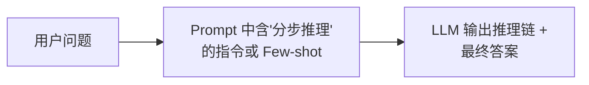

**关键点**：
1. **Zero-shot CoT**：直接在 prompt 中添加 "Let's think step by step"（让我们一步步思考），无需示例。
2. **Few-shot CoT**：提供几个包含完整推理步骤的示例，让模型模仿这种推理风格。
3. 推理步骤是**线性串行**的，每一步基于上一步的结论。

### 完整 Python 示例代码

#### 环境配置与客户端初始化

```python
"""
Chain-of-Thought (CoT) 思维链推理
对比：直接回答 vs Zero-shot CoT vs Few-shot CoT
"""

import os
from openai import OpenAI

client = OpenAI(
    api_key=os.environ.get("OPENAI_API_KEY", "your-api-key-here"),
    base_url=os.environ.get("OPENAI_BASE_URL", None),
)
```

#### CoT 推理函数

```python
def direct_answer(question: str, model: str = "gpt-4o") -> str:
    """直接提问，不引导推理过程"""
    response = client.chat.completions.create(
        model=model,
        messages=[
            {"role": "user", "content": f"Q: {question}\nA:"}
        ],
        temperature=0.0,
    )
    return response.choices[0].message.content


def zero_shot_cot(question: str, model: str = "gpt-4o") -> str:
    """Zero-shot CoT：在 prompt 中加上'让我们一步步思考'"""
    response = client.chat.completions.create(
        model=model,
        messages=[
            {
                "role": "user",
                "content": f"Q: {question}\n请一步一步地思考推理，最后给出答案。\nA: 让我们一步步思考。"
            }
        ],
        temperature=0.0,
    )
    return response.choices[0].message.content


def few_shot_cot(question: str, model: str = "gpt-4o") -> str:
    """Few-shot CoT：提供带推理过程的示例"""
    examples = """
Q: Roger有5个网球。他又买了2罐网球，每罐有3个网球。他现在有多少个网球？
A: Roger最初有5个网球。他又买了2罐，每罐3个，所以2×3=6个新网球。加上原来的5个，5+6=11。答案是11。

Q: 一个班级有23名学生，其中12名是男生。今天有3名男生和2名女生请假。今天来了多少名学生？
A: 总共有23名学生。男生12名，女生23-12=11名。请假：3名男生+2名女生=5名。今天到校：23-5=18名。答案是18。
"""

    response = client.chat.completions.create(
        model=model,
        messages=[
            {"role": "user", "content": f"{examples}\n\nQ: {question}\nA:"}
        ],
        temperature=0.0,
    )
    return response.choices[0].message.content
```

#### 主流程与演示

```python
if __name__ == "__main__":
    question = "一个农场有15只鸡和一些兔子。总共有46条腿。兔子有多少只？"

    print("=" * 60)
    print("【直接回答】")
    print(direct_answer(question))
    print()
    print("=" * 60)
    print("【Zero-shot CoT】")
    print(zero_shot_cot(question))
    print()
    print("=" * 60)
    print("【Few-shot CoT】")
    print(few_shot_cot(question))
```

### 代码要点说明

| 方法名 | 功能 | 关键参数/设计 |
|--------|------|---------------|
| `direct_answer` | 基线对照：直接提问，不引导推理过程 | `temperature=0.0`，prompt 仅 `Q:/A:` 结构 |
| `zero_shot_cot` | 零样本思维链：加"让我们一步步思考"触发分步推理 | `temperature=0.0`，prompt 末尾追加引导语 |
| `few_shot_cot` | 少样本思维链：提供带推理过程的示例引导 | 内置 2 个数学推理示例，`temperature=0.0` |

---

## 1.2 Tree of Thoughts (ToT) — 思维树

### 概念说明

**Tree of Thoughts（思维树）**是 CoT 的扩展，它将推理过程从一条"线"扩展为一棵"树"。模型在每个推理节点可以生成多个候选的"下一步思考方向"，然后用 BFS（广度优先搜索）或 DFS（深度优先搜索）探索这棵思维树，并通过**自我评估**剪枝低质量分支，最终找到最优的推理路径。

**类比理解**：CoT 是走一条直路到终点；ToT 是站在每个岔路口，先看看每条岔路通向哪里，选最有希望的那条走下去。就像下棋时的"多步推演"。

### 核心流程/原理

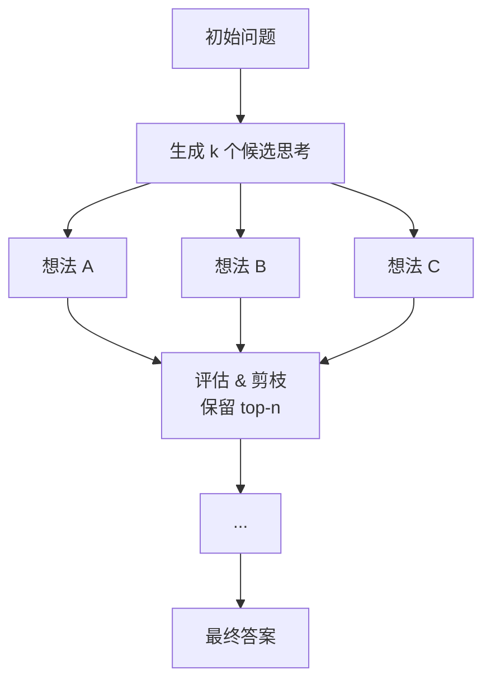

**关键步骤**：
1. **分解（Decompose）**：将当前思考状态拆分为多个候选的"下一步想法"。
2. **生成（Generate）**：对每个候选，让 LLM 生成该方向上的推进内容。
3. **评估（Evaluate）**：让 LLM 对每个候选想法打分或做质量判断。
4. **选择（Select）**：保留最有希望的几个分支（如 Top-3），继续下一轮。
5. **终止**：找到满足条件的完整推理路径，或达到最大深度。

### 完整 Python 示例代码

#### 环境配置与数据结构

```python
"""
Tree of Thoughts (ToT) 思维树推理
使用 BFS 探索多条推理路径，通过 LLM 自我评估进行剪枝
"""

import os
import json
from dataclasses import dataclass, field
from openai import OpenAI

client = OpenAI(
    api_key=os.environ.get("OPENAI_API_KEY", "your-api-key-here"),
    base_url=os.environ.get("OPENAI_BASE_URL", None),
)


@dataclass
class ThoughtNode:
    """思维树中的一个节点"""
    content: str
    score: float = 0.0
    children: list["ThoughtNode"] = field(default_factory=list)
    depth: int = 0
    parent: "ThoughtNode | None" = None
```

#### 候选想法生成

```python
def generate_thoughts(problem: str, context: str, num_thoughts: int = 3,
                      model: str = "gpt-4o") -> list[str]:
    """给定当前上下文，生成 k 个候选的下一步想法"""
    prompt = f"""你正在解决以下问题：
{problem}

当前的推理进展：
{context}

请生成 {num_thoughts} 个不同的下一步推理方向。每个方向应该是一个独立的、有逻辑的想法。
请以 JSON 列表格式输出，每个元素是一个字符串。只输出 JSON，不要其他内容。

示例输出格式：["想法1", "想法2", "想法3"]
"""
    response = client.chat.completions.create(
        model=model,
        messages=[{"role": "user", "content": prompt}],
        temperature=0.8,
    )
    raw = response.choices[0].message.content
    try:
        thoughts = json.loads(raw)
        return thoughts if isinstance(thoughts, list) else [raw]
    except json.JSONDecodeError:
        lines = [l.strip("- 1234567890. ") for l in raw.split("\n") if l.strip()]
        return lines[:num_thoughts]
```

#### 想法评分

```python
def evaluate_thoughts(problem: str, thoughts: list[str],
                      model: str = "gpt-4o") -> list[float]:
    """对每个候选想法打分（1-10），返回分数列表"""
    scores = []
    for thought in thoughts:
        prompt = f"""你正在解决以下问题：
{problem}

请评估以下推理步骤的质量和正确性，给出 1-10 的分数（10 为最高）：

推理步骤：{thought}

评分标准：
- 逻辑正确性（是否合理）
- 推进性（是否有助于解决问题）
- 清晰性（是否表达清楚）

请只回复一个数字（1-10），不要其他内容。"""
        response = client.chat.completions.create(
            model=model,
            messages=[{"role": "user", "content": prompt}],
            temperature=0.0,
        )
        raw = (response.choices[0].message.content or "").strip()
        try:
            score = float(raw) / 10.0
        except ValueError:
            score = 0.5
        scores.append(score)
    return scores
```

#### BFS 搜索算法

```python
def bfs_search(problem: str, max_depth: int = 3, beam_width: int = 2,
               num_thoughts: int = 3, model: str = "gpt-4o") -> ThoughtNode:
    """
    BFS 搜索思维树
    - max_depth: 最大搜索深度
    - beam_width: 每层保留的分支数
    - num_thoughts: 每个节点生成的候选数
    """
    root = ThoughtNode(content="开始解决问题", depth=0)

    current_layer = [root]

    for depth in range(1, max_depth + 1):
        all_candidates = []

        for node in current_layer:
            thoughts = generate_thoughts(
                problem=problem,
                context=node.content,
                num_thoughts=num_thoughts,
                model=model,
            )
            scores = evaluate_thoughts(problem, thoughts, model=model)

            for thought, score in zip(thoughts, scores):
                child = ThoughtNode(
                    content=thought,
                    score=score,
                    depth=depth,
                    parent=node,
                )
                node.children.append(child)
                all_candidates.append((child, node))

        all_candidates.sort(key=lambda x: x[0].score, reverse=True)

        current_layer = [c[0] for c in all_candidates[:beam_width]]

        print(f"\n=== 第 {depth} 层（保留 Top-{beam_width}） ===")
        for node in current_layer:
            print(f"  [分数: {node.score:.2f}] {node.content[:80]}...")

    if current_layer:
        return current_layer[0]
    return root
```

#### 答案综合与主流程

```python
def synthesize_answer(problem: str, best_path: str, model: str = "gpt-4o") -> str:
    """基于最优推理路径，综合生成最终答案"""
    prompt = f"""基于以下推理过程，给出问题的最终答案。

问题：{problem}

推理过程：
{best_path}

请总结推理过程并给出清晰的最终答案。"""
    response = client.chat.completions.create(
        model=model,
        messages=[{"role": "user", "content": prompt}],
        temperature=0.0,
    )
    return response.choices[0].message.content


def tree_of_thoughts(problem: str, model: str = "gpt-4o") -> str:
    """ToT 主流程"""
    print(f"\n{'='*60}")
    print(f"问题：{problem}")
    print(f"{'='*60}")

    best_node = bfs_search(problem=problem, max_depth=3, beam_width=2, model=model)

    path_parts = []
    node = best_node
    while node is not None:
        part = f"[深度 {node.depth}] {node.content}" if node.depth > 0 else f"[起始] {node.content}"
        path_parts.insert(0, part)
        node = node.parent
    full_path = "\n\n".join(path_parts)

    answer = synthesize_answer(problem, full_path, model=model)

    print(f"\n{'='*60}")
    print("最终答案：")
    print(answer)
    return answer
```

#### 主流程与演示

```python
if __name__ == "__main__":
    problem = "我需要用一根绳子围出一个面积最大的矩形区域，" \
              "但绳子只有20米长。我应该如何设计这个矩形？"

    result = tree_of_thoughts(problem)
```

### 代码要点说明

| 方法名 | 功能 | 关键参数/设计 |
|--------|------|---------------|
| `ThoughtNode` | 思维树节点数据结构 | dataclass，含 `content/score/children/depth/parent` |
| `generate_thoughts` | 给定上下文生成 k 个候选下一步想法 | `num_thoughts=3`，`temperature=0.8` 鼓励多样性，输出 JSON 数组 |
| `evaluate_thoughts` | 对候选想法打分（1-10 归一化为 0-1） | `temperature=0.0`，逐个评分，解析失败兜底 0.5 |
| `bfs_search` | BFS 搜索思维树，逐层剪枝保留 Top-K | `max_depth=3`、`beam_width=2`（束宽）、`num_thoughts=3` |
| `synthesize_answer` | 基于最优推理路径综合最终答案 | `temperature=0.0`，输入为最优路径文本 |
| `tree_of_thoughts` | ToT 主流程编排函数 | 串联 搜索→回溯最优路径→综合答案 |

---

## 1.3 Graph of Thoughts (GoT) — 思维图

### 概念说明

**Graph of Thoughts（思维图）**是 ToT 的进一步泛化。它将推理过程建模为**有向无环图（DAG）**，而不是树。在图结构中，不同的思维节点可以：
- **合并（Merge）**：将两条或多条推理路径的结论融合，产生更全面的想法。
- **拆分（Split）**：将一个想法拆成多个子方向分别探索。
- **回溯（Backtrack）**：如果发现当前方向走不通，可以回到之前的节点重新尝试。
- **跳跃（Jump）**：跨层引用之前的思维节点。

这与人类解决复杂问题时"画思维导图"的方式高度吻合——想法之间不是简单的父子关系，而是网状关联。

**类比理解**：ToT 是一棵树的枝杈，GoT 则像一张地铁线路图——站点之间可以交叉、汇合、分岔。

### 核心流程/原理

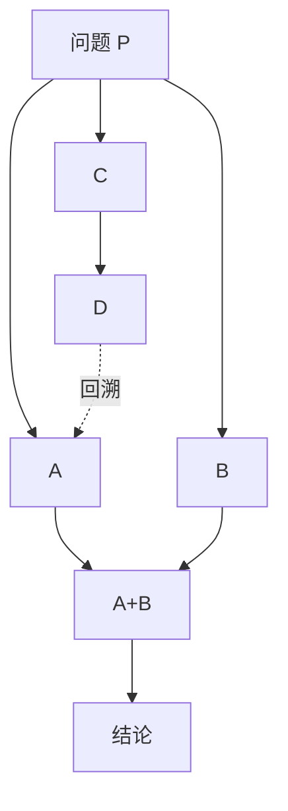

**关键操作**：
| 操作 | 说明 |
|------|------|
| **Generate** | 从一个节点生成 k 个后续想法 |
| **Aggregate/Merge** | 将多个节点的内容融合为一个综合想法 |
| **Refine** | 对某个想法进行优化和改进 |
| **Score** | 评估想法的质量 |
| **Backtrack** | 当某条路径评分过低时，回到上游节点重新尝试 |

### 完整 Python 示例代码

#### 环境配置与数据结构

```python
"""
Graph of Thoughts (GoT) 思维图推理
使用有向无环图（DAG）建模推理过程，支持合并、拆分、回溯
"""

import os
import json
from collections import defaultdict
from dataclasses import dataclass, field
from openai import OpenAI

client = OpenAI(
    api_key=os.environ.get("OPENAI_API_KEY", "your-api-key-here"),
    base_url=os.environ.get("OPENAI_BASE_URL", None),
)


@dataclass
class GoTNode:
    """思维图中的一个节点"""
    node_id: int
    content: str
    score: float = 0.0
    parents: list[int] = field(default_factory=list)  # 父节点 ID 列表
    children: list[int] = field(default_factory=list)  # 子节点 ID 列表
    operation: str = "generate"  # generate | merge | refine
```

#### 思维图引擎：初始化与辅助方法

```python
class GraphOfThoughts:
    """思维图引擎"""

    def __init__(self, problem: str, model: str = "gpt-4o"):
        self.problem = problem
        self.model = model
        self.nodes: dict[int, GoTNode] = {}
        self.next_id = 0
        self.root_id: int | None = None
        self.current_node_id: int | None = None

    def _new_id(self) -> int:
        nid = self.next_id
        self.next_id += 1
        return nid

    def _call_llm(self, prompt: str, temperature: float = 0.7) -> str:
        response = client.chat.completions.create(
            model=self.model,
            messages=[{"role": "user", "content": prompt}],
            temperature=temperature,
        )
        return (response.choices[0].message.content or "").strip()

    def initialize(self):
        """创建根节点——对问题的初步理解"""
        nid = self._new_id()
        prompt = f"请简要描述你对以下问题的理解和初步解决思路：\n\n{self.problem}"
        content = self._call_llm(prompt, temperature=0.3)
        self.nodes[nid] = GoTNode(node_id=nid, content=content, score=1.0)
        self.root_id = nid
        self.current_node_id = nid
        print(f"[根节点 #{nid}] {content[:100]}...")
        return nid
```

#### 思维图引擎：分支生成（Split）

```python
    def generate_thoughts(self, parent_id: int, num: int = 3) -> list[int]:
        """从某个节点分支出多个候选想法（Split 操作）"""
        parent = self.nodes[parent_id]
        prompt = f"""问题：{self.problem}

当前思考：{parent.content}

请生成 {num} 个不同的后续推理方向。每个方向应独立且有逻辑。
以 JSON 字符串数组格式输出，只输出 JSON。

示例：["方向1的描述", "方向2的描述", "方向3的描述"]
"""
        raw = self._call_llm(prompt, temperature=0.8)
        try:
            thoughts = json.loads(raw)
            if not isinstance(thoughts, list):
                thoughts = [raw]
        except json.JSONDecodeError:
            thoughts = [raw]

        new_ids = []
        for t in thoughts[:num]:
            nid = self._new_id()
            self.nodes[nid] = GoTNode(
                node_id=nid,
                content=t,
                parents=[parent_id],
                operation="generate",
            )
            self.nodes[parent_id].children.append(nid)
            new_ids.append(nid)
            print(f"  [分支 #{nid}] {t[:80]}...")

        return new_ids
```

#### 思维图引擎：合并与优化

```python
    def merge_thoughts(self, node_ids: list[int]) -> int:
        """将多个节点的想法合并为一个综合想法（Merge/Aggregate）"""
        contents = "\n---\n".join(
            f"想法{idx+1}: {self.nodes[nid].content}"
            for idx, nid in enumerate(node_ids)
        )
        prompt = f"""问题：{self.problem}

以下是多个不同的推理方向，请将它们整合为一个统一、全面的综合分析：

{contents}

请输出一个综合性的推理结论，要融合各方向的核心观点。"""
        merged_content = self._call_llm(prompt, temperature=0.3)

        nid = self._new_id()
        self.nodes[nid] = GoTNode(
            node_id=nid,
            content=merged_content,
            parents=list(node_ids),
            operation="merge",
        )
        for pid in node_ids:
            self.nodes[pid].children.append(nid)
        print(f"[合并节点 #{nid}] ← #{node_ids} | {merged_content[:100]}...")
        return nid

    def refine_thought(self, node_id: int) -> int:
        """对某个想法进行优化和改进（Refine）"""
        current = self.nodes[node_id]
        prompt = f"""问题：{self.problem}

当前想法：{current.content}

请对这个想法进行批判性审查和改进。指出潜在问题，并给出优化后的版本。"""
        refined_content = self._call_llm(prompt, temperature=0.3)

        nid = self._new_id()
        self.nodes[nid] = GoTNode(
            node_id=nid,
            content=refined_content,
            parents=[node_id],
            operation="refine",
        )
        self.nodes[node_id].children.append(nid)
        print(f"[优化节点 #{nid}] ← #{node_id} | {refined_content[:100]}...")
        return nid
```

#### 思维图引擎：评分与路径搜索

```python
    def score_node(self, node_id: int) -> float:
        """评估某个想法的质量分数 (0-1)"""
        node = self.nodes[node_id]
        prompt = f"""问题：{self.problem}

请评估以下推理内容的质量，给出 1-10 的分数。
只回复数字，不要其他内容。

推理内容：{node.content}"""
        raw = self._call_llm(prompt, temperature=0.0)
        try:
            score = float(raw.strip()) / 10.0
        except ValueError:
            score = 0.5
        self.nodes[node_id].score = score
        return score

    def get_best_path(self) -> list[int]:
        """获取当前图中得分最高叶子节点到根的路径。

        注意：GoT 的 Merge 操作会产生多父节点，因此"最优路径"实际是一棵
        子树（包含所有贡献过该叶子节点的祖先）。这里用 BFS 收集全部祖先，
        再按 node_id 升序返回（node_id 近似拓扑序），保证 synthesize 时
        不会遗漏 Merge 节点的任一输入分支。
        """
        scored = [(nid, node.score) for nid, node in self.nodes.items()]
        scored.sort(key=lambda x: x[1], reverse=True)

        best_leaf = scored[0][0]
        # BFS 收集 best_leaf 的所有祖先（含自身）
        ancestors = set()
        queue = [best_leaf]
        while queue:
            current = queue.pop(0)
            if current in ancestors:
                continue
            ancestors.add(current)
            for parent in self.nodes[current].parents:
                if parent not in ancestors:
                    queue.append(parent)
        # 按 node_id 升序排列，保证根节点在前、叶子在后
        return sorted(ancestors)
```

#### 思维图引擎：答案综合与可视化

```python
    def synthesize(self, node_ids: list[int]) -> str:
        """根据路径上的所有节点综合最终答案"""
        contents = "\n\n".join(
            f"[步骤 {i+1}] {self.nodes[nid].content}"
            for i, nid in enumerate(node_ids)
        )
        prompt = f"""基于以下推理过程，给出问题的最终答案。

问题：{self.problem}

推理过程：
{contents}

请总结并给出清晰、完整的最终答案。"""
        return self._call_llm(prompt, temperature=0.0)

    def print_graph(self):
        """打印图结构概览"""
        print(f"\n{'='*60}")
        print("思维图结构：")
        print(f"{'='*60}")
        for nid, node in self.nodes.items():
            op_symbol = {
                "generate": "→",
                "merge": "⊕",
                "refine": "↻",
            }.get(node.operation, "?")
            print(f"  [{op_symbol}] #{nid} (score={node.score:.2f}) "
                  f"parents={node.parents} children={node.children}")
            print(f"       {node.content[:80]}...")
```

#### GoT 演示函数

```python
def graph_of_thoughts_demo(problem: str):
    """GoT 完整流程演示"""
    got = GraphOfThoughts(problem)

    print("\n" + "=" * 60)
    print(f"问题：{problem}")
    print("=" * 60)

    # Step 1: 初始化
    print("\n>>> Step 1: 初始化根节点")
    root_id = got.initialize()

    # Step 2: 从根节点拆分为多个方向
    print("\n>>> Step 2: 拆分（Split）— 生成多个推理方向")
    branch_ids = got.generate_thoughts(root_id, num=3)

    # Step 3: 对每个分支评分
    print("\n>>> Step 3: 评分")
    for bid in branch_ids:
        s = got.score_node(bid)
        print(f"  分支 #{bid} 得分: {s:.2f}")

    # Step 4: 合并前两个分支
    print("\n>>> Step 4: 合并（Merge）— 融合高分分支")
    merged_id = got.merge_thoughts(branch_ids[:2])

    # Step 5: 优化合并结果
    print("\n>>> Step 5: 优化（Refine）— 改进合并后的想法")
    refined_id = got.refine_thought(merged_id)

    # Step 6: 从优化节点再拆分
    print("\n>>> Step 6: 再次拆分 — 从优化节点展开")
    final_branches = got.generate_thoughts(refined_id, num=2)

    # 评分
    for bid in final_branches:
        s = got.score_node(bid)
        print(f"  分支 #{bid} 得分: {s:.2f}")

    # Step 7: 获取最优路径并综合
    print("\n>>> Step 7: 综合最终答案")
    best_path = got.get_best_path()
    answer = got.synthesize(best_path)

    got.print_graph()

    print(f"\n{'='*60}")
    print("最终答案：")
    print(answer)
    return answer
```

#### 主流程与演示

```python
if __name__ == "__main__":
    problem = "一家公司计划推出一款新产品。市场调研显示有60%的概率成功，" \
              "成功可获利200万元；失败则亏损80万元。此外，可以先花15万元" \
              "做一次更详细的市场测试，测试有90%准确率。公司应该做测试吗？"

    graph_of_thoughts_demo(problem)
```

### 代码要点说明

| 方法名 | 功能 | 关键参数/设计 |
|--------|------|---------------|
| `GoTNode` | 思维图节点数据结构 | dataclass，含 `node_id/content/score/parents/children/operation`，`operation` 标记 generate/merge/refine |
| `GraphOfThoughts.initialize` | 创建根节点，对问题做初步理解 | `temperature=0.3`，根节点 score=1.0 |
| `GraphOfThoughts.generate_thoughts` | Split 操作：从节点分支出多个候选方向 | `num=3`，`temperature=0.8`，输出 JSON 数组 |
| `GraphOfThoughts.merge_thoughts` | Merge 操作：将多节点想法整合为综合结论 | `temperature=0.3`，parents 为多节点列表 |
| `GraphOfThoughts.refine_thought` | Refine 操作：对想法批判性审查并改进 | `temperature=0.3`，单父节点 |
| `GraphOfThoughts.score_node` | 评估节点质量分数（0-1） | `temperature=0.0`，解析失败兜底 0.5 |
| `GraphOfThoughts.get_best_path` | 回溯得分最高叶子节点的所有祖先 | BFS 收集多父节点（Merge）的全部祖先，按 node_id 升序返回 |
| `GraphOfThoughts.synthesize` | 沿最优路径节点综合最终答案 | `temperature=0.0` |
| `graph_of_thoughts_demo` | GoT 完整流程演示编排 | 串联 初始化→拆分→评分→合并→优化→再拆分→综合 |

---

## 1.4 Self-Consistency — 自洽性

### 概念说明

**Self-Consistency（自洽性/自一致性）**是一种简单而强大的推理增强方法。它的核心思想是：**同一个问题让模型推理多次（使用较高的 temperature 产生多样性），然后对多个推理结果取多数投票**。

这利用了 LLM 的随机性——在 temperature > 0 时，每次生成的推理路径可能不同。通过采样多条路径并比较它们的最终答案，答案的一致程度可以作为置信度的指标，多数派答案通常更可靠。

**类比理解**：就像做选择题时，找多位专家分别独立作答，然后"少数服从多数"——多数人认可的答案出错概率更低。

### 核心流程/原理

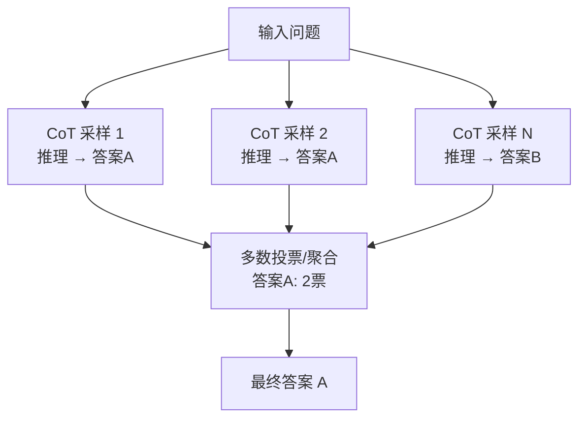

**关键设计**：
1. 必须使用 **temperature > 0**（通常 0.5~0.8）以产生多样性。
2. 每条推理路径必须是**完整的 CoT 推理 + 答案**，而不仅仅是答案。
3. 投票时，只比较**最终答案**，推理过程可以不同。
4. 采样次数通常为 5~20 次，越多越稳定但成本越高。

### 完整 Python 示例代码

#### 环境配置与客户端初始化

```python
"""
Self-Consistency 自洽性推理
多次 CoT 采样 → 提取答案 → 多数投票
"""

import os
import re
from collections import Counter
from openai import OpenAI

client = OpenAI(
    api_key=os.environ.get("OPENAI_API_KEY", "your-api-key-here"),
    base_url=os.environ.get("OPENAI_BASE_URL", None),
)
```

#### CoT 采样与答案提取

```python
def cot_sample(question: str, model: str = "gpt-4o",
               temperature: float = 0.7) -> str:
    """单次 CoT 采样，返回完整推理+答案"""
    response = client.chat.completions.create(
        model=model,
        messages=[
            {
                "role": "user",
                "content": f"""请一步一步地仔细推理以下问题，最后在单独一行给出最终答案，
格式为：最终答案：<你的答案>

问题：{question}"""
            }
        ],
        temperature=temperature,
    )
    return response.choices[0].message.content


def extract_answer(reasoning_text: str) -> str:
    """从推理文本中提取最终答案"""
    patterns = [
        r"最终答案[：:]\s*(.+)",
        r"答案[：:]\s*(.+)",
        r"所以[,，]?\s*(.+)",
        r"[Tt]he answer is\s*(.+)",
        r"[Aa]nswer[：:]\s*(.+)",
    ]
    lines = reasoning_text.strip().split("\n")
    # 从最后几行查找
    for line in reversed(lines):
        for pat in patterns:
            m = re.search(pat, line)
            if m:
                return m.group(1).strip()
    # 兜底：返回最后一行
    return lines[-1].strip() if lines else reasoning_text.strip()
```

#### 自洽性主流程

```python
def self_consistency(question: str, num_samples: int = 5,
                     model: str = "gpt-4o", temperature: float = 0.7) -> dict:
    """
    Self-Consistency 主流程
    返回：最终答案、投票分布、所有采样结果
    """
    print(f"问题：{question}\n")
    print(f"进行 {num_samples} 次独立推理采样...\n")

    all_answers = []
    all_reasonings = []

    for i in range(num_samples):
        print(f"--- 采样 {i+1}/{num_samples} ---")
        reasoning = cot_sample(question, model=model, temperature=temperature)
        answer = extract_answer(reasoning)
        all_reasonings.append(reasoning)
        all_answers.append(answer)
        print(f"  推理摘要: {reasoning[:100]}...")
        print(f"  提取答案: {answer}\n")

    # 投票统计
    vote_counts = Counter(all_answers)

    print("=" * 50)
    print("投票结果：")
    for ans, count in vote_counts.most_common():
        bar = "█" * count
        print(f"  {ans:<20} {bar} ({count}票)")

    winner = vote_counts.most_common(1)[0][0]
    confidence = vote_counts[winner] / num_samples

    print(f"\n最终答案：{winner}")
    print(f"置信度：{confidence:.0%} ({vote_counts[winner]}/{num_samples})")

    return {
        "final_answer": winner,
        "confidence": confidence,
        "vote_distribution": dict(vote_counts),
        "all_reasonings": all_reasonings,
        "all_answers": all_answers,
    }
```

#### 主流程与演示

```python
if __name__ == "__main__":
    question = """一个袋子里有3个红球、2个蓝球和5个绿球。
随机取出2个球（不放回），两个球颜色相同的概率是多少？
请用最简分数表示。"""

    result = self_consistency(question, num_samples=5, temperature=0.7)
```

### 代码要点说明

| 方法名 | 功能 | 关键参数/设计 |
|--------|------|---------------|
| `cot_sample` | 单次 CoT 采样，返回完整推理+答案 | `temperature=0.7`（高温保证多样性），要求末行输出"最终答案：" |
| `extract_answer` | 从推理文本中正则提取最终答案 | 内置 5 个正则模式，从末尾行倒序匹配，兜底返回最后一行 |
| `self_consistency` | 自洽性主流程：多次采样+多数投票 | `num_samples=5`、`temperature=0.7`，用 `Counter` 统计，置信度=票数/总采样数 |

---

## 1.5 Program of Thoughts (PoT) — 程序化思维

### 概念说明

**Program of Thoughts（程序化思维）**是一种让 LLM 用**可执行代码**来表达推理过程的方法。与 CoT 用自然语言推理不同，PoT 让模型生成代码（通常是 Python）来描述解题逻辑，然后将代码交给**外部解释器**执行，最终用执行结果回答问题。

这种方法的优势在于：
1. **精确性**：数学计算、逻辑推理由代码保证，而非依赖 LLM 的"心算"（LLM 在数字计算上并不擅长）。
2. **可验证性**：代码可以实际运行和测试，如果出错可以调试。
3. **分工明确**：LLM 负责"理解问题并设计算法"（创造性），解释器负责"执行计算"（精确性）。

**类比理解**：就像一个数学家遇到复杂计算时——他会设计公式（LLM 的角色），然后用计算器算结果（解释器的角色）。

### 核心流程/原理

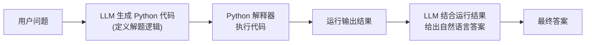

**关键步骤**：
1. LLM 分析问题，生成解决该问题的 Python 代码。
2. 从 LLM 的输出中提取代码块。
3. 用 `exec()` 或 `subprocess` 安全地执行代码，捕获输出。
4. 将执行结果反馈回 LLM，让它用自然语言整合答案。

### 完整 Python 示例代码

#### 环境配置与客户端初始化

```python
"""
Program of Thoughts (PoT) 程序化思维
LLM 生成代码 → 解释器执行 → 返回结果
"""

import os
import re
import io
import sys
from openai import OpenAI

client = OpenAI(
    api_key=os.environ.get("OPENAI_API_KEY", "your-api-key-here"),
    base_url=os.environ.get("OPENAI_BASE_URL", None),
)
```

#### 代码生成与提取

```python
def generate_code(question: str, model: str = "gpt-4o") -> str:
    """让 LLM 生成解决该问题的 Python 代码"""
    prompt = f"""你是一个擅长用 Python 编程解决数学和逻辑问题的专家。

请为解决以下问题编写 Python 代码。代码应该：
1. 定义清晰的变量和计算逻辑
2. 使用 print() 输出关键中间结果和最终答案
3. 只输出纯 Python 代码，放在 ```python ``` 代码块中
4. 不要使用任何需要安装的外部库

问题：{question}

请直接输出 Python 代码。"""
    response = client.chat.completions.create(
        model=model,
        messages=[{"role": "user", "content": prompt}],
        temperature=0.0,
    )
    return response.choices[0].message.content


def extract_code(response: str) -> str:
    """从 LLM 响应中提取 Python 代码块"""
    # 尝试匹配 ```python ... ``` 代码块
    pattern = r"```python\s*\n(.*?)```"
    matches = re.findall(pattern, response, re.DOTALL)
    if matches:
        return "\n\n".join(matches)

    # 尝试匹配 ``` ... ``` 代码块
    pattern = r"```\s*\n(.*?)```"
    matches = re.findall(pattern, response, re.DOTALL)
    if matches:
        return "\n\n".join(matches)

    # 没有代码块标记，返回全部内容
    return response
```

#### 安全代码执行

```python
# 安全的内置函数白名单（PoT 只需数学和基本数据结构操作）
SAFE_BUILTINS = {
    'print': print, 'len': len, 'range': range, 'sum': sum,
    'min': min, 'max': max, 'abs': abs, 'round': round,
    'int': int, 'float': float, 'str': str, 'list': list,
    'dict': dict, 'tuple': tuple, 'set': set, 'bool': bool,
    'enumerate': enumerate, 'zip': zip, 'map': map, 'filter': filter,
    'sorted': sorted, 'reversed': reversed, 'type': type,
    'isinstance': isinstance, 'divmod': divmod, 'pow': pow,
}

def execute_code(code: str) -> str:
    """安全地执行 Python 代码并捕获输出（白名单沙箱）"""
    stdout_capture = io.StringIO()
    stderr_capture = io.StringIO()
    old_stdout = sys.stdout
    old_stderr = sys.stderr
    sys.stdout = stdout_capture
    sys.stderr = stderr_capture

    local_vars = {}

    try:
        exec(code, {"__builtins__": SAFE_BUILTINS}, local_vars)
        output = stdout_capture.getvalue()
        error_output = stderr_capture.getvalue()
    except Exception as e:
        output = ""
        error_output = f"执行错误: {type(e).__name__}: {e}"
    finally:
        sys.stdout = old_stdout
        sys.stderr = old_stderr

    if error_output and not output:
        return f"[错误] {error_output}"

    if output:
        return output
    return str(local_vars.get("result", "代码执行完毕，未打印输出"))
```

#### 结果综合

```python
def synthesize_result(question: str, code: str,
                      execution_output: str, model: str = "gpt-4o") -> str:
    """结合代码和执行结果，让 LLM 生成最终的自然语言答案"""
    prompt = f"""基于以下信息，给出问题的最终答案。

问题：{question}

执行的 Python 代码：
{code}

代码运行输出：
{execution_output}

请根据运行输出，用自然语言清晰地给出最终答案。"""
    response = client.chat.completions.create(
        model=model,
        messages=[{"role": "user", "content": prompt}],
        temperature=0.0,
    )
    return response.choices[0].message.content
```

#### PoT 主流程

```python
def program_of_thoughts(question: str, model: str = "gpt-4o",
                        max_retries: int = 3) -> str:
    """PoT 主流程，带重试机制"""
    print(f"问题：{question}\n")

    for attempt in range(1, max_retries + 1):
        print(f"{'='*50}")
        print(f"第 {attempt} 次尝试")
        print(f"{'='*50}")

        # Step 1: 生成代码
        raw_response = generate_code(question, model=model)
        code = extract_code(raw_response)
        print(f"\n生成的代码：\n{'-'*30}\n{code}\n{'-'*30}")

        # Step 2: 执行代码
        print("\n执行结果：")
        output = execute_code(code)
        print(output)

        # Step 3: 检查是否有错误
        if output.startswith("[错误]"):
            print(f"\n代码执行出错，准备重试...")
            continue

        # Step 4: 综合答案
        print("\n综合答案：")
        answer = synthesize_result(question, code, output, model=model)
        print(answer)
        return answer

    return "多次尝试后仍无法得到正确结果，请手动检查问题。"
```

#### 主流程与演示

```python
if __name__ == "__main__":
    # 示例1: 数学计算
    question1 = """小明有1200元，他想买一些书。一本书原价85元，现在打8折。
    如果运费是每单5元，他最多能买几本书？"""

    print("\n" * 2)
    program_of_thoughts(question1)

    # 示例2: 复杂逻辑
    question2 = """一个三位数，它的百位数字是十位数字的2倍，
    个位数字比十位数字多3。交换百位和个位后，
    新数比原数小198。求这个三位数。"""

    print("\n" * 2)
    program_of_thoughts(question2)
```

### 代码要点说明

| 方法名 | 功能 | 关键参数/设计 |
|--------|------|---------------|
| `generate_code` | 让 LLM 生成解决问题的 Python 代码 | `temperature=0.0`，要求纯 Python 代码块、禁用外部库 |
| `extract_code` | 从 LLM 响应中提取 Python 代码块 | 优先匹配 `python` 代码块，退而匹配普通代码块，兜底返回全文 |
| `execute_code` | 安全执行代码并捕获输出（白名单沙箱） | `SAFE_BUILTINS` 白名单限制内置函数，重定向 stdout/stderr 捕获输出 |
| `synthesize_result` | 结合代码和执行结果生成自然语言答案 | `temperature=0.0`，输入含代码与运行输出 |
| `program_of_thoughts` | PoT 主流程，带重试机制 | `max_retries=3`，执行出错则重试，成功后综合答案 |

---

## 1.6 Step-Back Prompting — 退一步提示

### 概念说明

**Step-Back Prompting（退一步提示）**是一种两阶段推理策略：先让模型"退一步"，抽象出问题背后的**通用原理、概念或规则**；然后基于这些抽象知识，回到具体问题上进行推理。

很多复杂问题的答案依赖于某些"基础知识"，如果直接进行具体推理，模型可能因为陷入细节而犯错。退一步之后，模型可以先激活相关知识，再在正确的知识框架下推导具体答案。

**类比理解**：好比做物理题时，不直接套公式计算，而是先问自己"这道题考察的是什么物理定律？"，想清楚原理后再动笔。

### 核心流程/原理

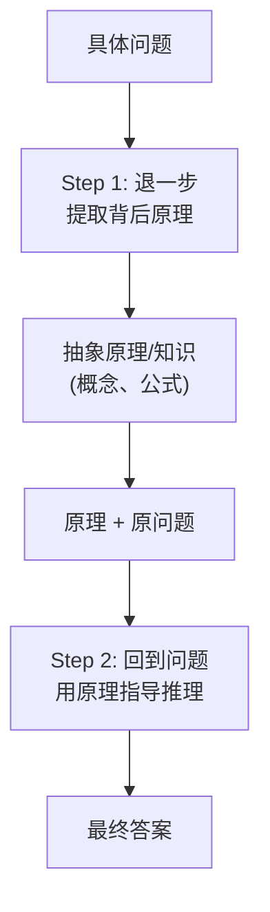

**两个阶段**：
1. **抽象阶段（Abstraction/Step-Back）**：从原始问题中提取更高层次的概念或原理性问题。例如不是问"这个场景下物体受什么力？"而是问"力的合成与分解的基本原理是什么？"
2. **推理阶段（Reasoning）**：将第一步的抽象结论作为上下文，重新审视原始问题并给出推理和答案。

### 完整 Python 示例代码

#### 环境配置与客户端初始化

```python
"""
Step-Back Prompting 退一步提示
Step 1: 提取抽象原理
Step 2: 用原理指导具体推理
"""

import os
from openai import OpenAI

client = OpenAI(
    api_key=os.environ.get("OPENAI_API_KEY", "your-api-key-here"),
    base_url=os.environ.get("OPENAI_BASE_URL", None),
)
```

#### 退一步：抽象提问与原理提取

```python
def step_back_question(original_question: str, model: str = "gpt-4o") -> str:
    """Step 1: 退一步——生成更高层次的抽象问题"""
    prompt = f"""请仔细阅读以下具体问题。不要回答它，而是"退一步"思考：
这个问题背后涉及的更通用、更根本的概念或原理是什么？

请用 1-2 句话提出一个更高层次的"退一步问题"（step-back question），
它应该涵盖解决原问题所需的核心原理或知识。

具体问题：{original_question}

退一步问题："""
    response = client.chat.completions.create(
        model=model,
        messages=[{"role": "user", "content": prompt}],
        temperature=0.3,
    )
    return (response.choices[0].message.content or "").strip()


def answer_abstract_question(step_back_q: str, model: str = "gpt-4o") -> str:
    """回答退一步问题——提取抽象原理"""
    prompt = f"""请清晰、详细地回答以下原理性问题。你的回答将成为解决具体问题的理论基础。

问题：{step_back_q}

请给出详细解释："""
    response = client.chat.completions.create(
        model=model,
        messages=[{"role": "user", "content": prompt}],
        temperature=0.0,
    )
    return (response.choices[0].message.content or "").strip()
```

#### 基于原理的具体推理

```python
def answer_with_principles(original_question: str, step_back_q: str,
                           principles: str, model: str = "gpt-4o") -> str:
    """Step 2: 用原理指导，回答原始问题"""
    prompt = f"""以下是你在解决具体问题之前建立的理论基础：

---
【退一步问题】
{step_back_q}

【抽象原理/知识】
{principles}
---

现在，请运用上述原理，一步一步地推理并回答以下具体问题：

【具体问题】
{original_question}

请先说明你使用了哪些原理，再逐步推理，最后给出答案。"""
    response = client.chat.completions.create(
        model=model,
        messages=[{"role": "user", "content": prompt}],
        temperature=0.0,
    )
    return (response.choices[0].message.content or "").strip()
```

#### Step-Back 主流程

```python
def step_back_prompting(question: str, model: str = "gpt-4o") -> dict:
    """Step-Back Prompting 完整流程"""
    print(f"{'='*60}")
    print(f"原始问题：{question}")
    print(f"{'='*60}")

    # Step 1a: 退一步，生成抽象问题
    print("\n>>> Step 1a: 生成退一步问题")
    sb_question = step_back_question(question, model=model)
    print(f"退一步问题：{sb_question}")

    # Step 1b: 回答抽象问题
    print("\n>>> Step 1b: 回答退一步问题（提取原理）")
    principles = answer_abstract_question(sb_question, model=model)
    print(f"抽象原理摘要：{principles[:150]}...")

    # Step 2: 用原理回答原始问题
    print("\n>>> Step 2: 基于原理回答原始问题")
    final_answer = answer_with_principles(question, sb_question,
                                          principles, model=model)

    print(f"\n{'='*60}")
    print("最终答案：")
    print(final_answer)

    return {
        "original_question": question,
        "step_back_question": sb_question,
        "principles": principles,
        "final_answer": final_answer,
    }
```

#### 主流程与演示

```python
if __name__ == "__main__":
    # 示例1: 科学问题
    question1 = "为什么在海边白天风从海面吹向陆地，晚上风从陆地吹向海面？"
    step_back_prompting(question1)

    print("\n\n")

    # 示例2: 数学问题
    question2 = "一个水槽有两个进水管和一个排水管。A管3小时注满，" \
                "B管5小时注满；排水管4小时排空。三管同时开，多久注满？"
    step_back_prompting(question2)
```

### 代码要点说明

| 方法名 | 功能 | 关键参数/设计 |
|--------|------|---------------|
| `step_back_question` | Step 1a：生成更高层次的抽象"退一步问题" | `temperature=0.3`，不回答原问题，只提炼原理性提问 |
| `answer_abstract_question` | Step 1b：回答退一步问题，提取抽象原理 | `temperature=0.0`，输出作为后续推理的理论基础 |
| `answer_with_principles` | Step 2：运用原理逐步推理回答原始问题 | `temperature=0.0`，prompt 注入退一步问题+原理 |
| `step_back_prompting` | Step-Back 完整流程编排 | 两阶段：抽象提问→提取原理→原理指导具体推理 |

---

## 1.7 Least-to-Most — 从易到难

### 概念说明

**Least-to-Most（从易到难）**是一种将复杂问题分解为子问题层次结构的策略。它分两个阶段：

1. **分解阶段（Decomposition）**：让 LLM 将复杂问题拆分为一系列递增难度的子问题。
2. **求解阶段（Solving）**：按顺序逐个求解子问题，每个子问题的解答都以前面子问题的答案为上下文。

与 CoT 的区别在于：CoT 在一次推理中完成全部思考，而 Least-to-Most 是显式地、结构化地拆分子问题——子问题之间有明确的依赖关系，后续子问题的求解明确依赖前面子问题的答案。

**类比理解**：就像教一个孩子解复杂数学题——不直接让他做整道题，而是拆成"A 你知道什么？""B 你需要求什么？""C 第一步算什么？"... 一步步引导。

### 核心流程/原理

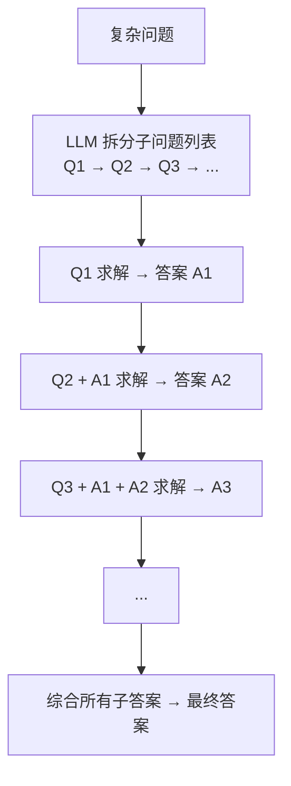

**关键特点**：
- 子问题按**依赖关系排序**，不是简单地按难度排序。
- 每个子问题求解时，prompt 中显式引用前面子问题的答案。
- 适用于"不分解就难以一步解决"的复杂推理任务。

### 完整 Python 示例代码

#### 环境配置与客户端初始化

```python
"""
Least-to-Most 从易到难推理
阶段1: 拆分子问题
阶段2: 顺序求解子问题，逐步逼近最终答案
"""

import os
import json
from openai import OpenAI

client = OpenAI(
    api_key=os.environ.get("OPENAI_API_KEY", "your-api-key-here"),
    base_url=os.environ.get("OPENAI_BASE_URL", None),
)
```

#### 问题分解

```python
def decompose_problem(problem: str, model: str = "gpt-4o") -> list[str]:
    """阶段1: 将复杂问题拆分为子问题列表"""
    prompt = f"""请将以下复杂问题分解为若干个更小、更简单的子问题。
子问题应该按解决顺序排列，后面的子问题可能依赖前面子问题的答案。

请以 JSON 字符串数组格式输出子问题列表，只输出 JSON。

复杂问题：{problem}

示例输出：["子问题1", "子问题2", "子问题3"]
"""
    response = client.chat.completions.create(
        model=model,
        messages=[{"role": "user", "content": prompt}],
        temperature=0.0,
    )
    raw = (response.choices[0].message.content or "").strip()
    try:
        sub_questions = json.loads(raw)
        if isinstance(sub_questions, list):
            return sub_questions
    except json.JSONDecodeError:
        pass

    # 兜底解析：按行分割
    lines = [l.strip("- 1234567890.（）() ") for l in raw.split("\n")
             if l.strip() and ("?" in l or "？" in l)]
    return lines if lines else [raw]
```

#### 子问题求解

```python
def solve_sub_question(sub_question: str, previous_context: str = "",
                       model: str = "gpt-4o") -> str:
    """求解单个子问题，可传入之前子问题的答案作为上下文"""
    context_block = ""
    if previous_context:
        context_block = f"""已知信息（前面子问题的答案）：
{previous_context}

"""

    prompt = f"""{context_block}请回答以下子问题，给出清晰的推理步骤和答案。

子问题：{sub_question}

答案："""
    response = client.chat.completions.create(
        model=model,
        messages=[{"role": "user", "content": prompt}],
        temperature=0.0,
    )
    return (response.choices[0].message.content or "").strip()
```

#### 答案综合

```python
def synthesize_final_answer(problem: str, sub_answers: list[dict],
                            model: str = "gpt-4o") -> str:
    """综合所有子问题答案，给出最终回答"""
    qa_pairs = "\n\n".join(
        f"子问题 {i+1}: {qa['question']}\n答案: {qa['answer']}"
        for i, qa in enumerate(sub_answers)
    )

    prompt = f"""基于以下子问题和答案，给出原始问题的最终完整答案。

原始问题：{problem}

子问题求解记录：
{qa_pairs}

请整合以上信息，给出原始问题的清晰、完整的最终答案。"""
    response = client.chat.completions.create(
        model=model,
        messages=[{"role": "user", "content": prompt}],
        temperature=0.0,
    )
    return (response.choices[0].message.content or "").strip()
```

#### Least-to-Most 主流程

```python
def least_to_most(problem: str, model: str = "gpt-4o") -> dict:
    """Least-to-Most 完整流程"""
    print(f"{'='*60}")
    print(f"原始问题：{problem}")
    print(f"{'='*60}")

    # 阶段1: 分解
    print("\n>>> 阶段1: 分解子问题")
    sub_questions = decompose_problem(problem, model=model)
    for i, sq in enumerate(sub_questions):
        print(f"  子问题 {i+1}: {sq}")

    # 阶段2: 顺序求解
    print("\n>>> 阶段2: 顺序求解子问题")
    sub_answers = []
    accumulated_context = ""

    for i, sq in enumerate(sub_questions):
        print(f"\n--- 求解子问题 {i+1} ---")
        answer = solve_sub_question(sq, accumulated_context, model=model)
        print(f"答案: {answer[:120]}...")

        sub_answers.append({"question": sq, "answer": answer})

        # 累积上下文
        accumulated_context += f"\n子问题 {i+1}: {sq}\n答案: {answer}\n"

    # 综合
    print("\n>>> 综合最终答案")
    final_answer = synthesize_final_answer(problem, sub_answers, model=model)

    print(f"\n{'='*60}")
    print("最终答案：")
    print(final_answer)

    return {
        "problem": problem,
        "sub_questions": sub_questions,
        "sub_answers": sub_answers,
        "final_answer": final_answer,
    }
```

#### 主流程与演示

```python
if __name__ == "__main__":
    problem = """某城市的公交系统如下：
    - 线路A每10分钟一班，从首站到末站需25分钟
    - 线路B每15分钟一班，从首站到末站需40分钟
    - 线路C每20分钟一班，从首站到末站需30分钟

    张三早上8:00随机到达线路A首站（线路A、B共享首站），
    他要去线路C的末站（可以在线路B末站换乘线路C）。
    问他平均需要多少时间才能到达目的地？

    提示：需要考虑每条线路的等待时间。"""

    least_to_most(problem)
```

### 代码要点说明

| 方法名 | 功能 | 关键参数/设计 |
|--------|------|---------------|
| `decompose_problem` | 阶段1：将复杂问题拆分为有序子问题列表 | `temperature=0.0`，输出 JSON 数组，解析失败按行兜底 |
| `solve_sub_question` | 阶段2：求解单个子问题，可传入前序答案作上下文 | `previous_context` 累积前序答案，`temperature=0.0` |
| `synthesize_final_answer` | 综合所有子问题答案给出最终回答 | `temperature=0.0`，拼接全部 QA 对作为依据 |
| `least_to_most` | Least-to-Most 完整流程编排 | 分解→顺序求解（累积上下文）→综合，子问题按依赖顺序求解 |

---

## 1.8 Analog Prompting — 类比提示

### 概念说明

**Analog Prompting（类比提示）**是一种让模型**自己生成类比案例来辅助推理**的方法。在解决一个问题之前，先让模型生成几个与之类似但更简单或更熟悉的问题及其解答，然后借鉴这些类比案例的推理模式来解决原始问题。

与传统的 Few-shot（由人类提供示例）不同，Analog Prompting 的类比案例是**模型自生成的**，不需要人工标注。这种"生成-借鉴"的机制特别适合那些没有现成示例的罕见或新颖问题。

**类比理解**：就像你在工作中遇到一个没见过的问题时，会先想"这和我以前解决过的什么问题类似？当时是怎么做的？"——自己在大脑中搜索类比案例。

### 核心流程/原理

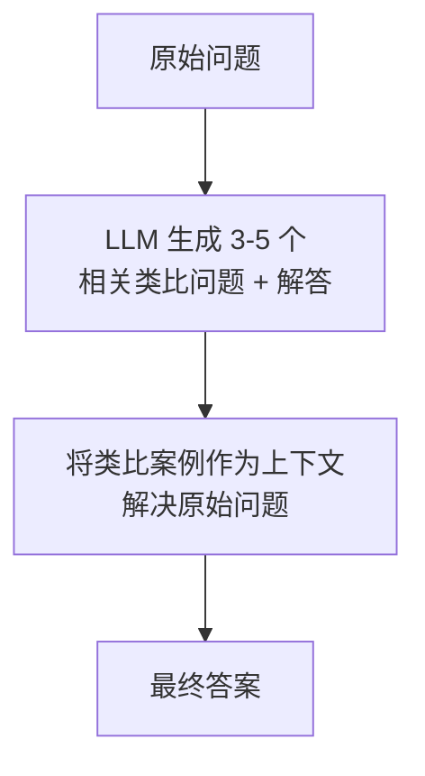

**关键设计**：
- 类比案例必须和原问题**在结构上有相似性**（同类型的推理路径），而不只是表面的主题相似。
- 类比案例的解答要包含完整的推理过程，这样模型才能"学习方法"而不仅仅是"看答案"。

### 完整 Python 示例代码

#### 环境配置与客户端初始化

```python
"""
Analog Prompting 类比提示
Step 1: 模型自生成类比案例及解答
Step 2: 借鉴类比案例的推理模式解决原始问题
"""

import os
from openai import OpenAI

client = OpenAI(
    api_key=os.environ.get("OPENAI_API_KEY", "your-api-key-here"),
    base_url=os.environ.get("OPENAI_BASE_URL", None),
)
```

#### 类比案例生成

```python
def generate_analogies(problem: str, num_analogies: int = 3,
                       model: str = "gpt-4o") -> list[dict]:
    """Step 1: 让模型自生成与问题结构相似的类比案例"""
    prompt = f"""请仔细分析以下问题的核心结构和推理类型。

原始问题：{problem}

请生成 {num_analogies} 个与原始问题具有相似推理结构的类比问题。
注意：重点不是话题相似，而是解决问题所需的推理步骤和逻辑结构相似。

对每个类比问题，请提供：
1. 类比问题的完整描述
2. 详细的逐步推理过程
3. 最终答案

请按以下格式输出每个类比案例：

### 类比案例 1
**问题**：[类比问题描述]
**推理**：[详细推理过程]
**答案**：[最终答案]

### 类比案例 2
...
"""
    response = client.chat.completions.create(
        model=model,
        messages=[{"role": "user", "content": prompt}],
        temperature=0.7,
    )
    content = response.choices[0].message.content or ""

    # 解析类比案例：按 "### 类比案例" 分段，每段内按 "**字段**" 收集
    # 注意：推理过程可能跨多行，需累积到下一个字段标记为止
    analogies = []
    sections = content.split("### 类比案例")
    for section in sections[1:]:  # 跳过第一个空分段
        analogy = {}
        current_field = None  # 当前正在累积的字段
        for line in section.split("\n"):
            stripped = line.strip()
            if stripped.startswith("**问题**"):
                current_field = "problem"
                analogy[current_field] = stripped.replace("**问题**", "").strip("：: ")
            elif stripped.startswith("**推理**"):
                current_field = "reasoning"
                analogy[current_field] = stripped.replace("**推理**", "").strip("：: ")
            elif stripped.startswith("**答案**"):
                current_field = "answer"
                analogy[current_field] = stripped.replace("**答案**", "").strip("：: ")
            elif current_field and stripped:
                # 续行：追加到当前字段（推理过程常跨多行）
                analogy[current_field] += "\n" + stripped
        if "problem" in analogy and "reasoning" in analogy:
            analogies.append(analogy)

    return analogies if analogies else [{"problem": "解析示例", "reasoning": content}]
```

#### 借鉴类比求解

```python
def solve_with_analogies(problem: str, analogies: list[dict],
                         model: str = "gpt-4o") -> str:
    """Step 2: 将类比案例作为上下文，解决原始问题"""
    analogies_text = ""
    for i, a in enumerate(analogies):
        analogies_text += f"""
### 类比案例 {i+1}
**问题**：{a.get('problem', '')}
**推理过程**：{a.get('reasoning', '')}
**答案**：{a.get('answer', '')}
"""

    prompt = f"""以下是一些类比案例及其解答过程。它们的推理结构与你要解决的问题相似。

请仔细学习这些案例的推理方法，然后运用类似的推理模式来解决目标问题。

{analogies_text}

---
### 目标问题
{problem}

请借鉴上述类比案例的推理方法，对目标问题进行详细推理并给出答案。
你需要：
1. 先指出目标问题与哪个（哪些）类比案例的推理结构相似
2. 借鉴类比案例的推理方法，逐步推导
3. 给出最终答案
"""
    response = client.chat.completions.create(
        model=model,
        messages=[{"role": "user", "content": prompt}],
        temperature=0.0,
    )
    return response.choices[0].message.content
```

#### Analog Prompting 主流程

```python
def analog_prompting(problem: str, num_analogies: int = 3,
                     model: str = "gpt-4o") -> dict:
    """Analog Prompting 完整流程"""
    print(f"{'='*60}")
    print(f"原始问题：{problem}")
    print(f"{'='*60}")

    # Step 1: 生成类比案例
    print(f"\n>>> Step 1: 生成 {num_analogies} 个类比案例")
    analogies = generate_analogies(problem, num_analogies=num_analogies,
                                   model=model)
    for i, a in enumerate(analogies):
        q = a.get("problem", "")[:80]
        r = a.get("reasoning", "")[:80]
        print(f"\n  类比案例 {i+1}:")
        print(f"    问题: {q}...")
        print(f"    推理: {r}...")

    # Step 2: 借鉴类比案例解决原始问题
    print(f"\n>>> Step 2: 借鉴类比案例解决原始问题")
    final_answer = solve_with_analogies(problem, analogies, model=model)

    print(f"\n{'='*60}")
    print("最终答案：")
    print(final_answer)

    return {
        "problem": problem,
        "analogies": analogies,
        "final_answer": final_answer,
    }
```

#### 主流程与演示

```python
if __name__ == "__main__":
    problem = """一个岛上住着说真话的骑士和说假话的无赖。
    你遇到三个岛民A、B、C。
    A说："B是无赖。"
    B说："A和C是同一类人。"
    请问C是骑士还是无赖？"""

    analog_prompting(problem, num_analogies=3)
```

### 代码要点说明

| 方法名 | 功能 | 关键参数/设计 |
|--------|------|---------------|
| `generate_analogies` | Step 1：自生成与问题推理结构相似的类比案例 | `num_analogies=3`、`temperature=0.7`，按"### 类比案例"分段解析问题/推理/答案 |
| `solve_with_analogies` | Step 2：以类比案例为上下文求解原始问题 | `temperature=0.0`，要求先指明相似结构再借鉴推理 |
| `analog_prompting` | Analog Prompting 完整流程编排 | 两步：生成类比→借鉴类比求解，强调"结构相似"而非"话题相似" |

---

## 1.9 Skeleton-of-Thought (SoT) — 骨架思维

### 概念说明

**Skeleton-of-Thought（骨架思维）** 是一种以**降低延迟**为核心目标的推理增强策略。它将回答过程拆分为两个阶段：先让 LLM 快速生成答案的"骨架"（要点列表），再**并行**地扩展每个要点为完整段落。

传统 CoT 等方法是串行生成完整答案，延迟随答案长度线性增长。而 SoT 借鉴了人类写作"先列提纲再扩写"的习惯，把一个长答案拆成多个独立的短扩展任务，这些任务之间没有强依赖，因此可以并发请求，显著缩短端到端响应时间。

**类比理解**：好比写一篇长文——先花一分钟列好提纲（5 个要点），然后找 5 个朋友**同时**分头扩写每个要点，最后拼接成文。比起一个人从头写到尾，速度自然快得多。

### 核心流程/原理

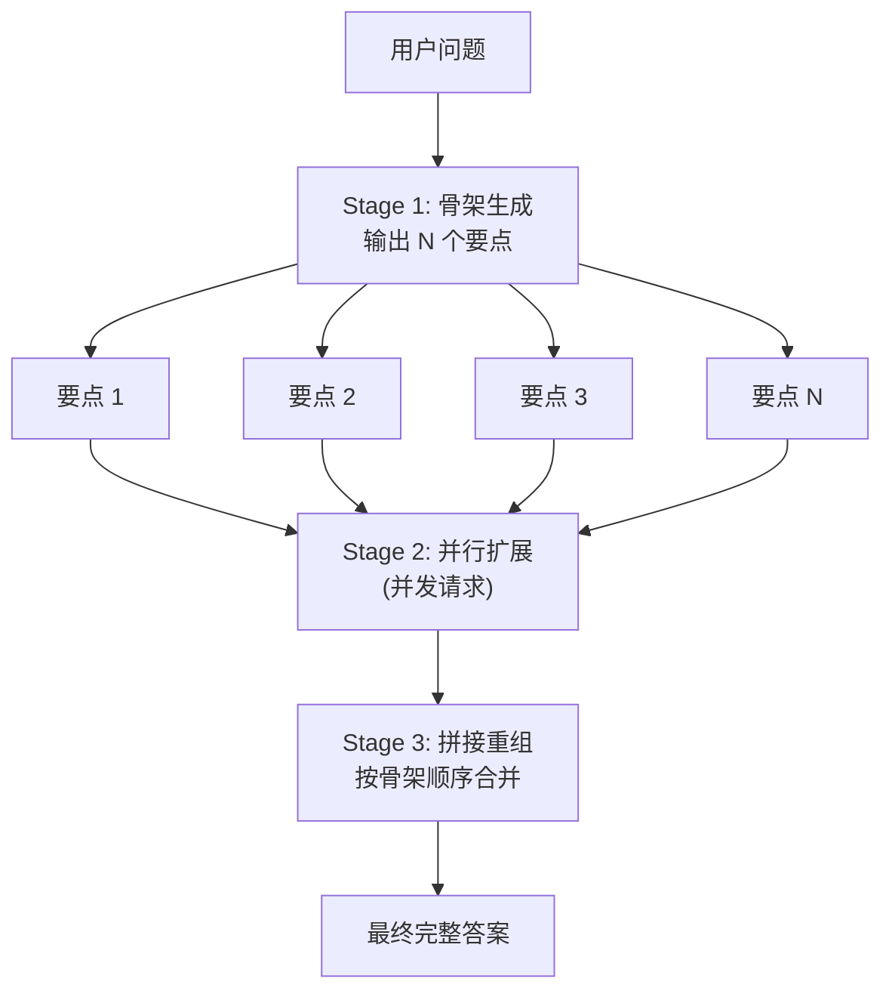

**关键点**：
1. **骨架阶段（Skeleton）**：用极简 prompt 让模型只输出编号要点列表，不展开，速度极快。
2. **扩展阶段（Expansion）**：对每个要点发起独立请求，可使用线程池/异步并发，互不阻塞。
3. **重组阶段**：按骨架原始顺序拼接各扩展段落，保证逻辑连贯。扩展阶段并发执行，延迟不再随要点数 N 线性增长，整体端到端延迟 ≈ 骨架生成时间 + 单个要点扩展时间（即最慢的一个扩展）。

### 完整 Python 示例代码

#### 环境配置与客户端初始化

```python
"""
Skeleton-of-Thought (SoT) 骨架思维
Stage 1: 生成答案骨架（要点列表）
Stage 2: 并行扩展每个要点
Stage 3: 按顺序拼接为完整答案
"""

import os
from openai import OpenAI
from concurrent.futures import ThreadPoolExecutor, as_completed

client = OpenAI(
    api_key=os.environ.get("OPENAI_API_KEY", "your-api-key-here"),
    base_url=os.environ.get("OPENAI_BASE_URL", None),
)
```

#### 骨架生成

```python
def generate_skeleton(question: str, num_points: int = 5,
                      model: str = "gpt-4o") -> list:
    """Stage 1: 让模型只输出答案的要点骨架，不展开"""
    prompt = f"""你是一个高效的助手。请针对以下问题，给出 {num_points} 个要点的骨架。
要求：
1. 每个要点用一行表示，格式为 "<编号>. <简短要点>"
2. 要点之间用换行分隔，不要展开论述
3. 要点应覆盖答案的主要方面，逻辑顺序合理

问题：{question}

骨架："""
    response = client.chat.completions.create(
        model=model,
        messages=[{"role": "user", "content": prompt}],
        temperature=0.3,
    )
    text = (response.choices[0].message.content or "").strip()
    # 解析出要点列表，去掉编号前缀
    points = []
    for line in text.splitlines():
        line = line.strip()
        if not line:
            continue
        # 去掉 "1. " "2. " 等编号前缀
        if line[0].isdigit():
            parts = line.split(".", 1)
            if len(parts) == 2:
                points.append(parts[1].strip())
                continue
        points.append(line)
    return points
```

#### 并行扩展要点

```python
def expand_point(question: str, point: str, index: int,
                 model: str = "gpt-4o") -> tuple:
    """Stage 2: 扩展单个要点为完整段落（可并发调用）"""
    prompt = f"""你正在撰写一个完整答案的一部分。原始问题如下：

问题：{question}

请针对以下要点，写一段详细的论述（约 100-200 字）。
要求：只写这一段的正文内容，不要重复要点编号，不要写总结。

要点 {index + 1}：{point}

正文："""
    response = client.chat.completions.create(
        model=model,
        messages=[{"role": "user", "content": prompt}],
        temperature=0.5,
    )
    return index, (response.choices[0].message.content or "").strip()


def expand_all_points(question: str, points: list,
                      model: str = "gpt-4o", max_workers: int = 5) -> list:
    """并行扩展所有要点，返回按原顺序排列的段落列表"""
    expanded = [None] * len(points)
    with ThreadPoolExecutor(max_workers=max_workers) as executor:
        futures = {
            executor.submit(expand_point, question, p, i, model): i
            for i, p in enumerate(points)
        }
        for future in as_completed(futures):
            index, content = future.result()
            expanded[index] = content
    return expanded
```

#### SoT 主流程

```python
def skeleton_of_thought(question: str, num_points: int = 5,
                        model: str = "gpt-4o") -> dict:
    """Skeleton-of-Thought 完整流程"""
    print(f"{'='*60}")
    print(f"问题：{question}")
    print(f"{'='*60}")

    # Stage 1: 生成骨架
    print(f"\n>>> Stage 1: 生成骨架（{num_points} 个要点）")
    points = generate_skeleton(question, num_points=num_points, model=model)
    for i, p in enumerate(points):
        print(f"  {i+1}. {p}")

    # Stage 2: 并行扩展
    print(f"\n>>> Stage 2: 并行扩展 {len(points)} 个要点")
    expanded = expand_all_points(question, points, model=model)

    # Stage 3: 拼接
    print(f"\n>>> Stage 3: 按顺序拼接")
    final_answer = "\n\n".join(expanded)

    print(f"\n{'='*60}")
    print("最终答案：")
    print(final_answer)

    return {
        "question": question,
        "skeleton": points,
        "expanded": expanded,
        "final_answer": final_answer,
    }
```

#### 主流程与演示

```python
if __name__ == "__main__":
    question = "请介绍大语言模型（LLM）的预训练流程，包括数据准备、模型架构、训练目标和评估方法。"
    skeleton_of_thought(question, num_points=4)
```

### 代码要点说明

- `generate_skeleton` 对应 **Stage 1 骨架生成**，用极简 prompt 强制模型只列要点，响应快、token 少。
- `expand_point` 对应 **Stage 2 单要点扩展**，是无状态的独立函数，可安全并发。
- `expand_all_points` 使用 `ThreadPoolExecutor` 实现并行扩展，`as_completed` 收集结果后按原索引回填，保证顺序。
- `skeleton_of_thought` 是编排函数，串联三阶段；端到端延迟近似等于"骨架生成 + 最慢的一个扩展"。

---

## 1.10 RE2 (Re-Reading) — 重复阅读

### 概念说明

**RE2（Re-Reading，重复阅读）** 是一种极其简洁的推理增强技巧：在 prompt 中让模型**重复阅读问题两次**再作答。具体做法是在问题后追加一句 "Read the question again"（再读一遍问题），并要求模型先把问题复述出来，再开始推理。

这个方法看似简单，却能有效缓解 LLM 的"急躁"倾向——模型在自回归生成时容易过早锁定答案方向，忽略问题中的关键约束。强制重读相当于给模型一次"自我校准"的机会，让它先确认"我到底要回答什么"，再展开推理。RE2 几乎零成本（只多几个 token），却能稳定提升多类推理任务的准确率。

**类比理解**：就像考试时老师反复叮嘱"审题！审题！再审题！"——很多错误并非不会做，而是没看清题目条件。让学生把题目默读两遍，往往就能避免低级失误。

### 核心流程/原理

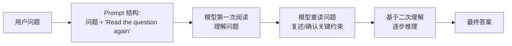

**关键点**：
1. **双重输入**：同一问题在 prompt 中出现两次，第二次显式提示"再读一遍"，强化注意力。
2. **复述确认**：要求模型先复述问题要点，相当于一次"理解校验"，避免跑题。
3. **零额外调用**：RE2 在**单次请求**内完成，不增加 API 调用次数，仅增加少量输入 token，性价比极高。
4. **可叠加性**：RE2 可与 CoT、Self-Consistency 等模式组合，作为通用的"打底"增强。

### 完整 Python 示例代码

#### 环境配置与客户端初始化

```python
"""
RE2 (Re-Reading) 重复阅读
核心：让模型重读问题两次再回答，强化审题
对比：直接回答 vs RE2 增强回答
"""

import os
from openai import OpenAI

client = OpenAI(
    api_key=os.environ.get("OPENAI_API_KEY", "your-api-key-here"),
    base_url=os.environ.get("OPENAI_BASE_URL", None),
)
```

#### 基线与 RE2 推理函数

```python
def direct_answer(question: str, model: str = "gpt-4o") -> str:
    """基线：直接回答，不做任何增强"""
    prompt = f"问题：{question}\n\n请给出答案："
    response = client.chat.completions.create(
        model=model,
        messages=[{"role": "user", "content": prompt}],
        temperature=0.0,
    )
    return (response.choices[0].message.content or "").strip()


def re2_answer(question: str, model: str = "gpt-4o") -> str:
    """RE2：重复阅读两次后再推理回答"""
    prompt = f"""请仔细阅读以下问题。

问题：{question}

Read the question again:

问题：{question}

请先简要复述问题的关键信息和约束条件，然后一步一步地推理，最后给出答案。"""
    response = client.chat.completions.create(
        model=model,
        messages=[{"role": "user", "content": prompt}],
        temperature=0.0,
    )
    return (response.choices[0].message.content or "").strip()
```

#### RE2 + CoT 组合增强

```python
def re2_with_cot(question: str, model: str = "gpt-4o") -> str:
    """RE2 与 CoT 组合：重读 + 分步推理 + 自我验证"""
    prompt = f"""请仔细阅读以下问题。

问题：{question}

Read the question again:

问题：{question}

请按以下步骤作答：
1. 【复述】用你自己的话复述问题，列出所有已知条件和需要求解的目标。
2. 【推理】一步一步地思考，显式写出每一步的推理过程。
3. 【验证】回顾你的推理，检查是否遗漏了题目中的任何约束。
4. 【答案】给出最终答案。"""
    response = client.chat.completions.create(
        model=model,
        messages=[{"role": "user", "content": prompt}],
        temperature=0.0,
    )
    return (response.choices[0].message.content or "").strip()
```

#### RE2 主流程

```python
def re2_pipeline(question: str, model: str = "gpt-4o") -> dict:
    """RE2 完整流程：对比直接回答与 RE2 增强"""
    print(f"{'='*60}")
    print(f"问题：{question}")
    print(f"{'='*60}")

    print("\n>>> 基线：直接回答")
    baseline = direct_answer(question, model=model)
    print(baseline)

    print("\n>>> RE2：重复阅读后回答")
    re2_result = re2_answer(question, model=model)
    print(re2_result)

    print("\n>>> RE2 + CoT 组合")
    combined = re2_with_cot(question, model=model)
    print(combined)

    return {
        "question": question,
        "baseline": baseline,
        "re2": re2_result,
        "re2_cot": combined,
    }
```

#### 主流程与演示

```python
if __name__ == "__main__":
    # 含陷阱约束的问题，验证 RE2 的"审题"效果
    question = (
        "一个班有 32 名学生，其中男生比女生多 4 人。"
        "请问女生有多少人？注意：只输出最终数字，不要输出计算过程。"
    )
    re2_pipeline(question)
```

### 代码要点说明

- `direct_answer` 是**基线对照**，不做任何增强，用于体现 RE2 的提升。
- `re2_answer` 对应 **RE2 核心**：问题出现两次 + "Read the question again" + 复述要求，单次请求内完成。
- `re2_with_cot` 展示 **RE2 + CoT 组合**，加入复述、推理、验证、答案四段式结构，适合高难度推理题。
- `re2_pipeline` 编排对比实验，直观展示三种方式的输出差异。

---

## 1.11 System 2 Attention (S2A) — 系统2注意力

### 概念说明

**System 2 Attention（S2A，系统2注意力）** 的灵感来自卡尼曼的"双系统"理论：人类的"系统1"快速、直觉但易受干扰，"系统2"缓慢、理性但能过滤偏见。LLM 默认的注意力机制类似系统1——它会被 prompt 中的无关信息、情感诱导、错误前提"带偏"。

S2A 的做法是：在回答之前，先让 LLM **重写上下文**，把原始输入中与问题无关、带有偏见或有害的内容剔除，生成一份"纯净版"上下文；然后基于这份重写后的上下文进行推理和回答。这样模型就不会被冗余或误导信息干扰，回答更准确、更客观。

**类比理解**：好比一位法官审案——不能直接听信原告被告的混杂陈述（含情绪、夸张、无关细节），而是先让书记员把陈述整理成"与案件相关的事实清单"，法官只基于这份清单来判案，避免被情绪化表述左右。

### 核心流程/原理

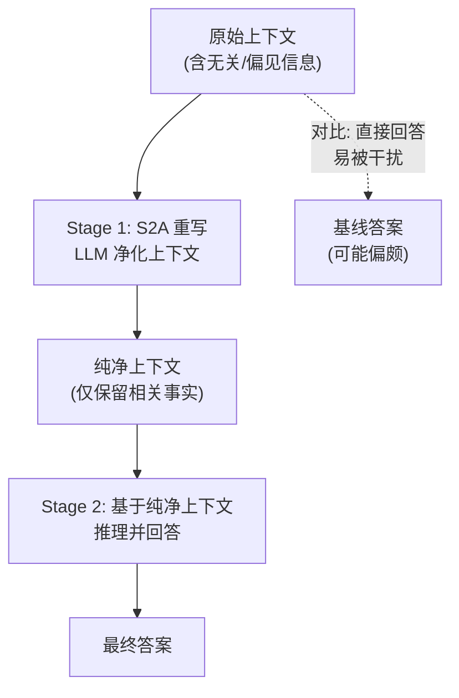

**关键点**：
1. **重写阶段（S2A Rewrite）**：模型先以"信息净化者"身份重写上下文，剔除无关、偏见、误导内容，保留与问题相关的事实。
2. **回答阶段**：模型基于重写后的纯净上下文回答，原始上下文不再参与，避免注意力被污染。
3. **两阶段分离**：重写与回答是两次独立调用，确保"净化"与"推理"职责分明。
4. **对抗性场景友好**：在含误导信息、情感操纵、无关干扰的 prompt 中效果尤为明显。

### 完整 Python 示例代码

#### 环境配置与客户端初始化

```python
"""
System 2 Attention (S2A) 系统2注意力
Stage 1: 重写上下文，过滤无关/偏见信息
Stage 2: 基于纯净上下文回答
"""

import os
from openai import OpenAI

client = OpenAI(
    api_key=os.environ.get("OPENAI_API_KEY", "your-api-key-here"),
    base_url=os.environ.get("OPENAI_BASE_URL", None),
)
```

#### 上下文净化（S2A 重写）

```python
def s2a_rewrite(question: str, context: str, model: str = "gpt-4o") -> str:
    """Stage 1: 重写上下文，过滤无关/偏见/误导信息"""
    prompt = f"""你是一个信息净化助手。下面会给你一段上下文和一个问题。
请重写上下文，只保留与问题相关、客观、无偏见的信息。
要求：
1. 删除与问题无关的内容
2. 删除带有强烈情感倾向、主观判断或误导性的表述
3. 保留所有客观事实，但用中立的语气重新表述
4. 如果上下文中包含错误前提，请指出并修正
5. 输出重写后的上下文，不要回答问题

【原始上下文】
{context}

【问题】
{question}

【重写后的纯净上下文】"""
    response = client.chat.completions.create(
        model=model,
        messages=[{"role": "user", "content": prompt}],
        temperature=0.0,
    )
    return (response.choices[0].message.content or "").strip()
```

#### 基于纯净上下文回答

```python
def answer_with_clean_context(question: str, clean_context: str,
                              model: str = "gpt-4o") -> str:
    """Stage 2: 基于净化后的上下文推理并回答"""
    prompt = f"""请基于以下上下文回答问题。只使用上下文中提供的信息，一步一步地推理。

【上下文】
{clean_context}

【问题】
{question}

请先分析上下文中的关键信息，再逐步推理，最后给出答案："""
    response = client.chat.completions.create(
        model=model,
        messages=[{"role": "user", "content": prompt}],
        temperature=0.0,
    )
    return (response.choices[0].message.content or "").strip()


def direct_answer(question: str, context: str, model: str = "gpt-4o") -> str:
    """基线：直接基于原始（含干扰）上下文回答"""
    prompt = f"""请基于以下上下文回答问题。

【上下文】
{context}

【问题】
{question}

答案："""
    response = client.chat.completions.create(
        model=model,
        messages=[{"role": "user", "content": prompt}],
        temperature=0.0,
    )
    return (response.choices[0].message.content or "").strip()
```

#### S2A 主流程

```python
def system_2_attention(question: str, context: str,
                       model: str = "gpt-4o") -> dict:
    """S2A 完整流程：对比直接回答与 S2A 净化后回答"""
    print(f"{'='*60}")
    print(f"问题：{question}")
    print(f"原始上下文：{context[:120]}...")
    print(f"{'='*60}")

    # 基线：直接回答
    print("\n>>> 基线：直接基于原始上下文回答")
    baseline = direct_answer(question, context, model=model)
    print(baseline)

    # Stage 1: 净化上下文
    print("\n>>> Stage 1: S2A 重写上下文（净化）")
    clean_ctx = s2a_rewrite(question, context, model=model)
    print(f"纯净上下文：{clean_ctx}")

    # Stage 2: 基于纯净上下文回答
    print("\n>>> Stage 2: 基于纯净上下文回答")
    s2a_result = answer_with_clean_context(question, clean_ctx, model=model)
    print(s2a_result)

    return {
        "question": question,
        "original_context": context,
        "clean_context": clean_ctx,
        "baseline_answer": baseline,
        "s2a_answer": s2a_result,
    }
```

#### 主流程与演示

```python
if __name__ == "__main__":
    # 含情感偏见和无关信息的上下文，验证 S2A 的净化效果
    context = """据某知名博主爆料（他一向很靠谱），X 公司的新产品简直是个灾难！
    据说续航只有 3 小时，而且外观丑陋。不过官方数据显示续航为 10 小时，
    屏幕分辨率 2K。另外，该博主还提到 Y 公司即将发布竞品，值得期待。
    有网友评论说"X 公司早就该倒闭了"。"""

    question = "X 公司新产品的官方续航时间是多少小时？"
    system_2_attention(question, context)
```

### 代码要点说明

- `s2a_rewrite` 对应 **Stage 1 上下文净化**，以"信息净化者"角色重写，剔除无关/偏见/误导内容。
- `answer_with_clean_context` 对应 **Stage 2 纯净推理**，只使用净化后的上下文，杜绝原始干扰。
- `direct_answer` 是**基线对照**，直接用含干扰的原始上下文回答，用于体现 S2A 的提升。
- `system_2_attention` 编排完整流程，并打印净化前后对比，直观展示干扰信息如何被剔除。

---

## 1.12 Emotion Prompting — 情感提示

### 概念说明

**Emotion Prompting（情感提示）** 是一种出人意料的增强技巧：在 prompt 中加入**情感刺激语句**（如"这对我真的很重要"、"深呼吸，一步一步来"、"我相信你能做好"），就能稳定提升 LLM 在各类任务上的表现。

这一现象源于实证发现——LLM 在预训练时学习了大量人类对话，其中包含丰富的情感表达，因此模型对情感线索存在某种"敏感性"。积极的情感刺激似乎能激活模型更"用心"的生成模式，类似于人类在被鼓励时表现更好。论文（arXiv:2307.11760）通过系统实验验证了多种情感刺激语的有效性，且几乎零成本。

**类比理解**：就像老师对学生说"这道题对你升学很重要，认真做"——学生（模型）会因此更专注、更仔细。虽然 LLM 没有真实情感，但情感词汇作为一种"风格信号"，确实能影响其生成质量。

### 核心流程/原理

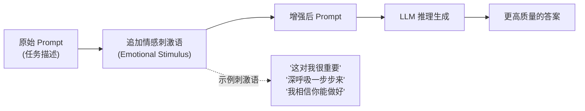

**关键点**：
1. **情感刺激语（Emotional Stimulus）**：在任务描述后追加的简短情感性语句，如 "This is very important to my career"（这对我的职业生涯很重要）。
2. **零额外调用**：与 RE2 类似，Emotion Prompting 在单次请求内完成，仅增加少量 token。
3. **可叠加性**：可与 CoT、Self-Consistency 等任意模式组合，作为通用的"调味"增强。
4. **效果稳定但温和**：提升幅度通常在 1-5 个百分点，不会颠覆性改变输出，但胜在稳定、低成本。

### 完整 Python 示例代码

#### 环境配置与客户端初始化

```python
"""
Emotion Prompting 情感提示
在 prompt 中加入情感刺激语，提升 LLM 表现
对比：基线 vs 情感提示增强
"""

import os
from openai import OpenAI

client = OpenAI(
    api_key=os.environ.get("OPENAI_API_KEY", "your-api-key-here"),
    base_url=os.environ.get("OPENAI_BASE_URL", None),
)

# 论文中验证有效的几类情感刺激语（编号对应 EmotionPrompt 论文 arXiv:2307.11760）
EMOTIONAL_STIMULI = {
    "ep02": "This is very important to my career.",  # EP02 重要性强调
    "ep05": "Are you sure that's your final answer? It might be worth taking another look.",  # EP05 自我复查
    "ep11": "Remember that progress is made one step at a time. Stay determined and keep moving forward.",  # EP11 坚持与稳步前进
}
```

#### 基线与情感提示增强

```python
def baseline_answer(question: str, model: str = "gpt-4o") -> str:
    """基线：不加任何情感刺激"""
    prompt = f"""请回答以下问题，并给出详细的推理过程。

问题：{question}

答案："""
    response = client.chat.completions.create(
        model=model,
        messages=[{"role": "user", "content": prompt}],
        temperature=0.0,
    )
    return (response.choices[0].message.content or "").strip()


def emotion_prompted_answer(question: str, stimulus_key: str = "ep11",
                            model: str = "gpt-4o") -> str:
    """情感提示增强：在 prompt 末尾追加情感刺激语"""
    stimulus = EMOTIONAL_STIMULI.get(stimulus_key, EMOTIONAL_STIMULI["ep11"])
    prompt = f"""请回答以下问题，并给出详细的推理过程。

问题：{question}

{stimulus}

答案："""
    response = client.chat.completions.create(
        model=model,
        messages=[{"role": "user", "content": prompt}],
        temperature=0.0,
    )
    return (response.choices[0].message.content or "").strip()
```

#### 情感提示 + CoT 组合

```python
def emotion_plus_cot(question: str, model: str = "gpt-4o") -> str:
    """情感提示 + CoT 组合：EP11 坚持语 + 分步推理"""
    stimulus = EMOTIONAL_STIMULI["ep11"]
    prompt = f"""{stimulus}

请一步一步地思考并回答以下问题。

问题：{question}

让我们一步步思考："""
    response = client.chat.completions.create(
        model=model,
        messages=[{"role": "user", "content": prompt}],
        temperature=0.0,
    )
    return (response.choices[0].message.content or "").strip()
```

#### Emotion Prompting 主流程

```python
def emotion_prompting(question: str, model: str = "gpt-4o") -> dict:
    """Emotion Prompting 完整流程：对比基线与多种情感刺激"""
    print(f"{'='*60}")
    print(f"问题：{question}")
    print(f"{'='*60}")

    print("\n>>> 基线（无情感刺激）")
    baseline = baseline_answer(question, model=model)
    print(baseline)

    print("\n>>> 情感提示：EP02 重要性强调")
    imp = emotion_prompted_answer(question, stimulus_key="ep02", model=model)
    print(imp)

    print("\n>>> 情感提示：EP05 自我复查")
    enc = emotion_prompted_answer(question, stimulus_key="ep05", model=model)
    print(enc)

    print("\n>>> 情感提示 + CoT 组合")
    combined = emotion_plus_cot(question, model=model)
    print(combined)

    return {
        "question": question,
        "baseline": baseline,
        "ep02_stimulus": imp,
        "ep05_stimulus": enc,
        "emotion_plus_cot": combined,
    }
```

#### 主流程与演示

```python
if __name__ == "__main__":
    question = (
        "一个水池有一个进水管，5 小时可以注满；有一个出水管，8 小时可以排空。"
        "如果两管同时打开，多少小时可以注满水池？"
    )
    emotion_prompting(question)
```

### 代码要点说明

- `EMOTIONAL_STIMULI` 字典集中管理论文中验证有效的情感刺激语，便于切换实验。
- `baseline_answer` 是**基线对照**，不含任何情感刺激，用于体现增强效果。
- `emotion_prompted_answer` 对应 **Emotion Prompting 核心**，在任务描述后追加单条刺激语。
- `emotion_plus_cot` 展示 **情感提示 + CoT 组合**，将鼓励语与分步推理结合，适合高难度推理。
- `emotion_prompting` 编排对比实验，直观展示不同刺激语对输出的影响。

---

## 1.13 LATS (Language Agent Tree Search) — 语言智能体树搜索

### 概念说明

**LATS（Language Agent Tree Search）**是首个将**推理（Reasoning）**、**行动（Acting）**和**规划（Planning）**统一到同一框架内的方法。它把蒙特卡洛树搜索（MCTS）与 LLM 深度结合，将 ReAct 范式从"一条链"扩展为对"推理 + 行动"组合空间的**树搜索**。在 LATS 中，LLM 同时扮演三个角色：作为 **Agent** 生成候选行动、作为 **Value Function** 评估状态价值、作为 **Optimizer** 通过反思改进后续策略。

**类比理解**：国际象棋菜鸟只想"这步怎么走"，普通棋手能想"我这么走、对方可能那么走"，而国际象棋大师则在脑中展开一棵博弈树——"我走 A，对方应 B，我再走 C……如果不好就回退换 D"。LATS 就是让 LLM 像大师一样思考：不仅生成行动，还推演后果、评估局面、回溯反思，最终从整棵搜索树中选出最优的行动-推理路径。

与 ToT 只在"推理路径"上搜索不同，LATS 在"推理 + 行动"的混合空间上搜索，并引入**真实环境反馈**和**反思机制**：每次模拟后生成反思存入节点，指导后续扩展。值得注意的是，**ReAct 是 LATS 的特例**（深度 1、宽度 1），**Reflexion 也是 LATS 的特例**（深度 1、宽度 N），LATS 是更一般的框架。在 HumanEval 上，LATS 借助 GPT-4 取得了 92.7% 的 pass@1，显著优于 ReAct、Reflexion 等基线。

### 核心流程/原理

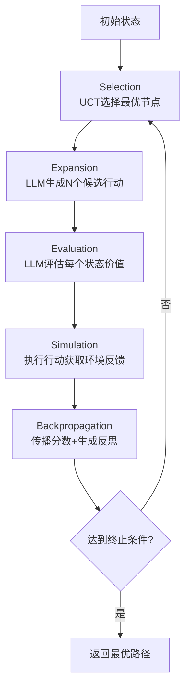

**关键点**：
1. **Selection（选择）**：用 UCT 公式在已有树中选择一个最有潜力的节点展开，平衡"探索新节点"与"利用高价值节点"。UCT = V(s)/N(s) + c·√(ln N(parent)/N(s))。
2. **Expansion（扩展）**：让 LLM 作为 Agent，对选中节点生成 N 个候选行动（推理 + 行动），形成子节点。
3. **Evaluation（评估）**：让 LLM 作为 Value Function，对每个新状态打分（0-1），作为搜索的启发式价值。
4. **Simulation（模拟）**：在真实/模拟环境中执行行动，获取环境反馈与终止信号。
5. **Backpropagation + Reflection（回溯 + 反思）**：将环境奖励沿父链回传更新价值；同时让 LLM 作为 Optimizer 生成反思，存入节点供后续扩展参考。

### 完整 Python 示例代码

#### 环境配置与客户端初始化

```python
"""
LATS - Language Agent Tree Search
统一推理、行动与规划的树搜索框架
论文: arXiv:2310.04406 (ICML 2024)
以 24 点游戏为模拟环境演示 MCTS 四阶段
"""
import os
import math
import json
import re
from dataclasses import dataclass, field
from typing import Optional
from openai import OpenAI

client = OpenAI(
    api_key=os.environ.get("OPENAI_API_KEY", "your-api-key-here"),
    base_url=os.environ.get("OPENAI_BASE_URL", None),
)

MODEL = "gpt-4o"
```

#### 24 点模拟环境

```python
def twenty_four_env(state: dict, action: str) -> tuple[dict, float, bool]:
    """24 点游戏环境：执行 action，返回 (新状态, 奖励, 是否终止)。
    state: {"numbers": [float,...], "expr": str}
    action: 形如 "(3 + 8)" 的二元运算表达式
    """
    numbers = list(state["numbers"])
    expr = state.get("expr", "")
    # 解析 action：提取两个操作数和运算符
    match = re.match(r"\(\s*([0-9.]+)\s*([+\-*/])\s*([0-9.]+)\s*\)", action)
    if not match:
        return state, 0.0, False
    a, op, b = float(match.group(1)), match.group(2), float(match.group(3))
    # 检查操作数是否可用
    if a not in numbers or b not in numbers:
        return state, 0.0, False
    # 计算结果
    if op == "+":
        r = a + b
    elif op == "-":
        r = a - b
    elif op == "*":
        r = a * b
    elif op == "/":
        if b == 0:
            return state, 0.0, False
        r = a / b
    else:
        return state, 0.0, False
    # 更新数字列表：移除 a 和 b，加入 r
    numbers.remove(a)
    numbers.remove(b)
    numbers.append(r)
    new_expr = f"{expr} -> {action}={r}"
    new_state = {"numbers": numbers, "expr": new_expr}
    # 终止条件：只剩一个数字
    done = len(numbers) == 1
    reward = 1.0 if (done and abs(numbers[0] - 24.0) < 1e-6) else 0.0
    return new_state, reward, done
```

#### 树节点与 LATS Agent

```python
@dataclass
class Node:
    """LATS 搜索树节点"""
    state: dict
    parent: Optional["Node"] = None
    action: Optional[str] = None       # 从父节点到本节点的行动
    children: list["Node"] = field(default_factory=list)
    visits: int = 0
    value: float = 0.0                 # 累计价值
    reward: float = 0.0                # 环境奖励
    reflection: str = ""               # 反思文本
    is_terminal: bool = False
    depth: int = 0


class LATSAgent:
    """Language Agent Tree Search 主算法"""

    def __init__(self, n_expand: int = 3, c_explore: float = 1.4,
                 max_iterations: int = 15, model: str = MODEL):
        self.n_expand = n_expand      # 每次扩展的候选行动数
        self.c = c_explore            # UCT 探索常数
        self.max_iter = max_iterations
        self.model = model

    # ---------- LLM 调用工具 ----------
    def _chat(self, prompt: str, temperature: float = 0.7) -> str:
        resp = client.chat.completions.create(
            model=self.model,
            messages=[{"role": "user", "content": prompt}],
            temperature=temperature,
        )
        return (resp.choices[0].message.content or "").strip()

    # ---------- Expansion: LLM 生成 N 个候选行动 ----------
    def expand(self, node: Node) -> list[Node]:
        prompt = f"""你在玩 24 点游戏。当前剩余数字: {node.state['numbers']}
已有表达式: {node.state.get('expr', '(起始)')}
反思提示: {node.reflection or '无'}

请给出 {self.n_expand} 个不同的下一步行动，每个行动形如 "(数字1 运算符 数字2)"，
运算符限 + - * /，两个数字必须来自当前剩余数字。
请以 JSON 列表输出，例如: ["(3 + 8)", "(8 * 3)"]。只输出 JSON。"""
        raw = self._chat(prompt, temperature=0.8)
        try:
            actions = json.loads(raw)
            if not isinstance(actions, list):
                actions = [raw]
        except json.JSONDecodeError:
            actions = re.findall(r"\([0-9.\s+\-*/]+\)", raw)
        new_nodes = []
        for act in actions[: self.n_expand]:
            new_state, reward, done = twenty_four_env(node.state, str(act))
            child = Node(
                state=new_state, parent=node, action=str(act),
                reward=reward, is_terminal=done, depth=node.depth + 1,
            )
            node.children.append(child)
            new_nodes.append(child)
        return new_nodes

    # ---------- Evaluation: LLM 评估状态价值 ----------
    def evaluate(self, node: Node) -> float:
        nums = node.state["numbers"]
        prompt = f"""评估 24 点游戏当前局面接近成功的程度，输出 0 到 1 的分数。
剩余数字: {nums}
判断依据: 数字越少越接近终局；能否通过剩余数字凑出 24。
请只输出一个 0-1 之间的小数。"""
        raw = self._chat(prompt, temperature=0.0)
        try:
            v = float(re.findall(r"[0-9]*\.?[0-9]+", raw)[0])
            v = max(0.0, min(1.0, v))
        except (ValueError, IndexError):
            v = 0.5
        # 终止节点直接用环境奖励作为价值
        if node.is_terminal:
            v = node.reward
        return v

    # ---------- Selection: UCT 选择最优子节点 ----------
    def select(self, node: Node) -> Node:
        while node.children:
            best, best_score = None, -1e9
            for ch in node.children:
                if ch.visits == 0:
                    score = 1e9  # 优先访问未访问节点
                else:
                    exploit = ch.value / ch.visits
                    explore = self.c * math.sqrt(
                        math.log(node.visits + 1) / ch.visits
                    )
                    score = exploit + explore
                if score > best_score:
                    best_score, best = score, ch
            node = best
        return node

    # ---------- Backpropagation: 反向传播价值 ----------
    def backpropagate(self, node: Node, value: float):
        while node is not None:
            node.visits += 1
            node.value += value
            node = node.parent

    # ---------- Reflection: LLM 生成反思 ----------
    def reflect(self, node: Node):
        prompt = f"""你在 24 点游戏中尝试了行动 {node.action}，得到状态 {node.state['numbers']}。
环境奖励: {node.reward}。请用一句话反思这个行动的好坏及下一步建议。"""
        node.reflection = self._chat(prompt, temperature=0.3)

    # ---------- 主搜索循环 ----------
    def search(self, initial_state: dict) -> Optional[Node]:
        root = Node(state=initial_state, depth=0)
        root.visits = 1
        best_terminal = None
        for _ in range(self.max_iter):
            # 1. Selection
            leaf = self.select(root)
            if leaf.is_terminal:
                if leaf.reward == 1.0:
                    return leaf
                continue
            # 2. Expansion
            children = self.expand(leaf)
            # 3. Evaluation + Simulation + Reflection
            for ch in children:
                v = self.evaluate(ch)
                self.reflect(ch)
                self.backpropagate(ch, v + ch.reward)
                if ch.is_terminal and ch.reward == 1.0:
                    return ch
                if ch.is_terminal and (best_terminal is None
                                       or ch.reward > best_terminal.reward):
                    best_terminal = ch
        return best_terminal
```

#### 主流程演示

```python
def reconstruct_path(node: Node) -> list[str]:
    """从终止节点回溯到根，输出行动路径"""
    path = []
    while node is not None and node.action is not None:
        path.append(node.action)
        node = node.parent
    return list(reversed(path))


if __name__ == "__main__":
    # 24 点游戏：给定 4 个数字，通过 + - * / 得到 24
    initial_state = {"numbers": [3.0, 8.0, 3.0, 8.0], "expr": ""}

    agent = LATSAgent(n_expand=3, c_explore=1.4, max_iterations=20)
    solution = agent.search(initial_state)

    if solution and solution.reward == 1.0:
        path = reconstruct_path(solution)
        print("✅ 找到 24 点解法！")
        print("初始数字:", initial_state["numbers"])
        for i, act in enumerate(path, 1):
            print(f"  步骤 {i}: {act}")
        print("最终表达式:", solution.state["expr"])
    else:
        print("⚠️ 在限定迭代内未找到精确解。")
        if solution:
            print("最佳终态:", solution.state["numbers"],
                  "奖励:", solution.reward)
```

### 代码要点说明

- `Node` 用 dataclass 描述搜索树节点，`value`/`visits` 用于 UCT，`reflection` 存储 LLM 反思，对应论文中"Optimizer"角色。
- `expand` 对应 MCTS 的 **Expansion** 阶段，LLM 作为 **Agent** 生成 N 个候选行动，并由 `twenty_four_env` 模拟环境推进状态（同时完成 **Simulation**）。
- `evaluate` 对应 **Evaluation** 阶段，LLM 作为 **Value Function** 给出 0-1 价值估计；终止节点直接用环境奖励。
- `select` 对应 **Selection** 阶段，使用 UCT 公式 `V/N + c·√(ln N(parent)/N)` 平衡探索与利用。
- `backpropagate` + `reflect` 对应 **Backpropagation** 阶段，既传播价值，又让 LLM 生成反思供后续扩展参考。
- `search` 编排四阶段主循环；`reconstruct_path` 从终止节点回溯输出完整行动路径，体现 LATS"返回最优路径"的思想。

---

## 1.14 Test-Time Compute Scaling（测试时计算扩展）

### 概念说明

**Test-Time Compute Scaling（测试时计算扩展）** 是 2024 年兴起的新一代推理范式。OpenAI 于 2024 年 9 月发布的 o1 模型标志着推理能力提升的核心路径从"训练时扩展（Train-Time Compute Scaling）"转向"测试时扩展（Test-Time Compute Scaling）"——即不再单纯依赖堆大模型参数和训练算力，而是在**推理阶段**让模型自主进行更长时间的深度思考。

其核心思想是：在推理时让模型生成大量**内部思维链（hidden Chain-of-Thought）**，通过更长的"思考时间"换取更高质量的回答。模型在内部反复推演、回溯、自我验证，最终输出经过深思熟虑的答案。

**与传统 CoT 的区别**：
- 传统 CoT 是**外显的、prompt 引导的**思维链——需要用户在 prompt 中加入 "let's think step by step" 等提示，且推理过程对用户可见。
- Test-Time Compute 是**模型内化的、自主的**推理能力——这种能力在训练阶段通过强化学习（RL）学会，无需用户提示即可自主启动深度推理；其思维链对用户隐藏（如 o1 的 hidden CoT 不对外暴露）。

**代表模型**（截至 2026 年）：
| 模型 | 发布时间 | 特点 |
|------|---------|------|
| OpenAI o1 / o1-mini | 2024.09 | 首个商用推理模型，隐藏思维链 |
| OpenAI o3-mini | 2025.01 | 支持 reasoning_effort + function calling，性价比高 |
| OpenAI o4-mini | 2025.04 | 推理速度更快，支持 developer message |
| OpenAI GPT-5 | 2025.08 | 内置推理能力，无需切换模式，reasoning.effort 可调 |
| DeepSeek R1 | 2025.01 | 开源推理模型里程碑，RL 训练，思维链可见 |
| DeepSeek V3 | 2024.12 | MoE 架构开源模型，R1 的基础模型 |
| Gemini 2.5 Pro | 2025.03 | Google 推理模型，thinking budget 可调 |
| Claude 4 Opus/Sonnet | 2025.05 | Anthropic extended thinking 可开关 |
| Qwen3（思考模式） | 2025.03 | 阿里开源，支持思考模式开关 |
| Grok 4 | 2025.07 | xAI 推理模型 |

**关键技术**：
1. **RL with Search（强化学习 + 搜索）**：在训练中让模型探索多条推理路径，通过搜索过程学习"如何思考"。
2. **过程奖励模型（Process Reward Model, PRM）**：对推理的每一步打分，而非仅对最终答案打分，引导模型学会正确的推理过程。
3. **自我博弈训练（Self-Play）**：模型与自身对抗生成训练数据，持续提升推理能力。

**适用场景**：数学竞赛（如 AIME）、编程题（如 Codeforces）、科学推理等需要深度思考的复杂任务。

**局限**：
- 对简单任务反而增加不必要的延迟和成本——"杀鸡用牛刀"。
- 思维链不可见（o1 的 hidden CoT 对用户隐藏），难以调试和审计中间过程。
- 推理 token 消耗大，API 计费按思考长度增长。

**类比理解**：传统 CoT 像让学生"把演算过程写出来再交卷"；Test-Time Compute 则像培养了一位"内功深厚"的数学家——他不需要你提醒"要一步步想"，拿到题就会在脑中反复推演、自我校验，最后只把结论告诉你，而推演过程你看不见。

### 核心流程/原理

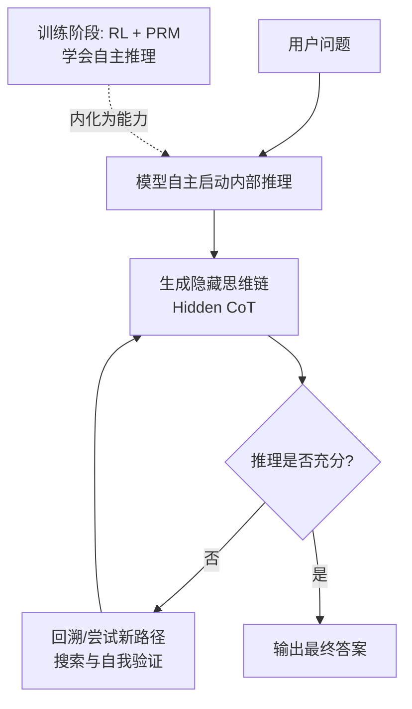

**关键点**：
1. **自主启动**：模型在收到问题后无需任何"思考提示"，自动进入深度推理模式——这是训练阶段内化的能力。
2. **隐藏思维链**：推理过程在模型内部进行，对用户不可见（API 仅返回最终答案 + 推理 token 计数）。
3. **搜索与回溯**：模型在思维链中可以回溯、尝试多条路径、自我验证，类似在脑中进行 ToT 搜索。
4. **推理预算可控**：通过 `max_completion_tokens` 等参数控制思考长度上限，在质量与成本/延迟间权衡。

### 完整 Python 示例代码

#### 环境配置与客户端初始化

```python
"""
Test-Time Compute Scaling 测试时计算扩展
对比：传统 CoT (gpt-4o + "let's think step by step")
      vs Test-Time Compute (o3-mini 无需提示)
并通过 max_completion_tokens 控制推理预算
"""

import os
from openai import OpenAI

client = OpenAI(
    api_key=os.environ.get("OPENAI_API_KEY", "your-api-key-here"),
    base_url=os.environ.get("OPENAI_BASE_URL", None),
)
```

#### 传统 CoT 基线（gpt-4o + 显式提示）

```python
def traditional_direct(question: str, model: str = "gpt-4o") -> str:
    """基线：直接提问，不引导推理过程"""
    response = client.chat.completions.create(
        model=model,
        messages=[{"role": "user", "content": question}],
        temperature=0.0,
    )
    return response.choices[0].message.content


def traditional_cot(question: str, model: str = "gpt-4o") -> str:
    """传统 CoT：依赖 prompt 中的 'let's think step by step' 引导推理。
    推理过程对外可见，需要用户主动添加思考提示。"""
    prompt = f"""{question}

Let's think step by step. 请一步一步地推理，最后给出答案。"""
    response = client.chat.completions.create(
        model=model,
        messages=[{"role": "user", "content": prompt}],
        temperature=0.0,
    )
    return response.choices[0].message.content
```

#### Test-Time Compute（o3-mini 自主推理）

```python
def test_time_compute(question: str, model: str = "o3-mini",
                      max_completion_tokens: int = 8192,
                      reasoning_effort: str = "medium") -> dict:
    """Test-Time Compute：o3 系列模型自主启动内部推理，无需 'let's think step by step'。

    注意 o3-mini 起的 API 特性（相较 o1 系列的改进）：
    - 重新支持 temperature（建议 0.6）/ top_p 等采样参数
    - 支持 system prompt（推荐使用 developer message）
    - 新增 reasoning_effort 参数（low/medium/high），控制思考深度
    - 使用 max_completion_tokens 替代 max_tokens，控制"思考+回答"的总预算
    - 返回的 usage 中包含 completion_tokens_details.reasoning_tokens，
      即模型内部"隐藏思维链"消耗的 token 数（思维链本身不可见）
    """
    # o3-mini 起支持 reasoning_effort 参数控制思考深度
    response = client.chat.completions.create(
        model=model,  # 2025年主力推理模型（o3-mini）
        messages=[{"role": "user", "content": question}],
        reasoning_effort=reasoning_effort,  # low/medium/high，默认 medium
        max_completion_tokens=max_completion_tokens,
        # o3-mini 起重新支持 temperature（建议0.6）
        # temperature=0.6,
    )

    # 提取推理 token 消耗（隐藏思维链的长度指标）
    usage = response.usage
    reasoning_tokens = 0
    if (hasattr(usage, "completion_tokens_details")
            and usage.completion_tokens_details is not None):
        reasoning_tokens = getattr(
            usage.completion_tokens_details, "reasoning_tokens", 0) or 0

    return {
        "answer": response.choices[0].message.content,
        "reasoning_tokens": reasoning_tokens,
        "completion_tokens": usage.completion_tokens,
        "prompt_tokens": usage.prompt_tokens,
    }
```

#### 推理预算控制示例

```python
def test_time_compute_with_budget(question: str,
                                  budgets: list[int] = None) -> list[dict]:
    """通过 max_completion_tokens 控制思考预算，对比不同预算下的答案质量。
    budget 越大，模型可用的"思考时间"越长，理论上答案质量越高，
    但延迟和成本也相应增加。"""
    if budgets is None:
        budgets = [2048, 8192, 32768]

    results = []
    for budget in budgets:
        print(f"\n>>> 推理预算 max_completion_tokens = {budget}")
        result = test_time_compute(question, model="o3-mini",
                                   max_completion_tokens=budget)
        print(f"  推理 token: {result['reasoning_tokens']}")
        print(f"  总 completion token: {result['completion_tokens']}")
        print(f"  答案摘要: {result['answer'][:120]}...")
        result["budget"] = budget
        results.append(result)
    return results
```

#### 对比演示主流程

```python
def compare_on_math_question(question: str) -> dict:
    """在同一道数学题上对比：直接回答 / 传统 CoT / Test-Time Compute"""
    print(f"{'='*60}")
    print(f"问题：{question}")
    print(f"{'='*60}")

    # 1. 基线：直接回答
    print("\n>>> 基线：gpt-4o 直接回答（无推理引导）")
    baseline = traditional_direct(question, model="gpt-4o")
    print(baseline)

    # 2. 传统 CoT：gpt-4o + "let's think step by step"
    print("\n>>> 传统 CoT：gpt-4o + 显式思考提示")
    cot_result = traditional_cot(question, model="gpt-4o")
    print(cot_result)

    # 3. Test-Time Compute：o3-mini 自主推理
    print("\n>>> Test-Time Compute：o3-mini 自主深度推理（无需提示）")
    ttc_result = test_time_compute(question, model="o3-mini",
                                   max_completion_tokens=8192)
    print(f"[隐藏思维链消耗 reasoning_tokens = {ttc_result['reasoning_tokens']}]")
    print(ttc_result["answer"])

    return {
        "question": question,
        "baseline": baseline,
        "traditional_cot": cot_result,
        "test_time_compute": ttc_result,
    }


if __name__ == "__main__":
    # 一道需要深度推理的数学竞赛题
    question = (
        "一个正整数 n 满足：n 的各位数字之和等于 n/4 的各位数字之和。"
        "求所有满足条件的两位数 n。"
    )

    # 对比三种方式
    compare_on_math_question(question)

    # 推理预算对比
    print("\n\n" + "=" * 60)
    print("推理预算对比（同一问题，不同 max_completion_tokens）")
    print("=" * 60)
    test_time_compute_with_budget(question)
```

### 代码要点说明

| 方法 | 对应阶段 | 作用说明 |
|------|----------|----------|
| `traditional_direct` | 基线对照 | gpt-4o 直接回答，无任何推理引导，体现"无思考"的原始水平 |
| `traditional_cot` | 传统 CoT | gpt-4o + "let's think step by step"，依赖 prompt 外显引导推理，过程可见 |
| `test_time_compute` | Test-Time Compute 核心 | 调用 o3-mini，模型自主启动隐藏思维链，无需任何思考提示；通过 `max_completion_tokens` 控制思考预算，`reasoning_effort` 控制思考深度 |
| `test_time_compute_with_budget` | 推理预算控制 | 对比不同 `max_completion_tokens` 下的推理 token 消耗与答案质量，体现"用计算换质量"的权衡 |
| `compare_on_math_question` | 对比编排 | 在同一数学题上对比三种方式，直观展示 Test-Time Compute 的优势 |

> ⚠️ **推理模型 API 差异（按版本区分）**：
> - **o1 / o1-mini（2024.09）**：不支持 `temperature`、`top_p`、`system prompt`（需用 `developer message`）、不支持 `function calling`、不支持 `structured outputs`
> - **o3-mini（2025.01）**：重新支持 `temperature`（建议0.6）、支持 `reasoning_effort` 参数（low/medium/high，控制思考深度）、支持 `function calling` 和 `structured outputs`
> - **o4-mini（2025.04）**：在 o3-mini 基础上进一步优化，支持 `developer message`，推理速度更快
> - **GPT-5（2025.08）**：内置推理能力，无需选择"推理模式"，`reasoning.effort` 可选 minimal/low/medium/high，支持全部标准参数

- 使用 `max_completion_tokens`（而非 `max_tokens`）控制"思考 + 回答"的总预算。
- `usage.completion_tokens_details.reasoning_tokens` 反映隐藏思维链消耗的 token 数，是衡量"思考深度"的指标，但思维链内容本身不可见。

#### 推理模型演进时间线

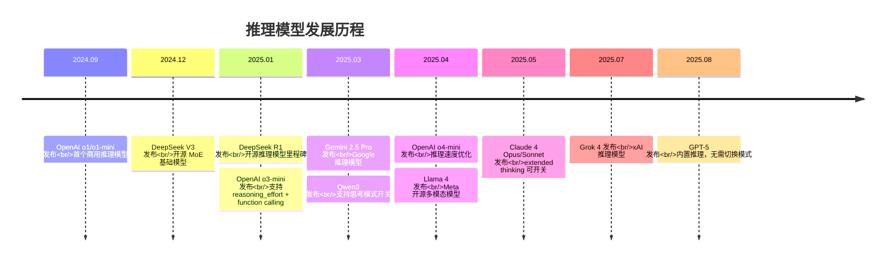

### 参考文献

- [DeepSeek-R1: Incentivizing Reasoning Capability in LLMs via Reinforcement Learning](https://arxiv.org/abs/2501.12948) — 2025.01，开源推理模型里程碑
- [DeepSeek-V3 Technical Report](https://arxiv.org/abs/2412.19437) — 2024.12，MoE 开源模型

---

## 1.15 Chain-of-Verification (CoV) — 链式验证

### 概念说明

**Chain-of-Verification（链式验证，CoV）** 由 Dhuliawala et al. 于 2023 年提出（arXiv:2305.03482），是一种**推理后自我验证并修正**的增强策略。它的核心动机是：LLM 在生成回答时可能产生事实性错误（幻觉），但如果让模型**事后对自己的回答进行验证**，往往能发现并修正这些错误。

CoV 的关键洞察是：**生成错误容易，但发现错误更容易**。模型在"验证模式"下与"回答模式"下关注的角度不同——验证时模型会针对回答中的具体事实点提出质疑，并独立求证，从而暴露原回答中的不一致之处。

**完整流程**：
1. **生成初始回答**：先让模型对问题给出一个初步回答（可能含错误）。
2. **规划验证问题**：让模型从初始回答中提取需要验证的关键事实点，生成一组验证问题。
3. **独立回答验证问题**：让模型**独立**回答每个验证问题（不参考初始回答），避免被原回答"带偏"。
4. **比对修正**：将验证问题的独立答案与初始回答比对，发现不一致之处，修正初始回答，生成最终答案。

**类比理解**：就像学生写完作文后，老师让他"自己出几道检查题"——比如"我刚才说巴黎是英国首都吗？巴黎实际是哪国首都？"——独立查证后再修正作文中的错误。

**与 Self-Consistency 的区别**：Self-Consistency 通过多次采样 + 投票来提升可靠性，是"横向"的统计方法；CoV 则是"纵向"的自我审查，针对同一回答进行深度验证和修正，更聚焦于事实性错误的发现与纠正。

### 核心流程/原理

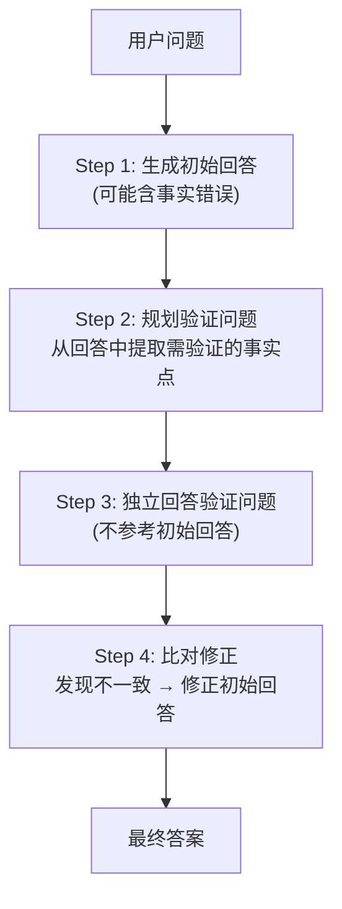

**关键点**：
1. **验证问题规划**：验证问题应针对初始回答中的**具体事实声明**，而非笼统的"对吗"。例如初始回答提到"Eiffel 铁塔建于 1887 年"，验证问题应为"Eiffel 铁塔的建造年份是？"
2. **独立验证**：回答验证问题时**不注入初始回答作为上下文**，避免模型"先入为主"地复述原答案，确保验证的独立性。
3. **比对修正**：将独立验证结果与初始回答逐条比对，仅在不一致时修正，避免过度改写。
4. **可迭代**：必要时可对修正后的答案再次执行 CoV，但通常一轮验证已能显著降低事实错误。

### 完整 Python 示例代码

#### 环境配置与客户端初始化

```python
"""
Chain-of-Verification (CoV) 链式验证
流程：生成初始回答 → 规划验证问题 → 独立验证 → 比对修正
论文: arXiv:2305.03482
"""

import os
import json
from openai import OpenAI

client = OpenAI(
    api_key=os.environ.get("OPENAI_API_KEY", "your-api-key-here"),
    base_url=os.environ.get("OPENAI_BASE_URL", None),
)
```

#### ChainOfVerification 类：初始回答与验证规划

```python
class ChainOfVerification:
    """链式验证（CoV）主类：推理后自我验证并修正"""

    def __init__(self, model: str = "gpt-4o"):
        self.model = model

    def _chat(self, prompt: str, temperature: float = 0.3) -> str:
        """统一的 LLM 调用封装"""
        response = client.chat.completions.create(
            model=self.model,
            messages=[{"role": "user", "content": prompt}],
            temperature=temperature,
        )
        return (response.choices[0].message.content or "").strip()

    def generate_initial_answer(self, question: str) -> str:
        """Step 1: 生成初始回答（可能含事实错误）"""
        prompt = f"""请回答以下问题，给出详细、完整的回答。

问题：{question}

回答："""
        return self._chat(prompt, temperature=0.3)

    def plan_verification_questions(self, question: str,
                                    initial_answer: str) -> list[str]:
        """Step 2: 从初始回答中规划验证问题
        针对回答中的关键事实声明生成独立验证问题。"""
        prompt = f"""你是一个严谨的事实核查员。下面是一个问题和针对它的回答。
请从回答中提取需要验证的关键事实声明，并为每个声明生成一个独立的验证问题。
验证问题应该是可以独立查证的事实性问题，而非主观判断。

【问题】
{question}

【待验证的回答】
{initial_answer}

请生成 3-5 个验证问题。以 JSON 字符串数组格式输出，只输出 JSON。
示例：["验证问题1", "验证问题2", "验证问题3"]"""
        raw = self._chat(prompt, temperature=0.0)
        try:
            questions = json.loads(raw)
            if isinstance(questions, list):
                return questions
        except json.JSONDecodeError:
            pass
        # 兜底解析：按行分割
        lines = [l.strip("- 1234567890.（）() ") for l in raw.split("\n")
                 if l.strip() and ("?" in l or "？" in l)]
        return lines if lines else [raw]
```

#### 独立验证与比对修正

```python
    def verify_independently(self, verification_questions: list[str]) -> list[dict]:
        """Step 3: 独立回答每个验证问题
        关键：不注入初始回答作为上下文，确保验证独立性。"""
        results = []
        for vq in verification_questions:
            prompt = f"""请独立回答以下事实性问题，给出简洁、准确的答案。
不要参考任何其他上下文，仅基于你自身的知识回答。

问题：{vq}

答案："""
            answer = self._chat(prompt, temperature=0.0)
            results.append({
                "verification_question": vq,
                "verified_answer": answer,
            })
        return results

    def revise_answer(self, question: str, initial_answer: str,
                      verification_results: list[dict]) -> str:
        """Step 4: 比对验证结果与初始回答，修正不一致之处"""
        verification_text = "\n\n".join(
            f"验证问题 {i+1}: {r['verification_question']}\n"
            f"独立验证答案: {r['verified_answer']}"
            for i, r in enumerate(verification_results)
        )

        prompt = f"""你是一个严谨的编辑。下面是一个问题的初始回答，以及对该回答中
关键事实点的独立验证结果。请比对验证结果与初始回答：

1. 如果初始回答中的事实与独立验证结果一致，保留原文；
2. 如果发现不一致，请根据验证结果修正初始回答中的错误；
3. 不要过度改写，仅修正被验证为错误的部分；
4. 保持回答的连贯性和完整性。

【原始问题】
{question}

【初始回答】
{initial_answer}

【独立验证结果】
{verification_text}

【修正后的最终回答】"""
        return self._chat(prompt, temperature=0.0)
```

#### CoV 主流程编排

```python
    def run(self, question: str) -> dict:
        """CoV 完整流程：生成 → 规划验证 → 独立验证 → 比对修正"""
        print(f"{'='*60}")
        print(f"问题：{question}")
        print(f"{'='*60}")

        # Step 1: 生成初始回答
        print("\n>>> Step 1: 生成初始回答")
        initial_answer = self.generate_initial_answer(question)
        print(initial_answer)

        # Step 2: 规划验证问题
        print("\n>>> Step 2: 规划验证问题")
        v_questions = self.plan_verification_questions(question, initial_answer)
        for i, vq in enumerate(v_questions):
            print(f"  验证问题 {i+1}: {vq}")

        # Step 3: 独立验证
        print("\n>>> Step 3: 独立回答验证问题")
        verification_results = self.verify_independently(v_questions)
        for i, r in enumerate(verification_results):
            print(f"  [{i+1}] {r['verification_question']}")
            print(f"      → {r['verified_answer']}")

        # Step 4: 比对修正
        print("\n>>> Step 4: 比对验证结果，修正初始回答")
        final_answer = self.revise_answer(question, initial_answer,
                                          verification_results)
        print(final_answer)

        return {
            "question": question,
            "initial_answer": initial_answer,
            "verification_questions": v_questions,
            "verification_results": verification_results,
            "final_answer": final_answer,
        }
```

#### 主流程与演示

```python
if __name__ == "__main__":
    # 含易混淆事实的问题，验证 CoV 的事实纠错能力
    question = (
        "请介绍埃菲尔铁塔的建造历史，包括建造年份、设计师、"
        "高度和最初建成的目的。"
    )

    cov = ChainOfVerification(model="gpt-4o")
    result = cov.run(question)

    print(f"\n{'='*60}")
    print("【对比】初始回答 vs 修正后回答")
    print(f"{'='*60}")
    print(f"初始回答摘要: {result['initial_answer'][:150]}...")
    print(f"最终回答摘要: {result['final_answer'][:150]}...")
```

### 代码要点说明

| 方法 | 对应阶段 | 作用说明 |
|------|----------|----------|
| `generate_initial_answer` | Step 1 初始生成 | 对问题给出初步回答，可能含事实性错误（幻觉） |
| `plan_verification_questions` | Step 2 验证规划 | 从初始回答中提取关键事实声明，生成可独立查证的验证问题 |
| `verify_independently` | Step 3 独立验证 | **不注入初始回答**作为上下文，独立回答每个验证问题，确保验证不被原答案"带偏" |
| `revise_answer` | Step 4 比对修正 | 比对验证结果与初始回答，仅修正不一致之处，避免过度改写 |
| `run` | 流程编排 | 串联四阶段，输出初始回答、验证问题、验证结果、修正后回答的完整记录 |

**关键设计提醒**：
- **独立性是 CoV 的核心**：`verify_independently` 的 prompt 中**不包含初始回答**，这是为了避免模型"先入为主"地复述原答案。如果验证时注入了初始回答，模型倾向于为原答案"辩护"，验证就失去了意义。
- **验证问题应具体可查**：`plan_verification_questions` 生成的应是针对具体事实声明的验证问题（如"埃菲尔铁塔的建造年份？"），而非笼统的"对吗"。
- **修正应保守**：`revise_answer` 仅修正被验证为错误的部分，保留原文中正确且未被挑战的内容，避免过度改写导致信息丢失。

---

## 总结对比表

| 模式 | 结构 | 推理方式 | 核心机制 | 适用场景 | 计算成本 |
|------|------|----------|----------|----------|----------|
| **CoT** | 线性链 | 串行分步 | Prompt 引导分步推理 | 数学题、逻辑推理、常识推理 | ★☆☆ 低 |
| **ToT** | 树形 | 分支搜索 | BFS/DFS + 自我评估剪枝 | 需要探索多路径的规划、创作 | ★★★ 高 |
| **GoT** | 有向无环图 | 网状融合 | 合并/拆分/回溯/跳跃 | 复杂分析、需要整合多视角 | ★★★ 高 |
| **Self-Consistency** | 并行采样 | 投票聚合 | 多次 CoT + 多数投票 | 有确定性答案的推理任务 | ★★☆ 中 |
| **PoT** | 程序执行 | 代码计算 | LLM 写代码 + 解释器执行 | 数学计算、算法问题 | ★★☆ 中 |
| **Step-Back** | 两阶段 | 抽象→具体 | 先提取原理再具体推理 | 原理驱动的科学/工程问题 | ★★☆ 中 |
| **Least-to-Most** | 层次序列 | 递进求解 | 拆分子问题，顺序求解 | 需多步分解的复杂问题 | ★★☆ 中 |
| **Analog Prompting** | 自生成示例 | 类比借鉴 | 生成类比案例，借鉴推理 | 新颖问题、无现成示例的场景 | ★★☆ 中 |
| **Skeleton-of-Thought** | 骨架+并行扩展 | 提纲→扩写 | 先生成要点骨架，再并行扩展 | 长文本生成、低延迟场景 | ★★☆ 中 |
| **RE2** | 单次重读 | 复述+推理 | 重复阅读问题两次再回答 | 审题易错、含约束陷阱的问题 | ★☆☆ 低 |
| **System 2 Attention** | 两阶段 | 净化→推理 | 先重写上下文剔除干扰，再回答 | 含无关/偏见/误导信息的上下文 | ★★☆ 中 |
| **Emotion Prompting** | 单次增强 | 情感刺激 | 在 prompt 中加入情感刺激语 | 通用增强、可与任意模式叠加 | ★☆☆ 低 |
| **LATS** | 蒙特卡洛树 | 推理+行动搜索 | MCTS 四阶段 + LLM 价值评估与反思 | 编程、数学、Web 导航等复杂决策 | ★★★★ 很高 |
| **Test-Time Compute** | 隐藏思维链 | 自主深度推理 | 模型内化 RL+PRM，推理时自主搜索回溯 | 数学竞赛、编程题、科学推理 | ★★★★ 很高 |
| **CoV** | 四阶段串行 | 验证+修正 | 生成→规划验证→独立验证→比对修正 | 事实密集型问答、易幻觉场景 | ★★☆ 中 |

### 选型建议

1. **简单推理任务**（单步或少量推理）：优先使用 **CoT**，简单高效。
2. **需要高准确率**的选择题/判断题：**Self-Consistency** 是性价比最高的增强手段。
3. **涉及精确计算**：优先使用 **PoT**，将计算交给解释器。
4. **有多条可能路径的开放问题**（规划、设计、创作）：**ToT** 或 **GoT**，其中 GoT 更适合需要融合多种视角的场景。
5. **原理驱动的专业问题**：**Step-Back Prompting** 能有效激活模型的领域知识。
6. **天然可分解的问题**：**Least-to-Most** 最适合，尤其是组合数学、多步骤分析。
7. **新颖且没有示例的问题**：**Analog Prompting** 通过自生成示例弥补 Few-shot 依赖人工标注的不足。
8. **长文本生成且对延迟敏感**：**Skeleton-of-Thought** 先列骨架再并行扩展，可显著缩短端到端响应时间。
9. **审题易错、含约束陷阱的问题**：**RE2** 几乎零成本，强制重读+复述，适合作为通用"打底"增强。
10. **上下文含无关/偏见/误导信息**：**System 2 Attention** 先净化上下文再回答，对抗性场景效果尤为明显。
11. **追求稳定且低成本的通用增强**：**Emotion Prompting** 加入情感刺激语即可，可与任意模式叠加，几乎无额外开销。
12. **需要与环境交互的复杂决策任务**（编程、数学、Web 导航等）：**LATS** 通过 MCTS 在"推理+行动"组合空间上搜索，并引入环境反馈与反思，是 ReAct/Reflexion 的更一般化框架；当 ToT 仅在思维空间搜索不足以应对带真实环境反馈的任务时，LATS 是更优选择，但其计算成本（多次 LLM 调用 + 树搜索）也最高，适合对准确率要求极高的离线场景。
13. **需要深度推理的高难度任务**（数学竞赛、编程题）：**Test-Time Compute Scaling** 让模型自主启动隐藏思维链，无需 prompt 引导即可深度思考，适合对准确率要求极高且对延迟不敏感的场景。
14. **事实密集型问答、易产生幻觉的场景**：**Chain-of-Verification (CoV)** 通过"生成→规划验证→独立验证→比对修正"四阶段自我纠错，显著降低事实性错误，适合知识问答、百科介绍等需要事实准确性的任务。

### 组合使用

在实际应用中，这些模式可以互相组合，例如：
- **Self-Consistency + CoT**：多次 CoT 采样后投票（最经典的组合）。
- **Least-to-Most + PoT**：将问题分解后，对每个数值子问题用 PoT 精确计算。
- **ToT + Step-Back**：在搜索思维树时，用 Step-Back 评估每个节点背后的原理是否站得住脚。
- **Analog Prompting + CoT**：用类比案例作为 Few-shot 示例，引导 CoT 推理。