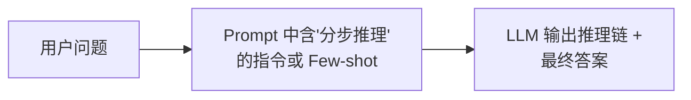
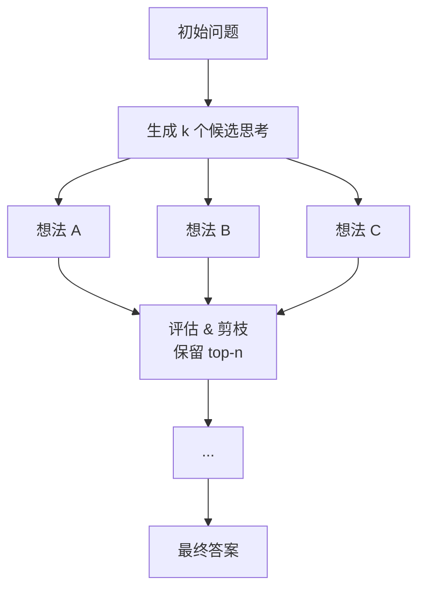
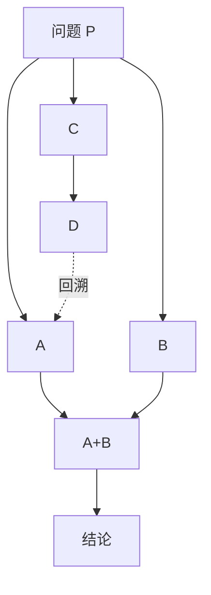
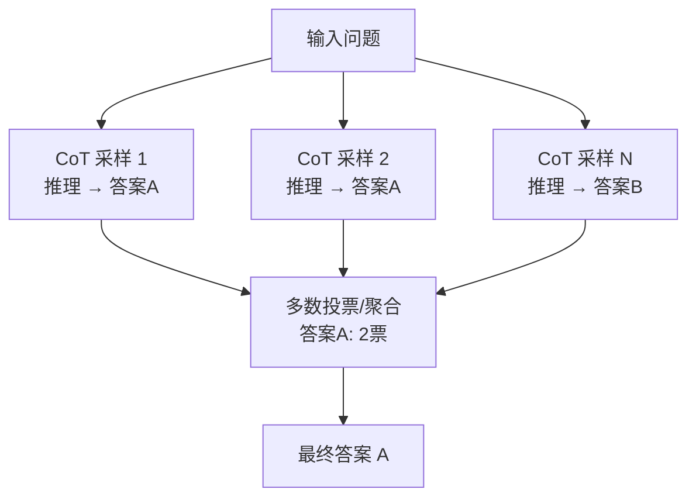
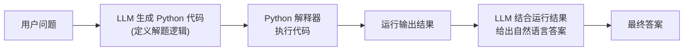
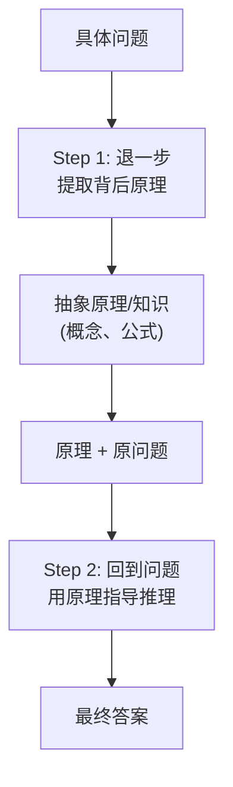
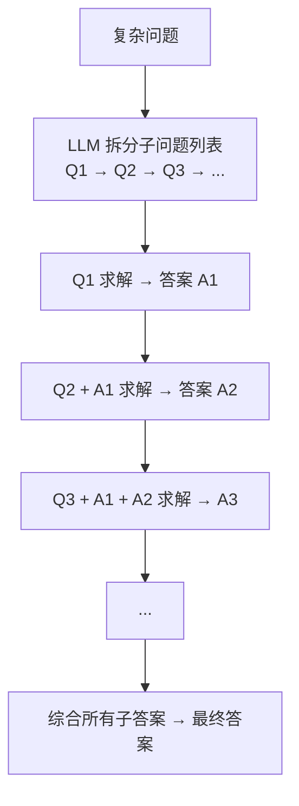
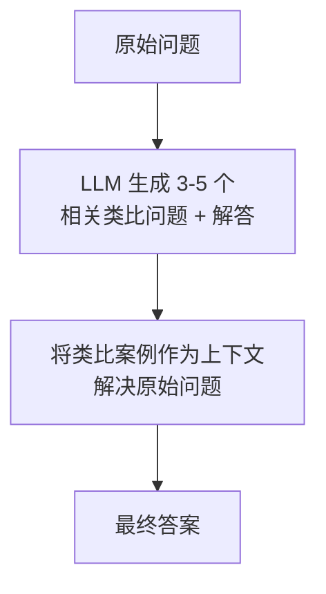

# 一、推理增强类 Agent 设计模式

推理增强类设计模式是让大语言模型（LLM）在给出最终答案之前，进行更深层、更结构化、更可靠的思考过程的方法论。这类模式的核心思想是：**不直接让模型跳到答案，而是引导模型先"想清楚"再回答**。

本章涵盖以下 8 种推理增强模式：

| 序号 | 模式 | 核心要点 |
|------|------|----------|
| 1.1 | Chain-of-Thought (CoT) | 分步列出推理过程 |
| 1.2 | Tree of Thoughts (ToT) | 多分支搜索，BFS/DFS 寻找最优路径 |
| 1.3 | Graph of Thoughts (GoT) | 有向无环图，支持合并、拆分、回溯 |
| 1.4 | Self-Consistency | 多次采样 + 多数投票 |
| 1.5 | Program of Thoughts (PoT) | 用代码表达推理，交解释器执行 |
| 1.6 | Step-Back Prompting | 先退一步抽象思考，再回到具体问题 |
| 1.7 | Least-to-Most | 分解子问题，逐步求解 |
| 1.8 | Analog Prompting | 自生成类比案例，借鉴推理 |

---

## 1.1 Chain-of-Thought (CoT) — 思维链

### 概念说明

**Chain-of-Thought（思维链）**是最基础也是最重要的推理增强技术。它在 prompt 中引导模型将复杂问题分解为多个中间推理步骤，逐步推导出最终答案。

在标准 prompt 中，模型直接输出答案，容易在复杂推理任务（如数学题、逻辑推理）中出现错误。而 CoT 通过在 prompt 中给出"分步推理"的示范，或直接要求模型"一步一步思考"，让模型在生成答案前先产出一系列中间推理步骤。这些中间步骤就像人类在草稿纸上演算一样，显著提高了最终答案的准确率。

**类比理解**：好比要求一个学生"先写解题过程，再写答案"，而不是直接写答案——过程对了，答案自然就对了。

### 核心流程/原理



**关键点**：
1. **Zero-shot CoT**：直接在 prompt 中添加 "Let's think step by step"（让我们一步步思考），无需示例。
2. **Few-shot CoT**：提供几个包含完整推理步骤的示例，让模型模仿这种推理风格。
3. 推理步骤是**线性串行**的，每一步基于上一步的结论。

### 完整 Python 示例代码

#### 环境配置与客户端初始化

```python
"""
Chain-of-Thought (CoT) 思维链推理
对比：直接回答 vs Zero-shot CoT vs Few-shot CoT
"""

import os
from openai import OpenAI

client = OpenAI(
    api_key=os.environ.get("OPENAI_API_KEY", "your-api-key-here"),
    base_url=os.environ.get("OPENAI_BASE_URL", None),
)
```

#### CoT 推理函数

```python
def direct_answer(question: str, model: str = "gpt-4") -> str:
    """直接提问，不引导推理过程"""
    response = client.chat.completions.create(
        model=model,
        messages=[
            {"role": "user", "content": f"Q: {question}\nA:"}
        ],
        temperature=0.0,
    )
    return response.choices[0].message.content


def zero_shot_cot(question: str, model: str = "gpt-4") -> str:
    """Zero-shot CoT：在 prompt 中加上'让我们一步步思考'"""
    response = client.chat.completions.create(
        model=model,
        messages=[
            {
                "role": "user",
                "content": f"Q: {question}\n请一步一步地思考推理，最后给出答案。\nA: 让我们一步步思考。"
            }
        ],
        temperature=0.0,
    )
    return response.choices[0].message.content


def few_shot_cot(question: str, model: str = "gpt-4") -> str:
    """Few-shot CoT：提供带推理过程的示例"""
    examples = """
Q: Roger有5个网球。他又买了2罐网球，每罐有3个网球。他现在有多少个网球？
A: Roger最初有5个网球。他又买了2罐，每罐3个，所以2×3=6个新网球。加上原来的5个，5+6=11。答案是11。

Q: 一个班级有23名学生，其中12名是男生。今天有3名男生和2名女生请假。今天来了多少名学生？
A: 总共有23名学生。男生12名，女生23-12=11名。请假：3名男生+2名女生=5名。今天到校：23-5=18名。答案是18。
"""

    response = client.chat.completions.create(
        model=model,
        messages=[
            {"role": "user", "content": f"{examples}\n\nQ: {question}\nA:"}
        ],
        temperature=0.0,
    )
    return response.choices[0].message.content
```

#### 主流程与演示

```python
if __name__ == "__main__":
    question = "一个农场有15只鸡和一些兔子。总共有46条腿。兔子有多少只？"

    print("=" * 60)
    print("【直接回答】")
    print(direct_answer(question))
    print()
    print("=" * 60)
    print("【Zero-shot CoT】")
    print(zero_shot_cot(question))
    print()
    print("=" * 60)
    print("【Few-shot CoT】")
    print(few_shot_cot(question))
```

---

## 1.2 Tree of Thoughts (ToT) — 思维树

### 概念说明

**Tree of Thoughts（思维树）**是 CoT 的扩展，它将推理过程从一条"线"扩展为一棵"树"。模型在每个推理节点可以生成多个候选的"下一步思考方向"，然后用 BFS（广度优先搜索）或 DFS（深度优先搜索）探索这棵思维树，并通过**自我评估**剪枝低质量分支，最终找到最优的推理路径。

**类比理解**：CoT 是走一条直路到终点；ToT 是站在每个岔路口，先看看每条岔路通向哪里，选最有希望的那条走下去。就像下棋时的"多步推演"。

### 核心流程/原理



**关键步骤**：
1. **分解（Decompose）**：将当前思考状态拆分为多个候选的"下一步想法"。
2. **生成（Generate）**：对每个候选，让 LLM 生成该方向上的推进内容。
3. **评估（Evaluate）**：让 LLM 对每个候选想法打分或做质量判断。
4. **选择（Select）**：保留最有希望的几个分支（如 Top-3），继续下一轮。
5. **终止**：找到满足条件的完整推理路径，或达到最大深度。

### 完整 Python 示例代码

#### 环境配置与数据结构

```python
"""
Tree of Thoughts (ToT) 思维树推理
使用 BFS 探索多条推理路径，通过 LLM 自我评估进行剪枝
"""

import os
import json
from dataclasses import dataclass, field
from openai import OpenAI

client = OpenAI(
    api_key=os.environ.get("OPENAI_API_KEY", "your-api-key-here"),
    base_url=os.environ.get("OPENAI_BASE_URL", None),
)


@dataclass
class ThoughtNode:
    """思维树中的一个节点"""
    content: str
    score: float = 0.0
    children: list["ThoughtNode"] = field(default_factory=list)
    depth: int = 0
    parent: "ThoughtNode | None" = None
```

#### 候选想法生成

```python
def generate_thoughts(problem: str, context: str, num_thoughts: int = 3,
                      model: str = "gpt-4") -> list[str]:
    """给定当前上下文，生成 k 个候选的下一步想法"""
    prompt = f"""你正在解决以下问题：
{problem}

当前的推理进展：
{context}

请生成 {num_thoughts} 个不同的下一步推理方向。每个方向应该是一个独立的、有逻辑的想法。
请以 JSON 列表格式输出，每个元素是一个字符串。只输出 JSON，不要其他内容。

示例输出格式：["想法1", "想法2", "想法3"]
"""
    response = client.chat.completions.create(
        model=model,
        messages=[{"role": "user", "content": prompt}],
        temperature=0.8,
    )
    raw = response.choices[0].message.content
    try:
        thoughts = json.loads(raw)
        return thoughts if isinstance(thoughts, list) else [raw]
    except json.JSONDecodeError:
        lines = [l.strip("- 1234567890. ") for l in raw.split("\n") if l.strip()]
        return lines[:num_thoughts]
```

#### 想法评分

```python
def evaluate_thoughts(problem: str, thoughts: list[str],
                      model: str = "gpt-4") -> list[float]:
    """对每个候选想法打分（1-10），返回分数列表"""
    scores = []
    for thought in thoughts:
        prompt = f"""你正在解决以下问题：
{problem}

请评估以下推理步骤的质量和正确性，给出 1-10 的分数（10 为最高）：

推理步骤：{thought}

评分标准：
- 逻辑正确性（是否合理）
- 推进性（是否有助于解决问题）
- 清晰性（是否表达清楚）

请只回复一个数字（1-10），不要其他内容。"""
        response = client.chat.completions.create(
            model=model,
            messages=[{"role": "user", "content": prompt}],
            temperature=0.0,
        )
        raw = response.choices[0].message.content.strip()
        try:
            score = float(raw) / 10.0
        except ValueError:
            score = 0.5
        scores.append(score)
    return scores
```

#### BFS 搜索算法

```python
def bfs_search(problem: str, max_depth: int = 3, beam_width: int = 2,
               num_thoughts: int = 3, model: str = "gpt-4") -> ThoughtNode:
    """
    BFS 搜索思维树
    - max_depth: 最大搜索深度
    - beam_width: 每层保留的分支数
    - num_thoughts: 每个节点生成的候选数
    """
    root = ThoughtNode(content="开始解决问题", depth=0)

    current_layer = [root]

    for depth in range(1, max_depth + 1):
        all_candidates = []

        for node in current_layer:
            thoughts = generate_thoughts(
                problem=problem,
                context=node.content,
                num_thoughts=num_thoughts,
                model=model,
            )
            scores = evaluate_thoughts(problem, thoughts, model=model)

            for thought, score in zip(thoughts, scores):
                child = ThoughtNode(
                    content=thought,
                    score=score,
                    depth=depth,
                    parent=node,
                )
                node.children.append(child)
                all_candidates.append((child, node))

        all_candidates.sort(key=lambda x: x[0].score, reverse=True)

        current_layer = [c[0] for c in all_candidates[:beam_width]]

        print(f"\n=== 第 {depth} 层（保留 Top-{beam_width}） ===")
        for node in current_layer:
            print(f"  [分数: {node.score:.2f}] {node.content[:80]}...")

    if current_layer:
        return current_layer[0]
    return root
```

#### 答案综合与主流程

```python
def synthesize_answer(problem: str, best_path: str, model: str = "gpt-4") -> str:
    """基于最优推理路径，综合生成最终答案"""
    prompt = f"""基于以下推理过程，给出问题的最终答案。

问题：{problem}

推理过程：
{best_path}

请总结推理过程并给出清晰的最终答案。"""
    response = client.chat.completions.create(
        model=model,
        messages=[{"role": "user", "content": prompt}],
        temperature=0.0,
    )
    return response.choices[0].message.content


def tree_of_thoughts(problem: str, model: str = "gpt-4") -> str:
    """ToT 主流程"""
    print(f"\n{'='*60}")
    print(f"问题：{problem}")
    print(f"{'='*60}")

    best_node = bfs_search(problem=problem, max_depth=3, beam_width=2, model=model)

    path_parts = []
    node = best_node
    while node is not None:
        part = f"[深度 {node.depth}] {node.content}" if node.depth > 0 else f"[起始] {node.content}"
        path_parts.insert(0, part)
        node = node.parent
    full_path = "\n\n".join(path_parts)

    answer = synthesize_answer(problem, full_path, model=model)

    print(f"\n{'='*60}")
    print("最终答案：")
    print(answer)
    return answer
```

#### 主流程与演示

```python
if __name__ == "__main__":
    problem = "我需要用一根绳子围出一个面积最大的矩形区域，" \
              "但绳子只有20米长。我应该如何设计这个矩形？"

    result = tree_of_thoughts(problem)
```

---

## 1.3 Graph of Thoughts (GoT) — 思维图

### 概念说明

**Graph of Thoughts（思维图）**是 ToT 的进一步泛化。它将推理过程建模为**有向无环图（DAG）**，而不是树。在图结构中，不同的思维节点可以：
- **合并（Merge）**：将两条或多条推理路径的结论融合，产生更全面的想法。
- **拆分（Split）**：将一个想法拆成多个子方向分别探索。
- **回溯（Backtrack）**：如果发现当前方向走不通，可以回到之前的节点重新尝试。
- **跳跃（Jump）**：跨层引用之前的思维节点。

这与人类解决复杂问题时"画思维导图"的方式高度吻合——想法之间不是简单的父子关系，而是网状关联。

**类比理解**：ToT 是一棵树的枝杈，GoT 则像一张地铁线路图——站点之间可以交叉、汇合、分岔。

### 核心流程/原理



**关键操作**：
| 操作 | 说明 |
|------|------|
| **Generate** | 从一个节点生成 k 个后续想法 |
| **Aggregate/Merge** | 将多个节点的内容融合为一个综合想法 |
| **Refine** | 对某个想法进行优化和改进 |
| **Score** | 评估想法的质量 |
| **Backtrack** | 当某条路径评分过低时，回到上游节点重新尝试 |

### 完整 Python 示例代码

#### 环境配置与数据结构

```python
"""
Graph of Thoughts (GoT) 思维图推理
使用有向无环图（DAG）建模推理过程，支持合并、拆分、回溯
"""

import os
import json
from collections import defaultdict
from dataclasses import dataclass, field
from openai import OpenAI

client = OpenAI(
    api_key=os.environ.get("OPENAI_API_KEY", "your-api-key-here"),
    base_url=os.environ.get("OPENAI_BASE_URL", None),
)


@dataclass
class GoTNode:
    """思维图中的一个节点"""
    node_id: int
    content: str
    score: float = 0.0
    parents: list[int] = field(default_factory=list)  # 父节点 ID 列表
    children: list[int] = field(default_factory=list)  # 子节点 ID 列表
    operation: str = "generate"  # generate | merge | refine
```

#### 思维图引擎：初始化与辅助方法

```python
class GraphOfThoughts:
    """思维图引擎"""

    def __init__(self, problem: str, model: str = "gpt-4"):
        self.problem = problem
        self.model = model
        self.nodes: dict[int, GoTNode] = {}
        self.next_id = 0
        self.root_id: int | None = None
        self.current_node_id: int | None = None

    def _new_id(self) -> int:
        nid = self.next_id
        self.next_id += 1
        return nid

    def _call_llm(self, prompt: str, temperature: float = 0.7) -> str:
        response = client.chat.completions.create(
            model=self.model,
            messages=[{"role": "user", "content": prompt}],
            temperature=temperature,
        )
        return response.choices[0].message.content.strip()

    def initialize(self):
        """创建根节点——对问题的初步理解"""
        nid = self._new_id()
        prompt = f"请简要描述你对以下问题的理解和初步解决思路：\n\n{self.problem}"
        content = self._call_llm(prompt, temperature=0.3)
        self.nodes[nid] = GoTNode(node_id=nid, content=content, score=1.0)
        self.root_id = nid
        self.current_node_id = nid
        print(f"[根节点 #{nid}] {content[:100]}...")
        return nid
```

#### 思维图引擎：分支生成（Split）

```python
    def generate_thoughts(self, parent_id: int, num: int = 3) -> list[int]:
        """从某个节点分支出多个候选想法（Split 操作）"""
        parent = self.nodes[parent_id]
        prompt = f"""问题：{self.problem}

当前思考：{parent.content}

请生成 {num} 个不同的后续推理方向。每个方向应独立且有逻辑。
以 JSON 字符串数组格式输出，只输出 JSON。

示例：["方向1的描述", "方向2的描述", "方向3的描述"]
"""
        raw = self._call_llm(prompt, temperature=0.8)
        try:
            thoughts = json.loads(raw)
            if not isinstance(thoughts, list):
                thoughts = [raw]
        except json.JSONDecodeError:
            thoughts = [raw]

        new_ids = []
        for t in thoughts[:num]:
            nid = self._new_id()
            self.nodes[nid] = GoTNode(
                node_id=nid,
                content=t,
                parents=[parent_id],
                operation="generate",
            )
            self.nodes[parent_id].children.append(nid)
            new_ids.append(nid)
            print(f"  [分支 #{nid}] {t[:80]}...")

        return new_ids
```

#### 思维图引擎：合并与优化

```python
    def merge_thoughts(self, node_ids: list[int]) -> int:
        """将多个节点的想法合并为一个综合想法（Merge/Aggregate）"""
        contents = "\n---\n".join(
            f"想法{idx+1}: {self.nodes[nid].content}"
            for idx, nid in enumerate(node_ids)
        )
        prompt = f"""问题：{self.problem}

以下是多个不同的推理方向，请将它们整合为一个统一、全面的综合分析：

{contents}

请输出一个综合性的推理结论，要融合各方向的核心观点。"""
        merged_content = self._call_llm(prompt, temperature=0.3)

        nid = self._new_id()
        self.nodes[nid] = GoTNode(
            node_id=nid,
            content=merged_content,
            parents=list(node_ids),
            operation="merge",
        )
        for pid in node_ids:
            self.nodes[pid].children.append(nid)
        print(f"[合并节点 #{nid}] ← #{node_ids} | {merged_content[:100]}...")
        return nid

    def refine_thought(self, node_id: int) -> int:
        """对某个想法进行优化和改进（Refine）"""
        current = self.nodes[node_id]
        prompt = f"""问题：{self.problem}

当前想法：{current.content}

请对这个想法进行批判性审查和改进。指出潜在问题，并给出优化后的版本。"""
        refined_content = self._call_llm(prompt, temperature=0.3)

        nid = self._new_id()
        self.nodes[nid] = GoTNode(
            node_id=nid,
            content=refined_content,
            parents=[node_id],
            operation="refine",
        )
        self.nodes[node_id].children.append(nid)
        print(f"[优化节点 #{nid}] ← #{node_id} | {refined_content[:100]}...")
        return nid
```

#### 思维图引擎：评分与路径搜索

```python
    def score_node(self, node_id: int) -> float:
        """评估某个想法的质量分数 (0-1)"""
        node = self.nodes[node_id]
        prompt = f"""问题：{self.problem}

请评估以下推理内容的质量，给出 1-10 的分数。
只回复数字，不要其他内容。

推理内容：{node.content}"""
        raw = self._call_llm(prompt, temperature=0.0)
        try:
            score = float(raw.strip()) / 10.0
        except ValueError:
            score = 0.5
        self.nodes[node_id].score = score
        return score

    def get_best_path(self) -> list[int]:
        """获取当前图中得分最高的叶子节点路径"""
        scored = [(nid, node.score) for nid, node in self.nodes.items()]
        scored.sort(key=lambda x: x[1], reverse=True)

        best_path = []
        current = scored[0][0]
        while current != self.root_id:
            best_path.insert(0, current)
            if self.nodes[current].parents:
                current = self.nodes[current].parents[0]
            else:
                break
        best_path.insert(0, self.root_id)
        return best_path
```

#### 思维图引擎：答案综合与可视化

```python
    def synthesize(self, node_ids: list[int]) -> str:
        """根据路径上的所有节点综合最终答案"""
        contents = "\n\n".join(
            f"[步骤 {i+1}] {self.nodes[nid].content}"
            for i, nid in enumerate(node_ids)
        )
        prompt = f"""基于以下推理过程，给出问题的最终答案。

问题：{self.problem}

推理过程：
{contents}

请总结并给出清晰、完整的最终答案。"""
        return self._call_llm(prompt, temperature=0.0)

    def print_graph(self):
        """打印图结构概览"""
        print(f"\n{'='*60}")
        print("思维图结构：")
        print(f"{'='*60}")
        for nid, node in self.nodes.items():
            op_symbol = {
                "generate": "→",
                "merge": "⊕",
                "refine": "↻",
            }.get(node.operation, "?")
            print(f"  [{op_symbol}] #{nid} (score={node.score:.2f}) "
                  f"parents={node.parents} children={node.children}")
            print(f"       {node.content[:80]}...")
```

#### GoT 演示函数

```python
def graph_of_thoughts_demo(problem: str):
    """GoT 完整流程演示"""
    got = GraphOfThoughts(problem)

    print("\n" + "=" * 60)
    print(f"问题：{problem}")
    print("=" * 60)

    # Step 1: 初始化
    print("\n>>> Step 1: 初始化根节点")
    root_id = got.initialize()

    # Step 2: 从根节点拆分为多个方向
    print("\n>>> Step 2: 拆分（Split）— 生成多个推理方向")
    branch_ids = got.generate_thoughts(root_id, num=3)

    # Step 3: 对每个分支评分
    print("\n>>> Step 3: 评分")
    for bid in branch_ids:
        s = got.score_node(bid)
        print(f"  分支 #{bid} 得分: {s:.2f}")

    # Step 4: 合并前两个分支
    print("\n>>> Step 4: 合并（Merge）— 融合高分分支")
    merged_id = got.merge_thoughts(branch_ids[:2])

    # Step 5: 优化合并结果
    print("\n>>> Step 5: 优化（Refine）— 改进合并后的想法")
    refined_id = got.refine_thought(merged_id)

    # Step 6: 从优化节点再拆分
    print("\n>>> Step 6: 再次拆分 — 从优化节点展开")
    final_branches = got.generate_thoughts(refined_id, num=2)

    # 评分
    for bid in final_branches:
        s = got.score_node(bid)
        print(f"  分支 #{bid} 得分: {s:.2f}")

    # Step 7: 获取最优路径并综合
    print("\n>>> Step 7: 综合最终答案")
    best_path = got.get_best_path()
    answer = got.synthesize(best_path)

    got.print_graph()

    print(f"\n{'='*60}")
    print("最终答案：")
    print(answer)
    return answer
```

#### 主流程与演示

```python
if __name__ == "__main__":
    problem = "一家公司计划推出一款新产品。市场调研显示有60%的概率成功，" \
              "成功可获利200万元；失败则亏损80万元。此外，可以先花15万元" \
              "做一次更详细的市场测试，测试有90%准确率。公司应该做测试吗？"

    graph_of_thoughts_demo(problem)
```

---

## 1.4 Self-Consistency — 自洽性

### 概念说明

**Self-Consistency（自洽性/自一致性）**是一种简单而强大的推理增强方法。它的核心思想是：**同一个问题让模型推理多次（使用较高的 temperature 产生多样性），然后对多个推理结果取多数投票**。

这利用了 LLM 的随机性——在 temperature > 0 时，每次生成的推理路径可能不同。通过采样多条路径并比较它们的最终答案，答案的一致程度可以作为置信度的指标，多数派答案通常更可靠。

**类比理解**：就像做选择题时，找多位专家分别独立作答，然后"少数服从多数"——多数人认可的答案出错概率更低。

### 核心流程/原理



**关键设计**：
1. 必须使用 **temperature > 0**（通常 0.5~0.8）以产生多样性。
2. 每条推理路径必须是**完整的 CoT 推理 + 答案**，而不仅仅是答案。
3. 投票时，只比较**最终答案**，推理过程可以不同。
4. 采样次数通常为 5~20 次，越多越稳定但成本越高。

### 完整 Python 示例代码

#### 环境配置与客户端初始化

```python
"""
Self-Consistency 自洽性推理
多次 CoT 采样 → 提取答案 → 多数投票
"""

import os
import re
from collections import Counter
from openai import OpenAI

client = OpenAI(
    api_key=os.environ.get("OPENAI_API_KEY", "your-api-key-here"),
    base_url=os.environ.get("OPENAI_BASE_URL", None),
)
```

#### CoT 采样与答案提取

```python
def cot_sample(question: str, model: str = "gpt-4",
               temperature: float = 0.7) -> str:
    """单次 CoT 采样，返回完整推理+答案"""
    response = client.chat.completions.create(
        model=model,
        messages=[
            {
                "role": "user",
                "content": f"""请一步一步地仔细推理以下问题，最后在单独一行给出最终答案，
格式为：最终答案：<你的答案>

问题：{question}"""
            }
        ],
        temperature=temperature,
    )
    return response.choices[0].message.content


def extract_answer(reasoning_text: str) -> str:
    """从推理文本中提取最终答案"""
    patterns = [
        r"最终答案[：:]\s*(.+)",
        r"答案[：:]\s*(.+)",
        r"所以[,，]?\s*(.+)",
        r"[Tt]he answer is\s*(.+)",
        r"[Aa]nswer[：:]\s*(.+)",
    ]
    lines = reasoning_text.strip().split("\n")
    # 从最后几行查找
    for line in reversed(lines):
        for pat in patterns:
            m = re.search(pat, line)
            if m:
                return m.group(1).strip()
    # 兜底：返回最后一行
    return lines[-1].strip() if lines else reasoning_text.strip()
```

#### 自洽性主流程

```python
def self_consistency(question: str, num_samples: int = 5,
                     model: str = "gpt-4", temperature: float = 0.7) -> dict:
    """
    Self-Consistency 主流程
    返回：最终答案、投票分布、所有采样结果
    """
    print(f"问题：{question}\n")
    print(f"进行 {num_samples} 次独立推理采样...\n")

    all_answers = []
    all_reasonings = []

    for i in range(num_samples):
        print(f"--- 采样 {i+1}/{num_samples} ---")
        reasoning = cot_sample(question, model=model, temperature=temperature)
        answer = extract_answer(reasoning)
        all_reasonings.append(reasoning)
        all_answers.append(answer)
        print(f"  推理摘要: {reasoning[:100]}...")
        print(f"  提取答案: {answer}\n")

    # 投票统计
    vote_counts = Counter(all_answers)

    print("=" * 50)
    print("投票结果：")
    for ans, count in vote_counts.most_common():
        bar = "█" * count
        print(f"  {ans:<20} {bar} ({count}票)")

    winner = vote_counts.most_common(1)[0][0]
    confidence = vote_counts[winner] / num_samples

    print(f"\n最终答案：{winner}")
    print(f"置信度：{confidence:.0%} ({vote_counts[winner]}/{num_samples})")

    return {
        "final_answer": winner,
        "confidence": confidence,
        "vote_distribution": dict(vote_counts),
        "all_reasonings": all_reasonings,
        "all_answers": all_answers,
    }
```

#### 主流程与演示

```python
if __name__ == "__main__":
    question = """一个袋子里有3个红球、2个蓝球和5个绿球。
随机取出2个球（不放回），两个球颜色相同的概率是多少？
请用最简分数表示。"""

    result = self_consistency(question, num_samples=5, temperature=0.7)
```

---

## 1.5 Program of Thoughts (PoT) — 程序化思维

### 概念说明

**Program of Thoughts（程序化思维）**是一种让 LLM 用**可执行代码**来表达推理过程的方法。与 CoT 用自然语言推理不同，PoT 让模型生成代码（通常是 Python）来描述解题逻辑，然后将代码交给**外部解释器**执行，最终用执行结果回答问题。

这种方法的优势在于：
1. **精确性**：数学计算、逻辑推理由代码保证，而非依赖 LLM 的"心算"（LLM 在数字计算上并不擅长）。
2. **可验证性**：代码可以实际运行和测试，如果出错可以调试。
3. **分工明确**：LLM 负责"理解问题并设计算法"（创造性），解释器负责"执行计算"（精确性）。

**类比理解**：就像一个数学家遇到复杂计算时——他会设计公式（LLM 的角色），然后用计算器算结果（解释器的角色）。

### 核心流程/原理



**关键步骤**：
1. LLM 分析问题，生成解决该问题的 Python 代码。
2. 从 LLM 的输出中提取代码块。
3. 用 `exec()` 或 `subprocess` 安全地执行代码，捕获输出。
4. 将执行结果反馈回 LLM，让它用自然语言整合答案。

### 完整 Python 示例代码

#### 环境配置与客户端初始化

```python
"""
Program of Thoughts (PoT) 程序化思维
LLM 生成代码 → 解释器执行 → 返回结果
"""

import os
import re
import io
import sys
from openai import OpenAI

client = OpenAI(
    api_key=os.environ.get("OPENAI_API_KEY", "your-api-key-here"),
    base_url=os.environ.get("OPENAI_BASE_URL", None),
)
```

#### 代码生成与提取

```python
def generate_code(question: str, model: str = "gpt-4") -> str:
    """让 LLM 生成解决该问题的 Python 代码"""
    prompt = f"""你是一个擅长用 Python 编程解决数学和逻辑问题的专家。

请为解决以下问题编写 Python 代码。代码应该：
1. 定义清晰的变量和计算逻辑
2. 使用 print() 输出关键中间结果和最终答案
3. 只输出纯 Python 代码，放在 ```python ``` 代码块中
4. 不要使用任何需要安装的外部库

问题：{question}

请直接输出 Python 代码。"""
    response = client.chat.completions.create(
        model=model,
        messages=[{"role": "user", "content": prompt}],
        temperature=0.0,
    )
    return response.choices[0].message.content


def extract_code(response: str) -> str:
    """从 LLM 响应中提取 Python 代码块"""
    # 尝试匹配 ```python ... ``` 代码块
    pattern = r"```python\s*\n(.*?)```"
    matches = re.findall(pattern, response, re.DOTALL)
    if matches:
        return "\n\n".join(matches)

    # 尝试匹配 ``` ... ``` 代码块
    pattern = r"```\s*\n(.*?)```"
    matches = re.findall(pattern, response, re.DOTALL)
    if matches:
        return "\n\n".join(matches)

    # 没有代码块标记，返回全部内容
    return response
```

#### 安全代码执行

```python
def execute_code(code: str) -> str:
    """安全地执行 Python 代码并捕获输出"""
    stdout_capture = io.StringIO()
    stderr_capture = io.StringIO()
    old_stdout = sys.stdout
    old_stderr = sys.stderr
    sys.stdout = stdout_capture
    sys.stderr = stderr_capture

    local_vars = {}

    try:
        exec(code, {"__builtins__": __builtins__}, local_vars)
        output = stdout_capture.getvalue()
        error_output = stderr_capture.getvalue()
    except Exception as e:
        output = ""
        error_output = f"执行错误: {type(e).__name__}: {e}"
    finally:
        sys.stdout = old_stdout
        sys.stderr = old_stderr

    if error_output and not output:
        return f"[错误] {error_output}"

    if output:
        return output
    return str(local_vars.get("result", "代码执行完毕，未打印输出"))
```

#### 结果综合

```python
def synthesize_result(question: str, code: str,
                      execution_output: str, model: str = "gpt-4") -> str:
    """结合代码和执行结果，让 LLM 生成最终的自然语言答案"""
    prompt = f"""基于以下信息，给出问题的最终答案。

问题：{question}

执行的 Python 代码：
{code}

代码运行输出：
{execution_output}

请根据运行输出，用自然语言清晰地给出最终答案。"""
    response = client.chat.completions.create(
        model=model,
        messages=[{"role": "user", "content": prompt}],
        temperature=0.0,
    )
    return response.choices[0].message.content
```

#### PoT 主流程

```python
def program_of_thoughts(question: str, model: str = "gpt-4",
                        max_retries: int = 3) -> str:
    """PoT 主流程，带重试机制"""
    print(f"问题：{question}\n")

    for attempt in range(1, max_retries + 1):
        print(f"{'='*50}")
        print(f"第 {attempt} 次尝试")
        print(f"{'='*50}")

        # Step 1: 生成代码
        raw_response = generate_code(question, model=model)
        code = extract_code(raw_response)
        print(f"\n生成的代码：\n{'-'*30}\n{code}\n{'-'*30}")

        # Step 2: 执行代码
        print("\n执行结果：")
        output = execute_code(code)
        print(output)

        # Step 3: 检查是否有错误
        if output.startswith("[错误]"):
            print(f"\n代码执行出错，准备重试...")
            continue

        # Step 4: 综合答案
        print("\n综合答案：")
        answer = synthesize_result(question, code, output, model=model)
        print(answer)
        return answer

    return "多次尝试后仍无法得到正确结果，请手动检查问题。"
```

#### 主流程与演示

```python
if __name__ == "__main__":
    # 示例1: 数学计算
    question1 = """小明有1200元，他想买一些书。一本书原价85元，现在打8折。
    如果运费是每单5元，他最多能买几本书？"""

    print("\n" * 2)
    program_of_thoughts(question1)

    # 示例2: 复杂逻辑
    question2 = """一个三位数，它的百位数字是十位数字的2倍，
    个位数字比十位数字多3。交换百位和个位后，
    新数比原数小198。求这个三位数。"""

    print("\n" * 2)
    program_of_thoughts(question2)
```

---

## 1.6 Step-Back Prompting — 退一步提示

### 概念说明

**Step-Back Prompting（退一步提示）**是一种两阶段推理策略：先让模型"退一步"，抽象出问题背后的**通用原理、概念或规则**；然后基于这些抽象知识，回到具体问题上进行推理。

很多复杂问题的答案依赖于某些"基础知识"，如果直接进行具体推理，模型可能因为陷入细节而犯错。退一步之后，模型可以先激活相关知识，再在正确的知识框架下推导具体答案。

**类比理解**：好比做物理题时，不直接套公式计算，而是先问自己"这道题考察的是什么物理定律？"，想清楚原理后再动笔。

### 核心流程/原理



**两个阶段**：
1. **抽象阶段（Abstraction/Step-Back）**：从原始问题中提取更高层次的概念或原理性问题。例如不是问"这个场景下物体受什么力？"而是问"力的合成与分解的基本原理是什么？"
2. **推理阶段（Reasoning）**：将第一步的抽象结论作为上下文，重新审视原始问题并给出推理和答案。

### 完整 Python 示例代码

#### 环境配置与客户端初始化

```python
"""
Step-Back Prompting 退一步提示
Step 1: 提取抽象原理
Step 2: 用原理指导具体推理
"""

import os
from openai import OpenAI

client = OpenAI(
    api_key=os.environ.get("OPENAI_API_KEY", "your-api-key-here"),
    base_url=os.environ.get("OPENAI_BASE_URL", None),
)
```

#### 退一步：抽象提问与原理提取

```python
def step_back_question(original_question: str, model: str = "gpt-4") -> str:
    """Step 1: 退一步——生成更高层次的抽象问题"""
    prompt = f"""请仔细阅读以下具体问题。不要回答它，而是"退一步"思考：
这个问题背后涉及的更通用、更根本的概念或原理是什么？

请用 1-2 句话提出一个更高层次的"退一步问题"（step-back question），
它应该涵盖解决原问题所需的核心原理或知识。

具体问题：{original_question}

退一步问题："""
    response = client.chat.completions.create(
        model=model,
        messages=[{"role": "user", "content": prompt}],
        temperature=0.3,
    )
    return response.choices[0].message.content.strip()


def answer_abstract_question(step_back_q: str, model: str = "gpt-4") -> str:
    """回答退一步问题——提取抽象原理"""
    prompt = f"""请清晰、详细地回答以下原理性问题。你的回答将成为解决具体问题的理论基础。

问题：{step_back_q}

请给出详细解释："""
    response = client.chat.completions.create(
        model=model,
        messages=[{"role": "user", "content": prompt}],
        temperature=0.0,
    )
    return response.choices[0].message.content.strip()
```

#### 基于原理的具体推理

```python
def answer_with_principles(original_question: str, step_back_q: str,
                           principles: str, model: str = "gpt-4") -> str:
    """Step 2: 用原理指导，回答原始问题"""
    prompt = f"""以下是你在解决具体问题之前建立的理论基础：

---
【退一步问题】
{step_back_q}

【抽象原理/知识】
{principles}
---

现在，请运用上述原理，一步一步地推理并回答以下具体问题：

【具体问题】
{original_question}

请先说明你使用了哪些原理，再逐步推理，最后给出答案。"""
    response = client.chat.completions.create(
        model=model,
        messages=[{"role": "user", "content": prompt}],
        temperature=0.0,
    )
    return response.choices[0].message.content.strip()
```

#### Step-Back 主流程

```python
def step_back_prompting(question: str, model: str = "gpt-4") -> dict:
    """Step-Back Prompting 完整流程"""
    print(f"{'='*60}")
    print(f"原始问题：{question}")
    print(f"{'='*60}")

    # Step 1a: 退一步，生成抽象问题
    print("\n>>> Step 1a: 生成退一步问题")
    sb_question = step_back_question(question, model=model)
    print(f"退一步问题：{sb_question}")

    # Step 1b: 回答抽象问题
    print("\n>>> Step 1b: 回答退一步问题（提取原理）")
    principles = answer_abstract_question(sb_question, model=model)
    print(f"抽象原理摘要：{principles[:150]}...")

    # Step 2: 用原理回答原始问题
    print("\n>>> Step 2: 基于原理回答原始问题")
    final_answer = answer_with_principles(question, sb_question,
                                          principles, model=model)

    print(f"\n{'='*60}")
    print("最终答案：")
    print(final_answer)

    return {
        "original_question": question,
        "step_back_question": sb_question,
        "principles": principles,
        "final_answer": final_answer,
    }
```

#### 主流程与演示

```python
if __name__ == "__main__":
    # 示例1: 科学问题
    question1 = "为什么在海边白天风从海面吹向陆地，晚上风从陆地吹向海面？"
    step_back_prompting(question1)

    print("\n\n")

    # 示例2: 数学问题
    question2 = "一个水槽有两个进水管和一个排水管。A管3小时注满，" \
                "B管5小时注满；排水管4小时排空。三管同时开，多久注满？"
    step_back_prompting(question2)
```

---

## 1.7 Least-to-Most — 从易到难

### 概念说明

**Least-to-Most（从易到难）**是一种将复杂问题分解为子问题层次结构的策略。它分两个阶段：

1. **分解阶段（Decomposition）**：让 LLM 将复杂问题拆分为一系列递增难度的子问题。
2. **求解阶段（Solving）**：按顺序逐个求解子问题，每个子问题的解答都以前面子问题的答案为上下文。

与 CoT 的区别在于：CoT 在一次推理中完成全部思考，而 Least-to-Most 是显式地、结构化地拆分子问题——子问题之间有明确的依赖关系，后续子问题的求解明确依赖前面子问题的答案。

**类比理解**：就像教一个孩子解复杂数学题——不直接让他做整道题，而是拆成"A 你知道什么？""B 你需要求什么？""C 第一步算什么？"... 一步步引导。

### 核心流程/原理



**关键特点**：
- 子问题按**依赖关系排序**，不是简单地按难度排序。
- 每个子问题求解时，prompt 中显式引用前面子问题的答案。
- 适用于"不分解就难以一步解决"的复杂推理任务。

### 完整 Python 示例代码

#### 环境配置与客户端初始化

```python
"""
Least-to-Most 从易到难推理
阶段1: 拆分子问题
阶段2: 顺序求解子问题，逐步逼近最终答案
"""

import os
import json
from openai import OpenAI

client = OpenAI(
    api_key=os.environ.get("OPENAI_API_KEY", "your-api-key-here"),
    base_url=os.environ.get("OPENAI_BASE_URL", None),
)
```

#### 问题分解

```python
def decompose_problem(problem: str, model: str = "gpt-4") -> list[str]:
    """阶段1: 将复杂问题拆分为子问题列表"""
    prompt = f"""请将以下复杂问题分解为若干个更小、更简单的子问题。
子问题应该按解决顺序排列，后面的子问题可能依赖前面子问题的答案。

请以 JSON 字符串数组格式输出子问题列表，只输出 JSON。

复杂问题：{problem}

示例输出：["子问题1", "子问题2", "子问题3"]
"""
    response = client.chat.completions.create(
        model=model,
        messages=[{"role": "user", "content": prompt}],
        temperature=0.0,
    )
    raw = response.choices[0].message.content.strip()
    try:
        sub_questions = json.loads(raw)
        if isinstance(sub_questions, list):
            return sub_questions
    except json.JSONDecodeError:
        pass

    # 兜底解析：按行分割
    lines = [l.strip("- 1234567890.（）() ") for l in raw.split("\n")
             if l.strip() and "?" in l or "？" in l]
    return lines if lines else [raw]
```

#### 子问题求解

```python
def solve_sub_question(sub_question: str, previous_context: str = "",
                       model: str = "gpt-4") -> str:
    """求解单个子问题，可传入之前子问题的答案作为上下文"""
    context_block = ""
    if previous_context:
        context_block = f"""已知信息（前面子问题的答案）：
{previous_context}

"""

    prompt = f"""{context_block}请回答以下子问题，给出清晰的推理步骤和答案。

子问题：{sub_question}

答案："""
    response = client.chat.completions.create(
        model=model,
        messages=[{"role": "user", "content": prompt}],
        temperature=0.0,
    )
    return response.choices[0].message.content.strip()
```

#### 答案综合

```python
def synthesize_final_answer(problem: str, sub_answers: list[dict],
                            model: str = "gpt-4") -> str:
    """综合所有子问题答案，给出最终回答"""
    qa_pairs = "\n\n".join(
        f"子问题 {i+1}: {qa['question']}\n答案: {qa['answer']}"
        for i, qa in enumerate(sub_answers)
    )

    prompt = f"""基于以下子问题和答案，给出原始问题的最终完整答案。

原始问题：{problem}

子问题求解记录：
{qa_pairs}

请整合以上信息，给出原始问题的清晰、完整的最终答案。"""
    response = client.chat.completions.create(
        model=model,
        messages=[{"role": "user", "content": prompt}],
        temperature=0.0,
    )
    return response.choices[0].message.content.strip()
```

#### Least-to-Most 主流程

```python
def least_to_most(problem: str, model: str = "gpt-4") -> dict:
    """Least-to-Most 完整流程"""
    print(f"{'='*60}")
    print(f"原始问题：{problem}")
    print(f"{'='*60}")

    # 阶段1: 分解
    print("\n>>> 阶段1: 分解子问题")
    sub_questions = decompose_problem(problem, model=model)
    for i, sq in enumerate(sub_questions):
        print(f"  子问题 {i+1}: {sq}")

    # 阶段2: 顺序求解
    print("\n>>> 阶段2: 顺序求解子问题")
    sub_answers = []
    accumulated_context = ""

    for i, sq in enumerate(sub_questions):
        print(f"\n--- 求解子问题 {i+1} ---")
        answer = solve_sub_question(sq, accumulated_context, model=model)
        print(f"答案: {answer[:120]}...")

        sub_answers.append({"question": sq, "answer": answer})

        # 累积上下文
        accumulated_context += f"\n子问题 {i+1}: {sq}\n答案: {answer}\n"

    # 综合
    print("\n>>> 综合最终答案")
    final_answer = synthesize_final_answer(problem, sub_answers, model=model)

    print(f"\n{'='*60}")
    print("最终答案：")
    print(final_answer)

    return {
        "problem": problem,
        "sub_questions": sub_questions,
        "sub_answers": sub_answers,
        "final_answer": final_answer,
    }
```

#### 主流程与演示

```python
if __name__ == "__main__":
    problem = """某城市的公交系统如下：
    - 线路A每10分钟一班，从首站到末站需25分钟
    - 线路B每15分钟一班，从首站到末站需40分钟
    - 线路C每20分钟一班，从首站到末站需30分钟

    张三早上8:00随机到达线路A首站（线路A、B共享首站），
    他要去线路C的末站（可以在线路B末站换乘线路C）。
    问他平均需要多少时间才能到达目的地？

    提示：需要考虑每条线路的等待时间。"""

    least_to_most(problem)
```

---

## 1.8 Analog Prompting — 类比提示

### 概念说明

**Analog Prompting（类比提示）**是一种让模型**自己生成类比案例来辅助推理**的方法。在解决一个问题之前，先让模型生成几个与之类似但更简单或更熟悉的问题及其解答，然后借鉴这些类比案例的推理模式来解决原始问题。

与传统的 Few-shot（由人类提供示例）不同，Analog Prompting 的类比案例是**模型自生成的**，不需要人工标注。这种"生成-借鉴"的机制特别适合那些没有现成示例的罕见或新颖问题。

**类比理解**：就像你在工作中遇到一个没见过的问题时，会先想"这和我以前解决过的什么问题类似？当时是怎么做的？"——自己在大脑中搜索类比案例。

### 核心流程/原理



**关键设计**：
- 类比案例必须和原问题**在结构上有相似性**（同类型的推理路径），而不只是表面的主题相似。
- 类比案例的解答要包含完整的推理过程，这样模型才能"学习方法"而不仅仅是"看答案"。

### 完整 Python 示例代码

#### 环境配置与客户端初始化

```python
"""
Analog Prompting 类比提示
Step 1: 模型自生成类比案例及解答
Step 2: 借鉴类比案例的推理模式解决原始问题
"""

import os
from openai import OpenAI

client = OpenAI(
    api_key=os.environ.get("OPENAI_API_KEY", "your-api-key-here"),
    base_url=os.environ.get("OPENAI_BASE_URL", None),
)
```

#### 类比案例生成

```python
def generate_analogies(problem: str, num_analogies: int = 3,
                       model: str = "gpt-4") -> list[dict]:
    """Step 1: 让模型自生成与问题结构相似的类比案例"""
    prompt = f"""请仔细分析以下问题的核心结构和推理类型。

原始问题：{problem}

请生成 {num_analogies} 个与原始问题具有相似推理结构的类比问题。
注意：重点不是话题相似，而是解决问题所需的推理步骤和逻辑结构相似。

对每个类比问题，请提供：
1. 类比问题的完整描述
2. 详细的逐步推理过程
3. 最终答案

请按以下格式输出每个类比案例：

### 类比案例 1
**问题**：[类比问题描述]
**推理**：[详细推理过程]
**答案**：[最终答案]

### 类比案例 2
...
"""
    response = client.chat.completions.create(
        model=model,
        messages=[{"role": "user", "content": prompt}],
        temperature=0.7,
    )
    content = response.choices[0].message.content

    # 解析类比案例
    analogies = []
    sections = content.split("### 类比案例")
    for section in sections[1:]:  # 跳过第一个空分段
        analogy = {}
        for line in section.strip().split("\n"):
            if line.startswith("**问题**"):
                analogy["problem"] = line.replace("**问题**", "").strip("：: ")
            elif line.startswith("**推理**"):
                analogy["reasoning"] = line.replace("**推理**", "").strip("：: ")
            elif line.startswith("**答案**"):
                analogy["answer"] = line.replace("**答案**", "").strip("：: ")
        if "problem" in analogy and "reasoning" in analogy:
            # 推理可能跨多行，这里简化处理
            analogies.append(analogy)

    return analogies if analogies else [{"problem": "解析示例", "reasoning": content}]
```

#### 借鉴类比求解

```python
def solve_with_analogies(problem: str, analogies: list[dict],
                         model: str = "gpt-4") -> str:
    """Step 2: 将类比案例作为上下文，解决原始问题"""
    analogies_text = ""
    for i, a in enumerate(analogies):
        analogies_text += f"""
### 类比案例 {i+1}
**问题**：{a.get('problem', '')}
**推理过程**：{a.get('reasoning', '')}
**答案**：{a.get('answer', '')}
"""

    prompt = f"""以下是一些类比案例及其解答过程。它们的推理结构与你要解决的问题相似。

请仔细学习这些案例的推理方法，然后运用类似的推理模式来解决目标问题。

{analogies_text}

---
### 目标问题
{problem}

请借鉴上述类比案例的推理方法，对目标问题进行详细推理并给出答案。
你需要：
1. 先指出目标问题与哪个（哪些）类比案例的推理结构相似
2. 借鉴类比案例的推理方法，逐步推导
3. 给出最终答案
"""
    response = client.chat.completions.create(
        model=model,
        messages=[{"role": "user", "content": prompt}],
        temperature=0.0,
    )
    return response.choices[0].message.content
```

#### Analog Prompting 主流程

```python
def analog_prompting(problem: str, num_analogies: int = 3,
                     model: str = "gpt-4") -> dict:
    """Analog Prompting 完整流程"""
    print(f"{'='*60}")
    print(f"原始问题：{problem}")
    print(f"{'='*60}")

    # Step 1: 生成类比案例
    print(f"\n>>> Step 1: 生成 {num_analogies} 个类比案例")
    analogies = generate_analogies(problem, num_analogies=num_analogies,
                                   model=model)
    for i, a in enumerate(analogies):
        q = a.get("problem", "")[:80]
        r = a.get("reasoning", "")[:80]
        print(f"\n  类比案例 {i+1}:")
        print(f"    问题: {q}...")
        print(f"    推理: {r}...")

    # Step 2: 借鉴类比案例解决原始问题
    print(f"\n>>> Step 2: 借鉴类比案例解决原始问题")
    final_answer = solve_with_analogies(problem, analogies, model=model)

    print(f"\n{'='*60}")
    print("最终答案：")
    print(final_answer)

    return {
        "problem": problem,
        "analogies": analogies,
        "final_answer": final_answer,
    }
```

#### 主流程与演示

```python
if __name__ == "__main__":
    problem = """一个岛上住着说真话的骑士和说假话的无赖。
    你遇到三个岛民A、B、C。
    A说："B是无赖。"
    B说："A和C是同一类人。"
    请问C是骑士还是无赖？"""

    analog_prompting(problem, num_analogies=3)
```

---

## 总结对比表

| 模式 | 结构 | 推理方式 | 核心机制 | 适用场景 | 计算成本 |
|------|------|----------|----------|----------|----------|
| **CoT** | 线性链 | 串行分步 | Prompt 引导分步推理 | 数学题、逻辑推理、常识推理 | ★☆☆ 低 |
| **ToT** | 树形 | 分支搜索 | BFS/DFS + 自我评估剪枝 | 需要探索多路径的规划、创作 | ★★★ 高 |
| **GoT** | 有向无环图 | 网状融合 | 合并/拆分/回溯/跳跃 | 复杂分析、需要整合多视角 | ★★★ 高 |
| **Self-Consistency** | 并行采样 | 投票聚合 | 多次 CoT + 多数投票 | 有确定性答案的推理任务 | ★★☆ 中 |
| **PoT** | 程序执行 | 代码计算 | LLM 写代码 + 解释器执行 | 数学计算、算法问题 | ★★☆ 中 |
| **Step-Back** | 两阶段 | 抽象→具体 | 先提取原理再具体推理 | 原理驱动的科学/工程问题 | ★★☆ 中 |
| **Least-to-Most** | 层次序列 | 递进求解 | 拆分子问题，顺序求解 | 需多步分解的复杂问题 | ★★☆ 中 |
| **Analog Prompting** | 自生成示例 | 类比借鉴 | 生成类比案例，借鉴推理 | 新颖问题、无现成示例的场景 | ★★☆ 中 |

### 选型建议

1. **简单推理任务**（单步或少量推理）：优先使用 **CoT**，简单高效。
2. **需要高准确率**的选择题/判断题：**Self-Consistency** 是性价比最高的增强手段。
3. **涉及精确计算**：优先使用 **PoT**，将计算交给解释器。
4. **有多条可能路径的开放问题**（规划、设计、创作）：**ToT** 或 **GoT**，其中 GoT 更适合需要融合多种视角的场景。
5. **原理驱动的专业问题**：**Step-Back Prompting** 能有效激活模型的领域知识。
6. **天然可分解的问题**：**Least-to-Most** 最适合，尤其是组合数学、多步骤分析。
7. **新颖且没有示例的问题**：**Analog Prompting** 通过自生成示例弥补 Few-shot 依赖人工标注的不足。

### 组合使用

在实际应用中，这些模式可以互相组合，例如：
- **Self-Consistency + CoT**：多次 CoT 采样后投票（最经典的组合）。
- **Least-to-Most + PoT**：将问题分解后，对每个数值子问题用 PoT 精确计算。
- **ToT + Step-Back**：在搜索思维树时，用 Step-Back 评估每个节点背后的原理是否站得住脚。
- **Analog Prompting + CoT**：用类比案例作为 Few-shot 示例，引导 CoT 推理。