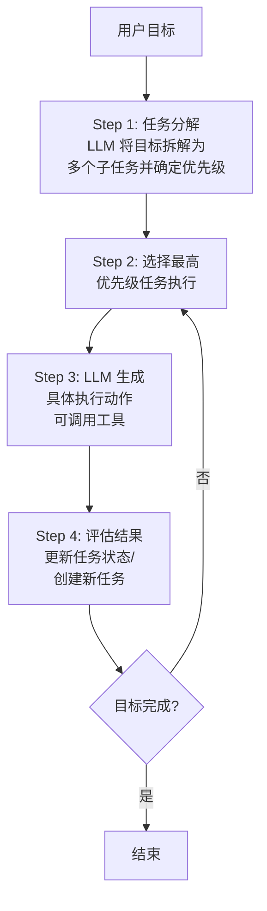
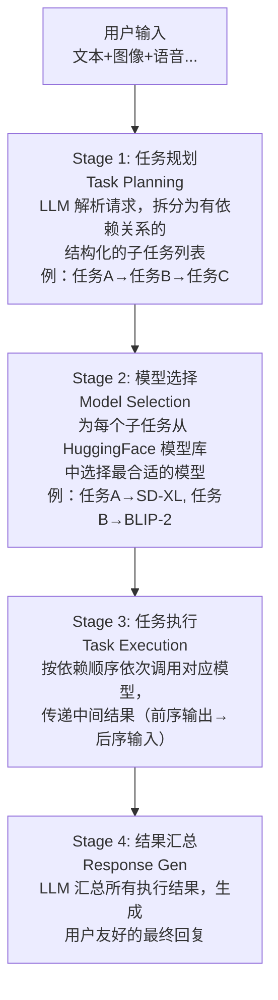
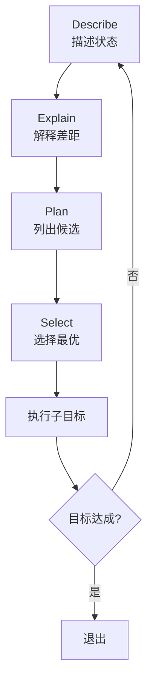
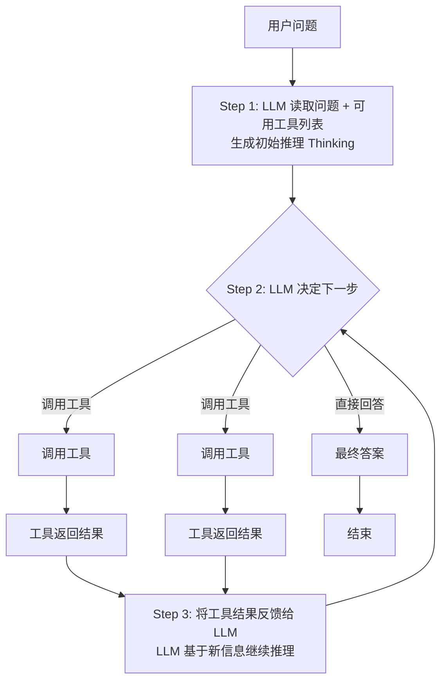
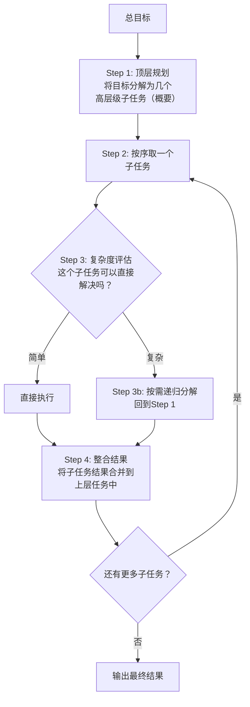
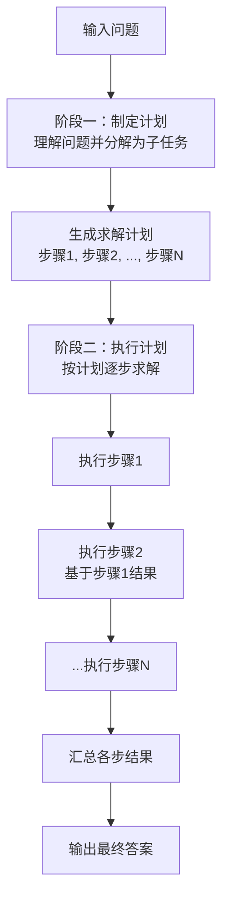
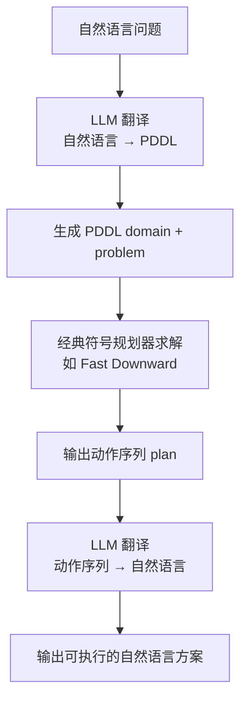
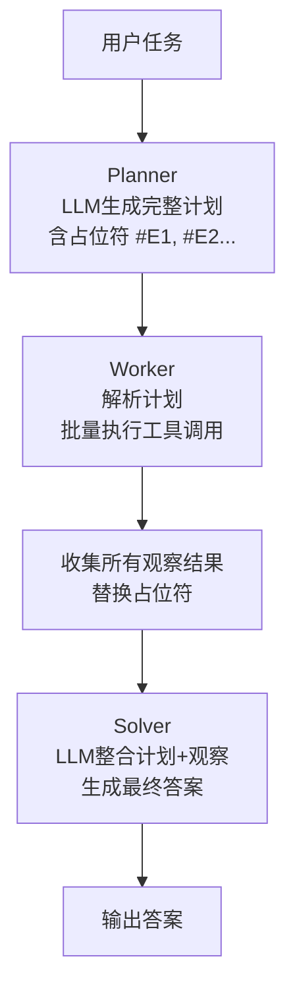
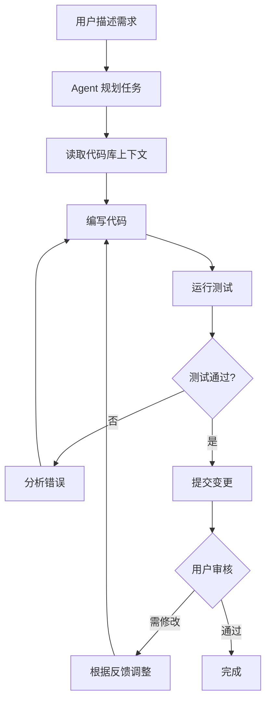

# 二、自主规划与执行类 Agent 设计模式

自主规划与执行类 Agent 设计模式的核心思想是：**让 LLM 不仅回答问题，还能自主制定计划、分解任务、调度工具，并通过多步推理和迭代反馈来完成复杂目标**。这类模式赋予 Agent 高度的自主性，使其能够在开放环境中处理需要长程规划和推理的任务。

本章详细解析九种经典的自主规划与执行类模式，每种模式均包含概念说明、核心流程和完整的 Python 示例代码。

---

## 2.1 AutoGPT / BabyAGI — 目标驱动的自主循环执行

### 概念说明

**AutoGPT** 和 **BabyAGI** 是最早引发广泛关注的自主 Agent 实现。它们的核心思想是将一个高层次的用户目标，通过 LLM 自动分解为一系列可执行的子任务，然后依次执行、评估结果，并根据反馈决定下一步行动——形成一个"目标 → 任务分解 → 执行 → 评估 → 迭代"的闭环。

- **AutoGPT**（由 Significant Gravitas 开发）强调工具使用能力（如搜索引擎、文件读写、代码执行），并包含记忆管理和自我提示机制。
- **BabyAGI**（由 Yohei Nakajima 开发）更加轻量，侧重于任务创建、优先级排序和执行循环的纯粹架构。

两者的共同本质是：**循环执行 "感知 → 思考 → 行动 → 观察" 的自主 Agent 架构**。

### 核心流程



关键循环要素：
1. **任务列表（Task List）**：维护一个动态的任务队列，LLM 可随时添加、修改、删除任务。
2. **记忆系统（Memory）**：存储历史执行结果，让 Agent 拥有"经验"，避免重复犯错。
3. **工具注册表（Tool Registry）**：定义 Agent 可以调用的外部能力，如搜索、计算、HTTP 请求等。
4. **终止条件（Stop Condition）**：避免无限循环，通常设置最大迭代次数或目标达成判断。

### 完整示例代码

### 导入与全局配置

```python
"""
AutoGPT / BabyAGI — 目标驱动的自主循环执行

使用前请安装依赖：
    pip install openai

设置环境变量：
    export OPENAI_API_KEY="your-api-key"
"""

import json
import os
import time
from typing import Any

from openai import OpenAI
```

### Agent 类初始化与 LLM 调用

```python
class AutonomousAgent:
    """基于 AutoGPT/BabyAGI 思想的自主循环执行 Agent"""

    def __init__(self, objective: str, max_iterations: int = 10):
        self.objective = objective
        self.max_iterations = max_iterations
        self.task_list: list[dict[str, Any]] = []
        self.completed_tasks: list[dict[str, Any]] = []
        self.memory: list[dict[str, Any]] = []
        self.client = OpenAI(
            api_key=os.getenv("OPENAI_API_KEY"),
            base_url=os.environ.get("OPENAI_BASE_URL", None),
        )

        self.tools = {
            "search": self._tool_search,
            "calculate": self._tool_calculate,
            "summarize": self._tool_summarize,
        }

    def _call_llm(
        self,
        system_prompt: str,
        user_prompt: str,
        temperature: float = 0.7,
    ) -> str:
        """调用 LLM"""
        response = self.client.chat.completions.create(
            model="gpt-4o",
            messages=[
                {"role": "system", "content": system_prompt},
                {"role": "user", "content": user_prompt},
            ],
            temperature=temperature,
        )
        return response.choices[0].message.content or ""
```

### 任务分解与选择

```python
    def _decompose_objective(self) -> list[dict[str, Any]]:
        """
        Step 1: 将目标分解为子任务列表
        这是 AutoGPT/BabyAGI 的核心——LLM 作为规划器
        """
        system_prompt = (
            "你是一个任务规划专家。给定一个总目标，你需要将其分解为具体的、"
            "可执行的子任务列表。每个子任务应包含：任务ID、名称、描述、优先级"
            "（1最高-5最低）、预估依赖。输出JSON数组。"
        )

        user_prompt = f"""
总目标：{self.objective}

请将此目标分解为3-7个子任务。每个子任务应具体且可独立执行。
输出格式（纯JSON数组，不要包含markdown代码块标记）：
[
  {{
    "id": 1,
    "name": "任务名称",
    "description": "详细描述",
    "priority": 1,
    "dependencies": []
  }}
]
"""

        result = self._call_llm(system_prompt, user_prompt)
        try:
            tasks = json.loads(result)
        except json.JSONDecodeError:
            clean = result.strip()
            if clean.startswith("```"):
                lines = clean.split("\n")
                clean = "\n".join(lines[1:-1])
            tasks = json.loads(clean)
        return tasks

    def _select_next_task(self) -> dict[str, Any] | None:
        """Step 2: 选择最高优先级的待执行任务"""
        pending = [t for t in self.task_list if t.get("status") != "done"]
        if not pending:
            return None
        pending.sort(key=lambda t: (t.get("priority", 5), t.get("id", 999)))
        return pending[0]
```

### 任务执行 — 提示构建

```python
    def _execute_task(self, task: dict[str, Any]) -> dict[str, Any]:
        """
        Step 3: 执行任务
        LLM 决定是直接回答还是调用工具
        """
        completed_summary = json.dumps(self.completed_tasks, ensure_ascii=False, indent=2)
        memory_context = json.dumps(self.memory[-5:], ensure_ascii=False, indent=2)

        system_prompt = f"""
你是一个自主 Agent，正在完成这个总目标：「{self.objective}」。

当前需要执行的子任务：
- ID: {task['id']}
- 名称: {task['name']}
- 描述: {task['description']}

你拥有以下工具可以调用：
{json.dumps(list(self.tools.keys()), ensure_ascii=False, indent=2)}

已完成的子任务摘要：
{completed_summary}

最近的记忆（经验教训）：
{memory_context}

规则：
- 如果需要使用工具，请严格输出以下格式的JSON：
  {{"action": "use_tool", "tool": "工具名", "args": {{"参数名": "参数值"}}}}
- 如果可以直接完成子任务，请输出：
  {{"action": "direct_answer", "result": "你的回答内容"}}
"""
```

### 任务执行 — 工具调用循环

```python
        user_prompt = f"请执行子任务 #{task['id']}：{task['description']}"

        for _ in range(3):  # 最多3次工具调用
            raw = self._call_llm(system_prompt, user_prompt)

            try:
                parsed = json.loads(raw)
            except json.JSONDecodeError:
                clean = raw.strip()
                if clean.startswith("```"):
                    lines = clean.split("\n")
                    clean = "\n".join(lines[1:-1])
                parsed = json.loads(clean)

            if parsed.get("action") == "direct_answer":
                return {"status": "success", "output": parsed["result"]}

            if parsed.get("action") == "use_tool":
                tool_name = parsed["tool"]
                tool_args = parsed.get("args", {})
                if tool_name in self.tools:
                    tool_result = self.tools[tool_name](**tool_args)
                    user_prompt = f"工具 '{tool_name}' 返回了结果：{tool_result}\n请基于此结果完成任务。"
                    continue
                return {"status": "error", "output": f"未知工具: {tool_name}"}

            return {"status": "error", "output": f"无法解析LLM输出: {raw[:200]}"}

        return {"status": "error", "output": "超过最大工具调用次数"}
```

### 结果评估与动态任务调整

```python
    def _evaluate_result(self, task: dict[str, Any], result: dict[str, Any]) -> None:
        """
        Step 4: 评估执行结果并更新状态
        根据结果决定是否需要创建新任务或调整现有任务
        """
        task["result"] = result
        task["status"] = "done"
        self.completed_tasks.append(task)

        self.memory.append(
            {
                "task_id": task["id"],
                "task_name": task["name"],
                "outcome": result["status"],
                "lesson": f"子任务 {task['id']} 已完成，结果：{result.get('output', '')[:200]}",
            }
        )

        # ── 动态任务调整：让 LLM 评估是否需要重试或创建新任务 ──
        evaluation_prompt = f"""
总目标：{self.objective}
刚完成的子任务：{json.dumps(task, ensure_ascii=False)}
执行结果：{json.dumps(result, ensure_ascii=False)}

请评估：
1. 该子任务是否真正完成？如果否，输出 {{"need_retry": true, "reason": "原因"}}
2. 是否需要创建新的子任务？如果需要，输出 {{"new_tasks": [...]}}（格式同任务分解）
3. 如果一切正常，输出 {{"ok": true}}

仅输出JSON：
"""

        eval_raw = self._call_llm(
            "你是一个严格的任务评估器。只输出JSON。", evaluation_prompt
        )

        try:
            clean = eval_raw.strip()
            if clean.startswith("```"):
                lines = clean.split("\n")
                clean = "\n".join(lines[1:-1])
            evaluation = json.loads(clean)

            if evaluation.get("need_retry"):
                retry_task = dict(task)
                retry_task["id"] = len(self.task_list) + 1
                retry_task["status"] = "pending"
                retry_task["priority"] = task.get("priority", 3)
                retry_task["description"] = (
                    f"[重试] {task['description']} 原因：{evaluation.get('reason', '未知')}"
                )
                self.task_list.append(retry_task)

            if evaluation.get("new_tasks"):
                for new_task in evaluation["new_tasks"]:
                    new_task["id"] = len(self.task_list) + 1
                    new_task["status"] = "pending"
                    self.task_list.append(new_task)

        except json.JSONDecodeError:
            pass
```

### 内置工具

```python
    # ─── 内置工具 ───────────────────────────────────────────

    def _tool_search(self, query: str) -> str:
        """模拟搜索工具——实际使用时替换为真实搜索API"""
        return f'搜索结果：关于"{query}"，这是一份模拟的搜索摘要。在实际部署中，此处的返回结果来自搜索引擎API。'

    def _tool_calculate(self, expression: str) -> str:
        """计算工具"""
        try:
            allowed = set("0123456789+-*/().% ")
            safe = "".join(c for c in expression if c in allowed)
            result = eval(safe)  # noqa: S307 演示用，实际生产需使用安全的数学求值器
            return f"计算结果：{result}"
        except Exception as e:
            return f"计算错误：{e}"

    def _tool_summarize(self, text: str) -> str:
        """摘要工具"""
        words = text.split()
        if len(words) <= 50:
            return text
        return " ".join(words[:50]) + "..."
```

### 主循环

```python
    # ─── 主循环 ─────────────────────────────────────────────

    def run(self) -> dict[str, Any]:
        """主循环：目标 → 分解 → 执行 → 评估 → 迭代"""
        print(f"\n{'='*60}")
        print(f"🎯 总目标：{self.objective}")
        print(f"{'='*60}\n")

        # Step 1: 任务分解
        print("📋 [Step 1] 分解目标...")
        self.task_list = self._decompose_objective()
        print(f"   生成了 {len(self.task_list)} 个子任务：")
        for t in self.task_list:
            print(f"     [{t['id']}] {t['name']} (优先级: {t['priority']})")
        print()

        iteration = 0
        while iteration < self.max_iterations:
            iteration += 1
            print(f"🔄 --- 迭代 {iteration}/{self.max_iterations} ---")

            # Step 2: 选择下一任务
            task = self._select_next_task()
            if task is None:
                print("✅ 所有任务已完成！")
                break

            print(f"   📌 执行任务 #{task['id']}：{task['name']}")

            # Step 3: 执行
            result = self._execute_task(task)
            status_icon = "✅" if result["status"] == "success" else "❌"
            print(f"   {status_icon} 结果：{result.get('output', '')[:150]}")

            # Step 4: 评估
            self._evaluate_result(task, result)

            time.sleep(0.5)  # 避免API限流

        print(f"\n{'='*60}")
        print(f"🏁 执行完成。共迭代 {iteration} 次，完成 {len(self.completed_tasks)} 个任务。")
        print(f"{'='*60}\n")

        return {
            "objective": self.objective,
            "total_iterations": iteration,
            "completed_tasks": self.completed_tasks,
            "memory": self.memory,
        }
```

### 主流程与演示

```python
if __name__ == "__main__":
    agent = AutonomousAgent(
        objective="研究如何降低个人每月的饮食开支，并给出具体的省钱方案",
        max_iterations=8,
    )
    result = agent.run()
    print(json.dumps(result, ensure_ascii=False, indent=2))
```

**代码要点说明**：

| 方法 | 作用 | 对应阶段 |
|------|------|----------|
| `_decompose_objective()` | 将目标分解为子任务列表 | 任务分解 |
| `_select_next_task()` | 按优先级从任务队列取下一个任务 | 任务选择 |
| `_execute_task()` | LLM 决策 + 工具调用 | 任务执行 |
| `_evaluate_result()` | 评估结果并动态创建重试/新任务 | 结果评估 |
| `run()` | 串联整个循环 | 主控制流 |

---

## 2.2 HuggingGPT / TaskMatrix — LLM 作为多模态任务编排大脑

### 概念说明

**HuggingGPT**（来自 Microsoft，论文 *"HuggingGPT: Solving AI Tasks with ChatGPT and its Friends in Hugging Face"*）提出了一种独特的协作范式：**以 LLM（如 ChatGPT）作为"大脑"和控制器，通过理解和规划用户请求，自动从 HuggingFace 模型生态中选择并编排多个专家模型来完成复杂的多模态任务**。

这个模式的核心理念是：
1. **LLM 不直接处理图像、语音、视频等多模态数据**，而是负责"理解意图 + 制定计划 + 分派任务"。
2. **HuggingFace 上的数千个专家模型**作为"执行器"，各自擅长特定领域（图像分类、语音识别、目标检测等）。
3. LLM 自动完成**任务解析 → 模型匹配 → 任务编排 → 结果汇总**的全流程。

### 核心流程

HuggingGPT 的四阶段流水线：



### 完整示例代码

### 导入与全局配置

```python
"""
HuggingGPT / TaskMatrix — LLM作为大脑编排专家模型

本示例演示 HuggingGPT 的核心架构：
1. LLM 解析用户请求 → 生成结构化任务计划
2. LLM 为每个任务匹配最合适的模型
3. 按依赖关系依次执行任务
4. LLM 汇总结果生成最终回复

使用前请安装依赖：
    pip install openai

设置环境变量：
    export OPENAI_API_KEY="your-api-key"

注意：本示例为教学演示，模拟 HuggingFace 模型调用。
      实际部署时需集成 huggingface_hub 或 inference API。
"""

import json
import os
import time
from typing import Any

from openai import OpenAI
```

### Agent 类初始化与模型注册表（上）

```python
class HuggingGPTAgent:
    """
    HuggingGPT 风格的多模态任务编排 Agent
    LLM 作为"大脑"，调度专家模型完成复杂多模态任务
    """

    def __init__(self):
        self.client = OpenAI(
            api_key=os.getenv("OPENAI_API_KEY"),
            base_url=os.environ.get("OPENAI_BASE_URL", None),
        )

        # 模拟的 HuggingFace 模型注册表
        # 在实际部署中，可以从 HuggingFace Hub API 动态获取
        self.model_registry = {
            "image-classification": {
                "model_id": "google/vit-base-patch16-224",
                "description": "图像分类模型，识别图片中的物体类别",
                "inputs": ["image"],
                "output": "class_labels",
                "downloads": 500000,
                "likes": 1200,
            },
            "image-generation": {
                "model_id": "stabilityai/stable-diffusion-xl-base-1.0",
                "description": "文生图模型，根据文本描述生成图像",
                "inputs": ["text"],
                "output": "image",
                "downloads": 800000,
                "likes": 3500,
            },
```

### 模型注册表（中）

```python
            "image-captioning": {
                "model_id": "Salesforce/blip-image-captioning-large",
                "description": "图像描述模型，为图片生成文字描述",
                "inputs": ["image"],
                "output": "text",
                "downloads": 300000,
                "likes": 800,
            },
            "text-to-speech": {
                "model_id": "facebook/mms-tts-eng",
                "description": "文本转语音模型",
                "inputs": ["text"],
                "output": "audio",
                "downloads": 200000,
                "likes": 600,
            },
            "speech-to-text": {
                "model_id": "openai/whisper-large-v3",
                "description": "语音转文本模型，自动语音识别（ASR）",
                "inputs": ["audio"],
                "output": "text",
                "downloads": 900000,
                "likes": 2800,
            },
```

### 模型注册表（下）

```python
            "object-detection": {
                "model_id": "facebook/detr-resnet-50",
                "description": "目标检测模型，检测图片中的物体位置",
                "inputs": ["image"],
                "output": "bounding_boxes",
                "downloads": 250000,
                "likes": 700,
            },
            "translation": {
                "model_id": "Helsinki-NLP/opus-mt-zh-en",
                "description": "翻译模型，中文到英文翻译",
                "inputs": ["text"],
                "output": "text",
                "downloads": 150000,
                "likes": 500,
            },
            "sentiment-analysis": {
                "model_id": "distilbert-base-uncased-finetuned-sst-2-english",
                "description": "情感分析模型",
                "inputs": ["text"],
                "output": "sentiment",
                "downloads": 400000,
                "likes": 1000,
            },
            "text-summarization": {
                "model_id": "facebook/bart-large-cnn",
                "description": "文本摘要模型",
                "inputs": ["text"],
                "output": "text",
                "downloads": 350000,
                "likes": 900,
            },
        }
```

### LLM 调用与 JSON 解析工具

```python
    def _call_llm(
        self,
        system_prompt: str,
        user_prompt: str,
        temperature: float = 0.7,
    ) -> str:
        """调用 LLM"""
        response = self.client.chat.completions.create(
            model="gpt-4o",
            messages=[
                {"role": "system", "content": system_prompt},
                {"role": "user", "content": user_prompt},
            ],
            temperature=temperature,
        )
        return response.choices[0].message.content or ""

    def _extract_json(self, raw: str) -> dict[str, Any]:
        """从 LLM 输出中提取 JSON，解析失败时返回空字典兜底"""
        clean = raw.strip()
        if clean.startswith("```"):
            lines = clean.split("\n")
            # 去掉首尾的 ``` 围栏行
            clean = "\n".join(lines[1:-1] if lines[-1].strip().startswith("```") else lines[1:])
        try:
            return json.loads(clean)
        except json.JSONDecodeError:
            # 尝试提取第一个 { ... } 或 [ ... ] 片段
            for opener, closer in (("{", "}"), ("[", "]")):
                start = clean.find(opener)
                end = clean.rfind(closer)
                if start != -1 and end != -1 and end > start:
                    try:
                        return json.loads(clean[start:end + 1])
                    except json.JSONDecodeError:
                        continue
            return {}
```

### Stage 1: 任务规划

```python
    # ─── Stage 1: 任务规划 ──────────────────────────────────

    def stage1_task_planning(self, user_request: str) -> list[dict[str, Any]]:
        """
        Stage 1: 任务规划 (Task Planning)
        让 LLM 解析用户的复杂请求，生成结构化的子任务计划
        """
        task_types = list(self.model_registry.keys())
        task_descriptions = {
            k: v["description"] for k, v in self.model_registry.items()
        }

        system_prompt = f"""
你是 HuggingGPT 的任务规划器。用户会发出多模态请求，你需要：
1. 分析请求中涉及的子任务类型
2. 确定子任务之间的依赖关系（某些任务的输出是其他任务的输入）
3. 生成结构化的任务计划

可用的任务类型：{json.dumps(task_types, ensure_ascii=False)}
每种类型的描述：{json.dumps(task_descriptions, ensure_ascii=False)}

输出纯 JSON 数组（不要包含 markdown 标记），每个元素格式如下：
[
  {{
    "id": 1,
    "task_type": "任务类型（从可用类型中选择）",
    "description": "该任务的具体描述",
    "dependency_ids": [0],  // 依赖的前序任务ID列表，首任务为 []
    "input_type": "text" 或 "image" 或 "audio"
  }}
]
"""

        raw = self._call_llm(system_prompt, user_request, temperature=0.3)
        return self._extract_json(raw)
```

### Stage 2: 模型选择

```python
    # ─── Stage 2: 模型选择 ──────────────────────────────────

    def stage2_model_selection(
        self, tasks: list[dict[str, Any]]
    ) -> list[dict[str, Any]]:
        """
        Stage 2: 模型选择 (Model Selection)
        为每个子任务从注册表中匹配最佳模型
        """
        for task in tasks:
            task_type = task.get("task_type", "")

            # 优先精确匹配 task_type，避免 image-classification 匹配到 image-generation
            exact_matches = {
                name: info for name, info in self.model_registry.items()
                if task_type.lower() == name.lower()
            }
            if exact_matches:
                matching_models = exact_matches
            else:
                # 模糊匹配：task_type 是 name 的子串或反过来
                matching_models = {
                    name: info
                    for name, info in self.model_registry.items()
                    if task_type.lower() in name.lower()
                    or name.lower() in task_type.lower()
                }

            if matching_models:
                best_model_name = max(
                    matching_models,
                    key=lambda n: (
                        matching_models[n].get("downloads", 0),
                        matching_models[n].get("likes", 0),
                    ),
                )
                task["selected_model"] = self.model_registry[best_model_name][
                    "model_id"
                ]
            else:
                task["selected_model"] = "unknown"

        return tasks
```

### Stage 3: 模拟模型调用

```python
    # ─── Stage 3: 任务执行 ──────────────────────────────────

    def _simulate_model_call(
        self, model_id: str, task_desc: str, inputs: dict[str, Any]
    ) -> str:
        """
        模拟 HuggingFace 模型调用
        实际部署时应使用 huggingface_hub 的 InferenceClient 或本地部署
        """
        print(f"      🤖 调用模型: {model_id}")
        print(f"         描述: {task_desc}")

        time.sleep(0.3)

        if "stable-diffusion" in model_id:
            return f"[生成的图像数据] 根据描述生成了一幅图：一个{inputs.get('text','')[:30]}的可视化呈现"
        elif "vit" in model_id:
            return "[图像分类结果] 检测到物体: 人物(置信度0.92), 汽车(置信度0.78), 建筑(置信度0.65)"
        elif "blip" in model_id:
            return "[图像描述结果] 图中显示了几个在公园里散步的人，背景是城市建筑群"
        elif "whisper" in model_id:
            return "[语音识别结果] 转写文本：用户要求生成一张包含星空和山脉的风景图片"
        elif "tts" in model_id:
            return "[生成的音频数据] 已将文本转换为语音，时长约15秒"
        elif "detr" in model_id:
            return "[目标检测结果] 检测到3个物体: 笔记本(bbox:[100,150,300,400]), 手机(bbox:[50,200,150,350])"
        elif "bart" in model_id:
            return f"[摘要结果] 原始文本的核心内容是：{inputs.get('text','')[:100]}..."
        elif "sentiment" in model_id:
            return "[情感分析结果] 文本整体情感为正面，积极得分0.85"
        elif "translation" in model_id:
            return f"[翻译结果] {inputs.get('text','')[:100]} -> The translated English text..."
        else:
            return f"[{model_id}执行结果] 完成任务: {task_desc}"
```

### Stage 3: 任务执行编排

```python
    def stage3_task_execution(
        self, tasks: list[dict[str, Any]], user_request: str
    ) -> dict[int, str]:
        """
        Stage 3: 任务执行 (Task Execution)
        按依赖关系的拓扑顺序依次执行每个子任务
        前序任务的输出自动成为后续任务的输入
        """
        results: dict[int, str] = {}
        executed = set()

        while len(executed) < len(tasks):
            for task in sorted(tasks, key=lambda t: t["id"]):
                if task["id"] in executed:
                    continue

                dep_ids = task.get("dependency_ids", [])
                if all(dep_id in executed for dep_id in dep_ids):
                    # 收集依赖于前序任务输出的输入
                    inputs = {"text": task.get("description", ""), "user_request": user_request}
                    for dep_id in dep_ids:
                        inputs[f"task_{dep_id}_output"] = results.get(dep_id, "")

                    result = self._simulate_model_call(
                        task.get("selected_model", "unknown"),
                        task.get("description", ""),
                        inputs,
                    )

                    results[task["id"]] = result
                    executed.add(task["id"])
                    print(f"      ✅ 任务 #{task['id']} 完成")

        return results
```

### Stage 4: 结果汇总与生成回复

```python
    # ─── Stage 4: 结果汇总 ──────────────────────────────────

    def stage4_response_generation(
        self,
        user_request: str,
        tasks: list[dict[str, Any]],
        results: dict[int, str],
    ) -> str:
        """
        Stage 4: 结果汇总 (Response Generation)
        让 LLM 汇总所有子任务的执行结果，生成用户友好的最终回复
        """
        task_summary = []
        for task in tasks:
            tid = task["id"]
            task_summary.append(
                {
                    "id": tid,
                    "type": task.get("task_type", ""),
                    "model": task.get("selected_model", ""),
                    "result": results.get(tid, "无结果"),
                }
            )

        system_prompt = "你是一个专业的AI助手，负责汇总多个模型的执行结果，生成连贯、完整的用户回复。"

        user_prompt = f"""
用户原始请求：{user_request}

模型执行总结：
{json.dumps(task_summary, ensure_ascii=False, indent=2)}

请基于以上各模型的结果，生成一个完整、连贯的最终回复给用户。
如果结果中包含"图像数据"或"音频数据"，请在回复中说明这些数据已被处理。
回复使用中文。
"""

        return self._call_llm(system_prompt, user_prompt)
```

### 主流程

```python
    # ─── 主流程 ─────────────────────────────────────────────

    def run(self, user_request: str) -> dict[str, Any]:
        """完整执行 HuggingGPT 的四阶段流程"""
        print(f"\n{'='*60}")
        print(f"🧠 HuggingGPT Agent")
        print(f"📝 用户请求：{user_request}")
        print(f"{'='*60}\n")

        # Stage 1
        print("📋 [Stage 1] 任务规划...")
        tasks = self.stage1_task_planning(user_request)
        for t in tasks:
            print(f"   任务 #{t['id']}: {t.get('task_type')} - {t.get('description')[:50]}")
        print()

        # Stage 2
        print("🔍 [Stage 2] 模型选择...")
        tasks = self.stage2_model_selection(tasks)
        for t in tasks:
            print(f"   任务 #{t['id']} → 模型: {t.get('selected_model', 'N/A')}")
        print()

        # Stage 3
        print("⚙️  [Stage 3] 任务执行...")
        results = self.stage3_task_execution(tasks, user_request)
        print()

        # Stage 4
        print("💬 [Stage 4] 生成最终回复...")
        final_response = self.stage4_response_generation(user_request, tasks, results)
        print()
        print(f"{'='*60}")
        print(f"📤 最终回复：\n{final_response}")
        print(f"{'='*60}\n")

        return {
            "request": user_request,
            "tasks": tasks,
            "results": results,
            "final_response": final_response,
        }
```

### 主流程与演示

```python
if __name__ == "__main__":
    agent = HuggingGPTAgent()

    # 示例：一个复杂的多模态请求
    result = agent.run(
        "请分析这张风景图片的内容，用英文描述其中的主要元素，"
        "然后根据描述生成一张类似风格的新图片。"
        "最后将分析结果翻译回中文总结给我。"
    )

    print("\n" + "=" * 60)
    print("完整输出结构：")
    print("=" * 60)
    print(json.dumps(result, ensure_ascii=False, indent=2))
```

**四阶段对应关系**：

| 阶段 | 方法 | 职责 |
|------|------|------|
| Stage 1 | `stage1_task_planning()` | LLM 解析用户请求，生成任务DAG |
| Stage 2 | `stage2_model_selection()` | 为每个任务匹配 HuggingFace 模型 |
| Stage 3 | `stage3_task_execution()` | 按依赖顺序调用模型，传递中间结果 |
| Stage 4 | `stage4_response_generation()` | LLM 汇总结果，生成最终回复 |

---

## 2.3 DEPS (Describe, Explain, Plan, Select) — 结构化子目标选择

### 概念说明

**DEPS**（Describe, Explain, Plan, Select）是一种结构化的子目标选择策略，用于帮助 LLM Agent 在复杂任务中有效地进行长期规划。其核心洞察是：**许多复杂任务之所以难以完成，是因为 LLM 在面对多重选择时缺乏有效的子目标筛选机制**。

DEPS 通过四个有序阶段将复杂问题的求解过程结构化：

- **Describe（描述）**：描述当前状态和目标状态
- **Explain（解释）**：解释当前状态与目标的差距，分析为什么需要采取行动
- **Plan（规划）**：列出所有可能的候选子目标/行动
- **Select（选择）**：从候选中选择最优的子目标，并给出理由

这四步形成一个"认知-分析-规划-决策"的完整链条，特别适用于需要长期规划和策略性决策的场景。

### 核心流程



**核心设计要点**：
1. **Describe 和 Explain 强制 Agent 进行审慎思考**，避免"跳跃式"决策。
2. **Plan 鼓励发散思维**，让 LLM 生成尽可能多的候选方案。
3. **Select 引入理性筛选**，基于解释阶段的差距分析进行决策，而非凭直觉选第一个方案。

### 完整示例代码

### 导入与 Agent 类初始化

```python
"""
DEPS (Describe, Explain, Plan, Select) — 结构化子目标选择

使用前请安装依赖：
    pip install openai

设置环境变量：
    export OPENAI_API_KEY="your-api-key"
"""

import json
import os
from typing import Any

from openai import OpenAI


class DEPSAgent:
    """
    DEPS 策略 Agent
    通过 Describe → Explain → Plan → Select 四步法
    在复杂任务中做出理性的子目标选择
    """

    def __init__(self, goal: str, max_steps: int = 10):
        self.goal = goal
        self.max_steps = max_steps
        self.current_state = "初始状态：任务刚刚开始，还没有执行任何操作"
        self.history: list[dict[str, Any]] = []
        self.client = OpenAI(
            api_key=os.getenv("OPENAI_API_KEY"),
            base_url=os.environ.get("OPENAI_BASE_URL", None),
        )

```

### JSON 提取工具

```python
    def _call_llm(
        self,
        system_prompt: str,
        user_prompt: str,
        temperature: float = 0.7,
    ) -> str:
        """调用 LLM"""
        response = self.client.chat.completions.create(
            model="gpt-4o",
            messages=[
                {"role": "system", "content": system_prompt},
                {"role": "user", "content": user_prompt},
            ],
            temperature=temperature,
        )
        return response.choices[0].message.content or ""

    def _extract_json(self, raw: str) -> dict[str, Any]:
        """从 LLM 输出中提取 JSON，解析失败时返回空字典兜底"""
        clean = raw.strip()
        if clean.startswith("```"):
            lines = clean.split("\n")
            # 去掉首尾的 ``` 围栏行
            clean = "\n".join(lines[1:-1] if lines[-1].strip().startswith("```") else lines[1:])
        try:
            return json.loads(clean)
        except json.JSONDecodeError:
            # 尝试提取第一个 { ... } 或 [ ... ] 片段
            for opener, closer in (("{", "}"), ("[", "]")):
                start = clean.find(opener)
                end = clean.rfind(closer)
                if start != -1 and end != -1 and end > start:
                    try:
                        return json.loads(clean[start:end + 1])
                    except json.JSONDecodeError:
                        continue
            return {}

    # ─── D: Describe — 描述当前状态 ─────────────────────────

```

### D — Describe: 描述当前状态

```python
    def step_describe(self) -> str:
        """
        Describe: 描述当前状态和目标状态
        清晰、结构化地描述"我们站在哪里"和"我们要去哪里"
        """
        system_prompt = """
你是一个状态描述专家。你需要详细、结构化地描述：
1. 当前已达到的状态（基于历史记录）
2. 最终目标是什么
3. 当前还有哪些信息缺失或不确定

输出纯JSON格式（不要包含markdown标记）：
{
  "current_status": "当前状态的详细描述",
  "target_status": "最终目标的描述",
  "gaps": ["差距1", "差距2", ...],
  "known_information": "已知的关键信息",
  "unknown_information": "仍然未知的信息"
}
"""

        history_str = (
            json.dumps(self.history, ensure_ascii=False, indent=2)
            if self.history
            else "无历史记录（第一次执行）"
        )

        user_prompt = f"""
最终目标：{self.goal}
当前状态描述：{self.current_state}

历史执行记录：
{history_str}

请描述当前状态。
"""

        raw = self._call_llm(system_prompt, user_prompt, temperature=0.5)
        desc = self._extract_json(raw)
        print(f"   📝 [Describe] 当前状态: {desc.get('current_status', '')[:120]}")
        print(f"   📝 [Describe] 识别差距: {len(desc.get('gaps', []))} 条")
        return json.dumps(desc, ensure_ascii=False)

    # ─── E: Explain — 解释差距 ──────────────────────────────

```

### E — Explain: 解释差距

```python
    def step_explain(self, description: str) -> str:
        """
        Explain: 解释与分析
        分析为什么存在差距，解释采取行动的必要性
        """
        system_prompt = """
你是一个分析专家。基于当前状态描述，你需要深入分析：
1. 为什么存在这些差距？根本原因是什么？
2. 解决这些差距的优先级顺序是什么？
3. 如果不解决核心差距会产生什么后果？

输出纯JSON格式：
{
  "root_causes": ["根因1", "根因2", ...],
  "priority_analysis": [
    {"gap": "差距描述", "priority": 1, "reason": "优先级判定原因"}
  ],
  "urgency": "高/中/低",
  "consequences_of_inaction": "如果不采取行动的后果"
}
"""

        user_prompt = f"""
状态描述：
{description}

请解释分析。
"""

        raw = self._call_llm(system_prompt, user_prompt, temperature=0.6)
        explanation = self._extract_json(raw)
        print(f"   🔍 [Explain] 发现根因: {len(explanation.get('root_causes', []))} 条")
        print(f"   🔍 [Explain] 紧急程度: {explanation.get('urgency', '未知')}")
        return json.dumps(explanation, ensure_ascii=False)

    # ─── P: Plan — 列出候选方案 ─────────────────────────────

```

### P — Plan: 列出候选方案

```python
    def step_plan(self, description: str, explanation: str) -> str:
        """
        Plan: 规划候选子目标
        基于当前状态和分析，提出多个可选行动方案
        """
        system_prompt = f"""
你是一个规划专家。基于当前状态描述和分析，你需要生成多个候选子目标。
每个候选子目标应该是具体的、可执行的。

输出纯JSON格式：
{{
  "candidate_subgoals": [
    {{
      "id": "A",
      "name": "子目标名称",
      "description": "详细描述",
      "expected_outcome": "预期成果",
      "pros": ["优点1", "优点2"],
      "cons": ["缺点1", "缺点2"],
      "estimated_cost": "低/中/高",
      "estimated_duration": "预计耗时"
    }}
  ]
}}

要求：
- 至少提供3个候选子目标
- 候选之间应有差异化（不同方向或策略）
- 每个候选都要有明确的优缺点
"""

```

### P — Plan: 列出候选方案（续）

```python
        user_prompt = f"""
最终目标：{self.goal}

状态描述：
{description}

分析结果：
{explanation}

请生成候选子目标。
"""

        raw = self._call_llm(system_prompt, user_prompt, temperature=0.8)
        plan = self._extract_json(raw)
        candidates = plan.get("candidate_subgoals", [])
        print(f"   📊 [Plan] 生成候选: {len(candidates)} 个")
        for c in candidates:
            print(f"      - [{c.get('id')}] {c.get('name')} (成本:{c.get('estimated_cost')})")
        return json.dumps(plan, ensure_ascii=False)

```

### S — Select: 选择最优子目标

```python
    # ─── S: Select — 选择最优 ───────────────────────────────

    def step_select(
        self, description: str, explanation: str, plan: str
    ) -> dict[str, Any]:
        """
        Select: 选择最优子目标
        基于解释分析中的优先级和计划中的候选，做出选择
        """
        system_prompt = """
你是一个决策专家。基于所有信息，你需要从候选子目标中选择最优的一个。

决策标准（按重要性排序）：
1. 与最终目标的相关性
2. 对缩小关键差距的贡献
3. 可行性和风险
4. 效率（成本/时间）

输出纯JSON格式：
{
  "selected_id": "选中的候选ID",
  "selection_reasoning": "详细的决策理由",
  "why_not_others": {"候选ID": "为什么不选这个的原因", ...},
  "confidence": 0.85,
  "next_execution_detail": "下一步的具体执行计划"
}
"""

        user_prompt = f"""
状态描述：
{description}

分析结果：
{explanation}

候选计划：
{plan}

请做出选择。
"""

        raw = self._call_llm(system_prompt, user_prompt, temperature=0.4)
        selection = self._extract_json(raw)
        print(f"   ✅ [Select] 选择: {selection.get('selected_id')}")
        print(f"   ✅ [Select] 自信度: {selection.get('confidence', 0)}")
        return selection

    # ─── 执行子目标 ─────────────────────────────────────────

```

### 执行子目标

```python
    def _execute_subgoal(self, selection: dict[str, Any]) -> str:
        """执行选中的子目标（模拟）"""
        system_prompt = f"""
你正在执行一个子目标。当前你的最终目标是：{self.goal}

请模拟完成以下子目标，并给出详细结果：
子目标：{selection.get('next_execution_detail', selection.get('selected_id', ''))}

输出纯JSON格式：
{{
  "execution_success": true/false,
  "result_summary": "执行结果摘要",
  "new_knowledge": "获得的新知识/信息",
  "state_update": "状态更新描述"
}}
"""

        raw = self._call_llm(system_prompt, "请执行该子目标", temperature=0.7)
        result = self._extract_json(raw)
        success = result.get("execution_success", False)
        icon = "✅" if success else "❌"
        print(f"   {icon} 执行结果: {result.get('result_summary', '')[:150]}")
        return json.dumps(result, ensure_ascii=False)

    # ─── 目标达成判断 ───────────────────────────────────────

```

### 目标达成判断

```python
    def _check_goal_completion(self) -> dict[str, Any]:
        """判断目标是否已达成"""
        system_prompt = """
判断当前是否已达成最终目标。输出纯JSON：
{
  "is_complete": true/false,
  "completion_percentage": 0-100,
  "reason": "判断依据"
}
"""
        history_str = json.dumps(self.history[-5:], ensure_ascii=False, indent=2)

        raw = self._call_llm(
            system_prompt,
            f"最终目标：{self.goal}\n历史记录：{history_str}",
            temperature=0.3,
        )
        return self._extract_json(raw)

    # ─── 主循环 ─────────────────────────────────────────────

```

### 主循环

```python
    def run(self) -> dict[str, Any]:
        """DEPS 主循环"""
        print(f"\n{'='*60}")
        print(f"🎯 DEPS Agent — 最终目标：{self.goal}")
        print(f"{'='*60}\n")

        for step in range(1, self.max_steps + 1):
            print(f"🔄 --- DEPS 第 {step}/{self.max_steps} 轮 ---")

            # D: Describe
            description = self.step_describe()

            # E: Explain
            explanation = self.step_explain(description)

            # P: Plan
            plan = self.step_plan(description, explanation)

            # S: Select
            selection = self.step_select(description, explanation, plan)

            # 执行选中的子目标
            execution_result = self._execute_subgoal(selection)

            # 记录本轮（各步骤输出均为 JSON 字符串，解析失败时用空字典兜底）
            def _safe_json(s: str) -> dict:
                try:
                    return json.loads(s)
                except (json.JSONDecodeError, TypeError):
                    return {}

            record = {
                "step": step,
                "describe": _safe_json(description),
                "explain": _safe_json(explanation),
                "plan": _safe_json(plan),
                "select": selection,
                "execution": _safe_json(execution_result),
            }
            self.history.append(record)

```

### 主循环（续）

```python
            execution_data = _safe_json(execution_result)
            self.current_state = execution_data.get(
                "state_update",
                f"完成第{step}个子目标：{selection.get('selected_id','')}",
            )

            # 检查是否达成目标
            completion = self._check_goal_completion()
            print(f"   📊 目标达成度: {completion.get('completion_percentage', 0)}%")
            if completion.get("is_complete"):
                print(f"\n{'='*60}")
                print(f"🏁 目标达成！共执行 {step} 个DEPS循环")
                print(f"{'='*60}\n")
                break
            print()

        return {
            "goal": self.goal,
            "total_steps": step,
            "history": self.history,
            "final_state": self.current_state,
        }


```

### 主流程与演示

```python
if __name__ == "__main__":
    agent = DEPSAgent(
        goal="为一家小型在线书店设计一个提高客户留存率的策略方案",
        max_steps=6,
    )
    result = agent.run()
    print(json.dumps(result, ensure_ascii=False, indent=2))
```


**DEPS 四步法总结**：

| 步骤 | 名称 | 核心问题 | 输出 |
|------|------|----------|------|
| D | Describe | 我们在哪里？要去哪里？ | 状态描述 + 差距列表 |
| E | Explain | 为什么有差距？ | 根因分析 + 优先级 |
| P | Plan | 有哪些可选路径？ | 候选子目标列表 |
| S | Select | 选哪条路最好？ | 最优选择 + 决策理由 |

---

## 2.4 ART (Automatic Reasoning and Tool-use) — 自动多步推理与工具调用

### 概念说明

**ART**（Automatic Reasoning and Tool-use）是一种让 LLM Agent 自动完成**多步推理**和**工具选择调用**的设计模式。其核心理念是：

1. **自动工具选择**：Agent 不需要预先编程调用哪个工具，而是由 LLM 根据当前推理状态**自动从工具库中选择**最合适的工具。
2. **多步推理链**：Agent 会构建一条完整的"推理-行动"链（Reasoning-Action Chain），每一步都包含思考过程和工具调用。
3. **工具调用与推理交织**：不像传统流水线那样"先规划、后执行"，ART 中推理和工具调用是交替进行的，每一步推理都可能触发新的工具调用。

ART 的设计灵感来自 **ReAct**（Reasoning + Acting）和 **Toolformer** 的思路，但更强调自动化和通用性。

### 核心流程



**区别于其他模式的特点**：
- **不需要预先规划所有步骤**，每一步都是动态决策。
- **工具库可以被动态扩展**，只需在提示词中描述即可。
- LLM 输出包含**可审计的推理过程**（透明、可解释）。

### 完整示例代码

### 导入与全局配置

```python
"""
ART (Automatic Reasoning and Tool-use) — 自动多步推理与工具调用

使用前请安装依赖：
    pip install openai

设置环境变量：
    export OPENAI_API_KEY="your-api-key"
"""

import json
import os
from typing import Any

from openai import OpenAI


class ARTAgent:
    """
    ART 模式 Agent
    自动从工具库中选择并调用工具，进行多步推理链
    """

```

### Agent 类初始化与 LLM 调用

```python
    def __init__(self, max_reasoning_steps: int = 8):
        self.max_reasoning_steps = max_reasoning_steps
        self.reasoning_chain: list[dict[str, Any]] = []
        self.client = OpenAI(
            api_key=os.getenv("OPENAI_API_KEY"),
            base_url=os.environ.get("OPENAI_BASE_URL", None),
        )

        # 工具注册表——每个工具包含名称、描述、参数、函数指针
        self.tool_registry = {
            "search_documents": {
                "name": "search_documents",
                "description": "在文档库中搜索相关内容，返回最相关的文档片段",
                "parameters": {"query": "搜索关键词", "top_k": "返回文档数量"},
                "function": self._tool_search_documents,
            },
            "analyze_data": {
                "name": "analyze_data",
                "description": "对提供的数据进行统计分析（求和、平均、最大、最小）",
                "parameters": {"data": "数值列表，如 [1, 2, 3]", "operation": "sum/avg/max/min"},
                "function": self._tool_analyze_data,
            },
            "compare_entities": {
                "name": "compare_entities",
                "description": "比较两个或多个实体的属性和特点",
                "parameters": {"entities": "实体名称列表，逗号分隔"},
                "function": self._tool_compare_entities,
            },
            "retrieve_knowledge_graph": {
                "name": "retrieve_knowledge_graph",
                "description": "从知识图谱中查询实体之间的关系",
                "parameters": {"subject": "主语实体", "relation": "关系类型"},
                "function": self._tool_retrieve_knowledge_graph,
            },
            "generate_code": {
                "name": "generate_code",
                "description": "根据需求生成Python代码片段",
                "parameters": {"requirement": "代码需求描述", "language": "编程语言"},
                "function": self._tool_generate_code,
            },
            "fetch_api_data": {
                "name": "fetch_api_data",
                "description": "调用外部API获取实时数据",
                "parameters": {"endpoint": "API端点", "params": "查询参数"},
                "function": self._tool_fetch_api_data,
            },
        }

```

### JSON 提取工具

```python
    def _call_llm(
        self,
        system_prompt: str,
        user_prompt: str,
        temperature: float = 0.7,
    ) -> str:
        """调用 LLM"""
        response = self.client.chat.completions.create(
            model="gpt-4o",
            messages=[
                {"role": "system", "content": system_prompt},
                {"role": "user", "content": user_prompt},
            ],
            temperature=temperature,
        )
        return response.choices[0].message.content or ""

    def _extract_json(self, raw: str) -> dict[str, Any]:
        """从 LLM 输出中提取 JSON，解析失败时返回空字典兜底"""
        clean = raw.strip()
        if clean.startswith("```"):
            lines = clean.split("\n")
            # 去掉首尾的 ``` 围栏行
            clean = "\n".join(lines[1:-1] if lines[-1].strip().startswith("```") else lines[1:])
        try:
            return json.loads(clean)
        except json.JSONDecodeError:
            # 尝试提取第一个 { ... } 或 [ ... ] 片段
            for opener, closer in (("{", "}"), ("[", "]")):
                start = clean.find(opener)
                end = clean.rfind(closer)
                if start != -1 and end != -1 and end > start:
                    try:
                        return json.loads(clean[start:end + 1])
                    except json.JSONDecodeError:
                        continue
            return {}

    # ─── 工具实现 ───────────────────────────────────────────

```

### 内置工具: 文档搜索

```python
    def _tool_search_documents(self, query: str, top_k: int = 3) -> str:
        """模拟文档搜索"""
        mock_docs = {
            "机器学习": "机器学习是人工智能的一个分支，它使系统能够从数据中学习并改进，而无需显式编程。",
            "深度学习": "深度学习是机器学习的一个子集，使用多层神经网络从大量数据中学习复杂的模式。",
            "强化学习": "强化学习是一种通过与环境交互、基于奖励信号来学习最优策略的方法。",
            "神经网络": "神经网络是由相互连接的节点（神经元）组成的计算模型，灵感来源于生物神经系统。",
        }
        results = []
        for key, value in mock_docs.items():
            if query.lower() in key.lower() or query.lower() in value.lower():
                results.append(f"[{key}] {value}")
                if len(results) >= top_k:
                    break
        if not results:
            results = ["未找到与查询完全匹配的文档。"]
        return json.dumps({"results": results}, ensure_ascii=False)

```

### 内置工具: 数据分析

```python
    def _tool_analyze_data(self, data: list[float], operation: str) -> str:
        """数据分析"""
        ops = {
            "sum": sum,
            "avg": lambda d: sum(d) / len(d) if d else 0,
            "max": max,
            "min": min,
        }
        if operation in ops:
            result = ops[operation](data)
            return json.dumps(
                {"operation": operation, "data": data, "result": result},
                ensure_ascii=False,
            )
        return json.dumps({"error": f"未知操作: {operation}"})

```

### 内置工具: 实体比较

```python
    def _tool_compare_entities(self, entities: list[str]) -> str:
        """模拟实体比较"""
        db = {
            "Python": {"类型": "编程语言", "速度": "中等", "易学性": "高", "生态": "丰富"},
            "JavaScript": {"类型": "编程语言", "速度": "快", "易学性": "高", "生态": "丰富"},
            "Rust": {"类型": "编程语言", "速度": "极快", "易学性": "低", "生态": "发展中"},
            "Go": {"类型": "编程语言", "速度": "快", "易学性": "中", "生态": "完善"},
        }
        comparison = {}
        for entity in entities:
            entity_stripped = entity.strip()
            if entity_stripped in db:
                comparison[entity_stripped] = db[entity_stripped]
            else:
                comparison[entity_stripped] = {"类型": "未知", "备注": "数据库中没有该实体信息"}
        return json.dumps(comparison, ensure_ascii=False)

```

### 内置工具: 知识图谱查询

```python
    def _tool_retrieve_knowledge_graph(self, subject: str, relation: str) -> str:
        """模拟知识图谱查询"""
        kg = {
            ("机器学习", "子领域"): ["深度学习", "强化学习", "监督学习", "无监督学习"],
            ("深度学习", "依赖"): ["神经网络", "大量数据", "GPU"],
            ("Python", "常用于"): ["数据科学", "Web开发", "自动化脚本"],
        }
        result = kg.get((subject, relation), [f"未找到 '{subject}' 的 '{relation}' 关系"])
        return json.dumps({"subject": subject, "relation": relation, "objects": result}, ensure_ascii=False)

```

### 内置工具: 代码生成

```python
    def _tool_generate_code(self, requirement: str, language: str = "Python") -> str:
        """模拟代码生成"""
        code = f"# 根据需求生成的{language}代码\n# 需求: {requirement}\n\n"
        if "排序" in requirement:
            code += "def custom_sort(arr):\n    return sorted(arr)\n"
        elif "计算" in requirement:
            code += "def calculate(expression):\n    return eval(expression)\n"
        else:
            code += f"# TODO: 实现 {requirement}\ndef solve():\n    pass\n"
        return json.dumps({"code": code, "language": language}, ensure_ascii=False)

    def _tool_fetch_api_data(self, endpoint: str, params: str) -> str:
        """模拟API调用（实际使用时应替换为真实的HTTP请求）"""
        return json.dumps({"endpoint": endpoint, "params": params, "data": {"status": "ok", "result": "模拟API响应数据"}}, ensure_ascii=False)

    # ─── 工具调用路由 ───────────────────────────────────────

```

### 核心方法: _execute_tool

```python
    def _execute_tool(self, tool_name: str, args: dict[str, Any]) -> str:
        """执行工具并返回结果"""
        if tool_name not in self.tool_registry:
            return json.dumps({"error": f"未知工具: {tool_name}"})

        try:
            result = self.tool_registry[tool_name]["function"](**args)
            return str(result)
        except Exception as e:
            return json.dumps({"error": f"工具执行失败: {e}"})

    # ─── ART 核心循环 ───────────────────────────────────────

```

### 工具描述生成

```python
    def _generate_tool_descriptions(self) -> str:
        """生成工具描述供 LLM 参考"""
        lines = []
        for name, info in self.tool_registry.items():
            params_desc = ", ".join(
                f"{k}: {v}" for k, v in info["parameters"].items()
            )
            lines.append(f"- **{name}**: {info['description']}\n  参数: {params_desc}")
        return "\n".join(lines)

```

### 主循环

```python
    def run(self, question: str) -> dict[str, Any]:
        """ART 主循环：自动推理 + 工具调用"""
        print(f"\n{'='*60}")
        print(f"🤖 ART Agent")
        print(f"❓ 问题：{question}")
        print(f"{'='*60}\n")

        tool_descriptions = self._generate_tool_descriptions()

        system_prompt = f"""
你是一个具有自动推理和工具调用能力的 ART Agent。

# 可用工具
{tool_descriptions}

# 推理规则
1. 每一步都要先分析当前已知信息（THOUGHT）
2. 如果需要更多信息来完成回答，选择调用最合适的工具（ACTION）
3. 如果已经有足够信息，直接给出最终答案（FINAL_ANSWER）

# 输出格式（严格JSON，不要包含markdown标记）
{{"reasoning_step": "<当前是第几步推理>",
 "thought": "<你的思考过程>",
 "decision": "call_tool" 或 "final_answer",
 "tool_name": "<选择的工具名>",  // 仅 decision=call_tool 时需要
 "tool_args": {{"参数名": "参数值"}},  // 仅 decision=call_tool 时需要
 "final_answer": "<最终答案>"  // 仅 decision=final_answer 时需要
}}
"""

        messages = [
            {"role": "system", "content": system_prompt},
            {"role": "user", "content": f"请回答以下问题：{question}"},
        ]

        for step in range(1, self.max_reasoning_steps + 1):
            print(f"🧠 --- 推理步骤 {step}/{self.max_reasoning_steps} ---")

            response = self.client.chat.completions.create(
                model="gpt-4o",
                messages=messages,
                temperature=0.7,
            )
            raw_output = response.choices[0].message.content or ""

            parsed = self._extract_json(raw_output)
            if not parsed:
                print(f"   ⚠️  JSON解析失败，原始输出：{raw_output[:200]}")
                continue

            thought = parsed.get("thought", "")
            decision = parsed.get("decision", "")
            print(f"   💭 思考: {thought[:150]}")

            step_record = {
                "step": step,
                "thought": thought,
                "decision": decision,
            }

            if decision == "final_answer":
                final = parsed.get("final_answer", "")
                print(f"\n   ✅ 最终答案: {final[:200]}")
                step_record["final_answer"] = final
                self.reasoning_chain.append(step_record)
                break

            if decision == "call_tool":
                tool_name = parsed.get("tool_name", "")
                tool_args = parsed.get("tool_args", {})

                if tool_name not in self.tool_registry:
                    print(f"   ⚠️  未知工具: {tool_name}，跳过")
                    continue

                print(f"   🔧 调用工具: {tool_name}({json.dumps(tool_args, ensure_ascii=False)})")
                tool_result = self._execute_tool(tool_name, tool_args)
                print(f"   📥 工具返回: {tool_result[:200]}")

                step_record["tool_name"] = tool_name
                step_record["tool_args"] = tool_args
                step_record["tool_result"] = tool_result
                self.reasoning_chain.append(step_record)

                # 将工具调用结果加入对话历史
                messages.append({"role": "assistant", "content": raw_output})
                messages.append(
                    {
                        "role": "user",
                        "content": f"工具 '{tool_name}' 返回结果：\n{tool_result}\n\n请基于此结果继续推理。",
                    }
                )
            else:
                print(f"   ⚠️  未知决策类型: {decision}")
                break
        else:
            print("\n⚠️  达到最大推理步骤限制，强制要求LLM给出最终答案")
            force_prompt = (
                "你已经完成了多步推理，现在请直接给出最终答案。"
                "输出格式：{\"decision\": \"final_answer\", \"final_answer\": \"你的答案\"}"
            )
            messages.append({"role": "user", "content": force_prompt})
            response = self.client.chat.completions.create(
                model="gpt-4o",
                messages=messages,
                temperature=0.5,
            )
            raw = response.choices[0].message.content or ""
            parsed = self._extract_json(raw)
            if parsed:
                self.reasoning_chain.append(
                    {
                        "step": self.max_reasoning_steps + 1,
                        "thought": "达到最大步数，强制输出",
                        "decision": "final_answer",
                        "final_answer": parsed.get("final_answer", raw),
                    }
                )
            else:
                self.reasoning_chain.append(
                    {"step": self.max_reasoning_steps + 1, "final_answer": raw}
                )

        print(f"\n{'='*60}")
        print(f"📊 推理链总结：共 {len(self.reasoning_chain)} 步")
        tools_used = [
            s["tool_name"] for s in self.reasoning_chain if s.get("tool_name")
        ]
        print(f"🔧 使用工具：{tools_used if tools_used else '无'}")
        print(f"{'='*60}\n")

        return {
            "question": question,
            "reasoning_chain": self.reasoning_chain,
            "total_steps": len(self.reasoning_chain),
        }
```

### 主流程与演示

```python
if __name__ == "__main__":
    agent = ARTAgent(max_reasoning_steps=6)
    result = agent.run(
        "Python、Rust和Go这三种编程语言在性能和学习难度上有什么区别？"
        "哪个更适合做后端API开发？"
    )

    print("\n完整推理链：")
    print(json.dumps(result, ensure_ascii=False, indent=2))
```


**ART 推理链数据结构说明**：

每一步推理记录包含以下字段：
- `step`: 推理步骤编号
- `thought`: LLM 的思考过程
- `decision`: `"call_tool"` 或 `"final_answer"`
- `tool_name` / `tool_args` / `tool_result`: 工具调用信息
- `final_answer`: 最终答案

这使得整个推理过程**完全透明可审计**——用户可以查看 Agent 在每一步想了什么、做了什么。

---

## 2.5 ADaPT — 按需分解与规划复杂任务

### 概念说明

**ADaPT**（As-needed Decomposition and Planning for complex Tasks）是一种**按需（As-needed）** 的复杂任务处理策略。与 AutoGPT 的"一次性全部分解"不同，ADaPT 的核心思想是：

> **不要提前规划整个任务的每一个细节，而是在执行过程中按需渐进式地分解和规划。当遇到子任务仍然过于复杂时，才递归地进行进一步分解。**

这种策略的优势在于：
1. **避免过度规划**：复杂任务可能有很多分支，提前全部分解会产生大量无效计划。
2. **适应不确定性**：执行过程中的新发现可以改变后续计划的方向。
3. **分层抽象**：高层次保持概要视图，低层次处理具体细节。
4. **资源效率**：只对真正需要执行的部分进行细致规划。

### 核心流程



**ADaPT 与 AutoGPT/BabyAGI 的关键区别**：

| 维度 | AutoGPT/BabyAGI | ADaPT |
|------|-----------------|-------|
| 任务分解时机 | 开始时一次性分解 | 按需渐进式分解 |
| 分解粒度 | 直接分解到可执行步骤 | 分层递归分解 |
| 适应动态变化 | 通过评估阶段调整 | 天然适应变化 |
| 计划开销 | 可能产生大量"废案" | 只为真正需要的部分规划 |

### 完整示例代码

### 导入与全局配置

```python
"""
ADaPT (As-needed Decomposition and Planning for complex Tasks)
按需分解与规划复杂任务

使用前请安装依赖：
    pip install openai

设置环境变量：
    export OPENAI_API_KEY="your-api-key"
"""

import json
import os
from typing import Any

from openai import OpenAI


```

### Agent 类初始化

```python
class ADaPTAgent:
    """
    ADaPT 模式 Agent
    按需（As-needed）渐进式分解和规划复杂任务
    只在必要时进行更深层次的任务分解
    """

    # 复杂度阈值：超过此分数则认为子任务需要进一步分解
    COMPLEXITY_THRESHOLD = 6

    # 最大递归深度，防止无限分解
    MAX_DEPTH = 3

    def __init__(self, goal: str):
        self.goal = goal
        self.client = OpenAI(
            api_key=os.getenv("OPENAI_API_KEY"),
            base_url=os.environ.get("OPENAI_BASE_URL", None),
        )
        self.execution_log: list[dict[str, Any]] = []

```

### JSON 提取工具

```python
    def _call_llm(
        self,
        system_prompt: str,
        user_prompt: str,
        temperature: float = 0.7,
    ) -> str:
        """调用 LLM"""
        response = self.client.chat.completions.create(
            model="gpt-4o",
            messages=[
                {"role": "system", "content": system_prompt},
                {"role": "user", "content": user_prompt},
            ],
            temperature=temperature,
        )
        return response.choices[0].message.content or ""

    def _extract_json(self, raw: str) -> dict[str, Any]:
        """从 LLM 输出中提取 JSON，解析失败时返回空字典兜底"""
        clean = raw.strip()
        if clean.startswith("```"):
            lines = clean.split("\n")
            # 去掉首尾的 ``` 围栏行
            clean = "\n".join(lines[1:-1] if lines[-1].strip().startswith("```") else lines[1:])
        try:
            return json.loads(clean)
        except json.JSONDecodeError:
            # 尝试提取第一个 { ... } 或 [ ... ] 片段
            for opener, closer in (("{", "}"), ("[", "]")):
                start = clean.find(opener)
                end = clean.rfind(closer)
                if start != -1 and end != -1 and end > start:
                    try:
                        return json.loads(clean[start:end + 1])
                    except json.JSONDecodeError:
                        continue
            return {}

    # ─── 复杂度评估 ─────────────────────────────────────────

```

### 复杂度评估

```python
    def _assess_complexity(self, task: str, depth: int) -> int:
        """
        评估任务的复杂度（1-10）
        决定是否需要进一步分解
        """
        system_prompt = """
你是一个任务复杂度评估器。评估给定任务的复杂度，分数1-10。

评估标准：
- 1-3: 简单任务，可直接执行（如：计算两个数字的和、回答一个简单事实问题）
- 4-6: 中等复杂度，可能需要1-2步推理（如：解释一个概念、比较两个方案）
- 7-10: 高复杂度，需要多步分解（如：设计一个系统架构、制定商业策略）

输出纯JSON格式（不要包含markdown标记）：
{"complexity_score": 7, "reason": "需要多步分析因为..."}
"""

        user_prompt = f"任务：{task}\n当前分解深度：{depth}\n请评估复杂度。"
        raw = self._call_llm(system_prompt, user_prompt, temperature=0.3)
        result = self._extract_json(raw)
        return result.get("complexity_score", 5)

    # ─── 顶层规划 ───────────────────────────────────────────

```

### 顶层规划

```python
    def _plan_subtasks(self, task: str, depth: int) -> list[dict[str, Any]]:
        """
        将任务分解为子任务（高层概要分解）
        只生成概要级的子任务，不过度细化
        """
        system_prompt = f"""
你是任务规划专家。将以下任务分解为子任务。
注意：当前深度为 {depth}，不要过度细化，只做当前层级的概要分解。

输出纯JSON数组（不要包含markdown标记），通常3-5个子任务：
[
  {{
    "id": 1,
    "name": "子任务名称",
    "description": "简要说明（保持概述级别）",
    "order": 1
  }}
]
"""

        raw = self._call_llm(system_prompt, task, temperature=0.7)
        return self._extract_json(raw)

    # ─── 执行简单任务 ───────────────────────────────────────

```

### 执行简单任务

```python
    def _execute_simple_task(self, task: dict[str, Any]) -> str:
        """执行一个简单（不需要进一步分解）的任务"""
        system_prompt = """
你正在执行一个具体的子任务。请直接完成它并给出结果摘要。

输出纯JSON格式（不要包含markdown标记）：
{
  "success": true,
  "result_summary": "执行结果摘要",
  "key_findings": ["发现1", "发现2"]
}
"""

        user_prompt = f"任务名称：{task.get('name')}\n任务描述：{task.get('description')}\n请完成此任务。"
        raw = self._call_llm(system_prompt, user_prompt, temperature=0.7)
        return raw

    # ─── 递归分解执行 ───────────────────────────────────────

```

### 递归分解执行

```python
    def _process_task(
        self, task: dict[str, Any], depth: int, task_path: str
    ) -> dict[str, Any]:
        """
        ADaPT 核心：按需递归处理任务

        逻辑：
        1. 评估复杂度
        2. 如果简单 → 直接执行
        3. 如果复杂 → 分解为子任务 → 递归处理每个子任务 → 汇总
        """
        indent = "  " * depth
        task_name = task.get("name", "未命名任务")
        task_desc = task.get("description", "")

        print(f"{indent}📋 [{task_path}] 处理任务: {task_name}")
        print(f"{indent}   描述: {task_desc[:100]}")

        # 达到最大深度，强制直接执行
        if depth >= self.MAX_DEPTH:
            print(f"{indent}   ⚠️ 已达最大深度 {self.MAX_DEPTH}，强制直接执行")
            raw_result = self._execute_simple_task(task)
            result = (
                self._extract_json(raw_result)
                if raw_result.strip()
                else {"success": True, "result_summary": "达到深度上限，强制完成"}
            )
            return {
                "task_name": task_name,
                "depth": depth,
                "status": "executed_at_max_depth",
                "result": result,
            }

```

### 递归分解执行（续）

```python
        # 评估复杂度
        complexity = self._assess_complexity(task_desc, depth)
        print(f"{indent}   📊 复杂度评分: {complexity}/10")

        if complexity < self.COMPLEXITY_THRESHOLD:
            # ── 简单任务：直接执行 ──
            print(f"{indent}   ✅ 复杂度低，直接执行")
            raw_result = self._execute_simple_task(task)
            result = (
                self._extract_json(raw_result)
                if raw_result.strip()
                else {"success": True, "result_summary": "任务完成"}
            )

            record = {
                "task_name": task_name,
                "depth": depth,
                "complexity": complexity,
                "status": "executed_directly",
                "result": result,
            }
            self.execution_log.append(record)
            return record

        # ── 复杂任务：按需分解 → 递归处理 ──
        print(f"{indent}   🔀 复杂度高，进行子任务分解...")
        subtasks = self._plan_subtasks(task_desc, depth + 1)
        print(f"{indent}   分解为 {len(subtasks)} 个子任务")

```

### 递归分解执行（续）

```python
        sub_results = []
        for i, subtask in enumerate(subtasks):
            sub_path = f"{task_path}.{i + 1}"
            sub_result = self._process_task(subtask, depth + 1, sub_path)
            sub_results.append(sub_result)

        # ── 汇总子任务结果 ──
        print(f"{indent}   📦 汇总 {len(sub_results)} 个子任务结果...")
        summary = self._summarize_subtask_results(
            task_name, task_desc, sub_results, depth
        )

        record = {
            "task_name": task_name,
            "depth": depth,
            "complexity": complexity,
            "status": "decomposed",
            "subtasks": sub_results,
            "summary": summary,
        }
        self.execution_log.append(record)
        return record

```

### 结果汇总

```python
    def _summarize_subtask_results(
        self,
        task_name: str,
        task_desc: str,
        sub_results: list[dict[str, Any]],
        depth: int,
    ) -> dict[str, Any]:
        """汇总子任务执行结果，形成该层级的完整输出"""
        sub_summaries = []
        for r in sub_results:
            summary_data = r.get("summary") or r.get("result", {})
            sub_summaries.append(
                {
                    "task": r.get("task_name", ""),
                    "outcome": summary_data.get("result_summary", ""),
                }
            )

        system_prompt = "你负责汇总多个子任务的执行结果，形成一个连贯的总结。输出纯JSON格式。"

        user_prompt = f"""
父任务：{task_name}
父任务描述：{task_desc}

子任务执行结果：
{json.dumps(sub_summaries, ensure_ascii=False, indent=2)}

请汇总这些结果，形成一个统一的总结报告。
输出JSON格式（不要包含markdown标记）：
{{
  "success": true,
  "result_summary": "整合后的结果摘要",
  "key_findings": ["综合发现1", "综合发现2"]
}}
"""

        raw = self._call_llm(system_prompt, user_prompt, temperature=0.5)
        return self._extract_json(raw) if raw.strip() else {}

    # ─── 主入口 ─────────────────────────────────────────────

```

### 主循环

```python
    def run(self) -> dict[str, Any]:
        """
        ADaPT 主流程
        从顶层目标开始，按需递归分解和规划
        """
        print(f"\n{'='*60}")
        print(f"🌲 ADaPT Agent — 按需分解与规划")
        print(f"🎯 总目标：{self.goal}")
        print(f"📏 最大递归深度：{self.MAX_DEPTH}")
        print(f"📐 复杂度阈值：{self.COMPLEXITY_THRESHOLD}")
        print(f"{'='*60}\n")

        root_task = {"name": "总体目标", "description": self.goal}
        result = self._process_task(root_task, depth=0, task_path="T")

        print(f"\n{'='*60}")
        print(f"🏁 ADaPT 执行完成")

        # 统计
        total_tasks = len(self.execution_log)
        direct = sum(
            1
            for r in self.execution_log
            if r.get("status") == "executed_directly"
        )
        decomposed = sum(
            1 for r in self.execution_log if r.get("status") == "decomposed"
        )
        max_depth = max((r.get("depth", 0) for r in self.execution_log), default=0)

        print(f"📊 统计：总任务节点 {total_tasks}，直接执行 {direct}，递归分解 {decomposed}")
        print(f"📏 实际最大深度：{max_depth}")
        print(f"{'='*60}\n")

        return {
            "goal": self.goal,
            "result_tree": result,
            "execution_log": self.execution_log,
            "statistics": {
                "total_tasks": total_tasks,
                "directly_executed": direct,
                "decomposed": decomposed,
                "max_depth_reached": max_depth,
            },
        }


```

### 主流程与演示

```python
if __name__ == "__main__":
    agent = ADaPTAgent(
        goal="为一款面向青少年的在线学习平台，制定一个包含内容策略、"
        "用户增长和变现模式的综合商业方案"
    )
    result = agent.run()

    # 打印执行树结构
    def print_tree(node: dict[str, Any], indent: int = 0) -> None:
        prefix = "  " * indent
        status_icons = {
            "executed_directly": "⚡",
            "executed_at_max_depth": "🔻",
            "decomposed": "📁",
        }
        icon = status_icons.get(node.get("status", ""), "❓")
        print(f"{prefix}{icon} {node.get('task_name', '')} (深度:{node.get('depth',0)})")
        for child in node.get("subtasks", []):
            print_tree(child, indent + 1)

    print("\n🌲 执行树结构：")
    print_tree(result["result_tree"])
```


---

## 2.6 Plan-and-Solve — 计划与求解

### 概念说明

**Plan-and-Solve** 是对 Zero-shot CoT（Chain-of-Thought）提示策略的改进版。经典的 Zero-shot CoT 仅用一句 "Let's think step by step" 引导模型逐步推理，但在复杂推理任务中，模型往往"想到哪算哪"，容易在中间步骤出错或偏离方向。Plan-and-Solve（论文 arXiv:2305.04091）的核心思想是：**先让 LLM 制定一个明确的计划，再按计划逐步执行求解**。

可以把它类比为"先画图纸再盖房子"：Zero-shot CoT 像是边想边砌砖，遇到问题再临时调整；而 Plan-and-Solve 则是先整体理解问题、画出施工蓝图（计划），再严格按照蓝图一步步施工（执行）。有了蓝图，每一步都有明确目标，减少了中途迷失的风险。

其核心是**两阶段**流程：
1. **制定计划（Plan）**：先理解问题，把问题分解为有序的子任务，形成一份求解计划。
2. **执行计划（Solve）**：严格按照计划逐步求解，每一步都基于前序步骤的结果推进，最终汇总得到答案。

经典的提示词模板为：

> *"Let's first understand the problem and devise a plan to solve it. Then, let's carry out the plan to solve the problem step by step."*

### 核心流程



**关键步骤说明**：
- **阶段一（制定计划）**：模型先对问题进行整体理解，再产出一份结构化的子任务列表。这一步强调"先想清楚再动手"，避免盲目推理。
- **阶段二（执行计划）**：模型按计划顺序逐步求解，每一步都可参考前序步骤的中间结果，保证推理链的连贯性。
- **汇总答案**：将各步执行结果整合，形成最终答案。

### 完整 Python 示例代码

#### 环境配置与客户端初始化

```python
"""
Plan-and-Solve 计划与求解
CoT 的改进版：先制定计划，再按计划逐步执行

使用前请安装依赖：
    pip install openai

设置环境变量：
    export OPENAI_API_KEY="your-api-key"
"""
import json
import os
from typing import Any

from openai import OpenAI

client = OpenAI(
    api_key=os.environ.get("OPENAI_API_KEY", "your-api-key-here"),
    base_url=os.environ.get("OPENAI_BASE_URL", None),
)

MODEL = "gpt-4o"
```

#### 核心类实现

```python
class PlanAndSolveAgent:
    """
    Plan-and-Solve Agent
    两阶段：1) 制定计划 2) 执行计划
    """

    # Plan-and-Solve 经典提示词模板
    PS_PROMPT = (
        "Let's first understand the problem and devise a plan to solve it. "
        "Then, let's carry out the plan to solve the problem step by step."
    )

    def __init__(self, question: str):
        self.question = question
        self.plan: list[str] = []
        self.execution_log: list[dict[str, Any]] = []

    def _call_llm(
        self, system_prompt: str, user_prompt: str, temperature: float = 0.7
    ) -> str:
        """调用 LLM"""
        response = client.chat.completions.create(
            model=MODEL,
            messages=[
                {"role": "system", "content": system_prompt},
                {"role": "user", "content": user_prompt},
            ],
            temperature=temperature,
        )
        return response.choices[0].message.content or ""

    def _extract_json(self, raw: str) -> dict[str, Any]:
        """从 LLM 输出中提取 JSON（兼容 markdown 代码块）"""
        clean = raw.strip()
        if clean.startswith("```"):
            lines = clean.split("\n")
            clean = "\n".join(lines[1:-1])
        return json.loads(clean)

    # ─── 阶段一：制定计划 ─────────────────────────────────
    def devise_plan(self) -> list[str]:
        """阶段一：理解问题并制定计划，把问题分解为有序子任务"""
        system_prompt = f"""{self.PS_PROMPT}

你是一个规划专家。请先理解下面的问题，然后制定一个清晰的求解计划，
把问题分解为有序的子任务。

输出纯JSON格式（不要包含markdown标记）：
{{
  "understanding": "对问题的理解",
  "plan": [
    "步骤1：...",
    "步骤2：...",
    "步骤3：..."
  ]
}}"""
        raw = self._call_llm(system_prompt, self.question, temperature=0.3)
        result = self._extract_json(raw)
        self.plan = result.get("plan", [])
        print(f"📋 问题理解：{result.get('understanding', '')}")
        print(f"📝 制定计划（{len(self.plan)} 个步骤）：")
        for i, step in enumerate(self.plan, 1):
            print(f"   {i}. {step}")
        return self.plan

    # ─── 阶段二：执行计划 ─────────────────────────────────
    def execute_plan(self) -> list[dict[str, Any]]:
        """阶段二：按计划逐步执行求解"""
        if not self.plan:
            raise RuntimeError("计划为空，请先调用 devise_plan()")

        print(f"\n🚀 开始执行计划...")
        step_results: list[dict[str, Any]] = []
        accumulated_context = ""

        for i, step in enumerate(self.plan, 1):
            system_prompt = """你正在执行求解计划中的某一步。
请根据原始问题和前序步骤的结果，认真完成当前步骤。

输出纯JSON格式（不要包含markdown标记）：
{
  "step": "当前步骤描述",
  "reasoning": "本步的推理过程",
  "result": "本步的执行结果"
}"""
            user_prompt = (
                f"原始问题：{self.question}\n\n"
                f"完整计划：{json.dumps(self.plan, ensure_ascii=False)}\n\n"
                f"前序步骤结果：\n{accumulated_context}\n\n"
                f"当前要执行的步骤（第{i}步）：{step}"
            )
            raw = self._call_llm(system_prompt, user_prompt, temperature=0.5)
            result = self._extract_json(raw)
            result["step_index"] = i
            step_results.append(result)
            accumulated_context += f"步骤{i}结果：{result.get('result', '')}\n"
            print(f"   ✅ 步骤{i}完成：{result.get('result', '')[:80]}")

        self.execution_log = step_results
        return step_results

    # ─── 汇总最终答案 ─────────────────────────────────────
    def summarize_answer(self) -> str:
        """汇总各步结果，生成最终答案"""
        system_prompt = "根据计划的执行结果，给出最终答案。要简洁、准确。"
        context = json.dumps(self.execution_log, ensure_ascii=False, indent=2)
        user_prompt = (
            f"原始问题：{self.question}\n\n执行结果：\n{context}\n\n请给出最终答案。"
        )
        answer = self._call_llm(system_prompt, user_prompt, temperature=0.3)
        return answer.strip()

    def run(self) -> dict[str, Any]:
        print(f"{'='*60}")
        print(f"❓ 问题：{self.question}")
        print(f"{'='*60}\n")

        # 阶段一：制定计划
        self.devise_plan()
        # 阶段二：执行计划
        self.execute_plan()
        # 汇总答案
        final_answer = self.summarize_answer()

        print(f"\n{'='*60}")
        print(f"💡 最终答案：{final_answer}")
        print(f"{'='*60}\n")

        return {
            "question": self.question,
            "plan": self.plan,
            "execution_log": self.execution_log,
            "final_answer": final_answer,
        }
```

#### 主流程演示

```python
if __name__ == "__main__":
    agent = PlanAndSolveAgent(
        question="一个农场有鸡和兔子，总共有 35 个头，94 只脚。"
        "问鸡和兔子各有多少只？"
    )
    result = agent.run()

    print("\n完整执行日志：")
    print(json.dumps(result, ensure_ascii=False, indent=2))
```

### 代码要点说明

- `devise_plan()` 对应**阶段一（制定计划）**：先理解问题，再把问题分解为有序子任务列表。
- `execute_plan()` 对应**阶段二（执行计划）**：按计划顺序逐步求解，每一步都携带前序步骤的中间结果，保证推理链连贯。
- `summarize_answer()` 对应**汇总答案**：将各步执行结果整合为最终答案。
- `PS_PROMPT` 即论文中的经典提示词模板，贯穿整个规划-求解流程。

---

## 2.7 LLM+P — LLM + 经典规划器

### 概念说明

**LLM+P**（论文 arXiv:2302.06706）的核心思想是**让 LLM 负责翻译，让经典符号规划器负责求解**。LLM 虽然语言能力强，但在需要长程规划、精确状态跟踪的任务上容易出错（例如漏掉某个前提条件、产生不可执行的动作）。而经典符号规划器（如 Fast Downward）虽然求解可靠，却只能接受形式化输入。LLM+P 把两者结合起来：用 LLM 把自然语言问题翻译成 PDDL（Planning Domain Definition Language），交给经典规划器求解，再把解翻译回自然语言。

可以把它类比为"翻译官 + 数学家"的合作：LLM 是翻译官，把客户的口语化需求翻译成数学家能看懂的公式（PDDL）；数学家（规划器）用严谨的算法算出答案；翻译官再把答案翻译成客户能听懂的话。这样既利用了 LLM 的语言理解能力，又借助了经典规划器的可靠性。

这种模式特别适合**需要长程规划、状态跟踪**的任务，例如物流调度（多车辆多站点的路径规划）、机器人任务规划（抓取-移动-放置的动作序列）、积木世界（Blocksworld）等。在这些场景中，动作之间存在严格的前后依赖和前提条件，纯靠 LLM 推理容易"想当然"地产生非法动作，而经典规划器能保证解的正确性。

### 核心流程



**关键步骤说明**：
- **阶段一（自然语言 → PDDL）**：LLM 将问题建模为 PDDL 的 domain（定义谓词和动作）与 problem（定义对象、初始状态、目标状态）。
- **阶段二（规划器求解）**：经典符号规划器基于 PDDL 进行状态空间搜索，输出一条从初始状态到目标状态的动作序列。
- **阶段三（动作序列 → 自然语言）**：LLM 将形式化的动作序列翻译回通俗易懂的自然语言方案。

### 完整 Python 示例代码

#### 环境配置与客户端初始化

```python
"""
LLM+P：LLM + 经典规划器
LLM 负责翻译（自然语言 ↔ PDDL），规划器负责求解

使用前请安装依赖：
    pip install openai

设置环境变量：
    export OPENAI_API_KEY="your-api-key"
"""
import json
import os
import re
from typing import Any

from openai import OpenAI

client = OpenAI(
    api_key=os.environ.get("OPENAI_API_KEY", "your-api-key-here"),
    base_url=os.environ.get("OPENAI_BASE_URL", None),
)

MODEL = "gpt-4o"
```

#### 核心函数与类实现

```python
def _extract_json(raw: str) -> Any:
    """从 LLM 输出中提取 JSON（兼容 markdown 代码块）"""
    clean = raw.strip()
    match = re.search(r"```(?:json)?\s*(.*?)```", clean, re.DOTALL)
    if match:
        clean = match.group(1).strip()
    return json.loads(clean)


def classical_planner(domain_pddl: str, problem_pddl: str) -> list[str]:
    """
    模拟的经典符号规划器。

    【如何替换为真实规划器】：
    安装 Fast Downward（https://www.fast-downward.org/）后，
    可将本函数替换为调用真实规划器的代码，例如：

        import subprocess
        # 将 PDDL 写入文件
        with open("domain.pddl", "w") as f:
            f.write(domain_pddl)
        with open("problem.pddl", "w") as f:
            f.write(problem_pddl)
        # 调用 Fast Downward 求解
        subprocess.run(
            ["fast-downward", "--alias", "lama-first",
             "domain.pddl", "problem.pddl"],
            capture_output=True, text=True,
        )
        # 解析 sas_plan 输出得到动作序列
        with open("sas_plan") as f:
            actions = [line.strip() for line in f
                       if line.strip() and not line.startswith(";")]
        return actions

    此处用 LLM 模拟规划器行为，仅用于演示 LLM+P 的完整流程。
    真实场景下应替换为上述确定性符号规划器以保证解的正确性。
    """
    system_prompt = """你是一个经典的符号规划器（如 Fast Downward）。
给定 PDDL domain 和 problem，请基于动作的前提条件和效果进行状态空间搜索，
输出一条能从初始状态到达目标状态的动作序列。

只输出动作序列，每行一个动作，格式为动作名加括号参数，例如：
(move robot room1 room2)
(pick-up robot blocka)
不要输出任何解释文字。"""
    user_prompt = (
        f"Domain PDDL:\n{domain_pddl}\n\n"
        f"Problem PDDL:\n{problem_pddl}\n\n"
        f"请输出动作序列（plan）。"
    )
    response = client.chat.completions.create(
        model=MODEL,
        messages=[
            {"role": "system", "content": system_prompt},
            {"role": "user", "content": user_prompt},
        ],
        temperature=0.0,
    )
    raw = response.choices[0].message.content or ""
    actions = [line.strip() for line in raw.strip().split("\n") if line.strip()]
    return actions


class LLMPlusPAgent:
    """
    LLM+P Agent
    流程：自然语言问题 → LLM翻译为PDDL → 规划器求解 → LLM翻译回自然语言
    """

    def __init__(self, question: str):
        self.question = question
        self.domain_pddl: str = ""
        self.problem_pddl: str = ""
        self.plan_actions: list[str] = []

    def _call_llm(
        self, system_prompt: str, user_prompt: str, temperature: float = 0.3
    ) -> str:
        """调用 LLM"""
        response = client.chat.completions.create(
            model=MODEL,
            messages=[
                {"role": "system", "content": system_prompt},
                {"role": "user", "content": user_prompt},
            ],
            temperature=temperature,
        )
        return response.choices[0].message.content or ""

    # ─── 阶段一：自然语言 → PDDL ──────────────────────────
    def translate_to_pddl(self) -> tuple[str, str]:
        """LLM 将自然语言问题翻译为 PDDL 的 domain 和 problem"""
        system_prompt = """你是 PDDL（Planning Domain Definition Language）专家。
请将用户的自然语言问题翻译为标准的 PDDL 格式，生成 domain 和 problem 两个部分。

要求：
1. domain 部分定义谓词（predicates）和动作（actions），动作需含参数、前提条件（precondition）和效果（effect）
2. problem 部分定义对象（objects）、初始状态（init）和目标状态（goal）
3. 严格遵循 PDDL 语法

输出纯JSON格式（不要包含markdown标记）：
{
  "domain": "(define (domain ...) ...)",
  "problem": "(define (problem ...) ...)",
  "explanation": "对建模的简要说明"
}"""
        raw = self._call_llm(system_prompt, self.question, temperature=0.2)
        result = _extract_json(raw)
        self.domain_pddl = result.get("domain", "")
        self.problem_pddl = result.get("problem", "")
        print(f"📝 已生成 PDDL domain（{len(self.domain_pddl)} 字符）")
        print(f"📝 已生成 PDDL problem（{len(self.problem_pddl)} 字符）")
        print(f"💡 建模说明：{result.get('explanation', '')}")
        return self.domain_pddl, self.problem_pddl

    # ─── 阶段二：规划器求解 ───────────────────────────────
    def solve_with_planner(self) -> list[str]:
        """调用经典规划器求解 PDDL 问题，得到动作序列"""
        print(f"\n⚙️  调用经典规划器求解...")
        self.plan_actions = classical_planner(self.domain_pddl, self.problem_pddl)
        print(f"✅ 规划器输出 {len(self.plan_actions)} 个动作：")
        for i, action in enumerate(self.plan_actions, 1):
            print(f"   {i}. {action}")
        return self.plan_actions

    # ─── 阶段三：动作序列 → 自然语言 ──────────────────────
    def translate_to_natural_language(self) -> str:
        """LLM 将动作序列翻译回可理解的自然语言方案"""
        system_prompt = """你是规划方案的解说员。
给定原始问题和规划器输出的动作序列，请把每个动作翻译成通俗易懂的自然语言，
形成一个可执行的步骤说明。"""
        actions_text = "\n".join(
            f"{i}. {a}" for i, a in enumerate(self.plan_actions, 1)
        )
        user_prompt = (
            f"原始问题：{self.question}\n\n"
            f"规划器输出的动作序列：\n{actions_text}\n\n"
            f"请将动作序列翻译为自然语言方案。"
        )
        narration = self._call_llm(system_prompt, user_prompt, temperature=0.3)
        return narration.strip()

    def run(self) -> dict[str, Any]:
        print(f"{'='*60}")
        print(f"❓ 问题：{self.question}")
        print(f"{'='*60}\n")

        # 阶段一：LLM 翻译 自然语言 → PDDL
        self.translate_to_pddl()
        # 阶段二：经典规划器求解
        self.solve_with_planner()
        # 阶段三：LLM 翻译 动作序列 → 自然语言
        narration = self.translate_to_natural_language()

        print(f"\n{'='*60}")
        print(f"💡 自然语言方案：\n{narration}")
        print(f"{'='*60}\n")

        return {
            "question": self.question,
            "domain_pddl": self.domain_pddl,
            "problem_pddl": self.problem_pddl,
            "plan_actions": self.plan_actions,
            "narration": narration,
        }
```

#### 主流程演示

```python
if __name__ == "__main__":
    agent = LLMPlusPAgent(
        question="机器人需要把 blockA 从 room1 搬到 room2。"
        "机器人初始在 room1，可以拿起和放下物品，可以在房间之间移动。"
        "请规划机器人的动作序列。"
    )
    result = agent.run()

    print("\n生成的 PDDL domain（前 500 字符）：")
    print(result["domain_pddl"][:500])
    print("\n生成的 PDDL problem（前 500 字符）：")
    print(result["problem_pddl"][:500])
```

### 代码要点说明

- `translate_to_pddl()` 对应**阶段一**：LLM 将自然语言问题建模为 PDDL 的 domain（谓词与动作）和 problem（对象、初始状态、目标状态）。
- `classical_planner()` 对应**阶段二**：经典符号规划器对 PDDL 进行状态空间搜索，输出动作序列。函数注释中详细说明了如何替换为真实的 Fast Downward 规划器。
- `translate_to_natural_language()` 对应**阶段三**：LLM 将形式化动作序列翻译回通俗易懂的自然语言方案。
- 整体遵循"LLM 负责翻译，规划器负责求解"的分工，结合了 LLM 的语言能力与经典规划器的可靠性。

---

## 2.8 ReWOO (Reasoning Without Observation) — 推理与观察解耦

### 概念说明

**ReWOO**（Reasoning Without Observation，论文 arXiv:2305.18323）的核心思想是**将推理（Reasoning）与工具调用的观察（Observation）解耦**，从而显著降低 token 消耗（论文报告可达 5 倍提升）。传统的 ReAct 模式在每一步推理后都会立即调用工具并把观察结果写回上下文，导致大量中间 token 被用于记录观察内容；当工具调用次数增多时，上下文会迅速膨胀，既昂贵又容易让模型"分心"。

可以这样类比理解：**ReAct 像边查资料边写论文**——每查一次资料就写一段，查到的内容全部摊在桌面上，越摊越乱；**ReWOO 像先列好一份带变量引用的资料清单**（如"先查 #E1，再用 #E1 的结果去查 #E2"），然后一次性把所有资料查完，最后统一动笔写论文。中间的观察结果不需要反复喂给 LLM，只在最后整合时才一次性输入。

ReWOO 通过三个模块实现这一思路：**Planner（规划器）** 让 LLM 仅基于任务描述生成完整的推理计划（用 `#E1`、`#E2` 等占位符表示中间结果，且后续步骤可引用前序占位符）；**Worker（执行器）** 解析计划并批量执行所有工具调用，把真实数据填入占位符；**Solver（求解器）** 将任务、计划和所有观察结果一次性输入 LLM，生成最终答案。与 ReAct"N 次工具调用 = N+1 次 LLM 调用"不同，ReWOO 无论调用多少工具，都只调用 2 次 LLM（Planner 1 次 + Solver 1 次）。与 Plan-and-Solve 相比，ReWOO 的关键差异在于使用占位符变量传递中间结果，天然支持工具间的依赖关系（`#E2` 可以引用 `#E1` 的结果）。

### 核心流程



**关键步骤说明**：
- **Planner（规划器）**：LLM 在不调用任何工具的情况下，一次性产出完整的推理计划，每一步形如 `#E1 = Tool[参数]`，后续步骤可通过 `#E1` 引用前序结果。这一步把"想"和"做"分开。
- **Worker（执行器）**：按计划顺序解析每一步，先做占位符替换（把 `#En` 替换为已执行步骤的真实结果），再调用对应工具，把观察结果存入字典。整个过程不需要 LLM 参与。
- **Solver（求解器）**：把原始任务、完整计划和所有观察结果拼成一份上下文，一次性交给 LLM 生成最终答案。LLM 只在此处"看"到观察结果。

### 完整 Python 示例代码

#### 环境配置与客户端初始化

```python
"""
ReWOO - Reasoning Without Observation
推理与观察解耦的高效Agent模式
论文: arXiv:2305.18323

使用前请安装依赖：
    pip install openai

设置环境变量：
    export OPENAI_API_KEY="your-api-key"
"""
import os
import re
from typing import Any

from openai import OpenAI

client = OpenAI(
    api_key=os.environ.get("OPENAI_API_KEY", "your-api-key-here"),
    base_url=os.environ.get("OPENAI_BASE_URL", None),
)

MODEL = "gpt-4o"
```

#### 核心类实现

```python
# ─── 模拟工具函数 ─────────────────────────────────────────
def search(query: str) -> str:
    """模拟搜索引擎：根据查询返回摘要结果"""
    db = {
        "特斯拉CEO": "特斯拉的CEO是埃隆·马斯克（Elon Musk）。",
        "马斯克出生国家": "埃隆·马斯克出生于南非。",
        "南非首都": "南非有三个首都：行政首都比勒陀利亚、立法首都开普敦、司法首都布隆方丹。",
    }
    for key, value in db.items():
        if key in query:
            return value
    return f"搜索结果：未找到与「{query}」直接相关的信息。"


def calculator(expr: str) -> str:
    """模拟计算器：对数学表达式求值"""
    allowed = set("0123456789+-*/().% ")
    safe = "".join(c for c in expr if c in allowed)
    try:
        return f"计算结果：{eval(safe)}"  # noqa: S307 演示用
    except Exception as e:
        return f"计算错误：{e}"


def lookup(key: str) -> str:
    """模拟字典查询：根据关键词返回知识点"""
    kb = {
        "比勒陀利亚": "比勒陀利亚是南非的行政首都，位于豪登省。",
        "开普敦": "开普敦是南非的立法首都，位于西开普省。",
    }
    return kb.get(key, f"未找到关键词「{key}」的相关条目。")


# 工具注册表：工具名 -> 可调用函数
TOOL_REGISTRY: dict[str, Any] = {
    "Search": search,
    "Calculator": calculator,
    "Lookup": lookup,
}


class ReWOOAgent:
    """
    ReWOO Agent —— 推理与观察解耦
    三模块：Planner（规划）→ Worker（执行）→ Solver（求解）
    无论调用多少工具，LLM 只被调用 2 次（Planner + Solver）
    """

    # 占位符正则：匹配 #E1、#E2、#E10 等
    PLACEHOLDER_RE = re.compile(r"#E(\d+)")

    def __init__(self, task: str):
        self.task = task
        self.plan: str = ""
        self.observations: dict[int, str] = {}

    def _call_llm(
        self, system_prompt: str, user_prompt: str, temperature: float = 0.3
    ) -> str:
        """调用 LLM"""
        response = client.chat.completions.create(
            model=MODEL,
            messages=[
                {"role": "system", "content": system_prompt},
                {"role": "user", "content": user_prompt},
            ],
            temperature=temperature,
        )
        return response.choices[0].message.content or ""

    # ─── 模块一：Planner 规划器 ────────────────────────────
    def planner(self) -> str:
        """
        Planner：LLM 仅基于任务描述生成完整推理计划。
        计划格式：每行一个步骤，形如 #E1 = Tool[参数]
        后续步骤可在参数中引用前序占位符，如 #E2 = Search[#E1的出生国家]
        此阶段不调用任何工具，不产生观察结果。
        """
        system_prompt = """你是 ReWOO 的 Planner（规划器）。
请基于用户任务，生成一份完整的推理计划。要求：
1. 每一步形如 `#En = Tool[参数]`，其中 n 从 1 递增
2. 可用工具：Search（搜索）、Calculator（计算）、Lookup（知识查询）
3. 后续步骤可在参数中引用前序步骤的结果，写法为 #E1、#E2 等
4. 不要实际执行工具，只输出计划文本
5. 第一行以 `Plan:` 开头，随后每行一个步骤

示例：
Plan: #E1 = Search[特斯拉CEO]
#E2 = Search[#E1的出生国家]
#E3 = Lookup[#E2的首都]"""
        raw = self._call_llm(system_prompt, self.task, temperature=0.0)
        self.plan = raw.strip()
        print("📋 [Planner] 生成计划：")
        for line in self.plan.split("\n"):
            print(f"   {line}")
        return self.plan

    # ─── 模块二：Worker 执行器 ─────────────────────────────
    def worker(self) -> dict[int, str]:
        """
        Worker：解析计划，按顺序执行所有工具调用。
        关键：执行每一步前，先把参数中的 #En 占位符替换为已收集的真实结果，
        从而支持工具间的依赖（#E2 引用 #E1 的结果）。此阶段不调用 LLM。
        """
        # 解析每一步：#En = Tool[参数]
        step_re = re.compile(r"#E(\d+)\s*=\s*(\w+)\[([^\]]*)\]")
        steps = step_re.findall(self.plan)

        for idx, tool_name, raw_args in steps:
            eid = int(idx)
            # 占位符替换：把 #Em 替换为 observations[m] 的真实结果
            def _replace(match: re.Match) -> str:
                ref_id = int(match.group(1))
                return self.observations.get(ref_id, f"#E{ref_id}(未执行)")

            args = self.PLACEHOLDER_RE.sub(_replace, raw_args).strip()

            print(f"⚙️  [Worker] 执行 #E{eid} = {tool_name}[{args}]")
            tool_fn = TOOL_REGISTRY.get(tool_name)
            if tool_fn is None:
                result = f"错误：未知工具 {tool_name}"
            else:
                result = tool_fn(args)
            self.observations[eid] = result
            print(f"      → {result}")

        return self.observations

    # ─── 模块三：Solver 求解器 ─────────────────────────────
    def solver(self) -> str:
        """
        Solver：把任务、计划和所有观察结果一次性交给 LLM，
        生成最终答案。这是 LLM 第二次（也是最后一次）被调用。
        """
        # 拼装观察结果文本
        obs_lines = []
        for eid in sorted(self.observations.keys()):
            obs_lines.append(f"#E{eid}: {self.observations[eid]}")
        observations_text = "\n".join(obs_lines)

        system_prompt = """你是 ReWOO 的 Solver（求解器）。
给定用户任务、推理计划和所有步骤的观察结果，请整合所有信息，给出最终答案。
答案应简洁、准确，并基于观察结果中的事实。"""
        user_prompt = (
            f"任务：{self.task}\n\n"
            f"计划：\n{self.plan}\n\n"
            f"观察结果：\n{observations_text}\n\n"
            f"请给出最终答案。"
        )
        answer = self._call_llm(system_prompt, user_prompt, temperature=0.2)
        return answer.strip()

    def run(self) -> dict[str, Any]:
        print(f"{'='*60}")
        print(f"🧩 ReWOO Agent — 推理与观察解耦")
        print(f"❓ 任务：{self.task}")
        print(f"{'='*60}\n")

        # 模块一：Planner
        print("─" * 40)
        self.planner()
        # 模块二：Worker
        print("─" * 40)
        self.worker()
        # 模块三：Solver
        print("─" * 40)
        final_answer = self.solver()

        print(f"\n{'='*60}")
        print(f"💡 最终答案：{final_answer}")
        print(f"{'='*60}\n")

        return {
            "task": self.task,
            "plan": self.plan,
            "observations": self.observations,
            "final_answer": final_answer,
        }
```

#### 主流程演示

```python
if __name__ == "__main__":
    # 多步推理任务：需要工具间依赖（#E2 引用 #E1，#E3 引用 #E2）
    agent = ReWOOAgent(
        task="特斯拉的CEO出生在哪个国家？那个国家的行政首都是哪里？"
    )
    result = agent.run()

    print("\n完整输出结构：")
    import json
    print(json.dumps(result, ensure_ascii=False, indent=2))
```

### 代码要点说明

- `planner()` 对应 **Planner 模块**：LLM 第一次调用，仅基于任务生成带占位符（`#E1`、`#E2`...）的完整计划，不执行任何工具，把"推理"与"观察"解耦。
- `worker()` 对应 **Worker 模块**：纯代码执行，不调用 LLM。核心是 `PLACEHOLDER_RE` 正则匹配 `#En` 并替换为已收集的真实结果，从而支持工具间依赖（如 `#E2 = Search[#E1的出生国家]`）。
- `solver()` 对应 **Solver 模块**：LLM 第二次（也是最后一次）调用，把任务、计划和所有观察结果一次性整合，生成最终答案。
- 整个流程无论调用多少次工具，LLM 只被调用 **2 次**（Planner 1 次 + Solver 1 次），相比 ReAct 的 N+1 次大幅降低 token 消耗。

---

## 总结对比表

下表从多个维度对本章介绍的八种自主规划与执行类模式进行对比总结，帮助读者在实际项目中快速选择最合适的架构。

| 维度 | AutoGPT/BabyAGI | HuggingGPT/TaskMatrix | DEPS | ART | ADaPT | Plan-and-Solve | LLM+P | ReWOO |
|------|:--:|:--:|:--:|:--:|:--:|:--:|:--:|:--:|
| **核心思想** | 目标→分解→执行→评估→迭代循环 | LLM大脑编排多模态专家模型 | D→E→P→S四步结构化子目标选择 | 自动推理+多步工具调用 | 按需渐进式递归分解 | 先制定计划再执行（CoT改进版） | LLM翻译+经典规划器求解 | 推理与观察解耦，Planner→Worker→Solver |
| **任务分解时机** | 开始时一次性分解 | 开始时一次性分解（含依赖图） | 每轮分解至候选级别 | 不分解，逐步推理 | 按需递归分解（最优粒度） | 开始时一次性分解为计划步骤 | 由规划器自动搜索动作序列 | 开始时一次性生成带占位符的完整计划 |
| **分解粒度** | 一次性到可执行步骤 | 生成有依赖关系的任务DAG | 生成候选子目标（选最优） | 无显式分解 | 分层递归，仅分解复杂部分 | 分解为有序子任务步骤 | 规划器输出原子动作序列 | 分解为带变量引用的工具调用步骤 |
| **工具使用** | LLM决定是否调用注册工具 | LLM匹配HuggingFace专家模型 | 无直接工具调用（可扩展） | LLM自动选择工具库中工具 | 无直接工具调用（可扩展） | 无直接工具调用（纯推理） | 调用外部符号规划器（核心） | Worker批量执行注册工具（不调LLM） |
| **多模态支持** | 依赖工具扩展 | ✅ 原生支持（核心能力） | 依赖外部集成 | 依赖工具扩展 | 依赖外部集成 | 不支持（纯文本推理） | 不支持（符号规划） | 依赖工具扩展 |
| **适应动态变化** | 通过评估阶段调整任务列表 | 依赖阶段重规划 | 每轮重新D-E-P-S适应 | 每步推理天然自适应 | 按需分解天然适应 | 计划固定，执行中参考前序结果 | 重新翻译+重新规划 | 计划固定，Solver一次性整合 |
| **计划开销** | 中等（可能产生废案） | 中等（需要模型匹配） | 低（只选最优，不全部执行） | 极低（无规划开销） | 低（仅规划需要的） | 低（一次规划） | 中等（PDDL建模+规划器搜索） | 极低（仅2次LLM调用） |
| **可解释性** | 任务列表+记忆系统 | 阶段分明的四步流水线 | D→E→P→S每步可审计 | ✅ 推理链完全透明 | 执行树+复杂度评分 | 计划+逐步执行日志 | PDDL+动作序列可审计 | 计划+观察结果可审计 |
| **最适合场景** | 结构化目标、多步骤任务 | 多模态数据流水线 | 策略决策、长期规划 | 知识/信息查询 | 复杂不确定性任务 | 复杂推理、数学问题 | 长程规划、状态跟踪任务 | 多工具工作流、批量查询、研究数据收集 |
| **典型输出** | 任务完成+记忆积累 | 多模态处理结果 | 策略方案 | 答案+推理链 | 分层结果树 | 答案+计划+执行链 | 动作序列+自然语言方案 | 答案+计划+观察结果 |
| **复杂度** | 中等（需维护任务队列+记忆） | 较高（需模型注册表+依赖拓扑） | 较低（四步逻辑清晰） | 较低（工具注册+调用循环） | 中高（递归+复杂度评估） | 低（两阶段逻辑清晰） | 较高（需PDDL建模+规划器集成） | 低（三模块逻辑清晰） |
| **推荐使用条件** | 目标可分解为3-7个子任务 | 涉及多种模态数据处理 | 需要理性决策和方案比较 | 需要外部知识和工具辅助 | 任务复杂度不均匀的情况 | 需要多步推理的复杂问题 | 需要严格状态跟踪和正确性保证 | 多工具调用且需控制token消耗 |

### 选型建议速查

- **选 AutoGPT/BabyAGI**：你的任务是结构化的、可以预先分解成明确步骤的（如研究分析、方案制定）。
- **选 HuggingGPT/TaskMatrix**：你的任务是跨模态的，需要同时处理文本、图像、语音等多种数据类型。
- **选 DEPS**：你需要 Agent 进行审慎决策和方案比较，而非简单的任务执行（如商业策略、架构设计）。
- **选 ART**：你的任务涉及大量外部知识检索和工具调用，需要透明的推理链（如技术问答、数据分析）。
- **选 ADaPT**：你的任务复杂度不均匀，有些部分很简单有些很复杂，无法提前确定所有分解路径（如产品方案设计）。
- **选 Plan-and-Solve**：你的任务是需要多步推理的复杂问题，且希望先有整体计划再逐步求解，避免纯 CoT 推理中途跑偏（如数学应用题、逻辑推理题）。
- **选 LLM+P**：你的任务需要长程规划和严格的状态跟踪，对解的正确性要求高，且能形式化为 PDDL（如物流调度、机器人动作规划、积木世界）。
- **选 ReWOO**：你的任务需要调用多个工具且工具间存在依赖，同时希望严格控制 token 消耗（如批量查询、研究数据收集、多步信息检索）。

---

*本文档涵盖了自主规划与执行类 Agent 的八种核心设计模式。每种模式的示例代码均可独立运行，只需配置 OpenAI API Key 即可测试。在实际项目中，也可将这些模式进行组合使用，例如在 ADaPT 的递归分解中引入 ART 的工具选择能力，实现更强大的复合 Agent。*

---

### 2.9 Agentic Coding — "AI 程序员"

> **原理**：让 AI Agent 自主完成软件开发的完整流程——理解需求、规划任务、读写文件、执行命令、运行测试、修复错误，实现从"代码补全"到"自主编程"的范式跃迁。2024-2025 年最重要的 Agent 落地方向。

| 属性 | 内容 |
|------|------|
| **核心思想** | Agent 自主完成代码编写、测试、调试的完整闭环 |
| **代表产品** | Devin (Cognition)、Cursor、Claude Code、GitHub Copilot Workspace、Windsurf、Aider、OpenHands |
| **关键能力** | 文件读写、终端执行、代码搜索、测试运行、错误修复、版本控制 |
| **适用场景** | 功能开发、Bug 修复、代码重构、代码审查、技术文档生成 |
| **局限性** | 长程任务易跑偏、对复杂架构理解有限、需要人工审核关键变更 |

#### 核心流程



#### 代表产品对比（2025-2026）

| 产品 | 开发商 | 模式 | 特点 |
|------|--------|------|------|
| **Devin** | Cognition | 全自主 | Slack 式异步协作，长程任务自主执行 |
| **Cursor** | Anysphere | IDE 协作 | 实时协作编辑，Composer 多文件编辑 |
| **Claude Code** | Anthropic | CLI Agent | 终端原生，文件系统操作，MCP 集成 |
| **Copilot Workspace** | GitHub | 任务驱动 | 从 Issue 到 PR 的完整流程 |
| **Windsurf** | Codeium | IDE 协作 | Cascade 流程，实时感知代码变更 |
| **Aider** | 开源 | CLI + Git | 开源，Git 原生集成，支持多模型 |
| **OpenHands** | 开源 | 全自主 | 原 OpenDevin，开源 Agent 框架 |

#### 代码示例：简化版 Agentic Coding Agent

```python
from openai import OpenAI
import os
import subprocess
import json

client = OpenAI(
    base_url=os.environ.get("OPENAI_BASE_URL"),
    api_key=os.environ.get("OPENAI_API_KEY"),
)

class AgenticCoder:
    """简化版 Agentic Coding Agent
    
    核心循环：规划 → 读写文件 → 执行命令 → 运行测试 → 修复错误
    """
    
    TOOLS = [
        {
            "type": "function",
            "function": {
                "name": "read_file",
                "description": "读取文件内容",
                "parameters": {
                    "type": "object",
                    "properties": {
                        "path": {"type": "string", "description": "文件路径"}
                    },
                    "required": ["path"]
                }
            }
        },
        {
            "type": "function",
            "function": {
                "name": "write_file",
                "description": "写入文件内容",
                "parameters": {
                    "type": "object",
                    "properties": {
                        "path": {"type": "string", "description": "文件路径"},
                        "content": {"type": "string", "description": "文件内容"}
                    },
                    "required": ["path", "content"]
                }
            }
        },
        {
            "type": "function",
            "function": {
                "name": "run_command",
                "description": "执行终端命令（如运行测试、安装依赖）",
                "parameters": {
                    "type": "object",
                    "properties": {
                        "command": {"type": "string", "description": "要执行的命令"},
                        "timeout": {"type": "integer", "description": "超时秒数，默认30", "default": 30}
                    },
                    "required": ["command"]
                }
            }
        },
        {
            "type": "function",
            "function": {
                "name": "list_files",
                "description": "列出目录下的文件",
                "parameters": {
                    "type": "object",
                    "properties": {
                        "path": {"type": "string", "description": "目录路径，默认当前目录", "default": "."}
                    },
                    "required": []
                }
            }
        }
    ]
    
    def __init__(self, model: str = "gpt-4o", max_rounds: int = 20):
        self.model = model
        self.max_rounds = max_rounds
        self.conversation = []
    
    def _execute_tool(self, tool_name: str, args: dict) -> str:
        """执行工具调用"""
        try:
            if tool_name == "read_file":
                with open(args["path"], "r", encoding="utf-8") as f:
                    return f.read()[:5000]  # 限制返回长度
            elif tool_name == "write_file":
                with open(args["path"], "w", encoding="utf-8") as f:
                    f.write(args["content"])
                return f"文件已写入：{args['path']}"
            elif tool_name == "run_command":
                result = subprocess.run(
                    args["command"], shell=True, capture_output=True,
                    text=True, timeout=args.get("timeout", 30)
                )
                output = result.stdout + result.stderr
                return output[:3000] if output else "(无输出)"
            elif tool_name == "list_files":
                entries = os.listdir(args.get("path", "."))
                return "\n".join(entries[:50])
        except subprocess.TimeoutExpired:
            return f"命令超时（{args.get('timeout', 30)}秒）"
        except Exception as e:
            return f"错误：{type(e).__name__}: {e}"
        return "未知工具"
    
    def code(self, task: str, project_dir: str = ".") -> str:
        """执行编程任务"""
        os.chdir(project_dir)
        
        system_prompt = """你是一个专业的软件工程师 Agent。你可以通过工具读写文件、执行命令、运行测试。

工作流程：
1. 先用 list_files 和 read_file 了解项目结构
2. 规划实现步骤
3. 逐步编写代码（用 write_file）
4. 运行测试验证（用 run_command）
5. 如果测试失败，分析错误并修复
6. 完成后总结所做变更

注意：
- 每次只做一步，等待工具返回后再决定下一步
- 测试失败时不要放弃，分析错误原因并修复
- 遵循项目现有的代码风格
"""
        
        self.conversation = [
            {"role": "system", "content": system_prompt},
            {"role": "user", "content": f"任务：{task}"}
        ]
        
        for round_num in range(self.max_rounds):
            response = client.chat.completions.create(
                model=self.model,
                messages=self.conversation,
                tools=self.TOOLS,
                tool_choice="auto"
            )
            
            msg = response.choices[0].message
            self.conversation.append(msg)
            
            # 如果没有工具调用，说明 Agent 认为任务完成
            if not msg.tool_calls:
                return msg.content or "任务完成"
            
            # 执行工具调用
            for tool_call in msg.tool_calls:
                tool_name = tool_call.function.name
                try:
                    args = json.loads(tool_call.function.arguments)
                except (json.JSONDecodeError, TypeError):
                    args = {}
                
                print(f"  [Round {round_num+1}] 调用 {tool_name}({args})")
                result = self._execute_tool(tool_name, args)
                
                self.conversation.append({
                    "role": "tool",
                    "tool_call_id": tool_call.id,
                    "content": result
                })
        
        return "达到最大轮次限制"


# 使用示例
if __name__ == "__main__":
    coder = AgenticCoder(model="gpt-4o", max_rounds=20)
    
    result = coder.code(
        task="在当前目录创建一个 Python 计算器模块 calculator.py，"
             "支持加减乘除和幂运算，并编写 pytest 测试文件 test_calculator.py，"
             "最后运行测试确保通过。",
        project_dir="./demo_project"
    )
    print(result)
```

#### 代码要点说明

| 要点 | 说明 |
|------|------|
| **工具设计** | 文件读写 + 命令执行 + 目录浏览，覆盖编程基本操作 |
| **核心循环** | LLM 决策 → 工具执行 → 结果反馈 → LLM 再决策，直到无工具调用（任务完成） |
| **安全边界** | `run_command` 有超时限制；`read_file` 限制返回长度；生产环境应加沙箱 |
| **上下文管理** | 对话历史持续累积，长任务需做摘要压缩或使用 Agent 框架的上下文管理 |
| **人机协作** | 生产环境应在关键步骤（如提交代码）加入人工审核，参考第10章 HITL 模式 |

#### 与其他模式的关系

- **ReAct**：Agentic Coding 本质是 ReAct 模式在编程领域的深度应用
- **Reflexion**：测试失败后的错误分析和修复是 Reflexion 思想的体现
- **HITL**：生产环境中需在 PR 提交、部署等关键节点引入人工审核
- **Plan-and-Solve**：复杂任务先规划再执行，避免盲目编码

#### 生产环境注意事项

> ⚠️ 本示例代码仅用于教学。生产环境 Agentic Coding 需注意：
> - **沙箱隔离**：代码执行应在 Docker 容器或专用沙箱中，防止 Agent 破坏宿主环境
> - **权限控制**：限制文件访问范围和命令执行权限
> - **版本控制**：每步变更应有 Git commit，支持回滚
> - **人工审核**：PR 合并前必须人工审核，Agent 不得直接推送生产分支
> - **成本控制**：长程任务可能消耗大量 token，需设置预算上限

#### 参考资源

- [SWE-bench](https://www.swebench.com/) — 软件工程 Agent 评测基准
- [SWE-agent](https://github.com/princeton-nlp/SWE-agent) — Princeton 开源 Agent 框架
- [OpenHands](https://github.com/All-Hands-AI/OpenHands) — 原 OpenDevin，开源 Agent 平台
- [Aider](https://aider.chat/) — 开源 CLI 编程助手