# 三、检索增强类(RAG) Agent 设计模式

检索增强生成（Retrieval-Augmented Generation，RAG）是一类将**信息检索**与**大语言模型生成**相结合的设计模式。其核心思想是：LLM 的知识受限于训练数据截止时间，通过动态检索外部知识库（文档、数据库、网页等），将相关信息注入 Prompt 上下文，使模型能够生成更准确、更及时、更可溯源的回答。

RAG 类 Agent 设计模式关注的核心问题是：**何时检索**、**检索什么**、**如何利用检索结果**。本章将深入探讨十二种主流的 RAG 设计模式。

---

## 3.1 Standard RAG（标准 RAG）

### 概念说明

Standard RAG 是最基础的检索增强生成模式，由 Lewis et al. 于 2020 年提出。它遵循一条固定的流水线：**用户提问 → 向量检索 → 文档拼接 → LLM 生成**。每次用户提问时，系统都会自动执行检索，将检索到的相关文档片段作为上下文注入 Prompt，然后由 LLM 基于这些上下文生成回答。

Standard RAG 的核心优势在于**实现简单、成本可控**，适用于大多数需要注入外部知识的问题回答场景。其缺点也很明显：检索始终执行（即使模型自身已知答案），且检索质量直接影响最终回答质量，对不相关或误导性文档缺乏防御机制。

### 核心流程/原理

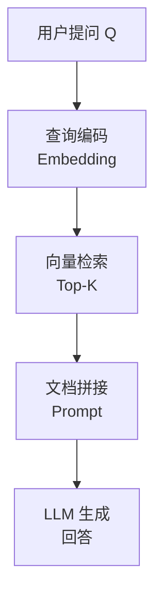

关键步骤：
1. **Embedding**：将用户问题编码为向量
2. **Retrieve**：在向量数据库中检索 Top-K 个最相似的文档块
3. **Augment**：将检索到的文档内容与用户问题拼接成一个增强 Prompt
4. **Generate**：LLM 根据增强 Prompt 生成最终回答

### 完整示例代码

### 导入与全局配置

```python
"""
Standard RAG - 标准检索增强生成
依赖：pip install openai numpy
"""

import os
import numpy as np
from openai import OpenAI

# ============================================================
# 初始化 OpenAI 客户端（请替换为你的 API Key）
# ============================================================
client = OpenAI(
    api_key=os.environ.get("OPENAI_API_KEY", "your-api-key-here"),
    base_url=os.environ.get("OPENAI_BASE_URL", None),
)
```

### 向量存储类实现

```python
# ============================================================
# 模拟向量检索器
# ============================================================
class SimpleVectorStore:
    """简单的内存向量存储，使用 OpenAI Embedding 计算相似度"""

    def __init__(self):
        self.documents: list[str] = []
        self.embeddings: list[list[float]] = []

    def add_documents(self, docs: list[str]):
        """将文档列表编码为向量并存储"""
        for doc in docs:
            self.documents.append(doc)
            embedding = self._get_embedding(doc)
            self.embeddings.append(embedding)

    def search(self, query: str, top_k: int = 3) -> list[dict]:
        """检索与查询最相似的 top_k 个文档"""
        query_embedding = self._get_embedding(query)
        similarities = []
        for i, emb in enumerate(self.embeddings):
            sim = self._cosine_similarity(query_embedding, emb)
            similarities.append((i, sim))
        similarities.sort(key=lambda x: x[1], reverse=True)

        results = []
        for idx, score in similarities[:top_k]:
            results.append({
                "content": self.documents[idx],
                "score": round(score, 4),
            })
        return results

    def _get_embedding(self, text: str) -> list[float]:
        """调用 OpenAI Embedding API 获取文本向量"""
        response = client.embeddings.create(
            model="text-embedding-3-small",
            input=text,
        )
        return response.data[0].embedding

    @staticmethod
    def _cosine_similarity(a: list[float], b: list[float]) -> float:
        """计算余弦相似度"""
        a_arr = np.array(a)
        b_arr = np.array(b)
        return float(np.dot(a_arr, b_arr) / (np.linalg.norm(a_arr) * np.linalg.norm(b_arr)))
```

### 核心 RAG 类实现

```python
# ============================================================
# Standard RAG 执行器
# ============================================================
class StandardRAG:
    """标准 RAG：检索 → 增强 → 生成"""

    def __init__(self, vector_store: SimpleVectorStore):
        self.store = vector_store

    def answer(self, query: str, top_k: int = 3) -> str:
        """回答用户问题"""
        # 步骤1：检索相关文档
        retrieved_docs = self.store.search(query, top_k=top_k)

        # 步骤2：构建增强 Prompt
        context_parts = []
        for i, doc in enumerate(retrieved_docs):
            context_parts.append(f"[文档{i+1}] (相似度: {doc['score']})\n{doc['content']}")
        context = "\n\n".join(context_parts)

        augmented_prompt = f"""你是一个知识助手。请根据以下检索到的文档内容回答用户的问题。
如果文档中没有相关信息，请诚实地说"根据已有资料无法回答"。

--- 检索到的文档 ---
{context}
--- 文档结束 ---

用户问题：{query}

请回答："""

        # 步骤3：调用 LLM 生成回答
        response = client.chat.completions.create(
            model="gpt-4o-mini",
            messages=[
                {"role": "system", "content": "你是一个基于文档的知识助手。"},
                {"role": "user", "content": augmented_prompt},
            ],
            temperature=0.3,
        )
        return response.choices[0].message.content
```

### 主流程与演示

```python
# ============================================================
# 运行演示
# ============================================================
if __name__ == "__main__":
    # 准备知识库文档
    docs = [
        "Python 是一种解释型、面向对象的高级编程语言，由 Guido van Rossum 于 1991 年首次发布。",
        "Python 3.12 引入了更友好的错误提示信息、新的类型参数语法，并提升了整体性能。",
        "Python 的 GIL（全局解释器锁）限制了同一时刻只有一个线程执行 Python 字节码。",
        "FastAPI 是一个现代、高性能的 Python Web 框架，支持异步处理和自动 API 文档生成。",
        "Django 是一个全栈 Python Web 框架，遵循 MTV 架构模式，内置 ORM、管理后台和认证系统。",
        "机器学习库 scikit-learn 提供了大量分类、回归和聚类算法，是 Python 数据科学生态的核心组件。",
        "OpenAI 于 2023 年发布了 GPT-4，具备多模态能力，支持文本和图像输入。",
    ]

    # 构建向量存储
    print("正在构建向量存储，为文档生成 Embedding...")
    store = SimpleVectorStore()
    store.add_documents(docs)

    # 创建 RAG 实例
    rag = StandardRAG(store)

    # 提问
    questions = [
        "Python 是什么时候发布的？是谁创建的？",
        "Python 3.12 有哪些新特性？",
        "Django 和 FastAPI 有什么区别？",
    ]

    for q in questions:
        print(f"\n{'='*60}")
        print(f"用户问题: {q}")
        print(f"{'='*60}")
        answer = rag.answer(q)
        print(f"回答: {answer}")
```

---

## 3.2 Self-RAG（自反思 RAG）

### 概念说明

Self-RAG 是由 Akari Asai et al. 于 2023 年提出的一种增强型 RAG 模式。它的核心创新在于：**模型通过特殊的 Reflection Token 自主决定何时检索、对检索结果进行多维度反思评估，并通过自反思循环（Self-Reflection Loop：Retrieve → Critique → Generate）确保生成质量**。

与传统 RAG 每次无条件检索不同，Self-RAG 使用四类 Reflection Token 贯穿生成过程：
- **`Retrieve`**：检索决策标记，模型自主判断当前是否需要外部知识；
- **`ISREL`**（Is Relevant）：相关性评估，判断检索到的文档片段是否与问题相关；
- **`ISSUP`**（Is Supportive）：支持度评估，在逐段生成后判断文档内容是否支撑当前生成的片段；
- **`ISUSE`**（Is Useful）：有用性评估，在完整生成后综合判断文档片段对最终回答的整体效用，用于排序选择最优回答。

Self-RAG 的自反思循环（Self-Reflection Loop）包含三个核心阶段，形成闭环反馈：
- **Retrieve（检索）**：根据 `Retrieve` 标记决定是否执行检索，获取相关文档；
- **Critique（评判）**：在生成前用 `ISREL` 过滤不相关文档，在逐段生成后用 `ISSUP` 验证该段是否被文档支撑，在完整生成后用 `ISUSE` 评估整体效用；
- **Generate（生成）**：基于通过 `ISREL` 筛选的高质量文档逐段生成回答，每段生成后经 `ISSUP` 验证，最终通过 `ISUSE` 排序选出最优回答。

Self-RAG 的优势在于：
- **按需检索**：减少不必要的检索开销
- **质量过滤**：自动过滤不相关或不可信的文档
- **可追溯性**：每个生成片段都可以追溯到其引用来源

### 核心流程/原理

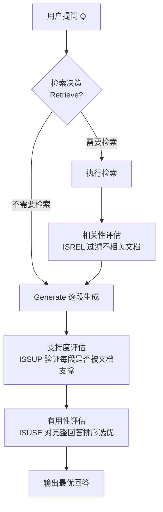

### 完整示例代码

### 导入与全局配置

```python
"""
Self-RAG - 自反思检索增强生成
依赖：pip install openai numpy
"""

import os
import numpy as np
from openai import OpenAI

client = OpenAI(
    api_key=os.environ.get("OPENAI_API_KEY", "your-api-key-here"),
    base_url=os.environ.get("OPENAI_BASE_URL", None),
)
```

### 向量存储类实现

```python

class SimpleVectorStore:
    """简单的内存向量存储（同 Standard RAG）"""

    def __init__(self):
        self.documents: list[str] = []
        self.embeddings: list[list[float]] = []

    def add_documents(self, docs: list[str]):
        for doc in docs:
            self.documents.append(doc)
            embedding = self._get_embedding(doc)
            self.embeddings.append(embedding)

    def search(self, query: str, top_k: int = 3) -> list[dict]:
        query_embedding = self._get_embedding(query)
        similarities = []
        for i, emb in enumerate(self.embeddings):
            sim = self._cosine_similarity(query_embedding, emb)
            similarities.append((i, sim))
        similarities.sort(key=lambda x: x[1], reverse=True)
        results = []
        for idx, score in similarities[:top_k]:
            results.append({"content": self.documents[idx], "score": round(score, 4)})
        return results

    def _get_embedding(self, text: str) -> list[float]:
        response = client.embeddings.create(
            model="text-embedding-3-small",
            input=text,
        )
        return response.data[0].embedding

    @staticmethod
    def _cosine_similarity(a: list[float], b: list[float]) -> float:
        a_arr = np.array(a)
        b_arr = np.array(b)
        return float(np.dot(a_arr, b_arr) / (np.linalg.norm(a_arr) * np.linalg.norm(b_arr)))
```

### SelfRAG 核心类 - 初始化与检索决策

```python

class SelfRAG:
    """
    Self-RAG：模型自主决定检索时机，多维度反思评估检索质量

    Reflection Tokens 四类标记：
    - Retrieve：是否需要检索
    - ISREL（Is Relevant）：文档是否与问题相关
    - ISSUP（Is Supportive）：文档是否支持生成的答案
    - ISUSE（Is Useful）：文档对最终回答的整体有用性

    自反思循环（Self-Reflection Loop）四种策略：
    1. Retrieve  → 检索决策：判断是否需要外部知识，执行检索
    2. Critique  → 批判评估：使用 ISREL/ISSUP/ISUSE 三维度过滤文档
    3. Generate  → 生成回答：基于过滤后的高质量文档生成答案
    4. Paraphrase → 改写优化：当生成质量不足时，改写精炼输出
    """

    def __init__(self, vector_store: SimpleVectorStore):
        self.store = vector_store

    def _should_retrieve(self, query: str) -> tuple[bool, str]:
        """步骤1：检索决策 —— 模型判断是否需要检索"""
        prompt = f"""你需要判断以下用户问题是否需要检索外部知识库来回答。
请用 JSON 格式回复，包含两个字段：
- "need_retrieval": true/false，表示是否需要检索
- "reason": 简要说明原因

问题："{query}"

请判断（仅输出 JSON）："""

        response = client.chat.completions.create(
            model="gpt-4o-mini",
            messages=[{"role": "user", "content": prompt}],
            temperature=0,
            response_format={"type": "json_object"},
        )
        import json
        result = json.loads(response.choices[0].message.content or "{}")
        return result.get("need_retrieval", True), result.get("reason", "")
```

### SelfRAG - 文档评估方法

```python

    def _evaluate_relevance(self, query: str, doc: dict) -> tuple[bool, str]:
        """步骤3：相关性评估 ISREL —— 文档是否与问题相关"""
        prompt = f"""请判断以下文档内容是否与用户问题相关。
用 JSON 格式回复：
- "is_relevant": true/false
- "reason": 简要说明

用户问题："{query}"

文档内容："{doc['content']}"

请判断（仅输出 JSON）："""

        response = client.chat.completions.create(
            model="gpt-4o-mini",
            messages=[{"role": "user", "content": prompt}],
            temperature=0,
            response_format={"type": "json_object"},
        )
        import json
        result = json.loads(response.choices[0].message.content or "{}")
        return result.get("is_relevant", False), result.get("reason", "")

    def _evaluate_support(self, doc: dict, draft_answer: str) -> tuple[bool, str]:
        """步骤4：支持度评估 ISSUP —— 文档是否支持答案"""
        prompt = f"""请判断以下文档内容是否支持或验证了给定的草稿答案。
用 JSON 格式回复：
- "is_supportive": true/false
- "reason": 简要说明

文档内容："{doc['content']}"

草稿答案："{draft_answer}"

请判断（仅输出 JSON）："""

        response = client.chat.completions.create(
            model="gpt-4o-mini",
            messages=[{"role": "user", "content": prompt}],
            temperature=0,
            response_format={"type": "json_object"},
        )
        import json
        result = json.loads(response.choices[0].message.content or "{}")
        return result.get("is_supportive", False), result.get("reason", "")
```

### SelfRAG - 回答流程：检索与相关性过滤

```python

    def answer(self, query: str, top_k: int = 3, verbose: bool = True) -> str:
        """执行 Self-RAG 完整流程"""

        if verbose:
            print(f"\n{'='*60}")
            print(f"用户问题: {query}")
            print(f"{'='*60}")

        # 步骤1：检索决策
        need_retrieval, reason = self._should_retrieve(query)
        if verbose:
            print(f"[检索决策] 需要检索: {need_retrieval} | 原因: {reason}")

        if not need_retrieval:
            # 直接生成回答（模型认为自身知识足够）
            response = client.chat.completions.create(
                model="gpt-4o-mini",
                messages=[
                    {"role": "system", "content": "你是一个知识助手，请直接回答问题。"},
                    {"role": "user", "content": query},
                ],
                temperature=0.3,
            )
            answer = response.choices[0].message.content
            if verbose:
                print(f"[直接回答] {answer}")
            return answer

        # 步骤2：执行检索
        retrieved_docs = self.store.search(query, top_k=top_k)
        if verbose:
            print(f"[检索] 检索到 {len(retrieved_docs)} 个文档")
            for i, d in enumerate(retrieved_docs):
                print(f"  文档{i+1}: {d['content'][:60]}...")

        # 步骤3：相关性评估（ISREL）—— 过滤不相关文档
        relevant_docs = []
        for i, doc in enumerate(retrieved_docs):
            is_rel, rel_reason = self._evaluate_relevance(query, doc)
            if verbose:
                print(f"[ISREL 评估] 文档{i+1}: {'相关' if is_rel else '不相关'} | {rel_reason}")
            if is_rel:
                relevant_docs.append(doc)
```

### SelfRAG - 回答流程：草稿生成与支持度评估

```python

        if not relevant_docs:
            return "根据检索结果，没有找到与您问题相关的资料。"

        # 步骤4：先基于相关文档生成草稿答案
        draft_context = "\n\n".join([d["content"] for d in relevant_docs])
        draft_prompt = f"""根据以下文档生成一个草稿回答：

{', '.join([d["content"] for d in relevant_docs])}

问题：{query}

草稿回答："""

        draft_response = client.chat.completions.create(
            model="gpt-4o-mini",
            messages=[{"role": "user", "content": draft_prompt}],
            temperature=0.3,
        )
        draft_answer = draft_response.choices[0].message.content
        if verbose:
            print(f"[草稿答案] {draft_answer[:100]}...")

        # 步骤5：支持度评估（ISSUP）—— 过滤不支撑草稿答案的文档
        supportive_docs = []
        for i, doc in enumerate(relevant_docs):
            is_sup, sup_reason = self._evaluate_support(doc, draft_answer)
            if verbose:
                print(f"[ISSUP 评估] 文档: {'支持' if is_sup else '不支持'} | {sup_reason}")
            if is_sup:
                supportive_docs.append(doc)

        if not supportive_docs:
            # 如果没有支持文档，至少用相关文档回答
            supportive_docs = relevant_docs
```

### SelfRAG - 回答流程：最终生成

```python

        # 步骤6：生成最终回答
        final_context = "\n\n".join([d["content"] for d in supportive_docs])
        final_prompt = f"""你是一个知识助手。请严格依据以下已验证的文档内容回答用户问题。
请引用具体的文档来源。

--- 已验证的参考文档 ---
{final_context}
--- 文档结束 ---

用户问题：{query}

请回答："""

        final_response = client.chat.completions.create(
            model="gpt-4o-mini",
            messages=[
                {"role": "system", "content": "你是一个严谨的知识助手，请基于验证过的文档回答。"},
                {"role": "user", "content": final_prompt},
            ],
            temperature=0.3,
        )
        final_answer = final_response.choices[0].message.content
        if verbose:
            print(f"[最终回答] {final_answer}")
        return final_answer
```

### 主流程与演示

```python

# ============================================================
# 运行演示
# ============================================================
if __name__ == "__main__":
    docs = [
        "Python 是一种解释型、面向对象的高级编程语言，由 Guido van Rossum 于 1991 年首次发布。",
        "Python 3.12 引入了更友好的错误提示信息、新的类型参数语法，并提升了整体性能。",
        "Python 的 GIL（全局解释器锁）限制了同一时刻只有一个线程执行 Python 字节码。",
        "FastAPI 是一个现代、高性能的 Python Web 框架，支持异步处理和自动 API 文档生成。",
        "Django 是一个全栈 Python Web 框架，遵循 MTV 架构模式，内置 ORM、管理后台和认证系统。",
        "机器学习库 scikit-learn 提供了大量分类、回归和聚类算法，是 Python 数据科学生态的核心组件。",
        "OpenAI 于 2023 年发布了 GPT-4，具备多模态能力，支持文本和图像输入。",
    ]

    print("正在构建向量存储...")
    store = SimpleVectorStore()
    store.add_documents(docs)

    self_rag = SelfRAG(store)

    self_rag.answer("谁创建了 Python 语言？what year？", verbose=True)
    self_rag.answer("Java 是什么？", verbose=True)
```

---

## 3.3 Corrective RAG (CRAG，纠正型 RAG)

### 概念说明

Corrective RAG（CRAG）由 Yan et al. 于 2024 年提出，核心理念是：**检索之后先评估文档质量，根据评估结果选择不同的处理策略**。它不是简单地信任所有检索结果，而是引入了一个"检索评估器"来判断检索到的文档质量。

CRAG 定义了三层处理策略：
- **Correct（正确）**：检索质量高，文档与问题高度相关 → 直接使用已检索文档
- **Incorrect（不正确）**：检索质量差，文档与问题无关 → 执行网页搜索作为补充或纠正
- **Ambiguous（模糊）**：检索质量一般，处于灰色地带 → 结合已检索文档和网页搜索结果

这种"评估-纠正"的机制使 CRAG 在检索失败时有自我修复能力，显著提升了 RAG 系统的鲁棒性。

### 核心流程/原理

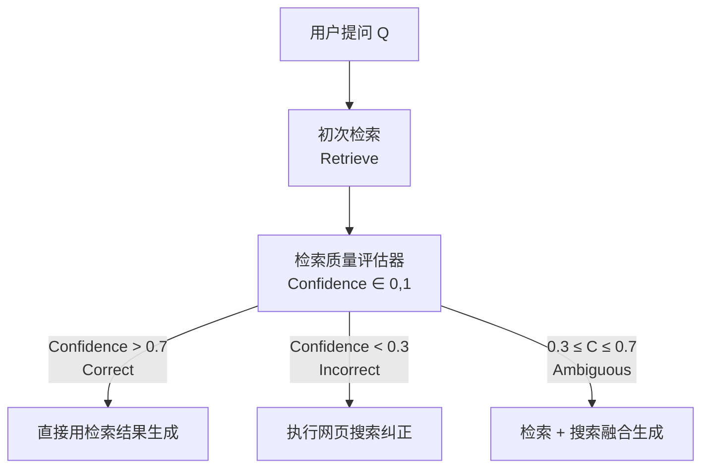

### 完整示例代码

### 导入与全局配置

```python
"""
Corrective RAG (CRAG) - 纠正型检索增强生成
依赖：pip install openai numpy
"""

import os
import json
import numpy as np
from openai import OpenAI

client = OpenAI(
    api_key=os.environ.get("OPENAI_API_KEY", "your-api-key-here"),
    base_url=os.environ.get("OPENAI_BASE_URL", None),
)
```

### 向量存储类实现

```python

class SimpleVectorStore:
    """简单的内存向量存储"""

    def __init__(self):
        self.documents: list[str] = []
        self.embeddings: list[list[float]] = []

    def add_documents(self, docs: list[str]):
        for doc in docs:
            self.documents.append(doc)
            embedding = self._get_embedding(doc)
            self.embeddings.append(embedding)

    def search(self, query: str, top_k: int = 3) -> list[dict]:
        query_embedding = self._get_embedding(query)
        similarities = []
        for i, emb in enumerate(self.embeddings):
            sim = self._cosine_similarity(query_embedding, emb)
            similarities.append((i, sim))
        similarities.sort(key=lambda x: x[1], reverse=True)
        results = []
        for idx, score in similarities[:top_k]:
            results.append({"content": self.documents[idx], "score": round(score, 4)})
        return results

    def _get_embedding(self, text: str) -> list[float]:
        response = client.embeddings.create(
            model="text-embedding-3-small",
            input=text,
        )
        return response.data[0].embedding

    @staticmethod
    def _cosine_similarity(a: list[float], b: list[float]) -> float:
        a_arr = np.array(a)
        b_arr = np.array(b)
        return float(np.dot(a_arr, b_arr) / (np.linalg.norm(a_arr) * np.linalg.norm(b_arr)))
```

### CorrectiveRAG 核心类 - 初始化与检索质量评估

```python

class CorrectiveRAG:
    """
    CRAG：检索后评估质量，不合格则纠正

    核心策略：
    - Confidence > 0.7 → Correct：直接使用检索结果
    - Confidence < 0.3 → Incorrect：用网页搜索纠正
    - Confidence ∈ [0.3, 0.7] → Ambiguous：检索 + 搜索融合
    """

    def __init__(self, vector_store: SimpleVectorStore):
        self.store = vector_store

    def _assess_retrieval_quality(self, query: str, docs: list[dict]) -> dict:
        """
        检索质量评估器
        对每个文档进行相关性打分，汇总为整体置信度
        """
        doc_summaries = []
        for i, doc in enumerate(docs):
            doc_summaries.append(f"文档{i+1}: {doc['content'][:100]}")

        prompt = f"""你是一个检索质量评估器。请评估以下检索结果对用户问题的整体覆盖度和相关性。

用户问题："{query}"

检索到的文档：
{chr(10).join(doc_summaries)}

请用 JSON 格式回复：
- "overall_confidence": 0.0 到 1.0 之间的浮点数，表示检索结果整体质量
- "category": "correct" / "incorrect" / "ambiguous"
- "reason": 简要评分理由

仅输出 JSON："""

        response = client.chat.completions.create(
            model="gpt-4o-mini",
            messages=[{"role": "user", "content": prompt}],
            temperature=0,
            response_format={"type": "json_object"},
        )
        return json.loads(response.choices[0].message.content or "{}")
```

### CorrectiveRAG - 模拟网页搜索

```python

    def _web_search_simulated(self, query: str) -> list[str]:
        """
        模拟网页搜索（实际项目中替换为真实的搜索 API，如 Bing/SERP/Google）
        这里使用 LLM 基于其训练知识生成"模拟搜索结果"
        """
        prompt = f"""你是一个搜索引擎。请为以下查询生成 3 条简短的模拟搜索结果摘要，
每条不超过 80 字。用 JSON 格式回复，包含字段 "results"（字符串数组）。

查询："{query}"

仅输出 JSON："""

        response = client.chat.completions.create(
            model="gpt-4o-mini",
            messages=[{"role": "user", "content": prompt}],
            temperature=0.7,
            response_format={"type": "json_object"},
        )
        data = json.loads(response.choices[0].message.content or "{}")
        return data.get("results", [])
```

### CorrectiveRAG - 回答流程：检索与质量评估

```python

    def answer(self, query: str, top_k: int = 3, verbose: bool = True) -> str:
        """执行 CRAG 完整流程"""

        if verbose:
            print(f"\n{'='*60}")
            print(f"用户问题: {query}")
            print(f"{'='*60}")

        # 步骤1：初次检索
        retrieved_docs = self.store.search(query, top_k=top_k)
        if verbose:
            print(f"[初次检索] 检索到 {len(retrieved_docs)} 个文档")

        # 步骤2：检索质量评估
        assessment = self._assess_retrieval_quality(query, retrieved_docs)
        confidence = assessment.get("overall_confidence", 0.5)
        category = assessment.get("category", "ambiguous")
        reason = assessment.get("reason", "")

        if verbose:
            print(f"[质量评估] 置信度: {confidence:.2f} | 类别: {category} | 原因: {reason}")
```

### CorrectiveRAG - 回答流程：策略执行

```python

        # 步骤3：根据评估结果执行不同策略
        final_docs = []

        if category == "correct":
            # 策略A：直接使用检索文档
            if verbose:
                print("[策略] Correct → 直接使用检索结果")
            final_docs = [d["content"] for d in retrieved_docs]

        elif category == "incorrect":
            # 策略B：执行网页搜索纠正
            if verbose:
                print("[策略] Incorrect → 执行网页搜索纠正")
            web_results = self._web_search_simulated(query)
            if verbose:
                for i, r in enumerate(web_results):
                    print(f"  搜索结果{i+1}: {r[:80]}...")
            final_docs = web_results

        else:  # ambiguous
            # 策略C：检索 + 搜索融合
            if verbose:
                print("[策略] Ambiguous → 融合检索结果和搜索结果")
            web_results = self._web_search_simulated(query)
            final_docs = [d["content"] for d in retrieved_docs] + web_results
```

### CorrectiveRAG - 回答流程：最终生成

```python

        # 步骤4：基于最终文档生成回答
        context = "\n\n".join(
            [f"[来源{i+1}] {doc}" for i, doc in enumerate(final_docs)]
        )

        final_prompt = f"""你是一个知识助手。请根据以下参考文档回答用户问题。
请标注信息来源编号。

--- 参考文档 ---
{context}
--- 文档结束 ---

用户问题：{query}

请回答："""

        response = client.chat.completions.create(
            model="gpt-4o-mini",
            messages=[
                {"role": "system", "content": "你是一个严谨的知识助手，请基于提供的文档回答。"},
                {"role": "user", "content": final_prompt},
            ],
            temperature=0.3,
        )
        answer = response.choices[0].message.content
        if verbose:
            print(f"[最终回答] {answer}")
        return answer
```

### 主流程与演示

```python

# ============================================================
# 运行演示
# ============================================================
if __name__ == "__main__":
    # 场景1：知识库与问题匹配
    docs = [
        "Python 是一种解释型、面向对象的高级编程语言，由 Guido van Rossum 于 1991 年首次发布。",
        "Python 3.12 引入了更友好的错误提示信息、新的类型参数语法，并提升了整体性能。",
        "Python 的 GIL（全局解释器锁）限制了同一时刻只有一个线程执行 Python 字节码。",
        "FastAPI 是一个现代、高性能的 Python Web 框架，支持异步处理和自动 API 文档生成。",
        "Django 是一个全栈 Python Web 框架，遵循 MTV 架构模式，内置 ORM、管理后台和认证系统。",
    ]

    print("正在构建向量存储...")
    store = SimpleVectorStore()
    store.add_documents(docs)

    crag = CorrectiveRAG(store)

    # 测试：匹配的问题 → 应该是 correct
    crag.answer("Python 是谁创建的？", verbose=True)

    # 测试：不匹配的问题 → 应该是 incorrect，触发网页搜索纠正
    crag.answer("2026 年最新的量子计算进展有哪些？", verbose=True)
```

---

## 3.4 RAISE（RAG + ReAct 检索增强推理）

### 概念说明

RAISE 将 **RAG（检索增强生成）** 与 **ReAct（推理-行动循环）** 两种设计模式相结合。它的核心思想是：不只在回答前检索一次，而是在推理过程中**多轮、多步骤地检索**，将检索作为推理链条中的一环。

在 RAISE 模式下，Agent 按照 ReAct 范式工作：**Thought（思考）→ Action（执行检索/工具调用）→ Observation（观察结果）→ 继续推理**。当 Agent 在推理过程中发现知识缺口时，会自动发起检索；检索结果作为新的观察注入推理上下文，循环继续直到 Agent 认为已足够回答问题。

RAISE 特别适合需要**多步推理**和**跨文档信息整合**的复杂问题，比如对比分析、因果推理、需要多个独立事实支撑的论证等。

### 核心流程/原理

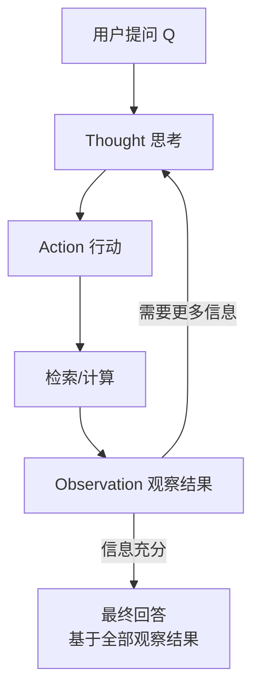

### 完整示例代码

### 导入与全局配置

```python
"""
RAISE - RAG + ReAct 检索增强推理
依赖：pip install openai numpy
"""

import os
import json
import re
import numpy as np
from openai import OpenAI

client = OpenAI(
    api_key=os.environ.get("OPENAI_API_KEY", "your-api-key-here"),
    base_url=os.environ.get("OPENAI_BASE_URL", None),
)
```

### 向量存储类实现

```python

class SimpleVectorStore:
    """简单的内存向量存储"""

    def __init__(self):
        self.documents: list[str] = []
        self.embeddings: list[list[float]] = []

    def add_documents(self, docs: list[str]):
        for doc in docs:
            self.documents.append(doc)
            embedding = self._get_embedding(doc)
            self.embeddings.append(embedding)

    def search(self, query: str, top_k: int = 3) -> list[dict]:
        query_embedding = self._get_embedding(query)
        similarities = []
        for i, emb in enumerate(self.embeddings):
            sim = self._cosine_similarity(query_embedding, emb)
            similarities.append((i, sim))
        similarities.sort(key=lambda x: x[1], reverse=True)
        results = []
        for idx, score in similarities[:top_k]:
            results.append({"content": self.documents[idx], "score": round(score, 4)})
        return results

    def _get_embedding(self, text: str) -> list[float]:
        response = client.embeddings.create(
            model="text-embedding-3-small",
            input=text,
        )
        return response.data[0].embedding

    @staticmethod
    def _cosine_similarity(a: list[float], b: list[float]) -> float:
        a_arr = np.array(a)
        b_arr = np.array(b)
        return float(np.dot(a_arr, b_arr) / (np.linalg.norm(a_arr) * np.linalg.norm(b_arr)))
```

### RAISE 核心类 - 初始化与检索执行

```python

class RAISE:
    """
    RAISE：RAG + ReAct 结合，在推理循环中多轮检索

    Agent 的每一步输出格式：
    Thought: 当前思考
    Action: 执行的动作（SEARCH(query) 或 FINAL_ANSWER）
    """

    MAX_ITERATIONS = 5

    def __init__(self, vector_store: SimpleVectorStore):
        self.store = vector_store
        self.collected_docs: list[dict] = []

    def _execute_search(self, search_query: str) -> list[dict]:
        """执行一次检索"""
        results = self.store.search(search_query, top_k=2)
        for r in results:
            self.collected_docs.append(r)
        return results
```

### RAISE - ReAct Prompt 构建与动作解析

```python

    def _build_react_prompt(self, query: str, history: list[str]) -> str:
        """构建 ReAct 推理 Prompt"""
        history_text = "\n".join(history) if history else "（无历史记录）"

        return f"""你是一个能够检索外部知识的智能 Agent。请使用 ReAct 模式逐步回答用户问题。

## 可用动作
- SEARCH(你的搜索查询) - 在知识库中检索相关文档
- FINAL_ANSWER - 当你收集了足够信息后，给出最终答案

## 输出格式（严格遵循）
Thought: [你的推理步骤，分析当前知道了什么、还缺什么]
Action: SEARCH(搜索短语)  或  FINAL_ANSWER

## 对话历史
{history_text}

## 当前任务
用户问题：{query}

请继续推理（从 Thought 开始）："""

    def _parse_action(self, text: str) -> tuple[str, str]:
        """解析模型输出的 Action"""
        match = re.search(r"Action:\s*(.+)", text, re.IGNORECASE)
        if not match:
            return "UNKNOWN", ""

        action_text = match.group(1).strip()

        if action_text.upper().startswith("FINAL_ANSWER"):
            return "FINAL_ANSWER", ""
        elif action_text.upper().startswith("SEARCH("):
            inner = re.search(r"SEARCH\((.*?)\)", action_text, re.IGNORECASE)
            if inner:
                return "SEARCH", inner.group(1).strip().strip('"\'')
        return "UNKNOWN", action_text
```

### RAISE - 最终回答生成

```python

    def _generate_final_answer(self, query: str) -> str:
        """基于所有收集到的文档生成最终回答"""
        if not self.collected_docs:
            return "未能检索到相关信息，无法回答该问题。"

        context = "\n\n".join(
            [f"[来源{i+1}] {d['content']}" for i, d in enumerate(self.collected_docs)]
        )

        prompt = f"""你是一个知识助手。请根据以下所有收集到的参考文档，回答用户问题。

--- 所有参考文档 ---
{context}
--- 文档结束 ---

用户问题：{query}

请给出完整、结构清晰的回答："""

        response = client.chat.completions.create(
            model="gpt-4o-mini",
            messages=[{"role": "user", "content": prompt}],
            temperature=0.3,
        )
        return response.choices[0].message.content
```

### RAISE - 回答流程：ReAct 推理循环

```python

    def answer(self, query: str, verbose: bool = True) -> str:
        """执行 RAISE 完整流程"""

        if verbose:
            print(f"\n{'='*60}")
            print(f"用户问题: {query}")
            print(f"{'='*60}")

        self.collected_docs = []
        history: list[str] = []

        for iteration in range(1, self.MAX_ITERATIONS + 1):
            if verbose:
                print(f"\n--- 迭代 {iteration} ---")

            # 构建 ReAct Prompt
            react_prompt = self._build_react_prompt(query, history)

            # 模型推理
            response = client.chat.completions.create(
                model="gpt-4o-mini",
                messages=[{"role": "user", "content": react_prompt}],
                temperature=0.3,
            )
            output = response.choices[0].message.content
            if verbose:
                print(f"[模型输出]\n{output}")

            history.append(f"迭代{iteration}: {output}")

            # 解析 Action
            action_type, action_arg = self._parse_action(output)
```

### RAISE - 回答流程：动作执行与最终生成

```python

            if action_type == "FINAL_ANSWER":
                if verbose:
                    print("[Action] 模型决定给出最终回答")
                break

            elif action_type == "SEARCH":
                if verbose:
                    print(f"[Action] 执行检索: {action_arg}")
                search_results = self._execute_search(action_arg)
                observation = f"检索 '{action_arg}' 的结果: "
                if search_results:
                    snippets = [d["content"][:120] for d in search_results]
                    observation += "; ".join(snippets)
                else:
                    observation += "未找到相关文档"
                history.append(f"Observation: {observation}")
                if verbose:
                    print(f"[Observation] {observation[:200]}...")

            else:
                if verbose:
                    print(f"[Action] 无法解析的动作: {action_arg}")
                history.append(f"Observation: 无法执行该动作，请重试 Search 或 Final_answer")

        # 生成最终回答
        if verbose:
            print(f"\n[汇总] 共收集到 {len(self.collected_docs)} 个文档片段")

        final_answer = self._generate_final_answer(query)
        if verbose:
            print(f"[最终回答] {final_answer}")
        return final_answer
```

### 主流程与演示

```python

# ============================================================
# 运行演示
# ============================================================
if __name__ == "__main__":
    docs = [
        "Python 是一种解释型、面向对象的高级编程语言，由 Guido van Rossum 于 1991 年首次发布。",
        "Python 的 GIL（全局解释器锁）限制了同一时刻只有一个线程执行 Python 字节码。",
        "Python 3.12 引入了更友好的错误提示信息、新的类型参数语法，并提升了整体性能。",
        "FastAPI 是一个现代、高性能的 Python Web 框架，支持异步处理和自动 API 文档生成。",
        "Django 是一个全栈 Python Web 框架，遵循 MTV 架构模式，内置 ORM、管理后台和认证系统。",
        "机器学习库 scikit-learn 提供了大量分类、回归和聚类算法，是 Python 数据科学生态的核心组件。",
        "Python 3.11 相比 3.10 提升了 10%-60% 的性能，主要归功于 Faster CPython 项目。",
        "asyncio 是 Python 的标准异步 I/O 库，提供了事件循环、协程和 Future 对象。",
    ]

    print("正在构建向量存储...")
    store = SimpleVectorStore()
    store.add_documents(docs)

    raise_agent = RAISE(store)

    # 简单问题：可能只需一次检索
    raise_agent.answer("Python 是谁在什么时候创建的？", verbose=True)

    # 复杂问题：需要多轮检索
    raise_agent.answer("Python 的异步编程能力如何？和 FastAPI 有什么关系？", verbose=True)
```

---

## 3.5 Active RAG（渐进式多轮检索）

### 概念说明

Active RAG 是一种**渐进式、多轮交互**的检索增强生成模式。与 Standard RAG 的"一次检索、一次生成"不同，Active RAG 将问答过程视为一个**迭代收敛**的过程：Agent 先基于初步检索生成回答草稿，然后分析草稿中的不确定点或知识缺口，针对性地发起补充检索，逐步完善答案。

Active RAG 的核心哲学是"先回答，再完善"（类似于人类写论文时的 research → draft → review → supplement → polish 循环）。每一轮检索都是**有针对性的、由已生成内容驱动的**，而非无差别的全文检索。

这种模式特别适合以下场景：
- 开放性问题，需要从多个角度收集信息
- 需要最新信息来补充基础知识库
- 知识库庞大但分散，一次检索难以覆盖全貌

### 核心流程/原理

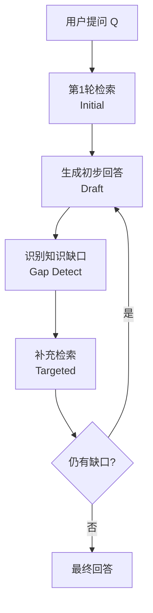

### 完整示例代码

### 导入与全局配置

```python
"""
Active RAG - 渐进式多轮检索增强生成
依赖：pip install openai numpy
"""

import os
import json
import numpy as np
from openai import OpenAI

client = OpenAI(
    api_key=os.environ.get("OPENAI_API_KEY", "your-api-key-here"),
    base_url=os.environ.get("OPENAI_BASE_URL", None),
)
```

### 向量存储类实现

```python

class SimpleVectorStore:
    """简单的内存向量存储"""

    def __init__(self):
        self.documents: list[str] = []
        self.embeddings: list[list[float]] = []

    def add_documents(self, docs: list[str]):
        for doc in docs:
            self.documents.append(doc)
            embedding = self._get_embedding(doc)
            self.embeddings.append(embedding)

    def search(self, query: str, top_k: int = 3) -> list[dict]:
        query_embedding = self._get_embedding(query)
        similarities = []
        for i, emb in enumerate(self.embeddings):
            sim = self._cosine_similarity(query_embedding, emb)
            similarities.append((i, sim))
        similarities.sort(key=lambda x: x[1], reverse=True)
        results = []
        for idx, score in similarities[:top_k]:
            results.append({"content": self.documents[idx], "score": round(score, 4)})
        return results

    def _get_embedding(self, text: str) -> list[float]:
        response = client.embeddings.create(
            model="text-embedding-3-small",
            input=text,
        )
        return response.data[0].embedding

    @staticmethod
    def _cosine_similarity(a: list[float], b: list[float]) -> float:
        a_arr = np.array(a)
        b_arr = np.array(b)
        return float(np.dot(a_arr, b_arr) / (np.linalg.norm(a_arr) * np.linalg.norm(b_arr)))
```

### ActiveRAG 核心类 - 初始化与草稿生成

```python

class ActiveRAG:
    """
    Active RAG：渐进式多轮检索

    流程：
    1. 初始检索 → 生成草稿
    2. 分析草稿中的知识缺口
    3. 针对缺口补充检索 → 更新草稿
    4. 重复直到无显著缺口或达到最大轮次
    """

    MAX_ROUNDS = 3
    COMPLETENESS_THRESHOLD = 0.85

    def __init__(self, vector_store: SimpleVectorStore):
        self.store = vector_store
        self.all_docs: list[str] = []

    def _generate_draft(self, query: str, docs: list[str]) -> str:
        """基于当前文档集合生成草稿回答"""
        if not docs:
            return "暂无足够信息生成回答。"

        context = "\n\n".join(
            [f"[来源{i+1}] {doc}" for i, doc in enumerate(docs)]
        )

        prompt = f"""你是一个知识助手。请根据以下文档内容，生成一个初步回答。
如果信息不足，请指出哪些方面还不明确。

--- 参考文档 ---
{context}
--- 文档结束 ---

用户问题：{query}

初步回答（可标注不确定的地方）："""

        response = client.chat.completions.create(
            model="gpt-4o-mini",
            messages=[{"role": "user", "content": prompt}],
            temperature=0.3,
        )
        return response.choices[0].message.content
```

### ActiveRAG - 知识缺口检测

```python

    def _detect_gaps(self, query: str, draft: str, docs_used: list[str]) -> dict:
        """分析当前草稿中的知识缺口"""
        docs_summary = "\n".join([f"- {d[:100]}" for d in docs_used])

        prompt = f"""你是一个答案质量评估器。请分析以下草稿回答，判断是否存在知识缺口。

用户问题："{query}"

已使用的文档摘要：
{docs_summary}

草稿回答：
"{draft}"

请用 JSON 格式回复：
- "completeness": 0.0 到 1.0 的浮点数，表示回答完整度
- "has_gaps": true/false
- "gap_queries": 需要补充检索的具体问题列表（最多3个，如果没有缺口则为空数组）
- "reason": 简要原因

仅输出 JSON："""

        response = client.chat.completions.create(
            model="gpt-4o-mini",
            messages=[{"role": "user", "content": prompt}],
            temperature=0,
            response_format={"type": "json_object"},
        )
        return json.loads(response.choices[0].message.content or "{}")
```

### ActiveRAG - 最终回答生成

```python

    def _generate_final(self, query: str, all_docs: list[str]) -> str:
        """基于所有收集到的文档生成最终回答"""
        context = "\n\n".join(
            [f"[来源{i+1}] {doc}" for i, doc in enumerate(all_docs)]
        )

        prompt = f"""你是一个知识助手。以下是通过多轮检索收集到的全部相关文档，
请基于它们生成一个完整、准确、结构清晰的回答。

--- 全部参考文档 ---
{context}
--- 文档结束 ---

用户问题：{query}

完整回答："""

        response = client.chat.completions.create(
            model="gpt-4o-mini",
            messages=[
                {"role": "system", "content": "你是一个严谨的知识助手，请基于全部文档给出完整回答。"},
                {"role": "user", "content": prompt},
            ],
            temperature=0.3,
        )
        return response.choices[0].message.content
```

### ActiveRAG - 回答流程：初始检索与草稿

```python

    def answer(self, query: str, verbose: bool = True) -> str:
        """执行 Active RAG 完整流程"""

        if verbose:
            print(f"\n{'='*60}")
            print(f"用户问题: {query}")
            print(f"{'='*60}")

        self.all_docs = []

        # 第1轮：初始检索
        if verbose:
            print(f"\n--- 第1轮：初始检索 ---")
        initial_results = self.store.search(query, top_k=3)
        current_docs = [d["content"] for d in initial_results]
        self.all_docs.extend(current_docs)
        if verbose:
            for i, doc in enumerate(current_docs):
                print(f"  检索结果{i+1}: {doc[:80]}...")

        # 生成草稿
        draft = self._generate_draft(query, current_docs)
        if verbose:
            print(f"[草稿回答]\n{draft[:200]}...")
```

### ActiveRAG - 回答流程：迭代缺口检测与补充检索

```python

        # 迭代改进
        for round_num in range(2, self.MAX_ROUNDS + 1):
            # 检测知识缺口
            gap_analysis = self._detect_gaps(query, draft, self.all_docs)
            completeness = gap_analysis.get("completeness", 0.5)
            has_gaps = gap_analysis.get("has_gaps", False)
            gap_queries = gap_analysis.get("gap_queries", [])
            reason = gap_analysis.get("reason", "")

            if verbose:
                print(f"\n--- 第{round_num}轮：缺口分析 ---")
                print(f"  完整度: {completeness:.2f} | 有缺口: {has_gaps} | 原因: {reason}")

            # 判断是否停止
            if not has_gaps or completeness >= self.COMPLETENESS_THRESHOLD:
                if verbose:
                    print("[决策] 回答已足够完整，停止检索")
                break

            if verbose:
                print(f"  缺口查询: {gap_queries}")

            # 针对缺口补充检索
            new_docs = []
            for gq in gap_queries:
                results = self.store.search(gq, top_k=2)
                for r in results:
                    content = r["content"]
                    if content not in self.all_docs:
                        new_docs.append(content)
                        self.all_docs.append(content)

            if not new_docs:
                if verbose:
                    print("[决策] 补充检索未发现新文档，停止")
                break
```

### ActiveRAG - 回答流程：草稿更新与最终生成

```python

            if verbose:
                for i, doc in enumerate(new_docs):
                    print(f"  补充文档{i+1}: {doc[:80]}...")

            # 更新草稿
            draft = self._generate_draft(query, self.all_docs)
            if verbose:
                print(f"[更新草稿]\n{draft[:200]}...")

        # 生成最终回答
        if verbose:
            print(f"\n[汇总] 共收集到 {len(self.all_docs)} 个文档片段")

        final_answer = self._generate_final(query, self.all_docs)
        if verbose:
            print(f"[最终回答] {final_answer}")
        return final_answer
```

### 主流程与演示

```python

# ============================================================
# 运行演示
# ============================================================
if __name__ == "__main__":
    docs = [
        "Python 是一种解释型、面向对象的高级编程语言，由 Guido van Rossum 于 1991 年首次发布。",
        "Python 的 GIL（全局解释器锁）限制了同一时刻只有一个线程执行 Python 字节码。",
        "Python 3.12 引入了更友好的错误提示信息、新的类型参数语法，并提升了整体性能。",
        "Python 3.12 的 f-string 解析更加灵活，支持在 f-string 内部使用相同的引号。",
        "FastAPI 是一个现代、高性能的 Python Web 框架，支持异步处理和自动 API 文档生成。",
        "FastAPI 使用 Pydantic 进行数据验证，基于 Starlette 和 OpenAPI 标准。",
        "Django 是一个全栈 Python Web 框架，遵循 MTV 架构模式，内置 ORM、管理后台和认证系统。",
        "Django REST Framework（DRF）是 Django 生态中最流行的 REST API 工具包。",
        "机器学习库 scikit-learn 提供了大量分类、回归和聚类算法，是 Python 数据科学生态的核心组件。",
        "Python 3.11 相比 3.10 提升了 10%-60% 的性能，主要归功于 Faster CPython 项目。",
        "asyncio 是 Python 的标准异步 I/O 库，提供了事件循环、协程和 Future 对象。",
        "Python 的 typing 模块在 3.12 中引入了 TypeAlias 等新特性，改进了类型提示体验。",
        "Web 框架的选择：Django 适合全栈快速开发，FastAPI 适合高性能 API 和微服务。",
    ]

    print("正在构建向量存储...")
    store = SimpleVectorStore()
    store.add_documents(docs)

    active_rag = ActiveRAG(store)

    # 复杂问题：需要多轮渐进式检索才能完整回答
    active_rag.answer(
        "Python 3.12 相比之前版本有哪些重要改进？特别是在性能、语法和类型系统方面。",
        verbose=True,
    )
```

---

## 3.6 GraphRAG — 基于知识图谱的 RAG

### 概念说明

GraphRAG 由微软于 2024 年提出（arXiv:2404.16130），是一种基于**知识图谱**的检索增强生成模式。传统 RAG 直接检索文本块，难以回答"全局性"问题（如"整个数据集的主要主题是什么"、"这些文档之间的核心关系是什么"）。GraphRAG 通过先从文档中构建知识图谱（实体 + 关系），再对图结构进行社区检测并生成社区摘要，从而支持全局性问题的回答。

**类比理解**：传统 RAG 像是在图书馆里按关键词找书——只能找到与问题字面相关的书；GraphRAG 则像是先读完所有书并绘制出一张"知识地图"（哪些人物有关联、哪些概念相互引用），然后你可以问"这本书的整体脉络是什么"这种全局性问题，系统通过地图上的"社区聚类"（主题分组）来回答。

GraphRAG 与普通 RAG 的核心区别：
- **普通 RAG**：检索文本块（chunk），基于向量相似度
- **GraphRAG**：检索图结构（实体、关系）和社区摘要，基于图遍历和社区聚合

GraphRAG 支持两种查询模式：
- **局部检索（Local Search）**：针对具体实体的问题，检索相关实体及其邻居关系
- **全局检索（Global Search）**：针对全局性/主题性问题，遍历所有社区摘要进行 Map-Reduce 式汇总

### 核心流程/原理

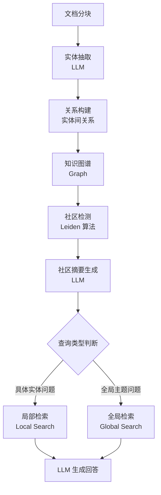

关键步骤：
1. **文档分块**：将原始文档切分为适合 LLM 处理的文本块
2. **实体抽取**：用 LLM 从每个文本块中抽取实体（人名、地名、概念等）
3. **关系构建**：识别实体之间的关系，形成知识图谱的边
4. **社区检测**：使用 Leiden 算法将图中紧密连接的实体聚类为"社区"（主题分组）
5. **社区摘要**：为每个社区生成一段摘要，描述该社区的核心主题
6. **查询路由**：根据问题类型选择局部检索（查具体实体）或全局检索（查整体主题）

### 完整示例代码

### 导入与全局配置

```python
"""
GraphRAG - 基于知识图谱的检索增强生成
依赖：pip install openai numpy
"""

import os
import json
import numpy as np
from openai import OpenAI

# 初始化 OpenAI 客户端
client = OpenAI(
    api_key=os.environ.get("OPENAI_API_KEY", "your-api-key"),
    base_url=os.environ.get("OPENAI_BASE_URL", None),
)
```

### GraphBuilder — 实体抽取与关系构建

```python
class GraphBuilder:
    """
    知识图谱构建器
    - 从文档中抽取实体（LLM 驱动）
    - 识别实体间关系，构建图结构（用字典模拟）
    """

    def __init__(self):
        # 图结构：{实体名: {"neighbors": {邻居: 关系描述}, "source_docs": [来源文档]}}
        self.graph: dict[str, dict] = {}

    def extract_entities_and_relations(self, chunk: str) -> list[dict]:
        """用 LLM 从文本块中抽取实体和关系"""
        prompt = f"""请从以下文本中抽取实体及其之间的关系。

文本：
"{chunk}"

请用 JSON 格式回复，包含字段 "triplets"，是一个数组，每个元素形如：
{{"subject": "实体A", "object": "实体B", "relation": "关系描述"}}

仅输出 JSON："""

        response = client.chat.completions.create(
            model="gpt-4o",
            messages=[{"role": "user", "content": prompt}],
            temperature=0,
            response_format={"type": "json_object"},
        )
        data = json.loads(response.choices[0].message.content or "{}")
        return data.get("triplets", [])

    def build_from_documents(self, chunks: list[str], verbose: bool = False):
        """从文档块列表构建知识图谱"""
        for i, chunk in enumerate(chunks):
            triplets = self.extract_entities_and_relations(chunk)
            if verbose:
                print(f"  文档块{i+1}: 抽取到 {len(triplets)} 个三元组")
            for t in triplets:
                subj = t.get("subject", "").strip()
                obj = t.get("object", "").strip()
                rel = t.get("relation", "").strip()
                if not subj or not obj:
                    continue
                # 添加双向边（无向图）
                self.graph.setdefault(subj, {"neighbors": {}, "source_docs": []})
                self.graph.setdefault(obj, {"neighbors": {}, "source_docs": []})
                self.graph[subj]["neighbors"][obj] = rel
                self.graph[obj]["neighbors"][subj] = rel
                self.graph[subj]["source_docs"].append(chunk)
                self.graph[obj]["source_docs"].append(chunk)
```

### CommunityDetector — 社区检测模拟

```python
class CommunityDetector:
    """
    简化版社区检测器（模拟 Leiden 算法）
    实际 GraphRAG 使用 Leiden 算法，这里用简单的连通分量 + 邻居聚类模拟
    """

    def detect_communities(self, graph: dict, verbose: bool = False) -> list[list[str]]:
        """将图中的节点划分为社区（主题分组）"""
        visited = set()
        communities = []

        # 简单策略：基于邻居扩展的贪心聚类
        # 实际 Leiden 算法会优化模块度（modularity）
        for node in graph:
            if node in visited:
                continue
            # 以当前节点为种子，收集紧密邻居形成社区
            community = [node]
            visited.add(node)
            neighbors = graph[node]["neighbors"]
            # 将未访问的直接邻居加入同一社区
            for neighbor in neighbors:
                if neighbor not in visited:
                    community.append(neighbor)
                    visited.add(neighbor)
            communities.append(community)

        if verbose:
            print(f"检测到 {len(communities)} 个社区")
            for i, c in enumerate(communities):
                print(f"  社区{i+1}: {c}")
        return communities

    def generate_community_summaries(
        self, communities: list[list[str]], graph: dict
    ) -> list[str]:
        """为每个社区生成摘要"""
        summaries = []
        for i, community in enumerate(communities):
            # 收集社区内所有实体和关系
            entity_info = []
            for entity in community:
                neighbors = graph.get(entity, {}).get("neighbors", {})
                for neighbor, rel in neighbors.items():
                    if neighbor in community:
                        entity_info.append(f"{entity} --[{rel}]--> {neighbor}")

            info_text = "\n".join(entity_info[:20])  # 限制长度
            prompt = f"""请为以下知识图谱社区生成一段简短的主题摘要（不超过100字）：

社区内的实体关系：
{info_text}

摘要："""
            response = client.chat.completions.create(
                model="gpt-4o",
                messages=[{"role": "user", "content": prompt}],
                temperature=0.3,
            )
            summary = response.choices[0].message.content
            summaries.append(summary)
        return summaries
```

### GraphRAGQueryEngine — 局部/全局查询引擎

```python
class GraphRAGQueryEngine:
    """
    GraphRAG 查询引擎
    - 局部检索（Local Search）：针对具体实体问题
    - 全局检索（Global Search）：针对全局主题问题
    """

    def __init__(self, graph: dict, communities: list[list[str]], summaries: list[str]):
        self.graph = graph
        self.communities = communities
        self.summaries = summaries

    def _is_global_question(self, query: str) -> bool:
        """判断是否为全局性问题"""
        global_keywords = ["主题", "整体", "主要", "总结", "概述", "全部", "所有", "核心"]
        return any(kw in query for kw in global_keywords)

    def local_search(self, query: str) -> str:
        """局部检索：找到与查询相关的实体及其邻居关系"""
        # 找出图中与查询相关的实体
        relevant_entities = []
        for entity in self.graph:
            if entity in query:
                relevant_entities.append(entity)

        # 收集相关实体及其邻居信息
        context_parts = []
        for entity in relevant_entities[:5]:  # 限制数量
            neighbors = self.graph[entity]["neighbors"]
            for neighbor, rel in list(neighbors.items())[:5]:
                context_parts.append(f"{entity} --[{rel}]--> {neighbor}")
            # 加入来源文档
            docs = self.graph[entity]["source_docs"]
            if docs:
                context_parts.append(f"[{entity}的来源] {docs[0][:100]}...")

        context = "\n".join(context_parts) if context_parts else "未找到相关实体"
        return context

    def global_search(self, query: str) -> str:
        """全局检索：汇总所有社区摘要"""
        # Map-Reduce 式：先让每个社区摘要回答，再汇总
        partial_answers = []
        for i, summary in enumerate(self.summaries):
            prompt = f"""基于以下社区摘要，回答用户问题。如果该社区信息不相关，回复"无相关信息"。

社区摘要：{summary}

用户问题：{query}

回答："""
            response = client.chat.completions.create(
                model="gpt-4o",
                messages=[{"role": "user", "content": prompt}],
                temperature=0.3,
            )
            ans = response.choices[0].message.content
            if "无相关信息" not in ans:
                partial_answers.append(ans)

        # Reduce：汇总所有部分答案
        all_answers = "\n\n".join(
            [f"[部分答案{i+1}] {a}" for i, a in enumerate(partial_answers)]
        )
        return all_answers if all_answers else "无法从社区摘要中获取相关信息"

    def answer(self, query: str, verbose: bool = True) -> str:
        """执行 GraphRAG 查询"""
        if verbose:
            print(f"\n{'='*60}")
            print(f"用户问题: {query}")
            print(f"{'='*60}")

        is_global = self._is_global_question(query)
        if verbose:
            print(f"[查询路由] {'全局检索' if is_global else '局部检索'}")

        if is_global:
            context = self.global_search(query)
        else:
            context = self.local_search(query)

        if verbose:
            print(f"[检索上下文]\n{context[:300]}...")

        # 生成最终回答
        prompt = f"""你是一个知识助手。请基于以下知识图谱检索结果回答用户问题。

--- 检索结果 ---
{context}
--- 结束 ---

用户问题：{query}

请回答："""
        response = client.chat.completions.create(
            model="gpt-4o",
            messages=[
                {"role": "system", "content": "你是一个基于知识图谱的助手。"},
                {"role": "user", "content": prompt},
            ],
            temperature=0.3,
        )
        answer = response.choices[0].message.content
        if verbose:
            print(f"[最终回答] {answer}")
        return answer
```

### 主流程与演示

```python
# ============================================================
# 运行演示
# ============================================================
if __name__ == "__main__":
    # 准备文档
    docs = [
        "Python 由 Guido van Rossum 创建，于 1991 年首次发布。Python 强调代码可读性。",
        "FastAPI 是基于 Python 的现代 Web 框架，由 Sebastián Ramírez 开发，支持异步处理。",
        "Django 是另一个 Python Web 框架，遵循 MTV 架构，内置 ORM 和管理后台。",
        "FastAPI 和 Django 都用于 Web 开发，但 FastAPI 更轻量，Django 更全栈。",
        "Python 的 GIL 限制了多线程性能，因此 FastAPI 使用异步 I/O 来提升并发能力。",
    ]

    print("步骤1：构建知识图谱...")
    builder = GraphBuilder()
    builder.build_from_documents(docs, verbose=True)
    print(f"图谱包含 {len(builder.graph)} 个实体")

    print("\n步骤2：社区检测...")
    detector = CommunityDetector()
    communities = detector.detect_communities(builder.graph, verbose=True)

    print("\n步骤3：生成社区摘要...")
    summaries = detector.generate_community_summaries(communities, builder.graph)
    for i, s in enumerate(summaries):
        print(f"  社区{i+1}摘要: {s[:80]}...")

    print("\n步骤4：查询演示...")
    engine = GraphRAGQueryEngine(builder.graph, communities, summaries)

    # 局部检索：具体实体问题
    engine.answer("FastAPI 是什么？", verbose=True)

    # 全局检索：全局主题问题
    engine.answer("这些文档的主要主题是什么？", verbose=True)
```

---

## 3.7 HyDE — 假设文档嵌入检索

### 概念说明

HyDE（Hypothetical Document Embeddings）由 Gao et al. 于 2022 年提出（arXiv:2212.10496），核心思想是：**先让 LLM 根据问题生成一个"假设性答案"（hypothetical document），然后用这个假设答案的嵌入去检索真实文档**。

**类比理解**：假设你想找一本关于"量子计算入门"的书，但图书馆的检索系统是按内容相似度匹配的。HyDE 的做法是：先自己写一段"量子计算入门"的假想内容（即使不准确），然后用这段假想内容去匹配书架上的真实书籍——因为假想内容与真实书籍在语义空间更接近，比直接用"量子计算入门"这个短查询检索效果更好。

HyDE 的核心洞察是：**问题与答案在嵌入空间中存在语义鸿沟**（问题是疑问句，答案是陈述句），而假设答案与真实答案都是陈述句，语义分布更接近，因此检索更精准。

### 核心流程/原理

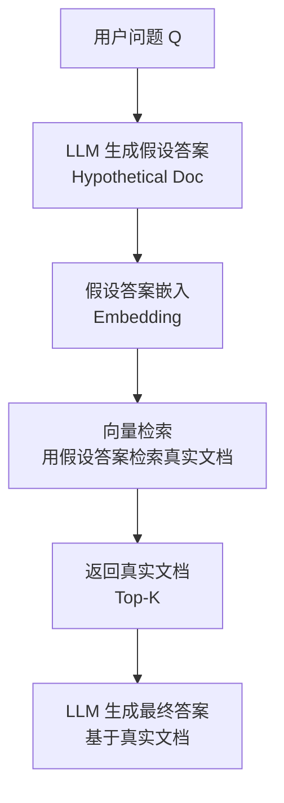

关键步骤：
1. **生成假设文档**：用 LLM 根据问题生成一段假设性答案（无需准确，只需语义相关）
2. **假设文档嵌入**：将假设答案编码为向量
3. **向量检索**：用假设答案的向量去检索真实文档（而非用原始问题检索）
4. **生成最终答案**：基于检索到的真实文档生成最终回答

### 完整示例代码

### 导入与全局配置

```python
"""
HyDE - 假设文档嵌入检索
依赖：pip install openai numpy
"""

import os
import numpy as np
from openai import OpenAI

# 初始化 OpenAI 客户端
client = OpenAI(
    api_key=os.environ.get("OPENAI_API_KEY", "your-api-key"),
    base_url=os.environ.get("OPENAI_BASE_URL", None),
)
```

### 向量存储类实现

```python
class SimpleVectorStore:
    """简单的内存向量存储"""

    def __init__(self):
        self.documents: list[str] = []
        self.embeddings: list[list[float]] = []

    def add_documents(self, docs: list[str]):
        for doc in docs:
            self.documents.append(doc)
            embedding = self._get_embedding(doc)
            self.embeddings.append(embedding)

    def search_by_embedding(self, query_embedding: list[float], top_k: int = 3) -> list[dict]:
        """直接用嵌入向量检索"""
        similarities = []
        for i, emb in enumerate(self.embeddings):
            sim = self._cosine_similarity(query_embedding, emb)
            similarities.append((i, sim))
        similarities.sort(key=lambda x: x[1], reverse=True)
        results = []
        for idx, score in similarities[:top_k]:
            results.append({"content": self.documents[idx], "score": round(score, 4)})
        return results

    def _get_embedding(self, text: str) -> list[float]:
        response = client.embeddings.create(
            model="text-embedding-3-small",
            input=text,
        )
        return response.data[0].embedding

    @staticmethod
    def _cosine_similarity(a: list[float], b: list[float]) -> float:
        a_arr = np.array(a)
        b_arr = np.array(b)
        return float(np.dot(a_arr, b_arr) / (np.linalg.norm(a_arr) * np.linalg.norm(b_arr)))
```

### HyDERetriever — 假设文档生成与检索

```python
class HyDERetriever:
    """
    HyDE 检索器
    - generate_hypothetical_document: 用 LLM 生成假设答案
    - retrieve: 用假设答案的嵌入检索真实文档
    """

    def __init__(self, vector_store: SimpleVectorStore):
        self.store = vector_store

    def generate_hypothetical_document(self, query: str) -> str:
        """用 LLM 根据问题生成假设性答案文档"""
        prompt = f"""请为以下问题生成一段假设性的答案文档（约100-200字）。
不需要准确，但要包含可能相关的关键词和概念，以便用于语义检索。

问题：{query}

假设性答案文档："""

        response = client.chat.completions.create(
            model="gpt-4o",
            messages=[{"role": "user", "content": prompt}],
            temperature=0.7,  # 较高温度增加多样性
        )
        return response.choices[0].message.content

    def retrieve(self, query: str, top_k: int = 3, verbose: bool = False) -> list[dict]:
        """HyDE 检索：生成假设文档 → 嵌入 → 检索真实文档"""
        # 步骤1：生成假设性答案
        hyp_doc = self.generate_hypothetical_document(query)
        if verbose:
            print(f"[假设文档]\n{hyp_doc[:200]}...")

        # 步骤2：对假设文档进行嵌入
        hyp_embedding = self.store._get_embedding(hyp_doc)

        # 步骤3：用假设文档的嵌入检索真实文档
        results = self.store.search_by_embedding(hyp_embedding, top_k=top_k)
        if verbose:
            print(f"[检索结果] 找到 {len(results)} 个文档")
            for i, r in enumerate(results):
                print(f"  文档{i+1} (相似度: {r['score']}): {r['content'][:80]}...")
        return results

    def answer(self, query: str, top_k: int = 3, verbose: bool = True) -> str:
        """完整的 HyDE 问答流程"""
        if verbose:
            print(f"\n{'='*60}")
            print(f"用户问题: {query}")
            print(f"{'='*60}")

        # HyDE 检索
        retrieved_docs = self.retrieve(query, top_k=top_k, verbose=verbose)

        # 生成最终回答
        context = "\n\n".join(
            [f"[文档{i+1}] {d['content']}" for i, d in enumerate(retrieved_docs)]
        )
        prompt = f"""你是一个知识助手。请根据以下检索到的文档回答用户问题。

--- 检索文档 ---
{context}
--- 文档结束 ---

用户问题：{query}

请回答："""
        response = client.chat.completions.create(
            model="gpt-4o",
            messages=[
                {"role": "system", "content": "你是一个严谨的知识助手。"},
                {"role": "user", "content": prompt},
            ],
            temperature=0.3,
        )
        answer = response.choices[0].message.content
        if verbose:
            print(f"[最终回答] {answer}")
        return answer
```

### 主流程与演示

```python
# ============================================================
# 运行演示
# ============================================================
if __name__ == "__main__":
    docs = [
        "Python 是一种解释型、面向对象的高级编程语言，由 Guido van Rossum 于 1991 年首次发布。",
        "Python 3.12 引入了更友好的错误提示信息、新的类型参数语法，并提升了整体性能。",
        "Python 的 GIL（全局解释器锁）限制了同一时刻只有一个线程执行 Python 字节码。",
        "FastAPI 是一个现代、高性能的 Python Web 框架，支持异步处理和自动 API 文档生成。",
        "Django 是一个全栈 Python Web 框架，遵循 MTV 架构模式，内置 ORM、管理后台和认证系统。",
        "机器学习库 scikit-learn 提供了大量分类、回归和聚类算法，是 Python 数据科学生态的核心组件。",
    ]

    print("正在构建向量存储...")
    store = SimpleVectorStore()
    store.add_documents(docs)

    hyde = HyDERetriever(store)

    # HyDE 通过假设文档提升检索精度
    hyde.answer("Python 语言的并发性能有什么限制？", verbose=True)
```

---

## 3.8 Self-Ask — 自问自答式检索

### 概念说明

Self-Ask 由 Press et al. 于 2022 年提出（arXiv:2210.03350），核心思想是：**将复杂问题分解为一系列子问题，逐个检索答案，最终合成完整答案**。它类似于思维链（Chain-of-Thought），但每一步推理都可以触发外部检索。

**类比理解**：假设有人问你"2022年世界杯冠军队的主教练之前执教过哪些国家队？"——你不会直接回答，而是先问自己"2022年世界杯冠军是谁？"→ 检索得到"阿根廷"→ 再问"阿根廷队的主教练是谁？"→ 检索得到"斯卡洛尼"→ 再问"斯卡洛尼之前执教过哪些国家队？"→ 检索得到答案。Self-Ask 就是模拟这种"自问自答 + 逐步检索"的过程。

Self-Ask 特别适合**多跳推理问题**（multi-hop reasoning），即需要串联多个事实才能回答的复杂问题。

### 核心流程/原理

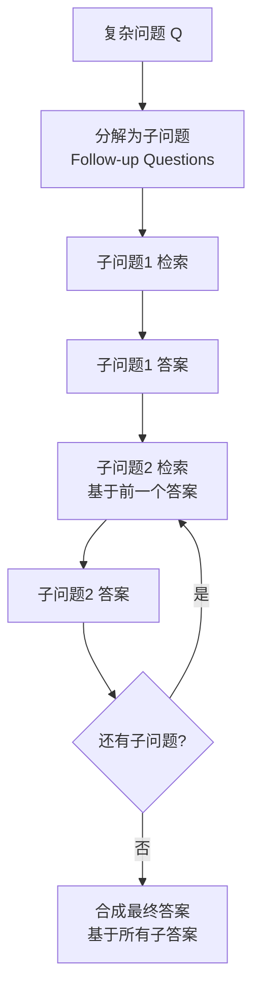

关键步骤：
1. **问题分解**：LLM 将复杂问题分解为子问题链（follow-up questions）
2. **逐个检索**：对每个子问题执行检索，获取答案
3. **上下文累积**：每个子问题的答案作为后续推理的上下文
4. **最终合成**：基于所有子问题的答案合成最终回答

### 完整示例代码

### 导入与全局配置

```python
"""
Self-Ask - 自问自答式检索增强生成
依赖：pip install openai numpy
"""

import os
import json
import re
import numpy as np
from openai import OpenAI

# 初始化 OpenAI 客户端
client = OpenAI(
    api_key=os.environ.get("OPENAI_API_KEY", "your-api-key"),
    base_url=os.environ.get("OPENAI_BASE_URL", None),
)
```

### 向量存储类实现

```python
class SimpleVectorStore:
    """简单的内存向量存储"""

    def __init__(self):
        self.documents: list[str] = []
        self.embeddings: list[list[float]] = []

    def add_documents(self, docs: list[str]):
        for doc in docs:
            self.documents.append(doc)
            embedding = self._get_embedding(doc)
            self.embeddings.append(embedding)

    def search(self, query: str, top_k: int = 2) -> list[dict]:
        query_embedding = self._get_embedding(query)
        similarities = []
        for i, emb in enumerate(self.embeddings):
            sim = self._cosine_similarity(query_embedding, emb)
            similarities.append((i, sim))
        similarities.sort(key=lambda x: x[1], reverse=True)
        results = []
        for idx, score in similarities[:top_k]:
            results.append({"content": self.documents[idx], "score": round(score, 4)})
        return results

    def _get_embedding(self, text: str) -> list[float]:
        response = client.embeddings.create(
            model="text-embedding-3-small",
            input=text,
        )
        return response.data[0].embedding

    @staticmethod
    def _cosine_similarity(a: list[float], b: list[float]) -> float:
        a_arr = np.array(a)
        b_arr = np.array(b)
        return float(np.dot(a_arr, b_arr) / (np.linalg.norm(a_arr) * np.linalg.norm(b_arr)))
```

### SelfAskAgent — 问题分解与逐个检索

```python
class SelfAskAgent:
    """
    Self-Ask Agent：自问自答式检索
    - decompose_question: 将复杂问题分解为子问题链
    - answer_with_retrieval: 逐个检索子问题并合成答案
    """

    MAX_FOLLOWUPS = 5

    def __init__(self, vector_store: SimpleVectorStore):
        self.store = vector_store

    def decompose_question(self, query: str) -> list[str]:
        """将复杂问题分解为子问题链"""
        prompt = f"""请将以下复杂问题分解为一系列可以逐步检索回答的子问题。
子问题应该有先后依赖关系（前一个的答案有助于回答后一个）。

复杂问题：{query}

请用 JSON 格式回复，包含字段 "follow_ups"，是一个字符串数组，按顺序列出子问题。
如果问题本身很简单不需要分解，返回空数组。

仅输出 JSON："""

        response = client.chat.completions.create(
            model="gpt-4o",
            messages=[{"role": "user", "content": prompt}],
            temperature=0,
            response_format={"type": "json_object"},
        )
        data = json.loads(response.choices[0].message.content or "{}")
        return data.get("follow_ups", [])

    def _retrieve_and_answer_subquestion(
        self, sub_q: str, context: str
    ) -> str:
        """检索并回答单个子问题"""
        # 检索相关文档
        results = self.store.search(sub_q, top_k=2)
        docs_text = "\n".join([r["content"] for r in results])

        # 基于检索结果和已有上下文回答子问题
        prompt = f"""请根据以下检索到的文档和已有上下文，回答子问题。
如果文档中没有相关信息，请基于你的知识给出最佳猜测。

已有上下文：
{context}

检索文档：
{docs_text}

子问题：{sub_q}

简短回答："""
        response = client.chat.completions.create(
            model="gpt-4o",
            messages=[{"role": "user", "content": prompt}],
            temperature=0.3,
        )
        return response.choices[0].message.content

    def answer_with_retrieval(self, query: str, verbose: bool = True) -> str:
        """逐个检索子问题并合成最终答案"""
        if verbose:
            print(f"\n{'='*60}")
            print(f"用户问题: {query}")
            print(f"{'='*60}")

        # 步骤1：分解问题
        follow_ups = self.decompose_question(query)
        if verbose:
            print(f"[问题分解] 分解为 {len(follow_ups)} 个子问题:")
            for i, sq in enumerate(follow_ups):
                print(f"  子问题{i+1}: {sq}")

        # 如果无需分解，直接检索回答
        if not follow_ups:
            results = self.store.search(query, top_k=3)
            docs_text = "\n\n".join([r["content"] for r in results])
            prompt = f"""根据以下文档回答问题：

文档：
{docs_text}

问题：{query}

回答："""
            response = client.chat.completions.create(
                model="gpt-4o",
                messages=[{"role": "user", "content": prompt}],
                temperature=0.3,
            )
            return response.choices[0].message.content

        # 步骤2：逐个检索回答子问题
        context_parts = []
        for i, sub_q in enumerate(follow_ups[: self.MAX_FOLLOWUPS]):
            if verbose:
                print(f"\n--- 处理子问题{i+1}: {sub_q} ---")
            context = "\n".join(context_parts)
            sub_answer = self._retrieve_and_answer_subquestion(sub_q, context)
            context_parts.append(f"问: {sub_q}\n答: {sub_answer}")
            if verbose:
                print(f"[子答案] {sub_answer}")

        # 步骤3：合成最终答案
        all_context = "\n\n".join(context_parts)
        prompt = f"""你是一个知识助手。以下是通过自问自答收集到的子问题和答案，
请基于它们合成对原始问题的完整回答。

--- 子问答记录 ---
{all_context}
--- 记录结束 ---

原始问题：{query}

完整回答："""
        response = client.chat.completions.create(
            model="gpt-4o",
            messages=[
                {"role": "system", "content": "你是一个严谨的知识助手。"},
                {"role": "user", "content": prompt},
            ],
            temperature=0.3,
        )
        final_answer = response.choices[0].message.content
        if verbose:
            print(f"\n[最终回答] {final_answer}")
        return final_answer
```

### 主流程与演示

```python
# ============================================================
# 运行演示
# ============================================================
if __name__ == "__main__":
    docs = [
        "Python 由 Guido van Rossum 创建，于 1991 年首次发布。",
        "Guido van Rossum 是荷兰程序员，曾在 Google 和 Dropbox 工作。",
        "Python 3.12 引入了更友好的错误提示信息和新的类型参数语法。",
        "FastAPI 是基于 Python 的 Web 框架，由 Sebastián Ramírez 开发。",
        "Sebastián Ramírez 也是 Pydantic 的核心贡献者之一。",
        "Pydantic 是 Python 的数据验证库，FastAPI 底层依赖它。",
    ]

    print("正在构建向量存储...")
    store = SimpleVectorStore()
    store.add_documents(docs)

    agent = SelfAskAgent(store)

    # 多跳推理问题：需要串联多个事实
    agent.answer_with_retrieval(
        "FastAPI 底层依赖的数据验证库的核心贡献者是谁？",
        verbose=True,
    )
```

---

## 3.9 FLARE — 前瞻式主动检索

### 概念说明

FLARE（Forward-Looking Active REtrieval）由 Jiang et al. 于 2023 年提出（arXiv:2305.06983），核心思想是：**在生成过程中动态触发检索**。与"先检索后生成"的传统 RAG 不同，FLARE 是"边生成边检索"——当模型对即将生成的内容置信度低时（表现为下一个 token 的 logprob 低），自动用已生成的内容作为查询发起检索，然后继续生成。

**类比理解**：传统 RAG 像是考试前先翻一遍参考书，然后闭卷答题；FLARE 像是开卷考试——你边答题边翻书，遇到不确定的地方就查阅资料，查完继续写。这种"按需查阅"的方式避免了不必要的检索，同时确保了不确定之处有据可依。

OpenAI Chat Completions API 自 2023 年起已支持 `logprobs=True` 参数返回每个输出 token 的对数概率，可用于真实的置信度检测。为简化示例依赖，本示例用**生成内容是否包含不确定性词汇**（如"我不知道"、"可能"、"不确定"等）来模拟置信度检测；生产环境建议使用 `logprobs=True, top_logprobs=1` 获取真实的 token 级置信度。

### 核心流程/原理

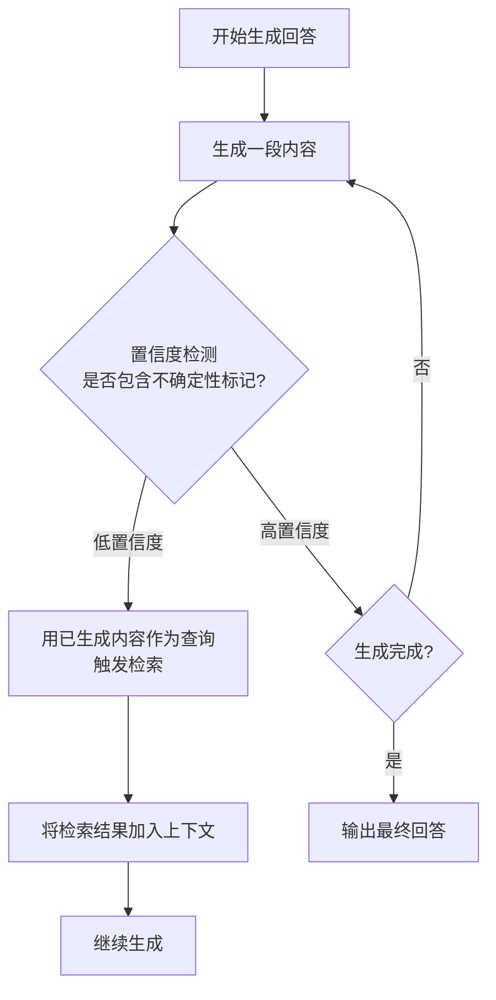

关键步骤：
1. **开始生成**：模型基于问题开始生成回答
2. **置信度检测**：检查生成内容是否包含不确定性标记（如"我不知道"、"可能"等）
3. **触发检索**：低置信度时，用已生成内容作为查询检索相关文档
4. **注入上下文**：将检索结果加入 Prompt 上下文
5. **继续生成**：基于增强后的上下文继续生成，直到完成

### 完整示例代码

### 导入与全局配置

```python
"""
FLARE - 前瞻式主动检索增强生成
依赖：pip install openai numpy
"""

import os
import numpy as np
from openai import OpenAI

# 初始化 OpenAI 客户端
client = OpenAI(
    api_key=os.environ.get("OPENAI_API_KEY", "your-api-key"),
    base_url=os.environ.get("OPENAI_BASE_URL", None),
)
```

### 向量存储类实现

```python
class SimpleVectorStore:
    """简单的内存向量存储"""

    def __init__(self):
        self.documents: list[str] = []
        self.embeddings: list[list[float]] = []

    def add_documents(self, docs: list[str]):
        for doc in docs:
            self.documents.append(doc)
            embedding = self._get_embedding(doc)
            self.embeddings.append(embedding)

    def search(self, query: str, top_k: int = 2) -> list[dict]:
        query_embedding = self._get_embedding(query)
        similarities = []
        for i, emb in enumerate(self.embeddings):
            sim = self._cosine_similarity(query_embedding, emb)
            similarities.append((i, sim))
        similarities.sort(key=lambda x: x[1], reverse=True)
        results = []
        for idx, score in similarities[:top_k]:
            results.append({"content": self.documents[idx], "score": round(score, 4)})
        return results

    def _get_embedding(self, text: str) -> list[float]:
        response = client.embeddings.create(
            model="text-embedding-3-small",
            input=text,
        )
        return response.data[0].embedding

    @staticmethod
    def _cosine_similarity(a: list[float], b: list[float]) -> float:
        a_arr = np.array(a)
        b_arr = np.array(b)
        return float(np.dot(a_arr, b_arr) / (np.linalg.norm(a_arr) * np.linalg.norm(b_arr)))
```

### FLAREAgent — 带置信度检查的生成

```python
class FLAREAgent:
    """
    FLARE Agent：前瞻式主动检索
    - should_retrieve: 判断生成内容是否需要触发检索（模拟置信度检测）
    - generate_with_confidence_check: 带置信度检查的迭代生成
    """

    # 不确定性标记词汇（模拟低 logprob 置信度）
    UNCERTAINTY_MARKERS = [
        "我不知道", "不确定", "可能", "也许", "大概",
        "似乎", "不清楚", "无法确定", "猜测", "应该",
        "I don't know", "maybe", "perhaps", "uncertain",
    ]

    MAX_ITERATIONS = 5

    def __init__(self, vector_store: SimpleVectorStore):
        self.store = vector_store

    def should_retrieve(self, generated_text: str) -> tuple[bool, str]:
        """
        判断是否需要触发检索
        通过检测生成内容是否包含不确定性词汇来模拟置信度检测
        返回 (是否需要检索, 触发的标记词)
        """
        for marker in self.UNCERTAINTY_MARKERS:
            if marker in generated_text:
                return True, marker
        return False, ""

    def generate_with_confidence_check(self, query: str, verbose: bool = True) -> str:
        """带置信度检查的迭代生成"""
        if verbose:
            print(f"\n{'='*60}")
            print(f"用户问题: {query}")
            print(f"{'='*60}")

        # 已收集的检索文档
        retrieved_context = ""
        # 已生成的内容
        generated_so_far = ""

        for iteration in range(1, self.MAX_ITERATIONS + 1):
            if verbose:
                print(f"\n--- 生成轮次 {iteration} ---")

            # 构建生成 Prompt
            context_section = f"\n\n参考文档：\n{retrieved_context}" if retrieved_context else ""
            continuation = f"\n\n已生成内容：\n{generated_so_far}" if generated_so_far else ""

            prompt = f"""请回答用户问题。{context_section}{continuation}

用户问题：{query}

请继续/开始回答（如果不确定，请直接说明）："""

            response = client.chat.completions.create(
                model="gpt-4o",
                messages=[
                    {"role": "system", "content": "你是一个知识助手。"},
                    {"role": "user", "content": prompt},
                ],
                temperature=0.3,
            )
            new_content = response.choices[0].message.content
            generated_so_far += "\n" + new_content if generated_so_far else new_content

            if verbose:
                print(f"[生成内容]\n{new_content[:200]}...")

            # 置信度检测
            need_retrieve, marker = self.should_retrieve(new_content)

            if not need_retrieve:
                if verbose:
                    print("[置信度检测] 高置信度，无需检索，生成完成")
                break

            if verbose:
                print(f"[置信度检测] 低置信度（检测到'{marker}'），触发检索")

            # 用已生成内容作为查询检索文档
            # 取最后一句作为查询（前瞻式）
            search_query = generated_so_far[-200:] if len(generated_so_far) > 200 else generated_so_far
            results = self.store.search(search_query, top_k=2)

            if results:
                new_docs = "\n\n".join([r["content"] for r in results])
                retrieved_context += "\n" + new_docs
                if verbose:
                    print(f"[检索结果]\n{new_docs[:200]}...")
            else:
                if verbose:
                    print("[检索结果] 未找到相关文档")
                break

        if verbose:
            print(f"\n[最终回答]\n{generated_so_far}")
        return generated_so_far
```

### 主流程与演示

```python
# ============================================================
# 运行演示
# ============================================================
if __name__ == "__main__":
    docs = [
        "Python 由 Guido van Rossum 创建，于 1991 年首次发布。",
        "Python 3.12 引入了更友好的错误提示信息和新的类型参数语法。",
        "Python 的 GIL 限制了同一时刻只有一个线程执行 Python 字节码。",
        "FastAPI 是一个现代、高性能的 Python Web 框架，支持异步处理。",
        "Django 是一个全栈 Python Web 框架，遵循 MTV 架构模式。",
        "asyncio 是 Python 的标准异步 I/O 库，提供事件循环和协程。",
    ]

    print("正在构建向量存储...")
    store = SimpleVectorStore()
    store.add_documents(docs)

    flare = FLAREAgent(store)

    # 当模型不确定时会自动触发检索
    flare.generate_with_confidence_check(
        "Python 的异步编程机制是怎样的？和 FastAPI 有什么关系？",
        verbose=True,
    )
```

---

## 3.10 Speculative RAG（推测式 RAG）

### 概念说明

Speculative RAG 由 Wang et al. 于 2024 年提出（arXiv:2407.08223），是一种以**降低生成延迟**为目标的 RAG 模式。它的核心思想是采用 **draft-verify（草稿-验证）双模型架构**：让一个小模型（drafter）快速生成草稿答案，再由大模型（verifier）验证并修正，从而在保持回答质量的同时显著缩短响应时间。

**与 Self-RAG / CRAG 的区别**：Self-RAG 和 CRAG 关注的是"检索质量"——前者通过自反思决定何时检索、过滤不相关文档，后者通过评估器纠正低质量检索结果；而 Speculative RAG 关注的是"生成延迟"——它不改变检索逻辑，而是通过小模型并行生成多个子答案草稿来降低延迟，再由大模型验证保证质量。三者解决的是不同维度的问题。

**工作流程**：
1. **知识分解与路由**：大模型（verifier）先对用户问题和检索文档进行分析，将问题分解为多个子任务，并为每个子任务路由分配最相关的文档；
2. **并行草稿生成**：多个小模型（drafter）实例并行处理各个子任务，快速生成多个子答案草稿；
3. **验证与合成**：大模型（verifier）验证所有草稿的准确性，修正错误，合成为最终答案。

**优势**：
- **显著降低延迟**：小模型推理快且并行执行，草稿生成阶段耗时接近单次小模型调用；
- **保持质量**：大模型最终验证合成，确保答案准确性和连贯性；
- **适合实时场景**：在延迟敏感的应用中兼顾速度与质量。

**适用场景**：实时问答、低延迟要求的客服场景、需要快速响应的在线助手等。

### 核心流程/原理

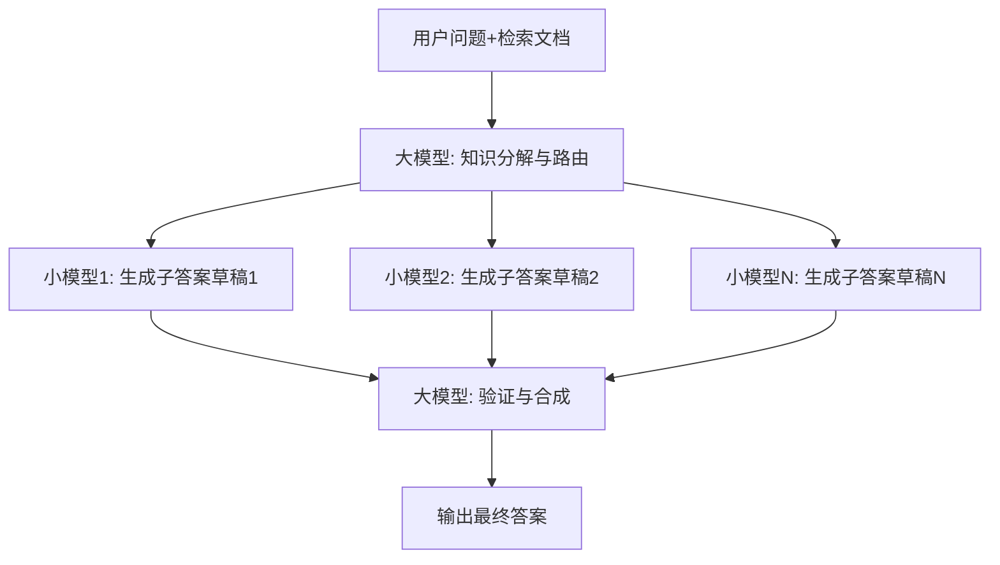

关键步骤：
1. **检索文档**：使用向量检索获取与用户问题相关的文档（复用 Standard RAG 的检索逻辑）
2. **知识分解与路由**：大模型将问题分解为 N 个子任务，每个子任务分配最相关的文档子集
3. **并行草稿生成**：N 个小模型实例并行生成子答案草稿（使用线程池并发执行）
4. **验证与合成**：大模型验证所有草稿，修正错误并合成为最终答案

### 完整示例代码

### 导入与全局配置

```python
"""
Speculative RAG - 推测式检索增强生成
依赖：pip install openai numpy
"""

import os
import json
import numpy as np
from concurrent.futures import ThreadPoolExecutor
from openai import OpenAI

# 初始化 OpenAI 客户端
client = OpenAI(
    api_key=os.environ.get("OPENAI_API_KEY", "your-api-key-here"),
    base_url=os.environ.get("OPENAI_BASE_URL", None),
)
```

### 向量存储类实现

```python
class SimpleVectorStore:
    """简单的内存向量存储（同 Standard RAG）"""

    def __init__(self):
        self.documents: list[str] = []
        self.embeddings: list[list[float]] = []

    def add_documents(self, docs: list[str]):
        for doc in docs:
            self.documents.append(doc)
            embedding = self._get_embedding(doc)
            self.embeddings.append(embedding)

    def search(self, query: str, top_k: int = 3) -> list[dict]:
        query_embedding = self._get_embedding(query)
        similarities = []
        for i, emb in enumerate(self.embeddings):
            sim = self._cosine_similarity(query_embedding, emb)
            similarities.append((i, sim))
        similarities.sort(key=lambda x: x[1], reverse=True)
        results = []
        for idx, score in similarities[:top_k]:
            results.append({"content": self.documents[idx], "score": round(score, 4)})
        return results

    def _get_embedding(self, text: str) -> list[float]:
        response = client.embeddings.create(
            model="text-embedding-3-small",
            input=text,
        )
        return response.data[0].embedding

    @staticmethod
    def _cosine_similarity(a: list[float], b: list[float]) -> float:
        a_arr = np.array(a)
        b_arr = np.array(b)
        return float(np.dot(a_arr, b_arr) / (np.linalg.norm(a_arr) * np.linalg.norm(b_arr)))
```

### SpeculativeRAG 核心类 - 初始化与知识分解

```python
class SpeculativeRAG:
    """
    Speculative RAG：draft-verify 双模型架构

    - drafter（小模型 gpt-4o-mini）：并行生成多个子答案草稿，延迟低
    - verifier（大模型 gpt-4o）：知识分解与路由 + 验证合成最终答案，保证质量

    流程：
    1. 检索文档
    2. verifier 知识分解与路由 → 多个子任务
    3. drafter 并行生成子答案草稿
    4. verifier 验证并合成最终答案
    """

    def __init__(self, vector_store: SimpleVectorStore,
                 drafter_model: str = "gpt-4o-mini",
                 verifier_model: str = "gpt-4o",
                 num_drafts: int = 3):
        self.store = vector_store
        self.drafter_model = drafter_model
        self.verifier_model = verifier_model
        self.num_drafts = num_drafts

    def _decompose_and_route(self, query: str, docs: list[dict]) -> list[dict]:
        """
        步骤1：大模型知识分解与路由
        将问题和检索文档分解为多个子任务，每个子任务分配最相关的文档
        """
        doc_list = "\n".join(
            [f"[文档{i+1}] {d['content']}" for i, d in enumerate(docs)]
        )
        prompt = f"""你是一个知识分解器。请将以下问题和检索文档分解为 {self.num_drafts} 个子任务，
每个子任务聚焦问题的不同方面，并分配最相关的文档编号（从1开始）。

用户问题：{query}

检索文档：
{doc_list}

请用 JSON 格式回复，包含字段 "subtasks"，是一个数组，每个元素形如：
{{"sub_question": "子问题", "assigned_docs": [文档编号列表]}}

仅输出 JSON："""

        response = client.chat.completions.create(
            model=self.verifier_model,
            messages=[{"role": "user", "content": prompt}],
            temperature=0,
            response_format={"type": "json_object"},
        )
        data = json.loads(response.choices[0].message.content or "{}")
        return data.get("subtasks", [])
```

### SpeculativeRAG - 小模型并行草稿生成

```python
    def _draft_sub_answer(self, sub_question: str, assigned_docs: list[dict]) -> str:
        """
        步骤2（单线程版）：小模型根据子问题和分配的文档生成草稿答案
        """
        doc_text = "\n\n".join([d["content"] for d in assigned_docs])
        prompt = f"""请根据以下文档回答子问题，给出简洁的草稿答案。

文档：
{doc_text}

子问题：{sub_question}

草稿答案："""

        response = client.chat.completions.create(
            model=self.drafter_model,
            messages=[{"role": "user", "content": prompt}],
            temperature=0.3,
        )
        return response.choices[0].message.content

    def _draft_in_parallel(self, subtasks: list[dict], all_docs: list[dict]) -> list[dict]:
        """
        步骤2（并行版）：使用 ThreadPoolExecutor 并行生成多个子答案草稿
        多个小模型实例同时工作，延迟接近单次小模型调用
        """
        def _work(subtask):
            assigned_indices = subtask.get("assigned_docs", [])
            # 文档编号从1开始，转换为0索引
            assigned_docs = [
                all_docs[i - 1] for i in assigned_indices if 1 <= i <= len(all_docs)
            ]
            if not assigned_docs:
                assigned_docs = all_docs  # fallback：使用全部文档
            draft = self._draft_sub_answer(subtask["sub_question"], assigned_docs)
            return {
                "sub_question": subtask["sub_question"],
                "draft": draft,
            }

        drafts = []
        with ThreadPoolExecutor(max_workers=self.num_drafts) as executor:
            futures = [executor.submit(_work, st) for st in subtasks]
            for future in futures:
                drafts.append(future.result())
        return drafts
```

### SpeculativeRAG - 大模型验证与合成

```python
    def _verify_and_synthesize(self, query: str, drafts: list[dict]) -> str:
        """
        步骤3：大模型验证并合成最终答案
        验证各草稿的准确性，修正错误，合成为连贯的最终答案
        """
        drafts_text = "\n\n".join([
            f"[草稿{i+1}] 子问题: {d['sub_question']}\n答案: {d['draft']}"
            for i, d in enumerate(drafts)
        ])
        prompt = f"""你是一个严谨的知识助手。以下是小模型并行生成的多个子答案草稿。
请验证这些草稿的准确性，修正其中的错误，并合成为一个完整、连贯的最终答案。

用户问题：{query}

--- 子答案草稿 ---
{drafts_text}
--- 草稿结束 ---

请给出验证后的最终答案："""

        response = client.chat.completions.create(
            model=self.verifier_model,
            messages=[
                {"role": "system", "content": "你是一个严谨的知识助手，请验证并合成最终答案。"},
                {"role": "user", "content": prompt},
            ],
            temperature=0.3,
        )
        return response.choices[0].message.content
```

### SpeculativeRAG - 完整回答流程

```python
    def answer(self, query: str, top_k: int = 5, verbose: bool = True) -> str:
        """执行 Speculative RAG 完整流程"""

        if verbose:
            print(f"\n{'='*60}")
            print(f"用户问题: {query}")
            print(f"{'='*60}")

        # 步骤0：检索文档
        retrieved_docs = self.store.search(query, top_k=top_k)
        if verbose:
            print(f"[检索] 检索到 {len(retrieved_docs)} 个文档")

        # 步骤1：大模型知识分解与路由
        if verbose:
            print(f"\n--- 步骤1：大模型知识分解与路由 ---")
        subtasks = self._decompose_and_route(query, retrieved_docs)
        if verbose:
            print(f"[分解] 分解为 {len(subtasks)} 个子任务:")
            for i, st in enumerate(subtasks):
                print(f"  子任务{i+1}: {st.get('sub_question', '')} | 文档: {st.get('assigned_docs', [])}")

        if not subtasks:
            # fallback：分解失败时直接用 verifier 回答
            if verbose:
                print("[fallback] 分解失败，直接由大模型回答")
            context = "\n\n".join([d["content"] for d in retrieved_docs])
            response = client.chat.completions.create(
                model=self.verifier_model,
                messages=[
                    {"role": "system", "content": "你是一个知识助手。"},
                    {"role": "user", "content": f"文档：\n{context}\n\n问题：{query}\n\n回答："},
                ],
                temperature=0.3,
            )
            return response.choices[0].message.content

        # 步骤2：小模型并行生成草稿
        if verbose:
            print(f"\n--- 步骤2：小模型并行生成草稿 ---")
        drafts = self._draft_in_parallel(subtasks, retrieved_docs)
        if verbose:
            for i, d in enumerate(drafts):
                print(f"  [草稿{i+1}] {d['sub_question']}")
                print(f"    {d['draft'][:100]}...")

        # 步骤3：大模型验证与合成
        if verbose:
            print(f"\n--- 步骤3：大模型验证与合成 ---")
        final_answer = self._verify_and_synthesize(query, drafts)
        if verbose:
            print(f"[最终回答] {final_answer}")
        return final_answer
```

### 主流程与演示

```python
# ============================================================
# 运行演示
# ============================================================
if __name__ == "__main__":
    docs = [
        "Python 是一种解释型、面向对象的高级编程语言，由 Guido van Rossum 于 1991 年首次发布。",
        "Python 3.12 引入了更友好的错误提示信息、新的类型参数语法，并提升了整体性能。",
        "Python 的 GIL（全局解释器锁）限制了同一时刻只有一个线程执行 Python 字节码。",
        "FastAPI 是一个现代、高性能的 Python Web 框架，支持异步处理和自动 API 文档生成。",
        "Django 是一个全栈 Python Web 框架，遵循 MTV 架构模式，内置 ORM、管理后台和认证系统。",
        "机器学习库 scikit-learn 提供了大量分类、回归和聚类算法，是 Python 数据科学生态的核心组件。",
        "asyncio 是 Python 的标准异步 I/O 库，提供了事件循环、协程和 Future 对象。",
        "Python 3.11 相比 3.10 提升了 10%-60% 的性能，主要归功于 Faster CPython 项目。",
    ]

    print("正在构建向量存储...")
    store = SimpleVectorStore()
    store.add_documents(docs)

    speculative_rag = SpeculativeRAG(store, num_drafts=3)

    # 综合性问题：可分解为多个子任务，并行生成草稿后由大模型合成
    speculative_rag.answer(
        "Python 语言的性能表现如何？异步编程和 Web 框架生态分别是什么情况？",
        verbose=True,
    )
```

### 代码要点说明

| 方法 | 对应阶段 | 模型 | 说明 |
|------|---------|------|------|
| `_decompose_and_route` | 知识分解与路由 | verifier（大模型） | 将问题和检索文档分解为 N 个子任务，为每个子任务路由分配最相关的文档 |
| `_draft_sub_answer` | 草稿生成（单次） | drafter（小模型） | 根据子问题和分配的文档生成单个子答案草稿，速度快 |
| `_draft_in_parallel` | 草稿生成（并行） | drafter（小模型） | 使用 `ThreadPoolExecutor` 并行调度多个 drafter，延迟接近单次小模型调用 |
| `_verify_and_synthesize` | 验证与合成 | verifier（大模型） | 验证所有草稿的准确性，修正错误，合成为连贯的最终答案 |
| `answer` | 完整流程编排 | 双模型协同 | 检索 → 分解路由 → 并行草稿 → 验证合成，串联整个 draft-verify 流程 |

---

## 3.11 Adaptive RAG（自适应 RAG）

### 概念说明

**Adaptive RAG（自适应 RAG）** 由 Jeong et al. 于 2024 年提出（arXiv:2403.14403），是一种根据**查询复杂度**动态选择检索策略的 RAG 模式。其核心思想是：**不同复杂度的问题需要不同的检索策略**——简单问题无需检索（避免引入噪音和延迟），中等问题只需单步检索即可解决，而复杂的多跳推理问题则需要多步迭代检索。

传统 RAG 对所有问题"一视同仁"地执行检索，这带来两个问题：一是对简单问题（如"你好"、"1+1=?"）的检索是浪费，甚至可能因检索到不相关文档而误导模型；二是对复杂的多跳问题（如"2024 年诺贝尔文学奖得主的母校在哪里？"）单次检索又不够，需要先检索"诺贝尔文学奖得主"，再检索其母校。

Adaptive RAG 通过一个**查询复杂度分类器**（通常用小模型或规则实现）将查询分为三档：
- **简单（Simple）**：无需检索，直接由 LLM 用自身知识回答（A 档）。
- **中等（Moderate）**：执行单步检索，即 Standard RAG 流程（B 档）。
- **复杂（Complex）**：执行多步迭代检索，类似 Self-Ask / IRCoT 的多跳推理（C 档）。

**与 Self-RAG / Active RAG 的区别**：Self-RAG 在生成过程中动态决定是否检索（token 级别的反思标签），粒度更细但依赖训练过的反思能力；Active RAG 在生成中检测"知识缺口"并按需补充检索，是生成过程中的渐进式检索；Adaptive RAG 则在**检索前**就根据查询复杂度选择策略，是"入口处"的路由决策，更轻量、更易部署。

**类比理解**：就像图书馆的咨询台——简单的常识问题，馆员直接回答；需要查资料的问题，馆员去书架找一本书；复杂的研究问题，馆员会多次往返书架、交叉查阅多本书后再综合回答。

### 核心流程/原理

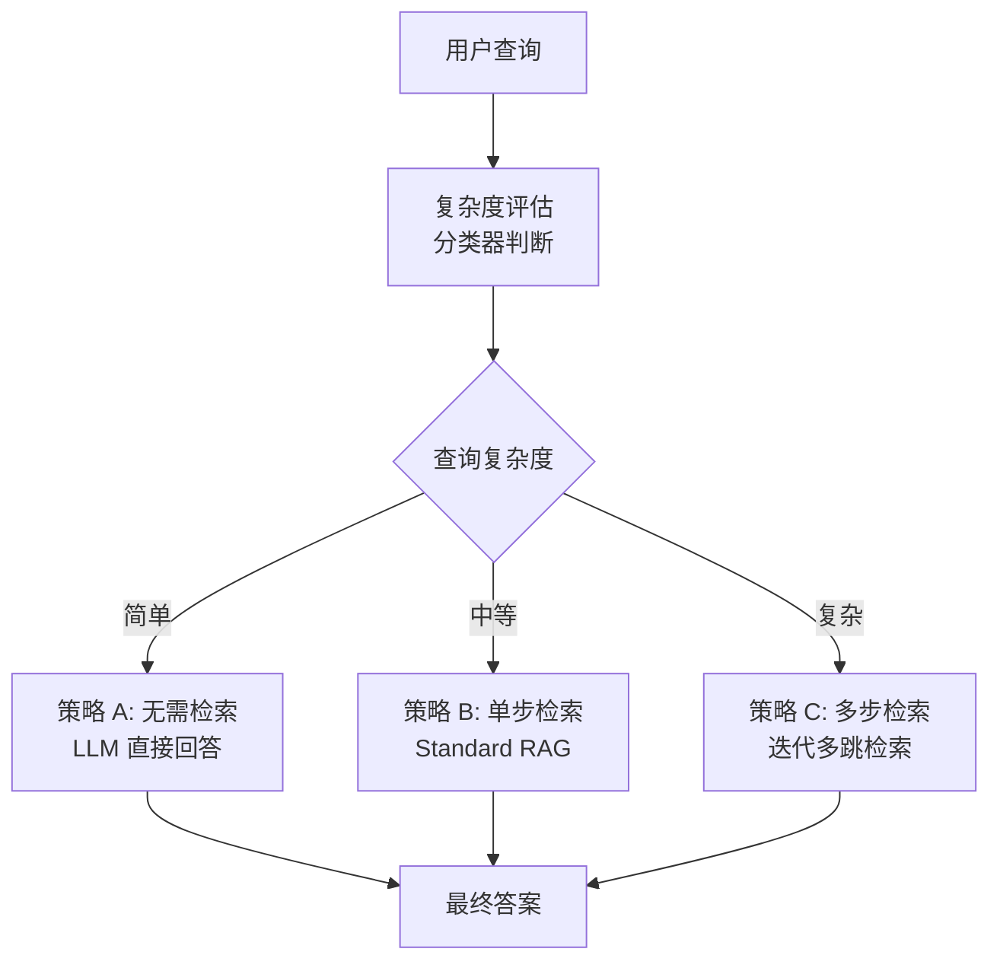

关键步骤：
1. **复杂度分类**：用小模型（如 gpt-4o-mini）或规则分类器判断查询属于简单/中等/复杂
2. **策略路由**：根据分类结果选择对应的检索策略
3. **策略执行**：
   - 简单 → 直接 LLM 生成（no retrieval）
   - 中等 → 单次向量检索 + LLM 生成（single-step）
   - 复杂 → 多次迭代检索 + 推理（multi-step，类似 Self-Ask）
4. **统一输出**：无论走哪条路径，最终都输出自然语言答案

### 完整示例代码

### 导入与全局配置

```python
"""
Adaptive RAG - 自适应检索增强生成
根据查询复杂度选择检索策略：no retrieval / single-step / multi-step
论文: arXiv:2403.14403
依赖：pip install openai numpy
"""

import os
import json
import numpy as np
from openai import OpenAI

# 初始化 OpenAI 客户端
client = OpenAI(
    api_key=os.environ.get("OPENAI_API_KEY", "your-api-key-here"),
    base_url=os.environ.get("OPENAI_BASE_URL", None),
)
```

### 向量存储类实现

```python
class SimpleVectorStore:
    """简单的内存向量存储（同 Standard RAG）"""

    def __init__(self):
        self.documents: list[str] = []
        self.embeddings: list[list[float]] = []

    def add_documents(self, docs: list[str]):
        for doc in docs:
            self.documents.append(doc)
            embedding = self._get_embedding(doc)
            self.embeddings.append(embedding)

    def search(self, query: str, top_k: int = 3) -> list[dict]:
        query_embedding = self._get_embedding(query)
        similarities = []
        for i, emb in enumerate(self.embeddings):
            sim = self._cosine_similarity(query_embedding, emb)
            similarities.append((i, sim))
        similarities.sort(key=lambda x: x[1], reverse=True)
        results = []
        for idx, score in similarities[:top_k]:
            results.append({"content": self.documents[idx], "score": round(score, 4)})
        return results

    def _get_embedding(self, text: str) -> list[float]:
        response = client.embeddings.create(
            model="text-embedding-3-small",
            input=text,
        )
        return response.data[0].embedding

    @staticmethod
    def _cosine_similarity(a: list[float], b: list[float]) -> float:
        a_arr = np.array(a)
        b_arr = np.array(b)
        return float(np.dot(a_arr, b_arr) / (np.linalg.norm(a_arr) * np.linalg.norm(b_arr) + 1e-8))
```

### AdaptiveRAG 类：复杂度分类与单步检索

```python
class AdaptiveRAG:
    """自适应 RAG：根据查询复杂度选择检索策略"""

    def __init__(self, vector_store: SimpleVectorStore,
                 classifier_model: str = "gpt-4o-mini",
                 generator_model: str = "gpt-4o-mini"):
        self.store = vector_store
        self.classifier_model = classifier_model
        self.generator_model = generator_model

    def _chat(self, model: str, prompt: str, temperature: float = 0.0) -> str:
        """统一的 LLM 调用封装"""
        response = client.chat.completions.create(
            model=model,
            messages=[{"role": "user", "content": prompt}],
            temperature=temperature,
        )
        return (response.choices[0].message.content or "").strip()

    def classify_query_complexity(self, query: str) -> str:
        """Step 1: 评估查询复杂度，返回 simple / moderate / complex"""
        prompt = f"""请判断以下查询的复杂度，将其分为三类之一：

- simple: 简单问题，无需外部检索即可回答。如常识、寒暄、简单计算、定义查询。
- moderate: 中等问题，需要单次检索外部资料即可回答。如事实查询、单一文档问答。
- complex: 复杂问题，需要多步推理或多跳检索才能回答。如多跳推理、对比分析、综合报告。

查询：{query}

请只输出一个单词（simple / moderate / complex），不要其他内容。"""
        raw = self._chat(self.classifier_model, prompt, temperature=0.0).strip().lower()
        # 容错：提取第一个匹配的标签
        for label in ("simple", "moderate", "complex"):
            if label in raw:
                return label
        return "moderate"  # 默认走中等策略

    def retrieve_single_step(self, query: str, top_k: int = 3) -> list[dict]:
        """策略 B: 单步检索——Standard RAG 的检索流程"""
        return self.store.search(query, top_k=top_k)
```

### AdaptiveRAG 类：多步检索与答案生成

```python
    def retrieve_multi_step(self, query: str, max_steps: int = 3) -> list[dict]:
        """策略 C: 多步迭代检索——类似 Self-Ask 的多跳检索
        每步：分解子问题 → 检索 → 用检索结果推进推理 → 决定是否继续"""
        all_results = []
        # Step 1: 让模型将复杂问题分解为子问题序列
        decompose_prompt = f"""请将以下复杂查询分解为 {max_steps} 个可顺序回答的子问题。
后面的子问题可能依赖前面子问题的答案。以 JSON 字符串数组输出，只输出 JSON。

查询：{query}

示例：["子问题1", "子问题2", "子问题3"]"""
        raw = self._chat(self.generator_model, decompose_prompt, temperature=0.0)
        try:
            sub_questions = json.loads(raw)
            if not isinstance(sub_questions, list):
                sub_questions = [query]
        except json.JSONDecodeError:
            sub_questions = [query]

        # Step 2: 依次对每个子问题检索，累积上下文
        accumulated_context = ""
        for i, sq in enumerate(sub_questions[:max_steps]):
            # 将累积上下文融入子问题，便于检索后续依赖信息
            search_query = f"{sq} {accumulated_context}" if accumulated_context else sq
            results = self.store.search(search_query, top_k=2)
            all_results.extend(results)
            for r in results:
                accumulated_context += f" {r['content']}"
        return all_results

    def answer(self, query: str, verbose: bool = False) -> str:
        """Adaptive RAG 主流程：分类 → 路由 → 检索（按需）→ 生成"""
        # Step 1: 复杂度分类
        complexity = self.classify_query_complexity(query)
        if verbose:
            print(f"[复杂度分类] {query} → {complexity}")

        # Step 2: 根据复杂度选择检索策略
        context_docs = []
        if complexity == "simple":
            if verbose:
                print("[策略] A: 无需检索，直接回答")
        elif complexity == "moderate":
            if verbose:
                print("[策略] B: 单步检索")
            context_docs = self.retrieve_single_step(query)
        else:  # complex
            if verbose:
                print("[策略] C: 多步迭代检索")
            context_docs = self.retrieve_multi_step(query)

        # Step 3: 生成答案
        context_text = "\n\n".join(
            f"[文档{i+1}] {r['content']}" for i, r in enumerate(context_docs)
        ) if context_docs else "（无检索文档，基于模型自身知识回答）"

        prompt = f"""请基于以下上下文回答问题。如果上下文为空或无关，可基于自身知识回答。

【上下文】
{context_text}

【问题】
{query}

【回答】"""
        final_answer = self._chat(self.generator_model, prompt, temperature=0.3)

        if verbose:
            print(f"\n[最终答案]\n{final_answer}")
        return final_answer
```

### 主流程与演示

```python
if __name__ == "__main__":
    # 构建示例知识库
    docs = [
        "Python 是一种解释型、高级编程语言，由 Guido van Rossum 于 1991 年发布。",
        "Python 3.12 引入了性能改进和新的语法特性，如更快的 CPython 解释器。",
        "NumPy 是 Python 的科学计算库，提供多维数组对象和数学函数。",
        "Pandas 基于 NumPy 构建，提供 DataFrame 数据结构，适合数据分析。",
        "FastAPI 是现代的 Python Web 框架，基于 Starlette 和 Pydantic，支持异步。",
        "Django 是全栈 Python Web 框架，内置 ORM、Admin 和认证系统。",
        "TensorFlow 由 Google 开发，PyTorch 由 Meta 开发，二者是主流深度学习框架。",
        "GIL（全局解释器锁）是 CPython 的机制，限制多线程并行执行 Python 字节码。",
    ]

    print("正在构建向量存储...")
    store = SimpleVectorStore()
    store.add_documents(docs)

    adaptive_rag = AdaptiveRAG(store)

    # 测试三种复杂度的查询
    queries = [
        "你好，今天天气怎么样？",                                    # simple
        "Python 是什么时候发布的？是谁创造的？",                     # moderate
        "对比 FastAPI 和 Django 两个 Web 框架，并说明它们各自适合的场景。",  # complex
    ]

    for q in queries:
        print(f"\n{'='*60}")
        print(f"查询: {q}")
        print("=" * 60)
        adaptive_rag.answer(q, verbose=True)
```

### 代码要点说明

| 方法 | 对应阶段 | 作用说明 |
|------|----------|----------|
| `classify_query_complexity` | 复杂度评估 | 用小模型将查询分为 simple/moderate/complex 三档，是路由决策的入口 |
| `retrieve_single_step` | 策略 B 单步检索 | 对应 Standard RAG 的检索流程，一次向量检索 Top-K 文档 |
| `retrieve_multi_step` | 策略 C 多步检索 | 先分解子问题，再依次检索并累积上下文，对应多跳推理 |
| `answer` | 主流程编排 | 分类 → 路由 → 检索（按需）→ 生成，simple 走 no retrieval 分支 |

**关键设计提醒**：
- **分类器用小模型即可**：`classify_query_complexity` 使用 gpt-4o-mini，复杂度分类是轻量任务，无需大模型，降低路由成本。
- **默认策略是 moderate**：当分类器输出无法解析时，默认走单步检索（Standard RAG），这是最稳妥的兜底策略。
- **多步检索的上下文累积**：`retrieve_multi_step` 在每步检索后将结果累积到 `accumulated_context`，并融入下一步的检索查询，使后续检索能利用前序信息（多跳推理的关键）。

---

## 3.12 LightRAG — "轻量图谱检索"

> **原理**：LightRAG 是 GraphRAG 的轻量化替代方案（arXiv:2410.05779，港大 2024）。GraphRAG 构建全量实体关系图成本高昂，LightRAG 通过"双层检索"（实体级 + 关系级）和增量更新机制，在保持图谱推理能力的同时大幅降低构建和查询成本。支持 low-level（精确实体匹配）和 high-level（主题概括）两种检索模式。

| 属性 | 内容 |
|------|------|
| **核心思想** | 轻量级知识图谱 + 双层检索 + 增量更新 |
| **与 GraphRAG 区别** | GraphRAG 全量构建成本高、无增量更新；LightRAG 轻量、支持增量 |
| **检索模式** | low-level（精确实体匹配）+ high-level（主题概括检索） |
| **适用场景** | 中小规模知识库、需要图谱推理但预算有限、频繁更新知识库 |
| **局限性** | 图谱质量不如 GraphRAG 全面；对超大规模知识库仍需优化 |

#### 核心流程

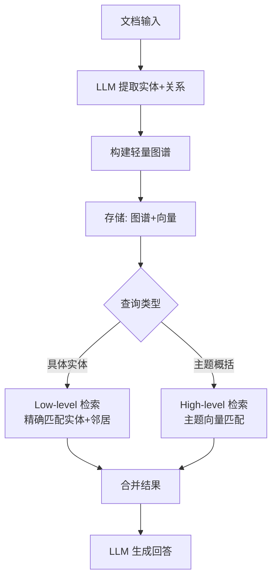

#### 代码示例：简化版 LightRAG

```python
from openai import OpenAI
import os
import json
from collections import defaultdict

client = OpenAI(
    base_url=os.environ.get("OPENAI_BASE_URL"),
    api_key=os.environ.get("OPENAI_API_KEY"),
)

class LightRAG:
    """简化版 LightRAG：轻量图谱 + 双层检索
    
    核心改进（vs GraphRAG）：
    1. 双层检索：low-level（实体匹配）+ high-level（主题匹配）
    2. 增量更新：新文档可追加，无需重建全图
    3. 轻量构建：只提取关键实体和关系，不做全量分析
    """
    
    def __init__(self, model: str = "gpt-4o-mini"):
        self.model = model
        self.entities = {}  # entity_name -> {id, description, relationships}
        self.relationships = []  # [{src, tgt, description}]
        self.chunks = []  # 原始文本块
    
    def _extract_entities_relations(self, text: str) -> dict:
        """用 LLM 从文本中提取实体和关系"""
        prompt = f"""从以下文本中提取关键实体和它们之间的关系。

文本：
{text[:2000]}

返回 JSON：
{{
  "entities": [{{"name": "实体名", "description": "简短描述"}}],
  "relationships": [{{"src": "实体A", "tgt": "实体B", "description": "关系描述"}}]
}}

注意：
- 只提取重要实体（人名、地名、组织、概念等）
- 关系描述简洁明了
- 最多提取 10 个实体和 10 个关系
"""
        response = client.chat.completions.create(
            model=self.model,
            messages=[{"role": "user", "content": prompt}],
            response_format={"type": "json_object"}
        )
        
        try:
            return json.loads(response.choices[0].message.content or "{}")
        except (json.JSONDecodeError, TypeError):
            return {"entities": [], "relationships": []}
    
    def insert(self, text: str) -> None:
        """增量插入文档：提取实体关系并更新图谱"""
        chunk_id = len(self.chunks)
        self.chunks.append(text)
        
        result = self._extract_entities_relations(text)
        
        # 增量更新实体（已存在则更新描述）
        for ent in result.get("entities", []):
            name = ent["name"]
            if name not in self.entities:
                self.entities[name] = {
                    "id": len(self.entities),
                    "description": ent["description"],
                    "chunks": [chunk_id]
                }
            else:
                self.entities[name]["description"] += "; " + ent["description"]
                self.entities[name]["chunks"].append(chunk_id)
        
        # 增量更新关系
        for rel in result.get("relationships", []):
            self.relationships.append({
                "src": rel["src"],
                "tgt": rel["tgt"],
                "description": rel["description"],
                "chunk_id": chunk_id
            })
    
    def retrieve_low_level(self, query: str, top_k: int = 5) -> list[str]:
        """Low-level 检索：精确匹配实体+邻居关系"""
        # 从查询中识别实体（简化版：直接匹配）
        query_lower = query.lower()
        matched_entities = [
            name for name in self.entities
            if name.lower() in query_lower or query_lower in name.lower()
        ]
        
        # 收集相关文本块
        chunk_ids = set()
        for ent_name in matched_entities:
            chunk_ids.update(self.entities[ent_name]["chunks"])
        
        # 扩展：通过关系找邻居
        for rel in self.relationships:
            if rel["src"] in matched_entities or rel["tgt"] in matched_entities:
                chunk_ids.add(rel["chunk_id"])
        
        return [self.chunks[i] for i in sorted(chunk_ids)[:top_k]]
    
    def retrieve_high_level(self, query: str, top_k: int = 5) -> list[str]:
        """High-level 检索：按主题/关键词匹配"""
        # 简化版：按关键词匹配实体描述
        query_words = set(query.lower().split())
        scored = []
        
        for name, info in self.entities.items():
            desc_words = set(info["description"].lower().split())
            score = len(query_words & desc_words) / max(len(query_words | desc_words), 1)
            scored.append((score, info["chunks"][0]))
        
        scored.sort(reverse=True)
        return [self.chunks[i] for _, i in scored[:top_k]]
    
    def query(self, question: str, mode: str = "hybrid") -> str:
        """查询：支持 low-level / high-level / hybrid"""
        if mode == "low":
            contexts = self.retrieve_low_level(question)
        elif mode == "high":
            contexts = self.retrieve_high_level(question)
        else:  # hybrid
            contexts = self.retrieve_low_level(question, top_k=3)
            contexts += self.retrieve_high_level(question, top_k=3)
            # 去重
            seen = set()
            contexts = [c for c in contexts if not (c in seen or seen.add(c))]
            contexts = contexts[:5]
        
        context_text = "\n\n".join(contexts)
        
        response = client.chat.completions.create(
            model=self.model,
            messages=[
                {"role": "system", "content": "基于以下检索到的上下文回答问题。"},
                {"role": "user", "content": f"上下文：\n{context_text}\n\n问题：{question}"}
            ]
        )
        return (response.choices[0].message.content or "")


# 使用示例
if __name__ == "__main__":
    rag = LightRAG(model="gpt-4o-mini")
    
    # 增量插入文档
    rag.insert("OpenAI 于 2025 年 8 月发布 GPT-5，内置推理能力，无需切换推理模式。")
    rag.insert("Anthropic 于 2025 年 5 月发布 Claude 4 Opus，支持 extended thinking。")
    rag.insert("GPT-5 的 reasoning.effort 参数可选 minimal/low/medium/high。")
    
    # Low-level 检索（精确实体匹配）
    print("Low-level:", rag.query("GPT-5 有什么特点？", mode="low"))
    
    # High-level 检索（主题概括）
    print("High-level:", rag.query("2025年有哪些新模型？", mode="high"))
    
    # Hybrid 检索
    print("Hybrid:", rag.query("推理模型的发展趋势？", mode="hybrid"))
```

#### 代码要点说明

| 要点 | 说明 |
|------|------|
| **增量更新** | `insert()` 支持追加新文档，无需重建全图 |
| **双层检索** | low-level 精确实体匹配 + high-level 主题向量匹配 |
| **hybrid 模式** | 合并两层检索结果，去重后送 LLM |
| **轻量构建** | 只提取关键实体和关系，不做 GraphRAG 的全量社区检测 |
| **存储后端** | 示例用内存；生产环境用 NetworkX+PostgreSQL 或 Neo4j |

#### LightRAG vs GraphRAG 对比

| 维度 | LightRAG | GraphRAG |
|------|----------|----------|
| **构建成本** | 低（只提取关键实体关系） | 高（全量分析+社区检测） |
| **增量更新** | ✅ 支持 | ❌ 需重建 |
| **检索模式** | 双层（low+high） | 单层（社区概括） |
| **适用规模** | 中小规模 | 大规模 |
| **查询成本** | 低 | 高 |

#### 参考资源

- [LightRAG 论文](https://arxiv.org/abs/2504.19413) — 2024.10，港大
- [LightRAG GitHub](https://github.com/HKUDS/LightRAG) — 开源实现

---

以上 6 种模式（3.6-3.11）是 2022-2024 年的重要 RAG 扩展，弥补了基础 RAG 在全局性问题、检索精度、复杂问题分解、动态检索、生成延迟和自适应检索策略方面的不足。

---

## 总结对比表

| 模式 | 检索时机 | 检索次数 | 质量保障机制 | 核心优势 | 适用场景 | 计算成本 |
|------|---------|---------|-------------|---------|---------|---------|
| **Standard RAG** | 每次提问 | 1次 | 依赖检索系统质量 | 实现简单、延迟低 | 事实问答、文档问答 | ★☆☆☆☆ |
| **Self-RAG** | 模型自主判断 | 0~1次 | ISREL + ISSUP + ISUSE 三维反思 + 自反思循环 | 按需检索、自动过滤噪音、改写优化 | 需要可控检索的场景 | ★★★☆☆ |
| **Corrective RAG** | 每次提问 | 1~2次 | 检索评估器 + 纠正机制 | 检索失败可自修复 | 检索质量不稳定的场景 | ★★★☆☆ |
| **RAISE** | 推理过程中动态决定 | 0~多次 | ReAct 多步推理 + 逐步验证 | 深度推理、跨文档整合 | 复杂多步推理问题 | ★★★★★ |
| **Active RAG** | 渐进式按需 | 2~多次 | 缺口检测 + 定向补充 | 答案逐步完善、覆盖全面 | 开放性问题、研究报告 | ★★★★☆ |
| **GraphRAG** | 离线建图 + 查询时检索 | 1次（局部/全局） | 知识图谱 + 社区摘要 | 支持全局性问题、关系推理 | 全局主题分析、关系网络 | ★★★★☆ |
| **HyDE** | 每次提问 | 1次 | 假设文档嵌入匹配 | 检索精度高、语义匹配好 | 问答与文档语义差距大的场景 | ★★☆☆☆ |
| **Self-Ask** | 子问题驱动 | 多次（每子问题1次） | 问题分解 + 逐步验证 | 多跳推理、复杂问题分解 | 多跳推理、链式事实查询 | ★★★☆☆ |
| **FLARE** | 生成中动态触发 | 0~多次 | 置信度检测 + 动态检索 | 按需检索、边生成边查 | 长文本生成、知识密集型生成 | ★★★☆☆ |
| **Speculative RAG** | 每次提问 | 1次 | 双模型 draft-verify 架构 | 小模型并行草稿+大模型验证，低延迟 | 实时问答、低延迟客服场景 | ★★★☆☆ |
| **Adaptive RAG** | 按复杂度路由 | 0~多次 | 复杂度分类器 + 策略路由 | 按需选择 no/single/multi 检索策略 | 混合复杂度查询场景 | ★★☆☆☆ |
| **LightRAG** | 查询时检索 | 1次（双层） | 知识图谱 + 实体关系 + 双层检索 | 轻量图谱、增量更新、兼顾局部与全局 | 中小规模图谱问答、关系推理 | ★★★☆☆ |

### 选型建议

1. **Standard RAG**：如果你的场景是标准 QA、知识库相对集中、对延迟有要求，这是首选。实现最简单，对大多数应用已足够。

2. **Self-RAG**：当你需要控制检索成本、希望系统能"聪明地"选择是否检索时使用。其自反思循环（Retrieve → Critique → Generate → Paraphrase）通过 ISREL、ISSUP、ISUSE 三维反思和改写优化，确保生成质量。尤其适合混合场景——有些问题依赖外部知识，有些模型自己就能回答。

3. **Corrective RAG**：当你的知识库质量参差不齐、或检索系统不够成熟时使用。它能自动发现并修复检索失败的情况，提升系统鲁棒性。

4. **RAISE**：当你的问题需要多步推理、跨文档关联分析时使用。例如"对比 A 和 B 的技术路线"、"分析 X 现象的三层原因"等需要综合多维度信息的场景。

5. **Active RAG**：当回答的完整性很重要、且你允许稍长的响应时间时使用。适合生成研究报告、技术综述、尽职调查摘要等需要全面覆盖的内容。

6. **Speculative RAG**：当对延迟敏感且需要保持质量时使用。通过小模型并行生成草稿、大模型验证合成，在实时问答、在线客服等场景中兼顾速度与质量。

7. **Adaptive RAG**：当查询复杂度差异显著时使用。通过复杂度分类器在检索前路由到 no retrieval / single-step / multi-step 三种策略，简单问题避免无谓检索，复杂问题充分多跳检索，适合混合复杂度的查询场景。

8. **LightRAG**：当你需要知识图谱的全局视图但 GraphRAG 构建成本过高时使用。LightRAG 通过轻量级图谱构建和双层检索（低层实体+高层关系），在兼顾局部与全局查询的同时支持增量更新，适合中小规模知识库的关系推理和图谱问答场景。

> **注意**：上述示例代码中的向量检索部分使用了真实 OpenAI Embedding API（`text-embedding-3-small`），实际运行会产生 API 费用。在生产环境中，建议使用本地 Embedding 模型（如 `sentence-transformers`）或专用向量数据库（如 Chroma、Milvus、Pinecone）以降低成本和提升性能。