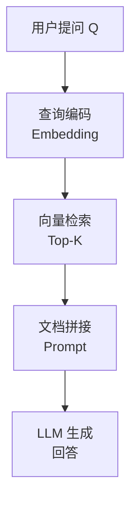
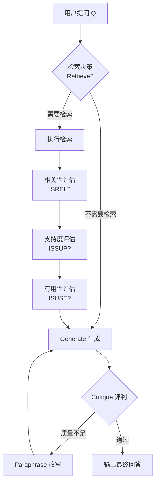
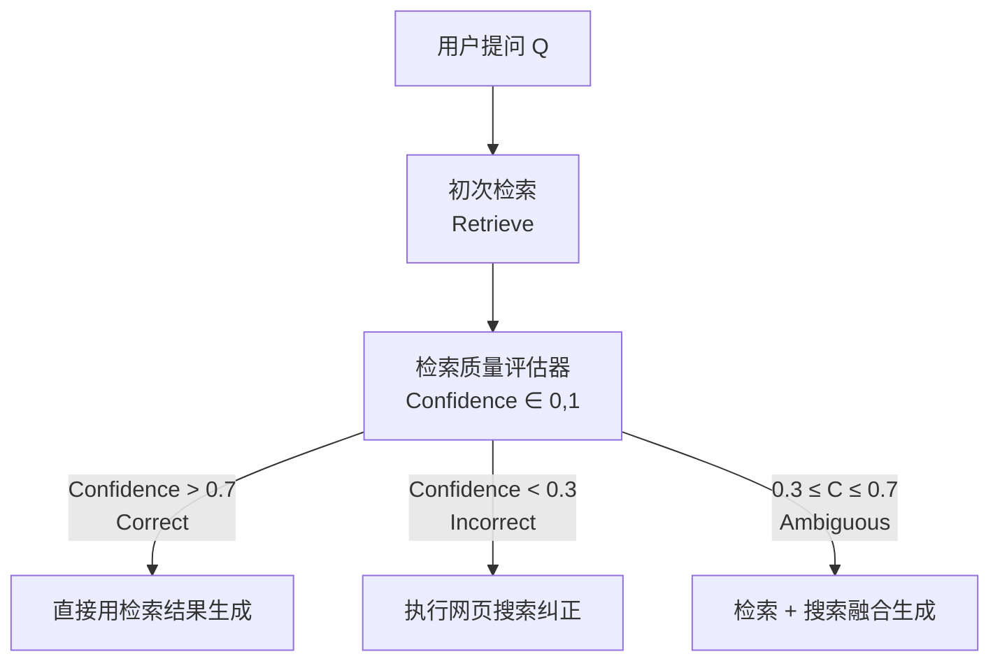
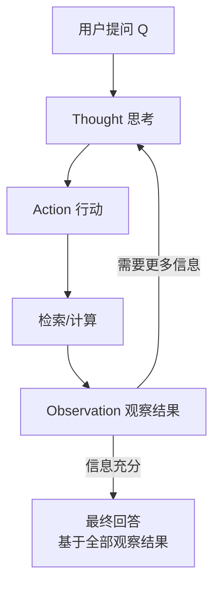
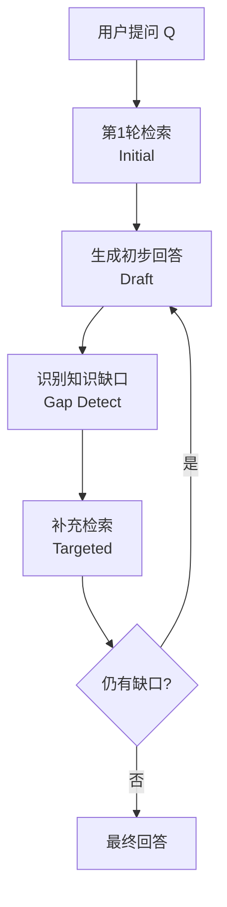

# 三、检索增强类(RAG) Agent 设计模式

检索增强生成（Retrieval-Augmented Generation，RAG）是一类将**信息检索**与**大语言模型生成**相结合的设计模式。其核心思想是：LLM 的知识受限于训练数据截止时间，通过动态检索外部知识库（文档、数据库、网页等），将相关信息注入 Prompt 上下文，使模型能够生成更准确、更及时、更可溯源的回答。

RAG 类 Agent 设计模式关注的核心问题是：**何时检索**、**检索什么**、**如何利用检索结果**。本章将深入探讨五种主流的 RAG 设计模式。

---

## 3.1 Standard RAG（标准 RAG）

### 概念说明

Standard RAG 是最基础的检索增强生成模式，由 Lewis et al. 于 2020 年提出。它遵循一条固定的流水线：**用户提问 → 向量检索 → 文档拼接 → LLM 生成**。每次用户提问时，系统都会自动执行检索，将检索到的相关文档片段作为上下文注入 Prompt，然后由 LLM 基于这些上下文生成回答。

Standard RAG 的核心优势在于**实现简单、成本可控**，适用于大多数需要注入外部知识的问题回答场景。其缺点也很明显：检索始终执行（即使模型自身已知答案），且检索质量直接影响最终回答质量，对不相关或误导性文档缺乏防御机制。

### 核心流程/原理



关键步骤：
1. **Embedding**：将用户问题编码为向量
2. **Retrieve**：在向量数据库中检索 Top-K 个最相似的文档块
3. **Augment**：将检索到的文档内容与用户问题拼接成一个增强 Prompt
4. **Generate**：LLM 根据增强 Prompt 生成最终回答

### 完整示例代码

### 导入与全局配置

```python
"""
Standard RAG - 标准检索增强生成
依赖：pip install openai numpy
"""

import os
import numpy as np
from openai import OpenAI

# ============================================================
# 初始化 OpenAI 客户端（请替换为你的 API Key）
# ============================================================
client = OpenAI(
    api_key=os.environ.get("OPENAI_API_KEY", "your-api-key-here"),
    base_url=os.environ.get("OPENAI_BASE_URL", None),
)
```

### 向量存储类实现

```python
# ============================================================
# 模拟向量检索器
# ============================================================
class SimpleVectorStore:
    """简单的内存向量存储，使用 OpenAI Embedding 计算相似度"""

    def __init__(self):
        self.documents: list[str] = []
        self.embeddings: list[list[float]] = []

    def add_documents(self, docs: list[str]):
        """将文档列表编码为向量并存储"""
        for doc in docs:
            self.documents.append(doc)
            embedding = self._get_embedding(doc)
            self.embeddings.append(embedding)

    def search(self, query: str, top_k: int = 3) -> list[dict]:
        """检索与查询最相似的 top_k 个文档"""
        query_embedding = self._get_embedding(query)
        similarities = []
        for i, emb in enumerate(self.embeddings):
            sim = self._cosine_similarity(query_embedding, emb)
            similarities.append((i, sim))
        similarities.sort(key=lambda x: x[1], reverse=True)

        results = []
        for idx, score in similarities[:top_k]:
            results.append({
                "content": self.documents[idx],
                "score": round(score, 4),
            })
        return results

    def _get_embedding(self, text: str) -> list[float]:
        """调用 OpenAI Embedding API 获取文本向量"""
        response = client.embeddings.create(
            model="text-embedding-3-small",
            input=text,
        )
        return response.data[0].embedding

    @staticmethod
    def _cosine_similarity(a: list[float], b: list[float]) -> float:
        """计算余弦相似度"""
        a_arr = np.array(a)
        b_arr = np.array(b)
        return float(np.dot(a_arr, b_arr) / (np.linalg.norm(a_arr) * np.linalg.norm(b_arr)))
```

### 核心 RAG 类实现

```python
# ============================================================
# Standard RAG 执行器
# ============================================================
class StandardRAG:
    """标准 RAG：检索 → 增强 → 生成"""

    def __init__(self, vector_store: SimpleVectorStore):
        self.store = vector_store

    def answer(self, query: str, top_k: int = 3) -> str:
        """回答用户问题"""
        # 步骤1：检索相关文档
        retrieved_docs = self.store.search(query, top_k=top_k)

        # 步骤2：构建增强 Prompt
        context_parts = []
        for i, doc in enumerate(retrieved_docs):
            context_parts.append(f"[文档{i+1}] (相似度: {doc['score']})\n{doc['content']}")
        context = "\n\n".join(context_parts)

        augmented_prompt = f"""你是一个知识助手。请根据以下检索到的文档内容回答用户的问题。
如果文档中没有相关信息，请诚实地说"根据已有资料无法回答"。

--- 检索到的文档 ---
{context}
--- 文档结束 ---

用户问题：{query}

请回答："""

        # 步骤3：调用 LLM 生成回答
        response = client.chat.completions.create(
            model="gpt-4o-mini",
            messages=[
                {"role": "system", "content": "你是一个基于文档的知识助手。"},
                {"role": "user", "content": augmented_prompt},
            ],
            temperature=0.3,
        )
        return response.choices[0].message.content
```

### 主流程与演示

```python
# ============================================================
# 运行演示
# ============================================================
if __name__ == "__main__":
    # 准备知识库文档
    docs = [
        "Python 是一种解释型、面向对象的高级编程语言，由 Guido van Rossum 于 1991 年首次发布。",
        "Python 3.12 引入了更友好的错误提示信息、新的类型参数语法，并提升了整体性能。",
        "Python 的 GIL（全局解释器锁）限制了同一时刻只有一个线程执行 Python 字节码。",
        "FastAPI 是一个现代、高性能的 Python Web 框架，支持异步处理和自动 API 文档生成。",
        "Django 是一个全栈 Python Web 框架，遵循 MTV 架构模式，内置 ORM、管理后台和认证系统。",
        "机器学习库 scikit-learn 提供了大量分类、回归和聚类算法，是 Python 数据科学生态的核心组件。",
        "OpenAI 于 2023 年发布了 GPT-4，具备多模态能力，支持文本和图像输入。",
    ]

    # 构建向量存储
    print("正在构建向量存储，为文档生成 Embedding...")
    store = SimpleVectorStore()
    store.add_documents(docs)

    # 创建 RAG 实例
    rag = StandardRAG(store)

    # 提问
    questions = [
        "Python 是什么时候发布的？是谁创建的？",
        "Python 3.12 有哪些新特性？",
        "Django 和 FastAPI 有什么区别？",
    ]

    for q in questions:
        print(f"\n{'='*60}")
        print(f"用户问题: {q}")
        print(f"{'='*60}")
        answer = rag.answer(q)
        print(f"回答: {answer}")
```

---

## 3.2 Self-RAG（自反思 RAG）

### 概念说明

Self-RAG 是由 Akari Asai et al. 于 2023 年提出的一种增强型 RAG 模式。它的核心创新在于：**模型通过特殊的 Reflection Token 自主决定何时检索、对检索结果进行多维度反思评估，并通过 OverCycle 机制（Retrieve → Critique → Generate → Paraphrase）确保生成质量**。

与传统 RAG 每次无条件检索不同，Self-RAG 使用四类 Reflection Token 贯穿生成过程：
- **`Retrieve`**：检索决策标记，模型自主判断当前是否需要外部知识；
- **`ISREL`**（Is Relevant）：相关性评估，判断检索到的文档片段是否与问题相关；
- **`ISSUP`**（Is Supportive）：支持度评估，判断文档内容是否支撑当前生成的答案；
- **`ISUSE`**（Is Useful）：有用性评估，综合判断文档片段对最终回答的整体效用。

Self-RAG 的 OverCycle 机制包含四种策略，形成闭环反馈：
- **Retrieve（检索）**：根据 `Retrieve` 标记决定是否执行检索，获取相关文档；
- **Critique（评判）**：使用 `ISREL`、`ISSUP`、`ISUSE` 对检索结果进行多维度批判性评估，过滤低质量文档；
- **Generate（生成）**：基于通过 Critique 筛选的高质量文档生成回答；
- **Paraphrase（改写）**：当生成内容不够精炼或存在矛盾时，对输出进行改写优化，提升表达质量与准确性。

Self-RAG 的优势在于：
- **按需检索**：减少不必要的检索开销
- **质量过滤**：自动过滤不相关或不可信的文档
- **可追溯性**：每个生成片段都可以追溯到其引用来源

### 核心流程/原理



### 完整示例代码

### 导入与全局配置

```python
"""
Self-RAG - 自反思检索增强生成
依赖：pip install openai numpy
"""

import os
import numpy as np
from openai import OpenAI

client = OpenAI(
    api_key=os.environ.get("OPENAI_API_KEY", "your-api-key-here"),
    base_url=os.environ.get("OPENAI_BASE_URL", None),
)
```

### 向量存储类实现

```python

class SimpleVectorStore:
    """简单的内存向量存储（同 Standard RAG）"""

    def __init__(self):
        self.documents: list[str] = []
        self.embeddings: list[list[float]] = []

    def add_documents(self, docs: list[str]):
        for doc in docs:
            self.documents.append(doc)
            embedding = self._get_embedding(doc)
            self.embeddings.append(embedding)

    def search(self, query: str, top_k: int = 3) -> list[dict]:
        query_embedding = self._get_embedding(query)
        similarities = []
        for i, emb in enumerate(self.embeddings):
            sim = self._cosine_similarity(query_embedding, emb)
            similarities.append((i, sim))
        similarities.sort(key=lambda x: x[1], reverse=True)
        results = []
        for idx, score in similarities[:top_k]:
            results.append({"content": self.documents[idx], "score": round(score, 4)})
        return results

    def _get_embedding(self, text: str) -> list[float]:
        response = client.embeddings.create(
            model="text-embedding-3-small",
            input=text,
        )
        return response.data[0].embedding

    @staticmethod
    def _cosine_similarity(a: list[float], b: list[float]) -> float:
        a_arr = np.array(a)
        b_arr = np.array(b)
        return float(np.dot(a_arr, b_arr) / (np.linalg.norm(a_arr) * np.linalg.norm(b_arr)))
```

### SelfRAG 核心类 - 初始化与检索决策

```python

class SelfRAG:
    """
    Self-RAG：模型自主决定检索时机，多维度反思评估检索质量

    Reflection Tokens 四类标记：
    - Retrieve：是否需要检索
    - ISREL（Is Relevant）：文档是否与问题相关
    - ISSUP（Is Supportive）：文档是否支持生成的答案
    - ISUSE（Is Useful）：文档对最终回答的整体有用性

    OverCycle 四种策略：
    1. Retrieve  → 检索决策：判断是否需要外部知识，执行检索
    2. Critique  → 批判评估：使用 ISREL/ISSUP/ISUSE 三维度过滤文档
    3. Generate  → 生成回答：基于过滤后的高质量文档生成答案
    4. Paraphrase → 改写优化：当生成质量不足时，改写精炼输出
    """

    def __init__(self, vector_store: SimpleVectorStore):
        self.store = vector_store

    def _should_retrieve(self, query: str) -> tuple[bool, str]:
        """步骤1：检索决策 —— 模型判断是否需要检索"""
        prompt = f"""你需要判断以下用户问题是否需要检索外部知识库来回答。
请用 JSON 格式回复，包含两个字段：
- "need_retrieval": true/false，表示是否需要检索
- "reason": 简要说明原因

问题："{query}"

请判断（仅输出 JSON）："""

        response = client.chat.completions.create(
            model="gpt-4o-mini",
            messages=[{"role": "user", "content": prompt}],
            temperature=0,
            response_format={"type": "json_object"},
        )
        import json
        result = json.loads(response.choices[0].message.content)
        return result.get("need_retrieval", True), result.get("reason", "")
```

### SelfRAG - 文档评估方法

```python

    def _evaluate_relevance(self, query: str, doc: dict) -> tuple[bool, str]:
        """步骤3：相关性评估 ISREL —— 文档是否与问题相关"""
        prompt = f"""请判断以下文档内容是否与用户问题相关。
用 JSON 格式回复：
- "is_relevant": true/false
- "reason": 简要说明

用户问题："{query}"

文档内容："{doc['content']}"

请判断（仅输出 JSON）："""

        response = client.chat.completions.create(
            model="gpt-4o-mini",
            messages=[{"role": "user", "content": prompt}],
            temperature=0,
            response_format={"type": "json_object"},
        )
        import json
        result = json.loads(response.choices[0].message.content)
        return result.get("is_relevant", False), result.get("reason", "")

    def _evaluate_support(self, doc: dict, draft_answer: str) -> tuple[bool, str]:
        """步骤4：支持度评估 ISSUP —— 文档是否支持答案"""
        prompt = f"""请判断以下文档内容是否支持或验证了给定的草稿答案。
用 JSON 格式回复：
- "is_supportive": true/false
- "reason": 简要说明

文档内容："{doc['content']}"

草稿答案："{draft_answer}"

请判断（仅输出 JSON）："""

        response = client.chat.completions.create(
            model="gpt-4o-mini",
            messages=[{"role": "user", "content": prompt}],
            temperature=0,
            response_format={"type": "json_object"},
        )
        import json
        result = json.loads(response.choices[0].message.content)
        return result.get("is_supportive", False), result.get("reason", "")
```

### SelfRAG - 回答流程：检索与相关性过滤

```python

    def answer(self, query: str, top_k: int = 3, verbose: bool = True) -> str:
        """执行 Self-RAG 完整流程"""

        if verbose:
            print(f"\n{'='*60}")
            print(f"用户问题: {query}")
            print(f"{'='*60}")

        # 步骤1：检索决策
        need_retrieval, reason = self._should_retrieve(query)
        if verbose:
            print(f"[检索决策] 需要检索: {need_retrieval} | 原因: {reason}")

        if not need_retrieval:
            # 直接生成回答（模型认为自身知识足够）
            response = client.chat.completions.create(
                model="gpt-4o-mini",
                messages=[
                    {"role": "system", "content": "你是一个知识助手，请直接回答问题。"},
                    {"role": "user", "content": query},
                ],
                temperature=0.3,
            )
            answer = response.choices[0].message.content
            if verbose:
                print(f"[直接回答] {answer}")
            return answer

        # 步骤2：执行检索
        retrieved_docs = self.store.search(query, top_k=top_k)
        if verbose:
            print(f"[检索] 检索到 {len(retrieved_docs)} 个文档")
            for i, d in enumerate(retrieved_docs):
                print(f"  文档{i+1}: {d['content'][:60]}...")

        # 步骤3：相关性评估（ISREL）—— 过滤不相关文档
        relevant_docs = []
        for i, doc in enumerate(retrieved_docs):
            is_rel, rel_reason = self._evaluate_relevance(query, doc)
            if verbose:
                print(f"[ISREL 评估] 文档{i+1}: {'相关' if is_rel else '不相关'} | {rel_reason}")
            if is_rel:
                relevant_docs.append(doc)
```

### SelfRAG - 回答流程：草稿生成与支持度评估

```python

        if not relevant_docs:
            return "根据检索结果，没有找到与您问题相关的资料。"

        # 步骤4：先基于相关文档生成草稿答案
        draft_context = "\n\n".join([d["content"] for d in relevant_docs])
        draft_prompt = f"""根据以下文档生成一个草稿回答：

{', '.join([d["content"] for d in relevant_docs])}

问题：{query}

草稿回答："""

        draft_response = client.chat.completions.create(
            model="gpt-4o-mini",
            messages=[{"role": "user", "content": draft_prompt}],
            temperature=0.3,
        )
        draft_answer = draft_response.choices[0].message.content
        if verbose:
            print(f"[草稿答案] {draft_answer[:100]}...")

        # 步骤5：支持度评估（ISSUP）—— 过滤不支撑草稿答案的文档
        supportive_docs = []
        for i, doc in enumerate(relevant_docs):
            is_sup, sup_reason = self._evaluate_support(doc, draft_answer)
            if verbose:
                print(f"[ISSUP 评估] 文档: {'支持' if is_sup else '不支持'} | {sup_reason}")
            if is_sup:
                supportive_docs.append(doc)

        if not supportive_docs:
            # 如果没有支持文档，至少用相关文档回答
            supportive_docs = relevant_docs
```

### SelfRAG - 回答流程：最终生成

```python

        # 步骤6：生成最终回答
        final_context = "\n\n".join([d["content"] for d in supportive_docs])
        final_prompt = f"""你是一个知识助手。请严格依据以下已验证的文档内容回答用户问题。
请引用具体的文档来源。

--- 已验证的参考文档 ---
{final_context}
--- 文档结束 ---

用户问题：{query}

请回答："""

        final_response = client.chat.completions.create(
            model="gpt-4o-mini",
            messages=[
                {"role": "system", "content": "你是一个严谨的知识助手，请基于验证过的文档回答。"},
                {"role": "user", "content": final_prompt},
            ],
            temperature=0.3,
        )
        final_answer = final_response.choices[0].message.content
        if verbose:
            print(f"[最终回答] {final_answer}")
        return final_answer
```

### 主流程与演示

```python

# ============================================================
# 运行演示
# ============================================================
if __name__ == "__main__":
    docs = [
        "Python 是一种解释型、面向对象的高级编程语言，由 Guido van Rossum 于 1991 年首次发布。",
        "Python 3.12 引入了更友好的错误提示信息、新的类型参数语法，并提升了整体性能。",
        "Python 的 GIL（全局解释器锁）限制了同一时刻只有一个线程执行 Python 字节码。",
        "FastAPI 是一个现代、高性能的 Python Web 框架，支持异步处理和自动 API 文档生成。",
        "Django 是一个全栈 Python Web 框架，遵循 MTV 架构模式，内置 ORM、管理后台和认证系统。",
        "机器学习库 scikit-learn 提供了大量分类、回归和聚类算法，是 Python 数据科学生态的核心组件。",
        "OpenAI 于 2023 年发布了 GPT-4，具备多模态能力，支持文本和图像输入。",
    ]

    print("正在构建向量存储...")
    store = SimpleVectorStore()
    store.add_documents(docs)

    self_rag = SelfRAG(store)

    self_rag.answer("谁创建了 Python 语言？what year？", verbose=True)
    self_rag.answer("Java 是什么？", verbose=True)
```

---

## 3.3 Corrective RAG (CRAG，纠正型 RAG)

### 概念说明

Corrective RAG（CRAG）由 Yan et al. 于 2024 年提出，核心理念是：**检索之后先评估文档质量，根据评估结果选择不同的处理策略**。它不是简单地信任所有检索结果，而是引入了一个"检索评估器"来判断检索到的文档质量。

CRAG 定义了三层处理策略：
- **Correct（正确）**：检索质量高，文档与问题高度相关 → 直接使用已检索文档
- **Incorrect（不正确）**：检索质量差，文档与问题无关 → 执行网页搜索作为补充或纠正
- **Ambiguous（模糊）**：检索质量一般，处于灰色地带 → 结合已检索文档和网页搜索结果

这种"评估-纠正"的机制使 CRAG 在检索失败时有自我修复能力，显著提升了 RAG 系统的鲁棒性。

### 核心流程/原理



### 完整示例代码

### 导入与全局配置

```python
"""
Corrective RAG (CRAG) - 纠正型检索增强生成
依赖：pip install openai numpy
"""

import os
import json
import numpy as np
from openai import OpenAI

client = OpenAI(
    api_key=os.environ.get("OPENAI_API_KEY", "your-api-key-here"),
    base_url=os.environ.get("OPENAI_BASE_URL", None),
)
```

### 向量存储类实现

```python

class SimpleVectorStore:
    """简单的内存向量存储"""

    def __init__(self):
        self.documents: list[str] = []
        self.embeddings: list[list[float]] = []

    def add_documents(self, docs: list[str]):
        for doc in docs:
            self.documents.append(doc)
            embedding = self._get_embedding(doc)
            self.embeddings.append(embedding)

    def search(self, query: str, top_k: int = 3) -> list[dict]:
        query_embedding = self._get_embedding(query)
        similarities = []
        for i, emb in enumerate(self.embeddings):
            sim = self._cosine_similarity(query_embedding, emb)
            similarities.append((i, sim))
        similarities.sort(key=lambda x: x[1], reverse=True)
        results = []
        for idx, score in similarities[:top_k]:
            results.append({"content": self.documents[idx], "score": round(score, 4)})
        return results

    def _get_embedding(self, text: str) -> list[float]:
        response = client.embeddings.create(
            model="text-embedding-3-small",
            input=text,
        )
        return response.data[0].embedding

    @staticmethod
    def _cosine_similarity(a: list[float], b: list[float]) -> float:
        a_arr = np.array(a)
        b_arr = np.array(b)
        return float(np.dot(a_arr, b_arr) / (np.linalg.norm(a_arr) * np.linalg.norm(b_arr)))
```

### CorrectiveRAG 核心类 - 初始化与检索质量评估

```python

class CorrectiveRAG:
    """
    CRAG：检索后评估质量，不合格则纠正

    核心策略：
    - Confidence > 0.7 → Correct：直接使用检索结果
    - Confidence < 0.3 → Incorrect：用网页搜索纠正
    - Confidence ∈ [0.3, 0.7] → Ambiguous：检索 + 搜索融合
    """

    def __init__(self, vector_store: SimpleVectorStore):
        self.store = vector_store

    def _assess_retrieval_quality(self, query: str, docs: list[dict]) -> dict:
        """
        检索质量评估器
        对每个文档进行相关性打分，汇总为整体置信度
        """
        doc_summaries = []
        for i, doc in enumerate(docs):
            doc_summaries.append(f"文档{i+1}: {doc['content'][:100]}")

        prompt = f"""你是一个检索质量评估器。请评估以下检索结果对用户问题的整体覆盖度和相关性。

用户问题："{query}"

检索到的文档：
{chr(10).join(doc_summaries)}

请用 JSON 格式回复：
- "overall_confidence": 0.0 到 1.0 之间的浮点数，表示检索结果整体质量
- "category": "correct" / "incorrect" / "ambiguous"
- "reason": 简要评分理由

仅输出 JSON："""

        response = client.chat.completions.create(
            model="gpt-4o-mini",
            messages=[{"role": "user", "content": prompt}],
            temperature=0,
            response_format={"type": "json_object"},
        )
        return json.loads(response.choices[0].message.content)
```

### CorrectiveRAG - 模拟网页搜索

```python

    def _web_search_simulated(self, query: str) -> list[str]:
        """
        模拟网页搜索（实际项目中替换为真实的搜索 API，如 Bing/SERP/Google）
        这里使用 LLM 基于其训练知识生成"模拟搜索结果"
        """
        prompt = f"""你是一个搜索引擎。请为以下查询生成 3 条简短的模拟搜索结果摘要，
每条不超过 80 字。用 JSON 格式回复，包含字段 "results"（字符串数组）。

查询："{query}"

仅输出 JSON："""

        response = client.chat.completions.create(
            model="gpt-4o-mini",
            messages=[{"role": "user", "content": prompt}],
            temperature=0.7,
            response_format={"type": "json_object"},
        )
        data = json.loads(response.choices[0].message.content)
        return data.get("results", [])
```

### CorrectiveRAG - 回答流程：检索与质量评估

```python

    def answer(self, query: str, top_k: int = 3, verbose: bool = True) -> str:
        """执行 CRAG 完整流程"""

        if verbose:
            print(f"\n{'='*60}")
            print(f"用户问题: {query}")
            print(f"{'='*60}")

        # 步骤1：初次检索
        retrieved_docs = self.store.search(query, top_k=top_k)
        if verbose:
            print(f"[初次检索] 检索到 {len(retrieved_docs)} 个文档")

        # 步骤2：检索质量评估
        assessment = self._assess_retrieval_quality(query, retrieved_docs)
        confidence = assessment.get("overall_confidence", 0.5)
        category = assessment.get("category", "ambiguous")
        reason = assessment.get("reason", "")

        if verbose:
            print(f"[质量评估] 置信度: {confidence:.2f} | 类别: {category} | 原因: {reason}")
```

### CorrectiveRAG - 回答流程：策略执行

```python

        # 步骤3：根据评估结果执行不同策略
        final_docs = []

        if category == "correct":
            # 策略A：直接使用检索文档
            if verbose:
                print("[策略] Correct → 直接使用检索结果")
            final_docs = [d["content"] for d in retrieved_docs]

        elif category == "incorrect":
            # 策略B：执行网页搜索纠正
            if verbose:
                print("[策略] Incorrect → 执行网页搜索纠正")
            web_results = self._web_search_simulated(query)
            if verbose:
                for i, r in enumerate(web_results):
                    print(f"  搜索结果{i+1}: {r[:80]}...")
            final_docs = web_results

        else:  # ambiguous
            # 策略C：检索 + 搜索融合
            if verbose:
                print("[策略] Ambiguous → 融合检索结果和搜索结果")
            web_results = self._web_search_simulated(query)
            final_docs = [d["content"] for d in retrieved_docs] + web_results
```

### CorrectiveRAG - 回答流程：最终生成

```python

        # 步骤4：基于最终文档生成回答
        context = "\n\n".join(
            [f"[来源{i+1}] {doc}" for i, doc in enumerate(final_docs)]
        )

        final_prompt = f"""你是一个知识助手。请根据以下参考文档回答用户问题。
请标注信息来源编号。

--- 参考文档 ---
{context}
--- 文档结束 ---

用户问题：{query}

请回答："""

        response = client.chat.completions.create(
            model="gpt-4o-mini",
            messages=[
                {"role": "system", "content": "你是一个严谨的知识助手，请基于提供的文档回答。"},
                {"role": "user", "content": final_prompt},
            ],
            temperature=0.3,
        )
        answer = response.choices[0].message.content
        if verbose:
            print(f"[最终回答] {answer}")
        return answer
```

### 主流程与演示

```python

# ============================================================
# 运行演示
# ============================================================
if __name__ == "__main__":
    # 场景1：知识库与问题匹配
    docs = [
        "Python 是一种解释型、面向对象的高级编程语言，由 Guido van Rossum 于 1991 年首次发布。",
        "Python 3.12 引入了更友好的错误提示信息、新的类型参数语法，并提升了整体性能。",
        "Python 的 GIL（全局解释器锁）限制了同一时刻只有一个线程执行 Python 字节码。",
        "FastAPI 是一个现代、高性能的 Python Web 框架，支持异步处理和自动 API 文档生成。",
        "Django 是一个全栈 Python Web 框架，遵循 MTV 架构模式，内置 ORM、管理后台和认证系统。",
    ]

    print("正在构建向量存储...")
    store = SimpleVectorStore()
    store.add_documents(docs)

    crag = CorrectiveRAG(store)

    # 测试：匹配的问题 → 应该是 correct
    crag.answer("Python 是谁创建的？", verbose=True)

    # 测试：不匹配的问题 → 应该是 incorrect，触发网页搜索纠正
    crag.answer("2026 年最新的量子计算进展有哪些？", verbose=True)
```

---

## 3.4 RAISE（RAG + ReAct 检索增强推理）

### 概念说明

RAISE 将 **RAG（检索增强生成）** 与 **ReAct（推理-行动循环）** 两种设计模式相结合。它的核心思想是：不只在回答前检索一次，而是在推理过程中**多轮、多步骤地检索**，将检索作为推理链条中的一环。

在 RAISE 模式下，Agent 按照 ReAct 范式工作：**Thought（思考）→ Action（执行检索/工具调用）→ Observation（观察结果）→ 继续推理**。当 Agent 在推理过程中发现知识缺口时，会自动发起检索；检索结果作为新的观察注入推理上下文，循环继续直到 Agent 认为已足够回答问题。

RAISE 特别适合需要**多步推理**和**跨文档信息整合**的复杂问题，比如对比分析、因果推理、需要多个独立事实支撑的论证等。

### 核心流程/原理



### 完整示例代码

### 导入与全局配置

```python
"""
RAISE - RAG + ReAct 检索增强推理
依赖：pip install openai numpy
"""

import os
import json
import re
import numpy as np
from openai import OpenAI

client = OpenAI(
    api_key=os.environ.get("OPENAI_API_KEY", "your-api-key-here"),
    base_url=os.environ.get("OPENAI_BASE_URL", None),
)
```

### 向量存储类实现

```python

class SimpleVectorStore:
    """简单的内存向量存储"""

    def __init__(self):
        self.documents: list[str] = []
        self.embeddings: list[list[float]] = []

    def add_documents(self, docs: list[str]):
        for doc in docs:
            self.documents.append(doc)
            embedding = self._get_embedding(doc)
            self.embeddings.append(embedding)

    def search(self, query: str, top_k: int = 3) -> list[dict]:
        query_embedding = self._get_embedding(query)
        similarities = []
        for i, emb in enumerate(self.embeddings):
            sim = self._cosine_similarity(query_embedding, emb)
            similarities.append((i, sim))
        similarities.sort(key=lambda x: x[1], reverse=True)
        results = []
        for idx, score in similarities[:top_k]:
            results.append({"content": self.documents[idx], "score": round(score, 4)})
        return results

    def _get_embedding(self, text: str) -> list[float]:
        response = client.embeddings.create(
            model="text-embedding-3-small",
            input=text,
        )
        return response.data[0].embedding

    @staticmethod
    def _cosine_similarity(a: list[float], b: list[float]) -> float:
        a_arr = np.array(a)
        b_arr = np.array(b)
        return float(np.dot(a_arr, b_arr) / (np.linalg.norm(a_arr) * np.linalg.norm(b_arr)))
```

### RAISE 核心类 - 初始化与检索执行

```python

class RAISE:
    """
    RAISE：RAG + ReAct 结合，在推理循环中多轮检索

    Agent 的每一步输出格式：
    Thought: 当前思考
    Action: 执行的动作（SEARCH(query) 或 FINAL_ANSWER）
    """

    MAX_ITERATIONS = 5

    def __init__(self, vector_store: SimpleVectorStore):
        self.store = vector_store
        self.collected_docs: list[dict] = []

    def _execute_search(self, search_query: str) -> list[dict]:
        """执行一次检索"""
        results = self.store.search(search_query, top_k=2)
        for r in results:
            self.collected_docs.append(r)
        return results
```

### RAISE - ReAct Prompt 构建与动作解析

```python

    def _build_react_prompt(self, query: str, history: list[str]) -> str:
        """构建 ReAct 推理 Prompt"""
        history_text = "\n".join(history) if history else "（无历史记录）"

        return f"""你是一个能够检索外部知识的智能 Agent。请使用 ReAct 模式逐步回答用户问题。

## 可用动作
- SEARCH(你的搜索查询) - 在知识库中检索相关文档
- FINAL_ANSWER - 当你收集了足够信息后，给出最终答案

## 输出格式（严格遵循）
Thought: [你的推理步骤，分析当前知道了什么、还缺什么]
Action: SEARCH(搜索短语)  或  FINAL_ANSWER

## 对话历史
{history_text}

## 当前任务
用户问题：{query}

请继续推理（从 Thought 开始）："""

    def _parse_action(self, text: str) -> tuple[str, str]:
        """解析模型输出的 Action"""
        match = re.search(r"Action:\s*(.+)", text, re.IGNORECASE)
        if not match:
            return "UNKNOWN", ""

        action_text = match.group(1).strip()

        if action_text.upper().startswith("FINAL_ANSWER"):
            return "FINAL_ANSWER", ""
        elif action_text.upper().startswith("SEARCH("):
            inner = re.search(r"SEARCH\((.*?)\)", action_text, re.IGNORECASE)
            if inner:
                return "SEARCH", inner.group(1).strip().strip('"\'')
        return "UNKNOWN", action_text
```

### RAISE - 最终回答生成

```python

    def _generate_final_answer(self, query: str) -> str:
        """基于所有收集到的文档生成最终回答"""
        if not self.collected_docs:
            return "未能检索到相关信息，无法回答该问题。"

        context = "\n\n".join(
            [f"[来源{i+1}] {d['content']}" for i, d in enumerate(self.collected_docs)]
        )

        prompt = f"""你是一个知识助手。请根据以下所有收集到的参考文档，回答用户问题。

--- 所有参考文档 ---
{context}
--- 文档结束 ---

用户问题：{query}

请给出完整、结构清晰的回答："""

        response = client.chat.completions.create(
            model="gpt-4o-mini",
            messages=[{"role": "user", "content": prompt}],
            temperature=0.3,
        )
        return response.choices[0].message.content
```

### RAISE - 回答流程：ReAct 推理循环

```python

    def answer(self, query: str, verbose: bool = True) -> str:
        """执行 RAISE 完整流程"""

        if verbose:
            print(f"\n{'='*60}")
            print(f"用户问题: {query}")
            print(f"{'='*60}")

        self.collected_docs = []
        history: list[str] = []

        for iteration in range(1, self.MAX_ITERATIONS + 1):
            if verbose:
                print(f"\n--- 迭代 {iteration} ---")

            # 构建 ReAct Prompt
            react_prompt = self._build_react_prompt(query, history)

            # 模型推理
            response = client.chat.completions.create(
                model="gpt-4o-mini",
                messages=[{"role": "user", "content": react_prompt}],
                temperature=0.3,
            )
            output = response.choices[0].message.content
            if verbose:
                print(f"[模型输出]\n{output}")

            history.append(f"迭代{iteration}: {output}")

            # 解析 Action
            action_type, action_arg = self._parse_action(output)
```

### RAISE - 回答流程：动作执行与最终生成

```python

            if action_type == "FINAL_ANSWER":
                if verbose:
                    print("[Action] 模型决定给出最终回答")
                break

            elif action_type == "SEARCH":
                if verbose:
                    print(f"[Action] 执行检索: {action_arg}")
                search_results = self._execute_search(action_arg)
                observation = f"检索 '{action_arg}' 的结果: "
                if search_results:
                    snippets = [d["content"][:120] for d in search_results]
                    observation += "; ".join(snippets)
                else:
                    observation += "未找到相关文档"
                history.append(f"Observation: {observation}")
                if verbose:
                    print(f"[Observation] {observation[:200]}...")

            else:
                if verbose:
                    print(f"[Action] 无法解析的动作: {action_arg}")
                history.append(f"Observation: 无法执行该动作，请重试 Search 或 Final_answer")

        # 生成最终回答
        if verbose:
            print(f"\n[汇总] 共收集到 {len(self.collected_docs)} 个文档片段")

        final_answer = self._generate_final_answer(query)
        if verbose:
            print(f"[最终回答] {final_answer}")
        return final_answer
```

### 主流程与演示

```python

# ============================================================
# 运行演示
# ============================================================
if __name__ == "__main__":
    docs = [
        "Python 是一种解释型、面向对象的高级编程语言，由 Guido van Rossum 于 1991 年首次发布。",
        "Python 的 GIL（全局解释器锁）限制了同一时刻只有一个线程执行 Python 字节码。",
        "Python 3.12 引入了更友好的错误提示信息、新的类型参数语法，并提升了整体性能。",
        "FastAPI 是一个现代、高性能的 Python Web 框架，支持异步处理和自动 API 文档生成。",
        "Django 是一个全栈 Python Web 框架，遵循 MTV 架构模式，内置 ORM、管理后台和认证系统。",
        "机器学习库 scikit-learn 提供了大量分类、回归和聚类算法，是 Python 数据科学生态的核心组件。",
        "Python 3.11 相比 3.10 提升了 10%-60% 的性能，主要归功于 Faster CPython 项目。",
        "asyncio 是 Python 的标准异步 I/O 库，提供了事件循环、协程和 Future 对象。",
    ]

    print("正在构建向量存储...")
    store = SimpleVectorStore()
    store.add_documents(docs)

    raise_agent = RAISE(store)

    # 简单问题：可能只需一次检索
    raise_agent.answer("Python 是谁在什么时候创建的？", verbose=True)

    # 复杂问题：需要多轮检索
    raise_agent.answer("Python 的异步编程能力如何？和 FastAPI 有什么关系？", verbose=True)
```

---

## 3.5 Active RAG（渐进式多轮检索）

### 概念说明

Active RAG 是一种**渐进式、多轮交互**的检索增强生成模式。与 Standard RAG 的"一次检索、一次生成"不同，Active RAG 将问答过程视为一个**迭代收敛**的过程：Agent 先基于初步检索生成回答草稿，然后分析草稿中的不确定点或知识缺口，针对性地发起补充检索，逐步完善答案。

Active RAG 的核心哲学是"先回答，再完善"（类似于人类写论文时的 research → draft → review → supplement → polish 循环）。每一轮检索都是**有针对性的、由已生成内容驱动的**，而非无差别的全文检索。

这种模式特别适合以下场景：
- 开放性问题，需要从多个角度收集信息
- 需要最新信息来补充基础知识库
- 知识库庞大但分散，一次检索难以覆盖全貌

### 核心流程/原理



### 完整示例代码

### 导入与全局配置

```python
"""
Active RAG - 渐进式多轮检索增强生成
依赖：pip install openai numpy
"""

import os
import json
import numpy as np
from openai import OpenAI

client = OpenAI(
    api_key=os.environ.get("OPENAI_API_KEY", "your-api-key-here"),
    base_url=os.environ.get("OPENAI_BASE_URL", None),
)
```

### 向量存储类实现

```python

class SimpleVectorStore:
    """简单的内存向量存储"""

    def __init__(self):
        self.documents: list[str] = []
        self.embeddings: list[list[float]] = []

    def add_documents(self, docs: list[str]):
        for doc in docs:
            self.documents.append(doc)
            embedding = self._get_embedding(doc)
            self.embeddings.append(embedding)

    def search(self, query: str, top_k: int = 3) -> list[dict]:
        query_embedding = self._get_embedding(query)
        similarities = []
        for i, emb in enumerate(self.embeddings):
            sim = self._cosine_similarity(query_embedding, emb)
            similarities.append((i, sim))
        similarities.sort(key=lambda x: x[1], reverse=True)
        results = []
        for idx, score in similarities[:top_k]:
            results.append({"content": self.documents[idx], "score": round(score, 4)})
        return results

    def _get_embedding(self, text: str) -> list[float]:
        response = client.embeddings.create(
            model="text-embedding-3-small",
            input=text,
        )
        return response.data[0].embedding

    @staticmethod
    def _cosine_similarity(a: list[float], b: list[float]) -> float:
        a_arr = np.array(a)
        b_arr = np.array(b)
        return float(np.dot(a_arr, b_arr) / (np.linalg.norm(a_arr) * np.linalg.norm(b_arr)))
```

### ActiveRAG 核心类 - 初始化与草稿生成

```python

class ActiveRAG:
    """
    Active RAG：渐进式多轮检索

    流程：
    1. 初始检索 → 生成草稿
    2. 分析草稿中的知识缺口
    3. 针对缺口补充检索 → 更新草稿
    4. 重复直到无显著缺口或达到最大轮次
    """

    MAX_ROUNDS = 3
    COMPLETENESS_THRESHOLD = 0.85

    def __init__(self, vector_store: SimpleVectorStore):
        self.store = vector_store
        self.all_docs: list[str] = []

    def _generate_draft(self, query: str, docs: list[str]) -> str:
        """基于当前文档集合生成草稿回答"""
        if not docs:
            return "暂无足够信息生成回答。"

        context = "\n\n".join(
            [f"[来源{i+1}] {doc}" for i, doc in enumerate(docs)]
        )

        prompt = f"""你是一个知识助手。请根据以下文档内容，生成一个初步回答。
如果信息不足，请指出哪些方面还不明确。

--- 参考文档 ---
{context}
--- 文档结束 ---

用户问题：{query}

初步回答（可标注不确定的地方）："""

        response = client.chat.completions.create(
            model="gpt-4o-mini",
            messages=[{"role": "user", "content": prompt}],
            temperature=0.3,
        )
        return response.choices[0].message.content
```

### ActiveRAG - 知识缺口检测

```python

    def _detect_gaps(self, query: str, draft: str, docs_used: list[str]) -> dict:
        """分析当前草稿中的知识缺口"""
        docs_summary = "\n".join([f"- {d[:100]}" for d in docs_used])

        prompt = f"""你是一个答案质量评估器。请分析以下草稿回答，判断是否存在知识缺口。

用户问题："{query}"

已使用的文档摘要：
{docs_summary}

草稿回答：
"{draft}"

请用 JSON 格式回复：
- "completeness": 0.0 到 1.0 的浮点数，表示回答完整度
- "has_gaps": true/false
- "gap_queries": 需要补充检索的具体问题列表（最多3个，如果没有缺口则为空数组）
- "reason": 简要原因

仅输出 JSON："""

        response = client.chat.completions.create(
            model="gpt-4o-mini",
            messages=[{"role": "user", "content": prompt}],
            temperature=0,
            response_format={"type": "json_object"},
        )
        return json.loads(response.choices[0].message.content)
```

### ActiveRAG - 最终回答生成

```python

    def _generate_final(self, query: str, all_docs: list[str]) -> str:
        """基于所有收集到的文档生成最终回答"""
        context = "\n\n".join(
            [f"[来源{i+1}] {doc}" for i, doc in enumerate(all_docs)]
        )

        prompt = f"""你是一个知识助手。以下是通过多轮检索收集到的全部相关文档，
请基于它们生成一个完整、准确、结构清晰的回答。

--- 全部参考文档 ---
{context}
--- 文档结束 ---

用户问题：{query}

完整回答："""

        response = client.chat.completions.create(
            model="gpt-4o-mini",
            messages=[
                {"role": "system", "content": "你是一个严谨的知识助手，请基于全部文档给出完整回答。"},
                {"role": "user", "content": prompt},
            ],
            temperature=0.3,
        )
        return response.choices[0].message.content
```

### ActiveRAG - 回答流程：初始检索与草稿

```python

    def answer(self, query: str, verbose: bool = True) -> str:
        """执行 Active RAG 完整流程"""

        if verbose:
            print(f"\n{'='*60}")
            print(f"用户问题: {query}")
            print(f"{'='*60}")

        self.all_docs = []

        # 第1轮：初始检索
        if verbose:
            print(f"\n--- 第1轮：初始检索 ---")
        initial_results = self.store.search(query, top_k=3)
        current_docs = [d["content"] for d in initial_results]
        self.all_docs.extend(current_docs)
        if verbose:
            for i, doc in enumerate(current_docs):
                print(f"  检索结果{i+1}: {doc[:80]}...")

        # 生成草稿
        draft = self._generate_draft(query, current_docs)
        if verbose:
            print(f"[草稿回答]\n{draft[:200]}...")
```

### ActiveRAG - 回答流程：迭代缺口检测与补充检索

```python

        # 迭代改进
        for round_num in range(2, self.MAX_ROUNDS + 1):
            # 检测知识缺口
            gap_analysis = self._detect_gaps(query, draft, self.all_docs)
            completeness = gap_analysis.get("completeness", 0.5)
            has_gaps = gap_analysis.get("has_gaps", False)
            gap_queries = gap_analysis.get("gap_queries", [])
            reason = gap_analysis.get("reason", "")

            if verbose:
                print(f"\n--- 第{round_num}轮：缺口分析 ---")
                print(f"  完整度: {completeness:.2f} | 有缺口: {has_gaps} | 原因: {reason}")

            # 判断是否停止
            if not has_gaps or completeness >= self.COMPLETENESS_THRESHOLD:
                if verbose:
                    print("[决策] 回答已足够完整，停止检索")
                break

            if verbose:
                print(f"  缺口查询: {gap_queries}")

            # 针对缺口补充检索
            new_docs = []
            for gq in gap_queries:
                results = self.store.search(gq, top_k=2)
                for r in results:
                    content = r["content"]
                    if content not in self.all_docs:
                        new_docs.append(content)
                        self.all_docs.append(content)

            if not new_docs:
                if verbose:
                    print("[决策] 补充检索未发现新文档，停止")
                break
```

### ActiveRAG - 回答流程：草稿更新与最终生成

```python

            if verbose:
                for i, doc in enumerate(new_docs):
                    print(f"  补充文档{i+1}: {doc[:80]}...")

            # 更新草稿
            draft = self._generate_draft(query, self.all_docs)
            if verbose:
                print(f"[更新草稿]\n{draft[:200]}...")

        # 生成最终回答
        if verbose:
            print(f"\n[汇总] 共收集到 {len(self.all_docs)} 个文档片段")

        final_answer = self._generate_final(query, self.all_docs)
        if verbose:
            print(f"[最终回答] {final_answer}")
        return final_answer
```

### 主流程与演示

```python

# ============================================================
# 运行演示
# ============================================================
if __name__ == "__main__":
    docs = [
        "Python 是一种解释型、面向对象的高级编程语言，由 Guido van Rossum 于 1991 年首次发布。",
        "Python 的 GIL（全局解释器锁）限制了同一时刻只有一个线程执行 Python 字节码。",
        "Python 3.12 引入了更友好的错误提示信息、新的类型参数语法，并提升了整体性能。",
        "Python 3.12 的 f-string 解析更加灵活，支持在 f-string 内部使用相同的引号。",
        "FastAPI 是一个现代、高性能的 Python Web 框架，支持异步处理和自动 API 文档生成。",
        "FastAPI 使用 Pydantic 进行数据验证，基于 Starlette 和 OpenAPI 标准。",
        "Django 是一个全栈 Python Web 框架，遵循 MTV 架构模式，内置 ORM、管理后台和认证系统。",
        "Django REST Framework（DRF）是 Django 生态中最流行的 REST API 工具包。",
        "机器学习库 scikit-learn 提供了大量分类、回归和聚类算法，是 Python 数据科学生态的核心组件。",
        "Python 3.11 相比 3.10 提升了 10%-60% 的性能，主要归功于 Faster CPython 项目。",
        "asyncio 是 Python 的标准异步 I/O 库，提供了事件循环、协程和 Future 对象。",
        "Python 的 typing 模块在 3.12 中引入了 TypeAlias 等新特性，改进了类型提示体验。",
        "Web 框架的选择：Django 适合全栈快速开发，FastAPI 适合高性能 API 和微服务。",
    ]

    print("正在构建向量存储...")
    store = SimpleVectorStore()
    store.add_documents(docs)

    active_rag = ActiveRAG(store)

    # 复杂问题：需要多轮渐进式检索才能完整回答
    active_rag.answer(
        "Python 3.12 相比之前版本有哪些重要改进？特别是在性能、语法和类型系统方面。",
        verbose=True,
    )
```

---

## 总结对比表

| 模式 | 检索时机 | 检索次数 | 质量保障机制 | 核心优势 | 适用场景 | 计算成本 |
|------|---------|---------|-------------|---------|---------|---------|
| **Standard RAG** | 每次提问 | 1次 | 依赖检索系统质量 | 实现简单、延迟低 | 事实问答、文档问答 | ★☆☆☆☆ |
| **Self-RAG** | 模型自主判断 | 0~1次 | ISREL + ISSUP + ISUSE 三维反思 + OverCycle 闭环 | 按需检索、自动过滤噪音、改写优化 | 需要可控检索的场景 | ★★★☆☆ |
| **Corrective RAG** | 每次提问 | 1~2次 | 检索评估器 + 纠正机制 | 检索失败可自修复 | 检索质量不稳定的场景 | ★★★☆☆ |
| **RAISE** | 推理过程中动态决定 | 0~多次 | ReAct 多步推理 + 逐步验证 | 深度推理、跨文档整合 | 复杂多步推理问题 | ★★★★★ |
| **Active RAG** | 渐进式按需 | 2~多次 | 缺口检测 + 定向补充 | 答案逐步完善、覆盖全面 | 开放性问题、研究报告 | ★★★★☆ |

### 选型建议

1. **Standard RAG**：如果你的场景是标准 QA、知识库相对集中、对延迟有要求，这是首选。实现最简单，对大多数应用已足够。

2. **Self-RAG**：当你需要控制检索成本、希望系统能"聪明地"选择是否检索时使用。其 OverCycle 机制（Retrieve → Critique → Generate → Paraphrase）通过 ISREL、ISSUP、ISUSE 三维反思和改写优化，确保生成质量。尤其适合混合场景——有些问题依赖外部知识，有些模型自己就能回答。

3. **Corrective RAG**：当你的知识库质量参差不齐、或检索系统不够成熟时使用。它能自动发现并修复检索失败的情况，提升系统鲁棒性。

4. **RAISE**：当你的问题需要多步推理、跨文档关联分析时使用。例如"对比 A 和 B 的技术路线"、"分析 X 现象的三层原因"等需要综合多维度信息的场景。

5. **Active RAG**：当回答的完整性很重要、且你允许稍长的响应时间时使用。适合生成研究报告、技术综述、尽职调查摘要等需要全面覆盖的内容。

> **注意**：上述示例代码中的向量检索部分使用了真实 OpenAI Embedding API（`text-embedding-3-small`），实际运行会产生 API 费用。在生产环境中，建议使用本地 Embedding 模型（如 `sentence-transformers`）或专用向量数据库（如 Chroma、Milvus、Pinecone）以降低成本和提升性能。