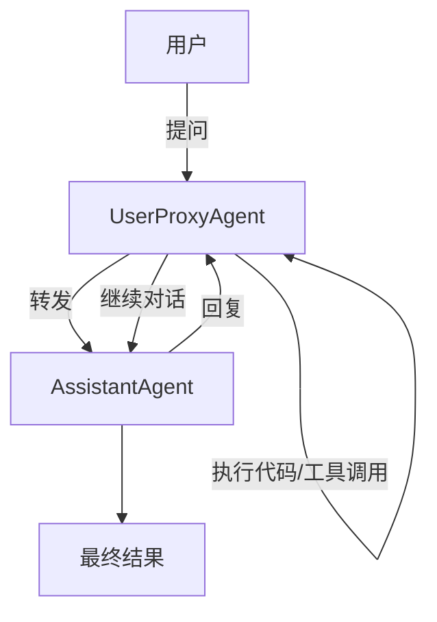
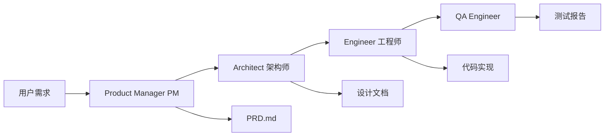
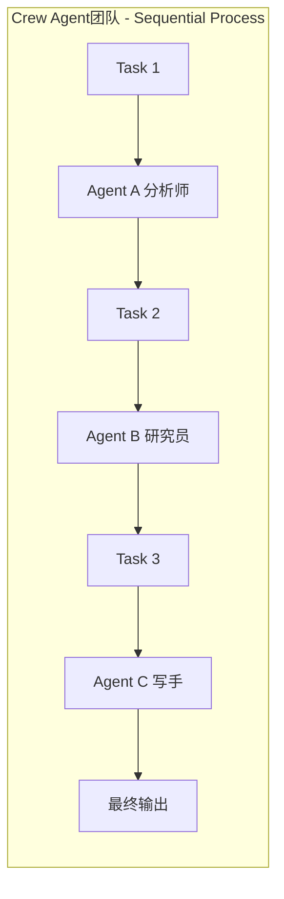
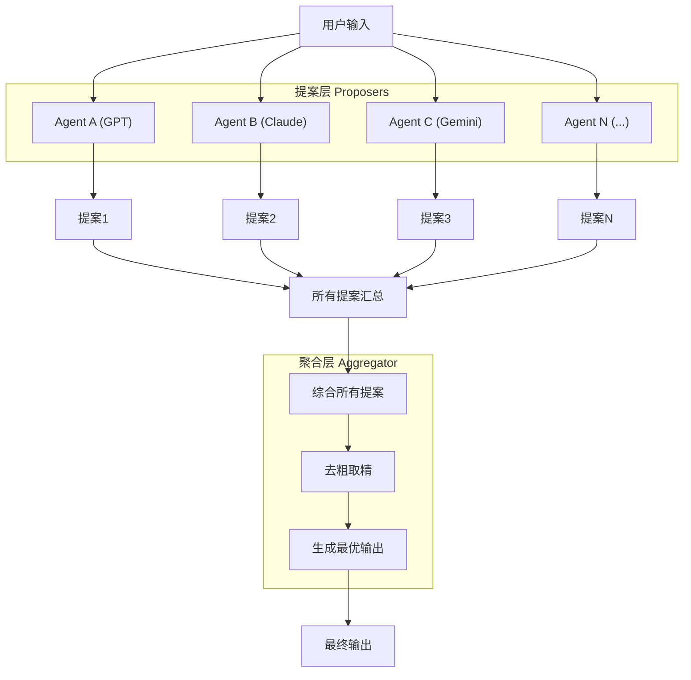
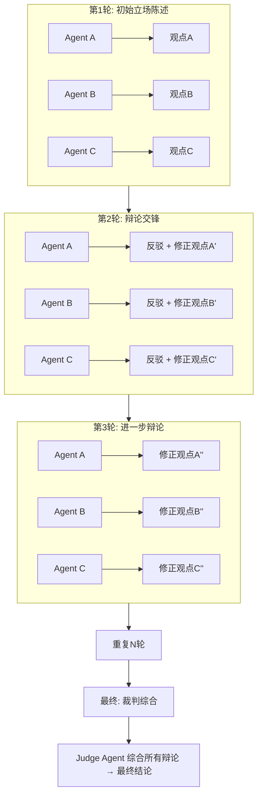
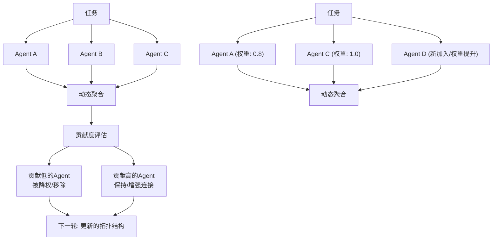
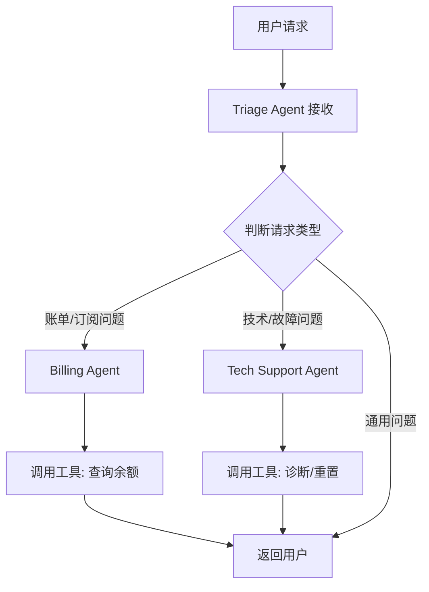
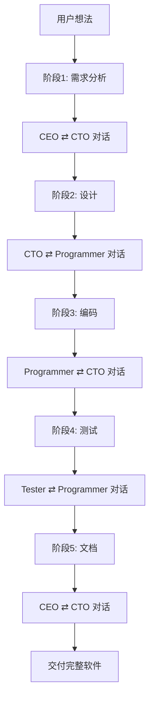
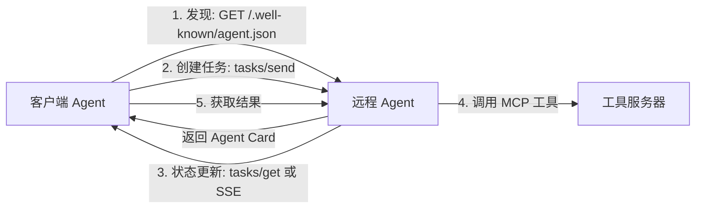
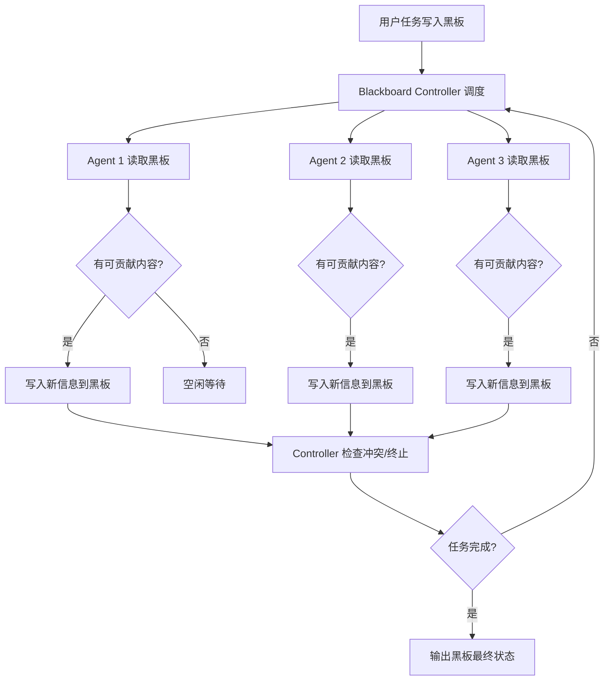

# 四、多智能体协作类 Agent 设计模式

多智能体协作（Multi-Agent Collaboration）是当前 AI Agent 领域最活跃的研究方向之一。与单一 Agent 模式不同，多智能体模式通过多个 Agent 之间的交互——对话、辩论、分工、聚合——来获得比单个 Agent 更高质量的产出。核心动机在于：**不同模型或不同角色视角的碰撞能够纠正偏见、弥补盲区、激发创意**。

本章详细讲解九种主流的多智能体协作设计模式，每种模式都配有可运行的 Python 示例代码。

---

## 4.1 AutoGen (Microsoft)

### 概念说明

AutoGen 是微软研究院于 2023 年开源（2025 年转交社区，以 AG2 名义继续发展）的多 Agent 对话编程框架。其核心设计哲学是：**将 Agent 之间的对话作为第一公民（Conversation as First-Class Citizen）**。在 AutoGen 中，多个 Agent 通过结构化的对话来完成复杂任务，Agent 之间可以相互调用、追问、验证，并支持"人在回路"（Human-in-the-Loop）的交互模式。

> **2024-2025 更新**：AutoGen 于 2024 年底发布 0.4 版本，进行了全面重构（全新架构、异步支持、可扩展 Agent 类型）。微软于 2025 年将 AutoGen 转交社区维护，项目以 **AG2**（原 AutoGen）名义继续发展。0.4 版本的核心改进：
> - **全新架构**：从对话式编排升级为事件驱动架构
> - **异步支持**：原生 async/await，支持高并发
> - **可扩展性**：自定义 Agent 类型、消息序列化、中间件
> - **跨语言**：支持 .NET 和 Python 互操作

AutoGen 的关键抽象包括：
- **ConversableAgent**：基础 Agent，能发送/接收消息、生成回复。
- **AssistantAgent**：基于 LLM 的 Agent，作为任务执行者。
- **UserProxyAgent**：用户代理，可执行代码、调用工具，充当人与 Agent 之间的桥梁。
- **GroupChat**：群聊管理器，协调多个 Agent 的对话顺序。

### 核心流程



1. 用户通过 UserProxyAgent 发起任务
2. AssistantAgent 接收任务并生成方案（可能包含代码）
3. UserProxyAgent 执行 AssistantAgent 建议的代码
4. 执行结果返回给 AssistantAgent，形成迭代闭环
5. 多轮对话直至任务完成
6. 可选：人工介入审批关键步骤

### 完整示例代码

### 环境配置

```python
"""
AutoGen 多Agent对话编程示例
演示两个Agent通过对话协作解决数学问题
需要安装: pip install pyautogen openai
"""

import os
import autogen

# 配置LLM——这里以OpenAI兼容接口为例
# 注意：base_url 仅在需要使用兼容接口（如 Azure OpenAI、本地部署）时设置，
#       不设置时 AutoGen 默认使用 OpenAI 官方端点，因此 None 值需排除。
_config_entry = {
    "model": "gpt-4o",
    "api_key": os.environ.get("OPENAI_API_KEY", "your-api-key"),
}
_base_url = os.environ.get("OPENAI_BASE_URL")
if _base_url:
    _config_entry["base_url"] = _base_url

config_list = [_config_entry]

# 创建LLM配置
llm_config = {
    "config_list": config_list,
    "temperature": 0,
}
```

### 创建 Agent

```python
# ---- 创建Agent ----

# AssistantAgent: 基于LLM的助手，负责任务推理与解答
assistant = autogen.AssistantAgent(
    name="assistant",
    system_message="你是一位擅长数学和编程的AI助手。请用Python代码解决用户的问题，"
                   "代码中使用print()输出最终答案。",
    llm_config=llm_config,
)

# UserProxyAgent: 用户代理，负责执行代码并与用户交互
user_proxy = autogen.UserProxyAgent(
    name="user_proxy",
    human_input_mode="NEVER",  # 自动模式，不等待人工输入
    max_consecutive_auto_reply=5,
    is_termination_msg=lambda msg: msg.get("content") is not None
                                   and "TERMINATE" in msg["content"],
    code_execution_config={
        "work_dir": "coding",
        "use_docker": False,  # 不使用Docker，直接在本地执行
    },
    system_message="如果assistant给出了Python代码，请执行它并返回结果。",
)
```

### 启动对话

```python
# ---- 启动对话 ----
print("=" * 60)
print("AutoGen 多Agent对话示例")
print("=" * 60)

task = """
请解答以下数学问题：
一个农场有鸡和兔子共35只，腿的数量总计94条。请问鸡和兔子各有多少只？
请编写Python代码求解并输出答案。
"""

user_proxy.initiate_chat(
    assistant,
    message=task,
)

print("\n对话完成！")
```

**关键要点**：
- `human_input_mode="NEVER"` 表示完全自动化，无需人工介入；设为 `"ALWAYS"` 或 `"TERMINATE"` 可实现人在回路。
- `is_termination_msg` 定义何时终止对话——当回复中包含 "TERMINATE" 关键词时停止。
- UserProxyAgent 的核心价值在于**代码执行能力**，这让 AI 的代码方案能够被验证并得到反馈。

---

## 4.2 MetaGPT

### 概念说明

MetaGPT 是一个极具特色的多 Agent 框架，核心思想是：**模拟一家软件公司的标准化作业流程（SOP），让多个 Agent 扮演不同角色——产品经理（PM）、架构师（Architect）、工程师（Engineer）、测试工程师（QA）等——按顺序协作，从需求文档一路生成到可运行的代码**。

与传统 Agent 框架的最大区别在于 MetaGPT 引入了**结构化的中间产物（Structured Output）**：
- PM 输出 PRD（产品需求文档）和设计文档
- 架构师输出系统架构设计
- 工程师输出具体代码实现
- QA 输出测试用例

每个角色的输出都作为下游角色的输入，形成了类似真实软件公司的文档驱动开发流程。

### 核心流程



1. **需求阶段**：PM Agent 分析用户需求，生成结构化的 PRD 文档
2. **设计阶段**：架构师 Agent 基于 PRD 生成系统架构和设计文档
3. **开发阶段**：工程师 Agent 根据设计文档编写代码
4. **测试阶段**：QA Agent 审查代码并生成测试用例
5. **审查与修订**：各角色可相互审查，产出物通过消息传递

### 完整示例代码

### 环境配置与 LLM 调用

```python
"""
MetaGPT 模拟软件公司SOP示例
模拟PM→架构师→工程师的多角色协作流程
需要安装: pip install openai
"""

import os
import json
import re
from openai import OpenAI

# 初始化OpenAI客户端
client = OpenAI(
    api_key=os.environ.get("OPENAI_API_KEY", "your-api-key"),
    base_url=os.environ.get("OPENAI_BASE_URL", None),
)

DEFAULT_MODEL = "gpt-4o"


def call_llm(system_prompt: str, user_message: str, temperature: float = 0.3) -> str:
    """调用LLM的统一入口"""
    response = client.chat.completions.create(
        model=DEFAULT_MODEL,
        messages=[
            {"role": "system", "content": system_prompt},
            {"role": "user", "content": user_message},
        ],
        temperature=temperature,
    )
    return response.choices[0].message.content
```

### 产品经理 Agent

```python
# ---- 角色Agent定义 ----

class ProductManager:
    """产品经理 Agent：负责生成PRD文档"""

    def __init__(self):
        self.system_prompt = """你是一位资深产品经理。你的职责是：
1. 分析用户需求，理解业务场景
2. 撰写结构化产品需求文档（PRD）
3. PRD应包含：功能概述、用户故事、功能清单、非功能性需求
请直接输出Markdown格式的PRD文档。"""

    def generate_prd(self, requirement: str) -> str:
        user_message = f"请根据以下需求，生成一份完整的PRD文档：\n\n{requirement}"
        return call_llm(self.system_prompt, user_message)
```

### 架构师 Agent

```python
class Architect:
    """架构师 Agent：负责系统设计"""

    def __init__(self):
        self.system_prompt = """你是一位系统架构师。你的职责是：
1. 基于PRD文档设计系统架构
2. 确定技术栈、模块划分、数据流
3. 输出架构设计文档，包含：架构概述、模块设计、数据模型、接口定义
请直接输出Markdown格式的设计文档。"""

    def design(self, prd: str) -> str:
        user_message = f"请基于以下PRD文档，完成系统架构设计：\n\n{prd}"
        return call_llm(self.system_prompt, user_message)
```

### 工程师 Agent

```python
class Engineer:
    """工程师 Agent：负责代码实现"""

    def __init__(self):
        self.system_prompt = """你是一位高级软件工程师。你的职责是：
1. 根据架构设计文档实现代码
2. 编写清晰、可运行、有注释的Python代码
3. 输出完整的代码文件，包含必要的类和函数定义
请直接输出代码，用```python代码块包裹。"""

    def implement(self, design_doc: str) -> str:
        user_message = f"请根据以下架构设计文档，实现完整的代码：\n\n{design_doc}"
        return call_llm(self.system_prompt, user_message)
```

### QA 工程师 Agent

```python
class QAEngineer:
    """QA Agent：负责审查与测试"""

    def __init__(self):
        self.system_prompt = """你是一位QA工程师。你的职责是：
1. 审查代码质量，发现潜在问题
2. 生成测试用例（单元测试、集成测试）
3. 输出QA报告：问题清单 + 测试代码
请直接输出Markdown格式的QA报告和测试代码。"""

    def review(self, code: str, design_doc: str) -> str:
        user_message = (
            f"请审查以下代码，并生成测试用例：\n\n"
            f"## 设计文档\n{design_doc}\n\n## 代码\n{code}"
        )
        return call_llm(self.system_prompt, user_message)
```

### MetaGPT 主流程

```python
# ---- MetaGPT 主流程 ----

def metagpt_process(requirement: str):
    """模拟MetaGPT的SOP流程：PM → 架构师 → 工程师 → QA"""
    print("=" * 60)
    print("MetaGPT 软件公司SOP模拟")
    print("=" * 60)

    # 阶段1: PM生成PRD
    print("\n[阶段1] 产品经理正在撰写PRD...")
    pm = ProductManager()
    prd = pm.generate_prd(requirement)
    print("✅ PRD生成完毕")
    print(f"   PRD长度: {len(prd)} 字符\n")

    # 阶段2: 架构师设计
    print("[阶段2] 架构师正在进行系统设计...")
    architect = Architect()
    design = architect.design(prd)
    print("✅ 设计文档生成完毕")
    print(f"   设计文档长度: {len(design)} 字符\n")

    # 阶段3: 工程师实现
    print("[阶段3] 工程师正在编写代码...")
    engineer = Engineer()
    code = engineer.implement(design)
    print("✅ 代码实现完毕")
    print(f"   代码长度: {len(code)} 字符\n")

    # 阶段4: QA审查
    print("[阶段4] QA正在进行审查...")
    qa = QAEngineer()
    review = qa.review(code, design)
    print("✅ QA审查完毕\n")

    # 汇总输出
    results = {
        "prd": prd,
        "design": design,
        "code": code,
        "review": review,
    }

    print("\n" + "=" * 60)
    print("各阶段产出预览")
    print("=" * 60)

    for key, value in results.items():
        preview = value[:200].replace("\n", " ")
        print(f"\n--- {key.upper()} (前200字符) ---")
        print(f"{preview}...")

    return results
```

### 运行示例

```python
# ---- 运行示例 ----
if __name__ == "__main__":
    requirement = """
    开发一个简单的「待办事项管理」命令行工具，功能要求：
    1. 用户可以添加待办事项（标题、优先级）
    2. 可以查看所有待办事项列表
    3. 可以标记事项为已完成
    4. 可以删除事项
    5. 数据存储在本地JSON文件中
    """
    metagpt_process(requirement)
```

**关键要点**：
- 每个 Agent 有明确的**角色定义（system_prompt）**，模拟真实团队角色
- 上游产出作为下游输入，形成**文档链（Document Chain）**
- 真实 MetaGPT 框架还包含 Role、Action、Memory 等抽象层级，这里呈现的是核心思想

---

## 4.3 CrewAI

### 概念说明

CrewAI 是当下最流行的多 Agent 编排框架之一，其核心理念是：**Role-Goal-Backstory（角色-目标-背景故事）**。与 MetaGPT 严格遵守软件公司 SOP 不同，CrewAI 更加通用和灵活，可以组织任意类型的 Agent 团队来完成各种任务。

CrewAI 的核心概念：
- **Agent**：具有角色（Role）、目标（Goal）、背景故事（Backstory）的 AI 代理
- **Task**：具体任务，可指定执行 Agent、期望输出、依赖关系
- **Crew**：Agent 团队，定义执行模式和协作方式
- **Process**：执行流程——Sequential（顺序）或 Hierarchical（层级）

CrewAI 的特色在于**角色驱动**——每个 Agent 都有丰满的"人设"，使 Agent 的回复更具目的性和一致性。

### 核心流程



1. **定义 Agent**：为每个 Agent 设定 Role、Goal、Backstory
2. **定义 Task**：将大任务拆分为子任务，指定执行 Agent
3. **组建 Crew**：将所有 Agent 和 Task 组合成团队
4. **执行**：Crew 按 process 模式（顺序/层级）执行任务
5. **输出**：获取每个 Task 的结果，汇总为最终产出

### 完整示例代码

### 环境配置与 LLM 调用

```python
"""
CrewAI 角色驱动的多Agent协作示例
演示Role-Goal-Backstory模式下的团队协作
需要安装: pip install openai
"""

import os
import json
from openai import OpenAI

client = OpenAI(
    api_key=os.environ.get("OPENAI_API_KEY", "your-api-key"),
    base_url=os.environ.get("OPENAI_BASE_URL", None),
)

DEFAULT_MODEL = "gpt-4o"


def call_llm(system_prompt: str, user_message: str, temperature: float = 0.3) -> str:
    response = client.chat.completions.create(
        model=DEFAULT_MODEL,
        messages=[
            {"role": "system", "content": system_prompt},
            {"role": "user", "content": user_message},
        ],
        temperature=temperature,
    )
    return response.choices[0].message.content
```

### Agent 类

```python
# ---- Agent 定义 ----

class CrewAgent:
    """CrewAI风格的Agent：Role + Goal + Backstory"""

    def __init__(self, name: str, role: str, goal: str, backstory: str):
        self.name = name
        self.role = role
        self.goal = goal
        self.backstory = backstory
        self.system_prompt = self._build_system_prompt()

    def _build_system_prompt(self) -> str:
        return f"""你是 {self.name}。
你的角色: {self.role}
你的目标: {self.goal}
你的背景: {self.backstory}

请严格按照你的角色定位来完成任务。输出时以你的角色身份进行。"""

    def execute(self, task_description: str, context: str = "") -> str:
        user_message = f"任务: {task_description}"
        if context:
            user_message += f"\n\n上下文信息（前面步骤的结果）:\n{context}"
        return call_llm(self.system_prompt, user_message)
```

### Task 类

```python
class Task:
    """CrewAI风格的Task定义"""

    def __init__(self, description: str, agent: CrewAgent,
                 expected_output: str = "", context_task_idx: int = None):
        self.description = description
        self.agent = agent
        self.expected_output = expected_output
        self.context_task_idx = context_task_idx
        self.result = None
```

### Crew 类

```python
class Crew:
    """CrewAI风格的Agent团队"""

    def __init__(self, agents: list, tasks: list, process: str = "sequential"):
        self.agents = agents
        self.tasks = tasks
        self.process = process  # "sequential" 或 "hierarchical"
        self.results = []

    def run(self) -> list:
        if self.process == "sequential":
            return self._run_sequential()
        else:
            return self._run_hierarchical()

    def _run_sequential(self) -> list:
        """顺序执行任务，前一个任务的结果作为下一个任务的上下文"""
        context = ""
        for i, task in enumerate(self.tasks):
            print(f"  [{i+1}/{len(self.tasks)}] {task.agent.name} "
                  f"({task.agent.role}) 正在执行: {task.description[:50]}...")

            # 合并前置任务的结果作为上下文
            if task.context_task_idx is not None:
                # 将指定任务的结果添加到上下文开头作为重点参考，保留已累积的上下文
                context = self.tasks[task.context_task_idx].result + "\n" + context

            task.result = task.agent.execute(task.description, context)
            context += f"\n\n步骤{i+1}的结果:\n{task.result}"
            self.results.append(task.result)
            print(f"  ✅ 完成")

        return self.results

    def _run_hierarchical(self) -> list:
        """层级执行：由管理者Agent分配任务"""
        # 简化实现：选择第一个Agent作为管理者
        manager = self.agents[0]
        all_tasks = "\n".join([
            f"任务{t_idx}: {t.description} (分配给: {t.agent.name})"
            for t_idx, t in enumerate(self.tasks)
        ])
        manager_result = manager.execute(
            f"作为团队管理者，请协调以下任务并给出执行计划：\n{all_tasks}",
            ""
        )
        print(f"管理者计划:\n{manager_result[:300]}...\n")

        # 然后顺序执行
        return self._run_sequential()
```

### 创建 Agent 实例

```python
# ---- 定义Agent团队 ----

def create_research_crew():
    """创建一个市场调研Agent团队"""

    # Agent 1: 市场分析师
    market_analyst = CrewAgent(
        name="市场分析师Alex",
        role="市场研究分析师",
        goal="深入分析目标市场，提供数据驱动的洞察",
        backstory="你拥有10年科技行业市场分析经验，曾在麦肯锡和BCG工作，"
                  "擅长TAM估算和竞争格局分析。",
    )

    # Agent 2: 技术研究员
    tech_researcher = CrewAgent(
        name="技术研究员Blake",
        role="前沿技术研究员",
        goal="评估技术可行性，识别技术风险和机会",
        backstory="你是一位计算机科学博士，在顶级会议发表过20+篇论文，"
                  "专注于AI和系统架构研究。",
    )

    # Agent 3: 内容策略师
    content_strategist = CrewAgent(
        name="内容策略师Casey",
        role="内容与产品策略师",
        goal="综合市场和技术分析，产出可执行的战略建议报告",
        backstory="你是一名资深产品策略顾问，帮助过多家Fortune 500公司"
                  "制定产品战略，擅长将复杂分析转化为清晰建议。",
    )
```

### 定义任务与组建 Crew

```python
    # 创建任务
    task1 = Task(
        description="分析2025年中国AI Agent市场的规模、增长趋势、"
                    "主要玩家（如Coze、Dify、AutoGen等）和竞争格局。"
                    "请给出TAM估算和关键趋势。",
        agent=market_analyst,
        expected_output="市场分析报告（含市场规模、增长预测、竞争矩阵）",
    )

    task2 = Task(
        description="评估当前多Agent框架（AutoGen、CrewAI、MetaGPT等）"
                    "的技术成熟度、优劣势、技术债务和未来演进方向。"
                    "从工程角度分析各框架的适用场景。",
        agent=tech_researcher,
        expected_output="技术评估报告（含架构对比、成熟度评分、技术建议）",
        context_task_idx=0,
    )

    task3 = Task(
        description="综合市场分析和技术评估的结果，撰写一份完整的"
                    "「AI Agent框架选型建议书」，包含：\n"
                    "1. 市场机会概述\n"
                    "2. 各框架适用场景推荐\n"
                    "3. 实施路线图建议\n"
                    "4. 风险提示",
        agent=content_strategist,
        expected_output="战略建议书（含场景推荐、路线图、风险评估）",
        context_task_idx=1,
    )

    crew = Crew(
        agents=[market_analyst, tech_researcher, content_strategist],
        tasks=[task1, task2, task3],
        process="sequential",
    )

    return crew
```

### 运行示例

```python
# ---- 运行示例 ----
if __name__ == "__main__":
    print("=" * 60)
    print("CrewAI 角色驱动多Agent协作")
    print("=" * 60)

    crew = create_research_crew()

    print(f"\n团队成员:")
    for agent in crew.agents:
        print(f"  - {agent.name}: {agent.role}")
    print(f"\n任务数量: {len(crew.tasks)}")
    print(f"执行模式: {crew.process}\n")

    results = crew.run()

    print("\n" + "=" * 60)
    print("最终成果预览")
    print("=" * 60)
    for i, result in enumerate(results):
        preview = result[:200].replace("\n", " ")
        print(f"\n--- Task {i+1} 结果 (前200字符) ---")
        print(f"{preview}...")
```

**关键要点**：
- Role + Goal + Backstory 三元组赋予每个 Agent 独特的"人格"，提升回复质量
- Context 机制确保下游 Agent 能"看到"上游 Agent 的工作成果
- Sequential 是最基础的协作模式，CrewAI 还支持 Hierarchical（管理者分配任务）模式

---

## 4.4 Mixture of Agents (MoA)

### 概念说明

Mixture of Agents（MoA）是由 Together AI 于 2024 年提出的一种**并行提案 + 聚合综合**的多 Agent 架构。MoA 的灵感来源于 Mixture of Experts（MoE）——与其训练一个巨大的模型，不如组合多个小模型的输出。

MoA 的核心思想：
1. **提案层（Proposer Layer）**：多个"提案者"Agent 并行独立地生成不同的回答或方案
2. **聚合层（Aggregator Layer）**：一个"聚合者"Agent 综合所有提案，生成最终的高质量输出
3. 可以堆叠多个 MoA 层（Layer-1 Proposers → Layer-1 Aggregator → Layer-2 Proposers → ...），形成深层 MoA

MoA 的优势在于：不同 LLM（或同一 LLM 的不同配置）会从不同角度看待问题，聚合者可以取长补短，产生比任何单个模型更优的结果。

### 核心流程



1. 用户输入被同时发送给 N 个提案者 Agent
2. 每个提案者独立生成完整的回复
3. 所有提案被收集并传递给聚合者
4. 聚合者综合分析，生成最终输出
5. 可选：将聚合结果再次送入下一层 MoA，迭代优化

### 环境配置

```python
"""
Mixture of Agents (MoA) 示例
多提案Agent并行生成 + 聚合Agent综合
需要安装: pip install openai
"""

import os
from concurrent.futures import ThreadPoolExecutor, as_completed
from openai import OpenAI

client = OpenAI(
    api_key=os.environ.get("OPENAI_API_KEY", "your-api-key"),
    base_url=os.environ.get("OPENAI_BASE_URL", None),
)

DEFAULT_MODEL = "gpt-4o"


def call_llm(system_prompt: str, user_message: str,
             temperature: float = 0.5, model: str = None) -> str:
    """调用LLM"""
    response = client.chat.completions.create(
        model=model or DEFAULT_MODEL,
        messages=[
            {"role": "system", "content": system_prompt},
            {"role": "user", "content": user_message},
        ],
        temperature=temperature,
    )
    return response.choices[0].message.content
```

### 提案者 Agent

```python
# ---- MoA 核心实现 ----

class ProposerAgent:
    """提案者Agent：从特定视角/风格生成提案"""

    def __init__(self, name: str, perspective: str, temperature: float = 0.7):
        self.name = name
        self.perspective = perspective
        self.temperature = temperature
        self.system_prompt = (
            f"你是一位{perspective}。请从你的专业视角出发，"
            f"提供深入、有见地的分析和建议。表达要清晰、结构化。"
        )

    def propose(self, question: str) -> str:
        return call_llm(self.system_prompt, question, self.temperature)
```

### 聚合者 Agent

```python
class AggregatorAgent:
    """聚合者Agent：综合所有提案，生成最终结果"""

    def __init__(self, temperature: float = 0.2):
        self.temperature = temperature
        self.system_prompt = """你是一位资深战略顾问，你的任务是从多个专家的提案中
提炼精华，综合形成一份高质量、无冗余、见解深刻的最终报告。

你的工作方式：
1. 识别各提案中的共同点和分歧点
2. 保留最有价值的见解，舍弃重复和矛盾的
3. 整合为一份连贯、可执行的综合报告
4. 对于存在分歧的地方，给出你的专业判断和建议
5. 不要简单拼接，要真正的融合提炼"""

    def aggregate(self, question: str, proposals: dict) -> str:
        proposals_text = ""
        for name, proposal in proposals.items():
            proposals_text += f"\n### {name}的提案:\n{proposal}\n"

        user_message = (
            f"## 原始问题\n{question}\n\n"
            f"## 各位专家的提案\n{proposals_text}\n\n"
            f"请综合以上所有提案，生成最终的综合分析报告。"
        )
        return call_llm(self.system_prompt, user_message, self.temperature)
```

### MoA 主控制器

```python

class MoA:
    """Mixture of Agents 主控制器"""

    def __init__(self, proposers: list, aggregator: AggregatorAgent,
                 num_layers: int = 1, max_workers: int = 5):
        self.proposers = proposers
        self.aggregator = aggregator
        self.num_layers = num_layers
        self.max_workers = max_workers

    def run(self, question: str) -> dict:
        """
        运行MoA流程。支持多层：
        第1层: proposers → aggregator
        第2层: 基于第1层输出，重新propose → 再次aggregate
        """
        current_question = question
        all_layer_results = []

        for layer in range(self.num_layers):
            print(f"\n--- MoA 第 {layer + 1} 层 ---")

            # 阶段1: 并行提案
            print("  [提案阶段] 各Agent并行生成提案...")
            proposals = self._parallel_propose(current_question)

            for name, prop in proposals.items():
                print(f"    {name}: {len(prop)} 字符")

            # 阶段2: 聚合综合
            print("  [聚合阶段] Aggregator综合所有提案...")
            final_result = self.aggregator.aggregate(current_question, proposals)
            print(f"    聚合结果: {len(final_result)} 字符")

            all_layer_results.append({
                "layer": layer + 1,
                "proposals": proposals,
                "result": final_result,
            })

            # 为下一层准备：将当前结果作为新问题
            if layer < self.num_layers - 1:
                current_question = (
                    f"基于以下初步分析报告，请进一步深化和完善：\n\n{final_result}"
                )

        return all_layer_results[-1]  # 返回最后一层的结果
```

### MoA 并行提案方法

```python

    def _parallel_propose(self, question: str) -> dict:
        """使用线程池并行执行所有提案者"""
        proposals = {}
        with ThreadPoolExecutor(max_workers=self.max_workers) as executor:
            future_to_proposer = {
                executor.submit(p.propose, question): p
                for p in self.proposers
            }
            for future in as_completed(future_to_proposer):
                proposer = future_to_proposer[future]
                proposals[proposer.name] = future.result()
        return proposals
```

### 构建 MoA 实例

```python

# ---- 构建MoA实例 ----

def create_moa_team() -> MoA:
    """创建MOA团队：5个不同视角的提案者 + 1个聚合者"""

    proposers = [
        ProposerAgent("市场专家", "资深市场战略分析师，擅长市场趋势和市场定位分析", 0.7),
        ProposerAgent("技术专家", "资深技术架构师，擅长技术选型和可行性评估", 0.6),
        ProposerAgent("产品专家", "资深产品经理，擅长用户体验和产品策略", 0.8),
        ProposerAgent("财务专家", "资深财务分析师，擅长成本收益分析和ROI评估", 0.5),
        ProposerAgent("风险专家", "资深风控顾问，擅长识别和评估各类风险", 0.6),
    ]

    aggregator = AggregatorAgent(temperature=0.2)

    return MoA(proposers, aggregator, num_layers=1)
```

### 运行示例

```python

# ---- 运行示例 ----
if __name__ == "__main__":
    print("=" * 60)
    print("Mixture of Agents (MoA) 多Agent并行聚合")
    print("=" * 60)

    moa = create_moa_team()

    question = """
    一家中型SaaS公司（年收入5000万，200名员工）正在考虑
    将AI Agent能力集成到其产品中。请分析：
    1. 应该自研还是采购第三方Agent框架？
    2. 如何分阶段落地？
    3. 预期投入和回报？
    """

    print(f"\n问题: {question.strip()[:100]}...\n")

    result = moa.run(question)

    print("\n" + "=" * 60)
    print("MoA最终综合报告（预览）")
    print("=" * 60)
    print(result["result"][:800])
    print("\n... (完整报告可通过调整预览长度查看)")
```

**关键要点**：
- 提案者使用不同的 temperature 和 perspective，确保**观点多样性**
- 并行执行提案者（ThreadPoolExecutor），提高效率
- 聚合者的 temperature 设为较低的 0.2，偏向**确定性综合**而非创造性发散
- 多层 MoA 可以迭代深化分析质量，但会增加延迟和成本

---

## 4.5 Multi-Agent Debate (MAD)

### 概念说明

Multi-Agent Debate（MAD，多Agent辩论）是一种通过**对抗性讨论**来提升 LLM 输出质量的方法。其核心思想来源于人类社会的辩论机制——当多个持不同观点的专家对同一个问题进行辩论时，最终达成的共识往往比任何一个人的初始观点更准确、更全面。

MAD 的基本形式：
1. 多个 Agent 对同一问题给出各自的初始回答
2. Agent 们互相看到彼此的回答，并对他人的观点进行**评判和反驳**
3. 经过多轮辩论，Agent 们逐渐修正自己的观点
4. 最终由裁判（Judge）Agent 综合所有辩论，给出最终结论

研究表明，MAD 能显著提升 LLM 在数学推理、事实问答等任务上的准确率，尤其对幻觉问题有明显改善。

### 核心流程



### 环境配置

```python
"""
Multi-Agent Debate (MAD) 示例
多Agent辩论机制，通过对抗产生更优结果
需要安装: pip install openai
"""

import os
from openai import OpenAI

client = OpenAI(
    api_key=os.environ.get("OPENAI_API_KEY", "your-api-key"),
    base_url=os.environ.get("OPENAI_BASE_URL", None),
)

DEFAULT_MODEL = "gpt-4o"


def call_llm(system_prompt: str, user_message: str, temperature: float = 0.5) -> str:
    response = client.chat.completions.create(
        model=DEFAULT_MODEL,
        messages=[
            {"role": "system", "content": system_prompt},
            {"role": "user", "content": user_message},
        ],
        temperature=temperature,
    )
    return response.choices[0].message.content
```

### 辩论 Agent

```python
# ---- MAD Agent 实现 ----

class DebateAgent:
    """辩论Agent：持有特定立场，参与多轮辩论"""

    def __init__(self, name: str, stance: str, temperature: float = 0.7):
        self.name = name
        self.stance = stance
        self.temperature = temperature
        self.history = []  # 记录本Agent的所有发言

        self.system_prompt = f"""你是辩论选手 {name}，你的立场是: {stance}。

辩论规则：
1. 在每轮辩论中，你需要审视其他选手的观点
2. 对他人的论点进行有建设性的质疑或反驳
3. 吸收他人观点中的合理部分，修正自己的立场
4. 给出你修正后的观点
5. 保持建设性和专业性，避免人身攻击
6. 输出格式：
   【对他人观点的回应】...
   【我修正后的观点】..."""

    def initial_statement(self, question: str) -> str:
        """首轮：给出初始立场陈述"""
        user_message = f"请就以下问题，陈述你的初始立场和推理：\n\n{question}"
        result = call_llm(self.system_prompt, user_message, self.temperature)
        self.history.append({
            "round": 0,
            "role": "initial",
            "content": result,
        })
        return result

    def debate_round(self, question: str, others_statements: dict) -> str:
        """辩论轮次：审视他人观点，给出修正后的观点"""
        others_text = ""
        for name, statement in others_statements.items():
            others_text += f"\n### {name} 的观点:\n{statement}\n"

        user_message = (
            f"## 辩论问题\n{question}\n\n"
            f"## 你的初始立场\n{self.stance}\n\n"
            f"## 其他选手本轮的观点\n{others_text}\n\n"
            f"请回应其他选手的观点，并给出你修正后的立场。"
        )
        result = call_llm(self.system_prompt, user_message, self.temperature)
        round_num = len(self.history)
        self.history.append({
            "round": round_num,
            "role": "debate",
            "content": result,
        })
        return result
```

### 裁判 Agent

```python

class JudgeAgent:
    """裁判Agent：综合辩论过程，给出最终裁决"""

    def __init__(self):
        self.system_prompt = """你是一位公正的辩论裁判。你需要：
1. 回顾整个辩论过程，总结各Agent的核心论点
2. 分析哪些论点最有说服力
3. 指出辩论过程中观点的演变
4. 给出综合性的最终结论
请输出结构化的裁判意见。"""

    def judge(self, question: str, all_histories: dict,
              final_statements: dict) -> str:
        debate_summary = ""
        for name, history in all_histories.items():
            debate_summary += f"\n## {name} 的辩论历程\n"
            for entry in history:
                debate_summary += (
                    f"\n### 第{entry['round']}轮 ({entry['role']})\n"
                    f"{entry['content'][:500]}\n"
                )

        final_summary = ""
        for name, statement in final_statements.items():
            final_summary += f"\n### {name} 最终观点:\n{statement[:500]}\n"

        user_message = (
            f"## 辩论问题\n{question}\n\n"
            f"## 完整辩论过程\n{debate_summary}\n\n"
            f"## 各选手最终观点\n{final_summary}\n\n"
            f"请给出你的裁判意见和最终结论。"
        )
        return call_llm(self.system_prompt, user_message, temperature=0.2)
```

### MAD 辩论主控制器

```python

class MADebate:
    """Multi-Agent Debate 主控制器"""

    def __init__(self, agents: list, judge: JudgeAgent, max_rounds: int = 3):
        self.agents = agents
        self.judge = judge
        self.max_rounds = max_rounds

    def run(self, question: str) -> dict:
        print(f"辩论问题: {question[:100]}...\n")

        # 第0轮: 初始立场陈述
        print("[第0轮] 初始立场陈述")
        print("-" * 40)
        current_statements = {}
        for agent in self.agents:
            statement = agent.initial_statement(question)
            current_statements[agent.name] = statement
            print(f"  {agent.name}: {statement[:80]}...")

        # 第1~N轮: 辩论
        for round_num in range(1, self.max_rounds + 1):
            print(f"\n[第{round_num}轮] 辩论交锋")
            print("-" * 40)
            next_statements = {}
            for agent in self.agents:
                # 该Agent能看到除自己外所有人的上轮观点
                others = {
                    name: stmt for name, stmt in current_statements.items()
                    if name != agent.name
                }
                statement = agent.debate_round(question, others)
                next_statements[agent.name] = statement
                print(f"  {agent.name}: {statement[:80]}...")
            current_statements = next_statements

        # 裁判阶段
        print(f"\n[裁判阶段] 综合裁决")
        print("-" * 40)
        all_histories = {
            agent.name: agent.history for agent in self.agents
        }
        verdict = self.judge.judge(question, all_histories, current_statements)
        print(f"  裁判意见: {verdict[:200]}...")

        return {
            "question": question,
            "final_statements": current_statements,
            "histories": all_histories,
            "verdict": verdict,
        }
```

### 运行示例

```python

# ---- 运行示例 ----
if __name__ == "__main__":
    print("=" * 60)
    print("Multi-Agent Debate (MAD) 多Agent辩论")
    print("=" * 60)

    # 创建辩论Agent，各自有不同的立场
    agents = [
        DebateAgent("保守派张工",
                     "技术选型应优先考虑成熟稳定，选择有大规模实践验证的方案，"
                     "避免使用过于前沿但未经验证的技术。"),
        DebateAgent("激进派李博",
                     "技术选型应优先考虑前沿创新，采用最新技术可以获得竞争优势，"
                     "适度的技术风险是可接受的。"),
        DebateAgent("务实派王总",
                     "技术选型应平衡创新与稳定，核心系统用成熟技术，"
                     "非核心模块可以尝试新技术。应根据具体场景灵活决策。"),
    ]

    judge = JudgeAgent()
    debate = MADebate(agents, judge, max_rounds=2)

    question = """
    一个创业团队要选择一个Web框架来构建新产品。
    选项：1) 成熟的Django  2) 高性能的FastAPI  3) 全栈的Next.js
    请从你代表的立场出发，给出推荐和理由。
    """

    result = debate.run(question)

    print("\n" + "=" * 60)
    print("辩论最终裁决")
    print("=" * 60)
    print(result["verdict"])
```

**关键要点**：
- 3 个 Agent 分别代表**不同的决策立场**（保守、激进、务实），保证观点多样性
- 每轮辩论中，Agent 能看到所有其他人的观点，这模拟了**完全信息**辩论
- 裁判 Agent 的 temperature 低（0.2），确保裁决的一致性和可靠性
- MAD 轮次不宜过多，通常 2-3 轮即可收敛

---

## 4.6 DyLAN (Dynamic Agent Network)

### 概念说明

DyLAN（Dynamic LLM-Agent Network）是一种**动态 Agent 网络**架构，与传统固定结构的多 Agent 系统不同，DyLAN 中的 Agent 连接关系是**动态变化**的——根据任务需求和子问题特征，系统自动构建和调整 Agent 之间的通信拓扑。

DyLAN 的核心创新：
- **动态拓扑**：Agent 之间的连接不是预设的，而是根据任务自动生成
- **贡献度评估**：系统持续评估每个 Agent 的贡献度，贡献低的 Agent 可能被降权或移除
- **前向传播 + 后向传播**：类似于神经网络，前向阶段 Agent 生成方案，后向阶段评估和调整
- **早停机制**：当 Agent 网络趋于稳定（贡献度不再显著变化）时自动停止

### 核心流程



### 环境配置

```python
"""
DyLAN 动态Agent连接网络示例
Agent之间的连接关系根据贡献度动态调整
需要安装: pip install openai
"""

import os
import math
import numpy as np
from concurrent.futures import ThreadPoolExecutor, as_completed
from openai import OpenAI

client = OpenAI(
    api_key=os.environ.get("OPENAI_API_KEY", "your-api-key"),
    base_url=os.environ.get("OPENAI_BASE_URL", None),
)

DEFAULT_MODEL = "gpt-4o"


def call_llm(system_prompt: str, user_message: str,
             temperature: float = 0.5, model: str = None) -> str:
    response = client.chat.completions.create(
        model=model or DEFAULT_MODEL,
        messages=[
            {"role": "system", "content": system_prompt},
            {"role": "user", "content": user_message},
        ],
        temperature=temperature,
    )
    return response.choices[0].message.content
```

### DyLAN Agent 节点

```python
# ---- DyLAN 核心实现 ----

class DyLANAgent:
    """DyLAN网络中的Agent节点"""

    def __init__(self, agent_id: str, expertise: str, temperature: float = 0.5):
        self.agent_id = agent_id
        self.expertise = expertise
        self.temperature = temperature
        self.weight = 1.0  # 当前权重
        self.contribution_score = 0.0  # 贡献度评分
        self.active = True  # 是否活跃

        self.system_prompt = (
            f"你是Agent {agent_id}，专长领域: {expertise}。"
            f"请从你的专业角度分析问题并提供解决方案。"
        )

    def solve(self, problem: str, context: str = "") -> str:
        """基于当前问题生成解决方案"""
        user_message = f"问题: {problem}"
        if context:
            user_message += f"\n\n参考上下文:\n{context}"
        return call_llm(self.system_prompt, user_message, self.temperature)

    def evaluate(self, problem: str, all_solutions: dict) -> float:
        """自我评估：判断自己的方案相对于其他方案的贡献度

        注：此方法为可选的自我评估接口，默认主流程使用 DyLANEvaluator.evaluate
        （外部评估器）。如需结合自我评估+外部评估，可在主流程中调用此方法。
        """
        others = ""
        for aid, sol in all_solutions.items():
            if aid != self.agent_id:
                others += f"\n### {aid}的方案:\n{sol[:300]}\n"

        user_message = (
            f"问题: {problem}\n\n"
            f"## 你的方案\n{all_solutions.get(self.agent_id, '')[:300]}\n\n"
            f"## 其他Agent的方案\n{others}\n\n"
            f"请评估你的方案相对于其他方案的贡献度。"
            f"输出一个0到1之间的浮点数，只输出数字。"
        )
        try:
            result = call_llm(
                "你是一个客观的自我评估系统。请仅输出一个0到1之间的浮点数。",
                user_message, temperature=0.1
            )
            score = float(result.strip())
            return max(0.0, min(1.0, score))
        except ValueError:
            return 0.5
```

### 贡献度评估器

```python

class DyLANEvaluator:
    """外部评估器：计算每个Agent的贡献度"""

    def __init__(self):
        self.system_prompt = """你是一个Agent贡献度评估系统。
请评估以下各Agent对解决问题的贡献度。

评估维度：
1. 方案的创新性
2. 方案的可行性
3. 方案与问题的相关性
4. 方案的完整性

输出JSON格式，key为agent_id，value为0-1之间的贡献度分数。
示例: {"agent_1": 0.8, "agent_2": 0.6}"""

    def evaluate(self, problem: str, solutions: dict) -> dict:
        solutions_text = ""
        for aid, sol in solutions.items():
            solutions_text += f"\n### Agent {aid}:\n{sol[:400]}\n"

        user_message = (
            f"问题: {problem}\n\n"
            f"各Agent方案:\n{solutions_text}\n\n"
            f"请评估每个Agent的贡献度，输出JSON。"
        )
        result = call_llm(self.system_prompt, user_message, temperature=0.1)

        # 解析JSON
        import json
        try:
            # 提取JSON部分
            start = result.find("{")
            end = result.rfind("}") + 1
            if start >= 0 and end > start:
                scores = json.loads(result[start:end])
                return scores
        except json.JSONDecodeError:
            pass

        # 解析失败，返回均匀分布
        return {aid: 1.0 / len(solutions) for aid in solutions}
```

### DyLAN 动态网络 — 初始化与主流程

```python

class DyLANNetwork:
    """动态Agent连接网络"""

    def __init__(self, agents: list, evaluator: DyLANEvaluator,
                 max_iterations: int = 5, convergence_threshold: float = 0.01,
                 min_weight: float = 0.3, max_workers: int = 5):
        self.agents = {agent.agent_id: agent for agent in agents}
        self.evaluator = evaluator
        self.max_iterations = max_iterations
        self.convergence_threshold = convergence_threshold
        self.min_weight = min_weight
        self.max_workers = max_workers
        self.history = []  # 记录每轮的权重变化

    def run(self, problem: str) -> dict:
        """运行DyLAN主流程"""
        print(f"初始Agent网络: {len(self.agents)} 个节点")

        for iteration in range(1, self.max_iterations + 1):
            print(f"\n--- 迭代 {iteration} ---")
            active_agents = {
                aid: a for aid, a in self.agents.items() if a.active
            }

            if len(active_agents) == 0:
                print("所有Agent都已被停用！")
                break

            # 阶段1: 前向传播——所有活跃Agent并行生成方案
            print("  [前向传播] Agent并行求解...")
            solutions = self._parallel_solve(problem, active_agents)

            # 阶段2: 贡献度评估
            print("  [贡献度评估] 计算各Agent贡献度...")
            scores = self.evaluator.evaluate(problem, solutions)

            # 阶段3: 后向传播——更新权重和活跃状态
            print("  [后向传播] 更新Agent权重...")
            weight_changes = self._update_weights(scores)

            # 记录本轮状态
            round_info = {
                "iteration": iteration,
                "active_agents": list(active_agents.keys()),
                "scores": scores,
                "weights": {aid: a.weight for aid, a in self.agents.items()},
            }
            self.history.append(round_info)

            # 检查收敛
            max_change = max(weight_changes.values()) if weight_changes else 0
            print(f"    最大权重变化: {max_change:.4f}")
            if max_change < self.convergence_threshold:
                print(f"    网络已收敛，停止迭代。")
                break

        # 最终聚合：加权综合所有Agent的方案
        print("\n[最终聚合] 加权综合所有方案...")
        final_result = self._final_aggregate(problem)

        return {
            "problem": problem,
            "history": self.history,
            "final_result": final_result,
        }
```

### DyLAN 动态网络 — 内部方法

```python

    def _parallel_solve(self, problem: str, agents: dict) -> dict:
        """并行让所有活跃Agent求解"""
        solutions = {}
        with ThreadPoolExecutor(max_workers=self.max_workers) as executor:
            future_to_aid = {
                executor.submit(a.solve, problem): aid
                for aid, a in agents.items()
            }
            for future in as_completed(future_to_aid):
                aid = future_to_aid[future]
                solutions[aid] = future.result()
        return solutions

    def _update_weights(self, scores: dict) -> dict:
        """根据贡献度更新每个Agent的权重"""
        changes = {}
        avg_score = sum(scores.values()) / max(len(scores), 1)

        for aid, score in scores.items():
            agent = self.agents[aid]
            old_weight = agent.weight

            # 权重更新公式：向贡献度方向调整
            new_weight = 0.7 * old_weight + 0.3 * score

            # 低于阈值的Agent被停用
            if new_weight < self.min_weight:
                agent.active = False
                agent.weight = 0.0
                changes[aid] = abs(old_weight)
                print(f"    Agent {aid} 权重过低 ({new_weight:.3f})，已被停用。")
            else:
                agent.weight = new_weight
                changes[aid] = abs(new_weight - old_weight)

        return changes
```

### DyLAN 动态网络 — 最终聚合

```python

    def _final_aggregate(self, problem: str) -> str:
        """加权聚合所有Agent的最终方案"""
        # 收集所有活跃Agent的方案
        active_agents = {
            aid: a for aid, a in self.agents.items() if a.active
        }
        if not active_agents:
            # 如果所有都被停用，使用历史中得分最高的
            return "所有Agent均未产生有效方案。"

        solutions = self._parallel_solve(problem, active_agents)

        # 构建聚合提示
        weighted_solutions = ""
        for aid, sol in solutions.items():
            w = self.agents[aid].weight
            weighted_solutions += f"\n### Agent {aid} (权重: {w:.2f})\n{sol}\n"

        user_message = (
            f"问题: {problem}\n\n"
            f"以下是各Agent的加权方案:\n{weighted_solutions}\n\n"
            f"请综合以上方案（高权重Agent的意见应获得更多采纳），"
            f"生成一份综合性的最终解决方案。"
        )

        system_prompt = """你是一个专家系统，负责综合多个Agent的意见。
请根据各Agent的权重，合理采纳意见，生成最佳的综合方案。"""
        return call_llm(system_prompt, user_message, temperature=0.2)
```

### 运行示例

```python

# ---- 运行示例 ----
if __name__ == "__main__":
    print("=" * 60)
    print("DyLAN 动态Agent连接网络")
    print("=" * 60)

    # 创建Agent网络
    agents = [
        DyLANAgent("A1", "系统架构设计", 0.3),
        DyLANAgent("A2", "性能优化", 0.5),
        DyLANAgent("A3", "安全性分析", 0.4),
        DyLANAgent("A4", "成本评估", 0.6),
        DyLANAgent("A5", "用户体验设计", 0.5),
        DyLANAgent("A6", "数据工程", 0.4),
    ]

    evaluator = DyLANEvaluator()

    network = DyLANNetwork(
        agents=agents,
        evaluator=evaluator,
        max_iterations=3,
        convergence_threshold=0.02,
        min_weight=0.35,
    )

    problem = """
    设计一个支持100万日活用户的实时消息系统，
    需要考虑高可用、低延迟、数据一致性、成本控制。
    请给出技术方案。
    """

    print(f"\n问题: {problem.strip()[:80]}...\n")

    result = network.run(problem)

    print("\n" + "=" * 60)
    print("DyLAN 最终方案")
    print("=" * 60)
    print(f"\n最终活跃Agent: {[aid for aid, a in network.agents.items() if a.active]}")
    print(f"\n最终权重:")
    for aid, a in network.agents.items():
        print(f"  {aid}: {a.weight:.3f} {'✓' if a.active else '✗ 已停用'}")
    print(f"\n方案预览:\n{result['final_result'][:600]}...")
```

**关键要点**：
- 每个 Agent 有独立的 weight，反映其在网络中的重要性
- 贡献度评估使用外部评估器，模拟"同行评议"机制
- 权重低于阈值的 Agent 被自动停用，实现了**动态剪枝**
- 收敛检查确保网络在稳定后停止迭代，避免浪费
- 最终聚合采用加权综合，高权重 Agent 的意见获得更多采纳

---

## 4.7 OpenAI Swarm — 轻量级多 Agent 编排

### 概念说明

OpenAI Swarm 是 OpenAI 于 2024 年开源的一个**轻量级、实验性**的多 Agent 编排框架。与 AutoGen、MetaGPT 等功能完备的框架不同，Swarm 的核心代码仅有几百行，定位是"教学性质"的参考实现，用来展示多 Agent 协作的最小可行架构。它不追求生产级特性，而是把"Agent 之间如何交接任务"这件事讲得极其清晰。

Swarm 的三个核心抽象：
- **Agent**：一个封装了 `instructions`（系统指令）、`tools`（工具函数）和 `handoffs`（可交接 Agent 列表）的实体。
- **Handoff**：Agent 间的任务交接机制。当一个 Agent 发现当前任务超出自己能力范围时，可以把控制权"交接"给另一个更合适的 Agent，类似客服系统中把电话转接给对应专员。
- **Context Variables**：跨 Agent 共享的上下文字典，所有 Agent 都能读写，用于传递用户信息、会话状态等。

可以把它类比为医院的分诊台：分诊护士（Triage Agent）先了解病人情况，然后根据症状把病人"交接"给内科、外科或皮肤科的医生（专科 Agent）。每个专科医生有自己专属的工具和知识，处理完后再返回结果。与 AutoGen 的"自由对话"和 MetaGPT 的"严格 SOP"相比，Swarm 强调的是**简洁的 handoff 链路**——谁擅长就交给谁，没有多余的协调开销。

**2025 年更新**：OpenAI 在 2025 年推出了基于 Swarm 思想的正式版 **OpenAI Agents SDK**（生产化演进），支持 handoff、guardrails、tracing 等生产级特性。生产环境建议使用 Agents SDK 而非实验性的 Swarm。

#### OpenAI Agents SDK（2025.03）—— Swarm 的官方继任者

OpenAI 于 2025 年 3 月发布 **Agents SDK**，作为 Swarm 的生产级继任者。Swarm 仅为教学目的设计，Agents SDK 提供了生产级功能：

| 特性 | Swarm（教学） | Agents SDK（生产） |
|------|-------------|-------------------|
| **Handoff** | 基础交接 | 支持 handoff 过滤器、上下文变量 |
| **Guardrails** | ❌ | ✅ 输入/输出安全校验 |
| **Tracing** | ❌ | ✅ 内置全链路追踪 |
| **Session** | ❌ | ✅ 自动会话管理 |
| **工具** | 基础函数调用 | 支持 MCP、计算机使用 |
| **部署** | ❌ | ✅ 可部署到 OpenAI 平台 |

```python
# OpenAI Agents SDK 示例（概念）
from agents import Agent, Runner, handoff

# 定义 Agent
triage_agent = Agent(
    name="分诊Agent",
    instructions="你是客服分诊Agent，根据问题类型转交给专业Agent",
    handoffs=["billing_agent", "tech_agent"],  # 可交接的Agent
)

billing_agent = Agent(
    name="计费Agent",
    instructions="你是计费专家，处理账单和支付问题",
)

# 运行
result = Runner.run(triage_agent, "我的账单多扣了钱")
# Agent 自动 handoff 到 billing_agent 处理
```

#### Claude Agent SDK（2025）—— Anthropic 的 Agent 框架

Anthropic 于 2025 年推出 **Claude Agent SDK**，与 OpenAI Agents SDK 对标，核心特点：
- **Claude Code 原生**：Claude Code（CLI 编程 Agent）基于此 SDK 构建
- **文件系统操作**：内置文件读写、目录浏览工具
- **MCP 集成**：原生支持 MCP 协议连接外部工具
- **Computer Use**：内置屏幕截图、鼠标键盘操作工具
- **安全沙箱**：代码执行在沙箱中，支持权限控制

### 核心流程



1. 用户请求首先进入 **Triage Agent**（分诊 Agent）
2. Triage Agent 根据请求内容判断类型，通过 **handoff** 交接给对应的专科 Agent
3. 专科 Agent 接管后，可调用专属 **tools** 处理任务，并读写 **Context Variables**
4. 处理完成后直接返回用户；若发现误交接，可再次 handoff 回 Triage Agent
5. 整个过程由 `run()` 函数驱动循环，直到无 handoff 指令为止

### 完整 Python 示例代码

#### 环境配置与客户端初始化

```python
"""
OpenAI Swarm 轻量级多Agent编排示例
演示客服场景：Triage Agent → Billing Agent / Tech Support Agent
"""
import os
import re
import json
from openai import OpenAI

client = OpenAI(
    api_key=os.environ.get("OPENAI_API_KEY", "your-api-key-here"),
    base_url=os.environ.get("OPENAI_BASE_URL", None),
)

MODEL = "gpt-4o"
```

#### 核心类/函数实现

```python
# ---- Swarm 核心实现 ----

class Agent:
    """Swarm 中的 Agent：包含指令、工具和可交接的 Agent 列表"""
    def __init__(self, name, instructions, tools=None, handoffs=None):
        self.name = name
        self.instructions = instructions
        # tools: 工具函数列表，每个工具含 name/description/fn
        self.tools = tools or []
        # handoffs: 该 Agent 可以交接给的其他 Agent 列表
        self.handoffs = handoffs or []

    def get_handoff_agent(self, name):
        """根据名字找到可交接的 Agent"""
        for agent in self.handoffs:
            if agent.name == name:
                return agent
        return None


# Context Variables：跨 Agent 共享的上下文字典
context_variables = {
    "user_name": "张三",
    "account_balance": 128.50,
    "subscription": "Pro 会员",
}


def _build_system_prompt(agent, context_vars):
    """构建系统提示，包含指令、上下文变量和工具说明"""
    prompt = agent.instructions
    if context_vars:
        prompt += f"\n\n【共享上下文】\n{json.dumps(context_vars, ensure_ascii=False, indent=2)}"
    if agent.tools:
        prompt += "\n\n【可用工具】"
        for t in agent.tools:
            prompt += f"\n- {t['name']}: {t['description']}"
        prompt += '\n\n如需调用工具，请输出 JSON：{"tool": "工具名", "args": {}}'
    if agent.handoffs:
        prompt += "\n\n【可交接 Agent】"
        for a in agent.handoffs:
            prompt += f"\n- {a.name}"
        prompt += '\n\n如需交接，请输出 JSON：{"handoff": "Agent名"}'
    return prompt


def _parse_action(text):
    """从 LLM 回复中解析 JSON 动作（handoff 或 tool 调用）。

    使用平衡括号扫描而非贪婪正则，避免多个 JSON 块或散落花括号
    导致匹配范围错误。
    """
    # 尝试直接解析整段文本
    try:
        return json.loads(text.strip())
    except json.JSONDecodeError:
        pass

    # 平衡括号扫描：找到第一个完整的 {...} 块
    start = text.find("{")
    while start != -1:
        depth = 0
        for i in range(start, len(text)):
            if text[i] == "{":
                depth += 1
            elif text[i] == "}":
                depth -= 1
                if depth == 0:
                    candidate = text[start:i + 1]
                    try:
                        return json.loads(candidate)
                    except json.JSONDecodeError:
                        break  # 当前起点无法匹配，尝试下一个 {
            elif text[i] in "\"'":
                # 跳过字符串内容，避免字符串中的花括号干扰计数
                quote = text[i]
                i += 1
                while i < len(text) and text[i] != quote:
                    if text[i] == "\\":
                        i += 1
                    i += 1
        start = text.find("{", start + 1)
    return None


def execute_tool(tool_call, tools, context_vars):
    """执行工具调用，返回结果字符串"""
    tool_name = tool_call.get("tool")
    args = tool_call.get("args", {}) or {}
    for t in tools:
        if t["name"] == tool_name:
            return t["fn"](context_vars, **args)
    return f"工具 {tool_name} 不存在"


def chat_completion(agent, messages, context_vars):
    """调用 OpenAI 接口完成一轮对话"""
    system_msg = {"role": "system", "content": _build_system_prompt(agent, context_vars)}
    resp = client.chat.completions.create(
        model=MODEL,
        messages=[system_msg] + messages,
        temperature=0.3,
    )
    return resp.choices[0].message.content


def run(agent, messages, context_vars, max_turns=10):
    """Swarm 核心运行函数：循环执行 Agent，处理工具调用和 handoff"""
    current_agent = agent
    for turn in range(max_turns):
        print(f"\n--- Turn {turn + 1} | 当前 Agent: {current_agent.name} ---")
        reply = chat_completion(current_agent, messages, context_vars)
        print(f"Agent 回复: {reply[:200]}")

        action = _parse_action(reply)

        # 情况1：handoff 交接
        if action and action.get("handoff"):
            next_agent = current_agent.get_handoff_agent(action["handoff"])
            if next_agent:
                print(f"  ↳ Handoff: {current_agent.name} → {next_agent.name}")
                messages.append({"role": "assistant", "content": reply})
                messages.append({"role": "system",
                                 "content": f"已交接给 {next_agent.name}"})
                current_agent = next_agent
                continue

        # 情况2：工具调用
        if action and action.get("tool"):
            result = execute_tool(action, current_agent.tools, context_vars)
            print(f"  ↳ 工具调用: {action['tool']} → {result}")
            messages.append({"role": "assistant", "content": reply})
            messages.append({"role": "user",
                             "content": f"工具返回：{result}\n请基于此结果继续回复用户。"})
            continue

        # 情况3：无 handoff 也无工具调用，视为完成
        messages.append({"role": "assistant", "content": reply})
        return reply

    return "达到最大轮次，对话结束。"
```

```python
# ---- 工具函数定义 ----

def get_balance(context_vars):
    """查询账户余额"""
    return (f"用户 {context_vars['user_name']} 当前余额为 "
            f"¥{context_vars['account_balance']}，订阅：{context_vars['subscription']}。")

def reset_password(context_vars):
    """重置密码"""
    return f"已向用户 {context_vars['user_name']} 的注册邮箱发送密码重置链接。"

def diagnose_network(context_vars):
    """网络诊断"""
    return "已完成网络诊断：检测到 DNS 解析延迟，建议更换 DNS 服务器为 8.8.8.8。"


# ---- 定义 Agent ----

# Billing Agent：处理账单相关问题
billing_agent = Agent(
    name="Billing Agent",
    instructions="你是账单专员，负责处理用户余额、订阅、退款等账单问题。"
                 "处理完成后简要回复用户。如遇非账单问题，可 handoff 回 Triage Agent。",
    tools=[
        {"name": "get_balance", "description": "查询用户账户余额", "fn": get_balance},
    ],
)

# Tech Support Agent：处理技术支持问题
tech_agent = Agent(
    name="Tech Support Agent",
    instructions="你是技术支持专员，负责处理密码重置、网络故障、软件使用等技术问题。"
                 "处理完成后简要回复用户。如遇非技术问题，可 handoff 回 Triage Agent。",
    tools=[
        {"name": "reset_password", "description": "重置用户密码", "fn": reset_password},
        {"name": "diagnose_network", "description": "诊断网络问题", "fn": diagnose_network},
    ],
)

# Triage Agent：分诊 Agent，根据用户问题类型 handoff 到对应专员
triage_agent = Agent(
    name="Triage Agent",
    instructions="你是客服分诊 Agent。请根据用户问题判断类型并交接（handoff）给合适的专员：\n"
                 "- 账单/余额/订阅/退款问题 → 交接给 'Billing Agent'\n"
                 "- 密码/网络/技术/故障问题 → 交接给 'Tech Support Agent'\n"
                 "请用 JSON 输出交接指令：{\"handoff\": \"Agent名\"}",
    handoffs=[billing_agent, tech_agent],
)
```

#### 主流程演示

```python
if __name__ == "__main__":
    print("=" * 60)
    print("OpenAI Swarm 轻量级多Agent编排示例")
    print("=" * 60)

    # 测试用例1：账单问题 → Triage handoff 到 Billing Agent
    print("\n\n【测试用例1】用户询问余额")
    messages1 = [{"role": "user", "content": "我想查一下我的账户余额是多少？"}]
    run(triage_agent, messages1, context_variables)

    # 测试用例2：技术问题 → Triage handoff 到 Tech Support Agent
    print("\n\n【测试用例2】用户报告网络故障")
    messages2 = [{"role": "user", "content": "我的网络连不上了，请帮我诊断一下。"}]
    run(triage_agent, messages2, context_variables)

    # 测试用例3：密码问题 → Triage handoff 到 Tech Support Agent
    print("\n\n【测试用例3】用户忘记密码")
    messages3 = [{"role": "user", "content": "我忘记密码了，能帮我重置吗？"}]
    run(triage_agent, messages3, context_variables)
```

**关键要点**：
- `Agent` 类把 `instructions`、`tools`、`handoffs` 三者打包，是 Swarm 的最小编排单元
- `handoffs` 列表定义了 Agent 间合法的交接路径，避免任意 Agent 互相调用造成混乱
- `Context Variables` 是跨 Agent 共享状态的唯一通道，类似全局会话上下文
- `run()` 函数是编排核心：每轮解析 LLM 输出，遇 handoff 切换 Agent，遇 tool 调用工具，否则结束
- 与 AutoGen 相比，Swarm 没有 GroupChat、没有代码执行，只有"handoff 链"，因此极其轻量易读

---

## 4.8 ChatDev — 聊天驱动的软件开发

### 概念说明

ChatDev（Communicative Agents for Software Development）是 2023 年提出的多 Agent 软件开发框架（论文 arXiv:2307.07924）。其核心理念是 **"聊天即编程"（Chat-as-Programming）**：通过模拟一个虚拟软件公司中不同角色之间的对话，把软件开发流程自动转化为多轮 Agent 交互。

ChatDev 模拟的软件公司包含多个角色：**CEO**（负责需求分析）、**CTO**（负责技术决策）、**Programmer**（负责编码）、**Tester**（负责测试）、**Art Designer**（负责 UI 设计）等。整个开发过程被划分为若干**瀑布式阶段**：需求分析 → 设计 → 编码 → 测试 → 文档。每个阶段由两个角色通过多轮对话完成，前一阶段的产出作为后一阶段的输入，形成清晰的流水线。

与 MetaGPT 类似，ChatDev 也模拟软件公司，但两者侧重点不同：MetaGPT 强调**SOP（标准作业流程）和文档驱动**，通过结构化产物（PRD、设计文档）串联流程；而 ChatDev 更强调**对话驱动**——每个阶段都是两个角色的"聊天室"，通过自然语言多轮对话达成共识并产出。这种设计让 ChatDev 的流程更接近真实团队的协作方式，但也更依赖对话质量。

### 核心流程



1. **需求分析阶段**：CEO 与 CTO 对话，把用户的模糊想法转化为明确的功能需求列表
2. **设计阶段**：CTO 与 Programmer 对话，确定模块结构、接口设计、数据结构
3. **编码阶段**：Programmer 与 CTO 对话，根据设计文档编写可运行的代码
4. **测试阶段**：Tester 与 Programmer 对话，审阅代码、指出 bug、给出测试用例和修复
5. **文档阶段**：CEO 与 CTO 对话，撰写项目说明文档
6. 每个阶段的产出存入 `artifacts`，作为下一阶段的上下文输入

### 完整 Python 示例代码

#### 环境配置与客户端初始化

```python
"""
ChatDev 聊天驱动的软件开发示例
演示通过 CEO、CTO、Programmer、Tester 多角色对话开发一个计算器程序
"""
import os
from openai import OpenAI

client = OpenAI(
    api_key=os.environ.get("OPENAI_API_KEY", "your-api-key-here"),
    base_url=os.environ.get("OPENAI_BASE_URL", None),
)

MODEL = "gpt-4o"
```

#### 核心类/函数实现

```python
# ---- ChatDev 核心实现 ----

class Role:
    """角色定义：名字 + 职责描述"""
    def __init__(self, name, responsibility):
        self.name = name
        self.responsibility = responsibility

    def system_prompt(self):
        return (f"你是 {self.name}。职责：{self.responsibility}。"
                f"请用简洁专业的语言发言，聚焦自己的职责范围。")


def chat(role_a, role_b, task, history, max_turns=4):
    """两个角色围绕一个任务进行多轮对话，返回对话记录和最终结论"""
    print(f"\n  [{role_a.name} ⇄ {role_b.name}] 任务: {task[:60]}...")
    conversation = []
    context = "\n".join(history) if history else "（无前置上下文）"
    current_role, other_role = role_a, role_b

    # 多轮交替对话
    for turn in range(max_turns):
        messages = [
            {"role": "system", "content": current_role.system_prompt()},
            {"role": "user",
             "content": f"【项目上下文】\n{context}\n\n【当前任务】\n{task}\n\n"
                        f"请基于上下文完成任务并发言。"},
        ]
        # 加入已有对话历史
        for m in conversation:
            messages.append(m)

        reply = client.chat.completions.create(
            model=MODEL,
            messages=messages,
            temperature=0.4,
        ).choices[0].message.content

        speaker = current_role.name
        conversation.append({"role": "assistant", "content": f"[{speaker}]: {reply}"})
        print(f"    {speaker}: {reply[:120]}...")

        # 交换发言角色
        current_role, other_role = other_role, current_role

    # 由后发言角色总结本轮结论
    summary = client.chat.completions.create(
        model=MODEL,
        messages=[
            {"role": "system", "content": other_role.system_prompt()},
            {"role": "user",
             "content": "【对话记录】\n" + "\n".join(m["content"] for m in conversation)
                        + "\n\n请总结本次对话的最终结论/产出。"},
        ],
        temperature=0.3,
    ).choices[0].message.content
    print(f"    [结论]: {summary[:150]}...")
    return summary


class ChatDev:
    """ChatDev 虚拟软件公司：通过多角色对话完成软件开发全流程"""

    def __init__(self):
        # 定义公司角色
        self.ceo = Role("CEO", "负责需求分析，将用户想法转化为明确的软件需求")
        self.cto = Role("CTO", "负责技术设计，确定技术方案、模块划分、接口设计")
        self.programmer = Role("Programmer", "负责编码实现，编写高质量、可运行的 Python 代码")
        self.tester = Role("Tester", "负责测试，编写测试用例并验证代码正确性，指出 bug")
        # 各阶段产出
        self.artifacts = {}

    def develop(self, user_idea):
        """瀑布式阶段流转：需求 → 设计 → 编码 → 测试 → 文档"""
        print("=" * 60)
        print("ChatDev 启动软件开发")
        print(f"用户想法: {user_idea}")
        print("=" * 60)

        # 阶段1：需求分析（CEO ⇄ CTO）
        print("\n[阶段1: 需求分析]")
        requirement = chat(
            self.ceo, self.cto,
            task=f"分析以下用户想法，输出明确的功能需求列表：\n{user_idea}",
            history=[],
        )
        self.artifacts["requirement"] = requirement

        # 阶段2：设计（CTO ⇄ Programmer）
        print("\n[阶段2: 设计]")
        design = chat(
            self.cto, self.programmer,
            task="基于需求分析，设计软件的模块结构、核心函数接口、数据结构。",
            history=[f"需求分析:\n{requirement}"],
        )
        self.artifacts["design"] = design

        # 阶段3：编码（Programmer ⇄ CTO）
        print("\n[阶段3: 编码]")
        code = chat(
            self.programmer, self.cto,
            task="根据设计文档，编写完整的、可直接运行的 Python 代码。"
                 "代码需用 markdown 代码块包裹。",
            history=[f"需求分析:\n{requirement}", f"设计文档:\n{design}"],
        )
        self.artifacts["code"] = code

        # 阶段4：测试（Tester ⇄ Programmer）
        print("\n[阶段4: 测试]")
        test_report = chat(
            self.tester, self.programmer,
            task="审阅代码，指出潜在 bug，给出测试用例和修复建议。"
                 "如有问题，Programmer 应修复后给出最终版本。",
            history=[f"代码:\n{code}"],
        )
        self.artifacts["test_report"] = test_report

        # 阶段5：文档（CEO ⇄ CTO）
        print("\n[阶段5: 文档]")
        doc = chat(
            self.ceo, self.cto,
            task="撰写项目说明文档，包含功能介绍、使用方法、测试结论。",
            history=[
                f"需求:\n{requirement}",
                f"代码:\n{code[:500]}",
                f"测试报告:\n{test_report}",
            ],
        )
        self.artifacts["doc"] = doc

        return self.artifacts
```

#### 主流程演示

```python
if __name__ == "__main__":
    company = ChatDev()
    # 用户想法：开发一个命令行计算器
    idea = ("开发一个命令行计算器，支持加减乘除四则运算，"
            "能处理除零错误，并记录计算历史。")
    artifacts = company.develop(idea)

    print("\n" + "=" * 60)
    print("ChatDev 开发完成，产出汇总")
    print("=" * 60)
    for stage, content in artifacts.items():
        print(f"\n【{stage}】")
        print(content[:300] + "...")
```

**关键要点**：
- `Role` 类封装角色身份与职责，`system_prompt` 让每个 Agent 始终"扮演"自己的角色
- `chat()` 函数实现两个角色的多轮交替对话，最后由一方总结产出——对应 ChatDev 的"聊天室"机制
- `ChatDev.develop()` 按瀑布式顺序串联五个阶段，每阶段产出存入 `artifacts` 作为下阶段上下文
- 阶段1（需求）和阶段2（设计）的产出会作为阶段3（编码）的输入，体现"文档驱动"
- 与 MetaGPT 相比，ChatDev 的每个阶段都是**双人对话**而非单 Agent 执行，更强调"对话达成共识"

---

## 4.9 A2A 协议（Agent-to-Agent Protocol）

### 概念说明

A2A（Agent-to-Agent Protocol）由 Google 于 2024 年提出，旨在**标准化不同框架/厂商 Agent 之间的互操作通信**。当前 Agent 生态呈现"框架林立、互不相通"的局面——AutoGen、CrewAI、LangGraph、Vertex AI 等各自的 Agent 无法直接对话。A2A 的目标就是提供一套开放协议，让任意 Agent 都能像 HTTP 之于 Web 一样实现跨厂商互通。

**与 MCP 的关系**：MCP（Model Context Protocol）解决的是 **Agent ↔ 工具** 的连接，让 Agent 能调用外部工具和数据源；A2A 解决的是 **Agent ↔ Agent** 的连接，让不同 Agent 能互相发现、委托任务、交换结果。两者互补，共同构成完整的 Agent 互操作栈：Agent 通过 A2A 协作，通过 MCP 调用工具。

A2A 的核心概念：
- **Agent Card（Agent 名片）**：JSON 格式的能力描述文档，暴露在 `/.well-known/agent.json` 路径下，包含 Agent 的名称、描述、能力（skills）、认证方式、服务端点等。客户端通过获取 Agent Card 来"发现"远程 Agent 的能力。
- **Task（任务）**：A2A 中的核心协作单元，有完整的生命周期管理。每个 Task 有唯一 ID，经历多个状态流转。
- **Message / Part（消息与部件）**：Task 由多轮 Message 组成，每条 Message 可包含多个 Part。Part 是多模态消息的最小单元，支持文本（TextPart）、文件（FilePart）、数据（DataPart）等类型，从而支持多模态消息传递。

**通信模式**：A2A 基于 **HTTP + JSON-RPC 2.0**，支持三种通信方式：
1. **同步请求**：客户端发送 `tasks/send`，服务端处理完毕后同步返回结果
2. **流式响应（SSE）**：客户端发送 `tasks/send` 并指定 streaming，服务端通过 Server-Sent Events 持续推送任务进度
3. **推送通知**：客户端提供回调地址，服务端在任务状态变化时主动推送

**任务状态机**：Task 遵循明确的状态机：`submitted → working → input-required → completed/failed/canceled`
- `submitted`：任务已提交，等待处理
- `working`：Agent 正在处理任务
- `input-required`：需要客户端补充输入（如澄清问题）
- `completed`：任务成功完成
- `failed`：任务失败
- `canceled`：任务被取消

**适用场景**：跨组织 Agent 协作（如企业 A 的 Agent 调用企业 B 的 Agent）、多供应商 Agent 编排（组合 Google、OpenAI、Anthropic 等不同厂商的 Agent）、企业级 Agent 生态建设（内部多个部门 Agent 互通）。

### 核心流程



1. **Agent 发现**：客户端 Agent 通过 `GET /.well-known/agent.json` 获取远程 Agent 的 Agent Card，了解其能力
2. **创建任务**：客户端通过 `tasks/send` 方法向远程 Agent 提交任务，携带任务内容和消息
3. **状态更新**：远程 Agent 处理任务，客户端通过 `tasks/get` 轮询或 SSE 流获取状态更新
4. **工具调用**：远程 Agent 在处理过程中可通过 MCP 协议调用外部工具服务器
5. **获取结果**：任务完成后（`completed` 状态），客户端获取最终结果

### 完整示例代码

#### 环境配置与 Agent Card 定义

```python
"""
A2A (Agent-to-Agent Protocol) 协议示例
演示客户端 Agent 与远程 Agent 之间的标准化协作通信
服务端使用标准库 http.server，客户端使用标准库 urllib
需要安装: pip install openai
"""
import os
import json
import uuid
import threading
import time
from http.server import BaseHTTPRequestHandler, HTTPServer
from urllib import request as urlrequest
from openai import OpenAI

client = OpenAI(
    api_key=os.environ.get("OPENAI_API_KEY", "your-api-key-here"),
    base_url=os.environ.get("OPENAI_BASE_URL", None),
)

MODEL = "gpt-4o"


# ---- Agent Card 定义 ----
# Agent Card 是 Agent 的"能力名片"，描述 Agent 的技能、端点、认证方式等
# 标准暴露路径: /.well-known/agent.json
TRANSLATOR_AGENT_CARD = {
    "name": "Translator Agent",
    "description": "一个支持多语言互译的翻译 Agent，可将文本在任意两种语言之间翻译。",
    "url": "http://localhost:8001",          # Agent 服务端点
    "version": "1.0.0",
    "capabilities": {
        "streaming": False,                   # 是否支持 SSE 流式响应
        "pushNotifications": False,           # 是否支持推送通知
    },
    "skills": [                               # Agent 能力列表
        {
            "id": "translation",
            "name": "文本翻译",
            "description": "将给定文本从源语言翻译为目标语言",
            "tags": ["translation", "nlp"],
            "inputModes": ["text"],
            "outputModes": ["text"],
        }
    ],
    "authentication": {                       # 认证方式
        "type": "none"
    },
}
```

#### 任务状态机与数据模型

```python
# ---- A2A 任务状态机 ----
# Task 状态流转: submitted → working → input-required → completed/failed/canceled

# 合法的状态值
TASK_STATES = {
    "submitted": "任务已提交，等待处理",
    "working": "Agent 正在处理任务",
    "input-required": "需要客户端补充输入",
    "completed": "任务成功完成",
    "failed": "任务失败",
    "canceled": "任务已取消",
}

# 合法的状态迁移
VALID_TRANSITIONS = {
    "submitted": {"working", "canceled", "failed"},
    "working": {"input-required", "completed", "failed", "canceled"},
    "input-required": {"working", "canceled", "failed"},
    "completed": set(),      # 终态
    "failed": set(),         # 终态
    "canceled": set(),       # 终态
}


class Task:
    """A2A Task 数据模型：管理任务的生命周期"""

    def __init__(self, task_id: str, message: str):
        self.id = task_id
        self.state = "submitted"
        self.message = message              # 客户端提交的原始消息
        self.history = []                   # 消息历史
        self.result = None                  # 最终结果
        self.history.append({
            "role": "user",
            "parts": [{"type": "text", "text": message}],
        })

    def transition(self, new_state: str):
        """状态迁移，校验合法性"""
        if new_state not in VALID_TRANSITIONS.get(self.state, set()):
            raise ValueError(
                f"非法状态迁移: {self.state} → {new_state}"
            )
        self.state = new_state

    def add_artifact(self, result: str):
        """添加任务产出"""
        self.result = result

    def to_dict(self) -> dict:
        """序列化为 JSON-RPC 响应格式"""
        return {
            "id": self.id,
            "state": self.state,
            "message": self.message,
            "history": self.history,
            "result": self.result,
        }
```

#### A2A Server 实现

```python
# ---- A2A Server 实现 ----
# 基于 http.server 实现，暴露 Agent Card 并处理 JSON-RPC 请求

class A2ATaskStore:
    """任务存储：管理所有 Task 的内存存储（生产环境应使用持久化存储）"""

    def __init__(self):
        self.tasks = {}
        self.lock = threading.Lock()

    def create(self, message: str) -> Task:
        task_id = str(uuid.uuid4())
        task = Task(task_id, message)
        with self.lock:
            self.tasks[task_id] = task
        return task

    def get(self, task_id: str) -> Task:
        return self.tasks.get(task_id)


# 全局任务存储
task_store = A2ATaskStore()


def call_llm_translate(text: str) -> str:
    """调用 LLM 执行翻译任务（远程 Agent 的核心能力）"""
    resp = client.chat.completions.create(
        model=MODEL,
        messages=[
            {"role": "system",
             "content": "你是一个专业翻译 Agent。请将用户输入的文本翻译为英文。"
                        "只输出翻译结果，不要附加解释。"},
            {"role": "user", "content": text},
        ],
        temperature=0.3,
    )
    return resp.choices[0].message.content


def process_task(task: Task):
    """异步处理任务：模拟 submitted → working → completed 的流转"""
    task.transition("working")
    try:
        # 调用 LLM 完成翻译
        result = call_llm_translate(task.message)
        task.add_artifact(result)
        task.history.append({
            "role": "agent",
            "parts": [{"type": "text", "text": result}],
        })
        task.transition("completed")
    except Exception as e:
        task.result = f"任务处理失败: {e}"
        task.transition("failed")


class A2ARequestHandler(BaseHTTPRequestHandler):
    """HTTP 请求处理器：处理 Agent Card 获取和 JSON-RPC 任务请求"""

    def _send_json(self, status: int, body: dict):
        data = json.dumps(body, ensure_ascii=False).encode("utf-8")
        self.send_response(status)
        self.send_header("Content-Type", "application/json")
        self.send_header("Content-Length", str(len(data)))
        self.end_headers()
        self.wfile.write(data)

    def do_GET(self):
        # Agent Card 发现端点
        if self.path == "/.well-known/agent.json":
            self._send_json(200, TRANSLATOR_AGENT_CARD)
        else:
            self._send_json(404, {"error": "Not Found"})

    def do_POST(self):
        # JSON-RPC 2.0 请求处理
        length = int(self.headers.get("Content-Length", 0))
        raw = self.rfile.read(length).decode("utf-8")
        try:
            rpc = json.loads(raw)
        except json.JSONDecodeError:
            self._send_json(400, {"error": "Invalid JSON"})
            return

        method = rpc.get("method")
        params = rpc.get("params", {})
        rpc_id = rpc.get("id")

        # tasks/send: 创建并处理任务
        if method == "tasks/send":
            message = params.get("message", "")
            task = task_store.create(message)
            # 同步处理（简化演示；生产环境可用线程异步处理 + 轮询/SSE）
            process_task(task)
            self._send_json(200, {
                "jsonrpc": "2.0",
                "id": rpc_id,
                "result": task.to_dict(),
            })

        # tasks/get: 查询任务状态
        elif method == "tasks/get":
            task_id = params.get("id")
            task = task_store.get(task_id)
            if task:
                self._send_json(200, {
                    "jsonrpc": "2.0",
                    "id": rpc_id,
                    "result": task.to_dict(),
                })
            else:
                self._send_json(404, {
                    "jsonrpc": "2.0",
                    "id": rpc_id,
                    "error": {"code": -32602, "message": "Task not found"},
                })
        else:
            self._send_json(400, {
                "jsonrpc": "2.0",
                "id": rpc_id,
                "error": {"code": -32601, "message": f"Method {method} not found"},
            })

    def log_message(self, *args):
        # 静默默认日志
        pass


def start_a2a_server(host: str = "localhost", port: int = 8001):
    """启动 A2A Server"""
    server = HTTPServer((host, port), A2ARequestHandler)
    print(f"[A2A Server] 监听 {host}:{port}")
    print(f"[A2A Server] Agent Card: http://{host}:{port}/.well-known/agent.json")
    server.serve_forever()
```

#### A2A Client 实现

```python
# ---- A2A Client 实现 ----
# 客户端 Agent 通过 A2A 协议发现并调用远程 Agent

class A2AClient:
    """A2A 客户端：发现 Agent、发送任务、轮询状态、获取结果"""

    def __init__(self, base_url: str):
        self.base_url = base_url.rstrip("/")
        self.agent_card = None

    def _http_get(self, path: str) -> dict:
        """发起 GET 请求（标准库 urllib）"""
        url = f"{self.base_url}{path}"
        req = urlrequest.Request(url, method="GET")
        with urlrequest.urlopen(req) as resp:
            return json.loads(resp.read().decode("utf-8"))

    def _http_post(self, path: str, body: dict) -> dict:
        """发起 POST 请求（标准库 urllib）"""
        url = f"{self.base_url}{path}"
        data = json.dumps(body, ensure_ascii=False).encode("utf-8")
        req = urlrequest.Request(
            url, data=data, method="POST",
            headers={"Content-Type": "application/json"},
        )
        with urlrequest.urlopen(req) as resp:
            return json.loads(resp.read().decode("utf-8"))

    def discover(self) -> dict:
        """阶段1: 发现远程 Agent，获取 Agent Card"""
        print(f"[Client] 发现 Agent: GET {self.base_url}/.well-known/agent.json")
        self.agent_card = self._http_get("/.well-known/agent.json")
        print(f"[Client] 获取到 Agent Card:")
        print(f"  名称: {self.agent_card['name']}")
        print(f"  描述: {self.agent_card['description']}")
        print(f"  技能: {[s['name'] for s in self.agent_card['skills']]}")
        return self.agent_card

    def send_task(self, message: str) -> dict:
        """阶段2: 创建任务，向远程 Agent 发送 tasks/send 请求"""
        if not self.agent_card:
            self.discover()
        rpc_body = {
            "jsonrpc": "2.0",
            "id": str(uuid.uuid4()),
            "method": "tasks/send",
            "params": {"message": message},
        }
        print(f"[Client] 发送任务: tasks/send")
        print(f"  消息: {message[:60]}...")
        result = self._http_post("/", rpc_body)
        return result.get("result", {})

    def get_task(self, task_id: str) -> dict:
        """阶段3: 轮询任务状态，发送 tasks/get 请求"""
        rpc_body = {
            "jsonrpc": "2.0",
            "id": str(uuid.uuid4()),
            "method": "tasks/get",
            "params": {"id": task_id},
        }
        result = self._http_post("/", rpc_body)
        return result.get("result", {})

    def poll_until_done(self, task_id: str, interval: float = 0.5,
                        timeout: float = 30) -> dict:
        """轮询任务状态，直到进入终态（completed/failed/canceled）"""
        terminal_states = {"completed", "failed", "canceled"}
        start = time.time()
        while time.time() - start < timeout:
            task = self.get_task(task_id)
            state = task.get("state")
            print(f"[Client] 任务状态: {state}")
            if state in terminal_states:
                return task
            time.sleep(interval)
        raise TimeoutError(f"任务 {task_id} 轮询超时")

    def get_result(self, task: dict) -> str:
        """阶段5: 获取任务最终结果"""
        if task.get("state") == "completed":
            return task.get("result", "")
        return f"任务未完成，当前状态: {task.get('state')}"
```

#### 主流程演示

```python
# ---- 主流程演示 ----

def run_server_in_thread():
    """在后台线程启动 A2A Server"""
    thread = threading.Thread(target=start_a2a_server, daemon=True)
    thread.start()
    time.sleep(1)  # 等待服务器启动
    return thread


if __name__ == "__main__":
    print("=" * 60)
    print("A2A (Agent-to-Agent Protocol) 协议演示")
    print("=" * 60)

    # 启动远程 Agent 服务
    print("\n[步骤0] 启动远程 Translator Agent 服务...")
    run_server_in_thread()

    # 客户端 Agent 通过 A2A 协议与远程 Agent 协作
    a2a_client = A2AClient("http://localhost:8001")

    # 阶段1: 发现 Agent
    print("\n[步骤1] 客户端发现远程 Agent...")
    a2a_client.discover()

    # 阶段2: 发送任务
    print("\n[步骤2] 客户端发送翻译任务...")
    task = a2a_client.send_task("今天天气真好，我们一起去公园散步吧。")

    # 阶段3: 轮询状态（本示例为同步处理，直接进入终态）
    print(f"\n[步骤3] 任务 ID: {task['id']}")
    print(f"[步骤3] 当前状态: {task['state']}")

    # 阶段5: 获取结果
    print("\n[步骤4] 获取任务结果...")
    result = a2a_client.get_result(task)
    print(f"\n[结果] 翻译结果: {result}")

    print("\n" + "=" * 60)
    print("A2A 协议演示完成")
    print("=" * 60)
```

### 代码要点说明

| 方法/组件 | 所属阶段 | 说明 |
|-----------|----------|------|
| `A2AClient.discover()` | 阶段1: Agent 发现 | 通过 `GET /.well-known/agent.json` 获取远程 Agent 的 Agent Card，了解其能力 |
| `A2AClient.send_task()` | 阶段2: 创建任务 | 通过 JSON-RPC `tasks/send` 方法向远程 Agent 提交任务 |
| `A2AClient.get_task()` | 阶段3: 状态查询 | 通过 JSON-RPC `tasks/get` 方法查询任务当前状态 |
| `A2AClient.poll_until_done()` | 阶段3: 状态轮询 | 循环调用 `tasks/get`，直到任务进入终态（completed/failed/canceled） |
| `A2AClient.get_result()` | 阶段5: 获取结果 | 从已完成的 Task 中提取最终产出（artifact） |
| `A2ARequestHandler.do_GET` | 服务端: Agent Card 暴露 | 响应 `/.well-known/agent.json` 请求，返回 Agent Card |
| `A2ARequestHandler.do_POST` | 服务端: JSON-RPC 处理 | 解析 JSON-RPC 2.0 请求，分发到 `tasks/send` 或 `tasks/get` |
| `Task.transition()` | 状态机管理 | 校验状态迁移合法性，确保 Task 遵循 submitted→working→completed 流转 |
| `process_task()` | 服务端: 任务处理 | 执行 submitted→working→completed 流转，调用 LLM 完成翻译 |
| `TRANSLATOR_AGENT_CARD` | Agent 能力名片 | JSON 格式描述 Agent 的名称、技能、端点、认证方式，是 A2A 发现机制的核心 |

#### A2A 2025 生态进展

A2A 协议自 2024 年 10 月发布后，2025 年获得广泛采用：
- **框架支持**：Spring AI、LangGraph、CrewAI 等主流框架已支持 A2A
- **企业采用**：Salesforce、SAP 等企业 Agent 平台集成 A2A
- **与 MCP 互补**：MCP（工具层）+ A2A（Agent 层）形成完整协议栈
- **Agent Network Protocol**：A2A 的进一步演进，支持 Agent 网络的自动发现和路由

---

## 4.10 Blackboard Systems（黑板系统）— "黑板报"

### 概念说明

**Blackboard Systems（黑板系统）** 是一种经典的多 Agent 协作范式——多个 Agent 不通过两两消息传递协作，而是共同读写一块共享的"黑板"（结构化记忆区）。每个 Agent 监视黑板上的信息，当发现自己能贡献的部分时主动写入；一个 Blackboard Controller（黑板控制器）负责调度、冲突仲裁和终止判断。

这一模式源自 1980 年代 Hearsay-II 语音识别系统的经典架构，在 2026 年随着 Agent 系统复杂度上升而复兴——当 Agent 数量超过 5 个时，点对点消息传递会产生组合爆炸的通信开销，而黑板模式将通信复杂度从 O(n²) 降为 O(n)。

**与现有协作模式的区别**：
- **vs AutoGen/Swarm**：AutoGen 通过 Agent 间直接对话协作，Swarm 通过 handoff 交接任务；Blackboard 不需要 Agent 之间直接通信，所有交互通过共享黑板间接完成。
- **vs MetaGPT/CrewAI**：MetaGPT/CrewAI 是严格的流水线顺序流转，Blackboard 是机会式的——任何 Agent 在任何时刻都可写入，没有固定流程。
- **vs Subagents（6.12）**：Subagents 强调上下文隔离，Blackboard 恰恰相反——强调共享上下文（黑板本身就是共享状态）。

**类比理解**：像办公室里的协作文档/公告板，每个人（Agent）看到与自己相关的部分就主动认领和补充，不需要互相发消息协调；控制器像项目经理，负责解决冲突和判断任务是否完成。

### 核心流程/原理



**关键机制说明**：

1. **共享黑板**：结构化的记忆区，存储任务状态、中间结果、待解决问题。所有 Agent 都可读，写入需经控制器协调。
2. **机会式触发**：Agent 不是被分配任务，而是主动监视黑板，发现自己擅长的部分就写入。类似事件驱动而非命令驱动。
3. **Controller 仲裁**：当多个 Agent 同时写入冲突内容时，控制器决定保留哪个、合并还是要求重写。
4. **终止判断**：控制器判断任务是否完成（黑板达到稳定状态或满足终止条件）。

### 完整 Python 示例代码

#### 环境配置与客户端初始化

```python
"""
Blackboard Systems 黑板系统
多 Agent 通过共享黑板做机会式协作
经典架构源自 Hearsay-II (1980s)，2026 年在 LLM Agent 中复兴
"""
import os
import re
import json
import threading
from openai import OpenAI

client = OpenAI(
    api_key=os.environ.get("OPENAI_API_KEY", "your-api-key-here"),
    base_url=os.environ.get("OPENAI_BASE_URL", None),
)
```

#### 核心类/函数实现

```python
class Blackboard:
    """共享黑板：结构化记忆区，所有 Agent 可读，写入需加锁"""

    def __init__(self):
        self._data = {}        # 结构化数据：{key: {value, author, version}}
        self._lock = threading.Lock()
        self._version = 0      # 版本号，用于变更检测

    def read(self, key=None):
        """读取黑板数据（指定 key 或全部）"""
        with self._lock:
            if key is None:
                return json.loads(json.dumps(self._data, default=str))  # 深拷贝
            return self._data.get(key)

    def write(self, key, value, agent_name):
        """写入黑板数据，记录来源"""
        with self._lock:
            self._data[key] = {
                "value": value,
                "author": agent_name,
                "version": self._version + 1,
            }
            self._version += 1

    def list_open_items(self):
        """列出尚未解决的条目（value 为 None 或标记为 todo）"""
        with self._lock:
            open_items = {}
            for k, v in self._data.items():
                if v is None:
                    open_items[k] = v
                elif isinstance(v, dict) and v.get("value") is None:
                    open_items[k] = v
            return open_items


class BlackboardAgent:
    """黑板 Agent：监视黑板，发现能贡献的内容时主动写入"""

    def __init__(self, name, expertise, model="gpt-4o-mini"):
        self.name = name
        self.expertise = expertise   # 该 Agent 擅长的领域（用于匹配黑板条目）
        self.model = model

    def can_contribute(self, blackboard):
        """判断当前黑板是否有自己能贡献的内容"""
        open_items = blackboard.list_open_items()
        # 简化判断：存在未解决条目且 key 与自己专长相关
        return any(self.expertise in k.lower() for k in open_items)

    def contribute(self, blackboard):
        """读取黑板，生成贡献内容并写入"""
        state = blackboard.read()
        prompt = f"""你是擅长「{self.expertise}」的专家。当前黑板状态：
{json.dumps(state, ensure_ascii=False, indent=2, default=str)}

请基于你的专长，对黑板中你能贡献的部分给出结论。
返回 JSON：{{"key": "要更新的条目", "value": "你的贡献内容", "reasoning": "依据"}}
只返回 JSON。"""
        response = client.chat.completions.create(
            model=self.model,
            messages=[{"role": "user", "content": prompt}],
            temperature=0.3,
        )
        raw = (response.choices[0].message.content or "").strip()
        try:
            match = re.search(r"\{.*\}", raw, re.DOTALL)
            if match:
                result = json.loads(match.group())
                blackboard.write(result["key"], result["value"], self.name)
                return result
        except (json.JSONDecodeError, KeyError):
            pass
        return None


class BlackboardController:
    """黑板控制器：调度 Agent、仲裁冲突、判断终止"""

    def __init__(self, blackboard, agents, max_rounds=10):
        self.blackboard = blackboard
        self.agents = agents
        self.max_rounds = max_rounds

    def run(self, initial_task):
        """启动黑板协作循环"""
        # 写入初始任务和待解决条目
        self.blackboard.write("task", initial_task, "user")
        self.blackboard.write("analysis", None, "todo")
        self.blackboard.write("solution", None, "todo")

        for round_num in range(self.max_rounds):
            print(f"\n--- 第 {round_num + 1} 轮 ---")
            contributed = False
            for agent in self.agents:
                if agent.can_contribute(self.blackboard):
                    print(f"[{agent.name}] 发现可贡献内容，正在处理...")
                    result = agent.contribute(self.blackboard)
                    if result:
                        contributed = True
                        print(f"[{agent.name}] 写入: {result.get('key')}")

            # 终止判断：solution 已被填写
            solution = self.blackboard.read("solution")
            if (solution and isinstance(solution, dict)
                    and solution.get("value") is not None):
                print(f"\n✅ 任务完成，最终解决方案已生成")
                return solution["value"]

            if not contributed:
                print("本轮无 Agent 贡献，结束")
                break

        return self.blackboard.read()
```

#### 主流程演示

```python
if __name__ == "__main__":
    bb = Blackboard()
    agents = [
        BlackboardAgent("数据分析师", "analysis", model="gpt-4o-mini"),
        BlackboardAgent("方案设计师", "solution", model="gpt-4o-mini"),
    ]
    controller = BlackboardController(bb, agents, max_rounds=6)

    task = "为电商平台设计一个用户流失预警系统，需要数据分析方法和最终方案。"
    result = controller.run(task)
    print("\n=== 最终黑板状态 ===")
    print(json.dumps(result, ensure_ascii=False, indent=2, default=str))
```

**代码要点说明**：

- `Blackboard` 是共享记忆区，用 `threading.Lock` 保证并发写入安全，`_version` 用于变更检测
- `BlackboardAgent.can_contribute` 实现机会式触发——Agent 主动判断是否有可贡献内容，而非被动接收任务
- `BlackboardAgent.contribute` 读取全局状态后生成贡献，体现"基于共享上下文协作"的核心思想
- `BlackboardController.run` 是调度核心，负责轮询、终止判断和（生产环境中）冲突仲裁
- 与 AutoGen 的关键区别：AutoGen 的 Agent 之间直接对话，本模式的 Agent 只与黑板交互，通信复杂度从 O(n²) 降为 O(n)

| 属性 | 说明 |
|------|------|
| **门派** | 联盟门（多智能体协作） |
| **内力等级** | ⭐⭐⭐ |
| **招式特点** | 共享黑板+机会式触发+控制器仲裁+O(n) 通信 |
| **适用场景** | Agent 数量多（>5）的协作、无固定流程的开放式任务、需要共享全局状态的领域（法律本体、供应链建模） |
| **致命弱点** | 黑板成为单点/瓶颈；机会式触发可能导致某些条目长期无人认领（"搭便车"问题） |
| **代表实现** | Hearsay-II（1980s 经典）、Datawhale 17 架构中的 Blackboard 模块、LangGraph 共享 State（部分实现） |

**与其他模式的关系**：
- **vs AutoGen（4.1）**：AutoGen 是点对点消息传递，Blackboard 是发布-订阅式共享状态，前者灵活但通信开销大，后者适合大规模 Agent。
- **vs Subagents（6.12）**：Subagents 强调上下文隔离防污染，Blackboard 恰恰需要共享上下文，二者是相反的协作哲学——隔离 vs. 共享。
- **vs Graph Memory（5.9）**：Blackboard 是"工作记忆"层面的共享，Graph Memory 是"长期记忆"层面的结构化，两者可叠加。

---

## 总结对比表

| 特性 | AutoGen | MetaGPT | CrewAI | MoA | MAD | DyLAN | Swarm | ChatDev | A2A | Blackboard |
|------|---------|---------|--------|-----|-----|-------|-------|---------|-----|------------|
| **核心思想** | 对话即编程 | 模拟软件公司SOP | 角色-目标-背景故事 | 并行提案+聚合 | 对抗性辩论 | 动态网络拓扑 | 轻量级handoff交接 | 聊天即编程 | 标准化Agent间通信协议 | 共享黑板+机会式触发 |
| **Agent数量** | 灵活（通常2-5） | 固定角色（4+） | 灵活（通常3-5） | 灵活（提案者N+聚合者1） | 灵活（通常3+裁判1） | 灵活（可动态增减） | 灵活（分诊+专员） | 固定角色（4-5） | 不限（跨框架） | 灵活（适合 >5 大规模） |
| **协作方式** | 自由对话 | 严格流水线 | 顺序/层级 | 并行+串行 | 多轮同步辩论 | 动态拓扑传播 | handoff链式交接 | 双人对话瀑布流转 | 协议化互操作（HTTP+JSON-RPC） | 共享黑板读写（O(n) 通信） |
| **输出质量保证** | 代码执行反馈 | 文档驱动+角色审查 | 角色专业化 | 多视角聚合 | 辩论对抗纠错 | 贡献度评估+剪枝 | 专员分工+工具调用 | 对话共识+测试验证 | 协议约束+任务委托 | 控制器仲裁+多Agent 交叉贡献 |
| **人在回路** | 原生支持 | 有限支持 | 有限支持 | 有限支持 | 有限支持 | 有限支持 | 有限支持 | 有限支持 | 有限支持 | 有限支持 |
| **框架成熟度** | ⭐⭐⭐⭐⭐ 非常成熟 | ⭐⭐⭐⭐ 成熟 | ⭐⭐⭐⭐ 成熟 | ⭐⭐ 学术原型 | ⭐⭐ 学术原型 | ⭐ 研究概念 | ⭐⭐⭐ 教学/实验 | ⭐⭐⭐ 学术开源 | ⭐⭐⭐ 发展中（2025广泛采用） | ⭐⭐ 经典复兴（2026） |
| **适用场景** | 代码生成、数据分析、复杂推理 | 软件开发全流程 | 通用多Agent任务 | 需要多角度分析的战略决策 | 需要高准确率的事实推理 | 不确定环境下的动态问题 | 客服分诊、任务路由 | 对话式软件开发 | 跨框架/跨厂商Agent协作 | Agent 数量多、无固定流程、需共享全局状态 |
| **计算开销** | 中 | 高 | 中 | 高（并行） | 中 | 中（动态剪枝可降低） | 低 | 高（多轮多角色） | 低（协议层开销） | 中（取决于轮数） |
| **典型延迟** | 秒级 | 分钟级 | 秒-分钟级 | 秒级（并行） | 分钟级 | 秒-分钟级 | 秒级 | 分钟级 | 毫秒级（协议层） | 秒-分钟级 |
| **代表框架/论文** | `pyautogen` | `metagpt` | `crewai` | Together AI 2024 | 多篇论文 | DyLAN论文 | OpenAI Swarm | arXiv:2307.07924 | Google A2A 2024 | Hearsay-II (1980s) |
| **核心优势** | 自动代码执行反馈 | 完整软件工程流程 | 易于上手，角色驱动 | 多视角避免偏见 | 对抗纠错，降低幻觉 | 自适应网络，资源高效 | 极简轻量，handoff清晰 | 对话驱动，流程直观 | 跨框架互操作，开放标准 | 通信复杂度 O(n)，适合大规模 Agent |
| **主要局限** | 依赖代码执行环境 | 流程固化，灵活性低 | 角色设计依赖经验 | 缺少迭代验证 | 可能陷入循环辩论 | 贡献度评估可能不准确 | 实验性，功能有限 | 对话质量依赖LLM | 协议尚在发展，生态待成熟 | 黑板单点瓶颈，机会式触发可能"搭便车" |

**选型建议**：
- 需要**代码自动生成和执行** → AutoGen
- 需要**完整软件项目开发** → MetaGPT
- 需要**快速搭建多Agent团队** → CrewAI
- 需要**多视角战略分析** → MoA
- 需要**高准确率事实推理** → MAD
- 需要**自适应动态协作** → DyLAN
- 需要**轻量级任务路由/客服分诊** → Swarm
- 需要**对话式软件开发** → ChatDev
- 需要**跨框架/跨厂商Agent互操作** → A2A
- 需要**大规模 Agent（>5）共享状态协作** → Blackboard

---

> **文档说明**：本文档为「Agent 设计模式」系列之四，聚焦多智能体协作类设计模式。每种模式的示例代码均基于 OpenAI 兼容 API，可直接运行（需替换 API Key）。代码旨在演示核心思想，经过简化以突出重点，生产环境中建议使用对应框架的完整实现。