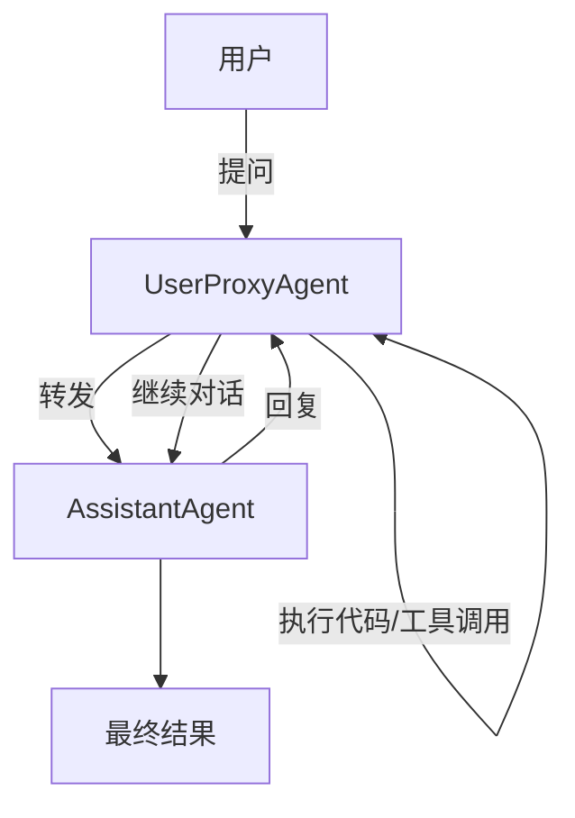
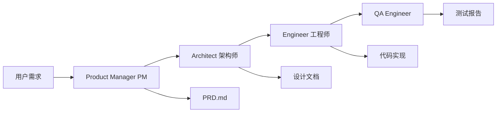
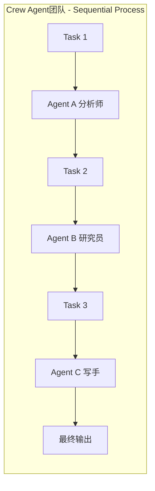
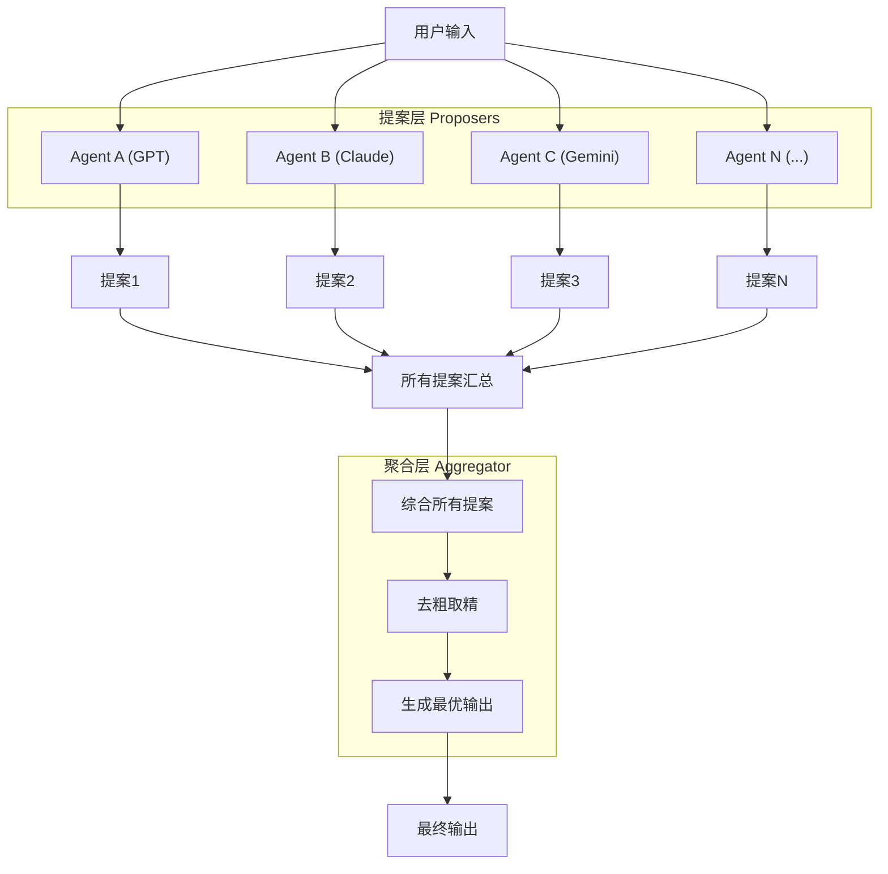
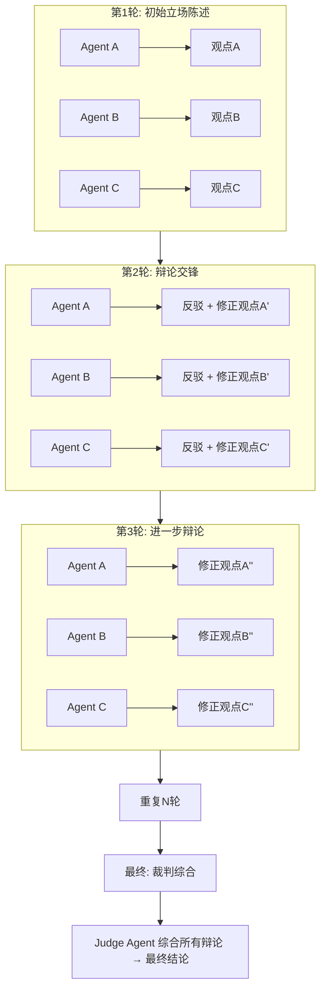
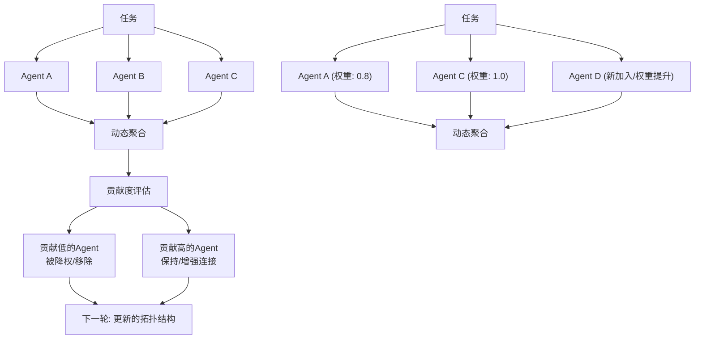

# 四、多智能体协作类 Agent 设计模式

多智能体协作（Multi-Agent Collaboration）是当前 AI Agent 领域最活跃的研究方向之一。与单一 Agent 模式不同，多智能体模式通过多个 Agent 之间的交互——对话、辩论、分工、聚合——来获得比单个 Agent 更高质量的产出。核心动机在于：**不同模型或不同角色视角的碰撞能够纠正偏见、弥补盲区、激发创意**。

本章详细讲解六种主流的多智能体协作设计模式，每种模式都配有可运行的 Python 示例代码。

---

## 4.1 AutoGen (Microsoft)

### 概念说明

AutoGen 是微软研究院于 2023 年开源的多 Agent 对话编程框架。其核心设计哲学是：**将 Agent 之间的对话作为第一公民（Conversation as First-Class Citizen）**。在 AutoGen 中，多个 Agent 通过结构化的对话来完成复杂任务，Agent 之间可以相互调用、追问、验证，并支持"人在回路"（Human-in-the-Loop）的交互模式。

AutoGen 的关键抽象包括：
- **ConversableAgent**：基础 Agent，能发送/接收消息、生成回复。
- **AssistantAgent**：基于 LLM 的 Agent，作为任务执行者。
- **UserProxyAgent**：用户代理，可执行代码、调用工具，充当人与 Agent 之间的桥梁。
- **GroupChat**：群聊管理器，协调多个 Agent 的对话顺序。

### 核心流程



1. 用户通过 UserProxyAgent 发起任务
2. AssistantAgent 接收任务并生成方案（可能包含代码）
3. UserProxyAgent 执行 AssistantAgent 建议的代码
4. 执行结果返回给 AssistantAgent，形成迭代闭环
5. 多轮对话直至任务完成
6. 可选：人工介入审批关键步骤

### 完整示例代码

### 环境配置

```python
"""
AutoGen 多Agent对话编程示例
演示两个Agent通过对话协作解决数学问题
需要安装: pip install pyautogen openai
"""

import os
import autogen

# 配置LLM——这里以OpenAI兼容接口为例
config_list = [
    {
        "model": "gpt-4o",
        "api_key": os.environ.get("OPENAI_API_KEY", "your-api-key"),
        "base_url": os.environ.get("OPENAI_BASE_URL", None),
    }
]

# 创建LLM配置
llm_config = {
    "config_list": config_list,
    "temperature": 0,
}
```

### 创建 Agent

```python
# ---- 创建Agent ----

# AssistantAgent: 基于LLM的助手，负责任务推理与解答
assistant = autogen.AssistantAgent(
    name="assistant",
    system_message="你是一位擅长数学和编程的AI助手。请用Python代码解决用户的问题，"
                   "代码中使用print()输出最终答案。",
    llm_config=llm_config,
)

# UserProxyAgent: 用户代理，负责执行代码并与用户交互
user_proxy = autogen.UserProxyAgent(
    name="user_proxy",
    human_input_mode="NEVER",  # 自动模式，不等待人工输入
    max_consecutive_auto_reply=5,
    is_termination_msg=lambda msg: msg.get("content") is not None
                                   and "TERMINATE" in msg["content"],
    code_execution_config={
        "work_dir": "coding",
        "use_docker": False,  # 不使用Docker，直接在本地执行
    },
    system_message="如果assistant给出了Python代码，请执行它并返回结果。",
)
```

### 启动对话

```python
# ---- 启动对话 ----
print("=" * 60)
print("AutoGen 多Agent对话示例")
print("=" * 60)

task = """
请解答以下数学问题：
一个农场有鸡和兔子共35只，腿的数量总计94条。请问鸡和兔子各有多少只？
请编写Python代码求解并输出答案。
"""

user_proxy.initiate_chat(
    assistant,
    message=task,
)

print("\n对话完成！")
```

**关键要点**：
- `human_input_mode="NEVER"` 表示完全自动化，无需人工介入；设为 `"ALWAYS"` 或 `"TERMINATE"` 可实现人在回路。
- `is_termination_msg` 定义何时终止对话——当回复中包含 "TERMINATE" 关键词时停止。
- UserProxyAgent 的核心价值在于**代码执行能力**，这让 AI 的代码方案能够被验证并得到反馈。

---

## 4.2 MetaGPT

### 概念说明

MetaGPT 是一个极具特色的多 Agent 框架，核心思想是：**模拟一家软件公司的标准化作业流程（SOP），让多个 Agent 扮演不同角色——产品经理（PM）、架构师（Architect）、工程师（Engineer）、测试工程师（QA）等——按顺序协作，从需求文档一路生成到可运行的代码**。

与传统 Agent 框架的最大区别在于 MetaGPT 引入了**结构化的中间产物（Structured Output）**：
- PM 输出 PRD（产品需求文档）和设计文档
- 架构师输出系统架构设计
- 工程师输出具体代码实现
- QA 输出测试用例

每个角色的输出都作为下游角色的输入，形成了类似真实软件公司的文档驱动开发流程。

### 核心流程



1. **需求阶段**：PM Agent 分析用户需求，生成结构化的 PRD 文档
2. **设计阶段**：架构师 Agent 基于 PRD 生成系统架构和设计文档
3. **开发阶段**：工程师 Agent 根据设计文档编写代码
4. **测试阶段**：QA Agent 审查代码并生成测试用例
5. **审查与修订**：各角色可相互审查，产出物通过消息传递

### 完整示例代码

### 环境配置与 LLM 调用

```python
"""
MetaGPT 模拟软件公司SOP示例
模拟PM→架构师→工程师的多角色协作流程
需要安装: pip install openai
"""

import os
import json
import re
from openai import OpenAI

# 初始化OpenAI客户端
client = OpenAI(
    api_key=os.environ.get("OPENAI_API_KEY", "your-api-key"),
    base_url=os.environ.get("OPENAI_BASE_URL", None),
)

DEFAULT_MODEL = "gpt-4o"


def call_llm(system_prompt: str, user_message: str, temperature: float = 0.3) -> str:
    """调用LLM的统一入口"""
    response = client.chat.completions.create(
        model=DEFAULT_MODEL,
        messages=[
            {"role": "system", "content": system_prompt},
            {"role": "user", "content": user_message},
        ],
        temperature=temperature,
    )
    return response.choices[0].message.content
```

### 产品经理 Agent

```python
# ---- 角色Agent定义 ----

class ProductManager:
    """产品经理 Agent：负责生成PRD文档"""

    def __init__(self):
        self.system_prompt = """你是一位资深产品经理。你的职责是：
1. 分析用户需求，理解业务场景
2. 撰写结构化产品需求文档（PRD）
3. PRD应包含：功能概述、用户故事、功能清单、非功能性需求
请直接输出Markdown格式的PRD文档。"""

    def generate_prd(self, requirement: str) -> str:
        user_message = f"请根据以下需求，生成一份完整的PRD文档：\n\n{requirement}"
        return call_llm(self.system_prompt, user_message)
```

### 架构师 Agent

```python
class Architect:
    """架构师 Agent：负责系统设计"""

    def __init__(self):
        self.system_prompt = """你是一位系统架构师。你的职责是：
1. 基于PRD文档设计系统架构
2. 确定技术栈、模块划分、数据流
3. 输出架构设计文档，包含：架构概述、模块设计、数据模型、接口定义
请直接输出Markdown格式的设计文档。"""

    def design(self, prd: str) -> str:
        user_message = f"请基于以下PRD文档，完成系统架构设计：\n\n{prd}"
        return call_llm(self.system_prompt, user_message)
```

### 工程师 Agent

```python
class Engineer:
    """工程师 Agent：负责代码实现"""

    def __init__(self):
        self.system_prompt = """你是一位高级软件工程师。你的职责是：
1. 根据架构设计文档实现代码
2. 编写清晰、可运行、有注释的Python代码
3. 输出完整的代码文件，包含必要的类和函数定义
请直接输出代码，用```python代码块包裹。"""

    def implement(self, design_doc: str) -> str:
        user_message = f"请根据以下架构设计文档，实现完整的代码：\n\n{design_doc}"
        return call_llm(self.system_prompt, user_message)
```

### QA 工程师 Agent

```python
class QAEngineer:
    """QA Agent：负责审查与测试"""

    def __init__(self):
        self.system_prompt = """你是一位QA工程师。你的职责是：
1. 审查代码质量，发现潜在问题
2. 生成测试用例（单元测试、集成测试）
3. 输出QA报告：问题清单 + 测试代码
请直接输出Markdown格式的QA报告和测试代码。"""

    def review(self, code: str, design_doc: str) -> str:
        user_message = (
            f"请审查以下代码，并生成测试用例：\n\n"
            f"## 设计文档\n{design_doc}\n\n## 代码\n{code}"
        )
        return call_llm(self.system_prompt, user_message)
```

### MetaGPT 主流程

```python
# ---- MetaGPT 主流程 ----

def metagpt_process(requirement: str):
    """模拟MetaGPT的SOP流程：PM → 架构师 → 工程师 → QA"""
    print("=" * 60)
    print("MetaGPT 软件公司SOP模拟")
    print("=" * 60)

    # 阶段1: PM生成PRD
    print("\n[阶段1] 产品经理正在撰写PRD...")
    pm = ProductManager()
    prd = pm.generate_prd(requirement)
    print("✅ PRD生成完毕")
    print(f"   PRD长度: {len(prd)} 字符\n")

    # 阶段2: 架构师设计
    print("[阶段2] 架构师正在进行系统设计...")
    architect = Architect()
    design = architect.design(prd)
    print("✅ 设计文档生成完毕")
    print(f"   设计文档长度: {len(design)} 字符\n")

    # 阶段3: 工程师实现
    print("[阶段3] 工程师正在编写代码...")
    engineer = Engineer()
    code = engineer.implement(design)
    print("✅ 代码实现完毕")
    print(f"   代码长度: {len(code)} 字符\n")

    # 阶段4: QA审查
    print("[阶段4] QA正在进行审查...")
    qa = QAEngineer()
    review = qa.review(code, design)
    print("✅ QA审查完毕\n")

    # 汇总输出
    results = {
        "prd": prd,
        "design": design,
        "code": code,
        "review": review,
    }

    print("\n" + "=" * 60)
    print("各阶段产出预览")
    print("=" * 60)

    for key, value in results.items():
        preview = value[:200].replace("\n", " ")
        print(f"\n--- {key.upper()} (前200字符) ---")
        print(f"{preview}...")

    return results
```

### 运行示例

```python
# ---- 运行示例 ----
if __name__ == "__main__":
    requirement = """
    开发一个简单的「待办事项管理」命令行工具，功能要求：
    1. 用户可以添加待办事项（标题、优先级）
    2. 可以查看所有待办事项列表
    3. 可以标记事项为已完成
    4. 可以删除事项
    5. 数据存储在本地JSON文件中
    """
    metagpt_process(requirement)
```

**关键要点**：
- 每个 Agent 有明确的**角色定义（system_prompt）**，模拟真实团队角色
- 上游产出作为下游输入，形成**文档链（Document Chain）**
- 真实 MetaGPT 框架还包含 Role、Action、Memory 等抽象层级，这里呈现的是核心思想

---

## 4.3 CrewAI

### 概念说明

CrewAI 是当下最流行的多 Agent 编排框架之一，其核心理念是：**Role-Goal-Backstory（角色-目标-背景故事）**。与 MetaGPT 严格遵守软件公司 SOP 不同，CrewAI 更加通用和灵活，可以组织任意类型的 Agent 团队来完成各种任务。

CrewAI 的核心概念：
- **Agent**：具有角色（Role）、目标（Goal）、背景故事（Backstory）的 AI 代理
- **Task**：具体任务，可指定执行 Agent、期望输出、依赖关系
- **Crew**：Agent 团队，定义执行模式和协作方式
- **Process**：执行流程——Sequential（顺序）或 Hierarchical（层级）

CrewAI 的特色在于**角色驱动**——每个 Agent 都有丰满的"人设"，使 Agent 的回复更具目的性和一致性。

### 核心流程



1. **定义 Agent**：为每个 Agent 设定 Role、Goal、Backstory
2. **定义 Task**：将大任务拆分为子任务，指定执行 Agent
3. **组建 Crew**：将所有 Agent 和 Task 组合成团队
4. **执行**：Crew 按 process 模式（顺序/层级）执行任务
5. **输出**：获取每个 Task 的结果，汇总为最终产出

### 完整示例代码

### 环境配置与 LLM 调用

```python
"""
CrewAI 角色驱动的多Agent协作示例
演示Role-Goal-Backstory模式下的团队协作
需要安装: pip install openai
"""

import os
import json
from openai import OpenAI

client = OpenAI(
    api_key=os.environ.get("OPENAI_API_KEY", "your-api-key"),
    base_url=os.environ.get("OPENAI_BASE_URL", None),
)

DEFAULT_MODEL = "gpt-4o"


def call_llm(system_prompt: str, user_message: str, temperature: float = 0.3) -> str:
    response = client.chat.completions.create(
        model=DEFAULT_MODEL,
        messages=[
            {"role": "system", "content": system_prompt},
            {"role": "user", "content": user_message},
        ],
        temperature=temperature,
    )
    return response.choices[0].message.content
```

### Agent 类

```python
# ---- Agent 定义 ----

class CrewAgent:
    """CrewAI风格的Agent：Role + Goal + Backstory"""

    def __init__(self, name: str, role: str, goal: str, backstory: str):
        self.name = name
        self.role = role
        self.goal = goal
        self.backstory = backstory
        self.system_prompt = self._build_system_prompt()

    def _build_system_prompt(self) -> str:
        return f"""你是 {self.name}。
你的角色: {self.role}
你的目标: {self.goal}
你的背景: {self.backstory}

请严格按照你的角色定位来完成任务。输出时以你的角色身份进行。"""

    def execute(self, task_description: str, context: str = "") -> str:
        user_message = f"任务: {task_description}"
        if context:
            user_message += f"\n\n上下文信息（前面步骤的结果）:\n{context}"
        return call_llm(self.system_prompt, user_message)
```

### Task 类

```python
class Task:
    """CrewAI风格的Task定义"""

    def __init__(self, description: str, agent: CrewAgent,
                 expected_output: str = "", context_task_idx: int = None):
        self.description = description
        self.agent = agent
        self.expected_output = expected_output
        self.context_task_idx = context_task_idx
        self.result = None
```

### Crew 类

```python
class Crew:
    """CrewAI风格的Agent团队"""

    def __init__(self, agents: list, tasks: list, process: str = "sequential"):
        self.agents = agents
        self.tasks = tasks
        self.process = process  # "sequential" 或 "hierarchical"
        self.results = []

    def run(self) -> list:
        if self.process == "sequential":
            return self._run_sequential()
        else:
            return self._run_hierarchical()

    def _run_sequential(self) -> list:
        """顺序执行任务，前一个任务的结果作为下一个任务的上下文"""
        context = ""
        for i, task in enumerate(self.tasks):
            print(f"  [{i+1}/{len(self.tasks)}] {task.agent.name} "
                  f"({task.agent.role}) 正在执行: {task.description[:50]}...")

            # 合并前置任务的结果作为上下文
            if task.context_task_idx is not None:
                context = self.tasks[task.context_task_idx].result

            task.result = task.agent.execute(task.description, context)
            context += f"\n\n步骤{i+1}的结果:\n{task.result}"
            self.results.append(task.result)
            print(f"  ✅ 完成")

        return self.results

    def _run_hierarchical(self) -> list:
        """层级执行：由管理者Agent分配任务"""
        # 简化实现：选择第一个Agent作为管理者
        manager = self.agents[0]
        all_tasks = "\n".join([
            f"任务{t.idx}: {t.description} (分配给: {t.agent.name})"
            for t_idx, t in enumerate(self.tasks)
        ])
        manager_result = manager.execute(
            f"作为团队管理者，请协调以下任务并给出执行计划：\n{all_tasks}",
            ""
        )
        print(f"管理者计划:\n{manager_result[:300]}...\n")

        # 然后顺序执行
        return self._run_sequential()
```

### 创建 Agent 实例

```python
# ---- 定义Agent团队 ----

def create_research_crew():
    """创建一个市场调研Agent团队"""

    # Agent 1: 市场分析师
    market_analyst = CrewAgent(
        name="市场分析师Alex",
        role="市场研究分析师",
        goal="深入分析目标市场，提供数据驱动的洞察",
        backstory="你拥有10年科技行业市场分析经验，曾在麦肯锡和BCG工作，"
                  "擅长TAM估算和竞争格局分析。",
    )

    # Agent 2: 技术研究员
    tech_researcher = CrewAgent(
        name="技术研究员Blake",
        role="前沿技术研究员",
        goal="评估技术可行性，识别技术风险和机会",
        backstory="你是一位计算机科学博士，在顶级会议发表过20+篇论文，"
                  "专注于AI和系统架构研究。",
    )

    # Agent 3: 内容策略师
    content_strategist = CrewAgent(
        name="内容策略师Casey",
        role="内容与产品策略师",
        goal="综合市场和技术分析，产出可执行的战略建议报告",
        backstory="你是一名资深产品策略顾问，帮助过多家Fortune 500公司"
                  "制定产品战略，擅长将复杂分析转化为清晰建议。",
    )
```

### 定义任务与组建 Crew

```python
    # 创建任务
    task1 = Task(
        description="分析2025年中国AI Agent市场的规模、增长趋势、"
                    "主要玩家（如Coze、Dify、AutoGen等）和竞争格局。"
                    "请给出TAM估算和关键趋势。",
        agent=market_analyst,
        expected_output="市场分析报告（含市场规模、增长预测、竞争矩阵）",
    )

    task2 = Task(
        description="评估当前多Agent框架（AutoGen、CrewAI、MetaGPT等）"
                    "的技术成熟度、优劣势、技术债务和未来演进方向。"
                    "从工程角度分析各框架的适用场景。",
        agent=tech_researcher,
        expected_output="技术评估报告（含架构对比、成熟度评分、技术建议）",
        context_task_idx=0,
    )

    task3 = Task(
        description="综合市场分析和技术评估的结果，撰写一份完整的"
                    "「AI Agent框架选型建议书」，包含：\n"
                    "1. 市场机会概述\n"
                    "2. 各框架适用场景推荐\n"
                    "3. 实施路线图建议\n"
                    "4. 风险提示",
        agent=content_strategist,
        expected_output="战略建议书（含场景推荐、路线图、风险评估）",
        context_task_idx=1,
    )

    crew = Crew(
        agents=[market_analyst, tech_researcher, content_strategist],
        tasks=[task1, task2, task3],
        process="sequential",
    )

    return crew
```

### 运行示例

```python
# ---- 运行示例 ----
if __name__ == "__main__":
    print("=" * 60)
    print("CrewAI 角色驱动多Agent协作")
    print("=" * 60)

    crew = create_research_crew()

    print(f"\n团队成员:")
    for agent in crew.agents:
        print(f"  - {agent.name}: {agent.role}")
    print(f"\n任务数量: {len(crew.tasks)}")
    print(f"执行模式: {crew.process}\n")

    results = crew.run()

    print("\n" + "=" * 60)
    print("最终成果预览")
    print("=" * 60)
    for i, result in enumerate(results):
        preview = result[:200].replace("\n", " ")
        print(f"\n--- Task {i+1} 结果 (前200字符) ---")
        print(f"{preview}...")
```

**关键要点**：
- Role + Goal + Backstory 三元组赋予每个 Agent 独特的"人格"，提升回复质量
- Context 机制确保下游 Agent 能"看到"上游 Agent 的工作成果
- Sequential 是最基础的协作模式，CrewAI 还支持 Hierarchical（管理者分配任务）模式

---

## 4.4 Mixture of Agents (MoA)

### 概念说明

Mixture of Agents（MoA）是由 Together AI 于 2024 年提出的一种**并行提案 + 聚合综合**的多 Agent 架构。MoA 的灵感来源于 Mixture of Experts（MoE）——与其训练一个巨大的模型，不如组合多个小模型的输出。

MoA 的核心思想：
1. **提案层（Proposer Layer）**：多个"提案者"Agent 并行独立地生成不同的回答或方案
2. **聚合层（Aggregator Layer）**：一个"聚合者"Agent 综合所有提案，生成最终的高质量输出
3. 可以堆叠多个 MoA 层（Layer-1 Proposers → Layer-1 Aggregator → Layer-2 Proposers → ...），形成深层 MoA

MoA 的优势在于：不同 LLM（或同一 LLM 的不同配置）会从不同角度看待问题，聚合者可以取长补短，产生比任何单个模型更优的结果。

### 核心流程



1. 用户输入被同时发送给 N 个提案者 Agent
2. 每个提案者独立生成完整的回复
3. 所有提案被收集并传递给聚合者
4. 聚合者综合分析，生成最终输出
5. 可选：将聚合结果再次送入下一层 MoA，迭代优化

### 环境配置

```python
"""
Mixture of Agents (MoA) 示例
多提案Agent并行生成 + 聚合Agent综合
需要安装: pip install openai
"""

import os
from concurrent.futures import ThreadPoolExecutor, as_completed
from openai import OpenAI

client = OpenAI(
    api_key=os.environ.get("OPENAI_API_KEY", "your-api-key"),
    base_url=os.environ.get("OPENAI_BASE_URL", None),
)

DEFAULT_MODEL = "gpt-4o"


def call_llm(system_prompt: str, user_message: str,
             temperature: float = 0.5, model: str = None) -> str:
    """调用LLM"""
    response = client.chat.completions.create(
        model=model or DEFAULT_MODEL,
        messages=[
            {"role": "system", "content": system_prompt},
            {"role": "user", "content": user_message},
        ],
        temperature=temperature,
    )
    return response.choices[0].message.content
```

### 提案者 Agent

```python
# ---- MoA 核心实现 ----

class ProposerAgent:
    """提案者Agent：从特定视角/风格生成提案"""

    def __init__(self, name: str, perspective: str, temperature: float = 0.7):
        self.name = name
        self.perspective = perspective
        self.temperature = temperature
        self.system_prompt = (
            f"你是一位{perspective}。请从你的专业视角出发，"
            f"提供深入、有见地的分析和建议。表达要清晰、结构化。"
        )

    def propose(self, question: str) -> str:
        return call_llm(self.system_prompt, question, self.temperature)
```

### 聚合者 Agent

```python
class AggregatorAgent:
    """聚合者Agent：综合所有提案，生成最终结果"""

    def __init__(self, temperature: float = 0.2):
        self.temperature = temperature
        self.system_prompt = """你是一位资深战略顾问，你的任务是从多个专家的提案中
提炼精华，综合形成一份高质量、无冗余、见解深刻的最终报告。

你的工作方式：
1. 识别各提案中的共同点和分歧点
2. 保留最有价值的见解，舍弃重复和矛盾的
3. 整合为一份连贯、可执行的综合报告
4. 对于存在分歧的地方，给出你的专业判断和建议
5. 不要简单拼接，要真正的融合提炼"""

    def aggregate(self, question: str, proposals: dict) -> str:
        proposals_text = ""
        for name, proposal in proposals.items():
            proposals_text += f"\n### {name}的提案:\n{proposal}\n"

        user_message = (
            f"## 原始问题\n{question}\n\n"
            f"## 各位专家的提案\n{proposals_text}\n\n"
            f"请综合以上所有提案，生成最终的综合分析报告。"
        )
        return call_llm(self.system_prompt, user_message, self.temperature)
```

### MoA 主控制器

```python

class MoA:
    """Mixture of Agents 主控制器"""

    def __init__(self, proposers: list, aggregator: AggregatorAgent,
                 num_layers: int = 1, max_workers: int = 5):
        self.proposers = proposers
        self.aggregator = aggregator
        self.num_layers = num_layers
        self.max_workers = max_workers

    def run(self, question: str) -> dict:
        """
        运行MoA流程。支持多层：
        第1层: proposers → aggregator
        第2层: 基于第1层输出，重新propose → 再次aggregate
        """
        current_question = question
        all_layer_results = []

        for layer in range(self.num_layers):
            print(f"\n--- MoA 第 {layer + 1} 层 ---")

            # 阶段1: 并行提案
            print("  [提案阶段] 各Agent并行生成提案...")
            proposals = self._parallel_propose(current_question)

            for name, prop in proposals.items():
                print(f"    {name}: {len(prop)} 字符")

            # 阶段2: 聚合综合
            print("  [聚合阶段] Aggregator综合所有提案...")
            final_result = self.aggregator.aggregate(current_question, proposals)
            print(f"    聚合结果: {len(final_result)} 字符")

            all_layer_results.append({
                "layer": layer + 1,
                "proposals": proposals,
                "result": final_result,
            })

            # 为下一层准备：将当前结果作为新问题
            if layer < self.num_layers - 1:
                current_question = (
                    f"基于以下初步分析报告，请进一步深化和完善：\n\n{final_result}"
                )

        return all_layer_results[-1]  # 返回最后一层的结果
```

### MoA 并行提案方法

```python

    def _parallel_propose(self, question: str) -> dict:
        """使用线程池并行执行所有提案者"""
        proposals = {}
        with ThreadPoolExecutor(max_workers=self.max_workers) as executor:
            future_to_proposer = {
                executor.submit(p.propose, question): p
                for p in self.proposers
            }
            for future in as_completed(future_to_proposer):
                proposer = future_to_proposer[future]
                proposals[proposer.name] = future.result()
        return proposals
```

### 构建 MoA 实例

```python

# ---- 构建MoA实例 ----

def create_moa_team() -> MoA:
    """创建MOA团队：5个不同视角的提案者 + 1个聚合者"""

    proposers = [
        ProposerAgent("市场专家", "资深市场战略分析师，擅长市场趋势和市场定位分析", 0.7),
        ProposerAgent("技术专家", "资深技术架构师，擅长技术选型和可行性评估", 0.6),
        ProposerAgent("产品专家", "资深产品经理，擅长用户体验和产品策略", 0.8),
        ProposerAgent("财务专家", "资深财务分析师，擅长成本收益分析和ROI评估", 0.5),
        ProposerAgent("风险专家", "资深风控顾问，擅长识别和评估各类风险", 0.6),
    ]

    aggregator = AggregatorAgent(temperature=0.2)

    return MoA(proposers, aggregator, num_layers=1)
```

### 运行示例

```python

# ---- 运行示例 ----
if __name__ == "__main__":
    print("=" * 60)
    print("Mixture of Agents (MoA) 多Agent并行聚合")
    print("=" * 60)

    moa = create_moa_team()

    question = """
    一家中型SaaS公司（年收入5000万，200名员工）正在考虑
    将AI Agent能力集成到其产品中。请分析：
    1. 应该自研还是采购第三方Agent框架？
    2. 如何分阶段落地？
    3. 预期投入和回报？
    """

    print(f"\n问题: {question.strip()[:100]}...\n")

    result = moa.run(question)

    print("\n" + "=" * 60)
    print("MoA最终综合报告（预览）")
    print("=" * 60)
    print(result["result"][:800])
    print("\n... (完整报告可通过调整预览长度查看)")
```

**关键要点**：
- 提案者使用不同的 temperature 和 perspective，确保**观点多样性**
- 并行执行提案者（ThreadPoolExecutor），提高效率
- 聚合者的 temperature 设为较低的 0.2，偏向**确定性综合**而非创造性发散
- 多层 MoA 可以迭代深化分析质量，但会增加延迟和成本

---

## 4.5 Multi-Agent Debate (MAD)

### 概念说明

Multi-Agent Debate（MAD，多Agent辩论）是一种通过**对抗性讨论**来提升 LLM 输出质量的方法。其核心思想来源于人类社会的辩论机制——当多个持不同观点的专家对同一个问题进行辩论时，最终达成的共识往往比任何一个人的初始观点更准确、更全面。

MAD 的基本形式：
1. 多个 Agent 对同一问题给出各自的初始回答
2. Agent 们互相看到彼此的回答，并对他人的观点进行**评判和反驳**
3. 经过多轮辩论，Agent 们逐渐修正自己的观点
4. 最终由裁判（Judge）Agent 综合所有辩论，给出最终结论

研究表明，MAD 能显著提升 LLM 在数学推理、事实问答等任务上的准确率，尤其对幻觉问题有明显改善。

### 核心流程



### 环境配置

```python
"""
Multi-Agent Debate (MAD) 示例
多Agent辩论机制，通过对抗产生更优结果
需要安装: pip install openai
"""

import os
from openai import OpenAI

client = OpenAI(
    api_key=os.environ.get("OPENAI_API_KEY", "your-api-key"),
    base_url=os.environ.get("OPENAI_BASE_URL", None),
)

DEFAULT_MODEL = "gpt-4o"


def call_llm(system_prompt: str, user_message: str, temperature: float = 0.5) -> str:
    response = client.chat.completions.create(
        model=DEFAULT_MODEL,
        messages=[
            {"role": "system", "content": system_prompt},
            {"role": "user", "content": user_message},
        ],
        temperature=temperature,
    )
    return response.choices[0].message.content
```

### 辩论 Agent

```python
# ---- MAD Agent 实现 ----

class DebateAgent:
    """辩论Agent：持有特定立场，参与多轮辩论"""

    def __init__(self, name: str, stance: str, temperature: float = 0.7):
        self.name = name
        self.stance = stance
        self.temperature = temperature
        self.history = []  # 记录本Agent的所有发言

        self.system_prompt = f"""你是辩论选手 {name}，你的立场是: {stance}。

辩论规则：
1. 在每轮辩论中，你需要审视其他选手的观点
2. 对他人的论点进行有建设性的质疑或反驳
3. 吸收他人观点中的合理部分，修正自己的立场
4. 给出你修正后的观点
5. 保持建设性和专业性，避免人身攻击
6. 输出格式：
   【对他人观点的回应】...
   【我修正后的观点】..."""

    def initial_statement(self, question: str) -> str:
        """首轮：给出初始立场陈述"""
        user_message = f"请就以下问题，陈述你的初始立场和推理：\n\n{question}"
        result = call_llm(self.system_prompt, user_message, self.temperature)
        self.history.append({
            "round": 0,
            "role": "initial",
            "content": result,
        })
        return result

    def debate_round(self, question: str, others_statements: dict) -> str:
        """辩论轮次：审视他人观点，给出修正后的观点"""
        others_text = ""
        for name, statement in others_statements.items():
            others_text += f"\n### {name} 的观点:\n{statement}\n"

        user_message = (
            f"## 辩论问题\n{question}\n\n"
            f"## 你的初始立场\n{self.stance}\n\n"
            f"## 其他选手本轮的观点\n{others_text}\n\n"
            f"请回应其他选手的观点，并给出你修正后的立场。"
        )
        result = call_llm(self.system_prompt, user_message, self.temperature)
        round_num = len(self.history)
        self.history.append({
            "round": round_num,
            "role": "debate",
            "content": result,
        })
        return result
```

### 裁判 Agent

```python

class JudgeAgent:
    """裁判Agent：综合辩论过程，给出最终裁决"""

    def __init__(self):
        self.system_prompt = """你是一位公正的辩论裁判。你需要：
1. 回顾整个辩论过程，总结各Agent的核心论点
2. 分析哪些论点最有说服力
3. 指出辩论过程中观点的演变
4. 给出综合性的最终结论
请输出结构化的裁判意见。"""

    def judge(self, question: str, all_histories: dict,
              final_statements: dict) -> str:
        debate_summary = ""
        for name, history in all_histories.items():
            debate_summary += f"\n## {name} 的辩论历程\n"
            for entry in history:
                debate_summary += (
                    f"\n### 第{entry['round']}轮 ({entry['role']})\n"
                    f"{entry['content'][:500]}\n"
                )

        final_summary = ""
        for name, statement in final_statements.items():
            final_summary += f"\n### {name} 最终观点:\n{statement[:500]}\n"

        user_message = (
            f"## 辩论问题\n{question}\n\n"
            f"## 完整辩论过程\n{debate_summary}\n\n"
            f"## 各选手最终观点\n{final_summary}\n\n"
            f"请给出你的裁判意见和最终结论。"
        )
        return call_llm(self.system_prompt, user_message, temperature=0.2)
```

### MAD 辩论主控制器

```python

class MADebate:
    """Multi-Agent Debate 主控制器"""

    def __init__(self, agents: list, judge: JudgeAgent, max_rounds: int = 3):
        self.agents = agents
        self.judge = judge
        self.max_rounds = max_rounds

    def run(self, question: str) -> dict:
        print(f"辩论问题: {question[:100]}...\n")

        # 第0轮: 初始立场陈述
        print("[第0轮] 初始立场陈述")
        print("-" * 40)
        current_statements = {}
        for agent in self.agents:
            statement = agent.initial_statement(question)
            current_statements[agent.name] = statement
            print(f"  {agent.name}: {statement[:80]}...")

        # 第1~N轮: 辩论
        for round_num in range(1, self.max_rounds + 1):
            print(f"\n[第{round_num}轮] 辩论交锋")
            print("-" * 40)
            next_statements = {}
            for agent in self.agents:
                # 该Agent能看到除自己外所有人的上轮观点
                others = {
                    name: stmt for name, stmt in current_statements.items()
                    if name != agent.name
                }
                statement = agent.debate_round(question, others)
                next_statements[agent.name] = statement
                print(f"  {agent.name}: {statement[:80]}...")
            current_statements = next_statements

        # 裁判阶段
        print(f"\n[裁判阶段] 综合裁决")
        print("-" * 40)
        all_histories = {
            agent.name: agent.history for agent in self.agents
        }
        verdict = self.judge.judge(question, all_histories, current_statements)
        print(f"  裁判意见: {verdict[:200]}...")

        return {
            "question": question,
            "final_statements": current_statements,
            "histories": all_histories,
            "verdict": verdict,
        }
```

### 运行示例

```python

# ---- 运行示例 ----
if __name__ == "__main__":
    print("=" * 60)
    print("Multi-Agent Debate (MAD) 多Agent辩论")
    print("=" * 60)

    # 创建辩论Agent，各自有不同的立场
    agents = [
        DebateAgent("保守派张工",
                     "技术选型应优先考虑成熟稳定，选择有大规模实践验证的方案，"
                     "避免使用过于前沿但未经验证的技术。"),
        DebateAgent("激进派李博",
                     "技术选型应优先考虑前沿创新，采用最新技术可以获得竞争优势，"
                     "适度的技术风险是可接受的。"),
        DebateAgent("务实派王总",
                     "技术选型应平衡创新与稳定，核心系统用成熟技术，"
                     "非核心模块可以尝试新技术。应根据具体场景灵活决策。"),
    ]

    judge = JudgeAgent()
    debate = MADebate(agents, judge, max_rounds=2)

    question = """
    一个创业团队要选择一个Web框架来构建新产品。
    选项：1) 成熟的Django  2) 高性能的FastAPI  3) 全栈的Next.js
    请从你代表的立场出发，给出推荐和理由。
    """

    result = debate.run(question)

    print("\n" + "=" * 60)
    print("辩论最终裁决")
    print("=" * 60)
    print(result["verdict"])
```

**关键要点**：
- 3 个 Agent 分别代表**不同的决策立场**（保守、激进、务实），保证观点多样性
- 每轮辩论中，Agent 能看到所有其他人的观点，这模拟了**完全信息**辩论
- 裁判 Agent 的 temperature 低（0.2），确保裁决的一致性和可靠性
- MAD 轮次不宜过多，通常 2-3 轮即可收敛

---

## 4.6 DyLAN (Dynamic Agent Network)

### 概念说明

DyLAN（Dynamic LLM-Agent Network）是一种**动态 Agent 网络**架构，与传统固定结构的多 Agent 系统不同，DyLAN 中的 Agent 连接关系是**动态变化**的——根据任务需求和子问题特征，系统自动构建和调整 Agent 之间的通信拓扑。

DyLAN 的核心创新：
- **动态拓扑**：Agent 之间的连接不是预设的，而是根据任务自动生成
- **贡献度评估**：系统持续评估每个 Agent 的贡献度，贡献低的 Agent 可能被降权或移除
- **前向传播 + 后向传播**：类似于神经网络，前向阶段 Agent 生成方案，后向阶段评估和调整
- **早停机制**：当 Agent 网络趋于稳定（贡献度不再显著变化）时自动停止

### 核心流程



### 环境配置

```python
"""
DyLAN 动态Agent连接网络示例
Agent之间的连接关系根据贡献度动态调整
需要安装: pip install openai
"""

import os
import math
import numpy as np
from concurrent.futures import ThreadPoolExecutor, as_completed
from openai import OpenAI

client = OpenAI(
    api_key=os.environ.get("OPENAI_API_KEY", "your-api-key"),
    base_url=os.environ.get("OPENAI_BASE_URL", None),
)

DEFAULT_MODEL = "gpt-4o"


def call_llm(system_prompt: str, user_message: str,
             temperature: float = 0.5, model: str = None) -> str:
    response = client.chat.completions.create(
        model=model or DEFAULT_MODEL,
        messages=[
            {"role": "system", "content": system_prompt},
            {"role": "user", "content": user_message},
        ],
        temperature=temperature,
    )
    return response.choices[0].message.content
```

### DyLAN Agent 节点

```python
# ---- DyLAN 核心实现 ----

class DyLANAgent:
    """DyLAN网络中的Agent节点"""

    def __init__(self, agent_id: str, expertise: str, temperature: float = 0.5):
        self.agent_id = agent_id
        self.expertise = expertise
        self.temperature = temperature
        self.weight = 1.0  # 当前权重
        self.contribution_score = 0.0  # 贡献度评分
        self.active = True  # 是否活跃

        self.system_prompt = (
            f"你是Agent {agent_id}，专长领域: {expertise}。"
            f"请从你的专业角度分析问题并提供解决方案。"
        )

    def solve(self, problem: str, context: str = "") -> str:
        """基于当前问题生成解决方案"""
        user_message = f"问题: {problem}"
        if context:
            user_message += f"\n\n参考上下文:\n{context}"
        return call_llm(self.system_prompt, user_message, self.temperature)

    def evaluate(self, problem: str, all_solutions: dict) -> float:
        """自我评估：判断自己的方案相对于其他方案的贡献度"""
        others = ""
        for aid, sol in all_solutions.items():
            if aid != self.agent_id:
                others += f"\n### {aid}的方案:\n{sol[:300]}\n"

        user_message = (
            f"问题: {problem}\n\n"
            f"## 你的方案\n{all_solutions.get(self.agent_id, '')[:300]}\n\n"
            f"## 其他Agent的方案\n{others}\n\n"
            f"请评估你的方案相对于其他方案的贡献度。"
            f"输出一个0到1之间的浮点数，只输出数字。"
        )
        try:
            result = call_llm(
                "你是一个客观的自我评估系统。请仅输出一个0到1之间的浮点数。",
                user_message, temperature=0.1
            )
            score = float(result.strip())
            return max(0.0, min(1.0, score))
        except ValueError:
            return 0.5
```

### 贡献度评估器

```python

class DyLANEvaluator:
    """外部评估器：计算每个Agent的贡献度"""

    def __init__(self):
        self.system_prompt = """你是一个Agent贡献度评估系统。
请评估以下各Agent对解决问题的贡献度。

评估维度：
1. 方案的创新性
2. 方案的可行性
3. 方案与问题的相关性
4. 方案的完整性

输出JSON格式，key为agent_id，value为0-1之间的贡献度分数。
示例: {"agent_1": 0.8, "agent_2": 0.6}"""

    def evaluate(self, problem: str, solutions: dict) -> dict:
        solutions_text = ""
        for aid, sol in solutions.items():
            solutions_text += f"\n### Agent {aid}:\n{sol[:400]}\n"

        user_message = (
            f"问题: {problem}\n\n"
            f"各Agent方案:\n{solutions_text}\n\n"
            f"请评估每个Agent的贡献度，输出JSON。"
        )
        result = call_llm(self.system_prompt, user_message, temperature=0.1)

        # 解析JSON
        import json
        try:
            # 提取JSON部分
            start = result.find("{")
            end = result.rfind("}") + 1
            if start >= 0 and end > start:
                scores = json.loads(result[start:end])
                return scores
        except json.JSONDecodeError:
            pass

        # 解析失败，返回均匀分布
        return {aid: 1.0 / len(solutions) for aid in solutions}
```

### DyLAN 动态网络 — 初始化与主流程

```python

class DyLANNetwork:
    """动态Agent连接网络"""

    def __init__(self, agents: list, evaluator: DyLANEvaluator,
                 max_iterations: int = 5, convergence_threshold: float = 0.01,
                 min_weight: float = 0.3, max_workers: int = 5):
        self.agents = {agent.agent_id: agent for agent in agents}
        self.evaluator = evaluator
        self.max_iterations = max_iterations
        self.convergence_threshold = convergence_threshold
        self.min_weight = min_weight
        self.max_workers = max_workers
        self.history = []  # 记录每轮的权重变化

    def run(self, problem: str) -> dict:
        """运行DyLAN主流程"""
        print(f"初始Agent网络: {len(self.agents)} 个节点")

        for iteration in range(1, self.max_iterations + 1):
            print(f"\n--- 迭代 {iteration} ---")
            active_agents = {
                aid: a for aid, a in self.agents.items() if a.active
            }

            if len(active_agents) == 0:
                print("所有Agent都已被停用！")
                break

            # 阶段1: 前向传播——所有活跃Agent并行生成方案
            print("  [前向传播] Agent并行求解...")
            solutions = self._parallel_solve(problem, active_agents)

            # 阶段2: 贡献度评估
            print("  [贡献度评估] 计算各Agent贡献度...")
            scores = self.evaluator.evaluate(problem, solutions)

            # 阶段3: 后向传播——更新权重和活跃状态
            print("  [后向传播] 更新Agent权重...")
            weight_changes = self._update_weights(scores)

            # 记录本轮状态
            round_info = {
                "iteration": iteration,
                "active_agents": list(active_agents.keys()),
                "scores": scores,
                "weights": {aid: a.weight for aid, a in self.agents.items()},
            }
            self.history.append(round_info)

            # 检查收敛
            max_change = max(weight_changes.values()) if weight_changes else 0
            print(f"    最大权重变化: {max_change:.4f}")
            if max_change < self.convergence_threshold:
                print(f"    网络已收敛，停止迭代。")
                break

        # 最终聚合：加权综合所有Agent的方案
        print("\n[最终聚合] 加权综合所有方案...")
        final_result = self._final_aggregate(problem)

        return {
            "problem": problem,
            "history": self.history,
            "final_result": final_result,
        }
```

### DyLAN 动态网络 — 内部方法

```python

    def _parallel_solve(self, problem: str, agents: dict) -> dict:
        """并行让所有活跃Agent求解"""
        solutions = {}
        with ThreadPoolExecutor(max_workers=self.max_workers) as executor:
            future_to_aid = {
                executor.submit(a.solve, problem): aid
                for aid, a in agents.items()
            }
            for future in as_completed(future_to_aid):
                aid = future_to_aid[future]
                solutions[aid] = future.result()
        return solutions

    def _update_weights(self, scores: dict) -> dict:
        """根据贡献度更新每个Agent的权重"""
        changes = {}
        avg_score = sum(scores.values()) / max(len(scores), 1)

        for aid, score in scores.items():
            agent = self.agents[aid]
            old_weight = agent.weight

            # 权重更新公式：向贡献度方向调整
            new_weight = 0.7 * old_weight + 0.3 * score

            # 低于阈值的Agent被停用
            if new_weight < self.min_weight:
                agent.active = False
                agent.weight = 0.0
                changes[aid] = abs(old_weight)
                print(f"    Agent {aid} 权重过低 ({new_weight:.3f})，已被停用。")
            else:
                agent.weight = new_weight
                changes[aid] = abs(new_weight - old_weight)

        return changes
```

### DyLAN 动态网络 — 最终聚合

```python

    def _final_aggregate(self, problem: str) -> str:
        """加权聚合所有Agent的最终方案"""
        # 收集所有活跃Agent的方案
        active_agents = {
            aid: a for aid, a in self.agents.items() if a.active
        }
        if not active_agents:
            # 如果所有都被停用，使用历史中得分最高的
            return "所有Agent均未产生有效方案。"

        solutions = self._parallel_solve(problem, active_agents)

        # 构建聚合提示
        weighted_solutions = ""
        for aid, sol in solutions.items():
            w = self.agents[aid].weight
            weighted_solutions += f"\n### Agent {aid} (权重: {w:.2f})\n{sol}\n"

        user_message = (
            f"问题: {problem}\n\n"
            f"以下是各Agent的加权方案:\n{weighted_solutions}\n\n"
            f"请综合以上方案（高权重Agent的意见应获得更多采纳），"
            f"生成一份综合性的最终解决方案。"
        )

        system_prompt = """你是一个专家系统，负责综合多个Agent的意见。
请根据各Agent的权重，合理采纳意见，生成最佳的综合方案。"""
        return call_llm(system_prompt, user_message, temperature=0.2)
```

### 运行示例

```python

# ---- 运行示例 ----
if __name__ == "__main__":
    print("=" * 60)
    print("DyLAN 动态Agent连接网络")
    print("=" * 60)

    # 创建Agent网络
    agents = [
        DyLANAgent("A1", "系统架构设计", 0.3),
        DyLANAgent("A2", "性能优化", 0.5),
        DyLANAgent("A3", "安全性分析", 0.4),
        DyLANAgent("A4", "成本评估", 0.6),
        DyLANAgent("A5", "用户体验设计", 0.5),
        DyLANAgent("A6", "数据工程", 0.4),
    ]

    evaluator = DyLANEvaluator()

    network = DyLANNetwork(
        agents=agents,
        evaluator=evaluator,
        max_iterations=3,
        convergence_threshold=0.02,
        min_weight=0.35,
    )

    problem = """
    设计一个支持100万日活用户的实时消息系统，
    需要考虑高可用、低延迟、数据一致性、成本控制。
    请给出技术方案。
    """

    print(f"\n问题: {problem.strip()[:80]}...\n")

    result = network.run(problem)

    print("\n" + "=" * 60)
    print("DyLAN 最终方案")
    print("=" * 60)
    print(f"\n最终活跃Agent: {[aid for aid, a in network.agents.items() if a.active]}")
    print(f"\n最终权重:")
    for aid, a in network.agents.items():
        print(f"  {aid}: {a.weight:.3f} {'✓' if a.active else '✗ 已停用'}")
    print(f"\n方案预览:\n{result['final_result'][:600]}...")
```

**关键要点**：
- 每个 Agent 有独立的 weight，反映其在网络中的重要性
- 贡献度评估使用外部评估器，模拟"同行评议"机制
- 权重低于阈值的 Agent 被自动停用，实现了**动态剪枝**
- 收敛检查确保网络在稳定后停止迭代，避免浪费
- 最终聚合采用加权综合，高权重 Agent 的意见获得更多采纳

---

## 总结对比表

| 特性 | AutoGen | MetaGPT | CrewAI | MoA | MAD | DyLAN |
|------|---------|---------|--------|-----|-----|-------|
| **核心思想** | 对话即编程 | 模拟软件公司SOP | 角色-目标-背景故事 | 并行提案+聚合 | 对抗性辩论 | 动态网络拓扑 |
| **Agent数量** | 灵活（通常2-5） | 固定角色（4+） | 灵活（通常3-5） | 灵活（提案者N+聚合者1） | 灵活（通常3+裁判1） | 灵活（可动态增减） |
| **协作方式** | 自由对话 | 严格流水线 | 顺序/层级 | 并行+串行 | 多轮同步辩论 | 动态拓扑传播 |
| **输出质量保证** | 代码执行反馈 | 文档驱动+角色审查 | 角色专业化 | 多视角聚合 | 辩论对抗纠错 | 贡献度评估+剪枝 |
| **人在回路** | 原生支持 | 有限支持 | 有限支持 | 有限支持 | 有限支持 | 有限支持 |
| **框架成熟度** | ⭐⭐⭐⭐⭐ 非常成熟 | ⭐⭐⭐⭐ 成熟 | ⭐⭐⭐⭐ 成熟 | ⭐⭐ 学术原型 | ⭐⭐ 学术原型 | ⭐ 研究概念 |
| **适用场景** | 代码生成、数据分析、复杂推理 | 软件开发全流程 | 通用多Agent任务 | 需要多角度分析的战略决策 | 需要高准确率的事实推理 | 不确定环境下的动态问题 |
| **计算开销** | 中 | 高 | 中 | 高（并行） | 中 | 中（动态剪枝可降低） |
| **典型延迟** | 秒级 | 分钟级 | 秒-分钟级 | 秒级（并行） | 分钟级 | 秒-分钟级 |
| **代表框架/论文** | `pyautogen` | `metagpt` | `crewai` | Together AI 2024 | 多篇论文 | DyLAN论文 |
| **核心优势** | 自动代码执行反馈 | 完整软件工程流程 | 易于上手，角色驱动 | 多视角避免偏见 | 对抗纠错，降低幻觉 | 自适应网络，资源高效 |
| **主要局限** | 依赖代码执行环境 | 流程固化，灵活性低 | 角色设计依赖经验 | 缺少迭代验证 | 可能陷入循环辩论 | 贡献度评估可能不准确 |

**选型建议**：
- 需要**代码自动生成和执行** → AutoGen
- 需要**完整软件项目开发** → MetaGPT
- 需要**快速搭建多Agent团队** → CrewAI
- 需要**多视角战略分析** → MoA
- 需要**高准确率事实推理** → MAD
- 需要**自适应动态协作** → DyLAN

---

> **文档说明**：本文档为「Agent 设计模式」系列之四，聚焦多智能体协作类设计模式。每种模式的示例代码均基于 OpenAI 兼容 API，可直接运行（需替换 API Key）。代码旨在演示核心思想，经过简化以突出重点，生产环境中建议使用对应框架的完整实现。