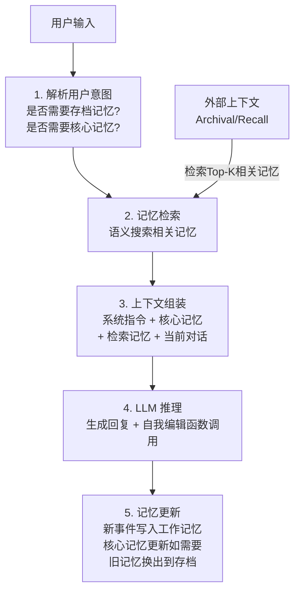
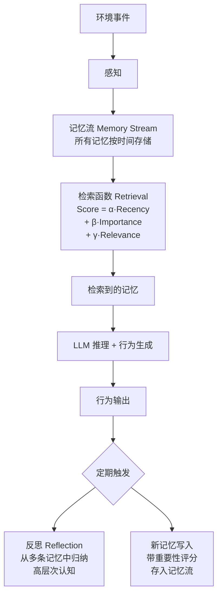
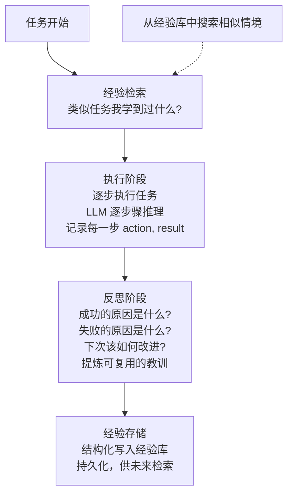
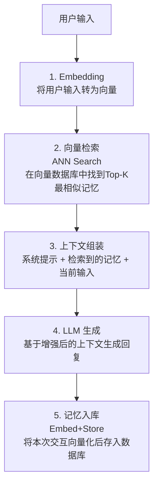
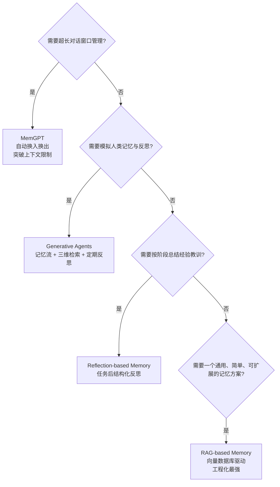

<style>
pre { max-height: unset !important; overflow: visible !important; }
.vscode-body pre { max-height: unset !important; overflow: visible !important; }
</style>

# 五、记忆与状态管理类 Agent 设计模式

随着 Agent 交互轮次增多、上下文窗口逐渐膨胀，如何让 Agent "记住该记住的、忘掉该忘掉的" 成为核心挑战。记忆与状态管理类设计模式旨在为 Agent 建立持久、高效、可检索的记忆体系，使其在长周期任务中保持一致的认知和推理能力。

本章介绍四种主流的记忆管理范式：

| 模式 | 核心思想 | 适用场景 |
|------|---------|---------|
| MemGPT | 模拟操作系统虚拟内存，分层管理记忆 | 超长对话、需要上下文换入换出 |
| Generative Agents | 记忆流 + 检索 + 反思，模拟人类记忆 | 角色扮演、长期自主 Agent |
| Reflection-based Memory | 按阶段自我反思，提炼教训存储 | 多步骤任务、持续改进型 Agent |
| RAG-based Memory | 向量数据库驱动，按语义检索历史 | 知识密集型、需要精确历史召回 |

---

## 5.1 MemGPT — 分层虚拟记忆

### 5.1.1 概念说明

**MemGPT** (Memory-GPT) 的核心灵感来自操作系统的虚拟内存管理机制。传统 LLM 受限于固定的上下文窗口长度（如 4K、8K、128K token），当对话或任务超出窗口时，早期信息会被截断或遗忘。MemGPT 提出了一种优雅的解决方案：**将 LLM 的上下文窗口视为"物理内存(RAM)"，将外部存储视为"虚拟内存(Disk)"，通过类似 OS 页面置换的策略在二者之间自动换入换出数据。**

MemGPT 将记忆划分为两个层次：

- **主上下文(Main Context)**：即 LLM 的提示词窗口，类比为操作系统的**物理内存**，始终"在线"供模型直接读取。它又分为：
  - **系统指令区**：固定的人格、任务描述、格式约束。
  - **工作记忆区**：当前对话轮次、最近事件、即时检索结果。
  - **FIFO 队列区**：最近的对话历史，超出窗口时旧消息自动被置换。

- **外部上下文(External Context)**：存储在 LLM 之外的持久化数据，类比为操作系统的**虚拟内存(磁盘)**，在需要时被换入主上下文。包括：
  - **核心记忆(Core Memory)**：用户画像、长期偏好、关键事实。
  - **存档记忆(Archival Memory)**：完整的历史对话记录，存储为嵌入式向量，支持语义检索。
  - **回忆记忆(Recall Memory)**：按时间或重要性保存的事件快照，支持按需调回。

当一个概念在对话中被重新提及时，MemGPT 会自动从外部存档中检索相关记忆并"换入"主上下文；当主上下文空间不足时，MemGPT 会将当前记忆摘要后"换出"到外部存储。

### 5.1.2 核心流程 / 原理

MemGPT 的工作流程可以概括为以下步骤：



**关键机制说明：**

1. **自我编辑式函数调用(Self-Directed Function Calling)**：MemGPT 的核心创新在于 LLM 自己决定何时调用哪些记忆函数。系统预定义了一组记忆操作函数（如 `core_memory_append`、`conversation_search`、`archival_memory_search` 等），LLM 根据当前上下文自主决定调用。

2. **页面置换策略**：当工作记忆（主上下文中的 FIFO 队列）超出容量时，旧记忆被自动摘要压缩后移入外部存档，类似于 OS 的页面置换。

3. **两层检索**：回忆记忆(Recall Memory)按时间组织，支持"最近发生了什么"的查询；存档记忆(Archival Memory)按语义组织，支持"与此相关的过去讨论"的查询。

### 5.1.3 完整 Python 示例代码

以下代码演示了一个简化版的 MemGPT 核心机制，包含主上下文管理、外部存储（向量检索）、以及自动记忆换入换出逻辑：

```python
"""
MemGPT 简化版实现 — 分层虚拟记忆管理
演示主上下文(物理内存) + 外部存档(虚拟内存) + 自动换入换出
"""

import os
import json
import numpy as np
from typing import Optional
from openai import OpenAI

# ============================================================
# 配置
# ============================================================
client = OpenAI(api_key=os.getenv("OPENAI_API_KEY"))
EMBED_MODEL = "text-embedding-3-small"
CHAT_MODEL = "gpt-4o-mini"

MAX_MAIN_CONTEXT_TOKENS = 2000
MAX_WORKING_MEMORY_ENTRIES = 6


# ============================================================
# 工具函数
# ============================================================
def get_embedding(text: str) -> list[float]:
    """调用 OpenAI Embedding API 获取文本向量"""
    resp = client.embeddings.create(input=[text], model=EMBED_MODEL)
    return resp.data[0].embedding


def cosine_similarity(a: list[float], b: list[float]) -> float:
    """计算两个向量之间的余弦相似度"""
    a_arr = np.array(a)
    b_arr = np.array(b)
    return float(np.dot(a_arr, b_arr) / (np.linalg.norm(a_arr) * np.linalg.norm(b_arr)))
```

### 外部存档记忆 (ArchivalMemory) — 类比操作系统的"虚拟内存(Disk)"

```python
class ArchivalMemory:
    """
    存档记忆：存储所有历史事件及其向量嵌入，支持语义检索。
    类比操作系统中的磁盘存储，只有在需要时才"换入"主上下文。
    """

    def __init__(self):
        self.entries: list[dict] = []

    def insert(self, content: str):
        """将一条记忆写入存档"""
        vec = get_embedding(content)
        self.entries.append({"content": content, "embedding": vec})

    def search(self, query: str, top_k: int = 3) -> list[str]:
        """根据查询语义检索最相关的 Top-K 条记忆"""
        if not self.entries:
            return []
        q_vec = get_embedding(query)
        scored = []
        for entry in self.entries:
            score = cosine_similarity(q_vec, entry["embedding"])
            scored.append((score, entry["content"]))
        scored.sort(key=lambda x: x[0], reverse=True)
        return [content for _, content in scored[:top_k]]
```

### 核心记忆 (CoreMemory) — 用户画像、长期偏好

```python
class CoreMemory:
    """
    核心记忆：存储关于用户的基本画像和关键事实。
    始终驻留在主上下文中，不会被换出。
    """

    def __init__(self, persona: str = "", human: str = ""):
        self.persona = persona
        self.human = human

    def update(self, field: str, content: str):
        """更新核心记忆的某个字段"""
        if field == "persona":
            self.persona = content
        elif field == "human":
            self.human = content

    def to_block(self) -> str:
        """格式化为系统提示块，始终注入主上下文"""
        blocks = []
        if self.persona:
            blocks.append(f"### 你的人格\n{self.persona}")
        if self.human:
            blocks.append(f"### 关于用户\n{self.human}")
        return "\n".join(blocks)
```

### 工作记忆 (WorkingMemory) — 类比操作系统的"物理内存(RAM)"

```python
class WorkingMemory:
    """
    工作记忆：当前对话窗口中的短期历史。
    当条目数超出上限时，自动摘要后换出到存档记忆。
    """

    def __init__(self, max_entries: int = MAX_WORKING_MEMORY_ENTRIES):
        self.max_entries = max_entries
        self.entries: list[dict] = []

    def add(self, role: str, content: str):
        """添加一条对话到工作记忆"""
        self.entries.append({"role": role, "content": content})

    def maybe_evict(self) -> Optional[str]:
        """
        检查是否需要换出：如果超出容量上限，
        将最旧的消息摘要后返回，并从工作记忆中移除。
        """
        if len(self.entries) > self.max_entries:
            evicted = []
            while len(self.entries) > self.max_entries:
                evicted.append(self.entries.pop(0))
            evict_text = "\n".join(
                f"[{e['role']}]: {e['content']}" for e in evicted
            )
            summary_prompt = f"请用一段话总结以下对话的关键信息：\n{evict_text}"
            summary_resp = client.chat.completions.create(
                model=CHAT_MODEL,
                messages=[{"role": "user", "content": summary_prompt}],
                max_tokens=200,
            )
            return summary_resp.choices[0].message.content
        return None

    def to_messages(self) -> list[dict]:
        """返回当前工作记忆中的所有消息"""
        return self.entries.copy()
```

### MemGPT Agent 主控制器

```python
class MemGPTAgent:
    """
    MemGPT Agent：管理主上下文与外部上下文之间的交互。
    - 主上下文 = 系统指令 + 核心记忆 + 工作记忆 + 检索记忆
    - 外部上下文 = 存档记忆(ArchivalMemory)
    """

    def __init__(self, system_prompt: str):
        self.system_prompt = system_prompt
        self.core_memory = CoreMemory()
        self.archival_memory = ArchivalMemory()
        self.working_memory = WorkingMemory()

    def _assemble_context(self, user_input: str) -> list[dict]:
        """组装完整的主上下文"""
        messages = [{"role": "system", "content": self.system_prompt}]

        core_block = self.core_memory.to_block()
        if core_block:
            messages.append({"role": "system", "content": core_block})

        # 从存档中检索与当前输入相关的记忆
        retrieved = self.archival_memory.search(user_input, top_k=3)
        if retrieved:
            retrieval_block = "### 从长期记忆中检索到的相关内容\n" + "\n".join(
                f"- {mem}" for mem in retrieved
            )
            messages.append({"role": "system", "content": retrieval_block})

        messages.extend(self.working_memory.to_messages())
        messages.append({"role": "user", "content": user_input})
        return messages

    def chat(self, user_input: str) -> str:
        """
        处理用户输入：
        1. 检索存档记忆
        2. 组装上下文
        3. LLM 生成回复
        4. 更新工作记忆 + 自动换出
        """
        messages = self._assemble_context(user_input)
        resp = client.chat.completions.create(
            model=CHAT_MODEL,
            messages=messages,
            max_tokens=500,
        )
        reply = resp.choices[0].message.content

        # 更新工作记忆
        self.working_memory.add("user", user_input)
        self.working_memory.add("assistant", reply)

        # 自动换出：如果工作记忆超量，摘要后存入存档
        evicted_summary = self.working_memory.maybe_evict()
        if evicted_summary:
            self.archival_memory.insert(evicted_summary)

        return reply
```

### 主流程与演示

```python
if __name__ == "__main__":
    agent = MemGPTAgent(
        system_prompt=(
            "你是一个有长期记忆的个人助理。"
            "你会记住用户告诉你的所有偏好和重要信息。"
            "当用户提到过去讨论过的话题时，你会参考历史记忆。"
        )
    )

    # 第1轮：用户自我介绍
    print("=== 第1轮 ===")
    resp = agent.chat("你好，我叫张三，我喜欢喝咖啡，尤其偏爱埃塞俄比亚的耶加雪菲。")
    print(f"助手: {resp}\n")

    # 第2轮：讨论工作
    print("=== 第2轮 ===")
    resp = agent.chat("我最近在做一个AI项目，用的是Python和LangChain。")
    print(f"助手: {resp}\n")

    # 第3轮：更多对话
    print("=== 第3轮 ===")
    resp = agent.chat("对了，我周末打算去爬山，你有什么建议吗？")
    print(f"助手: {resp}\n")

    # 第4轮：测试长期记忆 — 提到之前说过的话题
    print("=== 第4轮 — 测试记忆检索 ===")
    resp = agent.chat("你还记得我喜欢喝什么咖啡吗？")
    print(f"助手: {resp}\n")

    # 第5轮：测试更久远的记忆
    print("=== 第5轮 — 测试项目记忆 ===")
    resp = agent.chat("我之前提到的项目用的是什么技术栈？")
    print(f"助手: {resp}\n")

    print("=" * 50)
    print(f"存档记忆中一共有 {len(agent.archival_memory.entries)} 条记忆")
    for i, entry in enumerate(agent.archival_memory.entries):
        print(f"  记忆{i+1}: {entry['content'][:80]}...")
```

**代码说明：**

- **CoreMemory**：用户画像和关键事实，始终驻留在主上下文中，不会被置换。
- **WorkingMemory**：当前对话窗口，条目超出上限时自动触发 `maybe_evict()` 将旧记忆摘要后写入存档，类似于 OS 的页置换(page swapping)。
- **ArchivalMemory**：外部持久化存储，使用 OpenAI Embeddings 做向量化，支持余弦相似度语义检索。LLM 每次生成回复前，系统自动从存档中检索与当前问题 Top-K 相关的历史记忆，注入到上下文。
- **信息流**：用户输入 → 自动检索存档 → 组装上下文(系统指令+核心记忆+检索记忆+工作记忆) → LLM 推理 → 更新工作记忆 → 自动换出。

---

## 5.2 Generative Agents — 记忆流 + 检索 + 反思

### 5.2.1 概念说明

**Generative Agents** 是斯坦福大学在 2023 年提出的一个突破性架构，旨在让 AI Agent 模拟人类的社会行为和记忆机制。该架构的核心思想是：**人类的记忆不是静态的记录仓库，而是由一条条"记忆流(Memory Stream)"构成的动态系统，我们通过检索(Retrieval)获取当前情境所需的记忆，并通过反思(Reflection)从记忆中提炼出更高层次的认知。**

Generative Agents 记忆架构包含三个核心组件：

1. **记忆流(Memory Stream)**：Agent 经历的每件事都以自然语言的形式被记录为一条记忆对象，包含时间戳、重要度评分等元数据。这是一个按时间排序的线性流。

2. **检索函数(Retrieval Function)**：当 Agent 需要做出决策时，系统从记忆流中检索与当前情境最相关的记忆。检索综合考虑三个维度：
   - **近期性(Recency)**：越近发生的事件越重要（指数衰减加权）。
   - **重要性(Importance)**：Agent 自身评估每条记忆的重要程度（1-10 分）。
   - **相关性(Relevance)**：与当前查询的语义相似度（使用 Embedding 计算）。

3. **反思(Reflection)**：Agent 定期对记忆流进行"反思"，从多条相关记忆中归纳出更高层次的抽象认知（如"张三最近对咖啡的兴趣越来越浓"），这些反思本身也作为新的记忆对象存入记忆流，供未来检索使用。

### 5.2.2 核心流程 / 原理



**检索评分公式：**

```
Score(memory, query) = α × Recency(memory) + β × Importance(memory) + γ × Relevance(memory, query)
```

- **Recency**：距当前时间的指数衰减值，公式为 `exp(-decay_rate × hours_ago)`。
- **Importance**：LLM 对每条记忆按 1-10 打分。
- **Relevance**：记忆内容与当前查询的 Embedding 余弦相似度，缩放到 0-1。

这三个权重的默认比为 α:β:γ = 1:1:1，可根据场景调整。

**反思的触发与执行：**

反思不是每步都执行，而是当 Agent 认为自己最近积累的"待反思记忆"超过一定阈值（如 50 条或每 N 个时间步）时触发。反思过程是：检索最近的若干条高重要性记忆 → 用 LLM 提出 3 个反思问题 → 对每个问题，LLM 基于相关记忆给出高层次结论 → 将结论作为新的记忆对象写回记忆流。

### 5.2.3 完整 Python 示例代码

```python
"""
Generative Agents 简化版实现
记忆流 + 检索(近期性/重要性/相关性) + 反思
"""

import os
import time
import math
import numpy as np
from typing import Optional
from openai import OpenAI

client = OpenAI(api_key=os.getenv("OPENAI_API_KEY"))
EMBED_MODEL = "text-embedding-3-small"
CHAT_MODEL = "gpt-4o-mini"


# ============================================================
# 工具函数
# ============================================================
def get_embedding(text: str) -> list[float]:
    resp = client.embeddings.create(input=[text], model=EMBED_MODEL)
    return resp.data[0].embedding


def cosine_similarity(a: list[float], b: list[float]) -> float:
    a_arr = np.array(a)
    b_arr = np.array(b)
    return float(np.dot(a_arr, b_arr) / (np.linalg.norm(a_arr) * np.linalg.norm(b_arr)))
```

### 记忆流 (MemoryStream) — 核心数据结构

```python
class MemoryStream:
    """
    记忆流：按时间顺序存储 Agent 的所有记忆。
    每条记忆包含：内容、时间戳、重要性分数、嵌入向量。
    """

    def __init__(self):
        self.memories: list[dict] = []

    def add(self, content: str, importance: Optional[int] = None):
        """添加一条新记忆，自动评分重要性（如未指定）"""
        if importance is None:
            importance = self._score_importance(content)
        vec = get_embedding(content)
        self.memories.append({
            "content": content,
            "timestamp": time.time(),
            "importance": importance,
            "embedding": vec,
        })

    def _score_importance(self, content: str) -> int:
        """使用 LLM 对记忆重要性进行 1-10 评分"""
        prompt = (
            "在1到10的范围内（1=琐碎，10=极其重要），"
            f"评估以下记忆的重要性。只输出数字：\n\n{content}"
        )
        resp = client.chat.completions.create(
            model=CHAT_MODEL,
            messages=[{"role": "user", "content": prompt}],
            max_tokens=5,
            temperature=0,
        )
        try:
            score = int(resp.choices[0].message.content.strip())
            return max(1, min(10, score))
        except (ValueError, TypeError):
            return 5

    def retrieve(
        self,
        query: str,
        top_k: int = 5,
        alpha: float = 1.0,
        beta: float = 1.0,
        gamma: float = 1.0,
        decay_rate: float = 0.99,
    ) -> list[str]:
        """
        多维检索：综合考虑近期性、重要性、相关性。
        返回 Top-K 条最相关记忆。
        """
        if not self.memories:
            return []

        now = time.time()
        q_vec = get_embedding(query)
        scored = []

        for mem in self.memories:
            hours_ago = (now - mem["timestamp"]) / 3600.0
            recency = math.exp(-decay_rate * hours_ago)
            importance = mem["importance"] / 10.0
            relevance = max(0.0, cosine_similarity(q_vec, mem["embedding"]))

            total_score = alpha * recency + beta * importance + gamma * relevance
            scored.append((total_score, mem["content"]))

        scored.sort(key=lambda x: x[0], reverse=True)
        return [content for _, content in scored[:top_k]]

    def get_recent(self, n: int = 20) -> list[str]:
        """获取最近的 N 条记忆"""
        sorted_mems = sorted(self.memories, key=lambda m: m["timestamp"], reverse=True)
        return [m["content"] for m in sorted_mems[:n]]

    def count(self) -> int:
        return len(self.memories)
```

### 反思引擎 (ReflectionEngine)

```python
class ReflectionEngine:
    """
    反思引擎：定期对记忆流进行反思，提炼高层次认知。
    反思结果以新记忆的方式写回记忆流。
    """

    def __init__(self, memory_stream: MemoryStream):
        self.memory_stream = memory_stream
        self.last_reflection_count = 0

    def should_reflect(self, threshold: int = 10) -> bool:
        """检查是否应该触发反思：自上次反思以来新增记忆是否超过阈值"""
        current_count = self.memory_stream.count()
        if current_count - self.last_reflection_count >= threshold:
            return True
        return False

    def reflect(self):
        """执行反思：生成高层次认知并写回记忆流"""
        recent_mems = self.memory_stream.get_recent(20)

        # 第1步：LLM 提出 3 个值得反思的问题
        question_prompt = (
            "以下是最近发生的事件列表。请提出3个可以基于这些事件进行高层次反思的问题。"
            "输出格式：每行一个问题，以编号开头（如 '1. 问题'）。\n\n"
            + "\n".join(f"- {m}" for m in recent_mems)
        )
        q_resp = client.chat.completions.create(
            model=CHAT_MODEL,
            messages=[{"role": "user", "content": question_prompt}],
            max_tokens=200,
            temperature=0.7,
        )
        questions_text = q_resp.choices[0].message.content

        # 解析问题
        import re
        questions = re.findall(r"\d+\.\s*(.+)", questions_text)
        if not questions:
            questions = [questions_text]

        insights = []
        for question in questions[:3]:
            # 检索与每个问题相关的记忆
            relevant = self.memory_stream.retrieve(question, top_k=5)
            if not relevant:
                relevant = recent_mems

            # 第2步：LLM 基于相关记忆给出高层次洞察
            insight_prompt = (
                f"基于以下相关记忆，回答这个问题：{question}\n\n"
                "相关记忆：\n"
                + "\n".join(f"- {m}" for m in relevant)
                + "\n\n请给出一个高层次的洞察或结论（1-2句话）："
            )
            in_resp = client.chat.completions.create(
                model=CHAT_MODEL,
                messages=[{"role": "user", "content": insight_prompt}],
                max_tokens=150,
                temperature=0.7,
            )
            insight = in_resp.choices[0].message.content
            if insight:
                insights.append(insight)

        # 将反思结果写回记忆流（带高重要性）
        for insight in insights:
            self.memory_stream.add(f"[反思] {insight}", importance=9)

        self.last_reflection_count = self.memory_stream.count()
        return insights
```

### Generative Agent 主控制器

```python
class GenerativeAgent:
    """
    生成式 Agent：感知 → 检索记忆 → 推理 → 行动 → 反思
    """

    def __init__(self, name: str, personality: str):
        self.name = name
        self.personality = personality
        self.memory_stream = MemoryStream()
        self.reflection_engine = ReflectionEngine(self.memory_stream)

    def perceive_and_act(self, observation: str) -> str:
        """
        感知环境事件，检索相关记忆，产生行为。
        """
        # 将当前观察写入记忆流
        self.memory_stream.add(observation)

        # 检索与当前情境最相关的记忆
        relevant_mems = self.memory_stream.retrieve(observation, top_k=5)

        # 组装上下文进行推理
        system_msg = (
            f"你是{self.name}。{self.personality}\n"
            "基于你的记忆和当前观察，做出自然的回应。"
        )

        memory_context = "### 与当前情境最相关的记忆\n" + "\n".join(
            f"- {mem}" for mem in relevant_mems
        ) if relevant_mems else "（暂无相关记忆）"

        user_msg = f"{memory_context}\n\n### 当前观察\n{observation}\n\n请做出回应："

        resp = client.chat.completions.create(
            model=CHAT_MODEL,
            messages=[
                {"role": "system", "content": system_msg},
                {"role": "user", "content": user_msg},
            ],
            max_tokens=300,
            temperature=0.7,
        )
        action = resp.choices[0].message.content

        # 将行为结果也写入记忆流
        self.memory_stream.add(f"我做了如下回应：{action}")

        # 检查是否需要反思
        if self.reflection_engine.should_reflect(threshold=8):
            insights = self.reflection_engine.reflect()
            if insights:
                print(f"\n🧠 [{self.name}] 触发反思，生成 {len(insights)} 条洞察：")
                for i, insight in enumerate(insights, 1):
                    print(f"  洞察{i}: {insight}")

        return action
```

### 主流程与演示

```python
if __name__ == "__main__":
    agent = GenerativeAgent(
        name="小明",
        personality="你是一个乐于助人的朋友，对生活充满热情。你会记住与朋友的每次交流。",
    )

    days = [
        "今天在咖啡馆遇到了一个老朋友，聊了两个小时，我们决定下个月一起去旅行。",
        "老板给了我一个非常重要的项目，需要在下周前完成技术方案设计。",
        "中午去健身房跑了5公里，感觉状态很好。开始考虑报名下个月的半程马拉松。",
        "读了一篇关于AI Agent的论文，叫做Generative Agents，非常受启发。",
        "和同事讨论了技术方案，决定使用微服务架构来重构现有系统。",
        "下班后去超市买了食材，准备晚上做意大利面。",
        "跑步时膝盖有点疼，可能需要减少训练量。",
        "项目方案获得了老板的认可，下周开始进入开发阶段。",
        "老朋友发消息确认了旅行计划，目的地定在云南大理。",
        "膝盖疼痛没有好转，决定去看运动康复科医生。",
    ]

    for i, event in enumerate(days, 1):
        print(f"\n{'='*60}")
        print(f"Day {i}: {event}")
        response = agent.perceive_and_act(event)
        print(f"[{agent.name}]: {response}")

    # 最终测试：提问 Agent 综合记忆
    print(f"\n{'='*60}")
    print("=== 综合记忆测试 ===")
    print(f"当前记忆流共 {agent.memory_stream.count()} 条记忆")
    query = "我最近的跑步和膝盖情况怎么样？我应该怎么安排训练和旅行？"
    print(f"提问: {query}")
    relevant = agent.memory_stream.retrieve(query, top_k=3)
    print(f"\n检索到最相关的 {len(relevant)} 条记忆：")
    for i, mem in enumerate(relevant, 1):
        print(f"  {i}. {mem}")
```

**代码说明：**

- **MemoryStream**：记忆流是整个系统的核心数据结构，使用 `add()` 添加记忆时自动评估重要性并计算嵌入向量。
- **retrieve()** 方法实现了三维评分机制：近期性(指数衰减)、重要性(1-10 归一化)、相关性(余弦相似度)，加权求和后取 Top-K。
- **ReflectionEngine**：当新增记忆数超过阈值时触发反思。反思分两步：LLM 先生成 3 个反思问题，再基于相关记忆对每个问题给出高层次洞察，最终将洞察以高重要性写回记忆流。
- **GenerativeAgent**：整合了"感知→记忆→检索→推理→行动→反思"的完整循环。

---

## 5.3 Reflection-based Memory — 经验教训存储

### 5.3.1 概念说明

**Reflection-based Memory**（基于反思的记忆）是一种强调"事后总结"的记忆模式。与 Generative Agents 的持续反思不同，Reflection-based Memory 的核心在于：**在完成一个明确的任务阶段或遇到失败后，让 Agent 停下来进行一次结构化的自我反思，提炼出经验教训，并将这些经验作为持久记忆存储，用于指导未来的类似任务。**

这种模式借鉴了人类的学习方式——我们在完成一项工作后会总结经验、记录"踩过的坑"和"有效的技巧"，以便下次做得更好。

Reflection-based Memory 的关键要素：

- **执行阶段(Execution Phase)**：Agent 正常执行任务，记录每一步的行动和结果。
- **反思阶段(Reflection Phase)**：任务完成或失败后，Agent 回顾整个执行过程，分析成功或失败的原因，提炼经验教训。
- **经验存储(Experience Store)**：反思结果以结构化的经验条目存储，每条经验包含：触发情境、采取的行动、产生的结果、学到的教训。
- **经验检索(Experience Retrieval)**：在执行新任务时，Agent 检索与当前情境匹配的历史经验，注入到推理上下文中。

### 5.3.2 核心流程 / 原理



**经验条目的结构化表示：**

```json
{
  "situation": "任务/情境描述",
  "action": "采取的行动",
  "result": "行动结果(成功/失败/部分成功)",
  "lesson": "提炼的教训",
  "embedding": [0.1, 0.2, ...]
}
```

### 5.3.3 完整 Python 示例代码

```python
"""
Reflection-based Memory 实现
执行 → 反思 → 存储经验教训 → 未来检索应用
"""

import os
import json
import numpy as np
from typing import Optional
from openai import OpenAI

client = OpenAI(api_key=os.getenv("OPENAI_API_KEY"))
EMBED_MODEL = "text-embedding-3-small"
CHAT_MODEL = "gpt-4o-mini"


# ============================================================
# 工具函数
# ============================================================
def get_embedding(text: str) -> list[float]:
    resp = client.embeddings.create(input=[text], model=EMBED_MODEL)
    return resp.data[0].embedding


def cosine_similarity(a: list[float], b: list[float]) -> float:
    a_arr = np.array(a)
    b_arr = np.array(b)
    return float(np.dot(a_arr, b_arr) / (np.linalg.norm(a_arr) * np.linalg.norm(b_arr)))
```

### 经验库 (ExperienceStore) — 持久化经验教训

```python
class ExperienceStore:
    """
    经验库：存储所有经过反思提炼的经验教训。
    支持基于语义相似度的经验检索。
    """

    def __init__(self):
        self.experiences: list[dict] = []

    def add(self, situation: str, action: str, result: str, lesson: str):
        """将一条经验写入经验库"""
        search_text = f"{situation} | {action}"
        vec = get_embedding(search_text)
        self.experiences.append({
            "situation": situation,
            "action": action,
            "result": result,
            "lesson": lesson,
            "embedding": vec,
        })

    def search(self, query: str, top_k: int = 3, min_score: float = 0.3) -> list[dict]:
        """根据当前情境检索最相关的历史经验"""
        if not self.experiences:
            return []
        q_vec = get_embedding(query)
        scored = []
        for exp in self.experiences:
            score = cosine_similarity(q_vec, exp["embedding"])
            if score >= min_score:
                scored.append((score, exp))
        scored.sort(key=lambda x: x[0], reverse=True)
        return [exp for _, exp in scored[:top_k]]

    def all_lessons(self) -> list[str]:
        """返回所有经验教训的简要列表"""
        return [f"[{exp['result']}] {exp['lesson']}" for exp in self.experiences]
```

### 反思引擎 (ReflectionEngine)

```python
class ReflectionEngine:
    """
    反思引擎：在任务执行后触发结构化反思，提炼经验教训。
    """

    @staticmethod
    def reflect(task: str, execution_log: list[dict]) -> dict:
        """
        基于任务描述和执行日志，生成结构化反思结果。
        返回包含 situation/action/result/lesson 的字典。
        """
        log_text = "\n".join(
            f"步骤{i+1}: {step['action']} → 结果: {step['result']}"
            for i, step in enumerate(execution_log)
        )

        prompt = (
            "你是一个经验总结专家。请基于以下任务执行日志，提炼经验教训。\n\n"
            f"### 任务描述\n{task}\n\n"
            f"### 执行日志\n{log_text}\n\n"
            "请按以下格式输出JSON（只输出JSON，不要其他内容）：\n"
            "{\n"
            '  "overall_result": "success 或 partial_success 或 failure",\n'
            '  "success_reasons": "成功的关键因素（如失败则为空）",\n'
            '  "failure_reasons": "失败的原因（如成功则为空）",\n'
            '  "lessons_learned": ["教训1", "教训2", "教训3"]\n'
            "}"
        )

        resp = client.chat.completions.create(
            model=CHAT_MODEL,
            messages=[{"role": "user", "content": prompt}],
            max_tokens=500,
            temperature=0.3,
            response_format={"type": "json_object"},
        )
        try:
            reflection = json.loads(resp.choices[0].message.content)
            return reflection
        except json.JSONDecodeError:
            return {
                "overall_result": "partial_success",
                "success_reasons": "",
                "failure_reasons": "无法解析反思结果",
                "lessons_learned": ["反思输出格式异常"],
            }
```

### Reflection Agent 主控制器

```python
class ReflectionAgent:
    """
    基于反思的 Agent：
    1. 执行任务前检索历史经验
    2. 逐步执行任务并记录日志
    3. 执行后反思并提炼教训
    4. 将教训写入经验库供未来使用
    """

    def __init__(self, name: str, role: str):
        self.name = name
        self.role = role
        self.experience_store = ExperienceStore()
        self.reflection_engine = ReflectionEngine()

    def execute_task(self, task: str, steps: int = 3) -> str:
        """
        执行一个任务：
        - 先检索相关历史经验
        - 逐步推理并执行
        - 执行完成后自动反思
        """
        # 第0步：检索历史经验
        relevant_exp = self.experience_store.search(task, top_k=3)
        experience_context = ""
        if relevant_exp:
            experience_context = "### 历史经验（请参考）\n" + "\n".join(
                f"- 情境: {exp['situation']}\n  行动: {exp['action']}\n"
                f"  结果: {exp['result']}\n  教训: {exp['lesson']}"
                for exp in relevant_exp
            )

        # 第1步：执行任务
        system_msg = (
            f"你是{self.name}，角色是{self.role}。\n"
            "请逐步执行任务，每一步说明你的行动和推理。"
        )

        user_msg = f"{experience_context}\n\n### 当前任务\n{task}\n\n请开始执行："

        resp = client.chat.completions.create(
            model=CHAT_MODEL,
            messages=[
                {"role": "system", "content": system_msg},
                {"role": "user", "content": user_msg},
            ],
            max_tokens=400,
            temperature=0.5,
        )
        execution_result = resp.choices[0].message.content

        # 第2步：构造执行日志（简化版，实际可多轮）
        execution_log = [
            {
                "action": f"执行任务: {task}",
                "result": execution_result,
            }
        ]

        # 第3步：反思
        reflection = self.reflection_engine.reflect(task, execution_log)

        print(f"\n📋 反思结果: {reflection['overall_result']}")
        if reflection.get("success_reasons"):
            print(f"   ✅ 成功因素: {reflection['success_reasons']}")
        if reflection.get("failure_reasons"):
            print(f"   ❌ 失败因素: {reflection['failure_reasons']}")

        # 第4步：将经验教训写入经验库
        for lesson in reflection.get("lessons_learned", []):
            self.experience_store.add(
                situation=task,
                action="按标准流程执行",
                result=reflection["overall_result"],
                lesson=lesson,
            )

        return execution_result

    def show_experiences(self):
        """展示当前所有经验教训"""
        lessons = self.experience_store.all_lessons()
        if not lessons:
            print("（暂无经验教训）")
        else:
            for i, lesson in enumerate(lessons, 1):
                print(f"  {i}. {lesson}")
```

### 主流程与演示

```python
if __name__ == "__main__":
    agent = ReflectionAgent(
        name="Alex",
        role="软件工程师，擅长Python后端开发和代码审查",
    )

    print("=" * 60)
    print("任务1: 实现一个用户注册API（将积累经验）")
    print("=" * 60)
    result1 = agent.execute_task(
        "使用Python Flask实现一个用户注册API，"
        "包含邮箱验证和密码强度检查。"
    )
    print(f"\n执行结果摘要:\n{result1[:300]}...")

    print("\n" + "=" * 60)
    print("当前经验库:")
    agent.show_experiences()

    print("\n" + "=" * 60)
    print("任务2: 实现一个用户登录API（将检索任务1的经验）")
    print("=" * 60)
    result2 = agent.execute_task(
        "使用Python Flask实现一个用户登录API，"
        "支持JWT Token认证和登录失败次数限制。"
    )
    print(f"\n执行结果摘要:\n{result2[:300]}...")

    print("\n" + "=" * 60)
    print("累积经验库:")
    agent.show_experiences()
```

**代码说明：**

- **ExperienceStore**：经验库是 Reflection-based Memory 的核心持久化层。每条经验包含 `situation`（触发情境）、`action`（采取行动）、`result`（结果）、`lesson`（教训）四个字段，并对情境+行动的组合做向量嵌入，支持语义检索。

- **ReflectionEngine**：在每次任务执行后触发。使用 LLM 对完整的执行日志做结构化分析，输出JSON 格式的反思结果（整体成功/失败判定、成功因素、失败因素、多条教训），并要求 JSON 结构化输出格式以提高可靠性。

- **ReflectionAgent**：在执行每个任务前自动检索历史经验并注入到推理上下文，执行后进行结构化反思并将教训写入经验库。随着任务积累，经验库不断丰富，形成"越做越好"的正向循环。

---

## 5.4 RAG-based Memory — 向量数据库驱动

### 5.4.1 概念说明

**RAG-based Memory**（基于检索增强生成的记忆）是最为通用和工程化程度最高的记忆模式。其核心思想非常直接：**将 Agent 的历史交互（对话、事件、文档）全部向量化，存入向量数据库，每次推理时检索与当前问题语义最相关的历史记忆，注入到 LLM 的提示上下文中。**

RAG-based Memory 的三个关键组件：

1. **向量嵌入(Vector Embedding)**：将每段文本（对话片段、文档、事件记录）通过 Embedding 模型转换为固定维度的向量，语义相近的文本在向量空间中距离相近。

2. **向量数据库(Vector Database)**：用于高效存储和检索高维向量。支持近似最近邻(ANN)搜索，可在毫秒级完成百万级向量的相似度检索。生产环境中常用 Pinecone、Weaviate、Qdrant、Milvus、Chroma 等。本示例使用内存向量存储来演示原理。

3. **检索增强生成(RAG)**：用户问题 → Embedding → 向量检索 Top-K → 将检索结果拼入提示词 → LLM 生成答案。

相比前几种模式，RAG-based Memory 的优势在于：

- **实现简单**：核心只需 Embedding + 向量存储 + 检索三步，工程复杂度低。
- **扩展性强**：只需扩展向量数据库即可支持海量记忆。
- **检索精度高**：完全基于语义匹配，不受时间衰减或人工评分的影响。
- **灵活性好**：可以存储任意类型的记忆（对话、文档、API 响应、代码片段等）。

### 5.4.2 核心流程 / 原理



**记忆管理的附加机制：**

- **去重**：在存入前检查是否与已有记忆高度相似，避免冗余。
- **分段(Chunking)**：长文本按语义边界分段，每段独立向量化和存储。
- **元数据过滤**：除语义检索外，还支持按时间、类型、来源等元数据过滤。
- **记忆衰减/过期**：可配置 TTL(Time-To-Live) 或按重要性保留。

### 5.4.3 完整 Python 示例代码

```python
"""
RAG-based Memory 实现
向量数据库驱动的记忆存储与检索
"""

import os
import time
import hashlib
import numpy as np
from typing import Optional
from dataclasses import dataclass, field
from openai import OpenAI

client = OpenAI(api_key=os.getenv("OPENAI_API_KEY"))
EMBED_MODEL = "text-embedding-3-small"
CHAT_MODEL = "gpt-4o-mini"


# ============================================================
# 工具函数
# ============================================================
def get_embedding(text: str) -> list[float]:
    resp = client.embeddings.create(input=[text], model=EMBED_MODEL)
    return resp.data[0].embedding


def cosine_similarity(a: list[float], b: list[float]) -> float:
    a_arr = np.array(a)
    b_arr = np.array(b)
    return float(np.dot(a_arr, b_arr) / (np.linalg.norm(a_arr) * np.linalg.norm(b_arr)))


def generate_id(text: str) -> str:
    """为文本生成唯一ID（用于去重）"""
    return hashlib.md5(text.encode()).hexdigest()[:16]
```

### 向量记忆存储 (VectorMemoryStore) + 数据模型

```python
@dataclass
class MemoryEntry:
    id: str
    content: str
    embedding: list[float]
    memory_type: str
    timestamp: float
    metadata: dict = field(default_factory=dict)


class VectorMemoryStore:
    """
    向量记忆存储：内存实现的向量数据库。
    生产环境中可替换为 Chroma、Pinecone、Qdrant 等。
    """

    def __init__(self):
        self.entries: list[MemoryEntry] = []

    def add(
        self,
        content: str,
        memory_type: str = "conversation",
        metadata: Optional[dict] = None,
        dedup_threshold: float = 0.95,
    ):
        """
        将一条记忆向量化并存入数据库。
        支持去重：如果与已有记忆高度相似则跳过。
        """
        entry_id = generate_id(content)

        # 去重检查
        if self.entries:
            vec = get_embedding(content)
            for existing in self.entries:
                sim = cosine_similarity(vec, existing.embedding)
                if sim >= dedup_threshold:
                    # 已存在高度相似记忆，更新元数据但不重复插入
                    if metadata:
                        existing.metadata.update(metadata)
                    existing.timestamp = time.time()
                    return

        vec = get_embedding(content)
        entry = MemoryEntry(
            id=entry_id,
            content=content,
            embedding=vec,
            memory_type=memory_type,
            timestamp=time.time(),
            metadata=metadata or {},
        )
        self.entries.append(entry)

    def search(
        self,
        query: str,
        top_k: int = 5,
        memory_type: Optional[str] = None,
        min_score: float = 0.3,
    ) -> list[tuple[float, MemoryEntry]]:
        """
        语义搜索：返回与查询最相似的 Top-K 条记忆。
        支持按 memory_type 过滤。
        """
        if not self.entries:
            return []

        q_vec = get_embedding(query)
        scored = []

        for entry in self.entries:
            if memory_type and entry.memory_type != memory_type:
                continue
            score = cosine_similarity(q_vec, entry.embedding)
            if score >= min_score:
                scored.append((score, entry))

        scored.sort(key=lambda x: x[0], reverse=True)
        return scored[:top_k]

    def search_by_time(
        self, hours: float = 24, memory_type: Optional[str] = None
    ) -> list[MemoryEntry]:
        """按时间范围检索最近的记忆"""
        now = time.time()
        cutoff = now - hours * 3600
        results = []
        for entry in self.entries:
            if entry.timestamp >= cutoff:
                if memory_type is None or entry.memory_type == memory_type:
                    results.append(entry)
        results.sort(key=lambda e: e.timestamp, reverse=True)
        return results

    def count(self) -> int:
        return len(self.entries)

    def stats(self) -> dict:
        """返回统计信息"""
        types = {}
        for entry in self.entries:
            types[entry.memory_type] = types.get(entry.memory_type, 0) + 1
        return {"total": len(self.entries), "by_type": types}
```

### 文本分段器 (TextChunker)

```python
class TextChunker:
    """
    文本分段器：将长文本按语义边界分段。
    每段独立向量化和存储，提高检索精度。
    """

    @staticmethod
    def chunk(text: str, max_chunk_size: int = 500, overlap: int = 50) -> list[str]:
        """
        简单按句子边界分段，确保每段不超过 max_chunk_size 字符。
        相邻段之间有 overlap 字符的重叠，避免语义断裂。
        """
        if len(text) <= max_chunk_size:
            return [text]

        sentences = text.replace("。", "。\n").replace("！", "！\n").replace("？", "？\n").split("\n")
        chunks = []
        current = ""

        for sentence in sentences:
            sentence = sentence.strip()
            if not sentence:
                continue
            if len(current) + len(sentence) <= max_chunk_size:
                current += sentence
            else:
                if current:
                    chunks.append(current)
                current = sentence

        if current:
            chunks.append(current)

        # 添加重叠
        if overlap > 0 and len(chunks) > 1:
            overlapped = []
            for i, chunk in enumerate(chunks):
                if i > 0:
                    prev_tail = chunks[i - 1][-overlap:]
                    overlapped.append(prev_tail + chunk)
                else:
                    overlapped.append(chunk)
            return overlapped

        return chunks
```

### RAG Memory Agent 主控制器

```python
class RAGMemoryAgent:
    """
    RAG-based Memory Agent：
    - 每次交互前检索相关历史记忆
    - 每次交互后将新记忆存入向量数据库
    """

    def __init__(self, system_prompt: str):
        self.system_prompt = system_prompt
        self.memory_store = VectorMemoryStore()
        self.chunker = TextChunker()

    def remember(self, content: str, memory_type: str = "conversation", metadata: Optional[dict] = None):
        """
        记忆一条信息。
        如果内容较长，自动分段存储。
        """
        if len(content) > 500:
            chunks = self.chunker.chunk(content)
            for i, chunk in enumerate(chunks):
                chunk_meta = (metadata or {}).copy()
                chunk_meta["chunk_index"] = i
                chunk_meta["total_chunks"] = len(chunks)
                self.memory_store.add(chunk, memory_type=memory_type, metadata=chunk_meta)
        else:
            self.memory_store.add(content, memory_type=memory_type, metadata=metadata)

    def chat(self, user_input: str) -> str:
        """
        处理用户输入：
        1. 检索相关历史记忆
        2. 组装增强上下文
        3. LLM 生成回复
        4. 将交互存入记忆
        """
        # 检索相关记忆
        relevant = self.memory_store.search(user_input, top_k=5)

        # 组装上下文
        messages = [{"role": "system", "content": self.system_prompt}]

        if relevant:
            memory_block = "### 从记忆库中检索到的相关信息\n"
            for score, entry in relevant:
                memory_block += f"- [相关度: {score:.2f}] {entry.content}\n"
            messages.append({"role": "system", "content": memory_block})

        messages.append({"role": "user", "content": user_input})

        # LLM 生成
        resp = client.chat.completions.create(
            model=CHAT_MODEL,
            messages=messages,
            max_tokens=500,
            temperature=0.7,
        )
        reply = resp.choices[0].message.content

        # 存入记忆
        self.remember(f"用户: {user_input}", memory_type="conversation")
        self.remember(f"助手: {reply}", memory_type="conversation")

        return reply

    def ingest_document(self, title: str, content: str):
        """摄取文档：分段后存入记忆"""
        self.remember(
            f"[文档: {title}] {content}",
            memory_type="document",
            metadata={"title": title},
        )

    def ingest_fact(self, fact: str):
        """摄取一条事实"""
        self.remember(fact, memory_type="fact")
```

### 主流程与演示

```python
if __name__ == "__main__":
    agent = RAGMemoryAgent(
        system_prompt=(
            "你是一个知识渊博的助手，拥有持久化的向量记忆。"
            "当用户提问时，你会参考记忆库中检索到的相关信息。"
            "如果记忆库中有相关信息，请明确引用。"
        )
    )

    # 阶段1：向 Agent 灌输知识
    print("=== 阶段1: 知识摄取 ===")
    agent.ingest_fact("张三的生日是1990年5月15日")
    agent.ingest_fact("张三住在北京市朝阳区")
    agent.ingest_fact("张三在字节跳动公司工作，担任高级算法工程师")
    agent.ingest_fact("项目代号'凤凰'使用Python+FastAPI+PostgreSQL技术栈")
    agent.ingest_document(
        "凤凰项目架构设计",
        "凤凰项目采用微服务架构，分为用户服务、订单服务、支付服务和通知服务四个模块。"
        "服务间通过RabbitMQ进行异步通信，使用Redis作为缓存层。"
        "API网关基于Nginx+Kong实现，支持限流和鉴权。"
        "数据库采用PostgreSQL主从架构，读操作分流到从库。"
    )
    print(f"记忆库状态: {agent.memory_store.stats()}")

    # 阶段2：提问测试记忆检索
    print("\n=== 阶段2: 记忆检索测试 ===")

    q1 = "张三在哪个公司工作？"
    print(f"\n用户: {q1}")
    print(f"助手: {agent.chat(q1)}")

    q2 = "凤凰项目用了哪些技术？"
    print(f"\n用户: {q2}")
    print(f"助手: {agent.chat(q2)}")

    q3 = "服务之间是怎么通信的？"
    print(f"\n用户: {q3}")
    print(f"助手: {agent.chat(q3)}")

    q4 = "张三的生日是什么时候？"
    print(f"\n用户: {q4}")
    print(f"助手: {agent.chat(q4)}")

    # 阶段3：查看记忆库统计
    print("\n=== 阶段3: 最终统计 ===")
    print(f"记忆库状态: {agent.memory_store.stats()}")
    print("\n所有记忆：")
    for entry in agent.memory_store.entries:
        print(f"  [{entry.memory_type}] {entry.content[:80]}...")
```

**代码说明：**

- **VectorMemoryStore**：内存版向量数据库，支持语义搜索和时间过滤。每条记忆在入库前自动生成 Embedding 向量，支持去重（与已有记忆相似度 ≥ 0.95 则跳过），避免重复存储。

- **TextChunker**：长文本分段器，将文档按句子边界切分为 500 字符左右的块，相邻块之间有重叠（防止语义边界断裂）。分块后每段独立向量化和存储，提高检索精度。

- **RAGMemoryAgent**：整合了记忆摄取(`remember`/`ingest_document`/`ingest_fact`)和记忆检索(`chat`)。每次对话自动将交互写入记忆库，每次提问自动检索相关记忆并注入上下文。支持三种记忆类型：`conversation`（对话）、`document`（文档）、`fact`（事实）。

---

## 5.5 总结与对比

### 5.5.1 四种模式核心对比

| 维度 | MemGPT | Generative Agents | Reflection-based | RAG-based |
|------|--------|-------------------|------------------|-----------|
| **核心思想** | 模拟OS虚拟内存，分层管理 | 记忆流+检索+反思，模拟人类记忆 | 按阶段反思，提炼经验教训 | 向量数据库驱动语义检索 |
| **记忆结构** | 主上下文(物理内存) + 外部存储(虚拟内存) | 线性记忆流(带时间戳/重要性/嵌入) | 结构化经验条目(situation/action/result/lesson) | 向量化记忆条目(带类型和元数据) |
| **检索方式** | 语义检索 + 时间检索(两层) | 三维评分(近期性+重要性+相关性) | 语义相似度匹配情境 | 纯语义向量检索(ANN) |
| **更新策略** | 自动换入换出(页置换) | 持续流式追加 + 定期反思 | 任务完成后批量反思 | 实时增量写入 + 可选去重 |
| **反思机制** | 无显式反思(依赖LLM自我编辑) | 定期触发高层次归纳 | **核心机制**：每阶段结构化反思 | 无显式反思(可叠加) |
| **工程复杂度** | ⭐⭐⭐⭐ 较高 | ⭐⭐⭐⭐⭐ 很高 | ⭐⭐⭐ 中等 | ⭐⭐ 较低 |
| **适用场景** | 超长对话(超出上下文窗口) | 角色扮演、长期自主Agent | 多步骤任务、持续改进 | 知识密集型、历史召回 |
| **关键依赖** | LLM自主函数调用 | 重要性评分 + 反思阈值调参 | 结构化反思提示词 | Embedding模型 + 向量数据库 |
| **扩展性** | 中等(需管理内存置换逻辑) | 中等(记忆流无限增长) | 中等(经验库随任务线性增长) | 强(向量数据库天然支持水平扩展) |
| **典型代表** | MemGPT(C. Packer et al., 2023) | Generative Agents(J. Park et al., 2023) | Reflexion(Shinn et al., 2023) | LangChain Memory / LlamaIndex |

### 5.5.2 选型建议



### 5.5.3 可组合性

这四种模式并非互斥，实际项目中可以组合使用：

- **RAG + Reflection**：用 RAG 做日常记忆检索，定期触发反思提炼经验，将反思结果也存入 RAG 向量库。
- **MemGPT + RAG**：MemGPT 管理上下文窗口，外部存档使用专业向量数据库(RAG)做检索。
- **Generative Agents + RAG**：记忆流的底层存储使用向量数据库，反思结果也存入同一向量库。

选择合适的记忆模式——或者它们的组合——是构建长期可靠 Agent 系统的关键一步。