# 六、框架与编程范式类 Agent 设计模式

本章介绍十一种面向 LLM Agent 开发的框架级与编程范式类设计模式。这些模式关注的不是单个 prompt 怎么写，而是如何从系统架构层面组织和编排多个 LLM 调用，构建出可靠、可扩展、可优化的智能体系统。

---

## 6.1 DSPy — 声明式编程，Prompt 作为可优化参数

### 概念说明

DSPy（Declarative Self-improving Python）是斯坦福大学提出的一种声明式编程框架，它将 LLM 调用从"手工编写 prompt 字符串"提升为"定义签名（Signature）和模块（Module）"。在 DSPy 中：

- **Signature（签名）**：声明"输入什么、输出什么"，而不是"怎么写 prompt"。
- **Module（模块）**：可组合的 LLM 调用单元，类似 PyTorch 的 `nn.Module`。
- **Optimizer（编译器/优化器）**：自动搜索最优的 prompt 结构、few-shot 示例和推理策略。

核心思想是：**将 prompt 工程从"手工艺"变成"可优化的参数"**，让编译器根据数据和指标自动调优。

### 核心流程/原理

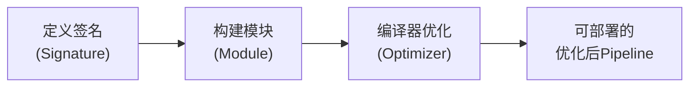

1. **定义任务签名**：用自然语言描述输入输出字段，如 `"question -> answer"`。
2. **组装 Pipeline 模块**：以声明式方式将多个模块串联/并联。
3. **准备少量标注数据**：不需要大量数据，几条到几十条即可。
4. **编译器自动优化**：内置优化器（如 `BootstrapFewShot`、`MIPROv2`）自动搜索最优 prompt 模板和 few-shot 示例组合。
5. **部署使用**：优化后的模块可直接调用，无需手动维护 prompt。

### 完整 Python 示例代码（OpenAI API 风格模拟）

以下示例模拟了 DSPy 核心机制：将 prompt 模板视为可优化参数，通过简单的 bootstrap 优化器自动从示例中学习最优 prompt。

### 导入与全局配置

```python
"""
DSPy 风格：声明式编程 — Prompt作为可优化参数，编译器自动优化
模拟 DSPy 的核心机制：Signature、Module、BootstrapFewShot Optimizer
"""

import json
import re
from typing import Any
from openai import OpenAI
```

### 签名（Signature）定义

```python
# ============================================================
# 1. 模拟 DSPy 的 Signature（签名）
# ============================================================
class Signature:
    """
    声明式签名：定义"输入字段 -> 输出字段"。
    用户只需关心数据流，不需要手写 prompt。
    """

    def __init__(self, input_fields: list[str], output_fields: list[str], instruction: str):
        self.input_fields = input_fields
        self.output_fields = output_fields
        self.instruction = instruction

    def __repr__(self):
        return f"Signature({self.input_fields} -> {self.output_fields})"
```

### 预测模块 — 核心初始化与Prompt模板

```python
# ============================================================
# 2. 模拟 DSPy 的 Module（可组合模块）
# ============================================================
class Predict:
    """
    基础预测模块：根据签名自动生成 prompt 并调用 LLM。
    prompt 模板是"可优化参数"——通过优化器动态调整。
    """

    def __init__(self, signature: Signature, client: OpenAI, model: str = "gpt-4o-mini"):
        self.signature = signature
        self.client = client
        self.model = model
        # 初始 prompt 模板（将被优化器调整）
        self.prompt_template = self._build_default_template()
        # 优化后的 few-shot 示例
        self.demos: list[dict] = []

    def _build_default_template(self) -> str:
        """根据签名自动生成默认 prompt 模板"""
        inputs_str = "\n".join([f"{{{{ {f} }}}}" for f in self.signature.input_fields])
        return f"""{self.signature.instruction}

输入:
{inputs_str}

请输出JSON格式，包含以下字段: {json.dumps(self.signature.output_fields)}"""
```

### 预测模块 — 调用与JSON解析

```python
    def _apply_demos(self, template: str) -> str:
        """将 few-shot 示例注入 prompt"""
        if not self.demos:
            return template
        demo_text = "\n\n以下是一些示例:\n"
        for i, demo in enumerate(self.demos, 1):
            demo_text += f"\n示例{i}:\n"
            demo_text += f"输入: {json.dumps({k: v for k, v in demo.items() if k in self.signature.input_fields}, ensure_ascii=False)}\n"
            demo_text += f"输出: {json.dumps({k: v for k, v in demo.items() if k in self.signature.output_fields}, ensure_ascii=False)}\n"
        return demo_text + "\n现在请处理以下输入:\n" + template

    def __call__(self, **kwargs) -> dict:
        """调用模块，执行预测"""
        prompt = self._apply_demos(self.prompt_template)
        for field in self.signature.input_fields:
            prompt = prompt.replace(f"{{{{ {field} }}}}", str(kwargs.get(field, "")))

        response = self.client.chat.completions.create(
            model=self.model,
            messages=[
                {"role": "system", "content": "你是一个精确的AI助手。请严格按照JSON格式输出。"},
                {"role": "user", "content": prompt},
            ],
            temperature=0.3,
        )

        content = response.choices[0].message.content
        result = self._parse_json(content)
        return result

    def _parse_json(self, content: str) -> dict:
        """从LLM输出中提取JSON"""
        match = re.search(r"\{.*\}", content, re.DOTALL)
        if match:
            return json.loads(match.group())
        return {}
```

### 思维链模块（ChainOfThought）

```python
# ============================================================
# 3. 模拟 DSPy 的 ChainOfThought（思维链模块）
# ============================================================
class ChainOfThought(Predict):
    """带思维链的预测模块"""

    def _build_default_template(self) -> str:
        inputs_str = "\n".join([f"{{{{ {f} }}}}" for f in self.signature.input_fields])
        return f"""{self.signature.instruction}

请按照以下步骤推理:
1. 仔细理解问题
2. 逐步分析推理过程
3. 给出最终答案

输入:
{inputs_str}

请先给出推理过程(rationale)，然后输出JSON格式的最终答案，包含字段: {json.dumps(self.signature.output_fields + ['rationale'])}"""

    def __call__(self, **kwargs) -> dict:
        # 不修改原 signature，避免多次调用导致 output_fields 污染
        result = super().__call__(**kwargs)
        return result
```

### BootstrapFewShot 优化器

```python
# ============================================================
# 4. 模拟 DSPy 的 BootstrapFewShot 优化器
# ============================================================
class BootstrapFewShot:
    """
    编译器/优化器：自动从训练数据中搜索最优的 few-shot 示例。
    原理：对每个训练样本尝试预测，将成功的预测作为新的 few-shot 示例。
    """

    def __init__(self, metric=None, max_bootstrapped_demos: int = 4):
        self.metric = metric or (lambda gold, pred, *args, **kwargs: gold == pred)
        self.max_bootstrapped_demos = max_bootstrapped_demos

    def compile(self, module: Predict, trainset: list[dict]) -> Predict:
        """
        优化模块：从训练集中 bootstrap 最优的 few-shot 示例
        """
        print(f"[Optimizer] 开始编译，训练样本数: {len(trainset)}")
        bootstrapped_demos = []

        for i, example in enumerate(trainset):
            if len(bootstrapped_demos) >= self.max_bootstrapped_demos:
                break

            # 提取输入字段
            inputs = {k: v for k, v in example.items() if k in module.signature.input_fields}
            expected_output = {k: v for k, v in example.items() if k in module.signature.output_fields}

            # 用当前已收集的demos做预测
            temp_module = Predict(module.signature, module.client, module.model)
            temp_module.prompt_template = module.prompt_template
            temp_module.demos = bootstrapped_demos[:]
            prediction = temp_module(**inputs)

            # 评估预测质量
            is_correct = self._evaluate(expected_output, prediction)
            if is_correct:
                bootstrapped_demos.append(example)
                print(f"  示例 {i+1}: ✓ 正确，加入demos")
            else:
                print(f"  示例 {i+1}: ✗ 跳过")

        module.demos = bootstrapped_demos
        print(f"[Optimizer] 编译完成，共选出 {len(bootstrapped_demos)} 个few-shot示例\n")
        return module

    def _evaluate(self, expected: dict, prediction: dict) -> bool:
        """简单评估：核心字段是否匹配"""
        for key in expected:
            if key in prediction:
                if str(expected[key]).lower() == str(prediction[key]).lower():
                    return True
        return False
```

### 主流程与演示 — 训练数据准备

```python
# ============================================================
# 5. 完整运行示例
# ============================================================
def main():
    client = OpenAI()

    # --- 定义签名：情感分析任务 ---
    sentiment_signature = Signature(
        input_fields=["text"],
        output_fields=["sentiment", "confidence"],
        instruction="分析以下文本的情感倾向。",
    )

    # --- 创建模块 ---
    classifier = ChainOfThought(sentiment_signature, client)

    # --- 训练数据（少量标注） ---
    trainset = [
        {"text": "这个产品太棒了，我非常喜欢！", "sentiment": "positive", "confidence": "high", "rationale": ""},
        {"text": "服务态度极差，再也不会来了。", "sentiment": "negative", "confidence": "high", "rationale": ""},
        {"text": "还可以，没什么特别的。", "sentiment": "neutral", "confidence": "medium", "rationale": ""},
        {"text": "质量好得令人难以置信，强烈推荐！", "sentiment": "positive", "confidence": "high", "rationale": ""},
        {"text": "太失望了，完全不符合预期。", "sentiment": "negative", "confidence": "high", "rationale": ""},
    ]
```

### 主流程与演示 — 编译与测试

```python
    # --- 编译器自动优化 ---
    optimizer = BootstrapFewShot(max_bootstrapped_demos=3)
    optimized_classifier = optimizer.compile(classifier, trainset)

    # --- 测试优化后的模块 ---
    print("=" * 60)
    print("测试优化后的情感分析模块")
    print(f"注入的few-shot示例数: {len(optimized_classifier.demos)}")
    print("=" * 60)

    test_texts = [
        "用了一段时间，感觉还挺顺手的。",
        "物流慢得要命，客服还爱答不理。",
        "超乎想象的好体验，满分好评！",
    ]

    for text in test_texts:
        result = optimized_classifier(text=text)
        print(f"\n文本: {text}")
        print(f"情感: {result.get('sentiment', 'N/A')}")
        print(f"置信度: {result.get('confidence', 'N/A')}")
        print(f"推理: {result.get('rationale', 'N/A')}")


if __name__ == "__main__":
    main()
```

### 要点总结

| 要素 | DSPy 方式 | 传统方式 |
|------|-----------|----------|
| Prompt 管理 | 自动生成和优化 | 手动编写和调试 |
| Few-shot 示例 | 编译器自动选择最优组合 | 人工挑选和排列 |
| 可复现性 | 签名即文档，模块可版本化 | 散落在代码中的字符串 |
| 扩展性 | 像搭积木一样组合模块 | 需要大量重复代码 |

---

## 6.2 Flow Engineering（LangGraph 风格）— 有状态图的 Agent 流程

### 概念说明

Flow Engineering（流程工程）将 Agent 的决策和执行流程建模为一个**有向有状态图**，其中：

- **节点（Node）**：代表一个处理步骤，可以是 LLM 调用、工具调用、人工审批等。
- **边（Edge）**：代表节点之间的流转关系。
- **条件路由（Conditional Edge）**：根据 LLM 输出或状态变量动态选择下一个节点。
- **状态（State）**：在整个图执行过程中持久化的共享数据，使得每个节点都能读写全局上下文。

LangGraph 是这种思想的最佳实践框架，它将 Agent 设计为"图"，天然支持循环、并行分支、人工介入（Human-in-the-Loop）等复杂控制流。

### 核心流程/原理

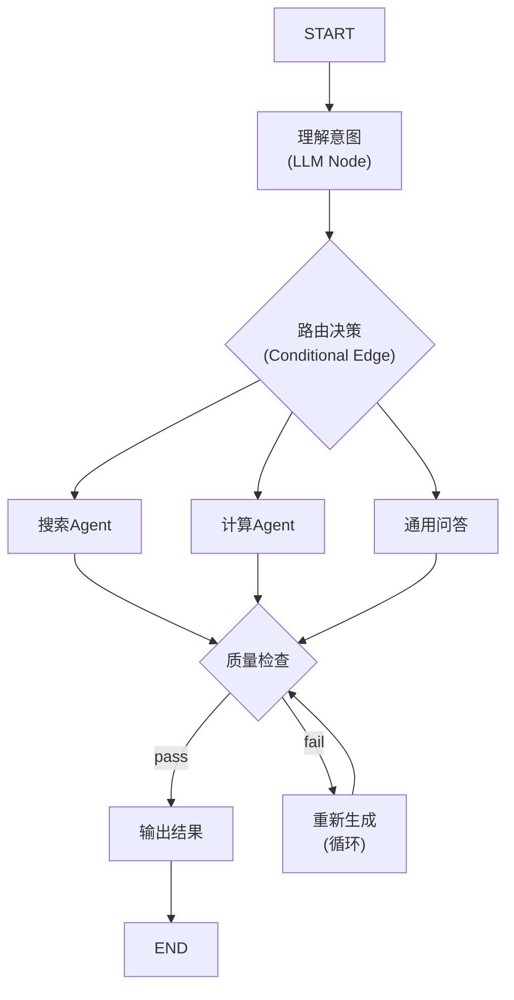

**关键机制**：
1. **状态持久化**：每一步都能读取和修改全局状态 `State`。
2. **条件路由**：边不是固定的，而是由一个函数根据当前状态动态决定。
3. **循环支持**：图中可以有环，实现"生成→检查→重试"的迭代优化。
4. **节点可中断**：支持在特定节点暂停，等待人工审批后继续。

### 导入与全局配置

```python
"""
Flow Engineering (LangGraph 风格)
Agent 流程设计为有状态图：节点 + 边 + 条件路由
"""

import json
import operator
from typing import Annotated, Literal, TypedDict
from openai import OpenAI
```

### 全局状态定义

```python
# ============================================================
# 1. 定义全局状态（State）
# ============================================================
class AgentState(TypedDict):
    """在整个图中流转的共享状态"""
    user_input: str                    # 用户原始输入
    intent: str                        # 识别的意图
    search_results: str                # 搜索结果
    computation_result: str            # 计算结果
    general_answer: str               # 通用回答
    final_output: str                  # 最终输出
    quality_pass: bool                 # 质量检查是否通过
    retry_count: int                   # 重试次数
    messages: Annotated[list, "消息历史"]  # 注：真实 LangGraph 中第二个参数应为 reducer 函数（如 operator.add），此处仅作类型标注示意
```

### 图节点基类与意图识别节点

```python
# ============================================================
# 2. 定义图的节点（Node）
# ============================================================
class FlowNode:
    """图节点的基类"""

    def __init__(self, name: str):
        self.name = name

    def __call__(self, state: AgentState, client: OpenAI) -> AgentState:
        raise NotImplementedError


class IntentClassifier(FlowNode):
    """意图识别节点"""

    def __init__(self):
        super().__init__("classify_intent")

    def __call__(self, state: AgentState, client: OpenAI) -> AgentState:
        prompt = f"""分析用户输入，判断意图类型。只能返回以下之一: search, compute, general。

用户输入: {state['user_input']}

请只返回意图类型（单个词）。"""

        response = client.chat.completions.create(
            model="gpt-4o-mini",
            messages=[{"role": "user", "content": prompt}],
            temperature=0.0,
        )
        intent = (response.choices[0].message.content or "").strip().lower()
        state["intent"] = intent
        print(f"  [{self.name}] 识别意图: {intent}")
        return state
```

### 搜索Agent节点

```python
class SearchAgent(FlowNode):
    """搜索执行节点"""

    def __init__(self):
        super().__init__("search_agent")

    def __call__(self, state: AgentState, client: OpenAI) -> AgentState:
        prompt = f"""你是一个搜索助手。根据用户问题生成一个结构化的搜索结果摘要。

用户问题: {state['user_input']}

请以JSON格式输出，包含:
- query: 搜索关键词
- summary: 搜索结果摘要
- sources: 信息来源列表"""

        response = client.chat.completions.create(
            model="gpt-4o-mini",
            messages=[{"role": "user", "content": prompt}],
            temperature=0.3,
        )
        state["search_results"] = response.choices[0].message.content
        print(f"  [{self.name}] 搜索完成")
        return state
```

### 计算Agent节点

```python
class ComputeAgent(FlowNode):
    """计算执行节点"""

    def __init__(self):
        super().__init__("compute_agent")

    def __call__(self, state: AgentState, client: OpenAI) -> AgentState:
        prompt = f"""你是一个计算助手。逐步分析并解答以下问题，给出最终数值结果。

问题: {state['user_input']}

请以JSON格式输出，包含:
- steps: 计算步骤列表
- result: 最终计算结果"""

        response = client.chat.completions.create(
            model="gpt-4o-mini",
            messages=[{"role": "user", "content": prompt}],
            temperature=0.0,
        )
        state["computation_result"] = response.choices[0].message.content
        print(f"  [{self.name}] 计算完成")
        return state
```

### 通用问答节点

```python
class GeneralAgent(FlowNode):
    """通用问答节点"""

    def __init__(self):
        super().__init__("general_agent")

    def __call__(self, state: AgentState, client: OpenAI) -> AgentState:
        prompt = f"""你是一个通用AI助手。请简洁地回答用户问题。

问题: {state['user_input']}"""

        response = client.chat.completions.create(
            model="gpt-4o-mini",
            messages=[{"role": "user", "content": prompt}],
            temperature=0.5,
        )
        state["general_answer"] = response.choices[0].message.content
        print(f"  [{self.name}] 通用回答完成")
        return state
```

### 质量检查节点

```python
class QualityChecker(FlowNode):
    """质量检查节点"""

    def __init__(self):
        super().__init__("quality_checker")

    def __call__(self, state: AgentState, client: OpenAI) -> AgentState:
        answer = (state.get("search_results") or
                  state.get("computation_result") or
                  state.get("general_answer", ""))

        prompt = f"""评估以下回答的质量。回答是否直接回应了用户问题？是否完整有用？

用户问题: {state['user_input']}
回答: {answer}

只返回 "pass" 或 "fail"。"""

        response = client.chat.completions.create(
            model="gpt-4o-mini",
            messages=[{"role": "user", "content": prompt}],
            temperature=0.0,
        )
        result = (response.choices[0].message.content or "").strip().lower()
        state["quality_pass"] = "pass" in result
        print(f"  [{self.name}] 质量检查: {'通过' if state['quality_pass'] else '未通过'}")
        return state
```

### 重新生成节点

```python
class RegenerateNode(FlowNode):
    """重新生成节点（当质量不通过时触发）"""

    def __init__(self):
        super().__init__("regenerate")

    def __call__(self, state: AgentState, client: OpenAI) -> AgentState:
        state["retry_count"] = state.get("retry_count", 0) + 1
        previous = (state.get("search_results") or
                    state.get("computation_result") or
                    state.get("general_answer", ""))

        prompt = f"""之前回答质量不合格，请改进后重新回答。

用户问题: {state['user_input']}
之前的回答: {previous}
改进要求: 更准确、更完整、更有条理。"""

        response = client.chat.completions.create(
            model="gpt-4o-mini",
            messages=[{"role": "user", "content": prompt}],
            temperature=0.4,
        )

        # 更新对应的结果字段
        if state.get("search_results"):
            state["search_results"] = response.choices[0].message.content
        elif state.get("computation_result"):
            state["computation_result"] = response.choices[0].message.content
        else:
            state["general_answer"] = response.choices[0].message.content

        print(f"  [{self.name}] 第{state['retry_count']}次重新生成")
        return state
```

### 输出格式化节点

```python
class OutputFormatter(FlowNode):
    """最终输出格式化节点"""

    def __init__(self):
        super().__init__("output_formatter")

    def __call__(self, state: AgentState, client: OpenAI) -> AgentState:
        answer = (state.get("search_results") or
                  state.get("computation_result") or
                  state.get("general_answer", ""))

        prompt = f"""将以下回答格式化为清晰的最终输出。

回答内容: {answer}

要求: 结构清晰，重点突出。"""

        response = client.chat.completions.create(
            model="gpt-4o-mini",
            messages=[{"role": "user", "content": prompt}],
            temperature=0.3,
        )
        state["final_output"] = response.choices[0].message.content
        print(f"  [{self.name}] 输出格式化完成")
        return state
```

### 条件路由函数

```python
# ============================================================
# 3. 条件路由函数
# ============================================================
def route_by_intent(state: AgentState) -> str:
    """根据意图路由到不同的Agent节点"""
    routing_map = {
        "search": "search_agent",
        "compute": "compute_agent",
        "general": "general_agent",
    }
    next_node = routing_map.get(state["intent"], "general_agent")
    print(f"  [Router] 路由到: {next_node}")
    return next_node


def route_after_quality_check(state: AgentState) -> str:
    """质量检查后的路由决策"""
    if state["quality_pass"]:
        return "output_formatter"
    elif state.get("retry_count", 0) < 2:  # 最多重试2次
        return "regenerate"
    else:
        print(f"  [Router] 已达最大重试次数，强制输出")
        return "output_formatter"
```

### 图执行引擎 — 图构建方法

```python
# ============================================================
# 4. 图执行引擎（模拟 LangGraph StateGraph）
# ============================================================
class StateGraph:
    """
    有状态图执行引擎。
    模拟 LangGraph 的 StateGraph 核心机制。
    """

    def __init__(self, state_type: type):
        self.state_type = state_type
        self.nodes: dict[str, FlowNode] = {}
        self.edges: dict[str, str] = {}
        self.conditional_edges: dict[str, tuple[callable, dict]] = {}
        self.entry_point: str = ""

    def add_node(self, name: str, node: FlowNode):
        self.nodes[name] = node
        return self

    def add_edge(self, from_node: str, to_node: str):
        self.edges[from_node] = to_node
        return self

    def add_conditional_edges(self, from_node: str, condition: callable, path_map: dict):
        """path_map 将条件函数的返回值映射到目标节点名"""
        self.conditional_edges[from_node] = (condition, path_map)
        return self

    def set_entry_point(self, node_name: str):
        self.entry_point = node_name
        return self
```

### 图执行引擎 — 编译与执行

```python
    def compile(self):
        """编译图，返回可调用对象"""
        return self

    def invoke(self, initial_state: dict, client: OpenAI) -> dict:
        """执行图"""
        state = dict(initial_state)
        current_node = self.entry_point
        max_steps = 20  # 防止死循环
        step = 0

        print(f"\n{'='*60}")
        print(f"开始执行图流程")
        print(f"{'='*60}")

        while step < max_steps:
            if current_node not in self.nodes:
                print(f"[Graph] 到达终点: {current_node}")
                break

            print(f"\n--- Step {step + 1}: 执行节点 [{current_node}] ---")
            node = self.nodes[current_node]
            state = node(state, client)
            step += 1

            # 决定下一个节点
            if current_node in self.conditional_edges:
                condition_fn, path_map = self.conditional_edges[current_node]
                result = condition_fn(state)
                current_node = path_map[result]
            elif current_node in self.edges:
                current_node = self.edges[current_node]
            else:
                break  # 终点节点

        print(f"\n{'='*60}")
        print(f"图流程执行完毕，共 {step} 步")
        print(f"{'='*60}")
        return state
```

### 构建Agent图

```python
# ============================================================
# 5. 构建和运行完整的 Agent 图
# ============================================================
def build_agent_graph() -> StateGraph:
    """构建 Agent 图"""
    graph = StateGraph(AgentState)

    # 添加节点
    graph.add_node("classify_intent", IntentClassifier())
    graph.add_node("search_agent", SearchAgent())
    graph.add_node("compute_agent", ComputeAgent())
    graph.add_node("general_agent", GeneralAgent())
    graph.add_node("quality_checker", QualityChecker())
    graph.add_node("regenerate", RegenerateNode())
    graph.add_node("output_formatter", OutputFormatter())

    # 固定边
    graph.add_edge("search_agent", "quality_checker")
    graph.add_edge("compute_agent", "quality_checker")
    graph.add_edge("general_agent", "quality_checker")
    graph.add_edge("regenerate", "quality_checker")

    # 条件路由
    graph.add_conditional_edges(
        "classify_intent",
        route_by_intent,
        {
            "search_agent": "search_agent",
            "compute_agent": "compute_agent",
            "general_agent": "general_agent",
        },
    )
    graph.add_conditional_edges(
        "quality_checker",
        route_after_quality_check,
        {
            "output_formatter": "output_formatter",
            "regenerate": "regenerate",
        },
    )

    # 入口点
    graph.set_entry_point("classify_intent")

    return graph.compile()
```

### 主流程与演示

```python
def main():
    client = OpenAI()

    graph = build_agent_graph()

    test_queries = [
        "2024年诺贝尔物理学奖得主是谁？",
        "计算 15% 年利率下，10万元存3年的复利终值",
        "今天天气真好，心情不错。",
    ]

    for query in test_queries:
        print(f"\n{'#'*60}")
        print(f"用户输入: {query}")
        print(f"{'#'*60}")

        state = {
            "user_input": query,
            "intent": "",
            "search_results": "",
            "computation_result": "",
            "general_answer": "",
            "final_output": "",
            "quality_pass": False,
            "retry_count": 0,
            "messages": [],
        }

        result = graph.invoke(state, client)
        print(f"\n最终输出:\n{result['final_output']}")
        print()


if __name__ == "__main__":
    main()
```

### 要点总结

| 特性 | 图流程模式 | 传统线性流程 |
|------|-----------|-------------|
| 控制流 | 灵活的条件路由 + 循环 | 固定的 if-else + 顺序调用 |
| 状态管理 | 图级共享状态 | 函数参数传递 |
| 可观测性 | 每个节点可独立监控和日志 | 需要手动埋点 |
| 人工介入 | 天然支持节点中断和审批 | 需要额外设计 |

---

## 6.3 Map-Reduce Pattern — 并行处理子任务 → 汇总合并

### 概念说明

Map-Reduce 模式源自大数据处理领域（Hadoop/Spark），在 LLM Agent 场景中被重新诠释为一种**高效处理大规模或可分解任务**的策略：

- **Map 阶段**：将一个大任务拆分为多个独立的子任务，**并行**分发给多个 LLM 调用（或同一 LLM 的多次调用）进行处理。
- **Reduce 阶段**：将所有子任务的结果汇总，由一个汇总 LLM 调用进行合并、去重、排序和总结，输出最终结果。

典型应用场景：
- 长文档摘要（分段摘要 → 汇总摘要）
- 多维度代码审查（分别审查安全性、性能、可读性 → 汇总审查报告）
- 批量数据分析（并行分析多个数据子集 → 汇总分析结论）
- 多源信息整合（并行搜索多处 → 合并结果）

### 核心流程/原理

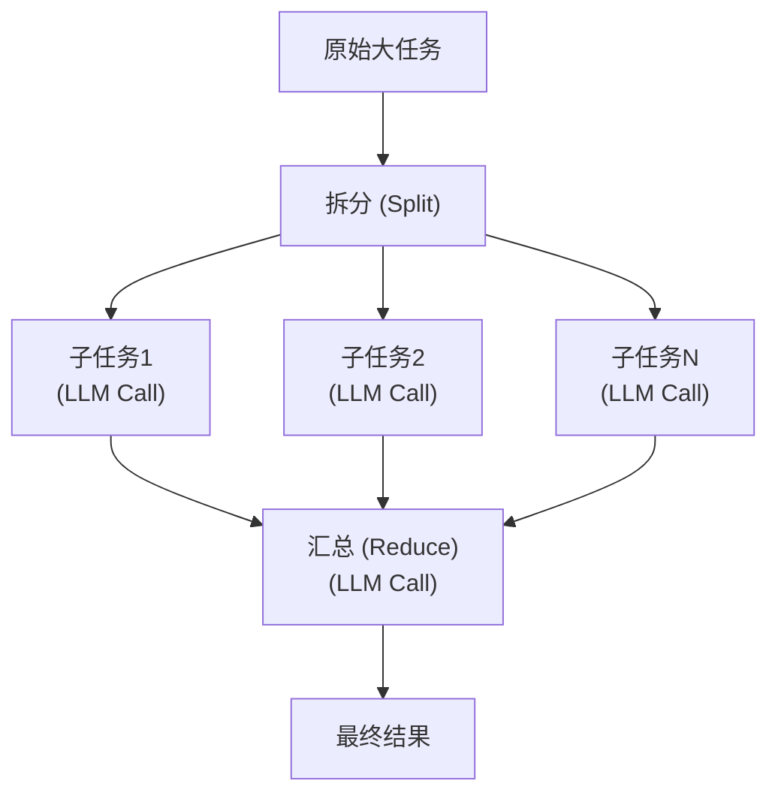

**关键设计考量**：
1. **拆分策略**：按段落、按主题、按数量均分；需保持语义完整性。
2. **并行度控制**：受 API 速率限制约束，需要限流器。
3. **上下文窗口利用**：每个子任务可以在各自上下文中深度处理，避免了长上下文的"迷失中间"问题。
4. **Reduce 质量依赖**：汇总阶段的质量取决于 Map 阶段输出的结构化程度。

### 导入与全局配置

```python
"""
Map-Reduce Pattern
并行处理子任务 → 汇总合并
模拟对长文档进行分段摘要，然后汇总生成最终摘要
"""

import concurrent.futures
import time
from typing import Optional
from openai import OpenAI
```

### 文档拆分器

```python
# ============================================================
# 1. 拆分器：将长文档按段落边界拆分为子任务
# ============================================================
class DocumentSplitter:
    """
    按自然段落和语义边界拆分长文档。
    保证每个chunk的 token 数在模型上下文窗口内。
    """

    def __init__(self, max_chunk_chars: int = 3000, overlap_chars: int = 200):
        self.max_chunk_chars = max_chunk_chars
        self.overlap_chars = overlap_chars

    def split(self, text: str) -> list[str]:
        """按段落拆分，超出长度限制的段落继续拆分"""
        paragraphs = text.split("\n\n")
        chunks = []
        current_chunk = ""

        for para in paragraphs:
            para = para.strip()
            if not para:
                continue

            if len(current_chunk) + len(para) < self.max_chunk_chars:
                current_chunk += para + "\n\n"
            else:
                if current_chunk:
                    chunks.append(current_chunk.strip())
                # 重叠处理：保留最后部分以保持上下文连续性
                if len(para) > self.max_chunk_chars:
                    # 超长段落：强制拆分
                    sub_chunks = self._split_long_paragraph(para)
                    chunks.extend(sub_chunks)
                    current_chunk = sub_chunks[-1][-self.overlap_chars:] if sub_chunks else ""
                else:
                    current_chunk = current_chunk[-self.overlap_chars:] + para + "\n\n"

        if current_chunk.strip():
            chunks.append(current_chunk.strip())

        return chunks
```

### 文档拆分器 — 超长段落处理

```python
    def _split_long_paragraph(self, text: str) -> list[str]:
        """按句子边界拆分超长段落"""
        import re
        sentences = re.split(r"(?<=[。！？.!?])", text)
        chunks = []
        current = ""
        for sent in sentences:
            if len(current) + len(sent) < self.max_chunk_chars:
                current += sent
            else:
                if current:
                    chunks.append(current.strip())
                current = sent
        if current:
            chunks.append(current.strip())
        return chunks
```

### Map阶段处理器

```python
# ============================================================
# 2. Map 阶段：并行处理每个文档片段
# ============================================================
class MapProcessor:
    """
    Map 阶段：将拆分后的每个 chunk 并行交给 LLM 处理。
    使用 ThreadPoolExecutor 实现并发。
    """

    def __init__(self, client: OpenAI, model: str = "gpt-4o-mini", max_workers: int = 5):
        self.client = client
        self.model = model
        self.max_workers = max_workers

    def process_chunk(self, chunk: str, chunk_index: int, total_chunks: int,
                      task_instruction: str) -> dict:
        """
        处理单个文档片段。
        返回结构化的中间结果，便于 Reduce 阶段汇总。
        """
        prompt = f"""{task_instruction}

这是文档的第 {chunk_index + 1}/{total_chunks} 部分:

{chunk}

请输出JSON格式:
{{
    "chunk_index": {chunk_index},
    "key_points": ["要点1", "要点2", ...],
    "entities": ["实体1", "实体2", ...],
    "summary": "本段落的简要摘要",
    "sentiment": "正面/负面/中性"
}}"""

        try:
            response = self.client.chat.completions.create(
                model=self.model,
                messages=[
                    {"role": "system", "content": "你是一个精确的文档分析助手。请严格按JSON格式输出。"},
                    {"role": "user", "content": prompt},
                ],
                temperature=0.3,
            )

            content = response.choices[0].message.content
            result = self._extract_json(content)
            result["chunk_index"] = chunk_index
            result["raw_content"] = content
            return result

        except Exception as e:
            print(f"  [Map] 处理chunk {chunk_index} 时出错: {e}")
            return {"chunk_index": chunk_index, "error": str(e), "key_points": [], "summary": ""}
```

### Map阶段 — 并行执行与JSON提取

```python
    def map(self, chunks: list[str], task_instruction: str) -> list[dict]:
        """并行执行 Map 阶段"""
        total = len(chunks)
        results = [None] * total

        print(f"\n[Map阶段] 开始并行处理 {total} 个文档片段 (max_workers={self.max_workers})")

        start_time = time.time()

        with concurrent.futures.ThreadPoolExecutor(max_workers=self.max_workers) as executor:
            future_to_idx = {}
            for i, chunk in enumerate(chunks):
                future = executor.submit(self.process_chunk, chunk, i, total, task_instruction)
                future_to_idx[future] = i

            completed = 0
            for future in concurrent.futures.as_completed(future_to_idx):
                idx = future_to_idx[future]
                try:
                    results[idx] = future.result()
                    completed += 1
                    print(f"  [Map] 进度: {completed}/{total} (chunk {idx})")
                except Exception as e:
                    print(f"  [Map] chunk {idx} 执行失败: {e}")
                    results[idx] = {"chunk_index": idx, "error": str(e), "key_points": [], "summary": ""}

        elapsed = time.time() - start_time
        print(f"[Map阶段] 完成，耗时 {elapsed:.2f}s")
        return results

    def _extract_json(self, text: str) -> dict:
        """从文本中提取JSON"""
        import json, re
        match = re.search(r"\{.*\}", text, re.DOTALL)
        if match:
            try:
                return json.loads(match.group())
            except json.JSONDecodeError:
                pass
        return {}
```

### Reduce阶段处理器 — 数据聚合

```python
# ============================================================
# 3. Reduce 阶段：汇总所有子任务结果
# ============================================================
class ReduceProcessor:
    """
    Reduce 阶段：汇总 Map 阶段的所有中间结果，生成最终输出。
    """

    def __init__(self, client: OpenAI, model: str = "gpt-4o-mini"):
        self.client = client
        self.model = model

    def reduce(self, map_results: list[dict], reduce_instruction: str,
               original_text: Optional[str] = None) -> str:
        """
        汇总所有 Map 结果，生成最终的合并输出。
        """
        # 按 chunk_index 排序
        map_results = sorted(map_results, key=lambda x: x.get("chunk_index", 0))

        # 构建汇总上下文
        summaries = []
        all_key_points = []
        all_entities = set()

        for r in map_results:
            if "error" in r:
                continue
            summaries.append(f"[段落{r.get('chunk_index', '?')}] {r.get('summary', '')}")
            all_key_points.extend(r.get("key_points", []))
            all_entities.update(r.get("entities", []))

        context = f"""
各段落摘要:
{chr(10).join(summaries)}

所有关键要点:
{chr(10).join(f'- {p}' for p in all_key_points)}

所有识别实体:
{', '.join(all_entities) if all_entities else '无'}
"""

        prompt = f"""{reduce_instruction}

以下是 {len(map_results)} 个文档片段的处理结果:

{context}

请基于以上信息生成最终的汇总报告。要求:
1. 综合所有片段的信息
2. 去重、合并相似要点
3. 按重要性排序
4. 用清晰的结构化格式输出"""

        response = self.client.chat.completions.create(
            model=self.model,
            messages=[
                {"role": "system", "content": "你是一个专业的文档分析汇总助手。"},
                {"role": "user", "content": prompt},
            ],
            temperature=0.4,
        )

        return response.choices[0].message.content
```

### Map-Reduce Pipeline

```python
# ============================================================
# 4. 完整的 Map-Reduce Pipeline
# ============================================================
class MapReducePipeline:
    """Map-Reduce 完整流水线"""

    def __init__(self, client: OpenAI, max_workers: int = 5):
        self.splitter = DocumentSplitter()
        self.mapper = MapProcessor(client, max_workers=max_workers)
        self.reducer = ReduceProcessor(client)

    def execute(self, document: str,
                map_instruction: str,
                reduce_instruction: str) -> dict:
        """执行完整的 Map-Reduce 流程"""
        print(f"\n{'='*60}")
        print("Map-Reduce Pipeline 启动")
        print(f"文档长度: {len(document)} 字符")
        print(f"{'='*60}")

        # Step 1: 拆分
        chunks = self.splitter.split(document)
        print(f"\n[Split] 拆分为 {len(chunks)} 个片段")
        for i, chunk in enumerate(chunks):
            print(f"  Chunk {i}: {len(chunk)} 字符")

        # Step 2: Map - 并行处理
        map_results = self.mapper.map(chunks, map_instruction)

        # Step 3: Reduce - 汇总
        print(f"\n[Reduce阶段] 开始汇总 {len(map_results)} 个中间结果")
        final_result = self.reducer.reduce(map_results, reduce_instruction)
        print(f"[Reduce阶段] 汇总完成")

        return {
            "chunks": chunks,
            "map_results": map_results,
            "final_result": final_result,
            "num_chunks": len(chunks),
        }
```

### 主流程与演示 — 文档准备

```python
# ============================================================
# 5. 运行示例
# ============================================================
def main():
    client = OpenAI()

    # 模拟一篇长文档
    long_document = """
人工智能技术在过去十年中取得了飞速发展。从深度学习到大型语言模型，AI系统已经能够执行越来越复杂的任务。

自然语言处理(NLP)是AI领域的重要分支。Transformer架构的提出彻底改变了NLP的研究范式。BERT、GPT等预训练模型在各种NLP任务上取得了前所未有的成绩。

计算机视觉方面，卷积神经网络(CNN)一直是主流架构。近年来，Vision Transformer(ViT)等模型开始挑战CNN的地位，在多個基准测试中表现出色。

强化学习在游戏和机器人控制领域取得了显著成果。AlphaGo击败人类围棋冠军，AlphaFold解决了蛋白质结构预测问题。

AI伦理和安全问题日益受到关注。模型偏见、隐私保护、可解释性等议题成为学术界和工业界的研究热点。

大语言模型(LLM)如GPT-5、Claude 4等展现了强大的通用智能。这些模型在代码生成、创意写作、数据分析等方面都有出色表现。

边缘计算与AI的结合使得智能设备能够在本地运行复杂的AI模型。这大大降低了延迟，提高了隐私保护水平。

AI在医疗领域的应用包括医学影像分析、药物发现、个性化治疗方案等。AI辅助诊断系统已经在多家医院投入使用。

自动驾驶技术依赖于多传感器融合和实时决策。激光雷达、摄像头、毫米波雷达等传感器共同构成了车辆的感知系统。

联邦学习是一种保护隐私的分布式机器学习方法。多个参与方可以共同训练模型，而无需共享原始数据。

AI在金融领域的应用包括风险评估、欺诈检测、算法交易等。自然语言处理技术被用于分析财经新闻和财报。

教育领域的AI应用涵盖个性化学习路径推荐、自动评分、智能辅导等。AI教师助手可以减轻教师的工作负担。

生成式AI创造了全新的内容创作范式。从文本到图像(DALL-E, Midjourney)，从文本到视频(Sora)，AI正在改变创意产业。

AI与物联网(IoT)的结合创造了智能家居、智慧城市等应用场景。智能音箱、智能照明、智能温控等设备已经进入千家万户。

量子计算与AI的结合有望解决传统计算难以处理的问题。量子机器学习是一个新兴但充满潜力的研究方向。

AI芯片的快速发展为大规模模型训练提供了硬件基础。GPU、TPU、NPU等专用芯片大幅提升了AI计算的效率。
"""
```

### 主流程与演示 — 执行与输出

```python
    pipeline = MapReducePipeline(client, max_workers=4)

    result = pipeline.execute(
        document=long_document,
        map_instruction="请分析以下文档片段，提取关键要点、识别实体、并生成简要摘要。",
        reduce_instruction="请将所有文档片段的摘要和关键要点汇总为一份完整的综合分析报告。",
    )

    print(f"\n{'='*60}")
    print("最终汇总报告")
    print(f"{'='*60}")
    print(result["final_result"])


if __name__ == "__main__":
    main()
```

### 要点总结

| 维度 | 说明 |
|------|------|
| 时间复杂度 | O(N/M + 1)，N=总工作量，M=并行度；相比顺序处理的 O(N) 大幅提升 |
| 适用场景 | 长文档处理、批量分析、多维度审查 |
| 关键挑战 | 拆分粒度控制、并行限流、Reduce 阶段的去重和冲突消解 |
| 扩展方向 | 层级 Map-Reduce（多级汇总）、流式处理、自适应拆分 |

---

## 6.4 Router / MoE（Mixture of Experts）— 路由分发到最合适子 Agent

### 概念说明

Router（路由）模式 / MoE（Mixture of Experts，混合专家）模式的核心思想是：**由一个路由器（Router/Gate）分析输入，将其动态分发给最合适的专家子 Agent 处理**。

> **⚠️ 概念辨析：应用层 Router vs 模型架构 MoE**
>
> 需要区分两个层面的"MoE"概念：
>
> | 维度 | 模型架构 MoE | 应用层 Router 模式（本文） |
> |------|-------------|------------------------|
> | **层面** | 模型内部架构 | Agent 应用架构 |
> | **专家** | 神经网络中的子网络（FFN 层） | 独立的 Agent 或 LLM 调用 |
> | **路由器** | 门控网络（Gating Network），与模型一起训练 | LLM 调用或分类器，基于 prompt 或规则 |
> | **代表** | Mixtral 8x7B、Switch Transformer、GShard | 本文档的实现 |
> | **训练** | 需要端到端训练 | 无需训练，基于 prompt 工程 |
>
> 本文档描述的是**应用层 Router 模式**，借鉴了模型架构 MoE 的思想，但在 Agent 层面实现。两者思想相通但实现层面不同。

这种模式受到 MoE 深度学习架构的启发（如 Mixtral 8x7B、Switch Transformer），在 Agent 层面表现为：

- **Router（路由器）**：轻量级决策模块（通常是一个 LLM 调用或分类器），负责理解任务意图并选择最佳专家。
- **Experts（专家）**：一组专门化的 Agent，每个在特定领域（数学、代码、写作、搜索等）表现优异。
- **动态组合**：复杂任务可以路由到多个专家的组合（Top-K 路由）。

### 核心流程/原理

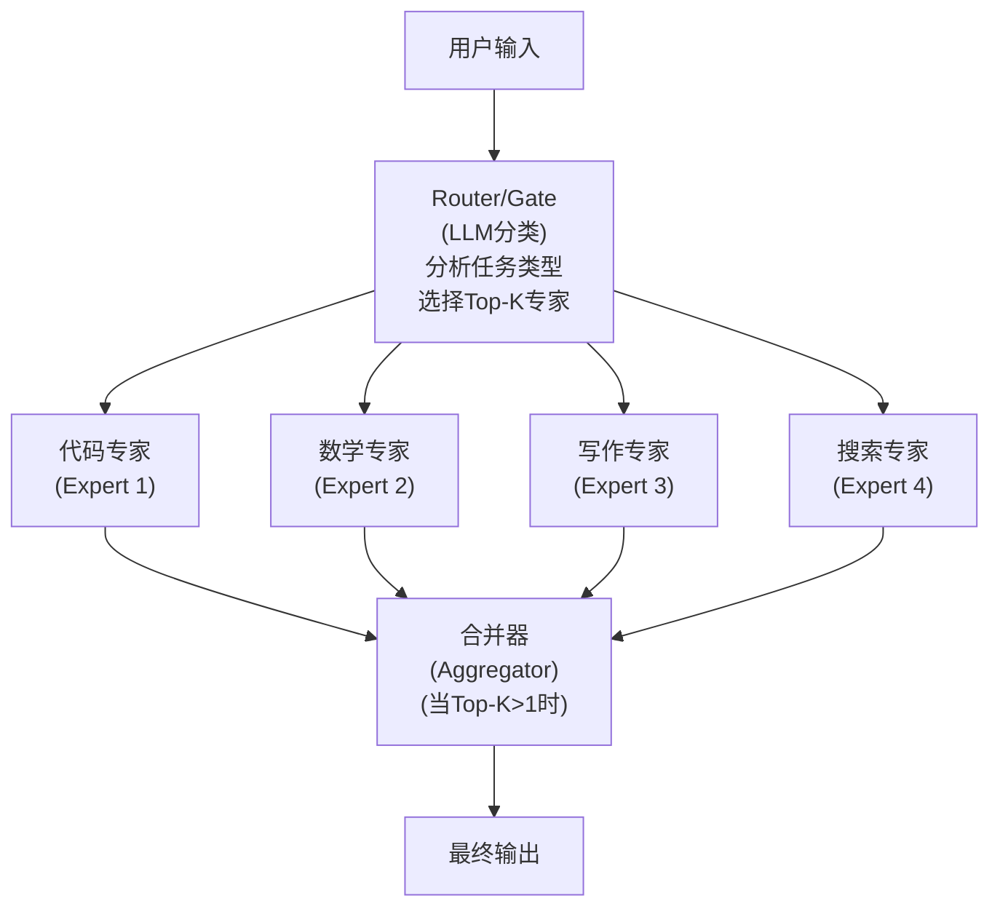

**路由策略**：
- **Top-1 路由**：选择最匹配的单个专家（简单高效）。
- **Top-K 路由**：选择 K 个最相关的专家并行处理，然后合并结果（更全面）。
- **加权路由**：每个专家输出按置信度加权融合。

### 导入与全局配置

```python
"""
Router / MoE (Mixture of Experts)
路由Agent分发到最合适子Agent，模拟MoE架构
"""

import json
import re
from typing import Optional, TypedDict
from openai import OpenAI
```

### 专家接口与基类

```python
# ============================================================
# 1. 定义专家接口
# ============================================================
class ExpertResponse(TypedDict):
    """专家返回的数据结构"""
    expert_name: str
    result: str
    confidence: float


class Expert:
    """专家基类"""

    def __init__(self, name: str, description: str, specialties: list[str], client: OpenAI):
        self.name = name
        self.description = description
        self.specialties = specialties
        self.client = client

    def can_handle(self, task: str, intent: str) -> bool:
        """判断是否能处理该任务"""
        task_lower = task.lower()
        for spec in self.specialties:
            if spec.lower() in task_lower or spec.lower() in intent.lower():
                return True
        return False

    def process(self, user_input: str) -> ExpertResponse:
        """处理任务并返回结果"""
        raise NotImplementedError

    def __repr__(self):
        return f"Expert({self.name}: {self.description})"
```

### 代码专家

```python
# ============================================================
# 2. 定义具体专家
# ============================================================
class CodeExpert(Expert):
    """代码专家：处理编程、调试、算法相关任务"""

    def __init__(self, client: OpenAI):
        super().__init__(
            name="CodeExpert",
            description="编程、调试、代码审查、算法设计",
            specialties=["代码", "编程", "debug", "算法", "函数", "类", "bug",
                         "python", "javascript", "java", "golang", "rust"],
            client=client,
        )

    def process(self, user_input: str) -> ExpertResponse:
        system_prompt = """你是一位资深软件工程师。请以专业方式回答编程问题。
输出要求:
1. 先分析问题
2. 给出最佳实践方案
3. 提供完整可运行的代码示例
4. 指出注意事项"""

        response = self.client.chat.completions.create(
            model="gpt-4o-mini",
            messages=[
                {"role": "system", "content": system_prompt},
                {"role": "user", "content": user_input},
            ],
            temperature=0.3,
        )
        return {
            "expert_name": self.name,
            "result": response.choices[0].message.content,
            "confidence": 0.95,
        }
```

### 数学专家

```python
class MathExpert(Expert):
    """数学专家：处理数学计算、证明、统计相关任务"""

    def __init__(self, client: OpenAI):
        super().__init__(
            name="MathExpert",
            description="数学计算、公式推导、统计分析",
            specialties=["数学", "计算", "公式", "方程", "统计", "概率",
                         "导数", "积分", "几何", "代数"],
            client=client,
        )

    def process(self, user_input: str) -> ExpertResponse:
        system_prompt = """你是一位数学教授。请按以下步骤解答数学问题:
1. 明确已知条件和求解目标
2. 列出相关公式或定理
3. 逐步推导，给出详细计算过程
4. 验证结果
5. 给出最终答案"""

        response = self.client.chat.completions.create(
            model="gpt-4o-mini",
            messages=[
                {"role": "system", "content": system_prompt},
                {"role": "user", "content": user_input},
            ],
            temperature=0.1,
        )
        return {
            "expert_name": self.name,
            "result": response.choices[0].message.content,
            "confidence": 0.95,
        }
```

### 写作专家

```python
class WritingExpert(Expert):
    """写作专家：处理文案创作、翻译、润色相关任务"""

    def __init__(self, client: OpenAI):
        super().__init__(
            name="WritingExpert",
            description="文案创作、翻译、内容润色、摘要生成",
            specialties=["写作", "文案", "翻译", "润色", "摘要", "文章",
                         "写一", "帮我写", "改写", "总结"],
            client=client,
        )

    def process(self, user_input: str) -> ExpertResponse:
        system_prompt = """你是一位资深内容创作者和编辑。请提供高质量的写作服务:
1. 理解写作目的和受众
2. 提供结构清晰的内容
3. 语言流畅、表达精准
4. 符合要求的风格和格式"""

        response = self.client.chat.completions.create(
            model="gpt-4o-mini",
            messages=[
                {"role": "system", "content": system_prompt},
                {"role": "user", "content": user_input},
            ],
            temperature=0.7,
        )
        return {
            "expert_name": self.name,
            "result": response.choices[0].message.content,
            "confidence": 0.90,
        }
```

### 研究搜索专家

```python
class ResearchExpert(Expert):
    """研究搜索专家：处理知识查询、信息整合任务"""

    def __init__(self, client: OpenAI):
        super().__init__(
            name="ResearchExpert",
            description="知识查询、信息检索、综合分析",
            specialties=["搜索", "查询", "什么是", "谁", "何时", "哪里",
                         "为什么", "如何", "历史", "定义", "解释"],
            client=client,
        )

    def process(self, user_input: str) -> ExpertResponse:
        system_prompt = """你是一位知识渊博的研究员。请提供准确、全面的信息:
1. 准确定义概念或事实
2. 提供相关背景和上下文
3. 引用可靠来源（如适用）
4. 区分事实和观点
5. 标出不确定的信息"""

        response = self.client.chat.completions.create(
            model="gpt-4o-mini",
            messages=[
                {"role": "system", "content": system_prompt},
                {"role": "user", "content": user_input},
            ],
            temperature=0.4,
        )
        return {
            "expert_name": self.name,
            "result": response.choices[0].message.content,
            "confidence": 0.88,
        }
```

### 路由器 — Prompt构建

```python
# ============================================================
# 3. 路由器（Router/Gate）
# ============================================================
class Router:
    """
    路由器：分析任务意图，选择最合适的专家。
    支持 Top-1 和 Top-K 路由策略。
    """

    def __init__(self, client: OpenAI, experts: list[Expert]):
        self.client = client
        self.experts = experts
        self.expert_map = {e.name: e for e in experts}

    def classify_intent(self, user_input: str) -> dict:
        """使用 LLM 分类任务意图并匹配专家"""
        expert_descriptions = "\n".join([
            f"- {e.name}: {e.description}" for e in self.experts
        ])

        prompt = f"""分析以下用户请求，判断应该由哪个专家处理。

可用的专家:
{expert_descriptions}

用户请求: {user_input}

请以JSON格式输出:
{{
    "primary_intent": "主要意图类型",
    "reasoning": "为什么选择这个专家",
    "recommended_expert": "推荐的专家名称",
    "alternative_experts": ["备选专家1", "备选专家2"],
    "confidence": 0.0-1.0,
    "needs_multi_expert": true/false
}}"""
```

### 路由器 — LLM调用与解析

```python
        response = self.client.chat.completions.create(
            model="gpt-4o-mini",
            messages=[
                {"role": "system", "content": "你是一个智能路由系统。请精确分析任务并选择最合适的专家。"},
                {"role": "user", "content": prompt},
            ],
            temperature=0.1,
        )

        content = response.choices[0].message.content
        try:
            match = re.search(r"\{.*\}", content, re.DOTALL)
            if match:
                return json.loads(match.group())
        except json.JSONDecodeError:
            pass

        return {
            "primary_intent": "unknown",
            "recommended_expert": "ResearchExpert",
            "confidence": 0.5,
            "needs_multi_expert": False,
        }
```

### 路由器 — 路由决策

```python
    def route(self, user_input: str, top_k: int = 1) -> list[Expert]:
        """
        路由决策：返回 Top-K 个最合适的专家。
        """
        intent_info = self.classify_intent(user_input)

        print(f"\n  [Router] 主要意图: {intent_info.get('primary_intent')}")
        print(f"  [Router] 推理: {intent_info.get('reasoning')}")
        print(f"  [Router] 置信度: {intent_info.get('confidence')}")

        # 策略1: 基于LLM推荐选择
        recommended = intent_info.get("recommended_expert", "")
        selected = []

        if recommended and recommended in self.expert_map:
            selected.append(self.expert_map[recommended])
            print(f"  [Router] 主专家: {recommended}")

        # 策略2: 如果需要多专家，添加备选
        if intent_info.get("needs_multi_expert") and top_k > 1:
            for alt_name in intent_info.get("alternative_experts", [])[:top_k - 1]:
                if alt_name in self.expert_map and self.expert_map[alt_name] not in selected:
                    selected.append(self.expert_map[alt_name])
                    print(f"  [Router] 备选专家: {alt_name}")

        # 策略3: 回退——用关键字匹配兜底
        if not selected:
            for expert in self.experts:
                if expert.can_handle(user_input, intent_info.get("primary_intent", "")):
                    selected.append(expert)
                    print(f"  [Router] 回退匹配: {expert.name}")
                    break

        # 最终回退
        if not selected:
            selected.append(self.expert_map.get("ResearchExpert", self.experts[-1]))
            print(f"  [Router] 默认专家: {selected[0].name}")

        return selected
```

### MoE引擎 — 初始化与执行

```python
# ============================================================
# 4. MoE 引擎：整合路由和专家
# ============================================================
class MoEEngine:
    """
    混合专家引擎（Mixture of Experts Engine）。
    整合 Router 和 Experts，实现完整的 MoE 推理。
    """

    def __init__(self, client: OpenAI):
        self.client = client
        self.experts = [
            CodeExpert(client),
            MathExpert(client),
            WritingExpert(client),
            ResearchExpert(client),
        ]
        self.router = Router(client, self.experts)

    def execute(self, user_input: str, top_k: int = 1) -> dict:
        """执行 MoE 推理"""
        print(f"\n{'='*60}")
        print(f"MoE 引擎处理: {user_input[:60]}...")
        print(f"{'='*60}")

        # Step 1: 路由
        selected_experts = self.router.route(user_input, top_k=top_k)

        # Step 2: 专家并行处理
        results = []
        for expert in selected_experts:
            print(f"\n  [{expert.name}] 开始处理...")
            result = expert.process(user_input)
            results.append(result)
            print(f"  [{expert.name}] 处理完成")

        # Step 3: 合并多专家结果（如需要）
        if len(results) == 1:
            final_output = results[0]
        else:
            final_output = self._aggregate(user_input, results)

        return final_output
```

### MoE引擎 — 多专家结果聚合

```python
    def _aggregate(self, user_input: str, results: list[dict]) -> dict:
        """多专家结果聚合"""
        print(f"\n  [Aggregator] 合并 {len(results)} 位专家的结果...")

        combined = "\n\n---\n\n".join([
            f"[{r['expert_name']}]:\n{r['result']}" for r in results
        ])

        prompt = f"""你是总协调员。以下是多位专家对同一问题的回答，请整合为一份统一的高质量回答。

用户问题: {user_input}

各专家回答:
{combined}

请综合各位专家的观点，生成一份:
1. 不重复的、有条理的最终回答
2. 保留每个角度的关键洞见
3. 如有冲突，指出并给出平衡的观点"""

        response = self.client.chat.completions.create(
            model="gpt-4o-mini",
            messages=[
                {"role": "system", "content": "你是专家协调员，擅长整合多角度观点生成统一报告。"},
                {"role": "user", "content": prompt},
            ],
            temperature=0.4,
        )

        return {
            "expert_name": "Aggregator(Multi-Expert)",
            "result": response.choices[0].message.content,
            "confidence": sum(r.get("confidence", 0) for r in results) / len(results),
            "contributing_experts": [r["expert_name"] for r in results],
        }
```

### 主流程与演示

```python
# ============================================================
# 5. 运行示例
# ============================================================
def main():
    client = OpenAI()

    engine = MoEEngine(client)

    # 测试不同类型的任务
    test_tasks = [
        "写一个Python函数，用二分查找在有序数组中查找目标值，并给出时间复杂度分析",
        "计算积分 ∫(x² + 2x + 1)dx 从0到3的定积分值",
        "帮我写一篇关于人工智能伦理的博客文章大纲，面向普通读者",
        "什么是Transformer架构中的自注意力机制？请通俗解释",
        "写一个快速排序算法并解释为什么平均时间复杂度是O(n log n)",  # 跨代码+数学
    ]

    # 对需要多专家的任务启用 Top-2 路由
    multi_expert_tasks = {4}  # 第5个任务需要多专家

    for i, task in enumerate(test_tasks):
        top_k = 2 if i in multi_expert_tasks else 1
        result = engine.execute(task, top_k=top_k)

        print(f"\n{'='*60}")
        print(f"最终输出 (by {result['expert_name']})")
        print(f"置信度: {result.get('confidence', 'N/A')}")
        if "contributing_experts" in result:
            print(f"协作专家: {result['contributing_experts']}")
        print(f"{'='*60}")
        print(result["result"])
        print()


if __name__ == "__main__":
    main()
```

### 要点总结

| 要素 | Router/MoE 模式 | 单体 Agent |
|------|----------------|-----------|
| 专业性 | 每个专家深耕特定领域，表现更优 | 通用但不够深入 |
| 扩展性 | 新增专家无需改动现有专家 | 修改prompt可能影响其他能力 |
| 容错性 | 单专家故障不影响整体 | 单点故障 |
| 成本优化 | 可对小任务用轻量模型，大任务用强模型 | 统一模型成本 |
| 复杂度 | 需要维护路由器和专家协调逻辑 | 简单直接 |

---

## 6.5 Structured Output — 用正则/语法约束输出格式

### 概念说明

Structured Output（结构化输出）模式的核心目标是**确保 LLM 输出符合预定义的格式规范**，使得下游系统可以可靠地解析和使用 LLM 的输出。在实际工程中，LLM 的"自由文本"输出往往不可靠——可能缺少字段、格式错误、包含多余的解释文字等。

三种主要的约束策略：

| 策略 | 实现方式 | 可靠性 | 灵活性 |
|------|---------|--------|--------|
| **Prompt 约束** | 在 prompt 中指定格式，要求输出 JSON/XML | 中 | 高 |
| **正则/语法验证** | 用正则表达式或解析器验证并重试 | 高 | 中 |
| **API 原生约束** | 使用 OpenAI 的 `response_format` 或 function calling | 最高 | 低（限制格式） |

本模式重点展示**正则/语法验证 + 自动重试**策略，这是一种不依赖特定 API 特性的通用方法。

### 核心流程/原理

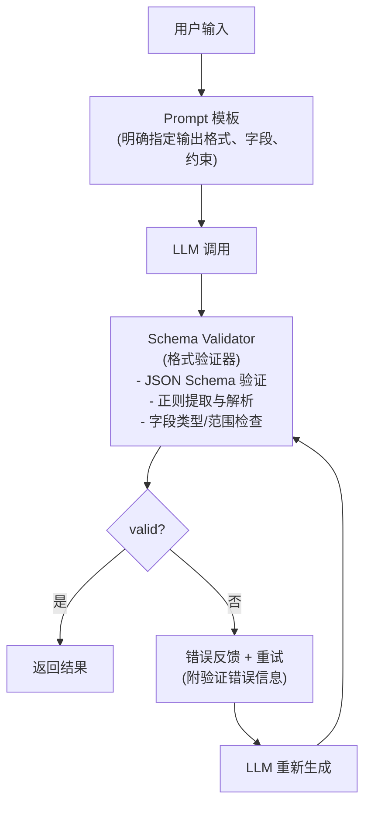

**关键设计**：

1. **明确输出规范**：在 prompt 中精确描述期望的格式、字段名、类型、约束条件。
2. **分层验证**：先正则提取 → JSON 解析 → Schema 验证 → 业务规则验证。
3. **智能重试**：重试时将具体的验证错误反馈给 LLM，帮助它修正。
4. **结构化日志**：记录每次验证失败的原因，用于后续 prompt 优化。

### 导入与全局配置

```python
"""
Structured Output Pattern
用正则/语法约束输出格式，确保LLM输出可靠可解析
"""

import json
import re
import time
from typing import Any, Optional
from dataclasses import dataclass, field
from openai import OpenAI
```

### 输出Schema定义

```python
# ============================================================
# 1. 定义输出 Schema（数据结构规范）
# ============================================================
@dataclass
class FieldSpec:
    """字段规范"""
    name: str
    field_type: str                # "str", "int", "float", "bool", "list", "enum"
    required: bool = True
    description: str = ""
    enum_values: Optional[list] = None  # 枚举类型的可选值
    min_value: Optional[float] = None
    max_value: Optional[float] = None
    regex_pattern: Optional[str] = None  # 正则约束


@dataclass
class OutputSchema:
    """输出 Schema 定义"""
    name: str
    description: str
    fields: list[FieldSpec]
    format_type: str = "json"  # "json" | "xml" | "markdown_table"
```

### Schema验证器 — JSON提取与解析

```python
# ============================================================
# 2. Schema 验证器
# ============================================================
class SchemaValidator:
    """
    多层验证器：
    Layer 1: 正则提取 → 从LLM输出中提取候选JSON
    Layer 2: JSON解析 → 确保是合法JSON
    Layer 3: Schema验证 → 字段存在性、类型、范围检查
    Layer 4: 业务规则 → 自定义验证逻辑
    """

    @staticmethod
    def extract_json(text: str) -> tuple[Optional[str], Optional[str]]:
        """Layer 1: 从自由文本中提取JSON字符串"""
        # 尝试匹配 JSON 代码块
        code_block = re.search(r"```(?:json)?\s*(\{.*?\})\s*```", text, re.DOTALL)
        if code_block:
            return code_block.group(1), None

        # 尝试匹配花括号包裹的内容（贪婪）
        brace_match = re.search(r"\{.*\}", text, re.DOTALL)
        if brace_match:
            return brace_match.group(), None

        return None, "无法在输出中找到JSON结构"

    @staticmethod
    def parse_json(json_str: str) -> tuple[Optional[dict], Optional[str]]:
        """Layer 2: 解析JSON字符串"""
        try:
            return json.loads(json_str), None
        except json.JSONDecodeError as e:
            # 尝试修复常见问题
            fixed = SchemaValidator._attempt_fix(json_str)
            if fixed:
                try:
                    return json.loads(fixed), None
                except json.JSONDecodeError:
                    pass
            return None, f"JSON解析失败: {str(e)}"

    @staticmethod
    def _attempt_fix(json_str: str) -> Optional[str]:
        """尝试修复常见的JSON格式问题"""
        # 修复单引号
        fixed = json_str.replace("'", '"')
        # 修复尾部逗号
        fixed = re.sub(r",\s*([}\]])", r"\1", fixed)
        # 修复缺少引号的key
        fixed = re.sub(r"([{,])\s*(\w+)\s*:", r'\1"\2":', fixed)
        return fixed
```

### Schema验证器 — Schema字段验证

```python
    @staticmethod
    def validate_schema(data: dict, schema: OutputSchema) -> tuple[bool, list[str]]:
        """Layer 3: 验证数据是否符合Schema"""
        errors = []

        for field_spec in schema.fields:
            # 必填检查
            if field_spec.required and field_spec.name not in data:
                errors.append(f"缺少必填字段: '{field_spec.name}'")
                continue

            if field_spec.name not in data:
                continue

            value = data[field_spec.name]

            # 类型检查
            type_valid, type_error = SchemaValidator._check_type(value, field_spec)
            if not type_valid:
                errors.append(f"字段'{field_spec.name}': {type_error}")
                continue

            # 枚举检查
            if field_spec.enum_values and value not in field_spec.enum_values:
                errors.append(
                    f"字段'{field_spec.name}'值'{value}'不在允许范围内: {field_spec.enum_values}"
                )

            # 范围检查
            if isinstance(value, (int, float)):
                if field_spec.min_value is not None and value < field_spec.min_value:
                    errors.append(f"字段'{field_spec.name}'值{value}小于最小值{field_spec.min_value}")
                if field_spec.max_value is not None and value > field_spec.max_value:
                    errors.append(f"字段'{field_spec.name}'值{value}大于最大值{field_spec.max_value}")

            # 正则检查
            if field_spec.regex_pattern and isinstance(value, str):
                if not re.match(field_spec.regex_pattern, value):
                    errors.append(
                        f"字段'{field_spec.name}'值'{value}'不匹配正则: {field_spec.regex_pattern}"
                    )

        # 额外字段警告
        expected_fields = {f.name for f in schema.fields}
        extra_fields = set(data.keys()) - expected_fields
        for ef in extra_fields:
            errors.append(f"警告: 存在未定义字段'{ef}'")

        return len([e for e in errors if not e.startswith("警告")]) == 0, errors
```

### Schema验证器 — 类型检查

```python
    @staticmethod
    def _check_type(value: Any, field_spec: FieldSpec) -> tuple[bool, Optional[str]]:
        """检查值的类型"""
        type_map = {
            "str": str,
            "int": int,
            "float": (int, float),
            "bool": bool,
            "list": list,
            "dict": dict,
        }

        expected = type_map.get(field_spec.field_type)
        if expected is None:
            return True, None  # 未知类型不检查

        if isinstance(expected, tuple):
            if not isinstance(value, expected):
                return False, f"期望类型{field_spec.field_type}，实际类型{type(value).__name__}"
        else:
            if not isinstance(value, expected):
                # bool 是 int 的子类，需要特殊处理
                if field_spec.field_type == "int" and isinstance(value, bool):
                    return False, f"期望类型int，实际类型bool"
                if field_spec.field_type == "float" and isinstance(value, bool):
                    return False, f"期望类型float，实际类型bool"
                return False, f"期望类型{field_spec.field_type}，实际类型{type(value).__name__}"

        # 对于字符串，检查是否为空
        if field_spec.field_type == "str" and field_spec.required and not value:
            return False, "字符串不能为空"

        return True, None
```

### 结构化输出生成器 — 初始化与生成入口

```python
# ============================================================
# 3. 结构化输出生成器（含验证+重试循环）
# ============================================================
class StructuredOutputGenerator:
    """
    生成符合指定Schema的结构化输出。
    包含完整的"验证→重试"循环，确保输出可靠性。
    """

    def __init__(self, client: OpenAI, model: str = "gpt-4o-mini",
                 max_retries: int = 3):
        self.client = client
        self.model = model
        self.max_retries = max_retries
        self.validator = SchemaValidator()

    def generate(self, user_input: str, schema: OutputSchema,
                 system_instruction: str = "") -> dict:
        """
        生成符合Schema的结构化输出。

        返回:
        {
            "success": bool,
            "data": dict | None,
            "errors": list[str],
            "retries": int,
            "raw_output": str
        }
        """
        validation_errors = []
        retry_count = 0
        last_raw = ""

        # 构建初始prompt
        prompt = self._build_prompt(user_input, schema, system_instruction)
```

### 结构化输出生成器 — 验证重试循环（上）

```python
        while retry_count <= self.max_retries:
            attempt = retry_count + 1
            print(f"\n  [Attempt {attempt}/{self.max_retries + 1}]")

            # 调用LLM
            response = self.client.chat.completions.create(
                model=self.model,
                messages=[
                    {"role": "system", "content": "你是一个精确的数据提取助手。请严格按照指定格式输出JSON，不要添加任何解释文字。"},
                    {"role": "user", "content": prompt},
                ],
                temperature=0.1 if retry_count == 0 else 0.3,
            )

            content = response.choices[0].message.content
            last_raw = content

            # Layer 1: 提取JSON
            json_str, extract_error = self.validator.extract_json(content)
            if extract_error:
                validation_errors.append(f"提取失败: {extract_error}")
                retry_count += 1
                prompt = self._build_retry_prompt(user_input, schema, content, validation_errors)
                continue

            # Layer 2: 解析JSON
            data, parse_error = self.validator.parse_json(json_str)
            if parse_error:
                validation_errors.append(f"解析失败: {parse_error}")
                retry_count += 1
                prompt = self._build_retry_prompt(user_input, schema, content, validation_errors)
                continue
```

### 结构化输出生成器 — 验证重试循环（下）

```python
            # Layer 3: Schema验证
            is_valid, schema_errors = self.validator.validate_schema(data, schema)
            if not is_valid:
                validation_errors.extend(schema_errors)
                retry_count += 1
                prompt = self._build_retry_prompt(user_input, schema, content, validation_errors)
                continue

            # 全部通过
            print(f"  [✓] 验证通过！")
            return {
                "success": True,
                "data": data,
                "errors": [],
                "retries": retry_count,
                "raw_output": content,
            }

        # 超过最大重试次数
        return {
            "success": False,
            "data": None,
            "errors": validation_errors,
            "retries": retry_count,
            "raw_output": last_raw,
        }
```

### 结构化输出生成器 — Prompt构建

```python
    def _build_prompt(self, user_input: str, schema: OutputSchema,
                      system_instruction: str) -> str:
        """构建初始 prompt，明确指定输出格式"""
        field_descriptions = []
        for f in schema.fields:
            desc_parts = [f"- **{f.name}** ({f.field_type})"]
            if f.required:
                desc_parts.append("[必填]")
            desc_parts.append(f": {f.description}")
            if f.enum_values:
                desc_parts.append(f"  (可选值: {f.enum_values})")
            if f.min_value is not None or f.max_value is not None:
                range_str = f"  (范围: {f.min_value or '-∞'} ~ {f.max_value or '+∞'})"
                desc_parts.append(range_str)
            field_descriptions.append(" ".join(desc_parts))

        schema_section = "\n".join(field_descriptions)

        prompt = f"""{system_instruction}

用户输入:
{user_input}

请提取信息并严格按照以下JSON Schema输出。只输出JSON，不要添加任何其他文字。

Schema名称: {schema.name}
描述: {schema.description}

字段定义:
{schema_section}

输出示例格式:
{self._generate_example(schema)}

重要规则:
1. 只输出JSON对象，不要包含markdown代码块标记
2. 所有[必填]字段必须存在
3. 字段类型必须严格匹配
4. 不要添加任何未定义的额外字段
5. 枚举值必须从给定的可选值中选择"""

        return prompt
```

### 结构化输出生成器 — 重试Prompt与示例生成

```python
    def _build_retry_prompt(self, user_input: str, schema: OutputSchema,
                            previous_output: str, errors: list[str]) -> str:
        """构建重试 prompt，包含具体错误反馈"""
        error_details = "\n".join([f"  - {e}" for e in errors[-10:]])

        return f"""上一次输出验证失败。请修正以下错误后重新输出。

用户输入: {user_input}

上一次的输出:
{previous_output[:500]}

验证错误:
{error_details}

请修正所有错误，严格按照JSON格式输出。只输出JSON，不要添加任何其他文字。"""

    def _generate_example(self, schema: OutputSchema) -> str:
        """生成示例JSON"""
        example = {}
        for f in schema.fields:
            if f.field_type == "str":
                example[f.name] = f"示例{f.description}"
            elif f.field_type == "int":
                example[f.name] = 0
            elif f.field_type == "float":
                example[f.name] = 0.0
            elif f.field_type == "bool":
                example[f.name] = False
            elif f.field_type == "list":
                example[f.name] = []
            elif f.field_type == "enum" and f.enum_values:
                example[f.name] = f.enum_values[0]
            else:
                example[f.name] = ""
        return json.dumps(example, ensure_ascii=False, indent=2)
```

### 正则提取器

```python
# ============================================================
# 4. 使用正则直接提取（轻量级方案）
# ============================================================
class RegexExtractor:
    """
    轻量级正则提取器：当不需要复杂Schema验证时，
    直接用正则模式从LLM输出中抽取结构化信息。
    """

    def __init__(self):
        self.patterns = {}

    def add_pattern(self, name: str, pattern: str, flags=re.DOTALL):
        """注册一个提取模式"""
        self.patterns[name] = re.compile(pattern, flags)

    def extract(self, text: str) -> dict:
        """执行所有已注册的提取模式"""
        results = {}
        for name, pattern in self.patterns.items():
            matches = pattern.findall(text)
            if matches:
                # 如果是命名分组，取第一个匹配的groupdict
                if pattern.groupindex:
                    results[name] = matches[0] if isinstance(matches[0], tuple) else matches[0]
                else:
                    results[name] = matches
            else:
                results[name] = None
        return results
```

### 主流程与演示 — Schema验证示例

```python
# ============================================================
# 5. 完整运行示例
# ============================================================
def main():
    client = OpenAI()

    # --- 示例1: JSON Schema 验证 + 自动重试 ---
    print("=" * 60)
    print("示例1: 结构化数据提取（Schema验证 + 自动重试）")
    print("=" * 60)

    # 定义产品分析 Schema
    product_analysis_schema = OutputSchema(
        name="ProductAnalysis",
        description="产品评论分析结果",
        fields=[
            FieldSpec("product_name", "str", required=True, description="产品名称"),
            FieldSpec("sentiment", "enum", required=True,
                      description="情感倾向", enum_values=["正面", "负面", "中性"]),
            FieldSpec("rating", "int", required=True,
                      description="评分(1-5)", min_value=1, max_value=5),
            FieldSpec("key_pros", "list", required=True, description="优点列表"),
            FieldSpec("key_cons", "list", required=True, description="缺点列表"),
            FieldSpec("purchase_intent", "bool", required=True, description="是否愿意购买"),
            FieldSpec("summary", "str", required=True, description="一句话总结"),
        ],
    )

    generator = StructuredOutputGenerator(client, max_retries=3)

    result = generator.generate(
        user_input="我最近买了华为Mate 60 Pro，拍照效果太惊艳了！不过电池续航一般，一天两充。总体来说很满意，值得推荐。",
        schema=product_analysis_schema,
        system_instruction="你是一个专业的电商产品评论分析助手。",
    )

    if result["success"]:
        print(f"\n提取成功！重试次数: {result['retries']}")
        print(f"数据: {json.dumps(result['data'], ensure_ascii=False, indent=2)}")
    else:
        print(f"\n提取失败！错误: {result['errors']}")
```

### 主流程与演示 — 正则提取示例

```python
    # --- 示例2: 正则直接提取 ---
    print("\n" + "=" * 60)
    print("示例2: 正则表达式直接提取")
    print("=" * 60)

    extractor = RegexExtractor()
    extractor.add_pattern("name", r"姓名[：:]\s*(\S+)")
    extractor.add_pattern("phone", r"电话[：:]\s*(1[3-9]\d{9})")
    extractor.add_pattern("email", r"邮箱[：:]\s*([a-zA-Z0-9._%+-]+@[a-zA-Z0-9.-]+\.[a-zA-Z]{2,})")
    extractor.add_pattern("amount", r"金额[：:]\s*(\d+(?:\.\d{1,2})?)")
    extractor.add_pattern("date", r"日期[：:]\s*(\d{4}-\d{2}-\d{2})")

    llm_output = """
根据您提供的信息，我提取了以下数据：

姓名：张三
电话：13812345678
邮箱：zhangsan@example.com
日期：2024-03-15
金额：2999.50

以上信息已核实，如有错误请告知。
"""

    extracted = extractor.extract(llm_output)
    for key, value in extracted.items():
        print(f"  {key}: {value}")
```

### 主流程与演示 — JSON Mode示例

```python
    # --- 示例3: 使用 OpenAI 原生 structured output (response_format) ---
    print("\n" + "=" * 60)
    print("示例3: OpenAI 原生 JSON Mode")
    print("=" * 60)

    response = client.chat.completions.create(
        model="gpt-4o-mini",
        messages=[
            {"role": "system", "content": "你是一个数据提取助手。请提取用户信息为JSON。"},
            {"role": "user", "content": "我叫李四，今年28岁，职业是软件工程师，工作地点在北京，月薪25000元。"},
        ],
        response_format={"type": "json_object"},
        temperature=0.1,
    )

    data = json.loads(response.choices[0].message.content or "{}")
    print(f"提取结果: {json.dumps(data, ensure_ascii=False, indent=2)}")
```

### 主流程与演示 — Function Calling示例

```python
    # --- 示例4: Function Calling 作为结构化输出的最佳实践 ---
    print("\n" + "=" * 60)
    print("示例4: Function Calling 实现结构化输出")
    print("=" * 60)

    tools = [{
        "type": "function",
        "function": {
            "name": "extract_event_info",
            "description": "从文本中提取事件信息",
            "parameters": {
                "type": "object",
                "properties": {
                    "event_name": {"type": "string", "description": "事件名称"},
                    "event_date": {"type": "string", "description": "事件日期(YYYY-MM-DD)"},
                    "event_time": {"type": "string", "description": "事件时间(HH:MM)"},
                    "location": {"type": "string", "description": "地点"},
                    "attendees": {
                        "type": "array",
                        "items": {"type": "string"},
                        "description": "参与者列表"
                    },
                    "is_online": {"type": "boolean", "description": "是否线上活动"},
                },
                "required": ["event_name", "event_date", "location"],
            },
        },
    }]

    response = client.chat.completions.create(
        model="gpt-4o-mini",
        messages=[
            {"role": "system", "content": "从用户消息中提取事件信息。"},
            {"role": "user", "content": "下周五下午3点在深圳会展中心举行AI技术峰会，我邀请了张三和李四一起参加。"},
        ],
        tools=tools,
        tool_choice={"type": "function", "function": {"name": "extract_event_info"}},
        temperature=0.1,
    )

    tool_call = response.choices[0].message.tool_calls[0]
    event_data = json.loads(tool_call.function.arguments)
    print(f"提取事件: {json.dumps(event_data, ensure_ascii=False, indent=2)}")


if __name__ == "__main__":
    main()
```

### 要点总结

| 策略 | 可靠性 | 实现复杂度 | 适用场景 |
|------|--------|-----------|---------|
| Prompt约束 | ★★★ | 低 | 简单格式，原型阶段 |
| 正则提取 + 验证重试 | ★★★★ | 中 | 需要容错的复杂结构化提取 |
| OpenAI JSON Mode | ★★★★ | 低 | 简单JSON输出，API可用时首选 |
| Function Calling | ★★★★★ | 中 | 需要严格Schema约束，生产环境推荐 |

---

## 6.6 MCP (Model Context Protocol) — 模型上下文协议

### 概念说明

MCP（Model Context Protocol，模型上下文协议）是 Anthropic 于 2024 年 11 月推出的开放协议（https://modelcontextprotocol.io）。它是一种标准化协议，让 LLM 应用与外部数据源和工具之间的连接变得统一和标准化。

> **类比理解**：MCP 就像是"AI 应用的 USB-C 接口"——USB-C 提供了标准化的物理接口和通信协议，让各种设备都能通过同一个接口连接；MCP 则提供了标准化的方式，让 LLM 应用能够连接各种数据源和工具，无需为每个工具单独开发适配器。

**核心架构**：

- **MCP Host（宿主）**：运行 LLM 应用的环境，如 Claude Desktop、IDE 插件等。
- **MCP Client（客户端）**：协议客户端，负责与 Server 通信，发现和调用能力。
- **MCP Server（服务端）**：暴露工具、资源、提示模板的服务进程。

**三大原语（Primitives）**：

| 原语 | 作用 | 类比 |
|------|------|------|
| **Tools** | 可被 LLM 调用的函数 | 类似 Function Calling，但标准化 |
| **Resources** | 可被读取的数据源 | 文件、数据库、API 等 |
| **Prompts** | 预定义的提示模板 | 可复用的 prompt 模板 |

**与 Function Calling 的区别**：

| 维度 | Function Calling | MCP |
|------|-----------------|-----|
| **本质** | 模型能力（model capability） | 传输协议（protocol） |
| **耦合度** | 工具定义耦合在应用代码中 | 工具独立部署为 Server |
| **复用性** | 每个应用需重新定义工具 | 一次开发，处处可用 |
| **动态发现** | 工具列表静态注册 | 运行时动态发现 Server 能力 |

> **2025 生态进展**：MCP 在 2025 年获得广泛采用——OpenAI 于 2025 年 3 月宣布在 Agents SDK 和 ChatGPT 中支持 MCP，标志着该协议成为跨厂商事实标准；社区涌现大量开源 MCP Server（文件系统、数据库、浏览器、Git 等），可通过 `mcp` CLI 快速搭建；传输层也从最初的 stdio 扩展到 SSE/HTTP Streamable Transport，支持远程 Server 部署。

### 核心流程/原理

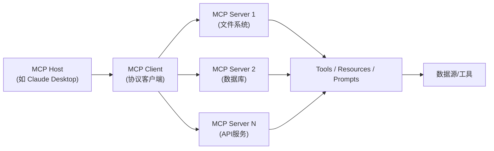

**关键机制**：

1. **能力发现**：Client 连接 Server 后，通过 `list_tools`、`list_resources`、`list_prompts` 发现可用能力。
2. **标准化调用**：通过 `call_tool`、`read_resource`、`get_prompt` 等标准方法调用。
3. **解耦架构**：Server 独立部署，可被任何支持 MCP 的 Client 使用。
4. **协议中立**：基于 JSON-RPC，与具体编程语言无关。

### 导入与全局配置

```python
"""
MCP (Model Context Protocol) — 模型上下文协议
模拟 MCP 的核心机制：Server / Client / Host 三层架构
实现工具的标准化注册、发现和调用
"""

import json
import os
import re
from typing import Any, Callable
from openai import OpenAI
```

### MCPServer — 工具/资源/提示注册

```python
# ============================================================
# 1. MCP Server：注册和暴露 tools / resources / prompts
# ============================================================
class MCPResource:
    """MCP 资源：可被读取的数据源"""
    def __init__(self, uri: str, name: str, description: str, read_fn: Callable):
        self.uri = uri              # 资源唯一标识（如 "file:///docs/readme.md"）
        self.name = name
        self.description = description
        self.read_fn = read_fn      # 读取函数

    def read(self) -> str:
        return self.read_fn()


class MCPTool:
    """MCP 工具：可被 LLM 调用的函数"""
    def __init__(self, name: str, description: str, input_schema: dict, handler: Callable):
        self.name = name
        self.description = description
        self.input_schema = input_schema  # JSON Schema 描述参数
        self.handler = handler            # 实际执行函数

    def call(self, arguments: dict) -> str:
        return self.handler(**arguments)


class MCPPrompt:
    """MCP 提示模板：预定义的提示"""
    def __init__(self, name: str, description: str, template: str):
        self.name = name
        self.description = description
        self.template = template

    def render(self, **kwargs) -> str:
        return self.template.format(**kwargs)


class MCPServer:
    """
    MCP Server：注册和暴露 tools / resources / prompts。
    模拟真实 MCP Server 的能力注册与暴露机制。
    """

    def __init__(self, name: str, version: str = "1.0.0"):
        self.name = name
        self.version = version
        self.tools: dict[str, MCPTool] = {}
        self.resources: dict[str, MCPResource] = {}
        self.prompts: dict[str, MCPPrompt] = {}

    def register_tool(self, tool: MCPTool):
        """注册工具"""
        self.tools[tool.name] = tool
        return self

    def register_resource(self, resource: MCPResource):
        """注册资源"""
        self.resources[resource.uri] = resource
        return self

    def register_prompt(self, prompt: MCPPrompt):
        """注册提示模板"""
        self.prompts[prompt.name] = prompt
        return self

    def list_tools(self) -> list[dict]:
        """列出所有工具（MCP 标准方法）"""
        return [
            {
                "name": t.name,
                "description": t.description,
                "inputSchema": t.input_schema,
            }
            for t in self.tools.values()
        ]

    def list_resources(self) -> list[dict]:
        """列出所有资源（MCP 标准方法）"""
        return [
            {"uri": r.uri, "name": r.name, "description": r.description}
            for r in self.resources.values()
        ]

    def list_prompts(self) -> list[dict]:
        """列出所有提示模板（MCP 标准方法）"""
        return [
            {"name": p.name, "description": p.description}
            for p in self.prompts.values()
        ]

    def call_tool(self, name: str, arguments: dict) -> str:
        """调用工具（MCP 标准方法）"""
        if name not in self.tools:
            return f"错误：工具 '{name}' 不存在"
        return self.tools[name].call(arguments)

    def read_resource(self, uri: str) -> str:
        """读取资源（MCP 标准方法）"""
        if uri not in self.resources:
            return f"错误：资源 '{uri}' 不存在"
        return self.resources[uri].read()

    def get_prompt(self, name: str, **kwargs) -> str:
        """获取提示模板（MCP 标准方法）"""
        if name not in self.prompts:
            return f"错误：提示 '{name}' 不存在"
        return self.prompts[name].render(**kwargs)
```

### MCPClient — 连接与能力发现

```python
# ============================================================
# 2. MCP Client：连接 Server、发现能力、调用工具
# ============================================================
class MCPClient:
    """
    MCP Client：连接一个或多个 MCP Server，
    聚合它们的能力，提供统一的调用接口。
    """

    def __init__(self):
        self.servers: dict[str, MCPServer] = {}

    def connect(self, server: MCPServer):
        """连接到一个 MCP Server"""
        self.servers[server.name] = server
        print(f"  [MCPClient] 已连接 Server: {server.name} (v{server.version})")
        return self

    def list_all_tools(self) -> list[dict]:
        """聚合所有 Server 的工具，并标注来源"""
        all_tools = []
        for server_name, server in self.servers.items():
            for tool in server.list_tools():
                tool["server"] = server_name  # 标注来源 Server
                all_tools.append(tool)
        return all_tools

    def list_all_resources(self) -> list[dict]:
        """聚合所有 Server 的资源"""
        all_resources = []
        for server_name, server in self.servers.items():
            for res in server.list_resources():
                res["server"] = server_name
                all_resources.append(res)
        return all_resources

    def list_all_prompts(self) -> list[dict]:
        """聚合所有 Server 的提示模板"""
        all_prompts = []
        for server_name, server in self.servers.items():
            for p in server.list_prompts():
                p["server"] = server_name
                all_prompts.append(p)
        return all_prompts

    def call_tool(self, server_name: str, tool_name: str, arguments: dict) -> str:
        """调用指定 Server 的工具"""
        if server_name not in self.servers:
            return f"错误：Server '{server_name}' 未连接"
        return self.servers[server_name].call_tool(tool_name, arguments)

    def read_resource(self, server_name: str, uri: str) -> str:
        """读取指定 Server 的资源"""
        if server_name not in self.servers:
            return f"错误：Server '{server_name}' 未连接"
        return self.servers[server_name].read_resource(uri)

    def discover_capabilities(self):
        """发现并打印所有已连接 Server 的能力"""
        print(f"\n  [MCPClient] 能力发现:")
        print(f"  ├── 工具 ({len(self.list_all_tools())} 个):")
        for t in self.list_all_tools():
            print(f"  │   • [{t['server']}] {t['name']}: {t['description']}")
        print(f"  ├── 资源 ({len(self.list_all_resources())} 个):")
        for r in self.list_all_resources():
            print(f"  │   • [{r['server']}] {r['name']}: {r['description']}")
        print(f"  └── 提示 ({len(self.list_all_prompts())} 个):")
        for p in self.list_all_prompts():
            print(f"      • [{p['server']}] {p['name']}: {p['description']}")
```

### MCPHost — 整合 LLM 与 MCP Client

```python
# ============================================================
# 3. MCP Host：整合 LLM 和 MCP Client，实现完整工具调用流程
# ============================================================
class MCPHost:
    """
    MCP Host：宿主应用，整合 LLM 与 MCP Client。
    负责：将 MCP 工具转换为 LLM 可用的 function calling 格式，
    执行 LLM 决策的工具调用，并将结果返回给 LLM。
    """

    def __init__(self, client: OpenAI, model: str = "gpt-4o"):
        self.client = client
        self.model = model
        self.mcp_client = MCPClient()

    def attach_server(self, server: MCPServer):
        """挂载一个 MCP Server"""
        self.mcp_client.connect(server)
        return self

    def _mcp_tools_to_openai_tools(self) -> list[dict]:
        """将 MCP 工具转换为 OpenAI function calling 格式"""
        openai_tools = []
        for tool in self.mcp_client.list_all_tools():
            openai_tools.append({
                "type": "function",
                "function": {
                    "name": f"{tool['server']}__{tool['name']}",  # 用 server__tool 命名避免冲突
                    "description": f"[{tool['server']}] {tool['description']}",
                    "parameters": tool["inputSchema"],
                },
            })
        return openai_tools

    def _execute_tool_call(self, full_name: str, arguments: dict) -> str:
        """执行工具调用：解析 server 和 tool 名称并调用"""
        parts = full_name.split("__", 1)
        if len(parts) != 2:
            return f"错误：工具名称格式不正确: {full_name}"
        server_name, tool_name = parts
        return self.mcp_client.call_tool(server_name, tool_name, arguments)

    def chat(self, user_input: str, max_iterations: int = 5) -> str:
        """
        与 LLM 对话，自动发现并调用 MCP 工具。
        支持 multi-turn 工具调用循环。
        """
        print(f"\n{'='*60}")
        print(f"[MCPHost] 用户输入: {user_input}")
        print(f"{'='*60}")

        # 发现可用能力
        self.mcp_client.discover_capabilities()

        messages = [
            {"role": "system", "content": "你是一个能干助手，可以通过调用工具来帮助用户完成任务。请优先使用可用工具。"},
            {"role": "user", "content": user_input},
        ]
        tools = self._mcp_tools_to_openai_tools()

        for iteration in range(max_iterations):
            print(f"\n  --- 对话轮次 {iteration + 1} ---")
            response = self.client.chat.completions.create(
                model=self.model,
                messages=messages,
                tools=tools if tools else None,
                temperature=0.3,
            )

            msg = response.choices[0].message

            # 如果没有工具调用，返回最终回答
            if not msg.tool_calls:
                print(f"  [MCPHost] LLM 返回最终回答")
                return msg.content

            messages.append(msg)

            # 执行所有工具调用
            for tool_call in msg.tool_calls:
                func_name = tool_call.function.name
                try:
                    args = json.loads(tool_call.function.arguments)
                except json.JSONDecodeError:
                    args = {}

                print(f"  [MCPHost] 调用工具: {func_name}({args})")
                result = self._execute_tool_call(func_name, args)
                print(f"  [MCPHost] 工具返回: {result[:100]}...")

                messages.append({
                    "role": "tool",
                    "tool_call_id": tool_call.id,
                    "content": result,
                })

        return "已达最大对话轮次，未能完成任务。"
```

### 文件系统 MCP Server

```python
# ============================================================
# 4. 示例 Server 1：文件系统 MCP Server
# ============================================================
def build_filesystem_server() -> MCPServer:
    """构建一个模拟的文件系统 MCP Server"""
    server = MCPServer(name="filesystem", version="1.0.0")

    # 模拟文件存储
    fake_files = {
        "file:///docs/readme.md": "# 项目说明\n这是一个 AI Agent 设计模式示例项目。",
        "file:///docs/api.md": "# API 文档\n- GET /users\n- POST /messages",
        "file:///config/settings.json": '{"model": "gpt-4o", "temperature": 0.3}',
    }

    # 注册工具：读取文件
    server.register_tool(MCPTool(
        name="read_file",
        description="读取指定路径的文件内容",
        input_schema={
            "type": "object",
            "properties": {
                "path": {"type": "string", "description": "文件路径，如 /docs/readme.md"}
            },
            "required": ["path"],
        },
        handler=lambda path: fake_files.get(f"file://{path}", f"文件不存在: {path}"),
    ))

    # 注册工具：列出文件
    server.register_tool(MCPTool(
        name="list_files",
        description="列出所有可用的文件",
        input_schema={"type": "object", "properties": {}},
        handler=lambda: json.dumps(
            [uri.replace("file://", "") for uri in fake_files.keys()],
            ensure_ascii=False,
        ),
    ))

    # 注册资源：每个文件作为一个资源
    for uri, content in fake_files.items():
        name = uri.split("/")[-1]
        server.register_resource(MCPResource(
            uri=uri,
            name=name,
            description=f"文件 {name}",
            read_fn=lambda c=content: c,
        ))

    # 注册提示模板
    server.register_prompt(MCPPrompt(
        name="summarize_file",
        description="生成文件摘要的提示模板",
        template="请为以下文件内容生成简洁摘要:\n\n文件: {filename}\n内容:\n{content}",
    ))

    return server
```

### 数据库 MCP Server

```python
# ============================================================
# 5. 示例 Server 2：数据库 MCP Server
# ============================================================
def build_database_server() -> MCPServer:
    """构建一个模拟的数据库 MCP Server"""
    server = MCPServer(name="database", version="1.0.0")

    # 模拟数据库表
    fake_db = {
        "users": [
            {"id": 1, "name": "张三", "email": "zhangsan@example.com", "age": 28},
            {"id": 2, "name": "李四", "email": "lisi@example.com", "age": 34},
            {"id": 3, "name": "王五", "email": "wangwu@example.com", "age": 25},
        ],
        "orders": [
            {"id": 101, "user_id": 1, "product": "笔记本电脑", "amount": 8999},
            {"id": 102, "user_id": 2, "product": "手机", "amount": 4999},
            {"id": 103, "user_id": 1, "product": "耳机", "amount": 999},
        ],
    }

    def query_table(table_name: str) -> str:
        """查询表数据"""
        if table_name not in fake_db:
            return f"表不存在: {table_name}"
        return json.dumps(fake_db[table_name], ensure_ascii=False)

    def query_user(user_id: int) -> str:
        """按 ID 查询用户"""
        for user in fake_db["users"]:
            if user["id"] == user_id:
                return json.dumps(user, ensure_ascii=False)
        return f"用户不存在: {user_id}"

    def get_user_orders(user_id: int) -> str:
        """获取用户订单"""
        orders = [o for o in fake_db["orders"] if o["user_id"] == user_id]
        return json.dumps(orders, ensure_ascii=False)

    # 注册工具
    server.register_tool(MCPTool(
        name="query_table",
        description="查询数据库表的所有数据",
        input_schema={
            "type": "object",
            "properties": {
                "table_name": {"type": "string", "description": "表名: users 或 orders"}
            },
            "required": ["table_name"],
        },
        handler=query_table,
    ))

    server.register_tool(MCPTool(
        name="query_user",
        description="按用户 ID 查询用户信息",
        input_schema={
            "type": "object",
            "properties": {
                "user_id": {"type": "integer", "description": "用户 ID"}
            },
            "required": ["user_id"],
        },
        handler=query_user,
    ))

    server.register_tool(MCPTool(
        name="get_user_orders",
        description="获取指定用户的所有订单",
        input_schema={
            "type": "object",
            "properties": {
                "user_id": {"type": "integer", "description": "用户 ID"}
            },
            "required": ["user_id"],
        },
        handler=get_user_orders,
    ))

    # 注册资源：表结构
    server.register_resource(MCPResource(
        uri="db://schema/users",
        name="users_schema",
        description="users 表结构",
        read_fn=lambda: "users(id, name, email, age)",
    ))

    return server
```

### 主流程与演示

```python
# ============================================================
# 6. 完整运行示例
# ============================================================
def main():
    client = OpenAI(
        api_key=os.environ.get("OPENAI_API_KEY", "your-api-key"),
        base_url=os.environ.get("OPENAI_BASE_URL", None),
    )

    # 创建 MCP Host
    host = MCPHost(client, model="gpt-4o")

    # 挂载文件系统 Server 和 数据库 Server
    host.attach_server(build_filesystem_server())
    host.attach_server(build_database_server())

    # 测试用例：跨 Server 的工具调用
    test_queries = [
        "帮我列出所有可用的文件，并读取 readme.md 的内容",
        "查询 users 表的所有用户，然后告诉我 ID 为 1 的用户下了哪些订单",
    ]

    for query in test_queries:
        result = host.chat(query)
        print(f"\n最终回答:\n{result}")
        print()


if __name__ == "__main__":
    main()
```

### 要点总结

| 要素 | MCP 模式 | 传统 Function Calling |
|------|---------|----------------------|
| 工具部署 | 独立 Server 进程，可远程 | 工具定义在应用代码内 |
| 复用性 | 一次开发，处处可用 | 每个应用需重新实现 |
| 能力发现 | 运行时动态发现 | 静态注册 |
| 协议标准 | 开放协议，跨语言跨平台 | 各厂商 API 各异 |
| 扩展性 | 新增 Server 即可扩展能力 | 需修改应用代码 |

---

## 6.7 Semantic Kernel — 语义内核模式

### 概念说明

Semantic Kernel（语义内核）是微软推出的开源 SDK（https://github.com/microsoft/semantic-kernel）。其核心思想是将 AI 能力封装为可组合的"技能"（Skills/Plugins），通过"计划器"（Planner）自动编排技能执行。

> **类比理解**：Semantic Kernel 就像是"AI 应用的操作系统"——操作系统管理硬件资源、调度进程、提供系统调用；Semantic Kernel 则管理 AI 技能、调度执行计划、提供统一的调用接口。开发者只需注册技能，由"计划器"自动决定如何组合技能来完成用户任务。

**核心组件**：

| 组件 | 作用 | 类比 |
|------|------|------|
| **Kernel** | 核心引擎，管理技能和内存 | 操作系统内核 |
| **Plugins/Skills** | 可复用的 AI 能力单元 | 可执行程序 |
| **Planner** | 根据用户意图自动制定执行计划 | 任务调度器 |
| **Memory** | 短期和长期记忆管理 | 内存与存储 |

**两种函数类型**：

- **Semantic Function（语义函数）**：基于 prompt 模板的 AI 能力，由 LLM 执行。
- **Native Function（原生函数）**：原生 Python/JS 函数，执行确定性逻辑。

**与 LangChain 的区别**：

| 维度 | Semantic Kernel | LangChain |
|------|----------------|-----------|
| **核心理念** | 技能组合 + 计划规划 | 链式调用 + 工具集成 |
| **编排方式** | Planner 自动规划执行步骤 | 开发者手动编排 Chain |
| **函数抽象** | 语义函数 + 原生函数统一抽象 | Chain / Tool / Agent 多种抽象 |
| **管道模式** | Pipeline 串联技能，支持上下文传递 | SequentialChain 等链式结构 |

### 核心流程/原理

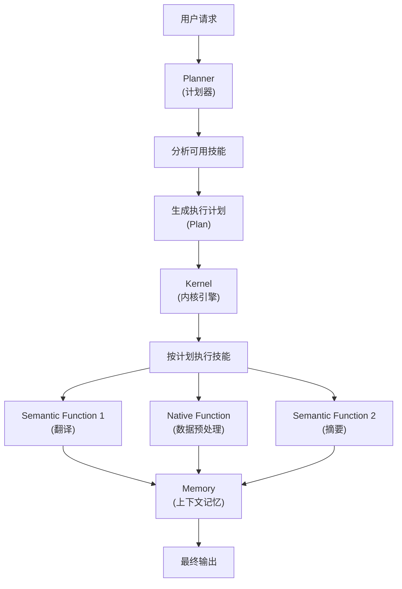

**关键机制**：

1. **技能注册**：所有函数（语义/原生）统一注册到 Kernel。
2. **计划生成**：Planner 根据用户意图和可用技能，自动生成执行步骤。
3. **管道执行**：按计划顺序执行，技能间通过 Memory 传递上下文。
4. **上下文管理**：Memory 保存中间结果，供后续技能使用。

### 导入与全局配置

```python
"""
Semantic Kernel — 语义内核模式
模拟 SK 的核心机制：Kernel / Plugin / Planner / Memory
将 AI 能力封装为可组合技能，由 Planner 自动编排
"""

import json
import os
import re
from typing import Any, Callable
from openai import OpenAI
```

### SemanticFunction — 语义函数

```python
# ============================================================
# 1. Semantic Function：封装 prompt 模板的 AI 能力
# ============================================================
class SemanticFunction:
    """
    语义函数：基于 prompt 模板的 AI 能力单元。
    输入变量通过模板渲染后交给 LLM 执行。
    """

    def __init__(self, name: str, description: str, prompt_template: str,
                 client: OpenAI, model: str = "gpt-4o"):
        self.name = name
        self.description = description
        self.prompt_template = prompt_template
        self.client = client
        self.model = model
        self.input_variables = self._extract_variables(prompt_template)

    def _extract_variables(self, template: str) -> list[str]:
        """从模板中提取变量（{{$variable}} 格式）"""
        return re.findall(r"\{\{\$(\w+)\}\}", template)

    def invoke(self, context: "KernelContext") -> str:
        """执行语义函数：渲染模板 → 调用 LLM"""
        # 渲染 prompt 模板
        prompt = self.prompt_template
        for var in self.input_variables:
            value = context.get_variable(var, "")
            prompt = prompt.replace(f"{{{{${var}}}}}", str(value))

        # 调用 LLM
        response = self.client.chat.completions.create(
            model=self.model,
            messages=[
                {"role": "system", "content": "你是一个专业的AI助手。"},
                {"role": "user", "content": prompt},
            ],
            temperature=0.4,
        )

        result = response.choices[0].message.content
        # 将结果写入上下文
        context.set_variable(f"{self.name}_result", result)
        return result

    def __repr__(self):
        return f"SemanticFunction({self.name})"
```

### NativeFunction — 原生函数

```python
# ============================================================
# 2. Native Function：封装原生 Python 函数
# ============================================================
class NativeFunction:
    """
    原生函数：封装确定性 Python 逻辑。
    与 Semantic Function 统一接口，可被 Planner 编排。
    """

    def __init__(self, name: str, description: str, handler: Callable,
                 input_variables: list[str]):
        self.name = name
        self.description = description
        self.handler = handler
        self.input_variables = input_variables

    def invoke(self, context: "KernelContext") -> str:
        """执行原生函数：从上下文取参数 → 调用函数"""
        kwargs = {}
        for var in self.input_variables:
            kwargs[var] = context.get_variable(var, "")

        result = self.handler(**kwargs)
        result_str = str(result)
        # 将结果写入上下文
        context.set_variable(f"{self.name}_result", result_str)
        return result_str

    def __repr__(self):
        return f"NativeFunction({self.name})"
```

### Memory — 上下文记忆

```python
# ============================================================
# 3. Memory：上下文记忆管理
# ============================================================
class KernelContext:
    """
    内核上下文：在技能执行管道中传递的共享状态。
    管理变量（短期记忆）和历史记录。
    """

    def __init__(self, user_input: str = ""):
        self.variables: dict[str, Any] = {"user_input": user_input}
        self.history: list[dict] = []  # 执行历史

    def get_variable(self, name: str, default: Any = None) -> Any:
        return self.variables.get(name, default)

    def set_variable(self, name: str, value: Any):
        self.variables[name] = value

    def log_step(self, function_name: str, input_summary: str, output_summary: str):
        """记录执行步骤"""
        self.history.append({
            "function": function_name,
            "input": input_summary[:100],
            "output": output_summary[:100],
        })

    def __repr__(self):
        return f"KernelContext(variables={list(self.variables.keys())})"


class Memory:
    """
    记忆管理器：管理短期上下文和长期记忆。
    短期记忆 = 当前会话的 KernelContext
    长期记忆 = 跨会话持久化的信息（简化为字典）
    """

    def __init__(self):
        self.short_term: KernelContext = KernelContext()
        self.long_term: dict[str, str] = {}  # 简化的长期记忆

    def remember(self, key: str, value: str):
        """存入长期记忆"""
        self.long_term[key] = value

    def recall(self, key: str) -> str:
        """从长期记忆中检索"""
        return self.long_term.get(key, "")

    def new_context(self, user_input: str) -> KernelContext:
        """创建新的短期上下文，保留长期记忆"""
        ctx = KernelContext(user_input)
        # 注入相关的长期记忆
        for k, v in self.long_term.items():
            ctx.set_variable(f"memory_{k}", v)
        return ctx
```

### Kernel — 核心引擎

```python
# ============================================================
# 4. Kernel：核心引擎，注册和管理函数
# ============================================================
class Kernel:
    """
    Semantic Kernel 核心引擎。
    职责：注册技能、管理记忆、提供 invoke 接口。
    """

    def __init__(self, client: OpenAI, model: str = "gpt-4o"):
        self.client = client
        self.model = model
        self.functions: dict[str, Any] = {}  # 注册的函数
        self.memory = Memory()
        self.planner = None

    def register_semantic_function(self, name: str, description: str,
                                   prompt_template: str) -> "Kernel":
        """注册语义函数"""
        func = SemanticFunction(name, description, prompt_template,
                                self.client, self.model)
        self.functions[name] = func
        print(f"  [Kernel] 注册语义函数: {name}")
        return self

    def register_native_function(self, name: str, description: str,
                                 handler: Callable,
                                 input_variables: list[str]) -> "Kernel":
        """注册原生函数"""
        func = NativeFunction(name, description, handler, input_variables)
        self.functions[name] = func
        print(f"  [Kernel] 注册原生函数: {name}")
        return self

    def invoke_function(self, name: str, context: KernelContext) -> str:
        """调用单个已注册的函数"""
        if name not in self.functions:
            return f"错误：函数 '{name}' 未注册"
        func = self.functions[name]
        print(f"  [Kernel] 调用函数: {name}")
        result = func.invoke(context)
        context.log_step(name, str(context.variables), result)
        return result

    def invoke_pipeline(self, function_names: list[str],
                        context: KernelContext) -> str:
        """
        按管道顺序执行多个函数。
        每个函数的输出自动写入上下文，供后续函数使用。
        """
        print(f"\n  [Kernel] 执行管道: {' → '.join(function_names)}")
        result = ""
        for name in function_names:
            result = self.invoke_function(name, context)
        return result

    def list_functions(self) -> list[dict]:
        """列出所有已注册的函数"""
        return [
            {
                "name": f.name,
                "type": type(f).__name__,
                "description": f.description,
            }
            for f in self.functions.values()
        ]

    def set_planner(self, planner: "Planner"):
        """设置计划器"""
        self.planner = planner
        return self
```

### Planner — 计划器

```python
# ============================================================
# 5. Planner：根据用户请求自动规划执行步骤
# ============================================================
class Planner:
    """
    计划器：根据用户意图和可用技能，自动生成执行计划。
    利用 LLM 分析任务，选择合适的技能组合。
    """

    def __init__(self, client: OpenAI, model: str = "gpt-4o"):
        self.client = client
        self.model = model

    def create_plan(self, user_input: str, available_functions: list[dict]) -> list[str]:
        """
        生成执行计划：返回函数名称的有序列表。
        """
        # 构建技能描述
        func_descriptions = "\n".join([
            f"- {f['name']} ({f['type']}): {f['description']}"
            for f in available_functions
        ])

        prompt = f"""你是一个任务规划器。根据用户请求，从可用技能中选择并排列出执行顺序。

可用技能:
{func_descriptions}

用户请求: {user_input}

请分析任务并制定执行计划。要求:
1. 只选择必要的技能
2. 按合理的执行顺序排列
3. 技能之间通过上下文传递数据

请以JSON格式输出:
{{
    "plan": ["技能1", "技能2", ...],
    "reasoning": "规划理由"
}}"""

        response = self.client.chat.completions.create(
            model=self.model,
            messages=[
                {"role": "system", "content": "你是一个专业的任务规划AI。"},
                {"role": "user", "content": prompt},
            ],
            temperature=0.2,
        )

        content = response.choices[0].message.content
        match = re.search(r"\{.*\}", content, re.DOTALL)
        if match:
            try:
                plan_data = json.loads(match.group())
                plan = plan_data.get("plan", [])
                reasoning = plan_data.get("reasoning", "")
                print(f"\n  [Planner] 规划理由: {reasoning}")
                print(f"  [Planner] 执行计划: {' → '.join(plan)}")
                return plan
            except json.JSONDecodeError:
                pass

        # 回退：返回空计划
        print(f"  [Planner] 规划失败，返回空计划")
        return []
```

### 主流程与演示 — 技能注册

```python
# ============================================================
# 6. 完整运行示例
# ============================================================
def main():
    client = OpenAI(
        api_key=os.environ.get("OPENAI_API_KEY", "your-api-key"),
        base_url=os.environ.get("OPENAI_BASE_URL", None),
    )

    # 创建 Kernel
    kernel = Kernel(client, model="gpt-4o")

    # --- 注册语义函数 ---
    kernel.register_semantic_function(
        name="translate",
        description="将文本翻译为指定语言",
        prompt_template="请将以下文本翻译为{{target_language}}:\n\n{{text}}\n\n只输出翻译结果。",
    )

    kernel.register_semantic_function(
        name="summarize",
        description="生成文本的简洁摘要",
        prompt_template="请为以下文本生成一段简洁的摘要（不超过100字）:\n\n{{text}}\n\n摘要:",
    )

    kernel.register_semantic_function(
        name="sentiment_analysis",
        description="分析文本的情感倾向",
        prompt_template="分析以下文本的情感倾向，输出JSON格式:\n\n文本: {{text}}\n\n输出格式: {{\"sentiment\": \"正面/负面/中性\", \"confidence\": 0.0-1.0}}",
    )

    kernel.register_semantic_function(
        name="keyword_extraction",
        description="从文本中提取关键词",
        prompt_template="从以下文本中提取5个关键词，用逗号分隔:\n\n{{text}}\n\n关键词:",
    )

    # --- 注册原生函数 ---
    def count_words(text: str) -> str:
        """统计文本字数"""
        return f"字数: {len(text)}"

    kernel.register_native_function(
        name="word_count",
        description="统计文本的字数",
        handler=count_words,
        input_variables=["text"],
    )
```

### 主流程与演示 — 自动规划与执行

```python
    # --- 设置计划器 ---
    planner = Planner(client, model="gpt-4o")
    kernel.set_planner(planner)

    # --- 测试用例 ---
    test_requests = [
        "请把这段话翻译成英文，然后生成摘要，并提取关键词: 人工智能正在改变世界，从医疗到教育，从交通到娱乐，AI的影响无处不在。",
        "分析这段文本的情感，并统计字数: 这个产品太棒了，强烈推荐给大家！",
    ]

    for request in test_requests:
        print(f"\n{'#'*60}")
        print(f"用户请求: {request}")
        print(f"{'#'*60}")

        # 创建上下文
        context = kernel.memory.new_context(request)
        # 将用户请求中的文本提取到 text 变量（简化处理）
        text_start = request.find(":") + 1 if ":" in request else 0
        context.set_variable("text", request[text_start:].strip())
        context.set_variable("target_language", "英文")

        # Planner 自动规划
        plan = planner.create_plan(request, kernel.list_functions())

        if plan:
            # 按计划执行管道
            final_result = kernel.invoke_pipeline(plan, context)
            print(f"\n最终结果:\n{final_result}")

            # 打印执行历史
            print(f"\n执行历史:")
            for i, step in enumerate(context.history, 1):
                print(f"  {i}. {step['function']}: {step['output'][:50]}...")
        else:
            print("无法生成执行计划")


if __name__ == "__main__":
    main()
```

### 要点总结

| 要素 | Semantic Kernel | LangChain |
|------|----------------|-----------|
| 核心理念 | 技能组合 + 自动规划 | 链式调用 + 手动编排 |
| 函数抽象 | 语义函数 + 原生函数统一 | Chain / Tool / Agent 多种抽象 |
| 编排方式 | Planner 自动生成执行计划 | 开发者手动构建 Chain |
| 上下文管理 | KernelContext + Memory | Memory / State 手动管理 |
| 管道模式 | Pipeline 自动传递上下文 | SequentialChain 显式连接 |
| 适用场景 | 复杂多技能任务、动态编排 | 固定流程、工具集成 |

---

## 6.8 Prompt Chaining — 提示链

### 概念说明

Prompt Chaining（提示链）源自 Anthropic 在《Building Effective Agents》（2024.12）中总结的 Agent 编排范式。它的核心思想是：**将一个复杂任务分解为一系列顺序执行的 LLM 调用步骤，每一步处理前一步的输出**，并在中间步骤之间插入程序化的"门控"（gate）检查点——只有当中间结果通过验证时，流程才继续向下传递，否则提前终止或重试。

可以把它类比成**工厂流水线**：每个工位完成一道工序（一次 LLM 调用），工件在传到下一个工位之前必须经过质检（gate）。质检合格的工件继续流转，不合格的则被拦截返工或直接报废。与一次性的"端到端生成"相比，这种分阶段方式让每一步都可以独立调优（不同的 prompt、模型、温度参数），并且质量问题能在最早环节被发现，而不是等到最终输出才暴露。

Prompt Chaining 是所有 Agent 编排模式中最简单的一种——它是一条**严格的线性链**，没有动态路由、没有循环回路、没有并行分支。正是这种简单性带来了极高的可预测性和可调试性：开发者能清楚地知道数据如何从第一步流到最后一步，每一步的输入输出都可观测、可验证。它适合那些**天然分阶段、且每阶段有明确验收标准**的任务，例如"生成大纲 → 扩展正文 → 润色校对"、"写代码 → 安全审查 → 生成测试"、"翻译 → 审校 → 术语统一"等。

### 核心流程/原理

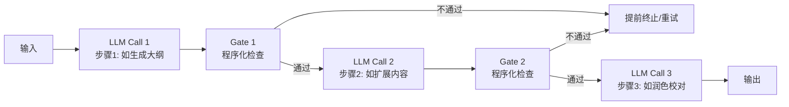

**关键点**：
1. **固定顺序**：链的执行路径在编排时就已确定，运行时不会根据输入动态改变走向（这是与 Router 的本质区别）。
2. **串行传递**：每一步的输出原样（或经简单变换后）作为下一步的输入，数据沿链单向流动。
3. **程序化门控**：在 LLM 调用之间插入确定性代码检查（如长度、关键词、JSON 合法性、正则匹配），用"硬约束"弥补 LLM 输出的不确定性。
4. **可重试可终止**：门控不通过时，可对当前步骤重试（调整温度或追加提示），多次失败则提前终止整条链，避免错误向后传播。
5. **每步可独立调参**：不同步骤可使用不同模型、温度、prompt——例如大纲用低温保证结构稳定，正文用较高温度激发创造性。

### 完整 Python 示例代码

#### 环境配置与客户端初始化

```python
"""
Prompt Chaining - 提示链
将任务分解为顺序LLM调用，中间插入程序化门控
参考: Anthropic "Building Effective Agents" (2024.12)
"""
import os
import json
import re
from dataclasses import dataclass
from typing import Callable, Optional
from openai import OpenAI

client = OpenAI(
    api_key=os.environ.get("OPENAI_API_KEY", "your-api-key-here"),
    base_url=os.environ.get("OPENAI_BASE_URL", None),
)
```

#### 核心类/函数实现

```python
# ============================================================
# 1. Gate 函数：程序化检查点，验证中间结果是否合格
#    每个门控返回 (是否通过, 原因说明) 二元组
# ============================================================
def length_gate(min_len: int = 0, max_len: int = 100000) -> Callable[[str], tuple[bool, str]]:
    """长度门控：检查输出长度是否在 [min_len, max_len] 范围内"""
    def check(text: str) -> tuple[bool, str]:
        n = len(text.strip())
        if n < min_len:
            return False, f"长度不足: {n} < {min_len}"
        if n > max_len:
            return False, f"长度超限: {n} > {max_len}"
        return True, f"长度合格: {n}"
    return check


def keyword_gate(keywords: list[str]) -> Callable[[str], tuple[bool, str]]:
    """关键词门控：检查输出是否包含所有必需关键词"""
    def check(text: str) -> tuple[bool, str]:
        missing = [k for k in keywords if k not in text]
        if missing:
            return False, f"缺少关键词: {missing}"
        return True, "关键词齐全"
    return check


def json_gate() -> Callable[[str], tuple[bool, str]]:
    """JSON 门控：检查输出是否为合法 JSON"""
    def check(text: str) -> tuple[bool, str]:
        try:
            json.loads(text.strip())
            return True, "JSON 合法"
        except json.JSONDecodeError as e:
            return False, f"JSON 解析失败: {e}"
    return check


def outline_gate(min_sections: int = 3) -> Callable[[str], tuple[bool, str]]:
    """大纲门控：检查大纲是否包含至少 min_sections 个章节（按编号或标题标记识别）"""
    def check(text: str) -> tuple[bool, str]:
        # 识别形如 "1." "2." 或 "# " "## " 的章节标记
        sections = re.findall(r"(?:^|\n)\s*(?:\d+\.|#+\s)", text)
        if len(sections) < min_sections:
            return False, f"章节数不足: {len(sections)} < {min_sections}"
        return True, f"章节数合格: {len(sections)}"
    return check


# ============================================================
# 2. ChainStep：链中的一个步骤（dataclass）
# ============================================================
@dataclass
class ChainStep:
    """提示链中的一个步骤"""
    name: str                                                   # 步骤名称
    prompt_template: str                                        # prompt 模板，用 {input} 占位上一步输出
    model: str = "gpt-4o"                                       # 使用的模型
    temperature: float = 0.7                                    # 温度参数
    gate: Optional[Callable[[str], tuple[bool, str]]] = None    # 执行后的门控函数
    max_retries: int = 2                                        # 门控不通过时的最大重试次数


# ============================================================
# 3. PromptChain：提示链编排器
#    - add_step(step): 添加步骤
#    - run(input): 顺序执行所有步骤，每步输出传给下步
#    - 每步执行后调用 gate 检查，不通过则重试或终止
# ============================================================
class PromptChain:
    """顺序执行多个 LLM 调用，每步可插入程序化门控"""

    def __init__(self, client: OpenAI):
        self.client = client
        self.steps: list[ChainStep] = []
        self.log: list[dict] = []  # 执行日志

    def add_step(self, step: ChainStep) -> "PromptChain":
        """添加一个步骤到链末尾"""
        self.steps.append(step)
        return self

    def _call_llm(self, step: ChainStep, user_input: str) -> str:
        """执行单次 LLM 调用：把上一步输出注入 {input} 占位符"""
        prompt = step.prompt_template.format(input=user_input)
        resp = self.client.chat.completions.create(
            model=step.model,
            temperature=step.temperature,
            messages=[{"role": "user", "content": prompt}],
        )
        return (resp.choices[0].message.content or "").strip()

    def run(self, initial_input: str) -> str:
        """顺序执行所有步骤，每步输出作为下步输入；门控不通过则重试或终止"""
        current = initial_input
        for idx, step in enumerate(self.steps, 1):
            print(f"\n{'='*60}\n[步骤 {idx}] {step.name}\n{'='*60}")

            output = ""
            attempt = 0
            gate_passed = True

            # 执行 LLM 调用 + 门控检查（含重试）
            while True:
                attempt += 1
                print(f"  → 第 {attempt} 次调用 LLM (model={step.model}, T={step.temperature})")
                output = self._call_llm(step, current)
                print(f"  输出预览: {output[:80]}...")

                if step.gate is None:
                    gate_passed = True
                    break

                passed, msg = step.gate(output)
                print(f"  门控检查: {msg}")
                if passed:
                    break
                if attempt > step.max_retries:
                    gate_passed = False
                    break
                print(f"  门控未通过，重试中... ({attempt}/{step.max_retries})")

            self.log.append({
                "step": step.name,
                "attempt": attempt,
                "gate_passed": gate_passed,
                "output_preview": output[:100],
            })

            if not gate_passed:
                # 门控最终未通过：提前终止整条链，避免错误向后传播
                print(f"\n✗ 步骤 [{step.name}] 门控未通过，链提前终止")
                return f"[CHAIN TERMINATED] 步骤 '{step.name}' 未通过门控"

            # 当前步骤输出作为下一步输入
            current = output
            print(f"  ✓ 通过，进入下一步")

        return current
```

#### 主流程演示

```python
if __name__ == "__main__":
    # ============================================================
    # 演示场景：文章生成流水线
    #   Step 1: 生成大纲   (gate: 至少3个章节)
    #   Step 2: 扩展正文   (gate: 字数 > 500)
    #   Step 3: 润色校对   (gate: 润色后长度不致过短)
    # ============================================================
    chain = PromptChain(client)

    # Step 1: 生成大纲（低温保证结构稳定）
    chain.add_step(ChainStep(
        name="生成大纲",
        prompt_template=(
            "你是一位技术写作专家。请为以下主题生成一份文章大纲，"
            "用 '1.' '2.' '3.' 的编号列出至少3个章节，每个章节附一句话说明。\n\n"
            "主题: {input}\n\n大纲:"
        ),
        model="gpt-4o",
        temperature=0.3,
        gate=outline_gate(min_sections=3),
        max_retries=2,
    ))

    # Step 2: 扩展正文（中温激发创造性）
    chain.add_step(ChainStep(
        name="扩展正文",
        prompt_template=(
            "请根据以下大纲扩写为完整正文，要求内容详实，总字数不少于500字。\n\n"
            "大纲:\n{input}\n\n正文:"
        ),
        model="gpt-4o",
        temperature=0.7,
        gate=length_gate(min_len=500, max_len=5000),
        max_retries=2,
    ))

    # Step 3: 润色校对（低温忠实原文）
    chain.add_step(ChainStep(
        name="润色校对",
        prompt_template=(
            "请对以下文章进行润色校对：修正语法错误、优化表达、统一术语。"
            "直接输出润色后的全文，不要附加说明。\n\n"
            "原文:\n{input}\n\n润色后:"
        ),
        model="gpt-4o",
        temperature=0.2,
        gate=length_gate(min_len=400, max_len=6000),
        max_retries=1,
    ))

    # 运行流水线
    topic = "Prompt Chaining：如何用提示链构建可靠的 LLM 工作流"
    print(f"输入主题: {topic}")
    final = chain.run(topic)

    print(f"\n{'#'*60}")
    print("最终输出:")
    print(f"{'#'*60}")
    print(final)

    # 打印执行日志
    print(f"\n{'#'*60}")
    print("执行日志:")
    print(f"{'#'*60}")
    for entry in chain.log:
        status = "✓" if entry["gate_passed"] else "✗"
        print(f"  {status} [{entry['step']}] 尝试 {entry['attempt']} 次 | {entry['output_preview']}...")
```

### 代码要点说明

- **`ChainStep` dataclass**：描述链中的一个步骤，封装了 `prompt_template`、`model`、`temperature`、`gate`（门控函数）和 `max_retries`（重试次数）。每步独立配置参数正是提示链"分阶段调优"的体现。
- **`gate` 函数族**（`length_gate` / `keyword_gate` / `json_gate` / `outline_gate`）：对应"程序化门控"环节。它们是纯 Python 函数，返回 `(是否通过, 原因)` 二元组，用确定性逻辑验证 LLM 的非确定性输出。例如 `outline_gate` 用正则识别章节编号，确保大纲至少包含 3 个章节。
- **`PromptChain.run()`**：对应"顺序执行 + 门控检查"的核心流程。它依次执行每个步骤，把当前步骤输出作为下一步输入；每步执行后调用 `gate` 检查，未通过则在 `max_retries` 内重试，仍不通过则提前终止整条链并返回终止标记——这正是"质检不合格则停产"的流水线语义。
- **`PromptChain._call_llm()`**：封装单次 LLM 调用，用 `{input}` 占位符把上一步输出注入当前 prompt，体现"每步输出作为下步输入"。
- **演示场景**：文章生成流水线展示了三步链——生成大纲（低温 + 大纲门控）→ 扩展正文（中温 + 长度门控）→ 润色校对（低温 + 长度门控），每步温度和门控都针对该阶段目标定制。

---

## 6.9 Orchestrator-Workers — "总调度"

> **原理**：来自 Anthropic《Building Effective Agents》（2024.12）。一个 Orchestrator Agent 动态分解任务并分派给多个 Worker Agent 并行执行，最后汇总结果。与 Map-Reduce 的区别：Map-Reduce 是静态预定义的拆分，Orchestrator-Workers 是 LLM 动态决定如何拆分和分派。

| 属性 | 内容 |
|------|------|
| **核心思想** | Orchestrator 动态分解 → Workers 并行执行 → Orchestrator 汇总 |
| **与 Map-Reduce 区别** | Map-Reduce 静态拆分；Orchestrator-Workers 动态拆分 |
| **与 Prompt Chaining 区别** | Chaining 串行；Orchestrator-Workers 并行 |
| **适用场景** | 需要动态分解的复杂任务、多来源信息汇总、并行研究 |
| **局限性** | Orchestrator 分解质量决定整体效果；Worker 间结果可能冲突 |

### 核心流程

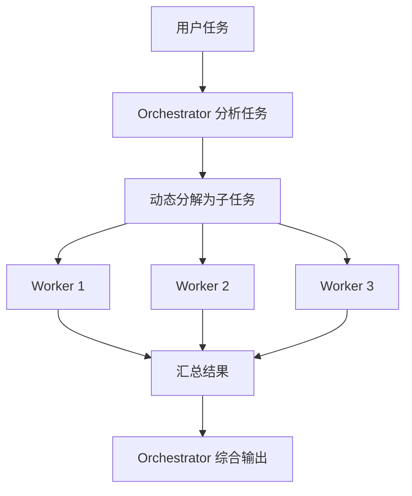

### 代码示例

```python
from openai import OpenAI
import os
import json
import concurrent.futures

client = OpenAI(
    base_url=os.environ.get("OPENAI_BASE_URL"),
    api_key=os.environ.get("OPENAI_API_KEY"),
)

class OrchestratorWorkers:
    """Orchestrator-Workers 模式
    
    Orchestrator 动态分解任务 → Workers 并行执行 → Orchestrator 汇总
    """
    
    def __init__(self, model: str = "gpt-4o", worker_model: str = "gpt-4o-mini"):
        self.model = model
        self.worker_model = worker_model
    
    def _decompose(self, task: str) -> list[str]:
        """Orchestrator 动态分解任务"""
        response = client.chat.completions.create(
            model=self.model,
            messages=[
                {"role": "system", "content": "你是任务调度器。将用户任务分解为可并行执行的子任务。"},
                {"role": "user", "content": f"任务：{task}\n\n返回 JSON：{{\"subtasks\": [\"子任务1\", \"子任务2\", ...]}}"}
            ],
            response_format={"type": "json_object"}
        )
        try:
            result = json.loads(response.choices[0].message.content or "{}")
            return result.get("subtasks", [])
        except (json.JSONDecodeError, TypeError):
            return [task]  # 降级：不分解
    
    def _worker_execute(self, subtask: str) -> str:
        """Worker 执行子任务"""
        response = client.chat.completions.create(
            model=self.worker_model,
            messages=[{"role": "user", "content": subtask}]
        )
        return response.choices[0].message.content or ""
    
    def _synthesize(self, task: str, results: list[str]) -> str:
        """Orchestrator 汇总结果"""
        combined = "\n\n---\n\n".join(
            f"子任务 {i+1} 结果：\n{r}" for i, r in enumerate(results)
        )
        response = client.chat.completions.create(
            model=self.model,
            messages=[
                {"role": "system", "content": "你是综合分析器。将多个子任务结果整合为连贯的最终回答。"},
                {"role": "user", "content": f"原始任务：{task}\n\n各子任务结果：\n{combined}"}
            ]
        )
        return response.choices[0].message.content or ""
    
    def run(self, task: str) -> str:
        """执行完整流程"""
        # 1. Orchestrator 分解
        subtasks = self._decompose(task)
        print(f"分解为 {len(subtasks)} 个子任务")
        
        # 2. Workers 并行执行
        with concurrent.futures.ThreadPoolExecutor(max_workers=5) as executor:
            futures = {executor.submit(self._worker_execute, st): i 
                       for i, st in enumerate(subtasks)}
            results = [None] * len(subtasks)
            for future in concurrent.futures.as_completed(futures):
                idx = futures[future]
                results[idx] = future.result()
        
        # 3. Orchestrator 汇总
        return self._synthesize(task, results)


# 使用示例
if __name__ == "__main__":
    ow = OrchestratorWorkers(model="gpt-4o", worker_model="gpt-4o-mini")
    
    result = ow.run("分析 2025 年 AI Agent 领域的三个最重要趋势")
    print(result)
```

---

## 6.10 Evaluator-Optimizer — "打磨师"

> **原理**：来自 Anthropic《Building Effective Agents》（2024.12）。LLM 生成输出后，由 Evaluator 评估质量并给出反馈，Generator 根据反馈优化输出，循环直到 Evaluator 满意。与 Self-Refine 的区别：Self-Refine 是同一个 LLM 自我评价；Evaluator-Optimizer 使用独立的 Evaluator 角色，评估更客观。

| 属性 | 内容 |
|------|------|
| **核心思想** | Generator 生成 → Evaluator 评估反馈 → Generator 优化，循环到满意 |
| **与 Self-Refine 区别** | Self-Refine 同一 LLM 自评；Evaluator-Optimizer 独立角色评估 |
| **与 CRITIC 区别** | CRITIC 用外部工具验证；Evaluator-Optimizer 用 LLM 评估 |
| **适用场景** | 翻译润色、文案优化、代码审查、有明确质量标准的内容生成 |
| **局限性** | 循环次数多成本高；Evaluator 标准需明确；可能过度优化 |

### 核心流程

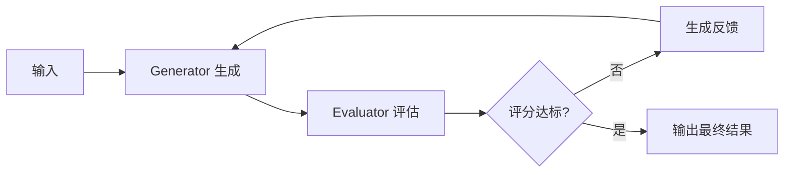

### 代码示例

```python
from openai import OpenAI
import os
import json

client = OpenAI(
    base_url=os.environ.get("OPENAI_BASE_URL"),
    api_key=os.environ.get("OPENAI_API_KEY"),
)

class EvaluatorOptimizer:
    """Evaluator-Optimizer 模式
    
    Generator 生成 → Evaluator 评估 → 反馈优化，循环到达标
    """
    
    def __init__(self, model: str = "gpt-4o", 
                 evaluator_model: str = "gpt-4o",
                 threshold: float = 0.8,
                 max_iterations: int = 3):
        self.model = model
        self.evaluator_model = evaluator_model
        self.threshold = threshold
        self.max_iterations = max_iterations
    
    def _generate(self, task: str, feedback: str = "") -> str:
        """Generator 生成/优化"""
        messages = [{"role": "system", "content": "你是专业内容生成器。"}]
        if feedback:
            messages.append({"role": "user", "content": f"任务：{task}\n\n上一版反馈：{feedback}\n\n请根据反馈优化。"})
        else:
            messages.append({"role": "user", "content": task})
        
        response = client.chat.completions.create(model=self.model, messages=messages)
        return response.choices[0].message.content or ""
    
    def _evaluate(self, task: str, output: str) -> dict:
        """Evaluator 评估"""
        prompt = f"""请评估以下输出的质量。

任务：{task}
输出：{output}

评估维度：
1. 准确性（0-1）：内容是否准确
2. 完整性（0-1）：是否覆盖所有要点
3. 清晰度（0-1）：表达是否清晰

返回 JSON：{{"scores": {{"accuracy": 0.x, "completeness": 0.x, "clarity": 0.x}}, "overall": 0.x, "feedback": "改进建议"}}"""
        
        response = client.chat.completions.create(
            model=self.evaluator_model,
            messages=[{"role": "user", "content": prompt}],
            response_format={"type": "json_object"}
        )
        try:
            return json.loads(response.choices[0].message.content or "{}")
        except (json.JSONDecodeError, TypeError):
            return {"overall": 1.0, "feedback": ""}  # 降级：直接通过
    
    def run(self, task: str) -> str:
        """执行评估-优化循环"""
        output = self._generate(task)
        
        for i in range(self.max_iterations):
            evaluation = self._evaluate(task, output)
            score = evaluation.get("overall", 0)
            feedback = evaluation.get("feedback", "")
            
            print(f"  [迭代 {i+1}] 评分: {score:.2f}, 反馈: {feedback[:50]}")
            
            if score >= self.threshold:
                print(f"  ✓ 达标（{score:.2f} >= {self.threshold}）")
                return output
            
            output = self._generate(task, feedback)
        
        print(f"  达到最大迭代次数，返回最后版本")
        return output


# 使用示例
if __name__ == "__main__":
    eo = EvaluatorOptimizer(
        model="gpt-4o",
        evaluator_model="gpt-4o",
        threshold=0.85,
        max_iterations=3
    )
    
    result = eo.run("写一段介绍 Speculative Decoding 的技术博客开头，200字以内")
    print(result)
```

### Anthropic《Building Effective Agents》模式总结

Anthropic 在 2024.12 博客中提出了 5 种 Agent 模式，本仓库覆盖情况：

| Anthropic 模式 | 本仓库对应 | 章节 |
|---------------|-----------|------|
| Prompt Chaining | 6.8 Prompt Chaining | 06章 |
| Routing | 6.4 Router/MoE | 06章 |
| **Orchestrator-Workers** | **6.9（本节）** | 06章 |
| Evaluate-Optimize | **6.10（本节）** | 06章 |
| Augmented LLM | 8.1-8.8 工具使用 | 08章 |

---

## 6.11 Context Engineering / Compaction（上下文工程）— "上下文炼金术"

> **原理**：上下文工程是 Prompt Engineering 的演进——从"写好一次性提示词"升级为"管理 Agent 整个生命周期的上下文"。核心包括：上下文压缩（Compaction，将长对话压缩为关键信息）、上下文衰减防御（Context Rot，防止 Agent 在长任务中遗忘早期指令）、以及按需加载（JIT Loading，只在需要时加载相关上下文）。2026 年成为 Agent 工程化的核心战场。

**Context Engineering / Compaction（上下文工程）** 是 2026 年 Agent 领域的核心话题。随着 Agent 任务从"单轮问答"演进到"小时级甚至周级长任务"，上下文窗口管理成为决定 Agent 可靠性的关键因素。即使是 128K/200K token 的长上下文窗口，也会在长任务中出现"上下文衰减"（Context Rot）——Agent 遗忘早期指令、偏离原始目标、重复已完成的步骤。

**核心问题：上下文衰减（Context Rot）的三大机制**：
1. **指令淡出（Instruction Fade-Out）**：随着对话增长，早期的 system prompt 和关键指令在注意力分配中被"稀释"，Agent 逐渐偏离原始约束。
2. **信息淹没（Information Drowning）**：大量中间结果和工具输出占据上下文，关键信息被"淹没"在噪音中。
3. **目标漂移（Goal Drift）**：Agent 在多步执行中逐渐偏离原始目标，开始处理无关的子问题。

**核心策略**：

| 策略 | 说明 | 触发时机 |
|------|------|---------|
| **Compaction（上下文压缩）** | 将历史对话压缩为摘要，保留关键信息，丢弃冗余细节 | 上下文使用超过 60-70% 时 |
| **Checkpointing（检查点）** | 定期保存 Agent 状态快照，支持回滚和恢复 | 每完成一个子任务后 |
| **JIT Tool Loading（按需工具加载）** | 只在需要时加载工具定义，避免工具描述占满上下文 | 工具数量超过 20 个时 |
| **Sub-agent 分工** | 将子任务分配给子 Agent 处理，只返回摘要结果 | 子任务上下文需求大时 |
| **40-60% 规则** | 保持上下文使用率在 40-60% 之间，超过则触发压缩 | 持续监控 |

**Mermaid 流程图**：

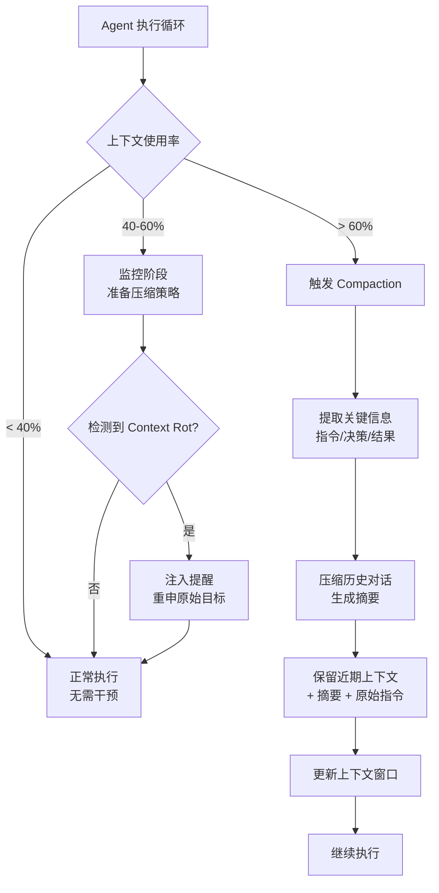

**Python 代码示例**：

```python
from openai import OpenAI
import json
from datetime import datetime

client = OpenAI()

class ContextEngine:
    """上下文工程引擎：Compaction + Context Rot 检测 + JIT 加载"""

    def __init__(self, max_context_ratio=0.6):
        self.messages = []
        self.system_prompt = ""
        self.max_ratio = max_context_ratio  # 上下文使用率阈值
        self.compaction_count = 0

    def estimate_tokens(self, text: str) -> int:
        """粗略估算 token 数（1 token ≈ 4 字符英文 / 2 字符中文）"""
        return len(text) // 3

    def get_context_usage(self) -> float:
        """计算当前上下文使用率"""
        total_tokens = sum(self.estimate_tokens(m["content"]) for m in self.messages)
        total_tokens += self.estimate_tokens(self.system_prompt)
        # 假设 128K 上下文窗口
        return total_tokens / 128000

    def should_compact(self) -> bool:
        """判断是否需要压缩"""
        return self.get_context_usage() > self.max_ratio

    def compact(self):
        """执行 Compaction：压缩历史对话为摘要"""
        if len(self.messages) < 10:
            return  # 对话太短，无需压缩

        # 保留最近 4 条消息，压缩其余
        to_compress = self.messages[:-4]
        recent = self.messages[-4:]

        compact_prompt = f"""将以下对话历史压缩为简洁摘要，必须保留：
1. 所有关键决策和结论
2. 用户的原始目标和约束
3. 已完成的步骤和结果
4. 待处理的任务

对话历史：
{json.dumps(to_compress, ensure_ascii=False, indent=2)}

返回压缩摘要（不超过 500 字）："""

        response = client.chat.completions.create(
            model="gpt-4o-mini",
            messages=[{"role": "user", "content": compact_prompt}]
        )

        summary = (response.choices[0].message.content or "").strip()

        # 重建消息列表：system + 摘要 + 近期对话
        self.messages = [
            {"role": "system", "content": f"[历史摘要]\n{summary}"},
            *recent
        ]
        self.compaction_count += 1
        print(f"Compaction #{self.compaction_count}：压缩 {len(to_compress)} 条消息为摘要")

    def detect_context_rot(self, current_response: str) -> bool:
        """检测上下文衰减：Agent 是否偏离原始目标"""
        if not self.system_prompt:
            return False

        rot_prompt = f"""判断 Agent 的最新回复是否偏离了原始目标。

原始目标/指令：
{self.system_prompt[:500]}

Agent 最新回复：
{current_response[:500]}

是否偏离？返回 JSON：{{"is_rot": true/false, "reason": "..."}}"""

        response = client.chat.completions.create(
            model="gpt-4o-mini",
            messages=[{"role": "user", "content": rot_prompt}],
            response_format={"type": "json_object"}
        )

        result = json.loads((response.choices[0].message.content or '{"is_rot": false}'))
        return result.get("is_rot", False)

    def inject_reminder(self):
        """注入目标提醒，对抗 Context Rot"""
        self.messages.insert(-2, {
            "role": "system",
            "content": f"[提醒] 请记住你的原始目标：{self.system_prompt[:200]}"
        })
        print("已注入目标提醒（对抗 Context Rot）")

    def run_turn(self, user_input: str) -> str:
        """执行一轮对话，自动管理上下文"""
        self.messages.append({"role": "user", "content": user_input})

        # 检查是否需要压缩
        if self.should_compact():
            self.compact()

        # 调用 LLM
        response = client.chat.completions.create(
            model="gpt-4o",
            messages=[
                {"role": "system", "content": self.system_prompt},
                *self.messages
            ]
        )

        reply = (response.choices[0].message.content or "").strip()

        # 检测 Context Rot
        if self.detect_context_rot(reply):
            self.inject_reminder()

        self.messages.append({"role": "assistant", "content": reply})
        return reply


# === 使用示例 ===
if __name__ == "__main__":
    engine = ContextEngine(max_context_ratio=0.6)
    engine.system_prompt = "你是一个数据分析助手，帮助用户分析销售数据并生成报告。"

    print("=== Context Engineering 演示 ===")
    print(f"初始上下文使用率：{engine.get_context_usage():.1%}\n")

    # 模拟多轮对话
    queries = [
        "帮我分析 2025 年 Q1 的销售数据",
        "按地区拆分看看",
        "和去年同期对比",
        "找出增长最快的地区",
        "生成一份完整的分析报告",
    ]

    for q in queries:
        print(f"用户：{q}")
        reply = engine.run_turn(q)
        print(f"助手：{reply[:100]}...")
        print(f"上下文使用率：{engine.get_context_usage():.1%}")
        print(f"压缩次数：{engine.compaction_count}\n")
```

**属性表**：

| 属性 | 说明 |
|------|------|
| **门派** | 工匠门 |
| **内力等级** | ⭐⭐⭐⭐ |
| **招式特点** | Compaction 压缩+Context Rot 检测+JIT 加载 |
| **适用场景** | 长任务 Agent、多轮对话系统、工具密集型 Agent |
| **致命弱点** | 压缩可能丢失关键信息；Context Rot 检测增加额外 LLM 调用 |
| **代表实现** | Claude Code（Compaction）、Cursor（上下文管理）、Claude Agent SDK |

**与其他模式的关系**：
- **vs Prompt Chaining**：Prompt Chaining 是"分步串联"，Context Engineering 是"上下文生命周期管理"，两者互补。
- **vs Mem0/Dreaming**：Mem0/Dreaming 管理"跨会话记忆"，Context Engineering 管理"单次会话内的上下文窗口"。
- **vs Sub-agent**：Sub-agent 是 Context Engineering 的策略之一——通过分工减少单个 Agent 的上下文压力。

---

## 总结对比表

| 模式 | 核心思想 | 适用场景 | 关键优势 | 主要挑战 |
|------|---------|---------|---------|---------|
| **DSPy** | Prompt作为可优化参数，编译器自动调优 | 需要持续优化的LLM Pipeline | Prompt自动优化、可复现、可版本化 | 需要标注数据、学习曲线陡峭 |
| **Flow Engineering** | Agent流程建模为有状态图 | 复杂多步骤Agent工作流 | 灵活控制流、状态持久化、支持循环和人工介入 | 图设计复杂、调试困难 |
| **Map-Reduce** | 并行分解→独立处理→汇总合并 | 长文档处理、批量分析 | 并行加速、突破单上下文限制 | 拆分策略、汇总质量 |
| **Router/MoE** | 路由器分发到最合适专家 | 多领域任务处理 | 专业性高、易扩展、成本可优化 | 路由器准确性、专家协调 |
| **Structured Output** | 严格约束LLM输出格式 | 需可靠解析的下游系统 | 输出可控、可解析、容错重试 | 格式设计、验证逻辑 |
| **MCP** | 标准化协议连接LLM与外部工具/数据源 | 需集成多种工具和数据源的应用 | 工具复用、动态发现、协议标准化 | Server开发维护、协议学习成本 |
| **Semantic Kernel** | AI能力封装为可组合技能，Planner自动编排 | 复杂多技能任务、动态流程编排 | 技能复用、自动规划、管道传递 | 规划准确性、上下文管理复杂 |
| **Prompt Chaining** | 顺序LLM调用链+程序化门控检查点 | 文档生成+合规检查、代码生成+安全审查、翻译+审校 | 流程可控、门控保质量、每步可独立调参 | 串行延迟累积、门控设计、错误传播 |
| **Orchestrator-Workers** | LLM动态分解任务+并行Worker执行+汇总 | 不确定如何拆分的复杂任务（如代码库多文件改动、多源研究） | 动态拆分、并行加速、适应任务复杂度 | Orchestrator决策质量、结果汇总一致性 |
| **Evaluator-Optimizer** | 生成→评估→反馈→优化循环 | 有明确验收标准的任务（如翻译、代码、安全审查） | 闭环优化、质量可量化、支持多轮迭代 | 评估器准确性、迭代成本、收敛速度 |
| **Context Engineering** | Compaction 压缩+Context Rot 检测+JIT 加载 | 长任务 Agent、多轮对话系统、工具密集型 Agent | 上下文生命周期管理、对抗衰减、突破窗口限制 | 压缩可能丢信息、检测增加额外 LLM 调用 |

这十一种模式分别从**优化维度**（DSPy）、**流程维度**（Flow Engineering）、**性能维度**（Map-Reduce）、**分工维度**（Router/MoE）、**可靠性维度**（Structured Output）、**协议维度**（MCP）、**编排维度**（Semantic Kernel）、**流水线维度**（Prompt Chaining）、**动态调度维度**（Orchestrator-Workers）、**闭环优化维度**（Evaluator-Optimizer）和**上下文维度**（Context Engineering）解决了 LLM Agent 开发中的核心工程问题。其中 6.8-6.10 三种模式来自 Anthropic《Building Effective Agents》（2024.12）的总结，代表了业界对 Agent 编排范式的最新共识；6.11 Context Engineering 则是 2026 年 Agent 工程化的核心战场，应对长任务场景下的上下文衰减问题。在实际项目中，这些模式常组合使用，例如：用 Prompt Chaining 搭建一条"生成→审查→润色"的固定流水线作为基线，在 LangGraph 流程中嵌入 DSPy 优化后的模块，使用 Router 分发到不同专家，通过 MCP 标准化接入外部工具，借助 Semantic Kernel 的 Planner 自动编排技能，并通过 Structured Output 保证各节点间的数据契约一致；当任务运行时间较长、上下文增长较快时，再叠加 Context Engineering 的 Compaction 与 Context Rot 检测，确保 Agent 在长任务中不偏离原始目标。当任务阶段明确、验收标准清晰时，优先用最简单的 Prompt Chaining；只有当需要动态分支、循环回退或并行处理时，再升级到 Flow Engineering、Router 或 Map-Reduce 等更复杂的范式；当任务拆分方式不确定时用 Orchestrator-Workers，当有明确质量标准需要迭代打磨时用 Evaluator-Optimizer；当任务运行时长超过单次上下文窗口承载能力、出现指令遗忘或目标漂移时，启用 Context Engineering 进行上下文压缩与衰减防御。