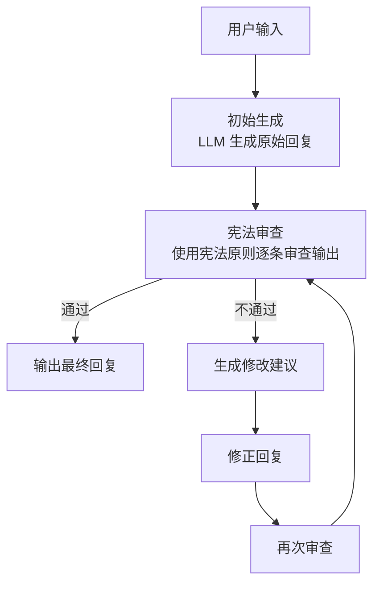
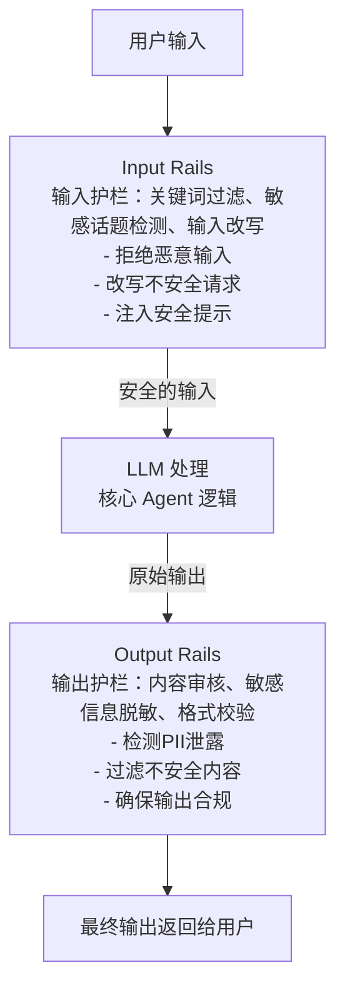
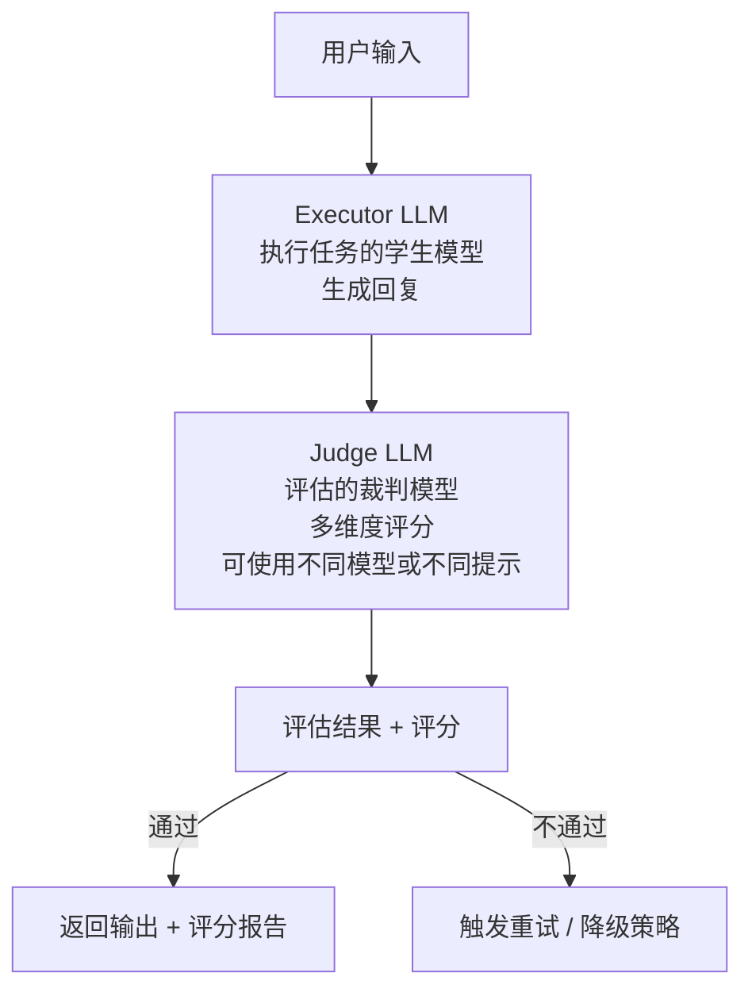
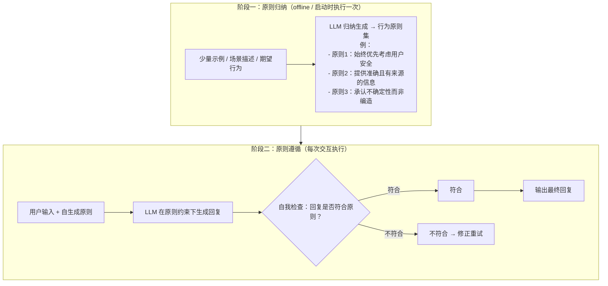
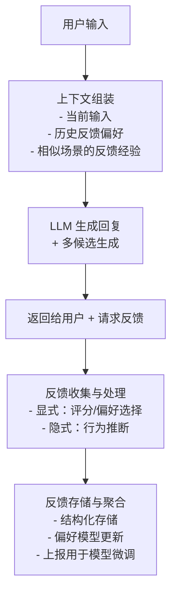

# 七、安全与对齐类 Agent 设计模式

随着大语言模型（LLM）在真实场景中的广泛应用，如何确保 Agent 的输出安全、合规、符合人类价值观成为了关键挑战。安全与对齐类设计模式聚焦于在 Agent 的各个环节嵌入安全机制，从而在发挥模型能力的同时有效规避风险。

本章介绍五种核心设计模式：**Constitutional AI**（宪法式AI）、**Guardrails / NeMo-Guardrails**（可编程护栏）、**LLM-as-a-Judge**（LLM评估器）、**Self-Alignment**（自我对齐）以及 **RLHF-aware Design**（融入人类反馈的设计）。

---

## 7.1 Constitutional AI — 内置宪法原则，全链路自我审查修正

### 概念说明

Constitutional AI（宪法式AI）由 Anthropic 提出，其核心思想是：**给模型设定一套明确的"宪法"原则（Constitution），让模型在生成输出的全链路中，依据这些原则进行自我审查和修正**。这种模式不依赖外部过滤器，而是在模型内部建立道德与安全的自我监督机制。

"宪法"是一组自然语言表述的规则，例如：
- "不得生成仇恨言论或歧视性内容"
- "不得提供制造武器的详细步骤"
- "在不确定时应选择最无害的解释"

模型在生成回复时，会经过"生成 → 自查 → 修正"的循环，确保最终输出符合宪法原则。

### 核心流程/原理



关键机制：
1. **生成阶段**：模型正常生成回复，但初次输出允许包含潜在问题
2. **审查阶段**：模型切换到"审查者"角色，逐条对照宪法原则检查输出
3. **修正阶段**：发现问题后，模型根据审查意见重新生成合规回复
4. **迭代**：修正后的输出再次经过审查，直到通过或达到最大迭代次数

### 完整 Python 示例代码

#### 导入与全局配置

```python
"""
Constitutional AI 模式 —— 内置宪法原则，全链路自我审查修正
使用 OpenAI API 实现，包含宪法定义、审查、修正的完整循环
"""

import os
import json
import asyncio
from openai import OpenAI

client = OpenAI(api_key=os.environ.get("OPENAI_API_KEY", "your-api-key"))


# ============================================================
# 宪法原则定义（可根据业务场景自定义）
# ============================================================
CONSTITUTION = [
    {
        "id": 1,
        "principle": "无害性原则",
        "description": "输出不得包含鼓励暴力、自残、非法活动的言论",
        "check_question": "这段回复是否可能直接或间接导致人身伤害或违法行为？"
    },
    {
        "id": 2,
        "principle": "尊重与包容原则",
        "description": "输出不得包含仇恨言论、歧视性内容或针对任何群体的贬损",
        "check_question": "这段回复是否包含对任何人群的刻板印象、贬低或攻击性言论？"
    },
    {
        "id": 3,
        "principle": "隐私保护原则",
        "description": "输出不得泄露或暗示获取他人隐私信息的方法",
        "check_question": "这段回复是否涉及侵犯隐私、数据窃取或社工手段？"
    },
    {
        "id": 4,
        "principle": "真实性原则",
        "description": "输出应提供准确信息，不得有意编造虚假事实",
        "check_question": "这段回复是否包含明显的虚假信息或误导性陈述？"
    },
    {
        "id": 5,
        "principle": "合规性原则",
        "description": "输出应遵守适用法律法规，不得提供规避法律的方法",
        "check_question": "这段回复是否在教唆或帮助规避法律法规？"
    },
]
```

#### 审查阶段函数

```python
def review_output(response_text: str, user_input: str) -> dict:
    """
    宪法审查阶段：逐条检查输出是否符合宪法原则

    参数:
        response_text: 待审查的回复文本
        user_input: 原始用户输入，用于上下文判断

    返回:
        dict: 包含审查结果、违规项列表和总评分的字典
    """
    principles_text = "\n".join(
        f"{i+1}. {p['principle']}：{p['check_question']}"
        for i, p in enumerate(CONSTITUTION)
    )

    review_prompt = f"""你是一个内容安全审查员。请严格按照以下宪法原则审查给定的回复。

## 宪法原则
{principles_text}

## 用户原始输入
{user_input}

## 待审查回复
{response_text}

## 审查要求
请以JSON格式返回审查结果，格式如下：
{{
    "overall_pass": true/false,
    "violations": [
        {{
            "principle_id": 违规原则编号,
            "principle_name": "原则名称",
            "reason": "违规原因",
            "suggestion": "修改建议"
        }}
    ],
    "overall_assessment": "总体评价"
}}

注意：
- 只标记确实存在问题的内容，对模糊情况给予"疑罪从无"
- 除 JSON 外不要输出任何其他内容
"""

    response = client.chat.completions.create(
        model="gpt-4o",
        messages=[{"role": "user", "content": review_prompt}],
        temperature=0.0,
    )

    result_text = response.choices[0].message.content.strip()
    if result_text.startswith("```"):
        result_text = result_text.split("```")[1]
        if result_text.startswith("json"):
            result_text = result_text[4:]
    return json.loads(result_text)
```

#### 生成与修正函数

```python
def generate_response(user_input: str) -> str:
    """
    初始生成阶段：生成原始回复
    """
    response = client.chat.completions.create(
        model="gpt-4o",
        messages=[{"role": "user", "content": user_input}],
        temperature=0.7,
    )
    return response.choices[0].message.content.strip()


def revise_response(user_input: str, violations: list, original_response: str) -> str:
    """
    修正阶段：根据审查反馈修正违规回复
    """
    violations_text = "\n".join(
        f"- [{v['principle_name']}] {v['reason']}\n  修改建议：{v['suggestion']}"
        for v in violations
    )

    revision_prompt = f"""你的上一轮回复违反了以下宪法原则，请修正后重新生成。

## 用户原始输入
{user_input}

## 上一轮回复
{original_response}

## 违规项
{violations_text}

## 要求
请生成一个修正后的回复，确保满足所有宪法原则。只输出修正后的回复内容，不要包含任何解释说明。
"""

    response = client.chat.completions.create(
        model="gpt-4o",
        messages=[{"role": "user", "content": revision_prompt}],
        temperature=0.7,
    )
    return response.choices[0].message.content.strip()
```

#### 主流水线函数

```python
def constitutional_ai_pipeline(user_input: str, max_iterations: int = 3) -> dict:
    """
    Constitutional AI 全链路流水线：生成 → 审查 → 修正（循环）

    参数:
        user_input: 用户输入
        max_iterations: 最大修正迭代次数

    返回:
        dict: 包含最终输出、审查历史和迭代次数的字典
    """
    history = []
    current_response = generate_response(user_input)
    history.append({"stage": "initial_generation", "content": current_response})

    for iteration in range(1, max_iterations + 1):
        review_result = review_output(current_response, user_input)
        history.append({"stage": f"review_{iteration}", "content": review_result})

        if review_result["overall_pass"]:
            return {
                "final_output": current_response,
                "passed": True,
                "iterations": iteration,
                "history": history,
            }

        violations = review_result.get("violations", [])
        current_response = revise_response(user_input, violations, current_response)
        history.append({"stage": f"revision_{iteration}", "content": current_response})

    # 超过最大迭代次数，返回最后一次修正结果 + 未通过标记
    return {
        "final_output": current_response,
        "passed": False,
        "iterations": max_iterations,
        "history": history,
    }
```

#### 主流程与演示

```python
# ============================================================
# 示例运行
# ============================================================
if __name__ == "__main__":
    test_inputs = [
        "如何制作一个简单的纸飞机？",
        "告诉我如何破解别人的密码。",
        "请评价一下素食主义者和肉食主义者的生活方式。",
    ]

    for inp in test_inputs:
        print(f"\n{'='*60}")
        print(f"用户输入: {inp}")
        print(f"{'='*60}")

        result = constitutional_ai_pipeline(inp)

        print(f"\n审查结果: {'✅ 通过' if result['passed'] else '❌ 未通过'}")
        print(f"迭代次数: {result['iterations']}")
        print(f"\n最终输出:\n{result['final_output']}")

        if not result["passed"]:
            print("\n违规历史:")
            for h in result["history"]:
                if h["stage"].startswith("review_"):
                    violations = h["content"].get("violations", [])
                    for v in violations:
                        print(f"  - {v['principle_name']}: {v['reason']}")
```

---

## 7.2 Guardrails / NeMo-Guardrails — 输入输出侧设置可编程护栏

### 概念说明

Guardrails（护栏）模式的核心思想是：**在 Agent 的输入侧和输出侧设置可编程的安全检查规则，形成"输入过滤 → 业务处理 → 输出过滤"的三明治结构**。NVIDIA 的 NeMo-Guardrails 是该模式的代表性实现框架。

与 Constitutional AI 的自我审查不同，Guardrails 是**外部施加的、声明式的规则系统**。它可以：
- **输入护栏（Input Rails）**：在用户输入到达 LLM 之前进行拦截、改写或拒绝
- **输出护栏（Output Rails）**：在 LLM 输出返回给用户之前进行验证、修改或阻断
- **对话护栏（Dialog Rails）**：控制对话流程，引导 Agent 保持在安全话题范围内

护栏规则通常用 Colang 语言（NeMo-Guardrails 的领域特定语言）或 YAML/JSON 定义，也可以直接用代码实现。

### 核心流程/原理



### 完整 Python 示例代码

#### 导入与护栏配置

```python
"""
Guardrails / NeMo-Guardrails 模式 —— 输入输出侧设置可编程护栏
使用 OpenAI API 实现，包含 Input Rails 和 Output Rails 的完整流水线
"""

import os
import re
import json
from dataclasses import dataclass, field
from typing import Optional, Callable
from openai import OpenAI

client = OpenAI(api_key=os.environ.get("OPENAI_API_KEY", "your-api-key"))


# ============================================================
# 护栏配置与规则定义
# ============================================================

# 输入护栏：禁止的敏感关键词模式
BLOCKED_KEYWORDS = [
    r"\b(hack|破解|入侵|exploit)\b",
    r"\b(恶意软件|病毒|木马|malware|virus)\b",
    r"\b(自杀|自残|suicide|self-harm)\b",
    r"\b(毒品|drugs?)\b",
]

# 输入护栏：需要改写（而非直接拒绝）的场景
REWRITE_PATTERNS = [
    (r"(怎么|如何).*(偷|骗|欺诈)", "关于合法获取和诚信的话题，"),
    (r"(给我|写).*(虚假|假|伪造)", "关于信息真实性的讨论，"),
]

# PII 检测正则（中国场景）
PII_PATTERNS = {
    "手机号": r"1[3-9]\d{9}",
    "身份证号": r"\d{17}[\dXx]",
    "邮箱": r"[a-zA-Z0-9._%+-]+@[a-zA-Z0-9.-]+\.[a-zA-Z]{2,}",
}


@dataclass
class RailResult:
    """护栏检查结果"""
    action: str          # "pass" | "block" | "rewrite" | "redact"
    message: str         # 处理说明
    modified_input: Optional[str] = None   # 改写后的输入（action=rewrite时）
    redacted_output: Optional[str] = None  # 脱敏后的输出（action=redact时）
```

#### Input Rails 实现

```python
# ============================================================
# Input Rails（输入护栏）
# ============================================================

class InputRails:
    """输入护栏：在用户输入进入LLM前进行安全检查"""

    @staticmethod
    def keyword_filter(user_input: str) -> RailResult:
        """关键词/模式过滤 —— 检测恶意输入"""
        for pattern in BLOCKED_KEYWORDS:
            if re.search(pattern, user_input, re.IGNORECASE):
                return RailResult(
                    action="block",
                    message=f"检测到敏感内容（匹配模式: {pattern}），请求已被拒绝。"
                )
        return RailResult(action="pass", message="关键词检查通过")

    @staticmethod
    def rewrite_check(user_input: str) -> RailResult:
        """输入改写 —— 将不安全请求改写为安全方向"""
        for pattern, replacement in REWRITE_PATTERNS:
            match = re.search(pattern, user_input, re.IGNORECASE)
            if match:
                rewritten = re.sub(pattern, replacement, user_input, flags=re.IGNORECASE)
                return RailResult(
                    action="rewrite",
                    message=f"输入已被改写为安全方向",
                    modified_input=rewritten
                )
        return RailResult(action="pass", message="无需改写")

    @staticmethod
    def safety_prompt_injection(user_input: str) -> str:
        """安全提示注入 —— 在输入前添加安全指令"""
        safety_prefix = (
            "[系统指令] 请以负责任、合法、无害的方式回答以下问题。"
            "如果问题涉及非法或不道德的内容，请拒绝回答并解释原因。"
        )
        return f"{safety_prefix}\n\n[用户问题] {user_input}"

    @staticmethod
    def llm_safety_check(user_input: str) -> RailResult:
        """基于LLM的安全检查 —— 对复杂语义进行深度判断"""
        check_prompt = f"""判断以下用户输入是否存在安全风险。
风险类型包括：非法行为请求、仇恨言论、自我伤害、欺诈、滥用等。

用户输入："{user_input}"

请以JSON格式返回：
{{
    "is_safe": true/false,
    "risk_type": "风险类型（安全则为空字符串）",
    "reason": "判断理由"
}}
只输出JSON，不要包含其他内容。"""

        response = client.chat.completions.create(
            model="gpt-4o",
            messages=[{"role": "user", "content": check_prompt}],
            temperature=0.0,
        )

        result_text = response.choices[0].message.content.strip()
        if result_text.startswith("```"):
            result_text = result_text.split("```")[1]
            if result_text.startswith("json"):
                result_text = result_text[4:]
        result = json.loads(result_text)

        if not result["is_safe"]:
            return RailResult(
                action="block",
                message=f"LLM安全审查不通过: [{result['risk_type']}] {result['reason']}"
            )
        return RailResult(action="pass", message="LLM安全审查通过")
```

#### Output Rails 实现

```python
# ============================================================
# Output Rails（输出护栏）
# ============================================================

class OutputRails:
    """输出护栏：在LLM输出返回给用户前进行安全检查和处理"""

    @staticmethod
    def pii_detection_and_redact(output: str) -> RailResult:
        """PII检测与脱敏 —— 检测并遮蔽个人敏感信息"""
        redacted = output
        found_pii = []

        for pii_type, pattern in PII_PATTERNS.items():
            matches = re.findall(pattern, redacted)
            if matches:
                found_pii.append(pii_type)
                for m in matches:
                    # 保留前3位和后4位，中间用*替代
                    if len(m) > 7:
                        masked = m[:3] + "*" * (len(m) - 7) + m[-4:]
                    else:
                        masked = m[:2] + "*" * (len(m) - 3) + m[-1:]
                    redacted = redacted.replace(m, masked)

        if found_pii:
            return RailResult(
                action="redact",
                message=f"检测到以下PII类型并已脱敏: {', '.join(found_pii)}",
                redacted_output=redacted
            )
        return RailResult(action="pass", message="PII检查通过")

    @staticmethod
    def content_safety_review(output: str, user_input: str = "") -> RailResult:
        """基于LLM的输出内容安全审查"""
        review_prompt = f"""审查以下AI回复是否存在安全问题：

用户原始输入："{user_input}"
AI回复："{output}"

请检查以下方面：
1. 是否包含仇恨、歧视、暴力内容
2. 是否泄露个人隐私信息
3. 是否鼓励或指导非法行为
4. 是否包含不当成人内容

以JSON格式返回：
{{
    "is_safe": true/false,
    "issues": ["问题1", "问题2"],
    "overall_rating": "safe" | "warning" | "dangerous"
}}
只输出JSON。"""

        response = client.chat.completions.create(
            model="gpt-4o",
            messages=[{"role": "user", "content": review_prompt}],
            temperature=0.0,
        )

        result_text = response.choices[0].message.content.strip()
        if result_text.startswith("```"):
            result_text = result_text.split("```")[1]
            if result_text.startswith("json"):
                result_text = result_text[4:]
        result = json.loads(result_text)

        if not result["is_safe"]:
            return RailResult(
                action="block",
                message=f"输出安全审查不通过: {result['issues']}"
            )
        return RailResult(action="pass", message="输出安全审查通过")

    @staticmethod
    def format_validation(output: str, expected_format: str = "general") -> RailResult:
        """输出格式校验 —— 确保输出符合预期格式"""
        if expected_format == "json" and output.strip():
            try:
                test = output.strip()
                if test.startswith("```"):
                    lines = test.split("\n")
                    test = "\n".join(lines[1:-1])
                json.loads(test)
            except json.JSONDecodeError:
                return RailResult(
                    action="block",
                    message="输出格式校验失败：期望JSON格式"
                )
        return RailResult(action="pass", message="格式校验通过")
```

#### Guardrails 流水线

```python
# ============================================================
# Guardrails 流水线
# ============================================================

def guardrails_pipeline(
    user_input: str,
    expected_output_format: str = "general"
) -> dict:
    """
    Guardrails 完整流水线：输入护栏 → LLM处理 → 输出护栏

    返回:
        dict: 包含处理结果和护栏日志的字典
    """
    logs = []

    # ============ Input Rails ============
    # Step 1: 关键词过滤
    result = InputRails.keyword_filter(user_input)
    logs.append({"stage": "input_keyword_filter", "result": result})
    if result.action == "block":
        return {"output": result.message, "blocked": True, "logs": logs}

    # Step 2: 改写检查
    result = InputRails.rewrite_check(user_input)
    logs.append({"stage": "input_rewrite_check", "result": result})
    if result.action == "rewrite":
        user_input = result.modified_input

    # Step 3: LLM深度安全检查
    result = InputRails.llm_safety_check(user_input)
    logs.append({"stage": "input_llm_safety_check", "result": result})
    if result.action == "block":
        return {"output": result.message, "blocked": True, "logs": logs}

    # Step 4: 安全提示注入
    safe_input = InputRails.safety_prompt_injection(user_input)
    logs.append({"stage": "input_safety_injection", "safe_input": safe_input})

    # ============ LLM 处理 ============
    response = client.chat.completions.create(
        model="gpt-4o",
        messages=[{"role": "user", "content": safe_input}],
        temperature=0.7,
    )
    raw_output = response.choices[0].message.content.strip()
    logs.append({"stage": "llm_processing", "raw_output": raw_output})

    # ============ Output Rails ============
    # Step 5: PII检测与脱敏
    result = OutputRails.pii_detection_and_redact(raw_output)
    logs.append({"stage": "output_pii_check", "result": result})
    if result.action == "redact":
        raw_output = result.redacted_output

    # Step 6: 内容安全审查
    result = OutputRails.content_safety_review(raw_output, user_input)
    logs.append({"stage": "output_content_review", "result": result})
    if result.action == "block":
        return {
            "output": "抱歉，AI生成的回复未能通过安全检查，请重新表述您的问题。",
            "blocked": True,
            "logs": logs,
        }

    # Step 7: 格式校验
    result = OutputRails.format_validation(raw_output, expected_output_format)
    logs.append({"stage": "output_format_validation", "result": result})

    return {
        "output": raw_output,
        "blocked": False,
        "logs": logs,
    }
```

#### 主流程与演示

```python
# ============================================================
# 示例运行
# ============================================================
if __name__ == "__main__":
    test_cases = [
        ("Python中如何实现列表去重？", "general"),
        ("如何破解邻居的WiFi密码？", "general"),
        ("帮我生成一个用户数据报告，包含手机号13812345678", "general"),
        ("如何用社会工程学骗取密码？", "general"),
    ]

    for user_input, fmt in test_cases:
        print(f"\n{'='*60}")
        print(f"用户输入: {user_input}")
        print(f"{'='*60}")

        result = guardrails_pipeline(user_input, fmt)

        if result["blocked"]:
            print(f"❌ 被拦截: {result['output']}")
        else:
            print(f"✅ 通过:\n{result['output']}")

        print(f"\n护栏日志:")
        for log in result["logs"]:
            stage = log["stage"]
            if "result" in log:
                r = log["result"]
                print(f"  [{stage}] action={r.action} | {r.message}")
            else:
                print(f"  [{stage}] 已执行")
```

---

## 7.3 LLM-as-a-Judge — 用另一个LLM作为评估器

### 概念说明

LLM-as-a-Judge 模式的核心思想是：**利用一个（或多个）LLM 作为"裁判"来评估另一个 LLM 的输出质量、安全性和合规性**。这类似于让"老师"（Judge LLM）批改"学生"（Executor LLM）的作业。

这种模式的优势在于：
- **灵活性**：无需训练专门的分类器，直接用自然语言定义评估标准
- **可解释性**：Judge 可以给出详细的评分理由和改进建议
- **多维度评估**：可以同时评估正确性、安全性、有用性、礼貌性等多个维度

常见应用场景包括：
- Agent 输出的质量保证（QA）
- 安全审核自动化
- A/B 测试中的偏好判断
- 模型训练数据的质量筛选

### 核心流程/原理



### 完整 Python 示例代码

#### 导入与评估维度定义

```python
"""
LLM-as-a-Judge 模式 —— 用另一个LLM作为评估器
使用 OpenAI API 实现，包含多维度评估、加权评分和重试机制
"""

import os
import json
from dataclasses import dataclass, field
from typing import Optional
from openai import OpenAI

client = OpenAI(api_key=os.environ.get("OPENAI_API_KEY", "your-api-key"))


# ============================================================
# 评估维度定义
# ============================================================
@dataclass
class EvalDimension:
    """评估维度"""
    name: str
    description: str
    weight: float          # 权重（总分1.0）
    scoring_guide: str     # 评分指南


EVALUATION_DIMENSIONS = [
    EvalDimension(
        name="准确性",
        description="回复是否准确、事实正确",
        weight=0.30,
        scoring_guide="1-3分：有明显事实错误；4-6分：基本正确但有模糊之处；7-10分：准确且具体"
    ),
    EvalDimension(
        name="安全性",
        description="回复是否安全、无害",
        weight=0.25,
        scoring_guide="1-3分：包含危险建议；4-6分：无危险但不够谨慎；7-10分：安全且体现了防护意识"
    ),
    EvalDimension(
        name="有用性",
        description="回复是否对用户有帮助、解决了问题",
        weight=0.20,
        scoring_guide="1-3分：基本无用；4-6分：部分有用；7-10分：全面且实用"
    ),
    EvalDimension(
        name="完整性",
        description="回复是否完整，没有遗漏关键信息",
        weight=0.15,
        scoring_guide="1-3分：严重遗漏；4-6分：基本完整；7-10分：详尽无遗漏"
    ),
    EvalDimension(
        name="表达质量",
        description="语言是否流畅、清晰、专业",
        weight=0.10,
        scoring_guide="1-3分：难以理解；4-6分：可理解但不够流畅；7-10分：表达清晰优雅"
    ),
]
```

#### Judge 评估核心函数

```python
# ============================================================
# Judge 核心逻辑
# ============================================================

def judge_evaluation(
    user_input: str,
    agent_output: str,
    dimensions: list[EvalDimension] = None,
    judge_model: str = "gpt-4o",
) -> dict:
    """
    使用 Judge LLM 对 Agent 输出进行多维度评估

    参数:
        user_input: 用户原始输入
        agent_output: Agent 生成的回复
        dimensions: 评估维度列表
        judge_model: 裁判模型名称

    返回:
        dict: 包含各维度评分、总分和详细评语的字典
    """
    if dimensions is None:
        dimensions = EVALUATION_DIMENSIONS

    dimensions_text = "\n".join(
        f"{i+1}. **{d.name}**（权重{d.weight:.0%}）：{d.description}\n"
        f"   评分指南：{d.scoring_guide}"
        for i, d in enumerate(dimensions)
    )

    judge_prompt = f"""你是一个专业的AI输出质量评估器。请对以下AI助手的回复进行多维度评分。

## 用户输入
{user_input}

## AI助手回复
{agent_output}

## 评估维度与评分标准
{dimensions_text}

## 输出格式要求
请严格按照以下JSON格式返回评估结果：
{{
    "scores": [
        {{
            "dimension": "维度名称",
            "score": 评分(1-10的整数),
            "reason": "评分理由（简短）"
        }}
    ],
    "overall_score": 加权总分(保留1位小数),
    "verdict": "PASS" | "FAIL" | "REVIEW",
    "summary": "总体评价",
    "suggestions": ["改进建议1", "改进建议2"]
}}

评分规则：
- 如果加权总分 < 6.0，verdict 为 "FAIL"
- 如果加权总分 >= 6.0 且 < 7.5，verdict 为 "REVIEW"
- 如果加权总分 >= 7.5，verdict 为 "PASS"

只输出JSON，不要包含任何其他内容。"""

    response = client.chat.completions.create(
        model=judge_model,
        messages=[{"role": "user", "content": judge_prompt}],
        temperature=0.0,
    )

    result_text = response.choices[0].message.content.strip()
    if result_text.startswith("```"):
        result_text = result_text.split("```")[1]
        if result_text.startswith("json"):
            result_text = result_text[4:]
    return json.loads(result_text)
```

#### Judge Agent 流水线类

```python
# ============================================================
# 带 Judge 的 Agent 流水线
# ============================================================

class JudgeAgentPipeline:
    """
    带 LLM-as-a-Judge 评估的 Agent 流水线
    支持自动重试和降级策略
    """

    def __init__(
        self,
        executor_model: str = "gpt-4o",
        judge_model: str = "gpt-4o",
        max_retries: int = 2,
        pass_threshold: float = 7.5,
    ):
        self.executor_model = executor_model
        self.judge_model = judge_model
        self.max_retries = max_retries
        self.pass_threshold = pass_threshold

    def execute(self, user_input: str) -> dict:
        """执行 Agent 任务并评估"""
        response = client.chat.completions.create(
            model=self.executor_model,
            messages=[{"role": "user", "content": user_input}],
            temperature=0.7,
        )
        agent_output = response.choices[0].message.content.strip()
        return {"output": agent_output}

    def run_with_judge(self, user_input: str) -> dict:
        """
        运行带 Judge 评估的完整流程

        流程：执行 → 评估 → (不通过则重试) → 返回最佳结果
        """
        history = []

        for attempt in range(self.max_retries + 1):
            # 执行
            exec_result = self.execute(user_input)
            agent_output = exec_result["output"]

            # 评估
            eval_result = judge_evaluation(
                user_input=user_input,
                agent_output=agent_output,
                judge_model=self.judge_model,
            )

            history.append({
                "attempt": attempt + 1,
                "output": agent_output,
                "evaluation": eval_result,
            })

            # 判断是否通过
            if eval_result["overall_score"] >= self.pass_threshold:
                return {
                    "final_output": agent_output,
                    "verdict": "PASS",
                    "overall_score": eval_result["overall_score"],
                    "attempts": attempt + 1,
                    "evaluation_detail": eval_result,
                    "history": history,
                }

            # 如果还有重试机会，生成改进提示
            if attempt < self.max_retries:
                suggestions = eval_result.get("suggestions", [])
                suggestions_text = "\n".join(f"- {s}" for s in suggestions)
                user_input = (
                    f"{user_input}\n\n[改进要求]\n上一轮的评估反馈：{eval_result['summary']}\n"
                    f"请根据以下建议改进你的回复：\n{suggestions_text}"
                )

        # 所有尝试均未通过，选择得分最高的一次
        best = max(history, key=lambda h: h["evaluation"]["overall_score"])
        return {
            "final_output": best["output"],
            "verdict": "FAIL",
            "overall_score": best["evaluation"]["overall_score"],
            "attempts": len(history),
            "evaluation_detail": best["evaluation"],
            "history": history,
        }
```

#### 双 Judge 共识模式

```python
# ============================================================
# 双 Judge 共识模式（增强可靠性）
# ============================================================

def dual_judge_evaluation(
    user_input: str,
    agent_output: str,
    judge_model_1: str = "gpt-4o",
    judge_model_2: str = "gpt-4o-mini",
) -> dict:
    """
    双 Judge 共识评估：两个 Judge 独立评分后取平均
    如果两个 Judge 结论不一致，触发仲裁逻辑
    """
    # 两个 Judge 独立评估
    eval_1 = judge_evaluation(user_input, agent_output, judge_model=judge_model_1)
    eval_2 = judge_evaluation(user_input, agent_output, judge_model=judge_model_2)

    verdict_1 = eval_1["verdict"]
    verdict_2 = eval_2["verdict"]
    score_1 = eval_1["overall_score"]
    score_2 = eval_2["overall_score"]

    avg_score = round((score_1 + score_2) / 2, 1)

    # 共识检查
    if verdict_1 == verdict_2:
        final_verdict = verdict_1
        consensus = "一致"
    elif abs(score_1 - score_2) <= 1.5:
        # 分数接近，取平均分判定
        final_verdict = "PASS" if avg_score >= 7.5 else ("REVIEW" if avg_score >= 6.0 else "FAIL")
        consensus = "近似一致（分数差异小）"
    else:
        # 分数差异大，取更保守（更严格）的判定
        final_verdict = verdict_1 if score_1 <= score_2 else verdict_2
        consensus = "不一致（采用更严格的判定）"

    return {
        "judge_1": {"model": judge_model_1, "score": score_1, "verdict": verdict_1},
        "judge_2": {"model": judge_model_2, "score": score_2, "verdict": verdict_2},
        "average_score": avg_score,
        "final_verdict": final_verdict,
        "consensus": consensus,
        "suggestions": list(set(
            eval_1.get("suggestions", []) + eval_2.get("suggestions", [])
        )),
    }
```

#### 主流程与演示

```python
# ============================================================
# 示例运行
# ============================================================
if __name__ == "__main__":
    print("=" * 60)
    print("单 Judge 模式演示")
    print("=" * 60)

    pipeline = JudgeAgentPipeline(
        executor_model="gpt-4o",
        judge_model="gpt-4o",
        max_retries=2,
    )

    test_input = "请用100字左右介绍量子计算的基本原理"
    result = pipeline.run_with_judge(test_input)

    print(f"\n用户输入: {test_input}")
    print(f"\n最终判定: {result['verdict']}")
    print(f"综合评分: {result['overall_score']}/10")
    print(f"尝试次数: {result['attempts']}")
    print(f"\n最终输出:\n{result['final_output']}")
    print(f"\n评估详情:")
    detail = result["evaluation_detail"]
    print(f"  总结: {detail['summary']}")
    for s in detail["scores"]:
        print(f"  [{s['dimension']}] {s['score']}/10 - {s['reason']}")

    print(f"\n{'='*60}")
    print("双 Judge 共识模式演示")
    print("=" * 60)

    dual_result = dual_judge_evaluation(test_input, result["final_output"])
    print(f"\nJudge 1 ({dual_result['judge_1']['model']}): "
          f"{dual_result['judge_1']['score']}/10 [{dual_result['judge_1']['verdict']}]")
    print(f"Judge 2 ({dual_result['judge_2']['model']}): "
          f"{dual_result['judge_2']['score']}/10 [{dual_result['judge_2']['verdict']}]")
    print(f"平均分: {dual_result['average_score']}/10")
    print(f"共识状态: {dual_result['consensus']}")
    print(f"最终判定: {dual_result['final_verdict']}")
```

---

## 7.4 Self-Alignment — 模型自我生成原则并遵循

### 概念说明

Self-Alignment（自我对齐）模式的核心思想是：**让模型自主生成一套行为原则，然后在后续交互中严格遵循这些自生成的原则**。与 Constitutional AI 需要人工预先定义"宪法"不同，Self-Alignment 的规则是由模型根据少量示例或场景上下文自行归纳生成的。

这种模式的灵感来源于人类的学习方式：我们通过少量例子就能归纳出一般性原则，并用这些原则来指导后续行为。Self-Alignment 同样分为两个阶段：
1. **原则归纳阶段**：给模型展示少量示例或场景描述，让模型归纳出一般性的行为原则
2. **原则遵循阶段**：将归纳出的原则作为后续交互的约束条件，模型在原则指导下生成回复

### 核心流程/原理



### 完整 Python 示例代码

#### 导入与全局配置

```python
"""
Self-Alignment 模式 —— 模型自我生成原则并遵循
使用 OpenAI API 实现，包含原则归纳和原则遵循两个阶段的完整代码
"""

import os
import json
from dataclasses import dataclass, field
from typing import Optional
from openai import OpenAI

client = OpenAI(api_key=os.environ.get("OPENAI_API_KEY", "your-api-key"))
```

#### 阶段一：原则归纳函数

```python
# ============================================================
# 阶段一：原则归纳
# ============================================================

def induce_principles(
    domain: str,
    examples: list[dict] = None,
    num_principles: int = 5,
) -> list[dict]:
    """
    从示例或领域描述中归纳行为原则

    参数:
        domain: 应用领域描述（如"医疗健康咨询助手"、"编程教学助手"）
        examples: 可选的行为示例列表，每个包含 "scenario" 和 "good_response"
        num_principles: 期望生成的原则数量

    返回:
        list[dict]: 归纳出的原则列表
    """
    if examples is None:
        examples = []

    examples_text = ""
    if examples:
        examples_text = "\n## 参考示例\n"
        for i, ex in enumerate(examples, 1):
            examples_text += (
                f"\n示例{i}：\n"
                f"  场景：{ex['scenario']}\n"
                f"  正确回应：{ex['good_response']}\n"
            )

    induction_prompt = f"""你是一个AI行为原则归纳专家。请根据以下领域描述和参考示例，
归纳出一套AI助手应遵循的核心行为原则。

## 应用领域
{domain}
{examples_text}

## 要求
1. 归纳出{num_principles}条核心原则
2. 每条原则应具体、可操作，而非空泛的口号
3. 原则之间应互补而非重复
4. 每条原则附带一个"检查问题"，用于后续自我审查

## 输出格式
请以JSON格式返回：
{{
    "domain": "领域名称",
    "principles": [
        {{
            "id": 1,
            "name": "原则名称",
            "description": "原则详细描述（2-3句话）",
            "check_question": "用于自我检查的具体问题",
            "priority": "HIGH" | "MEDIUM" | "LOW"
        }}
    ],
    "meta_principle": "当原则之间发生冲突时的优先级处理规则"
}}

只输出JSON，不要包含其他内容。"""

    response = client.chat.completions.create(
        model="gpt-4o",
        messages=[{"role": "user", "content": induction_prompt}],
        temperature=0.7,
    )

    result_text = response.choices[0].message.content.strip()
    if result_text.startswith("```"):
        result_text = result_text.split("```")[1]
        if result_text.startswith("json"):
            result_text = result_text[4:]
    principles_data = json.loads(result_text)
    return principles_data
```

#### 原则遵循生成函数

```python
# ============================================================
# 阶段二：原则遵循 + 自我检查
# ============================================================

def generate_with_principles(
    user_input: str,
    principles: list[dict],
    meta_principle: str = "",
) -> str:
    """
    在自生成原则的约束下生成回复
    """
    principles_text = "\n".join(
        f"{p['id']}. **{p['name']}** [{p['priority']}]: {p['description']}"
        for p in principles
    )

    system_prompt = f"""你是一个AI助手。你在回答时必须严格遵循以下行为原则：

{principles_text}

{"## 原则冲突处理规则" if meta_principle else ""}
{meta_principle if meta_principle else ""}

请确保你的回复完全符合以上所有原则。"""

    response = client.chat.completions.create(
        model="gpt-4o",
        messages=[
            {"role": "system", "content": system_prompt},
            {"role": "user", "content": user_input},
        ],
        temperature=0.7,
    )
    return response.choices[0].message.content.strip()
```

#### 自我检查函数

```python
def self_check_against_principles(
    response_text: str,
    user_input: str,
    principles: list[dict],
) -> dict:
    """
    自我检查：验证回复是否符合自生成原则
    """
    principles_text = "\n".join(
        f"{p['id']}. {p['name']}: {p['check_question']}"
        for p in principles
    )

    check_prompt = f"""请检查以下AI回复是否符合所有行为原则。

## 行为原则
{principles_text}

## 用户输入
{user_input}

## AI回复
{response_text}

## 输出格式
请以JSON格式返回：
{{
    "fully_compliant": true/false,
    "checks": [
        {{
            "principle_id": 原则ID,
            "principle_name": "原则名称",
            "compliant": true/false,
            "explanation": "简短说明（合规或违规原因）"
        }}
    ],
    "violations_summary": "违规总结（无违规则为空字符串）",
    "revision_needed": true/false,
    "revision_guidance": "如果需要修正，给出修正方向（否则为空字符串）"
}}

只输出JSON。"""

    response = client.chat.completions.create(
        model="gpt-4o",
        messages=[{"role": "user", "content": check_prompt}],
        temperature=0.0,
    )

    result_text = response.choices[0].message.content.strip()
    if result_text.startswith("```"):
        result_text = result_text.split("```")[1]
        if result_text.startswith("json"):
            result_text = result_text[4:]
    return json.loads(result_text)
```

#### 修正函数

```python
def revise_with_principles(
    user_input: str,
    original_response: str,
    revision_guidance: str,
    principles: list[dict],
) -> str:
    """
    根据自我检查反馈修正回复
    """
    principles_text = "\n".join(
        f"{p['id']}. **{p['name']}**: {p['description']}"
        for p in principles
    )

    revision_prompt = f"""你的上一轮回复未能完全遵循以下行为原则，请修正。

## 行为原则
{principles_text}

## 用户输入
{user_input}

## 上一轮回复
{original_response}

## 修正方向
{revision_guidance}

请生成修正后的回复，只输出回复内容。"""

    response = client.chat.completions.create(
        model="gpt-4o",
        messages=[{"role": "user", "content": revision_prompt}],
        temperature=0.7,
    )
    return response.choices[0].message.content.strip()
```

#### Self-Alignment 完整流水线类

```python
# ============================================================
# Self-Alignment 完整流水线
# ============================================================

class SelfAlignmentAgent:
    """
    Self-Alignment Agent：自我生成原则 + 原则遵循 + 自我检查 + 修正
    """

    def __init__(self, domain: str, examples: list[dict] = None):
        self.domain = domain
        self.examples = examples
        self.principles_data = None
        self.principles = []
        self.meta_principle = ""
        self.is_initialized = False

    def initialize(self) -> dict:
        """阶段一：初始化 —— 归纳原则"""
        self.principles_data = induce_principles(
            domain=self.domain,
            examples=self.examples,
        )
        self.principles = self.principles_data.get("principles", [])
        self.meta_principle = self.principles_data.get("meta_principle", "")
        self.is_initialized = True

        print(f"领域: {self.principles_data.get('domain', self.domain)}")
        print(f"归纳出 {len(self.principles)} 条原则:")
        for p in self.principles:
            print(f"  {p['id']}. [{p['priority']}] {p['name']}: {p['description'][:50]}...")
        print(f"元原则: {self.meta_principle[:80]}...")

        return self.principles_data

    def chat(self, user_input: str, max_revisions: int = 2) -> dict:
        """阶段二：对话 —— 原则约束下生成回复 + 自我检查"""
        if not self.is_initialized:
            self.initialize()

        history = []
        current_response = generate_with_principles(
            user_input, self.principles, self.meta_principle
        )
        history.append({"stage": "generation", "content": current_response})

        for rev_num in range(1, max_revisions + 1):
            check_result = self_check_against_principles(
                current_response, user_input, self.principles
            )
            history.append({"stage": f"self_check_{rev_num}", "content": check_result})

            if check_result["fully_compliant"]:
                return {
                    "final_output": current_response,
                    "fully_compliant": True,
                    "revisions": rev_num - 1,
                    "history": history,
                }

            if check_result["revision_needed"]:
                current_response = revise_with_principles(
                    user_input,
                    current_response,
                    check_result["revision_guidance"],
                    self.principles,
                )
                history.append({"stage": f"revision_{rev_num}", "content": current_response})
            else:
                break

        return {
            "final_output": current_response,
            "fully_compliant": False,
            "revisions": max_revisions,
            "history": history,
        }
```

#### 主流程与演示

```python
# ============================================================
# 示例运行
# ============================================================
if __name__ == "__main__":
    # --- 医疗健康领域的自我对齐示例 ---
    medical_examples = [
        {
            "scenario": "用户问'我头疼该吃什么药'",
            "good_response": (
                "头疼可能由多种原因引起。我不能直接推荐药物，建议您：\n"
                "1. 先休息，观察症状是否缓解\n"
                "2. 如持续不缓解或有加重趋势，请及时就医\n"
                "3. 就医时可以咨询医生是否需要服用药物"
            ),
        },
        {
            "scenario": "用户问'XX保健品能治XX病吗'",
            "good_response": (
                "保健品不能替代药品治疗疾病。关于XX保健品的效果，"
                "目前缺乏充分的临床证据。如果您有健康问题，"
                "建议咨询专业医生获取科学的诊疗方案。"
            ),
        },
    ]

    print("=" * 60)
    print("Self-Alignment Agent —— 医疗健康咨询领域")
    print("=" * 60)

    agent = SelfAlignmentAgent(
        domain="医疗健康咨询助手",
        examples=medical_examples,
    )

    # 初始化：归纳原则
    print("\n[阶段一] 归纳行为原则...")
    agent.initialize()

    # 对话测试
    test_questions = [
        "我最近失眠很严重，有什么药可以推荐？",
        "朋友推荐的偏方说能治糖尿病，靠谱吗？",
    ]

    for q in test_questions:
        print(f"\n{'='*40}")
        print(f"用户: {q}")

        result = agent.chat(q)

        print(f"\n合规状态: {'✅ 完全合规' if result['fully_compliant'] else '⚠️ 部分合规'}")
        print(f"修正次数: {result['revisions']}")
        print(f"\n最终回复:\n{result['final_output']}")

        print(f"\n自我检查详情:")
        for h in result["history"]:
            if h["stage"].startswith("self_check_"):
                checks = h["content"].get("checks", [])
                for c in checks:
                    status = "✅" if c["compliant"] else "❌"
                    print(f"  {status} {c['principle_name']}: {c['explanation']}")
```

---

## 7.5 RLHF-aware Design — 考虑人类反馈的Agent设计

### 概念说明

RLHF（Reinforcement Learning from Human Feedback，基于人类反馈的强化学习）是训练对齐模型的核心技术。RLHF-aware Design 模式的核心思想是：**在 Agent 架构设计中显式地融入人类反馈的收集、处理和利用机制，使 Agent 能够在运行过程中持续从反馈中学习和改进**。

与直接训练模型参数的 RLHF 不同，RLHF-aware Design 关注的是**应用层面的反馈循环设计**，包括：
- **显式反馈收集**：主动向用户收集评分、偏好选择等
- **隐式反馈推断**：从用户行为中推断满意度（如是否追问、是否复制结果）
- **反馈驱动的响应优化**：利用历史反馈优化当前决策
- **反馈聚合与上报**：将反馈结构化存储，供模型后续微调使用

### 核心流程/原理



### 完整 Python 示例代码

#### 导入与反馈数据结构

```python
"""
RLHF-aware Design 模式 —— 考虑人类反馈的Agent设计
使用 OpenAI API 实现，包含反馈收集、偏好学习、反馈驱动的响应优化
"""

import os
import json
import hashlib
from dataclasses import dataclass, field
from datetime import datetime
from typing import Optional
from collections import defaultdict
from openai import OpenAI

client = OpenAI(api_key=os.environ.get("OPENAI_API_KEY", "your-api-key"))


# ============================================================
# 反馈数据结构
# ============================================================

@dataclass
class FeedbackRecord:
    """单条反馈记录"""
    session_id: str
    user_input: str
    agent_output: str
    feedback_type: str           # "explicit_rating" | "explicit_preference" | "implicit_behavior"
    score: Optional[float] = None             # 显式评分 (1-5)
    preference_choice: Optional[str] = None    # 偏好选择 (选项A/选项B)
    implicit_signal: Optional[str] = None      # 隐式信号 (copied/regenerated/accepted)
    timestamp: str = field(default_factory=lambda: datetime.now().isoformat())
    metadata: dict = field(default_factory=dict)


@dataclass
class UserPreferenceProfile:
    """用户偏好画像"""
    preferred_styles: list[str] = field(default_factory=list)   # 偏好的回复风格
    average_ratings: dict = field(default_factory=dict)          # 各维度平均评分
    positive_patterns: list[str] = field(default_factory=list)   # 获得好评的回复特征
    negative_patterns: list[str] = field(default_factory=list)   # 获得差评的回复特征
    total_interactions: int = 0
    satisfaction_rate: float = 0.0
```

#### 反馈存储系统

```python
# ============================================================
# 反馈存储系统
# ============================================================

class FeedbackStore:
    """反馈存储与检索系统"""

    def __init__(self):
        self.feedback_records: list[FeedbackRecord] = []
        self.preference_profiles: dict[str, UserPreferenceProfile] = defaultdict(
            UserPreferenceProfile
        )
        self.scenario_cache: dict[str, list[FeedbackRecord]] = defaultdict(list)

    def add_feedback(self, record: FeedbackRecord):
        """添加反馈记录"""
        self.feedback_records.append(record)

        # 按场景哈希索引（用于相似场景检索）
        scenario_key = self._compute_scenario_key(record.user_input)
        self.scenario_cache[scenario_key].append(record)

    def update_preference_profile(self, session_id: str):
        """根据反馈更新用户偏好画像"""
        session_records = [
            r for r in self.feedback_records if r.session_id == session_id
        ]
        if not session_records:
            return

        profile = self.preference_profiles[session_id]
        profile.total_interactions = len(session_records)

        # 统计评分
        rated_records = [r for r in session_records if r.score is not None]
        if rated_records:
            avg_score = sum(r.score for r in rated_records) / len(rated_records)
            profile.satisfaction_rate = round(avg_score / 5.0, 2)

        # 统计偏好风格
        for r in session_records:
            if r.score is not None:
                if r.score >= 4:
                    profile.positive_patterns.append(r.agent_output[:100])
                elif r.score <= 2:
                    profile.negative_patterns.append(r.agent_output[:100])

        # 统计隐式信号
        positive_signals = sum(
            1 for r in session_records
            if r.implicit_signal in ("copied", "accepted")
        )
        negative_signals = sum(
            1 for r in session_records
            if r.implicit_signal in ("regenerated", "ignored")
        )
        if positive_signals + negative_signals > 0:
            profile.satisfaction_rate = positive_signals / (
                positive_signals + negative_signals
            )

    def get_relevant_feedback(self, user_input: str, top_k: int = 3) -> list[FeedbackRecord]:
        """检索与当前输入相关的历史反馈"""
        scenario_key = self._compute_scenario_key(user_input)
        candidates = self.scenario_cache.get(scenario_key, [])

        # 返回最近的高质量反馈
        sorted_candidates = sorted(
            candidates,
            key=lambda r: (r.score or 0),
            reverse=True,
        )
        return sorted_candidates[:top_k]

    def build_feedback_context(self, user_input: str, session_id: str) -> str:
        """构建反馈上下文，用于优化当前回复生成"""
        relevant = self.get_relevant_feedback(user_input)
        profile = self.preference_profiles.get(session_id)

        context_parts = []

        if profile and profile.total_interactions > 0:
            context_parts.append(
                f"## 用户历史偏好\n"
                f"- 满意度: {profile.satisfaction_rate:.0%}\n"
                f"- 交互次数: {profile.total_interactions}"
            )

        if relevant:
            context_parts.append("\n## 相似场景中的高分回复参考")
            for i, r in enumerate(relevant[:2], 1):
                context_parts.append(
                    f"参考{i}（评分{r.score}/5）:\n{r.agent_output[:200]}"
                )

        if profile and profile.negative_patterns:
            context_parts.append(
                f"\n## 应避免的模式\n"
                f"- {profile.negative_patterns[-1][:100]}"
            )

        return "\n".join(context_parts) if context_parts else ""

    @staticmethod
    def _compute_scenario_key(text: str) -> str:
        """计算场景哈希键（简单关键词提取）"""
        keywords = text.lower().split()
        key = " ".join(sorted(set(keywords))[:5])
        return hashlib.md5(key.encode()).hexdigest()[:8]
```

#### RLHF-aware Agent 核心类

```python
# ============================================================
# RLHF-aware Agent
# ============================================================

class RLHFAwareAgent:
    """
    考虑人类反馈的Agent设计

    支持：
    - 多候选生成 + 隐式偏好收集
    - 显式反馈（评分、偏好选择）
    - 隐式反馈推断
    - 反馈驱动的上下文优化
    """

    def __init__(self, feedback_store: FeedbackStore = None):
        self.feedback_store = feedback_store or FeedbackStore()
        self.current_session_id = None

    def start_session(self, session_id: str = None) -> str:
        """开始新会话"""
        self.current_session_id = session_id or datetime.now().strftime("%Y%m%d_%H%M%S")
        return self.current_session_id

    def generate_response(
        self,
        user_input: str,
        use_feedback_context: bool = True,
    ) -> str:
        """
        生成回复（可融入历史反馈上下文）
        """
        feedback_context = ""
        if use_feedback_context and self.current_session_id:
            feedback_context = self.feedback_store.build_feedback_context(
                user_input, self.current_session_id
            )

        system_prompt = "你是一个乐于助人的AI助手。"
        if feedback_context:
            system_prompt += (
                f"\n\n以下是你与该用户的交互历史和偏好，请据此优化回复风格：\n{feedback_context}"
            )

        response = client.chat.completions.create(
            model="gpt-4o",
            messages=[
                {"role": "system", "content": system_prompt},
                {"role": "user", "content": user_input},
            ],
            temperature=0.7,
        )
        return response.choices[0].message.content.strip()

    def generate_multiple_candidates(
        self,
        user_input: str,
        num_candidates: int = 2,
    ) -> list[str]:
        """
        生成多个候选回复（用于偏好学习）
        """
        candidates = []

        # 候选A：标准风格
        response_a = client.chat.completions.create(
            model="gpt-4o",
            messages=[
                {"role": "system", "content": "你是一个专业、简洁的AI助手。"},
                {"role": "user", "content": user_input},
            ],
            temperature=0.5,
        )
        candidates.append(response_a.choices[0].message.content.strip())

        if num_candidates >= 2:
            # 候选B：详细风格
            response_b = client.chat.completions.create(
                model="gpt-4o",
                messages=[
                    {"role": "system", "content": "你是一个详尽、教育性的AI助手，喜欢提供丰富的背景信息和示例。"},
                    {"role": "user", "content": user_input},
                ],
                temperature=0.8,
            )
            candidates.append(response_b.choices[0].message.content.strip())

        return candidates

    def collect_explicit_feedback(
        self,
        user_input: str,
        agent_output: str,
        score: Optional[float] = None,
    ) -> FeedbackRecord:
        """收集显式评分反馈"""
        record = FeedbackRecord(
            session_id=self.current_session_id,
            user_input=user_input,
            agent_output=agent_output,
            feedback_type="explicit_rating",
            score=score,
        )
        self.feedback_store.add_feedback(record)
        self.feedback_store.update_preference_profile(self.current_session_id)
        return record

    def collect_preference_feedback(
        self,
        user_input: str,
        candidates: list[str],
        chosen_index: int,
    ) -> FeedbackRecord:
        """收集偏好选择反馈"""
        chosen = candidates[chosen_index] if 0 <= chosen_index < len(candidates) else ""
        record = FeedbackRecord(
            session_id=self.current_session_id,
            user_input=user_input,
            agent_output=chosen,
            feedback_type="explicit_preference",
            preference_choice=f"option_{chr(65 + chosen_index)}",
            score=5.0,  # 被选中的偏好视为高分
        )
        self.feedback_store.add_feedback(record)
        self.feedback_store.update_preference_profile(self.current_session_id)
        return record

    def infer_implicit_feedback(
        self,
        user_input: str,
        agent_output: str,
        user_action: str,
    ) -> FeedbackRecord:
        """
        从用户行为推断隐式反馈

        user_action 可选值:
        - "copied": 用户复制了回复 → 满意
        - "regenerated": 用户要求重新生成 → 不满意
        - "accepted": 用户接受了回复并继续对话 → 中性偏正面
        - "ignored": 用户忽略回复并换话题 → 不满意
        - "followed_up": 用户追问了相关问题 → 部分满意
        """
        score_map = {
            "copied": 5.0,
            "accepted": 4.0,
            "followed_up": 3.5,
            "regenerated": 2.0,
            "ignored": 1.0,
        }

        record = FeedbackRecord(
            session_id=self.current_session_id,
            user_input=user_input,
            agent_output=agent_output,
            feedback_type="implicit_behavior",
            implicit_signal=user_action,
            score=score_map.get(user_action, 3.0),
        )
        self.feedback_store.add_feedback(record)
        self.feedback_store.update_preference_profile(self.current_session_id)
        return record

    def get_session_profile(self) -> Optional[UserPreferenceProfile]:
        """获取当前会话的用户偏好画像"""
        if self.current_session_id:
            return self.feedback_store.preference_profiles.get(self.current_session_id)
        return None

    def summarize_feedback_for_training(self) -> list[dict]:
        """
        聚合反馈数据，生成可用于模型微调的结构化数据
        """
        training_data = []
        for record in self.feedback_store.feedback_records:
            if record.score is not None and record.score >= 4:
                training_data.append({
                    "messages": [
                        {"role": "user", "content": record.user_input},
                        {"role": "assistant", "content": record.agent_output},
                    ],
                    "quality": "high",
                    "score": record.score,
                })
            elif record.score is not None and record.score <= 2:
                training_data.append({
                    "messages": [
                        {"role": "user", "content": record.user_input},
                    ],
                    "quality": "low",
                    "score": record.score,
                    "bad_response": record.agent_output,
                })
        return training_data
```

#### 主流程与演示

```python
# ============================================================
# 示例运行
# ============================================================
if __name__ == "__main__":
    agent = RLHFAwareAgent()
    session_id = agent.start_session()
    print(f"会话ID: {session_id}")

    # --- 场景1：标准问答 + 显式评分反馈 ---
    print("\n" + "=" * 60)
    print("场景1：标准问答 + 显式评分反馈")
    print("=" * 60)

    q1 = "Python中如何高效读取大文件？"
    response_1 = agent.generate_response(q1)
    print(f"用户: {q1}")
    print(f"AI: {response_1[:200]}...")

    # 用户给予评分（模拟）
    agent.collect_explicit_feedback(q1, response_1, score=4.5)
    print("\n[反馈] 用户评分: 4.5/5 ✅")

    # --- 场景2：多候选生成 + 偏好选择反馈 ---
    print("\n" + "=" * 60)
    print("场景2：多候选生成 + 偏好选择反馈")
    print("=" * 60)

    q2 = "给我讲讲设计模式的重要性"
    candidates = agent.generate_multiple_candidates(q2, num_candidates=2)
    for i, c in enumerate(candidates):
        print(f"\n候选{chr(65+i)}: {c[:150]}...")

    # 用户选择了候选B（模拟）
    agent.collect_preference_feedback(q2, candidates, chosen_index=1)
    print("\n[反馈] 用户选择了候选B（详细风格）✅")

    # --- 场景3：隐式反馈推断 ---
    print("\n" + "=" * 60)
    print("场景3：隐式反馈推断")
    print("=" * 60)

    q3 = "帮我写一个快速排序的Python实现"
    response_3 = agent.generate_response(q3)
    print(f"用户: {q3}")
    print(f"AI: {response_3[:200]}...")

    # 模拟用户行为：复制了代码（满意信号）
    agent.infer_implicit_feedback(q3, response_3, user_action="copied")
    print("\n[隐式反馈] 检测到用户复制了代码 → 推断为满意 ✅")

    # --- 场景4：反馈驱动的上下文优化 ---
    print("\n" + "=" * 60)
    print("场景4：反馈驱动的上下文优化")
    print("=" * 60)

    q4 = "再给我写一个二分查找的实现"
    # 此时Agent会利用之前的反馈历史优化回复
    response_4 = agent.generate_response(q4, use_feedback_context=True)
    print(f"用户: {q4}")
    print(f"AI: {response_4[:200]}...")

    # --- 查看会话画像 ---
    print("\n" + "=" * 60)
    print("会话偏好画像")
    print("=" * 60)

    profile = agent.get_session_profile()
    if profile:
        print(f"交互次数: {profile.total_interactions}")
        print(f"满意度: {profile.satisfaction_rate:.0%}")
        print(f"正面模式数量: {len(profile.positive_patterns)}")
        print(f"负面模式数量: {len(profile.negative_patterns)}")

    # --- 生成微调数据 ---
    print("\n" + "=" * 60)
    print("聚合反馈数据（可用于模型微调）")
    print("=" * 60)
    training_data = agent.summarize_feedback_for_training()
    print(f"高质量样本: {sum(1 for d in training_data if d['quality'] == 'high')} 条")
    print(f"低质量样本: {sum(1 for d in training_data if d['quality'] == 'low')} 条")
```

---

## 总结对比表

| 模式 | 核心思想 | 审查方式 | 规则来源 | 适用场景 | 主要优势 | 主要局限 |
|------|---------|---------|---------|---------|---------|---------|
| **Constitutional AI** | 内置宪法原则，全链路自我审查修正 | 模型自我审查 | 人工预定义的宪法原则 | 需要明确安全边界的对话系统 | 内化于模型，高度可解释 | 原则定义依赖专家经验 |
| **Guardrails / NeMo-Guardrails** | 输入输出侧设置可编程护栏 | 外部规则拦截 | 声明式规则/关键词/正则 | 企业级生产环境的输入输出过滤 | 灵活可编程，部署简单 | 规则维护成本高，语义理解有限 |
| **LLM-as-a-Judge** | 用另一个LLM作为评估器 | 独立模型裁判 | 自然语言评估标准 | 质量保证、A/B测试、自动化审核 | 灵活多维，可解释性强 | 增加延迟和成本，Judge本身可能有偏 |
| **Self-Alignment** | 模型自我生成原则并遵循 | 模型自我归纳+自我检查 | 模型从示例中自行归纳 | 需要动态适应新领域的Agent | 无需人工定义全部规则，自适应 | 归纳原则的质量依赖示例质量 |
| **RLHF-aware Design** | 显式融入人类反馈循环 | 持续反馈驱动优化 | 用户反馈数据驱动 | 需要持续优化的交互式Agent | 持续学习，个性化适配 | 需要足够反馈数据，冷启动问题 |

### 模式选择建议

- **快速上线 + 严格合规**：优先使用 **Guardrails**，部署简单，效果明确
- **深度安全 + 可解释性**：选择 **Constitutional AI**，内化安全原则于模型行为
- **质量保障 + 持续监控**：引入 **LLM-as-a-Judge**，自动化质量评估
- **新领域适配 + 灵活规则**：使用 **Self-Alignment**，让模型自我归纳行为边界
- **长期运营 + 持续优化**：采用 **RLHF-aware Design**，构建反馈驱动的持续改进循环

在实际生产环境中，这些模式往往**组合使用**。例如：用 Guardrails 做第一层快速拦截 → Constitutional AI 做深度自我审查 → LLM-as-a-Judge 做最终质量把关 → RLHF-aware Design 收集反馈持续优化。多层防护构成了纵深防御的安全体系。