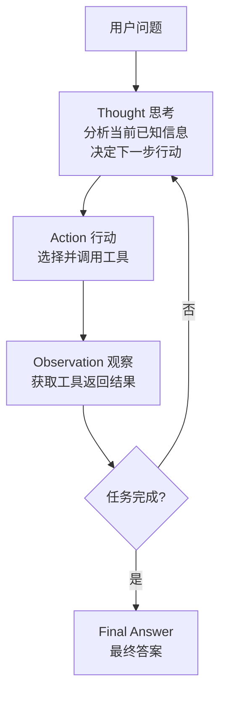
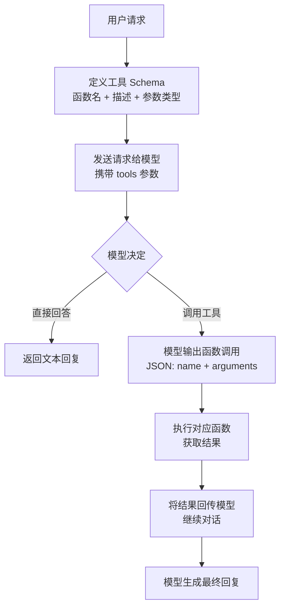
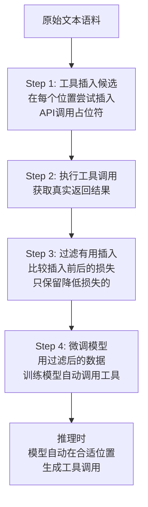
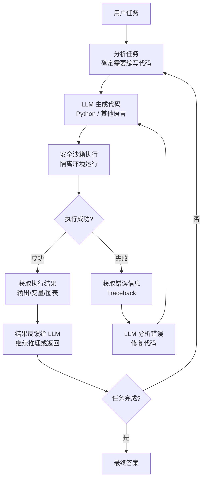
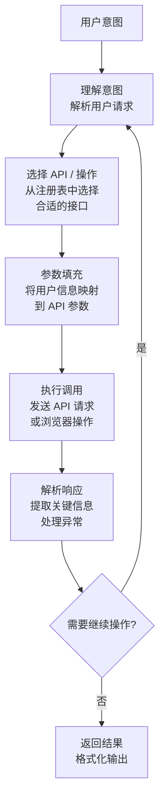

# 八、工具使用与函数调用类 Agent 设计模式

工具使用与函数调用类 Agent 设计模式的核心思想是：**让大语言模型（LLM）不再局限于文本生成，而是能够主动调用外部工具、API、代码执行器等能力，将自身从"只能说话"升级为"能做事"的智能体**。这类模式赋予了 Agent 与真实世界交互的能力，使其可以搜索信息、执行计算、操作数据库、发送邮件、调用 API 等。

LLM 本身是一个"大脑"——擅长理解、推理和规划，但无法直接获取实时数据、执行精确计算或操作外部系统。工具使用与函数调用类模式正是为 LLM 配上了"手"和"眼"，让它在推理过程中按需调用工具，获取观察结果，再基于结果继续推理，最终完成复杂任务。

本章涵盖以下 5 种工具使用与函数调用模式：

| 序号 | 模式 | 核心要点 |
|------|------|----------|
| 8.1 | ReAct (Reasoning + Acting) | 推理与行动交织，Thought→Action→Observation 循环 |
| 8.2 | Function Calling (OpenAI风格) | 结构化 JSON 函数调用，模型自动选择工具 |
| 8.3 | Toolformer 风格 | 模型自主学习何时、如何调用工具 |
| 8.4 | Code Interpreter | 代码即工具，安全沙箱执行代码获取结果 |
| 8.5 | API Agent / Web Agent | 通过 API 或浏览器与外部系统交互 |

---

## 8.1 ReAct (Reasoning + Acting) — 推理与行动交织

### 概念说明

**ReAct**（Reasoning + Acting）是 Agent 领域最经典的设计模式之一，由 Yao et al. 于 2022 年提出。其核心思想是将**推理（Reasoning）**和**行动（Acting）**交织进行：Agent 在每一步先进行思考（Thought），然后选择并执行一个动作（Action），再观察动作的结果（Observation），基于观察继续推理——形成 **Thought → Action → Observation** 的循环，直到任务完成。

ReAct 的关键创新在于：它不是先完成所有推理再执行，也不是盲目执行再反思，而是让推理和行动**交替进行、相互促进**。推理指导行动的方向，行动的结果又为推理提供新信息。这种范式更接近人类解决复杂问题的方式——边想边做，边做边想。

**类比理解**：就像一个侦探破案——先分析线索（Thought），然后去现场调查（Action），获得新证据后（Observation），再重新分析，决定下一步去哪里调查。

### 核心流程/原理



**关键设计**：
1. **Thought（思考）**：Agent 对当前状态的分析和推理，决定下一步该做什么。
2. **Action（行动）**：从可用工具中选择一个并执行，如 `search("关键词")`、`calculate("表达式")`。
3. **Observation（观察）**：工具执行后返回的结果，作为下一轮推理的输入。
4. 循环终止条件：Agent 认为已收集足够信息，输出最终答案。

### 完整 Python 示例代码

#### 环境配置与工具注册表

```python
"""
ReAct (Reasoning + Acting) — 推理与行动交织
Thought → Action → Observation 循环
"""

import os
import re
import json
from typing import Any, Callable

from openai import OpenAI

client = OpenAI(
    api_key=os.environ.get("OPENAI_API_KEY", "your-api-key-here"),
    base_url=os.environ.get("OPENAI_BASE_URL", None),
)


class ReActAgent:
    """
    ReAct Agent：推理与行动交织
    核心循环：Thought → Action → Observation → ... → Final Answer
    """

    MAX_ITERATIONS = 8

    def __init__(self):
        self.client = OpenAI(
            api_key=os.environ.get("OPENAI_API_KEY", "your-api-key-here"),
            base_url=os.environ.get("OPENAI_BASE_URL", None),
        )
        self.tools: dict[str, dict[str, Any]] = {}
        self._register_default_tools()
```

#### 工具注册与默认工具

```python
    def _register_default_tools(self):
        """注册默认工具集"""
        self.register_tool(
            name="search",
            description="搜索互联网或知识库，获取关于某个主题的信息",
            func=self._tool_search,
        )
        self.register_tool(
            name="calculate",
            description="执行数学计算，支持加减乘除、幂运算等。输入数学表达式字符串",
            func=self._tool_calculate,
        )
        self.register_tool(
            name="lookup",
            description="在数据表中查找特定信息，如城市人口、国家面积等",
            func=self._tool_lookup,
        )

    def register_tool(self, name: str, description: str, func: Callable):
        """注册一个工具到工具注册表"""
        self.tools[name] = {
            "name": name,
            "description": description,
            "function": func,
        }
```

#### 内置工具实现

```python
    def _tool_search(self, query: str) -> str:
        """模拟搜索工具"""
        mock_results = {
            "Python": "Python 是一种解释型、面向对象的高级编程语言，由 Guido van Rossum 于 1991 年发布。最新稳定版本为 3.12。",
            "中国GDP": "2023年中国GDP约为126万亿元人民币，约合17.8万亿美元，位居世界第二。",
            "太阳系": "太阳系有8颗行星：水星、金星、地球、火星、木星、土星、天王星、海王星。木星是最大的行星。",
            "深度学习": "深度学习是机器学习的一个子集，使用多层神经网络从数据中学习复杂模式。代表性框架有 PyTorch 和 TensorFlow。",
        }
        for key, value in mock_results.items():
            if key.lower() in query.lower() or query.lower() in key.lower():
                return value
        return f'关于"{query}"的搜索结果：暂无精确匹配，建议使用更具体的关键词重新搜索。'

    def _tool_calculate(self, expression: str) -> str:
        """计算工具"""
        try:
            allowed = set("0123456789+-*/().% ")
            safe_expr = "".join(c for c in expression if c in allowed)
            if not safe_expr.strip():
                return "错误：表达式为空"
            result = eval(safe_expr)
            return f"计算结果：{safe_expr} = {result}"
        except Exception as e:
            return f"计算错误：{e}"

    def _tool_lookup(self, key: str) -> str:
        """查表工具"""
        data_table = {
            "北京人口": "2189万（2023年）",
            "上海人口": "2487万（2023年）",
            "广州人口": "1882万（2023年）",
            "深圳人口": "1768万（2023年）",
            "中国面积": "960万平方公里",
            "美国面积": "937万平方公里",
            "俄罗斯面积": "1710万平方公里",
        }
        return data_table.get(key, f'未找到"{key}"的数据，可查询的键：{", ".join(list(data_table.keys())[:5])}...')
```

#### ReAct Prompt 构建与动作解析

```python
    def _build_react_prompt(self, question: str, scratchpad: str) -> str:
        """构建 ReAct 推理 Prompt"""
        tool_descriptions = "\n".join(
            f"  - {name}: {info['description']}"
            for name, info in self.tools.items()
        )

        return f"""你是一个使用 ReAct 模式的智能 Agent。请通过交替进行思考和行动来回答问题。

## 可用工具
{tool_descriptions}

## 行动格式
- 调用工具：Action: tool_name(参数)
- 给出最终答案：Action: Finish(最终答案)

## 已有推理记录
{scratchpad if scratchpad else "（无，这是第一步）"}

## 当前问题
{question}

请继续推理（从 Thought: 开始）："""

    def _parse_action(self, text: str) -> tuple[str, str]:
        """解析模型输出中的 Action"""
        match = re.search(r"Action:\s*(.+)", text, re.IGNORECASE)
        if not match:
            return "UNKNOWN", ""

        action_text = match.group(1).strip()

        if action_text.upper().startswith("FINISH("):
            inner = re.search(r"Finish\((.*?)\)", action_text, re.IGNORECASE)
            if inner:
                return "Finish", inner.group(1).strip().strip('"\'')
            return "Finish", action_text

        for tool_name in self.tools:
            pattern = rf"{tool_name}\((.*?)\)"
            m = re.search(pattern, action_text, re.IGNORECASE)
            if m:
                return tool_name, m.group(1).strip().strip('"\'')

        return "UNKNOWN", action_text
```

#### ReAct 推理循环

```python
    def run(self, question: str, verbose: bool = True) -> str:
        """执行 ReAct 推理循环"""
        if verbose:
            print(f"\n{'='*60}")
            print(f"问题：{question}")
            print(f"{'='*60}")

        scratchpad = ""

        for iteration in range(1, self.MAX_ITERATIONS + 1):
            if verbose:
                print(f"\n--- 迭代 {iteration} ---")

            prompt = self._build_react_prompt(question, scratchpad)

            response = self.client.chat.completions.create(
                model="gpt-4o",
                messages=[{"role": "user", "content": prompt}],
                temperature=0.3,
            )
            output = response.choices[0].message.content or ""

            if verbose:
                print(f"{output}")

            scratchpad += f"\n{output}"

            action_type, action_arg = self._parse_action(output)

            if action_type == "Finish":
                if verbose:
                    print(f"\n✅ 最终答案：{action_arg}")
                return action_arg

            if action_type in self.tools:
                tool_result = self.tools[action_type]["function"](action_arg)
                observation = f"Observation: {tool_result}"
                scratchpad += f"\n{observation}"
                if verbose:
                    print(f"  {observation}")
            else:
                observation = "Observation: 无法识别该动作，请使用可用工具或 Finish 给出答案。"
                scratchpad += f"\n{observation}"
                if verbose:
                    print(f"  {observation}")

        if verbose:
            print("\n⚠️ 达到最大迭代次数，强制要求给出最终答案")

        force_prompt = f"{scratchpad}\n\n请立即给出最终答案，格式：Action: Finish(你的答案)"
        response = self.client.chat.completions.create(
            model="gpt-4o",
            messages=[{"role": "user", "content": force_prompt}],
            temperature=0.0,
        )
        final = response.choices[0].message.content or ""
        _, answer = self._parse_action(final)
        return answer if answer else final
```

#### 主流程与演示

```python
if __name__ == "__main__":
    agent = ReActAgent()

    question1 = "北京和上海哪个城市人口更多？多多少？"
    agent.run(question1)

    print("\n")

    question2 = "如果中国GDP年增长率为5%，按照2023年的GDP基数，2025年的GDP预计是多少万亿元？"
    agent.run(question2)
```

**代码要点说明**：

| 组件 | 作用 | 关键设计 |
|------|------|----------|
| `tools` 注册表 | 管理可用工具 | 字典结构，支持动态注册 |
| `_build_react_prompt()` | 构建推理 Prompt | 将工具描述和推理记录注入上下文 |
| `_parse_action()` | 解析模型输出的动作 | 正则匹配 `Action: tool(arg)` 格式 |
| `run()` | ReAct 主循环 | Thought→Action→Observation 迭代，最多8轮 |
| `_register_default_tools()` | 注册默认工具 | search、calculate、lookup 三个示例工具 |

---

## 8.2 Function Calling (OpenAI风格) — 结构化函数调用

### 概念说明

**Function Calling** 是 OpenAI 提出的一种结构化函数调用机制。与 ReAct 模式通过自然语言解析动作不同，Function Calling 让模型直接输出**标准 JSON 格式**的函数调用请求，包括函数名和参数。这种机制消除了自然语言解析的不确定性，使工具调用更加可靠和结构化。

其核心流程是：开发者预先定义工具的 JSON Schema（包括函数名、描述、参数类型），模型根据用户请求自动判断是否需要调用工具、调用哪个工具、传入什么参数。调用结果回传后，模型继续生成回复。

**类比理解**：ReAct 像是让模型用自然语言说"我要查天气，城市是北京"，而 Function Calling 则是让模型填写一张结构化的表单——函数名、参数名、参数值都精确对齐，不存在歧义。

### 核心流程/原理



**关键设计**：
1. **工具定义（Tool Schema）**：用 JSON Schema 描述每个工具的名称、功能描述和参数结构。
2. **模型决策**：模型根据上下文自动选择是否调用工具，以及调用哪个工具。
3. **结构化输出**：模型输出 `tool_calls` 字段，包含函数名和严格类型化的参数。
4. **结果回传**：将工具执行结果以 `tool` 角色的消息回传，模型基于结果继续生成。

### 完整 Python 示例代码

#### 环境配置与工具定义

```python
"""
Function Calling (OpenAI风格) — 结构化函数调用
使用 OpenAI 的 tools 参数和 function_calling 机制
"""

import os
import json
from typing import Any

from openai import OpenAI

client = OpenAI(
    api_key=os.environ.get("OPENAI_API_KEY", "your-api-key-here"),
    base_url=os.environ.get("OPENAI_BASE_URL", None),
)


def get_weather(city: str, unit: str = "celsius") -> str:
    """模拟天气查询工具"""
    mock_weather = {
        "北京": {"temperature": "22°C", "condition": "晴", "humidity": "35%", "wind": "北风3级"},
        "上海": {"temperature": "26°C", "condition": "多云", "humidity": "72%", "wind": "东南风2级"},
        "深圳": {"temperature": "30°C", "condition": "阵雨", "humidity": "85%", "wind": "南风4级"},
        "纽约": {"temperature": "18°C", "condition": "阴", "humidity": "60%", "wind": "西风3级"},
    }
    if city in mock_weather:
        info = mock_weather[city]
        return json.dumps({
            "city": city,
            "temperature": info["temperature"],
            "condition": info["condition"],
            "humidity": info["humidity"],
            "wind": info["wind"],
        }, ensure_ascii=False)
    return json.dumps({"error": f"未找到城市 '{city}' 的天气数据"}, ensure_ascii=False)


def get_stock_price(symbol: str) -> str:
    """模拟股价查询工具"""
    mock_stocks = {
        "AAPL": {"name": "苹果公司", "price": 189.50, "change": "+1.23", "change_percent": "+0.65%"},
        "GOOGL": {"name": "谷歌", "price": 141.80, "change": "-0.45", "change_percent": "-0.32%"},
        "TSLA": {"name": "特斯拉", "price": 248.30, "change": "+5.67", "change_percent": "+2.34%"},
        "BABA": {"name": "阿里巴巴", "price": 78.90, "change": "-1.12", "change_percent": "-1.40%"},
    }
    symbol_upper = symbol.upper()
    if symbol_upper in mock_stocks:
        return json.dumps(mock_stocks[symbol_upper], ensure_ascii=False)
    return json.dumps({"error": f"未找到股票代码 '{symbol}'"}, ensure_ascii=False)


def send_email(to: str, subject: str, body: str) -> str:
    """模拟发送邮件工具"""
    return json.dumps({
        "status": "sent",
        "to": to,
        "subject": subject,
        "message_id": f"msg_{hash(to + subject) % 10000:04d}",
    }, ensure_ascii=False)
```

#### 工具 Schema 定义

```python
tools_schema = [
    {
        "type": "function",
        "function": {
            "name": "get_weather",
            "description": "查询指定城市的天气信息，包括温度、天气状况、湿度和风力",
            "parameters": {
                "type": "object",
                "properties": {
                    "city": {
                        "type": "string",
                        "description": "城市名称，如'北京'、'上海'、'纽约'",
                    },
                    "unit": {
                        "type": "string",
                        "enum": ["celsius", "fahrenheit"],
                        "description": "温度单位，默认为摄氏度",
                    },
                },
                "required": ["city"],
            },
        },
    },
    {
        "type": "function",
        "function": {
            "name": "get_stock_price",
            "description": "查询指定股票代码的实时价格和涨跌信息",
            "parameters": {
                "type": "object",
                "properties": {
                    "symbol": {
                        "type": "string",
                        "description": "股票代码，如'AAPL'、'GOOGL'、'TSLA'",
                    },
                },
                "required": ["symbol"],
            },
        },
    },
    {
        "type": "function",
        "function": {
            "name": "send_email",
            "description": "发送电子邮件给指定收件人",
            "parameters": {
                "type": "object",
                "properties": {
                    "to": {
                        "type": "string",
                        "description": "收件人邮箱地址",
                    },
                    "subject": {
                        "type": "string",
                        "description": "邮件主题",
                    },
                    "body": {
                        "type": "string",
                        "description": "邮件正文内容",
                    },
                },
                "required": ["to", "subject", "body"],
            },
        },
    },
]

tool_functions = {
    "get_weather": get_weather,
    "get_stock_price": get_stock_price,
    "send_email": send_email,
}
```

#### FunctionCallingAgent 类

```python
class FunctionCallingAgent:
    """
    OpenAI 风格的 Function Calling Agent
    利用模型的 tools 参数实现结构化函数调用
    """

    def __init__(self, tools_schema: list[dict], tool_functions: dict[str, Any]):
        self.tools_schema = tools_schema
        self.tool_functions = tool_functions

    def _execute_tool(self, function_name: str, arguments: dict) -> str:
        """执行指定的工具函数"""
        if function_name not in self.tool_functions:
            return json.dumps({"error": f"未知函数: {function_name}"})
        try:
            result = self.tool_functions[function_name](**arguments)
            return result
        except Exception as e:
            return json.dumps({"error": f"函数执行失败: {e}"})

    def run(self, user_message: str, verbose: bool = True) -> str:
        """执行 Function Calling 对话流程"""
        messages = [
            {
                "role": "system",
                "content": "你是一个智能助手，可以查询天气、股价和发送邮件。请根据用户需求调用合适的工具。",
            },
            {"role": "user", "content": user_message},
        ]

        if verbose:
            print(f"\n{'='*60}")
            print(f"用户：{user_message}")
            print(f"{'='*60}")

        max_rounds = 5
        for round_num in range(max_rounds):
            response = client.chat.completions.create(
                model="gpt-4o",
                messages=messages,
                tools=self.tools_schema,
                tool_choice="auto",
            )

            message = response.choices[0].message

            if message.content:
                if verbose:
                    print(f"\n助手：{message.content}")

            if not message.tool_calls:
                return message.content or ""

            for tool_call in message.tool_calls:
                func_name = tool_call.function.name
                func_args = json.loads(tool_call.function.arguments)

                if verbose:
                    print(f"\n🔧 调用工具：{func_name}({json.dumps(func_args, ensure_ascii=False)})")

                tool_result = self._execute_tool(func_name, func_args)

                if verbose:
                    print(f"📥 工具返回：{tool_result}")

                messages.append(message)
                messages.append({
                    "role": "tool",
                    "tool_call_id": tool_call.id,
                    "content": tool_result,
                })

        return "达到最大调用轮次，请简化请求后重试。"
```

#### 主流程与演示

```python
if __name__ == "__main__":
    agent = FunctionCallingAgent(tools_schema, tool_functions)

    agent.run("北京和上海今天天气怎么样？哪个城市更适合户外活动？")

    print("\n")

    agent.run("帮我查一下苹果和特斯拉的股价，然后给 boss@company.com 发一封邮件，主题是'股价日报'，正文包含这两只股票的价格信息。")
```

**代码要点说明**：

| 组件 | 作用 | 关键设计 |
|------|------|----------|
| `tools_schema` | 工具的 JSON Schema 定义 | OpenAI 标准格式，包含 name、description、parameters |
| `tool_functions` | 函数名到实现的映射 | 字典结构，便于动态查找和调用 |
| `tool_choice="auto"` | 让模型自动决定是否调用工具 | 也可设为 `"none"` 禁用工具或指定函数名 |
| `message.tool_calls` | 模型输出的工具调用列表 | 包含 id、function.name、function.arguments |
| `role: "tool"` | 工具结果的消息角色 | 必须携带 `tool_call_id` 以关联调用 |

---

## 8.3 Toolformer 风格 — 自主工具学习

### 概念说明

**Toolformer** 是 Meta AI 于 2023 年提出的一种让 LLM **自主学习何时、如何调用工具**的方法。与 ReAct 或 Function Calling 需要人工设计提示词或 Schema 不同，Toolformer 的核心思想是：**通过自监督学习，让模型自己发现哪些位置插入工具调用是有用的，然后微调模型使其在推理时自动调用工具**。

Toolformer 的训练流程包含三个关键步骤：
1. **工具插入候选**：在文本的每个位置，尝试插入各种工具调用（如计算器、搜索引擎），生成多个候选文本。
2. **过滤有用插入**：执行工具调用，比较插入前后的文本损失（perplexity），只保留确实降低了损失的工具调用。
3. **微调模型**：用过滤后的数据微调原始 LLM，使其学会在合适的位置自动生成工具调用。

**类比理解**：就像教一个学生使用计算器——不是告诉他"遇到乘法就用计算器"，而是让他自己尝试，发现用计算器确实算得更快更准后，自然就学会了何时使用。

### 核心流程/原理



**关键设计**：
1. **自监督**：不需要人工标注何时调用工具，模型通过损失函数自动学习。
2. **工具多样性**：支持计算器、搜索引擎、日历、翻译等多种工具。
3. **选择性调用**：模型学会只在确实有帮助时才调用工具，避免不必要的调用开销。

### 完整 Python 示例代码

#### 环境配置与工具定义

```python
"""
Toolformer 风格 — 自主工具学习
模拟 Toolformer 的工具插入和过滤过程
"""

import os
import re
import json
import math
from typing import Any

from openai import OpenAI

client = OpenAI(
    api_key=os.environ.get("OPENAI_API_KEY", "your-api-key-here"),
    base_url=os.environ.get("OPENAI_BASE_URL", None),
)


class ToolformerSimulator:
    """
    Toolformer 风格模拟器
    模拟工具插入候选生成、执行、过滤和推理时自动调用的过程
    """

    def __init__(self):
        self.available_tools = {
            "calculator": {
                "description": "执行数学计算，输入表达式返回结果",
                "pattern": r"\[Calculator\((.*?)\)\]",
                "execute": self._tool_calculator,
            },
            "search": {
                "description": "搜索信息，输入查询返回摘要",
                "pattern": r"\[Search\((.*?)\)\]",
                "execute": self._tool_search,
            },
        }
```

#### 工具实现

```python
    def _tool_calculator(self, expression: str) -> str:
        """计算器工具"""
        try:
            allowed = set("0123456789+-*/().% ")
            safe_expr = "".join(c for c in expression if c in allowed)
            if not safe_expr.strip():
                return "错误"
            result = eval(safe_expr)
            return str(result)
        except Exception:
            return "计算错误"

    def _tool_search(self, query: str) -> str:
        """搜索工具（模拟）"""
        mock_data = {
            "地球到月球的距离": "约384,400公里",
            "光速": "约299,792公里/秒",
            "珠穆朗玛峰高度": "8,848.86米",
            "世界人口": "约80亿（2023年）",
            "中国的首都": "北京",
        }
        for key, value in mock_data.items():
            if key in query or query in key:
                return value
        return f"关于'{query}'的信息暂未找到"
```

#### Step 1: 工具插入候选生成

```python
    def generate_tool_insertions(self, text: str) -> list[dict[str, Any]]:
        """
        Step 1: 在文本中生成工具插入候选
        让 LLM 在文本的合适位置插入工具调用占位符
        """
        tool_descriptions = "\n".join(
            f"  - {name}: {info['description']}"
            for name, info in self.available_tools.items()
        )

        prompt = f"""请分析以下文本，在合适的位置插入工具调用以增强文本的准确性。
可用的工具调用格式：
{tool_descriptions}

插入格式：
- 计算器：[Calculator(表达式)] → 结果
- 搜索：[Search(查询词)] → 结果

注意：只在确实需要工具辅助的位置插入，不要过度插入。

原始文本：
{text}

请输出插入工具调用后的完整文本（保持原文内容不变，只在合适位置添加工具调用）："""

        response = client.chat.completions.create(
            model="gpt-4o",
            messages=[{"role": "user", "content": prompt}],
            temperature=0.3,
        )
        augmented_text = response.choices[0].message.content or ""

        candidates = self._extract_candidates(augmented_text)
        return candidates
```

#### 候选提取与工具执行

```python
    def _extract_candidates(self, text: str) -> list[dict[str, Any]]:
        """从文本中提取工具调用候选"""
        candidates = []
        for tool_name, tool_info in self.available_tools.items():
            pattern = tool_info["pattern"]
            matches = re.finditer(pattern, text)
            for match in matches:
                candidates.append({
                    "tool": tool_name,
                    "input": match.group(1),
                    "full_match": match.group(0),
                    "position": match.start(),
                })
        return candidates

    def execute_tools(self, candidates: list[dict[str, Any]]) -> list[dict[str, Any]]:
        """
        Step 2: 执行工具调用，获取真实结果
        """
        for candidate in candidates:
            tool_name = candidate["tool"]
            tool_input = candidate["input"]
            if tool_name in self.available_tools:
                result = self.available_tools[tool_name]["execute"](tool_input)
                candidate["result"] = result
            else:
                candidate["result"] = "工具不可用"
        return candidates
```

#### Step 3: 过滤有用插入

```python
    def filter_useful_insertions(
        self, original_text: str, candidates: list[dict[str, Any]]
    ) -> list[dict[str, Any]]:
        """
        Step 3: 过滤有用的工具插入
        通过 LLM 评估插入工具调用后是否提升了文本质量
        """
        useful = []
        for candidate in candidates:
            tool_name = candidate["tool"]
            tool_input = candidate["input"]
            tool_result = candidate.get("result", "")

            prompt = f"""请评估在文本中插入以下工具调用是否有用：

原始文本片段：{original_text[:300]}

插入的工具调用：{candidate["full_match"]} → {tool_result}

评估标准：
1. 工具调用是否解决了文本中的不确定性？
2. 工具返回的结果是否使文本更准确？
3. 如果不插入工具调用，文本是否会出错或不完整？

请用 JSON 格式回复：
- "is_useful": true/false
- "score": 0-10（10为最有用）
- "reason": "简要原因"

仅输出 JSON："""

            response = client.chat.completions.create(
                model="gpt-4o-mini",
                messages=[{"role": "user", "content": prompt}],
                temperature=0.0,
            )
            try:
                evaluation = json.loads(response.choices[0].message.content or "{}")
            except json.JSONDecodeError:
                evaluation = {"is_useful": False, "score": 0}

            candidate["is_useful"] = evaluation.get("is_useful", False)
            candidate["score"] = evaluation.get("score", 0)
            candidate["eval_reason"] = evaluation.get("reason", "")

            if candidate["is_useful"] and candidate["score"] >= 5:
                useful.append(candidate)

        return useful
```

#### Step 4: 应用工具调用生成增强文本

```python
    def apply_tool_calls(
        self, text: str, useful_candidates: list[dict[str, Any]]
    ) -> str:
        """
        Step 4: 将过滤后的工具调用结果应用到文本中
        生成最终的增强文本
        """
        result_text = text
        for candidate in useful_candidates:
            original_call = candidate["full_match"]
            tool_result = candidate.get("result", "")
            replacement = f"{original_call} → {tool_result}"
            if original_call in result_text:
                result_text = result_text.replace(original_call, replacement)
            else:
                result_text += f"\n{replacement}"

        return result_text

    def process(self, text: str, verbose: bool = True) -> str:
        """Toolformer 完整流程"""
        if verbose:
            print(f"\n{'='*60}")
            print(f"原始文本：{text[:200]}...")
            print(f"{'='*60}")

        if verbose:
            print("\n>>> Step 1: 生成工具插入候选")
        candidates = self.generate_tool_insertions(text)
        if verbose:
            print(f"  找到 {len(candidates)} 个候选插入")
            for c in candidates:
                print(f"    - {c['tool']}({c['input']})")

        if not candidates:
            if verbose:
                print("  无需插入工具调用")
            return text

        if verbose:
            print("\n>>> Step 2: 执行工具调用")
        candidates = self.execute_tools(candidates)
        if verbose:
            for c in candidates:
                print(f"    - {c['tool']}({c['input']}) → {c.get('result', 'N/A')}")

        if verbose:
            print("\n>>> Step 3: 过滤有用插入")
        useful = self.filter_useful_insertions(text, candidates)
        if verbose:
            print(f"  保留 {len(useful)}/{len(candidates)} 个有用插入")
            for c in useful:
                print(f"    - {c['tool']}({c['input']}) → {c.get('result', 'N/A')} [分数:{c['score']}]")

        if verbose:
            print("\n>>> Step 4: 生成增强文本")
        enhanced_text = self.apply_tool_calls(text, useful)
        if verbose:
            print(f"\n增强文本：\n{enhanced_text}")

        return enhanced_text
```

#### 主流程与演示

```python
if __name__ == "__main__":
    toolformer = ToolformerSimulator()

    text1 = (
        "地球到月球的距离大约是384,400公里。"
        "光从月球到地球需要约1.28秒。"
        "如果我们以100公里/小时的速度开车去月球，大约需要3844小时，"
        "也就是约160天。"
    )
    toolformer.process(text1)

    print("\n")

    text2 = (
        "珠穆朗玛峰的高度是8848米，"
        "如果把它和世界最高建筑哈利法塔（828米）相比，"
        "珠穆朗玛峰大约是哈利法塔的10.7倍高。"
    )
    toolformer.process(text2)
```

**代码要点说明**：

| 步骤 | 方法 | 作用 |
|------|------|------|
| Step 1 | `generate_tool_insertions()` | 让 LLM 在文本中插入工具调用占位符 |
| Step 2 | `execute_tools()` | 执行工具调用，获取真实返回结果 |
| Step 3 | `filter_useful_insertions()` | 评估每个插入是否有用，过滤低质量插入 |
| Step 4 | `apply_tool_calls()` | 将有用插入的结果应用到文本中 |

**与 ReAct/Function Calling 的区别**：
- ReAct/Function Calling：推理时由模型实时决定调用工具。
- Toolformer：训练时学习何时调用工具，推理时自动调用，无需外部提示。

---

## 8.4 Code Interpreter — 代码即工具

### 概念说明

**Code Interpreter**（代码解释器）模式将**代码执行器**作为 Agent 的核心工具。其核心思想是：让 LLM 生成可执行代码来解决那些自然语言推理难以精确处理的问题——如数据分析、数学计算、文件处理、可视化等。代码在安全的沙箱环境中执行，执行结果反馈给 LLM 继续推理。

这一模式的典型代表是 ChatGPT 的 Code Interpreter（现称 Advanced Data Analysis），它让 ChatGPT 能够编写并执行 Python 代码，处理用户上传的数据文件，生成图表和计算结果。

**核心优势**：
1. **精确性**：数学计算、统计分析和数据处理由代码保证，不依赖 LLM 的"心算"。
2. **通用性**：代码可以处理几乎任何类型的任务——数据处理、文件转换、图像操作等。
3. **可验证性**：代码和执行结果都是可见的，用户可以审计和复现。

**类比理解**：就像给一个数学家配了一台电脑——他负责设计算法和编写程序，电脑负责精确执行，两者结合比纯心算强大得多。

### 核心流程/原理



**关键设计**：
1. **安全沙箱**：代码在隔离环境中执行，防止恶意操作（如文件系统访问、网络请求）。
2. **错误修复循环**：执行失败时，LLM 分析错误并自动修复代码，重新执行。
3. **结果反馈**：将 stdout 输出、变量值、错误信息等反馈给 LLM。

### 完整 Python 示例代码

#### 环境配置与沙箱执行器

```python
"""
Code Interpreter — 代码即工具
LLM 生成代码 → 安全沙箱执行 → 结果反馈 → 继续推理
"""

import os
import re
import io
import sys
import json
from typing import Any

from openai import OpenAI

client = OpenAI(
    api_key=os.environ.get("OPENAI_API_KEY", "your-api-key-here"),
    base_url=os.environ.get("OPENAI_BASE_URL", None),
)


class SafeSandbox:
    """
    安全沙箱执行器
    在受限环境中执行 Python 代码，捕获输出和错误
    """

    ALLOWED_BUILTINS = {
        "abs", "all", "any", "bin", "bool", "chr", "dict", "divmod",
        "enumerate", "filter", "float", "format", "hex", "int", "isinstance",
        "len", "list", "map", "max", "min", "oct", "ord", "pow", "print",
        "range", "repr", "round", "set", "sorted", "str", "sum", "tuple",
        "type", "zip",
    }

    def execute(self, code: str, timeout: int = 30) -> dict[str, Any]:
        """
        在沙箱中执行代码，返回执行结果
        """
        stdout_capture = io.StringIO()
        stderr_capture = io.StringIO()
        old_stdout = sys.stdout
        old_stderr = sys.stderr
        sys.stdout = stdout_capture
        sys.stderr = stderr_capture

        restricted_builtins = {
            k: __builtins__[k] if isinstance(__builtins__, dict) else getattr(__builtins__, k)
            for k in self.ALLOWED_BUILTINS
            if (k in __builtins__ if isinstance(__builtins__, dict) else hasattr(__builtins__, k))
        }
        restricted_builtins["__import__"] = __import__

        local_vars: dict[str, Any] = {}
        global_vars = {"__builtins__": restricted_builtins}

        try:
            exec(code, global_vars, local_vars)
            output = stdout_capture.getvalue()
            error_output = stderr_capture.getvalue()
            success = True
        except Exception as e:
            output = stdout_capture.getvalue()
            error_output = f"{type(e).__name__}: {e}"
            success = False
        finally:
            sys.stdout = old_stdout
            sys.stderr = old_stderr

        result_vars = {
            k: str(v)[:500]
            for k, v in local_vars.items()
            if not k.startswith("_") and not callable(v)
        }

        return {
            "success": success,
            "output": output,
            "error": error_output if not success else "",
            "variables": result_vars,
        }
```

#### CodeInterpreterAgent 类

````python
class CodeInterpreterAgent:
    """
    Code Interpreter Agent
    LLM 生成代码 → 沙箱执行 → 结果反馈 → 继续推理
    """

    MAX_RETRIES = 3

    def __init__(self):
        self.sandbox = SafeSandbox()
        self.conversation_history: list[dict] = []

    def _generate_code(self, task: str, error_context: str = "") -> str:
        """让 LLM 生成解决任务的 Python 代码"""
        error_section = ""
        if error_context:
            error_section = f"""
之前的代码执行出错，错误信息如下：
{error_context}

请修复上述错误，生成修正后的代码。
"""

        prompt = f"""你是一个 Python 编程专家。请编写 Python 代码来解决以下任务。

规则：
1. 代码应该是完整可执行的
2. 使用 print() 输出关键结果
3. 不要使用需要安装的外部库（仅使用标准库）
4. 将代码放在 python ``` 代码块中
```

{error_section}

任务：{task}

请生成 Python 代码："""

        response = client.chat.completions.create(
            model="gpt-4o",
            messages=[{"role": "user", "content": prompt}],
            temperature=0.0,
        )
        return response.choices[0].message.content or ""

    def _extract_code(self, response: str) -> str:
        """从 LLM 响应中提取 Python 代码块"""
        pattern = r"```python\s*\n(.*?)```"
        matches = re.findall(pattern, response, re.DOTALL)
        if matches:
            return "\n\n".join(matches)

        pattern = r"```\s*\n(.*?)```"
        matches = re.findall(pattern, response, re.DOTALL)
        if matches:
            return "\n\n".join(matches)

        return response

    def _synthesize_answer(
        self, task: str, code: str, execution_result: dict[str, Any]
    ) -> str:
        """基于代码和执行结果，让 LLM 生成自然语言答案"""
        result_summary = json.dumps(execution_result, ensure_ascii=False, indent=2)

        prompt = f"""基于以下代码和执行结果，用自然语言回答用户的任务。
```

任务：{task}

执行的代码：
```python
{code}
```

执行结果：
{result_summary}

请给出清晰、完整的答案："""

        response = client.chat.completions.create(
            model="gpt-4o",
            messages=[{"role": "user", "content": prompt}],
            temperature=0.0,
        )
        return response.choices[0].message.content or ""
````

#### 主循环

```python
    def run(self, task: str, verbose: bool = True) -> str:
        """Code Interpreter 主循环"""
        if verbose:
            print(f"\n{'='*60}")
            print(f"任务：{task}")
            print(f"{'='*60}")

        error_context = ""

        for attempt in range(1, self.MAX_RETRIES + 1):
            if verbose:
                print(f"\n--- 第 {attempt} 次尝试 ---")

            raw_response = self._generate_code(task, error_context)
            code = self._extract_code(raw_response)

            if verbose:
                print(f"\n生成的代码：\n{'-'*40}")
                for i, line in enumerate(code.split("\n"), 1):
                    print(f"  {i:3d} | {line}")
                print(f"{'-'*40}")

            result = self.sandbox.execute(code)

            if verbose:
                if result["output"]:
                    print(f"\n执行输出：\n{result['output']}")
                if result["error"]:
                    print(f"\n执行错误：\n{result['error']}")
                if result["variables"]:
                    print(f"\n关键变量：")
                    for k, v in result["variables"].items():
                        print(f"  {k} = {v[:100]}")

            if result["success"]:
                answer = self._synthesize_answer(task, code, result)
                if verbose:
                    print(f"\n✅ 最终答案：\n{answer}")
                return answer
            else:
                error_context = f"代码：\n{code}\n\n错误：{result['error']}"
                if verbose:
                    print(f"\n❌ 执行失败，准备修复代码...")

        if verbose:
            print("\n⚠️ 达到最大重试次数")
        return "多次尝试后仍无法成功执行代码，请手动检查任务。"
```

#### 主流程与演示

```python
if __name__ == "__main__":
    agent = CodeInterpreterAgent()

    task1 = """分析一组学生的考试成绩：
    小明：85, 92, 78, 90, 88
    小红：76, 88, 95, 82, 91
    小刚：90, 85, 87, 93, 89

    请计算每个学生的平均分、最高分和最低分，
    并找出全班平均分最高的学生。"""

    agent.run(task1)

    print("\n")

    task2 = """一个投资组合包含三只股票：
    - 股票A：投入10000元，年收益率8%
    - 股票B：投入15000元，年收益率5%
    - 股票C：投入8000元，年收益率12%

    计算5年后每只股票的价值和总投资组合的总价值。
    假设收益按复利计算。"""

    agent.run(task2)
```

**代码要点说明**：

| 组件 | 作用 | 关键设计 |
|------|------|----------|
| `SafeSandbox` | 安全沙箱执行器 | 限制内置函数、捕获输出和错误、隔离执行环境 |
| `_generate_code()` | 让 LLM 生成代码 | 支持传入错误上下文进行修复 |
| `_extract_code()` | 提取代码块 | 正则匹配 ```python``` 格式 |
| `run()` | 主循环 | 最多3次重试，失败时自动修复代码 |
| `_synthesize_answer()` | 结果综合 | 将代码和执行结果转化为自然语言答案 |

---

## 8.5 API Agent / Web Agent — API 与浏览器交互

### 概念说明

**API Agent / Web Agent** 是一类通过 API 或浏览器与外部系统交互的 Agent。其核心思想是：将外部系统的能力封装为 API 调用或浏览器操作，让 LLM 作为"大脑"理解用户意图、选择合适的 API/操作、填充参数、解析响应，从而完成与外部世界的交互。

- **API Agent**：通过调用 REST API、数据库查询接口等与后端系统交互。例如查询数据库、调用第三方服务、操作云平台等。
- **Web Agent**：通过浏览器自动化（如 Selenium、Playwright）与网页交互。例如填表、点击按钮、抓取网页信息等。

两者的共同本质是：**LLM 负责理解意图和决策，API/浏览器负责执行具体操作**。

**类比理解**：API Agent 就像一个会打电话的助理——你告诉他"帮我订一张机票"，他知道该打哪个电话（API）、说什么话（参数）、怎么理解对方的回答（解析响应）。Web Agent 则像一个会操作电脑的助理——他能打开浏览器、点击按钮、填写表单。

### 核心流程/原理



**关键设计**：
1. **API 注册表**：集中管理所有可用的 API 端点，包括 URL、方法、参数、描述。
2. **意图到 API 的映射**：LLM 根据用户意图自动选择最合适的 API。
3. **参数填充**：LLM 从用户请求中提取信息，填充到 API 参数中。
4. **响应解析**：LLM 解析 API 返回的 JSON/HTML，提取用户关心的信息。
5. **多步操作**：支持链式调用，前一个 API 的输出可作为后一个 API 的输入。

### 完整 Python 示例代码

#### 环境配置与 API 注册表

```python
"""
API Agent / Web Agent — API 与浏览器交互
LLM 理解意图 → 选择 API → 填充参数 → 执行调用 → 解析响应
"""

import os
import json
from typing import Any

from openai import OpenAI

client = OpenAI(
    api_key=os.environ.get("OPENAI_API_KEY", "your-api-key-here"),
    base_url=os.environ.get("OPENAI_BASE_URL", None),
)


class APIAgent:
    """
    API Agent：通过 API 与外部系统交互
    包含 API 注册表、意图解析、参数填充、响应解析
    """

    def __init__(self):
        self.api_registry: dict[str, dict[str, Any]] = {}
        self._register_default_apis()

    def _register_default_apis(self):
        """注册默认的 API 端点"""
        self.register_api(
            name="query_database",
            description="查询数据库，支持 SQL 查询语句",
            parameters={
                "sql": {"type": "string", "description": "SQL 查询语句", "required": True},
                "database": {"type": "string", "description": "数据库名称", "required": True},
            },
            handler=self._api_query_database,
        )
        self.register_api(
            name="get_user_info",
            description="获取用户信息，根据用户ID或用户名查询",
            parameters={
                "user_id": {"type": "string", "description": "用户ID"},
                "username": {"type": "string", "description": "用户名"},
            },
            handler=self._api_get_user_info,
        )
        self.register_api(
            name="create_order",
            description="创建订单",
            parameters={
                "product_id": {"type": "string", "description": "产品ID", "required": True},
                "quantity": {"type": "integer", "description": "购买数量", "required": True},
                "user_id": {"type": "string", "description": "下单用户ID", "required": True},
            },
            handler=self._api_create_order,
        )
        self.register_api(
            name="search_products",
            description="搜索产品，支持按名称、类别、价格范围筛选",
            parameters={
                "keyword": {"type": "string", "description": "搜索关键词"},
                "category": {"type": "string", "description": "产品类别"},
                "min_price": {"type": "number", "description": "最低价格"},
                "max_price": {"type": "number", "description": "最高价格"},
            },
            handler=self._api_search_products,
        )
        self.register_api(
            name="send_notification",
            description="发送通知消息给用户",
            parameters={
                "user_id": {"type": "string", "description": "目标用户ID", "required": True},
                "message": {"type": "string", "description": "通知内容", "required": True},
                "channel": {"type": "string", "description": "通知渠道：email/sms/push", "required": True},
            },
            handler=self._api_send_notification,
        )

    def register_api(
        self, name: str, description: str, parameters: dict, handler: callable
    ):
        """注册一个 API 端点"""
        self.api_registry[name] = {
            "name": name,
            "description": description,
            "parameters": parameters,
            "handler": handler,
        }
```

#### 模拟 API 实现

```python
    def _api_query_database(self, sql: str, database: str) -> dict:
        """模拟数据库查询 API"""
        mock_results = {
            "orders": [
                {"order_id": "ORD001", "product": "笔记本电脑", "quantity": 1, "price": 5999, "user_id": "U001"},
                {"order_id": "ORD002", "product": "无线鼠标", "quantity": 2, "price": 89, "user_id": "U002"},
                {"order_id": "ORD003", "product": "机械键盘", "quantity": 1, "price": 459, "user_id": "U001"},
            ],
            "users": [
                {"user_id": "U001", "username": "张三", "email": "zhangsan@example.com", "level": "VIP"},
                {"user_id": "U002", "username": "李四", "email": "lisi@example.com", "level": "普通"},
                {"user_id": "U003", "username": "王五", "email": "wangwu@example.com", "level": "VIP"},
            ],
        }
        if "order" in sql.lower():
            return {"status": "success", "data": mock_results["orders"], "rows": len(mock_results["orders"])}
        elif "user" in sql.lower():
            return {"status": "success", "data": mock_results["users"], "rows": len(mock_results["users"])}
        return {"status": "success", "data": [], "rows": 0}

    def _api_get_user_info(self, user_id: str = "", username: str = "") -> dict:
        """模拟获取用户信息 API"""
        users = {
            "U001": {"user_id": "U001", "username": "张三", "email": "zhangsan@example.com", "level": "VIP", "total_orders": 15},
            "U002": {"user_id": "U002", "username": "李四", "email": "lisi@example.com", "level": "普通", "total_orders": 3},
            "U003": {"user_id": "U003", "username": "王五", "email": "wangwu@example.com", "level": "VIP", "total_orders": 28},
        }
        if user_id in users:
            return {"status": "success", "data": users[user_id]}
        for uid, info in users.items():
            if info["username"] == username:
                return {"status": "success", "data": info}
        return {"status": "error", "message": f"未找到用户：user_id={user_id}, username={username}"}

    def _api_create_order(self, product_id: str, quantity: int, user_id: str) -> dict:
        """模拟创建订单 API"""
        products = {
            "P001": {"name": "笔记本电脑", "price": 5999},
            "P002": {"name": "无线鼠标", "price": 89},
            "P003": {"name": "机械键盘", "price": 459},
        }
        if product_id not in products:
            return {"status": "error", "message": f"产品 {product_id} 不存在"}
        product = products[product_id]
        total = product["price"] * quantity
        return {
            "status": "success",
            "data": {
                "order_id": f"ORD{hash(product_id + user_id) % 10000:04d}",
                "product": product["name"],
                "quantity": quantity,
                "unit_price": product["price"],
                "total": total,
                "user_id": user_id,
            },
        }

    def _api_search_products(self, keyword: str = "", category: str = "",
                             min_price: float = 0, max_price: float = float("inf")) -> dict:
        """模拟搜索产品 API"""
        all_products = [
            {"product_id": "P001", "name": "笔记本电脑", "category": "电脑", "price": 5999},
            {"product_id": "P002", "name": "无线鼠标", "category": "外设", "price": 89},
            {"product_id": "P003", "name": "机械键盘", "category": "外设", "price": 459},
            {"product_id": "P004", "name": "显示器", "category": "电脑", "price": 2399},
            {"product_id": "P005", "name": "蓝牙耳机", "category": "音频", "price": 299},
        ]
        results = []
        for p in all_products:
            if keyword and keyword not in p["name"]:
                continue
            if category and category != p["category"]:
                continue
            if p["price"] < min_price or p["price"] > max_price:
                continue
            results.append(p)
        return {"status": "success", "data": results, "total": len(results)}

    def _api_send_notification(self, user_id: str, message: str, channel: str) -> dict:
        """模拟发送通知 API"""
        return {
            "status": "success",
            "data": {
                "notification_id": f"NTF{hash(user_id + message) % 10000:04d}",
                "user_id": user_id,
                "channel": channel,
                "message": message[:100],
                "sent_at": "2025-01-15T10:30:00Z",
            },
        }
```

#### 意图解析与 API 选择

```python
    def _plan_api_calls(self, user_request: str) -> list[dict[str, Any]]:
        """
        让 LLM 解析用户意图，规划 API 调用序列
        """
        api_descriptions = []
        for name, api in self.api_registry.items():
            params_desc = ", ".join(
                f"{k}({v.get('type', 'string')}"
                f"{'必填' if v.get('required') else '选填'}"
                f": {v.get('description', '')})"
                for k, v in api["parameters"].items()
            )
            api_descriptions.append(f"  - {name}: {api['description']}\n    参数: {params_desc}")

        api_list = "\n".join(api_descriptions)

        prompt = f"""你是一个 API 调用规划器。根据用户的请求，规划需要调用的 API 序列。

## 可用 API
{api_list}

## 用户请求
{user_request}

## 输出格式
请输出 JSON 数组，每个元素表示一个 API 调用步骤：
[
  {{
    "step": 1,
    "api_name": "API名称",
    "arguments": {{"参数名": "参数值"}},
    "purpose": "调用目的说明"
  }}
]

注意：
- 参数值应从用户请求中提取
- 如果需要前一步的结果，在参数值中使用 ${{step_N.字段名}} 引用
- 只输出 JSON 数组，不要其他内容

请规划 API 调用："""

        response = client.chat.completions.create(
            model="gpt-4o",
            messages=[{"role": "user", "content": prompt}],
            temperature=0.0,
        )
        raw = response.choices[0].message.content or ""

        try:
            clean = raw.strip()
            if clean.startswith("```"):
                lines = clean.split("\n")
                clean = "\n".join(lines[1:-1])
            steps = json.loads(clean)
            return steps if isinstance(steps, list) else [steps]
        except json.JSONDecodeError:
            return [{"step": 1, "api_name": "unknown", "arguments": {}, "purpose": raw}]
```

#### API 执行与参数解析

```python
    def _resolve_arguments(
        self, args: dict, previous_results: dict[int, dict]
    ) -> dict:
        """解析参数中的引用，如 ${{step_1.data.order_id}}"""
        resolved = {}
        for key, value in args.items():
            if isinstance(value, str) and "${" in value:
                try:
                    ref_pattern = r"\$\{step_(\d+)\.(.+)\}"
                    match = re.search(ref_pattern, value)
                    if match:
                        step_num = int(match.group(1))
                        field_path = match.group(2).split(".")
                        data = previous_results.get(step_num, {})
                        for field in field_path:
                            if isinstance(data, dict):
                                data = data.get(field, "")
                            elif isinstance(data, list) and field.isdigit():
                                data = data[int(field)]
                            else:
                                data = ""
                        resolved[key] = data
                    else:
                        resolved[key] = value
                except Exception:
                    resolved[key] = value
            else:
                resolved[key] = value
        return resolved

    def _execute_api(self, api_name: str, arguments: dict) -> dict:
        """执行指定的 API 调用"""
        if api_name not in self.api_registry:
            return {"status": "error", "message": f"未知 API: {api_name}"}
        try:
            handler = self.api_registry[api_name]["handler"]
            result = handler(**arguments)
            return result
        except Exception as e:
            return {"status": "error", "message": f"API 执行失败: {e}"}
```

#### 响应解析与结果综合

```python
    def _summarize_results(
        self, user_request: str, execution_log: list[dict]
    ) -> str:
        """让 LLM 综合所有 API 调用结果，生成自然语言回复"""
        log_summary = json.dumps(execution_log, ensure_ascii=False, indent=2)

        prompt = f"""你是一个智能助手。根据以下 API 调用结果，用自然语言回答用户的请求。

用户请求：{user_request}

API 调用记录：
{log_summary}

请给出清晰、完整的回答："""

        response = client.chat.completions.create(
            model="gpt-4o",
            messages=[{"role": "user", "content": prompt}],
            temperature=0.3,
        )
        return response.choices[0].message.content or ""
```

#### 主循环

```python
    def run(self, user_request: str, verbose: bool = True) -> str:
        """API Agent 主流程"""
        if verbose:
            print(f"\n{'='*60}")
            print(f"用户请求：{user_request}")
            print(f"{'='*60}")

        if verbose:
            print("\n>>> 规划 API 调用序列")
        steps = self._plan_api_calls(user_request)
        if verbose:
            for step in steps:
                print(f"  步骤 {step.get('step')}: {step.get('api_name')}({json.dumps(step.get('arguments', {}), ensure_ascii=False)})")
                print(f"    目的: {step.get('purpose', '')}")

        previous_results: dict[int, dict] = {}
        execution_log: list[dict] = []

        for step in steps:
            step_num = step.get("step", 0)
            api_name = step.get("api_name", "")
            raw_args = step.get("arguments", {})

            resolved_args = self._resolve_arguments(raw_args, previous_results)

            if verbose:
                print(f"\n>>> 执行步骤 {step_num}: {api_name}")
                print(f"    参数: {json.dumps(resolved_args, ensure_ascii=False)}")

            result = self._execute_api(api_name, resolved_args)

            if verbose:
                status = result.get("status", "unknown")
                icon = "✅" if status == "success" else "❌"
                print(f"    {icon} 结果: {json.dumps(result, ensure_ascii=False)[:200]}")

            previous_results[step_num] = result
            execution_log.append({
                "step": step_num,
                "api": api_name,
                "arguments": resolved_args,
                "result": result,
            })

        if verbose:
            print("\n>>> 综合结果")
        answer = self._summarize_results(user_request, execution_log)

        if verbose:
            print(f"\n最终回复：\n{answer}")

        return answer
```

#### 主流程与演示

```python
if __name__ == "__main__":
    agent = APIAgent()

    request1 = "帮我查一下用户张三的信息，然后搜索价格在100到500之间的外设产品，最后给张三发一封邮件推荐这些产品。"
    agent.run(request1)

    print("\n")

    request2 = "查询所有订单，然后给下单最多的VIP用户发一条短信感谢他的支持。"
    agent.run(request2)
```

**代码要点说明**：

| 组件 | 作用 | 关键设计 |
|------|------|----------|
| `api_registry` | API 注册表 | 集中管理 API 端点、参数和处理器 |
| `_plan_api_calls()` | 意图解析与 API 规划 | LLM 自动选择 API 和填充参数 |
| `_resolve_arguments()` | 参数引用解析 | 支持 `${step_N.field}` 引用前序结果 |
| `_execute_api()` | API 执行 | 调用注册的 handler 函数 |
| `_summarize_results()` | 结果综合 | LLM 将 API 结果转化为自然语言 |

---

## 总结对比表

| 维度 | ReAct | Function Calling | Toolformer | Code Interpreter | API Agent |
|------|:--:|:--:|:--:|:--:|:--:|
| **核心思想** | 推理与行动交织 | 结构化 JSON 函数调用 | 模型自主学习工具调用 | 代码即工具，沙箱执行 | API/浏览器与外部系统交互 |
| **工具调用方式** | 自然语言解析 Action | 模型输出 tool_calls JSON | 模型自动生成 API 调用 | 生成可执行代码 | 规划 API 调用序列 |
| **工具选择** | LLM 通过推理选择 | 模型基于 Schema 选择 | 模型通过学习自动选择 | LLM 决定何时写代码 | LLM 规划 API 调用链 |
| **参数格式** | 自然语言（需解析） | 严格 JSON Schema | 模型自学习的格式 | Python 代码 | API 参数映射 |
| **可靠性** | 中等（依赖解析） | 高（结构化输出） | 高（训练后稳定） | 高（代码确定性） | 高（API 规范确定） |
| **灵活性** | 高（任意工具） | 中（需预定义 Schema） | 高（自主学习新工具） | 极高（代码万能） | 中（受限于注册 API） |
| **学习成本** | 低（Prompt 工程） | 低（定义 Schema） | 高（需要微调） | 低（Prompt 工程） | 中（需注册 API） |
| **可解释性** | 高（推理过程可见） | 高（调用记录清晰） | 低（隐式学习） | 极高（代码可审计） | 高（API 调用链可追溯） |
| **安全风险** | 低（工具受限） | 低（参数受 Schema 约束） | 中（模型自主决策） | 高（需沙箱隔离） | 中（API 权限控制） |
| **典型场景** | 通用推理+工具调用 | 结构化 API 集成 | 工具密集型任务 | 数据分析、数学计算 | 业务系统集成 |
| **计算成本** | ★★☆ 中 | ★★☆ 中 | ★★★ 高（需微调） | ★★☆ 中 | ★★☆ 中 |
| **代表实现** | LangChain ReAct | OpenAI Function Calling | Meta Toolformer | ChatGPT Code Interpreter | AutoGPT + API |

### 选型建议

1. **通用推理+工具调用场景**：优先使用 **ReAct**，它是最经典的范式，推理过程透明，适合需要"边想边做"的复杂任务。

2. **与 OpenAI 生态深度集成**：使用 **Function Calling**，它提供了最可靠的结构化输出，特别适合需要精确参数传递的 API 调用场景。

3. **需要模型自主学会工具使用**：考虑 **Toolformer 风格**，它通过微调让模型内化工具调用能力，适合工具调用频繁且模式固定的生产环境。但训练成本较高，适合有微调条件的团队。

4. **数据分析、数学计算、文件处理**：首选 **Code Interpreter**，代码执行的确定性远超自然语言推理，特别适合需要精确计算和数据处理的任务。

5. **业务系统集成、多系统交互**：使用 **API Agent**，它擅长规划和执行多步 API 调用链，适合需要与数据库、第三方服务、内部系统交互的企业场景。

### 组合使用

在实际应用中，这些模式可以互相组合，发挥更大威力：

- **ReAct + Function Calling**：在 ReAct 的推理循环中使用 Function Calling 作为 Action 的执行机制，兼具推理透明度和调用可靠性。
- **Code Interpreter + Function Calling**：将代码执行器注册为一个 Function Calling 工具，模型在需要精确计算时自动调用代码执行。
- **API Agent + ReAct**：API Agent 的多步调用链可以用 ReAct 的 Thought→Action→Observation 模式来动态规划，而非一次性预规划。
- **Toolformer + Code Interpreter**：通过微调让模型学会在合适的位置自动生成代码调用，结合代码执行器的精确性。

---

*本文档涵盖了工具使用与函数调用类 Agent 的五种核心设计模式。每种模式的示例代码均可独立运行，只需配置 OpenAI API Key 即可测试。在实际项目中，建议根据具体场景选择最合适的模式，或组合多种模式以构建更强大的 Agent 系统。*
