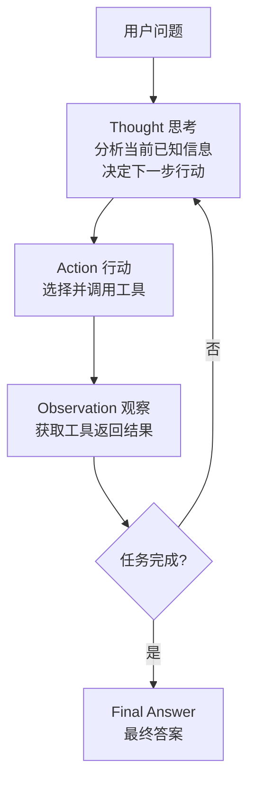
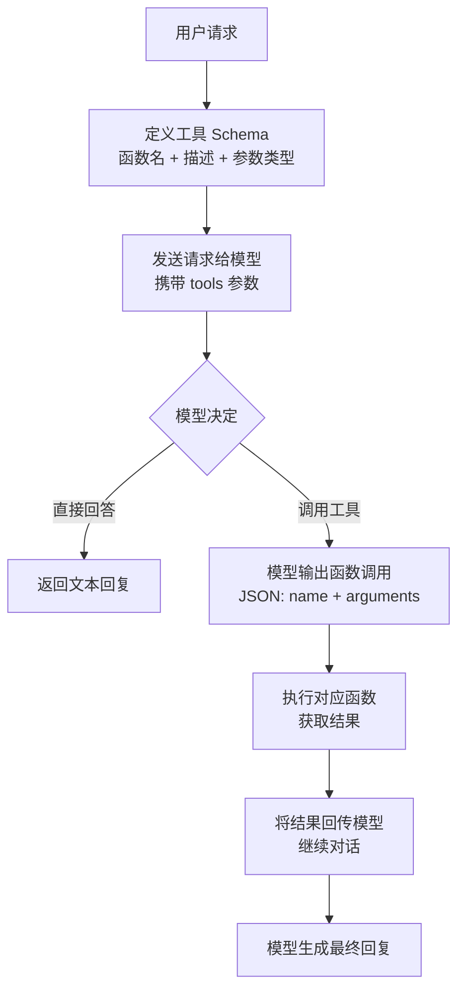
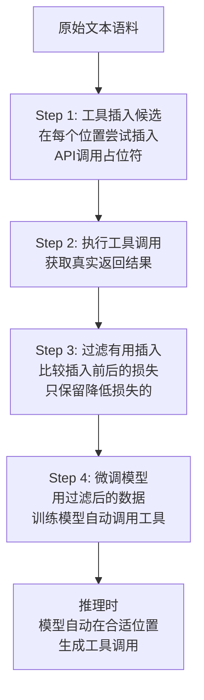
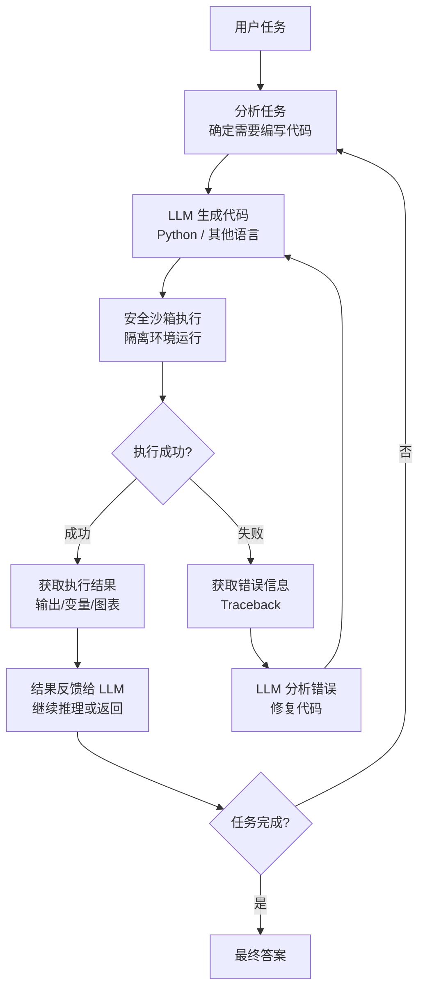
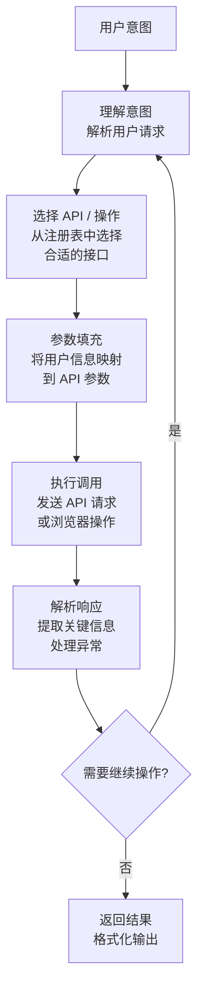
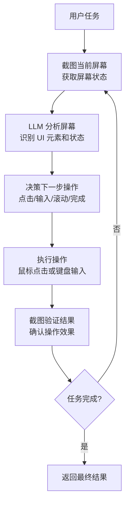
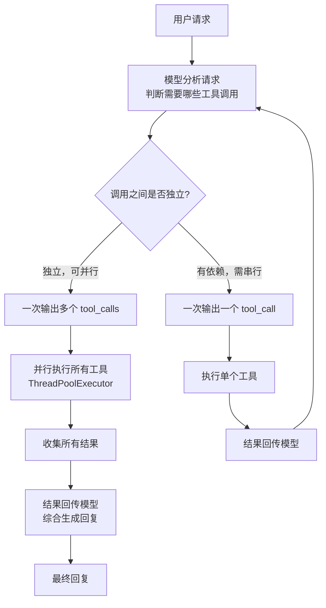
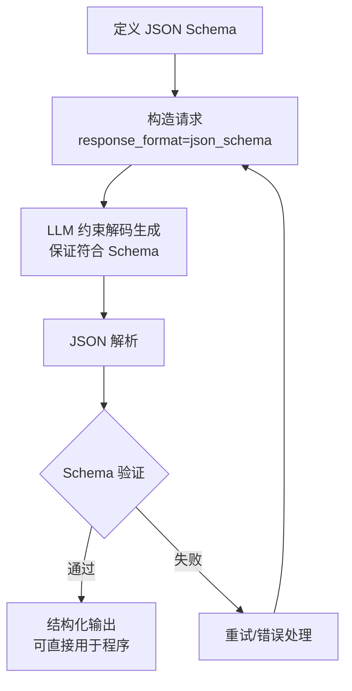
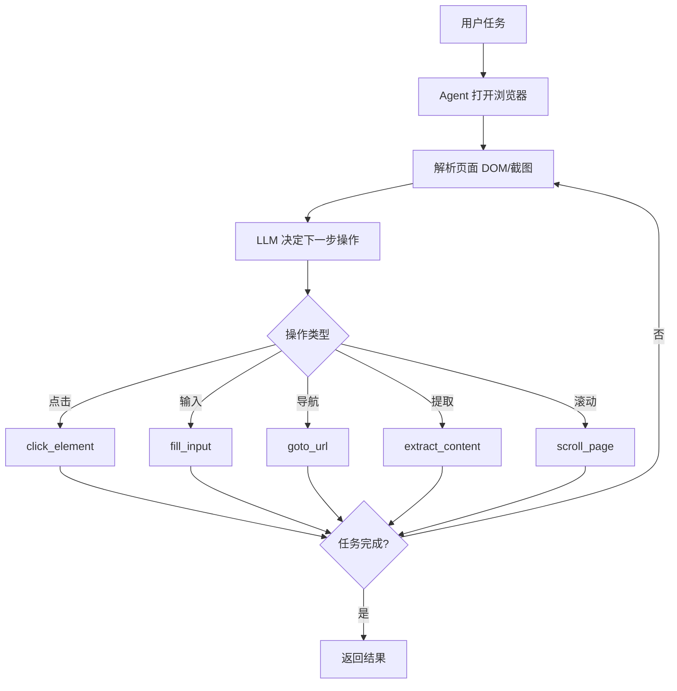
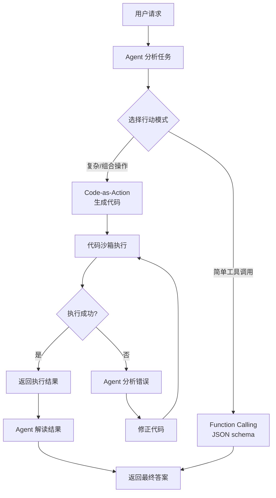

# 八、工具使用与函数调用类 Agent 设计模式

工具使用与函数调用类 Agent 设计模式的核心思想是：**让大语言模型（LLM）不再局限于文本生成，而是能够主动调用外部工具、API、代码执行器等能力，将自身从"只能说话"升级为"能做事"的智能体**。这类模式赋予了 Agent 与真实世界交互的能力，使其可以搜索信息、执行计算、操作数据库、发送邮件、调用 API 等。

LLM 本身是一个"大脑"——擅长理解、推理和规划，但无法直接获取实时数据、执行精确计算或操作外部系统。工具使用与函数调用类模式正是为 LLM 配上了"手"和"眼"，让它在推理过程中按需调用工具，获取观察结果，再基于结果继续推理，最终完成复杂任务。

本章涵盖以下 10 种工具使用与函数调用模式：

| 序号 | 模式 | 核心要点 |
|------|------|----------|
| 8.1 | ReAct (Reasoning + Acting) | 推理与行动交织，Thought→Action→Observation 循环 |
| 8.2 | Function Calling (OpenAI风格) | 结构化 JSON 函数调用，模型自动选择工具 |
| 8.3 | Toolformer 风格 | 模型自主学习何时、如何调用工具 |
| 8.4 | Code Interpreter | 代码即工具，安全沙箱执行代码获取结果 |
| 8.5 | API Agent / Web Agent | 通过 API 或浏览器与外部系统交互 |
| 8.6 | Computer Use / GUI Agent | LLM 操作 GUI 界面，截图→分析→操作→验证 |
| 8.7 | Parallel Function Calling | 一次响应并行多个独立工具调用，降低延迟 |
| 8.8 | Structured Outputs | 强制 LLM 输出严格匹配 JSON Schema 的结构化数据 |
| 8.9 | Browser Use / Web Agent | Agent 自主操作浏览器完成 Web 任务（搜索、填表、提取） |
| 8.10 | Code-as-Action（代码即行动） | 代码即能力，生成并执行代码完成目标，突破预定义工具限制 |

---

## 8.1 ReAct (Reasoning + Acting) — 推理与行动交织

### 概念说明

**ReAct**（Reasoning + Acting）是 Agent 领域最经典的设计模式之一，由 Yao et al. 于 2022 年提出。其核心思想是将**推理（Reasoning）**和**行动（Acting）**交织进行：Agent 在每一步先进行思考（Thought），然后选择并执行一个动作（Action），再观察动作的结果（Observation），基于观察继续推理——形成 **Thought → Action → Observation** 的循环，直到任务完成。

ReAct 的关键创新在于：它不是先完成所有推理再执行，也不是盲目执行再反思，而是让推理和行动**交替进行、相互促进**。推理指导行动的方向，行动的结果又为推理提供新信息。这种范式更接近人类解决复杂问题的方式——边想边做，边做边想。

**类比理解**：就像一个侦探破案——先分析线索（Thought），然后去现场调查（Action），获得新证据后（Observation），再重新分析，决定下一步去哪里调查。

### 核心流程/原理



**关键设计**：
1. **Thought（思考）**：Agent 对当前状态的分析和推理，决定下一步该做什么。
2. **Action（行动）**：从可用工具中选择一个并执行，如 `search("关键词")`、`calculate("表达式")`。
3. **Observation（观察）**：工具执行后返回的结果，作为下一轮推理的输入。
4. 循环终止条件：Agent 认为已收集足够信息，输出最终答案。

### 完整 Python 示例代码

#### 环境配置与工具注册表

```python
"""
ReAct (Reasoning + Acting) — 推理与行动交织
Thought → Action → Observation 循环
"""

import os
import re
import json
from typing import Any, Callable

from openai import OpenAI

client = OpenAI(
    api_key=os.environ.get("OPENAI_API_KEY", "your-api-key-here"),
    base_url=os.environ.get("OPENAI_BASE_URL", None),
)


class ReActAgent:
    """
    ReAct Agent：推理与行动交织
    核心循环：Thought → Action → Observation → ... → Final Answer
    """

    MAX_ITERATIONS = 8

    def __init__(self):
        self.client = OpenAI(
            api_key=os.environ.get("OPENAI_API_KEY", "your-api-key-here"),
            base_url=os.environ.get("OPENAI_BASE_URL", None),
        )
        self.tools: dict[str, dict[str, Any]] = {}
        self._register_default_tools()
```

#### 工具注册与默认工具

```python
    def _register_default_tools(self):
        """注册默认工具集"""
        self.register_tool(
            name="search",
            description="搜索互联网或知识库，获取关于某个主题的信息",
            func=self._tool_search,
        )
        self.register_tool(
            name="calculate",
            description="执行数学计算，支持加减乘除、幂运算等。输入数学表达式字符串",
            func=self._tool_calculate,
        )
        self.register_tool(
            name="lookup",
            description="在数据表中查找特定信息，如城市人口、国家面积等",
            func=self._tool_lookup,
        )

    def register_tool(self, name: str, description: str, func: Callable):
        """注册一个工具到工具注册表"""
        self.tools[name] = {
            "name": name,
            "description": description,
            "function": func,
        }
```

#### 内置工具实现

```python
    def _tool_search(self, query: str) -> str:
        """模拟搜索工具"""
        mock_results = {
            "Python": "Python 是一种解释型、面向对象的高级编程语言，由 Guido van Rossum 于 1991 年发布。最新稳定版本为 3.14（2025.10 发布）。",
            "中国GDP": "2023年中国GDP约为126万亿元人民币，约合17.8万亿美元，位居世界第二。",
            "太阳系": "太阳系有8颗行星：水星、金星、地球、火星、木星、土星、天王星、海王星。木星是最大的行星。",
            "深度学习": "深度学习是机器学习的一个子集，使用多层神经网络从数据中学习复杂模式。代表性框架有 PyTorch 和 TensorFlow。",
        }
        for key, value in mock_results.items():
            if key.lower() in query.lower() or query.lower() in key.lower():
                return value
        return f'关于"{query}"的搜索结果：暂无精确匹配，建议使用更具体的关键词重新搜索。'

    def _tool_calculate(self, expression: str) -> str:
        """计算工具"""
        try:
            allowed = set("0123456789+-*/().% ")
            safe_expr = "".join(c for c in expression if c in allowed)
            if not safe_expr.strip():
                return "错误：表达式为空"
            result = eval(safe_expr)
            return f"计算结果：{safe_expr} = {result}"
        except Exception as e:
            return f"计算错误：{e}"

    def _tool_lookup(self, key: str) -> str:
        """查表工具"""
        data_table = {
            "北京人口": "2189万（2023年）",
            "上海人口": "2487万（2023年）",
            "广州人口": "1882万（2023年）",
            "深圳人口": "1768万（2023年）",
            "中国面积": "960万平方公里",
            "美国面积": "937万平方公里",
            "俄罗斯面积": "1710万平方公里",
        }
        return data_table.get(key, f'未找到"{key}"的数据，可查询的键：{", ".join(list(data_table.keys())[:5])}...')
```

#### ReAct Prompt 构建与动作解析

```python
    def _build_react_prompt(self, question: str, scratchpad: str) -> str:
        """构建 ReAct 推理 Prompt"""
        tool_descriptions = "\n".join(
            f"  - {name}: {info['description']}"
            for name, info in self.tools.items()
        )

        return f"""你是一个使用 ReAct 模式的智能 Agent。请通过交替进行思考和行动来回答问题。

## 可用工具
{tool_descriptions}

## 行动格式
- 调用工具：Action: tool_name(参数)
- 给出最终答案：Action: Finish(最终答案)

## 已有推理记录
{scratchpad if scratchpad else "（无，这是第一步）"}

## 当前问题
{question}

请继续推理（从 Thought: 开始）："""

    def _parse_action(self, text: str) -> tuple[str, str]:
        """解析模型输出中的 Action"""
        match = re.search(r"Action:\s*(.+)", text, re.IGNORECASE)
        if not match:
            return "UNKNOWN", ""

        action_text = match.group(1).strip()

        if action_text.upper().startswith("FINISH("):
            inner = re.search(r"Finish\((.*?)\)", action_text, re.IGNORECASE)
            if inner:
                return "Finish", inner.group(1).strip().strip('"\'')
            return "Finish", action_text

        for tool_name in self.tools:
            pattern = rf"{tool_name}\((.*?)\)"
            m = re.search(pattern, action_text, re.IGNORECASE)
            if m:
                return tool_name, m.group(1).strip().strip('"\'')

        return "UNKNOWN", action_text
```

#### ReAct 推理循环

```python
    def run(self, question: str, verbose: bool = True) -> str:
        """执行 ReAct 推理循环"""
        if verbose:
            print(f"\n{'='*60}")
            print(f"问题：{question}")
            print(f"{'='*60}")

        scratchpad = ""

        for iteration in range(1, self.MAX_ITERATIONS + 1):
            if verbose:
                print(f"\n--- 迭代 {iteration} ---")

            prompt = self._build_react_prompt(question, scratchpad)

            response = self.client.chat.completions.create(
                model="gpt-4o",
                messages=[{"role": "user", "content": prompt}],
                temperature=0.3,
            )
            output = response.choices[0].message.content or ""

            if verbose:
                print(f"{output}")

            scratchpad += f"\n{output}"

            action_type, action_arg = self._parse_action(output)

            if action_type == "Finish":
                if verbose:
                    print(f"\n✅ 最终答案：{action_arg}")
                return action_arg

            if action_type in self.tools:
                tool_result = self.tools[action_type]["function"](action_arg)
                observation = f"Observation: {tool_result}"
                scratchpad += f"\n{observation}"
                if verbose:
                    print(f"  {observation}")
            else:
                observation = "Observation: 无法识别该动作，请使用可用工具或 Finish 给出答案。"
                scratchpad += f"\n{observation}"
                if verbose:
                    print(f"  {observation}")

        if verbose:
            print("\n⚠️ 达到最大迭代次数，强制要求给出最终答案")

        force_prompt = f"{scratchpad}\n\n请立即给出最终答案，格式：Action: Finish(你的答案)"
        response = self.client.chat.completions.create(
            model="gpt-4o",
            messages=[{"role": "user", "content": force_prompt}],
            temperature=0.0,
        )
        final = response.choices[0].message.content or ""
        _, answer = self._parse_action(final)
        return answer if answer else final
```

#### 主流程与演示

```python
if __name__ == "__main__":
    agent = ReActAgent()

    question1 = "北京和上海哪个城市人口更多？多多少？"
    agent.run(question1)

    print("\n")

    question2 = "如果中国GDP年增长率为5%，按照2023年的GDP基数，2025年的GDP预计是多少万亿元？"
    agent.run(question2)
```

**代码要点说明**：

| 组件 | 作用 | 关键设计 |
|------|------|----------|
| `tools` 注册表 | 管理可用工具 | 字典结构，支持动态注册 |
| `_build_react_prompt()` | 构建推理 Prompt | 将工具描述和推理记录注入上下文 |
| `_parse_action()` | 解析模型输出的动作 | 正则匹配 `Action: tool(arg)` 格式 |
| `run()` | ReAct 主循环 | Thought→Action→Observation 迭代，最多8轮 |
| `_register_default_tools()` | 注册默认工具 | search、calculate、lookup 三个示例工具 |

---

## 8.2 Function Calling (OpenAI风格) — 结构化函数调用

### 概念说明

**Function Calling** 是 OpenAI 提出的一种结构化函数调用机制。与 ReAct 模式通过自然语言解析动作不同，Function Calling 让模型直接输出**标准 JSON 格式**的函数调用请求，包括函数名和参数。这种机制消除了自然语言解析的不确定性，使工具调用更加可靠和结构化。

其核心流程是：开发者预先定义工具的 JSON Schema（包括函数名、描述、参数类型），模型根据用户请求自动判断是否需要调用工具、调用哪个工具、传入什么参数。调用结果回传后，模型继续生成回复。

**类比理解**：ReAct 像是让模型用自然语言说"我要查天气，城市是北京"，而 Function Calling 则是让模型填写一张结构化的表单——函数名、参数名、参数值都精确对齐，不存在歧义。

### 核心流程/原理



**关键设计**：
1. **工具定义（Tool Schema）**：用 JSON Schema 描述每个工具的名称、功能描述和参数结构。
2. **模型决策**：模型根据上下文自动选择是否调用工具，以及调用哪个工具。
3. **结构化输出**：模型输出 `tool_calls` 字段，包含函数名和严格类型化的参数。
4. **结果回传**：将工具执行结果以 `tool` 角色的消息回传，模型基于结果继续生成。

### 完整 Python 示例代码

#### 环境配置与工具定义

```python
"""
Function Calling (OpenAI风格) — 结构化函数调用
使用 OpenAI 的 tools 参数和 function_calling 机制
"""

import os
import json
from typing import Any

from openai import OpenAI

client = OpenAI(
    api_key=os.environ.get("OPENAI_API_KEY", "your-api-key-here"),
    base_url=os.environ.get("OPENAI_BASE_URL", None),
)


def get_weather(city: str, unit: str = "celsius") -> str:
    """模拟天气查询工具"""
    mock_weather = {
        "北京": {"temperature": "22°C", "condition": "晴", "humidity": "35%", "wind": "北风3级"},
        "上海": {"temperature": "26°C", "condition": "多云", "humidity": "72%", "wind": "东南风2级"},
        "深圳": {"temperature": "30°C", "condition": "阵雨", "humidity": "85%", "wind": "南风4级"},
        "纽约": {"temperature": "18°C", "condition": "阴", "humidity": "60%", "wind": "西风3级"},
    }
    if city in mock_weather:
        info = mock_weather[city]
        return json.dumps({
            "city": city,
            "temperature": info["temperature"],
            "condition": info["condition"],
            "humidity": info["humidity"],
            "wind": info["wind"],
        }, ensure_ascii=False)
    return json.dumps({"error": f"未找到城市 '{city}' 的天气数据"}, ensure_ascii=False)


def get_stock_price(symbol: str) -> str:
    """模拟股价查询工具"""
    mock_stocks = {
        "AAPL": {"name": "苹果公司", "price": 189.50, "change": "+1.23", "change_percent": "+0.65%"},
        "GOOGL": {"name": "谷歌", "price": 141.80, "change": "-0.45", "change_percent": "-0.32%"},
        "TSLA": {"name": "特斯拉", "price": 248.30, "change": "+5.67", "change_percent": "+2.34%"},
        "BABA": {"name": "阿里巴巴", "price": 78.90, "change": "-1.12", "change_percent": "-1.40%"},
    }
    symbol_upper = symbol.upper()
    if symbol_upper in mock_stocks:
        return json.dumps(mock_stocks[symbol_upper], ensure_ascii=False)
    return json.dumps({"error": f"未找到股票代码 '{symbol}'"}, ensure_ascii=False)


def send_email(to: str, subject: str, body: str) -> str:
    """模拟发送邮件工具"""
    return json.dumps({
        "status": "sent",
        "to": to,
        "subject": subject,
        "message_id": f"msg_{hash(to + subject) % 10000:04d}",
    }, ensure_ascii=False)
```

#### 工具 Schema 定义

```python
tools_schema = [
    {
        "type": "function",
        "function": {
            "name": "get_weather",
            "description": "查询指定城市的天气信息，包括温度、天气状况、湿度和风力",
            "parameters": {
                "type": "object",
                "properties": {
                    "city": {
                        "type": "string",
                        "description": "城市名称，如'北京'、'上海'、'纽约'",
                    },
                    "unit": {
                        "type": "string",
                        "enum": ["celsius", "fahrenheit"],
                        "description": "温度单位，默认为摄氏度",
                    },
                },
                "required": ["city"],
            },
        },
    },
    {
        "type": "function",
        "function": {
            "name": "get_stock_price",
            "description": "查询指定股票代码的实时价格和涨跌信息",
            "parameters": {
                "type": "object",
                "properties": {
                    "symbol": {
                        "type": "string",
                        "description": "股票代码，如'AAPL'、'GOOGL'、'TSLA'",
                    },
                },
                "required": ["symbol"],
            },
        },
    },
    {
        "type": "function",
        "function": {
            "name": "send_email",
            "description": "发送电子邮件给指定收件人",
            "parameters": {
                "type": "object",
                "properties": {
                    "to": {
                        "type": "string",
                        "description": "收件人邮箱地址",
                    },
                    "subject": {
                        "type": "string",
                        "description": "邮件主题",
                    },
                    "body": {
                        "type": "string",
                        "description": "邮件正文内容",
                    },
                },
                "required": ["to", "subject", "body"],
            },
        },
    },
]

tool_functions = {
    "get_weather": get_weather,
    "get_stock_price": get_stock_price,
    "send_email": send_email,
}
```

#### FunctionCallingAgent 类

```python
class FunctionCallingAgent:
    """
    OpenAI 风格的 Function Calling Agent
    利用模型的 tools 参数实现结构化函数调用
    """

    def __init__(self, tools_schema: list[dict], tool_functions: dict[str, Any]):
        self.tools_schema = tools_schema
        self.tool_functions = tool_functions

    def _execute_tool(self, function_name: str, arguments: dict) -> str:
        """执行指定的工具函数"""
        if function_name not in self.tool_functions:
            return json.dumps({"error": f"未知函数: {function_name}"})
        try:
            result = self.tool_functions[function_name](**arguments)
            return result
        except Exception as e:
            return json.dumps({"error": f"函数执行失败: {e}"})

    def run(self, user_message: str, verbose: bool = True) -> str:
        """执行 Function Calling 对话流程"""
        messages = [
            {
                "role": "system",
                "content": "你是一个智能助手，可以查询天气、股价和发送邮件。请根据用户需求调用合适的工具。",
            },
            {"role": "user", "content": user_message},
        ]

        if verbose:
            print(f"\n{'='*60}")
            print(f"用户：{user_message}")
            print(f"{'='*60}")

        max_rounds = 5
        for round_num in range(max_rounds):
            response = client.chat.completions.create(
                model="gpt-4o",
                messages=messages,
                tools=self.tools_schema,
                tool_choice="auto",
            )

            message = response.choices[0].message

            if message.content:
                if verbose:
                    print(f"\n助手：{message.content}")

            if not message.tool_calls:
                return message.content or ""

            for tool_call in message.tool_calls:
                func_name = tool_call.function.name
                func_args = json.loads(tool_call.function.arguments)

                if verbose:
                    print(f"\n🔧 调用工具：{func_name}({json.dumps(func_args, ensure_ascii=False)})")

                tool_result = self._execute_tool(func_name, func_args)

                if verbose:
                    print(f"📥 工具返回：{tool_result}")

                messages.append(message)
                messages.append({
                    "role": "tool",
                    "tool_call_id": tool_call.id,
                    "content": tool_result,
                })

        return "达到最大调用轮次，请简化请求后重试。"
```

#### 主流程与演示

```python
if __name__ == "__main__":
    agent = FunctionCallingAgent(tools_schema, tool_functions)

    agent.run("北京和上海今天天气怎么样？哪个城市更适合户外活动？")

    print("\n")

    agent.run("帮我查一下苹果和特斯拉的股价，然后给 boss@company.com 发一封邮件，主题是'股价日报'，正文包含这两只股票的价格信息。")
```

**代码要点说明**：

| 组件 | 作用 | 关键设计 |
|------|------|----------|
| `tools_schema` | 工具的 JSON Schema 定义 | OpenAI 标准格式，包含 name、description、parameters |
| `tool_functions` | 函数名到实现的映射 | 字典结构，便于动态查找和调用 |
| `tool_choice="auto"` | 让模型自动决定是否调用工具 | 也可设为 `"none"` 禁用工具或指定函数名 |
| `message.tool_calls` | 模型输出的工具调用列表 | 包含 id、function.name、function.arguments |
| `role: "tool"` | 工具结果的消息角色 | 必须携带 `tool_call_id` 以关联调用 |

---

## 8.3 Toolformer 风格 — 自主工具学习

### 概念说明

**Toolformer** 是 Meta AI 于 2023 年提出的一种让 LLM **自主学习何时、如何调用工具**的方法。与 ReAct 或 Function Calling 需要人工设计提示词或 Schema 不同，Toolformer 的核心思想是：**通过自监督微调（Self-supervised Fine-tuning），让模型自己发现哪些位置插入工具调用是有用的，然后微调模型使其在推理时自动调用工具**。

Toolformer 的训练流程包含三个关键步骤：
1. **工具插入候选**：在文本的每个位置，尝试插入各种工具调用（如计算器、搜索引擎），生成多个候选文本。
2. **过滤有用插入**：执行工具调用，比较插入前后的文本损失（perplexity），只保留确实降低了损失的工具调用。
3. **微调模型**：用过滤后的数据微调原始 LLM，使其学会在合适的位置自动生成工具调用。

**类比理解**：就像教一个学生使用计算器——不是告诉他"遇到乘法就用计算器"，而是让他自己尝试，发现用计算器确实算得更快更准后，自然就学会了何时使用。

> **⚠️ 重要说明：本示例与原始论文的关系**
>
> 原始 Toolformer 论文涉及**模型微调**，需要：
> - 在大规模语料上自动标注工具调用位置
> - 用标注数据对模型进行 fine-tuning
> - 微调后的模型在推理时自动生成工具调用 token
>
> 本文档实现的是 **Toolformer 思想的推理时模拟**，通过 prompt engineering 让 LLM 在文本中插入工具调用占位符，再执行和过滤。这种方式**不需要微调模型**，适用于使用第三方 API（如 OpenAI）的场景，但效果不如真正的微调稳定。
>
> **参考论文**：[Toolformer: Language Models Can Teach Themselves to Use Tools (Meta AI, 2023)](https://arxiv.org/abs/2302.04761)

### 核心流程/原理



**关键设计**：
1. **自监督**：不需要人工标注何时调用工具，模型通过损失函数自动学习。
2. **工具多样性**：支持计算器、搜索引擎、日历、翻译等多种工具。
3. **选择性调用**：模型学会只在确实有帮助时才调用工具，避免不必要的调用开销。

### 完整 Python 示例代码

#### 环境配置与工具定义

```python
"""
Toolformer 风格 — 自主工具学习
模拟 Toolformer 的工具插入和过滤过程
"""

import os
import re
import json
import math
from typing import Any

from openai import OpenAI

client = OpenAI(
    api_key=os.environ.get("OPENAI_API_KEY", "your-api-key-here"),
    base_url=os.environ.get("OPENAI_BASE_URL", None),
)


class ToolformerSimulator:
    """
    Toolformer 风格模拟器
    模拟工具插入候选生成、执行、过滤和推理时自动调用的过程
    """

    def __init__(self):
        self.available_tools = {
            "calculator": {
                "description": "执行数学计算，输入表达式返回结果",
                "pattern": r"\[Calculator\((.*?)\)\]",
                "execute": self._tool_calculator,
            },
            "search": {
                "description": "搜索信息，输入查询返回摘要",
                "pattern": r"\[Search\((.*?)\)\]",
                "execute": self._tool_search,
            },
        }
```

#### 工具实现

```python
    def _tool_calculator(self, expression: str) -> str:
        """计算器工具"""
        try:
            allowed = set("0123456789+-*/().% ")
            safe_expr = "".join(c for c in expression if c in allowed)
            if not safe_expr.strip():
                return "错误"
            result = eval(safe_expr)
            return str(result)
        except Exception:
            return "计算错误"

    def _tool_search(self, query: str) -> str:
        """搜索工具（模拟）"""
        mock_data = {
            "地球到月球的距离": "约384,400公里",
            "光速": "约299,792公里/秒",
            "珠穆朗玛峰高度": "8,848.86米",
            "世界人口": "约80亿（2023年）",
            "中国的首都": "北京",
        }
        for key, value in mock_data.items():
            if key in query or query in key:
                return value
        return f"关于'{query}'的信息暂未找到"
```

#### Step 1: 工具插入候选生成

```python
    def generate_tool_insertions(self, text: str) -> list[dict[str, Any]]:
        """
        Step 1: 在文本中生成工具插入候选
        让 LLM 在文本的合适位置插入工具调用占位符
        """
        tool_descriptions = "\n".join(
            f"  - {name}: {info['description']}"
            for name, info in self.available_tools.items()
        )

        prompt = f"""请分析以下文本，在合适的位置插入工具调用以增强文本的准确性。
可用的工具调用格式：
{tool_descriptions}

插入格式：
- 计算器：[Calculator(表达式)] → 结果
- 搜索：[Search(查询词)] → 结果

注意：只在确实需要工具辅助的位置插入，不要过度插入。

原始文本：
{text}

请输出插入工具调用后的完整文本（保持原文内容不变，只在合适位置添加工具调用）："""

        response = client.chat.completions.create(
            model="gpt-4o",
            messages=[{"role": "user", "content": prompt}],
            temperature=0.3,
        )
        augmented_text = response.choices[0].message.content or ""

        candidates = self._extract_candidates(augmented_text)
        return candidates
```

#### 候选提取与工具执行

```python
    def _extract_candidates(self, text: str) -> list[dict[str, Any]]:
        """从文本中提取工具调用候选"""
        candidates = []
        for tool_name, tool_info in self.available_tools.items():
            pattern = tool_info["pattern"]
            matches = re.finditer(pattern, text)
            for match in matches:
                candidates.append({
                    "tool": tool_name,
                    "input": match.group(1),
                    "full_match": match.group(0),
                    "position": match.start(),
                })
        return candidates

    def execute_tools(self, candidates: list[dict[str, Any]]) -> list[dict[str, Any]]:
        """
        Step 2: 执行工具调用，获取真实结果
        """
        for candidate in candidates:
            tool_name = candidate["tool"]
            tool_input = candidate["input"]
            if tool_name in self.available_tools:
                result = self.available_tools[tool_name]["execute"](tool_input)
                candidate["result"] = result
            else:
                candidate["result"] = "工具不可用"
        return candidates
```

#### Step 3: 过滤有用插入

```python
    def filter_useful_insertions(
        self, original_text: str, candidates: list[dict[str, Any]]
    ) -> list[dict[str, Any]]:
        """
        Step 3: 过滤有用的工具插入
        通过 LLM 评估插入工具调用后是否提升了文本质量
        """
        useful = []
        for candidate in candidates:
            tool_name = candidate["tool"]
            tool_input = candidate["input"]
            tool_result = candidate.get("result", "")

            prompt = f"""请评估在文本中插入以下工具调用是否有用：

原始文本片段：{original_text[:300]}

插入的工具调用：{candidate["full_match"]} → {tool_result}

评估标准：
1. 工具调用是否解决了文本中的不确定性？
2. 工具返回的结果是否使文本更准确？
3. 如果不插入工具调用，文本是否会出错或不完整？

请用 JSON 格式回复：
- "is_useful": true/false
- "score": 0-10（10为最有用）
- "reason": "简要原因"

仅输出 JSON："""

            response = client.chat.completions.create(
                model="gpt-4o-mini",
                messages=[{"role": "user", "content": prompt}],
                temperature=0.0,
            )
            try:
                evaluation = json.loads(response.choices[0].message.content or "{}")
            except json.JSONDecodeError:
                evaluation = {"is_useful": False, "score": 0}

            candidate["is_useful"] = evaluation.get("is_useful", False)
            candidate["score"] = evaluation.get("score", 0)
            candidate["eval_reason"] = evaluation.get("reason", "")

            if candidate["is_useful"] and candidate["score"] >= 5:
                useful.append(candidate)

        return useful
```

#### Step 4: 应用工具调用生成增强文本

```python
    def apply_tool_calls(
        self, text: str, useful_candidates: list[dict[str, Any]]
    ) -> str:
        """
        Step 4: 将过滤后的工具调用结果应用到文本中
        生成最终的增强文本
        """
        result_text = text
        for candidate in useful_candidates:
            original_call = candidate["full_match"]
            tool_result = candidate.get("result", "")
            replacement = f"{original_call} → {tool_result}"
            if original_call in result_text:
                result_text = result_text.replace(original_call, replacement)
            else:
                result_text += f"\n{replacement}"

        return result_text

    def process(self, text: str, verbose: bool = True) -> str:
        """Toolformer 完整流程"""
        if verbose:
            print(f"\n{'='*60}")
            print(f"原始文本：{text[:200]}...")
            print(f"{'='*60}")

        if verbose:
            print("\n>>> Step 1: 生成工具插入候选")
        candidates = self.generate_tool_insertions(text)
        if verbose:
            print(f"  找到 {len(candidates)} 个候选插入")
            for c in candidates:
                print(f"    - {c['tool']}({c['input']})")

        if not candidates:
            if verbose:
                print("  无需插入工具调用")
            return text

        if verbose:
            print("\n>>> Step 2: 执行工具调用")
        candidates = self.execute_tools(candidates)
        if verbose:
            for c in candidates:
                print(f"    - {c['tool']}({c['input']}) → {c.get('result', 'N/A')}")

        if verbose:
            print("\n>>> Step 3: 过滤有用插入")
        useful = self.filter_useful_insertions(text, candidates)
        if verbose:
            print(f"  保留 {len(useful)}/{len(candidates)} 个有用插入")
            for c in useful:
                print(f"    - {c['tool']}({c['input']}) → {c.get('result', 'N/A')} [分数:{c['score']}]")

        if verbose:
            print("\n>>> Step 4: 生成增强文本")
        enhanced_text = self.apply_tool_calls(text, useful)
        if verbose:
            print(f"\n增强文本：\n{enhanced_text}")

        return enhanced_text
```

#### 主流程与演示

```python
if __name__ == "__main__":
    toolformer = ToolformerSimulator()

    text1 = (
        "地球到月球的距离大约是384,400公里。"
        "光从月球到地球需要约1.28秒。"
        "如果我们以100公里/小时的速度开车去月球，大约需要3844小时，"
        "也就是约160天。"
    )
    toolformer.process(text1)

    print("\n")

    text2 = (
        "珠穆朗玛峰的高度是8848米，"
        "如果把它和世界最高建筑哈利法塔（828米）相比，"
        "珠穆朗玛峰大约是哈利法塔的10.7倍高。"
    )
    toolformer.process(text2)
```

**代码要点说明**：

| 步骤 | 方法 | 作用 |
|------|------|------|
| Step 1 | `generate_tool_insertions()` | 让 LLM 在文本中插入工具调用占位符 |
| Step 2 | `execute_tools()` | 执行工具调用，获取真实返回结果 |
| Step 3 | `filter_useful_insertions()` | 评估每个插入是否有用，过滤低质量插入 |
| Step 4 | `apply_tool_calls()` | 将有用插入的结果应用到文本中 |

**与 ReAct/Function Calling 的区别**：
- ReAct/Function Calling：推理时由模型实时决定调用工具。
- Toolformer：训练时学习何时调用工具，推理时自动调用，无需外部提示。

---

## 8.4 Code Interpreter — 代码即工具

### 概念说明

**Code Interpreter**（代码解释器）模式将**代码执行器**作为 Agent 的核心工具。其核心思想是：让 LLM 生成可执行代码来解决那些自然语言推理难以精确处理的问题——如数据分析、数学计算、文件处理、可视化等。代码在安全的沙箱环境中执行，执行结果反馈给 LLM 继续推理。

这一模式的典型代表是 ChatGPT 的 Code Interpreter（现称 Advanced Data Analysis），它让 ChatGPT 能够编写并执行 Python 代码，处理用户上传的数据文件，生成图表和计算结果。

**核心优势**：
1. **精确性**：数学计算、统计分析和数据处理由代码保证，不依赖 LLM 的"心算"。
2. **通用性**：代码可以处理几乎任何类型的任务——数据处理、文件转换、图像操作等。
3. **可验证性**：代码和执行结果都是可见的，用户可以审计和复现。

**类比理解**：就像给一个数学家配了一台电脑——他负责设计算法和编写程序，电脑负责精确执行，两者结合比纯心算强大得多。

### 核心流程/原理



**关键设计**：
1. **安全沙箱**：代码在隔离环境中执行，防止恶意操作（如文件系统访问、网络请求）。
2. **错误修复循环**：执行失败时，LLM 分析错误并自动修复代码，重新执行。
3. **结果反馈**：将 stdout 输出、变量值、错误信息等反馈给 LLM。

### 完整 Python 示例代码

#### 环境配置与沙箱执行器

```python
"""
Code Interpreter — 代码即工具
LLM 生成代码 → 安全沙箱执行 → 结果反馈 → 继续推理
"""

import os
import re
import io
import sys
import json
from typing import Any

from openai import OpenAI

client = OpenAI(
    api_key=os.environ.get("OPENAI_API_KEY", "your-api-key-here"),
    base_url=os.environ.get("OPENAI_BASE_URL", None),
)


class SafeSandbox:
    """
    安全沙箱执行器
    在受限环境中执行 Python 代码，捕获输出和错误
    """

    ALLOWED_BUILTINS = {
        "abs", "all", "any", "bin", "bool", "chr", "dict", "divmod",
        "enumerate", "filter", "float", "format", "hex", "int", "isinstance",
        "len", "list", "map", "max", "min", "oct", "ord", "pow", "print",
        "range", "repr", "round", "set", "sorted", "str", "sum", "tuple",
        "type", "zip",
    }

    def execute(self, code: str, timeout: int = 30) -> dict[str, Any]:
        """
        在沙箱中执行代码，返回执行结果
        """
        stdout_capture = io.StringIO()
        stderr_capture = io.StringIO()
        old_stdout = sys.stdout
        old_stderr = sys.stderr
        sys.stdout = stdout_capture
        sys.stderr = stderr_capture

        restricted_builtins = {
            k: __builtins__[k] if isinstance(__builtins__, dict) else getattr(__builtins__, k)
            for k in self.ALLOWED_BUILTINS
            if (k in __builtins__ if isinstance(__builtins__, dict) else hasattr(__builtins__, k))
        }
        restricted_builtins["__import__"] = __import__

        local_vars: dict[str, Any] = {}
        global_vars = {"__builtins__": restricted_builtins}

        try:
            exec(code, global_vars, local_vars)
            output = stdout_capture.getvalue()
            error_output = stderr_capture.getvalue()
            success = True
        except Exception as e:
            output = stdout_capture.getvalue()
            error_output = f"{type(e).__name__}: {e}"
            success = False
        finally:
            sys.stdout = old_stdout
            sys.stderr = old_stderr

        result_vars = {
            k: str(v)[:500]
            for k, v in local_vars.items()
            if not k.startswith("_") and not callable(v)
        }

        return {
            "success": success,
            "output": output,
            "error": error_output if not success else "",
            "variables": result_vars,
        }
```

#### CodeInterpreterAgent 类

````python
class CodeInterpreterAgent:
    """
    Code Interpreter Agent
    LLM 生成代码 → 沙箱执行 → 结果反馈 → 继续推理
    """

    MAX_RETRIES = 3

    def __init__(self):
        self.sandbox = SafeSandbox()
        self.conversation_history: list[dict] = []

    def _generate_code(self, task: str, error_context: str = "") -> str:
        """让 LLM 生成解决任务的 Python 代码"""
        error_section = ""
        if error_context:
            error_section = f"""
之前的代码执行出错，错误信息如下：
{error_context}

请修复上述错误，生成修正后的代码。
"""

        prompt = f"""你是一个 Python 编程专家。请编写 Python 代码来解决以下任务。

规则：
1. 代码应该是完整可执行的
2. 使用 print() 输出关键结果
3. 不要使用需要安装的外部库（仅使用标准库）
4. 将代码放在 python ``` 代码块中
```

{error_section}

任务：{task}

请生成 Python 代码："""

        response = client.chat.completions.create(
            model="gpt-4o",
            messages=[{"role": "user", "content": prompt}],
            temperature=0.0,
        )
        return response.choices[0].message.content or ""

    def _extract_code(self, response: str) -> str:
        """从 LLM 响应中提取 Python 代码块"""
        pattern = r"```python\s*\n(.*?)```"
        matches = re.findall(pattern, response, re.DOTALL)
        if matches:
            return "\n\n".join(matches)

        pattern = r"```\s*\n(.*?)```"
        matches = re.findall(pattern, response, re.DOTALL)
        if matches:
            return "\n\n".join(matches)

        return response

    def _synthesize_answer(
        self, task: str, code: str, execution_result: dict[str, Any]
    ) -> str:
        """基于代码和执行结果，让 LLM 生成自然语言答案"""
        result_summary = json.dumps(execution_result, ensure_ascii=False, indent=2)

        prompt = f"""基于以下代码和执行结果，用自然语言回答用户的任务。
```

任务：{task}

执行的代码：
```python
{code}
```

执行结果：
{result_summary}

请给出清晰、完整的答案："""

        response = client.chat.completions.create(
            model="gpt-4o",
            messages=[{"role": "user", "content": prompt}],
            temperature=0.0,
        )
        return response.choices[0].message.content or ""
````

#### 主循环

```python
    def run(self, task: str, verbose: bool = True) -> str:
        """Code Interpreter 主循环"""
        if verbose:
            print(f"\n{'='*60}")
            print(f"任务：{task}")
            print(f"{'='*60}")

        error_context = ""

        for attempt in range(1, self.MAX_RETRIES + 1):
            if verbose:
                print(f"\n--- 第 {attempt} 次尝试 ---")

            raw_response = self._generate_code(task, error_context)
            code = self._extract_code(raw_response)

            if verbose:
                print(f"\n生成的代码：\n{'-'*40}")
                for i, line in enumerate(code.split("\n"), 1):
                    print(f"  {i:3d} | {line}")
                print(f"{'-'*40}")

            result = self.sandbox.execute(code)

            if verbose:
                if result["output"]:
                    print(f"\n执行输出：\n{result['output']}")
                if result["error"]:
                    print(f"\n执行错误：\n{result['error']}")
                if result["variables"]:
                    print(f"\n关键变量：")
                    for k, v in result["variables"].items():
                        print(f"  {k} = {v[:100]}")

            if result["success"]:
                answer = self._synthesize_answer(task, code, result)
                if verbose:
                    print(f"\n✅ 最终答案：\n{answer}")
                return answer
            else:
                error_context = f"代码：\n{code}\n\n错误：{result['error']}"
                if verbose:
                    print(f"\n❌ 执行失败，准备修复代码...")

        if verbose:
            print("\n⚠️ 达到最大重试次数")
        return "多次尝试后仍无法成功执行代码，请手动检查任务。"
```

#### 主流程与演示

```python
if __name__ == "__main__":
    agent = CodeInterpreterAgent()

    task1 = """分析一组学生的考试成绩：
    小明：85, 92, 78, 90, 88
    小红：76, 88, 95, 82, 91
    小刚：90, 85, 87, 93, 89

    请计算每个学生的平均分、最高分和最低分，
    并找出全班平均分最高的学生。"""

    agent.run(task1)

    print("\n")

    task2 = """一个投资组合包含三只股票：
    - 股票A：投入10000元，年收益率8%
    - 股票B：投入15000元，年收益率5%
    - 股票C：投入8000元，年收益率12%

    计算5年后每只股票的价值和总投资组合的总价值。
    假设收益按复利计算。"""

    agent.run(task2)
```

**代码要点说明**：

| 组件 | 作用 | 关键设计 |
|------|------|----------|
| `SafeSandbox` | 安全沙箱执行器 | 限制内置函数、捕获输出和错误、隔离执行环境 |
| `_generate_code()` | 让 LLM 生成代码 | 支持传入错误上下文进行修复 |
| `_extract_code()` | 提取代码块 | 正则匹配 ```python``` 格式 |
| `run()` | 主循环 | 最多3次重试，失败时自动修复代码 |
| `_synthesize_answer()` | 结果综合 | 将代码和执行结果转化为自然语言答案 |

---

## 8.5 API Agent / Web Agent — API 与浏览器交互

### 概念说明

**API Agent / Web Agent** 是一类通过 API 或浏览器与外部系统交互的 Agent。其核心思想是：将外部系统的能力封装为 API 调用或浏览器操作，让 LLM 作为"大脑"理解用户意图、选择合适的 API/操作、填充参数、解析响应，从而完成与外部世界的交互。

- **API Agent**：通过调用 REST API、数据库查询接口等与后端系统交互。例如查询数据库、调用第三方服务、操作云平台等。
- **Web Agent**：通过浏览器自动化（如 Selenium、Playwright）与网页交互。例如填表、点击按钮、抓取网页信息等。

两者的共同本质是：**LLM 负责理解意图和决策，API/浏览器负责执行具体操作**。

**类比理解**：API Agent 就像一个会打电话的助理——你告诉他"帮我订一张机票"，他知道该打哪个电话（API）、说什么话（参数）、怎么理解对方的回答（解析响应）。Web Agent 则像一个会操作电脑的助理——他能打开浏览器、点击按钮、填写表单。

### 核心流程/原理



**关键设计**：
1. **API 注册表**：集中管理所有可用的 API 端点，包括 URL、方法、参数、描述。
2. **意图到 API 的映射**：LLM 根据用户意图自动选择最合适的 API。
3. **参数填充**：LLM 从用户请求中提取信息，填充到 API 参数中。
4. **响应解析**：LLM 解析 API 返回的 JSON/HTML，提取用户关心的信息。
5. **多步操作**：支持链式调用，前一个 API 的输出可作为后一个 API 的输入。

### 完整 Python 示例代码

#### 环境配置与 API 注册表

```python
"""
API Agent / Web Agent — API 与浏览器交互
LLM 理解意图 → 选择 API → 填充参数 → 执行调用 → 解析响应
"""

import os
import json
import re
from typing import Any

from openai import OpenAI

client = OpenAI(
    api_key=os.environ.get("OPENAI_API_KEY", "your-api-key-here"),
    base_url=os.environ.get("OPENAI_BASE_URL", None),
)


class APIAgent:
    """
    API Agent：通过 API 与外部系统交互
    包含 API 注册表、意图解析、参数填充、响应解析
    """

    def __init__(self):
        self.api_registry: dict[str, dict[str, Any]] = {}
        self._register_default_apis()

    def _register_default_apis(self):
        """注册默认的 API 端点"""
        self.register_api(
            name="query_database",
            description="查询数据库，支持 SQL 查询语句",
            parameters={
                "sql": {"type": "string", "description": "SQL 查询语句", "required": True},
                "database": {"type": "string", "description": "数据库名称", "required": True},
            },
            handler=self._api_query_database,
        )
        self.register_api(
            name="get_user_info",
            description="获取用户信息，根据用户ID或用户名查询",
            parameters={
                "user_id": {"type": "string", "description": "用户ID"},
                "username": {"type": "string", "description": "用户名"},
            },
            handler=self._api_get_user_info,
        )
        self.register_api(
            name="create_order",
            description="创建订单",
            parameters={
                "product_id": {"type": "string", "description": "产品ID", "required": True},
                "quantity": {"type": "integer", "description": "购买数量", "required": True},
                "user_id": {"type": "string", "description": "下单用户ID", "required": True},
            },
            handler=self._api_create_order,
        )
        self.register_api(
            name="search_products",
            description="搜索产品，支持按名称、类别、价格范围筛选",
            parameters={
                "keyword": {"type": "string", "description": "搜索关键词"},
                "category": {"type": "string", "description": "产品类别"},
                "min_price": {"type": "number", "description": "最低价格"},
                "max_price": {"type": "number", "description": "最高价格"},
            },
            handler=self._api_search_products,
        )
        self.register_api(
            name="send_notification",
            description="发送通知消息给用户",
            parameters={
                "user_id": {"type": "string", "description": "目标用户ID", "required": True},
                "message": {"type": "string", "description": "通知内容", "required": True},
                "channel": {"type": "string", "description": "通知渠道：email/sms/push", "required": True},
            },
            handler=self._api_send_notification,
        )

    def register_api(
        self, name: str, description: str, parameters: dict, handler: callable
    ):
        """注册一个 API 端点"""
        self.api_registry[name] = {
            "name": name,
            "description": description,
            "parameters": parameters,
            "handler": handler,
        }
```

#### 模拟 API 实现

```python
    def _api_query_database(self, sql: str, database: str) -> dict:
        """模拟数据库查询 API"""
        mock_results = {
            "orders": [
                {"order_id": "ORD001", "product": "笔记本电脑", "quantity": 1, "price": 5999, "user_id": "U001"},
                {"order_id": "ORD002", "product": "无线鼠标", "quantity": 2, "price": 89, "user_id": "U002"},
                {"order_id": "ORD003", "product": "机械键盘", "quantity": 1, "price": 459, "user_id": "U001"},
            ],
            "users": [
                {"user_id": "U001", "username": "张三", "email": "zhangsan@example.com", "level": "VIP"},
                {"user_id": "U002", "username": "李四", "email": "lisi@example.com", "level": "普通"},
                {"user_id": "U003", "username": "王五", "email": "wangwu@example.com", "level": "VIP"},
            ],
        }
        if "order" in sql.lower():
            return {"status": "success", "data": mock_results["orders"], "rows": len(mock_results["orders"])}
        elif "user" in sql.lower():
            return {"status": "success", "data": mock_results["users"], "rows": len(mock_results["users"])}
        return {"status": "success", "data": [], "rows": 0}

    def _api_get_user_info(self, user_id: str = "", username: str = "") -> dict:
        """模拟获取用户信息 API"""
        users = {
            "U001": {"user_id": "U001", "username": "张三", "email": "zhangsan@example.com", "level": "VIP", "total_orders": 15},
            "U002": {"user_id": "U002", "username": "李四", "email": "lisi@example.com", "level": "普通", "total_orders": 3},
            "U003": {"user_id": "U003", "username": "王五", "email": "wangwu@example.com", "level": "VIP", "total_orders": 28},
        }
        if user_id in users:
            return {"status": "success", "data": users[user_id]}
        for uid, info in users.items():
            if info["username"] == username:
                return {"status": "success", "data": info}
        return {"status": "error", "message": f"未找到用户：user_id={user_id}, username={username}"}

    def _api_create_order(self, product_id: str, quantity: int, user_id: str) -> dict:
        """模拟创建订单 API"""
        products = {
            "P001": {"name": "笔记本电脑", "price": 5999},
            "P002": {"name": "无线鼠标", "price": 89},
            "P003": {"name": "机械键盘", "price": 459},
        }
        if product_id not in products:
            return {"status": "error", "message": f"产品 {product_id} 不存在"}
        product = products[product_id]
        total = product["price"] * quantity
        return {
            "status": "success",
            "data": {
                "order_id": f"ORD{hash(product_id + user_id) % 10000:04d}",
                "product": product["name"],
                "quantity": quantity,
                "unit_price": product["price"],
                "total": total,
                "user_id": user_id,
            },
        }

    def _api_search_products(self, keyword: str = "", category: str = "",
                             min_price: float = 0, max_price: float = float("inf")) -> dict:
        """模拟搜索产品 API"""
        all_products = [
            {"product_id": "P001", "name": "笔记本电脑", "category": "电脑", "price": 5999},
            {"product_id": "P002", "name": "无线鼠标", "category": "外设", "price": 89},
            {"product_id": "P003", "name": "机械键盘", "category": "外设", "price": 459},
            {"product_id": "P004", "name": "显示器", "category": "电脑", "price": 2399},
            {"product_id": "P005", "name": "蓝牙耳机", "category": "音频", "price": 299},
        ]
        results = []
        for p in all_products:
            if keyword and keyword not in p["name"]:
                continue
            if category and category != p["category"]:
                continue
            if p["price"] < min_price or p["price"] > max_price:
                continue
            results.append(p)
        return {"status": "success", "data": results, "total": len(results)}

    def _api_send_notification(self, user_id: str, message: str, channel: str) -> dict:
        """模拟发送通知 API"""
        return {
            "status": "success",
            "data": {
                "notification_id": f"NTF{hash(user_id + message) % 10000:04d}",
                "user_id": user_id,
                "channel": channel,
                "message": message[:100],
                "sent_at": "2025-01-15T10:30:00Z",
            },
        }
```

#### 意图解析与 API 选择

```python
    def _plan_api_calls(self, user_request: str) -> list[dict[str, Any]]:
        """
        让 LLM 解析用户意图，规划 API 调用序列
        """
        api_descriptions = []
        for name, api in self.api_registry.items():
            params_desc = ", ".join(
                f"{k}({v.get('type', 'string')}"
                f"{'必填' if v.get('required') else '选填'}"
                f": {v.get('description', '')})"
                for k, v in api["parameters"].items()
            )
            api_descriptions.append(f"  - {name}: {api['description']}\n    参数: {params_desc}")

        api_list = "\n".join(api_descriptions)

        prompt = f"""你是一个 API 调用规划器。根据用户的请求，规划需要调用的 API 序列。

## 可用 API
{api_list}

## 用户请求
{user_request}

## 输出格式
请输出 JSON 数组，每个元素表示一个 API 调用步骤：
[
  {{
    "step": 1,
    "api_name": "API名称",
    "arguments": {{"参数名": "参数值"}},
    "purpose": "调用目的说明"
  }}
]

注意：
- 参数值应从用户请求中提取
- 如果需要前一步的结果，在参数值中使用 ${{step_N.字段名}} 引用
- 只输出 JSON 数组，不要其他内容

请规划 API 调用："""

        response = client.chat.completions.create(
            model="gpt-4o",
            messages=[{"role": "user", "content": prompt}],
            temperature=0.0,
        )
        raw = response.choices[0].message.content or ""

        try:
            clean = raw.strip()
            if clean.startswith("```"):
                lines = clean.split("\n")
                clean = "\n".join(lines[1:-1])
            steps = json.loads(clean)
            return steps if isinstance(steps, list) else [steps]
        except json.JSONDecodeError:
            return [{"step": 1, "api_name": "unknown", "arguments": {}, "purpose": raw}]
```

#### API 执行与参数解析

```python
    def _resolve_arguments(
        self, args: dict, previous_results: dict[int, dict]
    ) -> dict:
        """解析参数中的引用，如 ${{step_1.data.order_id}}"""
        resolved = {}
        for key, value in args.items():
            if isinstance(value, str) and "${" in value:
                try:
                    ref_pattern = r"\$\{step_(\d+)\.(.+)\}"
                    match = re.search(ref_pattern, value)
                    if match:
                        step_num = int(match.group(1))
                        field_path = match.group(2).split(".")
                        data = previous_results.get(step_num, {})
                        for field in field_path:
                            if isinstance(data, dict):
                                data = data.get(field, "")
                            elif isinstance(data, list) and field.isdigit():
                                data = data[int(field)]
                            else:
                                data = ""
                        resolved[key] = data
                    else:
                        resolved[key] = value
                except Exception:
                    resolved[key] = value
            else:
                resolved[key] = value
        return resolved

    def _execute_api(self, api_name: str, arguments: dict) -> dict:
        """执行指定的 API 调用"""
        if api_name not in self.api_registry:
            return {"status": "error", "message": f"未知 API: {api_name}"}
        try:
            handler = self.api_registry[api_name]["handler"]
            result = handler(**arguments)
            return result
        except Exception as e:
            return {"status": "error", "message": f"API 执行失败: {e}"}
```

#### 响应解析与结果综合

```python
    def _summarize_results(
        self, user_request: str, execution_log: list[dict]
    ) -> str:
        """让 LLM 综合所有 API 调用结果，生成自然语言回复"""
        log_summary = json.dumps(execution_log, ensure_ascii=False, indent=2)

        prompt = f"""你是一个智能助手。根据以下 API 调用结果，用自然语言回答用户的请求。

用户请求：{user_request}

API 调用记录：
{log_summary}

请给出清晰、完整的回答："""

        response = client.chat.completions.create(
            model="gpt-4o",
            messages=[{"role": "user", "content": prompt}],
            temperature=0.3,
        )
        return response.choices[0].message.content or ""
```

#### 主循环

```python
    def run(self, user_request: str, verbose: bool = True) -> str:
        """API Agent 主流程"""
        if verbose:
            print(f"\n{'='*60}")
            print(f"用户请求：{user_request}")
            print(f"{'='*60}")

        if verbose:
            print("\n>>> 规划 API 调用序列")
        steps = self._plan_api_calls(user_request)
        if verbose:
            for step in steps:
                print(f"  步骤 {step.get('step')}: {step.get('api_name')}({json.dumps(step.get('arguments', {}), ensure_ascii=False)})")
                print(f"    目的: {step.get('purpose', '')}")

        previous_results: dict[int, dict] = {}
        execution_log: list[dict] = []

        for step in steps:
            step_num = step.get("step", 0)
            api_name = step.get("api_name", "")
            raw_args = step.get("arguments", {})

            resolved_args = self._resolve_arguments(raw_args, previous_results)

            if verbose:
                print(f"\n>>> 执行步骤 {step_num}: {api_name}")
                print(f"    参数: {json.dumps(resolved_args, ensure_ascii=False)}")

            result = self._execute_api(api_name, resolved_args)

            if verbose:
                status = result.get("status", "unknown")
                icon = "✅" if status == "success" else "❌"
                print(f"    {icon} 结果: {json.dumps(result, ensure_ascii=False)[:200]}")

            previous_results[step_num] = result
            execution_log.append({
                "step": step_num,
                "api": api_name,
                "arguments": resolved_args,
                "result": result,
            })

        if verbose:
            print("\n>>> 综合结果")
        answer = self._summarize_results(user_request, execution_log)

        if verbose:
            print(f"\n最终回复：\n{answer}")

        return answer
```

#### 主流程与演示

```python
if __name__ == "__main__":
    agent = APIAgent()

    request1 = "帮我查一下用户张三的信息，然后搜索价格在100到500之间的外设产品，最后给张三发一封邮件推荐这些产品。"
    agent.run(request1)

    print("\n")

    request2 = "查询所有订单，然后给下单最多的VIP用户发一条短信感谢他的支持。"
    agent.run(request2)
```

**代码要点说明**：

| 组件 | 作用 | 关键设计 |
|------|------|----------|
| `api_registry` | API 注册表 | 集中管理 API 端点、参数和处理器 |
| `_plan_api_calls()` | 意图解析与 API 规划 | LLM 自动选择 API 和填充参数 |
| `_resolve_arguments()` | 参数引用解析 | 支持 `${step_N.field}` 引用前序结果 |
| `_execute_api()` | API 执行 | 调用注册的 handler 函数 |
| `_summarize_results()` | 结果综合 | LLM 将 API 结果转化为自然语言 |

---

## 8.6 Computer Use / GUI Agent — 计算机使用智能体

### 概念说明

**Computer Use / GUI Agent**（计算机使用智能体）是 Agent 领域 2024 年的重要突破。Anthropic 于 2024 年 10 月推出的 **Claude Computer Use** 能力，以及 OpenAI 的 **Operator**，让 LLM 能够像人类一样操作计算机：截图、移动鼠标、点击按钮、输入键盘、滚动页面。这是从"API 工具调用"到"GUI 操作"的飞跃——Agent 不再局限于预定义的 API，而是能够操作任何有图形界面的软件。

其核心思想是：**将整个计算机桌面作为 LLM 的"工具"，通过视觉理解屏幕内容，再通过鼠标和键盘操作来完成任务**。LLM 充当"眼睛"和"大脑"，分析屏幕截图并决策；执行器充当"手"，执行具体的鼠标键盘操作。

**关键能力**：
1. **屏幕理解**：分析截图，识别 UI 元素（按钮、输入框、菜单、文本），理解当前界面状态。
2. **坐标定位**：根据屏幕分析结果，计算需要点击的屏幕坐标（x, y）。
3. **操作执行**：执行鼠标移动、点击、双击、右键，键盘输入、快捷键，页面滚动等操作。
4. **状态验证**：操作后重新截图，确认操作是否达到预期效果，形成反馈闭环。

**与 API Agent 的区别**：
- **API Agent** 通过结构化 API 与系统交互，速度快、可靠，但只能操作提供了 API 的系统。
- **Computer Use** 通过 GUI 交互，更通用（能操作任何有界面的软件），但更慢（需要截图分析）且更易出错（GUI 元素可能变化）。

**类比理解**：API Agent 就像一个会打电话的助理——通过电话（API）精确地下达指令；Computer Use 则像一个坐在电脑前的助理——他能看到屏幕（截图）、能用鼠标键盘（操作），可以操作任何软件，但速度比打电话慢，偶尔还会点错按钮。

> **2024-2025 演进**：Computer Use 领域在 2024-2025 年快速发展——Anthropic 于 2024 年 10 月随 Claude 3.5 Sonnet 推出 Computer Use beta，2025 年随 Claude 4 系列显著提升了截图分析和坐标定位的准确率；OpenAI 于 2025 年 1 月推出 Operator（基于 GPT-4o 的 Computer-Using Agent），并随后在 GPT-4.1/CUA 模型中进一步优化 GUI 操作能力；Google 也在 Gemini 2.0 中引入了 Project Mariner 探索浏览器自动化。行业趋势是从"实验性 demo"走向"生产可用"，可靠性逐步提升但 GUI 自动化仍比 API 调用慢且易受界面变化影响。

### 核心流程/原理



**关键设计**：
1. **截图-分析-操作-验证循环**：每一步都先截图了解当前状态，再决策和执行，最后验证结果。
2. **视觉理解**：LLM 通过分析截图（或截图描述）来理解界面，而非依赖 DOM 或 API。
3. **坐标系统**：所有操作基于屏幕坐标，LLM 需要计算目标元素的精确位置。
4. **错误恢复**：操作未达预期时，LLM 通过新截图发现问题并调整策略。

### 完整 Python 示例代码

> **说明**：真实实现需要 `pyautogui`（屏幕控制）和 `Pillow`（截图）等库。本示例使用模拟屏幕状态来演示完整流程，便于理解和测试。

#### 环境配置与模拟屏幕

```python
"""
Computer Use / GUI Agent — 计算机使用智能体
截图 → LLM 分析屏幕 → 决策操作 → 执行 → 验证
（模拟版，真实实现需要 pyautogui 等库）
"""

import os
import json
from typing import Any

from openai import OpenAI

client = OpenAI(
    api_key=os.environ.get("OPENAI_API_KEY", "your-api-key-here"),
    base_url=os.environ.get("OPENAI_BASE_URL", None),
)


class MockScreen:
    """
    模拟屏幕状态
    以计算器应用为例，演示 Computer Use 的屏幕交互流程
    真实场景中应使用 pyautogui.screenshot() 获取真实截图
    """

    def __init__(self):
        # 模拟计算器应用的 UI 元素及其坐标边界 [x1, y1, x2, y2]
        self.elements = {
            "display": {"type": "text", "text": "0", "bbox": [100, 50, 300, 100]},
            "btn_7": {"type": "button", "text": "7", "bbox": [100, 120, 150, 170]},
            "btn_8": {"type": "button", "text": "8", "bbox": [160, 120, 210, 170]},
            "btn_9": {"type": "button", "text": "9", "bbox": [220, 120, 270, 170]},
            "btn_div": {"type": "button", "text": "/", "bbox": [280, 120, 330, 170]},
            "btn_4": {"type": "button", "text": "4", "bbox": [100, 180, 150, 230]},
            "btn_5": {"type": "button", "text": "5", "bbox": [160, 180, 210, 230]},
            "btn_6": {"type": "button", "text": "6", "bbox": [220, 180, 270, 230]},
            "btn_mul": {"type": "button", "text": "*", "bbox": [280, 180, 330, 230]},
            "btn_1": {"type": "button", "text": "1", "bbox": [100, 240, 150, 290]},
            "btn_2": {"type": "button", "text": "2", "bbox": [160, 240, 210, 290]},
            "btn_3": {"type": "button", "text": "3", "bbox": [220, 240, 270, 290]},
            "btn_sub": {"type": "button", "text": "-", "bbox": [280, 240, 330, 290]},
            "btn_0": {"type": "button", "text": "0", "bbox": [100, 300, 210, 350]},
            "btn_eq": {"type": "button", "text": "=", "bbox": [220, 300, 270, 350]},
            "btn_add": {"type": "button", "text": "+", "bbox": [280, 300, 330, 350]},
            "btn_clear": {"type": "button", "text": "C", "bbox": [100, 360, 330, 410]},
        }
        self.display_text = "0"   # 显示器当前内容
        self.current_input = ""   # 当前输入表达式

    def screenshot(self) -> str:
        """模拟截图，返回屏幕内容的文本描述"""
        lines = [f"显示器内容: {self.display_text}", "按钮布局:"]
        for name, elem in self.elements.items():
            lines.append(f"  - {name}: '{elem['text']}' 位置={elem['bbox']}")
        return "\n".join(lines)

    def click(self, x: int, y: int) -> str:
        """模拟鼠标点击坐标 (x, y)"""
        for name, elem in self.elements.items():
            x1, y1, x2, y2 = elem["bbox"]
            if x1 <= x <= x2 and y1 <= y <= y2:
                return self._handle_click(name)
        return f"点击坐标 ({x}, {y}) 未命中任何元素"

    def _handle_click(self, element_name: str) -> str:
        """处理按钮点击事件"""
        elem = self.elements[element_name]
        text = elem["text"]

        if element_name == "btn_clear":
            # 清空按钮
            self.current_input = ""
            self.display_text = "0"
            return "已清空显示器"
        elif element_name == "btn_eq":
            # 等号按钮：执行计算（仅允许数学字符，防止注入）
            try:
                allowed = set("0123456789+-*/().% ")
                safe = "".join(c for c in self.current_input if c in allowed)
                if not safe.strip():
                    self.display_text = "Error"
                    return "表达式为空"
                result = eval(safe)  # noqa: S307 演示用，生产环境请用 ast.literal_eval 或数学求值库
                self.display_text = str(result)
                self.current_input = str(result)
                return f"计算完成，结果: {result}"
            except Exception as e:
                self.display_text = "Error"
                return f"计算错误: {e}"
        else:
            # 数字和运算符按钮
            self.current_input += text
            self.display_text = self.current_input
            return f"输入 '{text}'，当前表达式: {self.current_input}"

    def type_text(self, text: str) -> str:
        """模拟键盘输入文本"""
        self.current_input += text
        self.display_text = self.current_input
        return f"键盘输入: {text}"
```

#### 屏幕分析器与操作执行器

```python
class ScreenAnalyzer:
    """
    屏幕分析器
    使用 LLM 分析截图内容，识别 UI 元素和当前状态
    """

    def __init__(self):
        self.client = OpenAI(
            api_key=os.environ.get("OPENAI_API_KEY", "your-api-key-here"),
            base_url=os.environ.get("OPENAI_BASE_URL", None),
        )

    def analyze(self, screenshot: str, task: str) -> dict[str, Any]:
        """分析屏幕截图，返回当前状态描述"""
        prompt = f"""你是一个屏幕分析助手。请分析以下屏幕截图描述，识别当前界面状态。

任务目标：{task}

屏幕截图描述：
{screenshot}

请用 JSON 格式返回分析结果：
{{
  "current_state": "当前界面状态的简要描述",
  "display_content": "显示器/输入框的当前内容",
  "key_elements": ["关键 UI 元素列表"],
  "task_progress": "任务完成进度评估"
}}

仅输出 JSON："""

        response = self.client.chat.completions.create(
            model="gpt-4o",
            messages=[{"role": "user", "content": prompt}],
            temperature=0.0,
        )
        try:
            return json.loads(response.choices[0].message.content or "{}")
        except json.JSONDecodeError:
            return {"current_state": "解析失败", "display_content": ""}


class ActionExecutor:
    """
    操作执行器
    执行鼠标和键盘操作（模拟版）
    真实场景中应使用 pyautogui.click()、pyautogui.typewrite() 等
    """

    def __init__(self, screen: MockScreen):
        self.screen = screen
        self.action_history: list[dict] = []

    def execute(self, action: dict[str, Any]) -> str:
        """
        执行一个操作
        支持的操作类型：click（点击）、type（输入）、screenshot（截图）
        """
        action_type = action.get("type")
        result = ""

        if action_type == "click":
            x = action.get("x", 0)
            y = action.get("y", 0)
            result = self.screen.click(x, y)
        elif action_type == "type":
            text = action.get("text", "")
            result = self.screen.type_text(text)
        elif action_type == "screenshot":
            result = self.screen.screenshot()
        else:
            result = f"未知操作类型: {action_type}"

        self.action_history.append({"action": action, "result": result})
        return result
```

#### ComputerUseAgent 主类

```python
class ComputerUseAgent:
    """
    Computer Use Agent — 计算机使用智能体
    主循环：截图 → 分析屏幕 → 决策 → 执行 → 验证
    """

    MAX_STEPS = 15

    def __init__(self):
        self.client = OpenAI(
            api_key=os.environ.get("OPENAI_API_KEY", "your-api-key-here"),
            base_url=os.environ.get("OPENAI_BASE_URL", None),
        )
        self.screen = MockScreen()
        self.analyzer = ScreenAnalyzer()
        self.executor = ActionExecutor(self.screen)

    def _decide_action(
        self, task: str, screen_desc: str, analysis: dict, history: str
    ) -> dict[str, Any]:
        """让 LLM 决定下一步操作"""
        prompt = f"""你是一个 Computer Use 智能体，可以操作计算机界面完成任务。

任务：{task}

当前屏幕状态：
{screen_desc}

屏幕分析：
{json.dumps(analysis, ensure_ascii=False, indent=2)}

操作历史：
{history if history else "（无）"}

可用操作（JSON 格式）：
- 点击按钮：{{"type": "click", "x": 坐标, "y": 坐标, "description": "操作说明"}}
- 键盘输入：{{"type": "type", "text": "输入内容", "description": "操作说明"}}
- 任务完成：{{"type": "done", "answer": "最终答案"}}

按钮坐标参考（bbox = [x1, y1, x2, y2]，点击中心点）：
- 7: 中心(125,145), 8: 中心(185,145), 9: 中心(245,145), /: 中心(305,145)
- 4: 中心(125,205), 5: 中心(185,205), 6: 中心(245,205), *: 中心(305,205)
- 1: 中心(125,265), 2: 中心(185,265), 3: 中心(245,265), -: 中心(305,265)
- 0: 中心(155,325), =: 中心(245,325), +: 中心(305,325)
- C(清空): 中心(215,385)

请决定下一步操作，仅输出 JSON："""

        response = self.client.chat.completions.create(
            model="gpt-4o",
            messages=[{"role": "user", "content": prompt}],
            temperature=0.0,
        )
        try:
            return json.loads(response.choices[0].message.content or "{}")
        except json.JSONDecodeError:
            return {"type": "done", "answer": "无法解析操作"}

    def run(self, task: str, verbose: bool = True) -> str:
        """Computer Use 主循环"""
        if verbose:
            print(f"\n{'='*60}")
            print(f"任务：{task}")
            print(f"{'='*60}")

        history = ""

        for step in range(1, self.MAX_STEPS + 1):
            if verbose:
                print(f"\n--- 步骤 {step} ---")

            # 1. 截图当前屏幕
            screenshot = self.screen.screenshot()
            if verbose:
                print(f"📸 截图：显示器显示 '{self.screen.display_text}'")

            # 2. 分析屏幕内容
            analysis = self.analyzer.analyze(screenshot, task)
            if verbose:
                print(f"🔍 分析：{analysis.get('current_state', '')}")

            # 3. 决定下一步操作
            action = self._decide_action(task, screenshot, analysis, history)
            if verbose:
                print(f"🤖 决策：{json.dumps(action, ensure_ascii=False)}")

            # 4. 检查是否完成
            if action.get("type") == "done":
                answer = action.get("answer", "任务完成")
                if verbose:
                    print(f"\n✅ 最终答案：{answer}")
                return answer

            # 5. 执行操作
            result = self.executor.execute(action)
            if verbose:
                print(f"⚡ 执行结果：{result}")

            history += f"步骤{step}: {json.dumps(action, ensure_ascii=False)} → {result}\n"

        if verbose:
            print("\n⚠️ 达到最大步数")
        return "任务未能在限定步数内完成"
```

#### 主流程与演示

```python
if __name__ == "__main__":
    agent = ComputerUseAgent()

    # 任务1：用计算器计算 123 + 456
    agent.run("使用计算器计算 123 + 456 的结果")

    print("\n")

    # 任务2：用计算器计算 7 * 8
    agent.run("使用计算器计算 7 乘以 8 的结果")
```

**代码要点说明**：

| 组件 | 作用 | 关键设计 |
|------|------|----------|
| `MockScreen` | 模拟屏幕状态 | 维护 UI 元素和坐标，模拟计算器应用 |
| `ScreenAnalyzer` | 屏幕分析器 | 用 LLM 分析截图描述，识别界面状态 |
| `ActionExecutor` | 操作执行器 | 执行点击、输入等操作，记录操作历史 |
| `_decide_action()` | 决策下一步操作 | LLM 基于屏幕状态和任务决定操作 |
| `run()` | 主循环 | 截图→分析→决策→执行→验证，最多15步 |

**与 API Agent 的对比**：

| 维度 | API Agent | Computer Use |
|------|-----------|--------------|
| 交互方式 | 结构化 API 调用 | GUI 操作（鼠标键盘） |
| 通用性 | 低（需预定义 API） | 高（任意有界面的软件） |
| 速度 | 快（毫秒级） | 慢（秒级，需截图分析） |
| 可靠性 | 高（API 规范确定） | 中低（GUI 可能变化） |
| 适用场景 | 业务系统集成 | 桌面应用自动化、无 API 的软件 |

---

## 8.7 Parallel Function Calling — 并行函数调用

### 概念说明

**Parallel Function Calling**（并行函数调用）是 OpenAI 于 2024 年引入的功能。当用户请求需要多个**独立**的工具调用时，模型可以在一次响应中同时输出多个 function call，这些调用并行执行，大幅降低整体延迟。

例如，用户问"查一下北京和上海的天气"——这两个查询是独立的，无需串行等待。传统方式是"查北京→等结果→查上海→等结果"，而并行调用是"同时查北京和上海→等两个结果一起返回"，延迟几乎减半。

**核心思想**：**识别独立的工具调用任务，在一次模型响应中并行输出，并行执行，从而最小化端到端延迟**。

**与串行调用的区别**：
- **串行调用**：调用→等结果→再调用→等结果……每一步都依赖前一步完成。
- **并行调用**：同时调用多个独立工具→等所有结果一起返回。对于 N 个独立任务，理论上可将延迟从 N×T 降低到 max(T)。

**判断逻辑**：哪些调用是独立的（可并行），哪些有依赖关系（必须串行）？
- **独立任务**：查询北京天气、查询上海天气、查询苹果股价——互不依赖，可并行。
- **依赖任务**：先查用户ID→再用ID查订单→再用订单号发通知——必须串行，后一步依赖前一步结果。

**类比理解**：就像去超市买菜——如果要做三道菜，食材互不依赖，你可以派三个人同时去买（并行）；但如果是"先买菜→再做菜→再装盘"，每一步都依赖前一步，只能一个人按顺序做（串行）。

### 核心流程/原理



**关键设计**：
1. **多 tool_calls 输出**：模型在一条响应中输出多个 `tool_calls`，每个包含独立的函数名和参数。
2. **并行执行**：使用线程池（`ThreadPoolExecutor`）或异步 IO 并行执行所有工具调用。
3. **结果聚合**：收集所有工具的结果，一次性回传给模型进行综合。
4. **多轮支持**：每轮可能包含并行调用，模型可在多轮中混合并行和串行调用。

### 完整 Python 示例代码

#### 环境配置与工具定义

```python
"""
Parallel Function Calling — 并行函数调用
模型一次输出多个 tool_calls，使用线程池并行执行，降低延迟
"""

import os
import json
import time
from concurrent.futures import ThreadPoolExecutor
from typing import Any

from openai import OpenAI

client = OpenAI(
    api_key=os.environ.get("OPENAI_API_KEY", "your-api-key-here"),
    base_url=os.environ.get("OPENAI_BASE_URL", None),
)


def get_weather(city: str) -> str:
    """模拟天气查询工具"""
    # 模拟网络延迟
    time.sleep(0.5)
    mock_weather = {
        "北京": {"temperature": "22°C", "condition": "晴", "humidity": "35%"},
        "上海": {"temperature": "26°C", "condition": "多云", "humidity": "72%"},
        "深圳": {"temperature": "30°C", "condition": "阵雨", "humidity": "85%"},
        "广州": {"temperature": "29°C", "condition": "雷阵雨", "humidity": "80%"},
    }
    if city in mock_weather:
        info = mock_weather[city]
        return json.dumps({
            "city": city,
            "temperature": info["temperature"],
            "condition": info["condition"],
            "humidity": info["humidity"],
        }, ensure_ascii=False)
    return json.dumps({"error": f"未找到城市 '{city}' 的天气数据"}, ensure_ascii=False)


def get_stock_price(symbol: str) -> str:
    """模拟股价查询工具"""
    time.sleep(0.5)
    mock_stocks = {
        "AAPL": {"name": "苹果", "price": 189.50, "change": "+0.65%"},
        "GOOGL": {"name": "谷歌", "price": 141.80, "change": "-0.32%"},
        "TSLA": {"name": "特斯拉", "price": 248.30, "change": "+2.34%"},
        "BABA": {"name": "阿里巴巴", "price": 78.90, "change": "-1.40%"},
    }
    symbol_upper = symbol.upper()
    if symbol_upper in mock_stocks:
        return json.dumps(mock_stocks[symbol_upper], ensure_ascii=False)
    return json.dumps({"error": f"未找到股票代码 '{symbol}'"}, ensure_ascii=False)


def get_news(topic: str) -> str:
    """模拟新闻查询工具"""
    time.sleep(0.5)
    mock_news = {
        "科技": ["OpenAI 发布新模型", "苹果推出新款 Mac", "特斯拉自动驾驶更新"],
        "财经": ["美联储宣布利率决议", "A股三大指数上涨", "黄金价格创新高"],
        "体育": ["世界杯预选赛开赛", "NBA 季后赛激战", "网球大满贯落幕"],
    }
    for key, news_list in mock_news.items():
        if key in topic or topic in key:
            return json.dumps({"topic": key, "headlines": news_list}, ensure_ascii=False)
    return json.dumps({"error": f"未找到主题 '{topic}' 的新闻"}, ensure_ascii=False)
```

#### 工具 Schema 定义

```python
tools_schema = [
    {
        "type": "function",
        "function": {
            "name": "get_weather",
            "description": "查询指定城市的天气信息，包括温度、天气状况和湿度",
            "parameters": {
                "type": "object",
                "properties": {
                    "city": {
                        "type": "string",
                        "description": "城市名称，如'北京'、'上海'",
                    },
                },
                "required": ["city"],
            },
        },
    },
    {
        "type": "function",
        "function": {
            "name": "get_stock_price",
            "description": "查询指定股票代码的实时价格和涨跌信息",
            "parameters": {
                "type": "object",
                "properties": {
                    "symbol": {
                        "type": "string",
                        "description": "股票代码，如'AAPL'、'TSLA'",
                    },
                },
                "required": ["symbol"],
            },
        },
    },
    {
        "type": "function",
        "function": {
            "name": "get_news",
            "description": "查询指定主题的新闻头条",
            "parameters": {
                "type": "object",
                "properties": {
                    "topic": {
                        "type": "string",
                        "description": "新闻主题：科技/财经/体育",
                    },
                },
                "required": ["topic"],
            },
        },
    },
]

tool_functions = {
    "get_weather": get_weather,
    "get_stock_price": get_stock_price,
    "get_news": get_news,
}
```

#### ParallelFunctionAgent 类

```python
class ParallelFunctionAgent:
    """
    并行函数调用 Agent
    使用 ThreadPoolExecutor 并行执行多个独立的工具调用
    显著降低多工具场景的端到端延迟
    """

    MAX_ROUNDS = 5

    def __init__(self, tools_schema: list[dict], tool_functions: dict[str, Any]):
        self.tools_schema = tools_schema
        self.tool_functions = tool_functions
        self.client = OpenAI(
            api_key=os.environ.get("OPENAI_API_KEY", "your-api-key-here"),
            base_url=os.environ.get("OPENAI_BASE_URL", None),
        )

    def _execute_single_tool(self, tool_call) -> dict:
        """执行单个工具调用（供线程池并行调用）"""
        func_name = tool_call.function.name
        try:
            func_args = json.loads(tool_call.function.arguments)
        except json.JSONDecodeError:
            func_args = {}

        if func_name not in self.tool_functions:
            result = json.dumps({"error": f"未知函数: {func_name}"})
        else:
            try:
                result = self.tool_functions[func_name](**func_args)
            except Exception as e:
                result = json.dumps({"error": f"执行失败: {e}"})

        return {
            "tool_call_id": tool_call.id,
            "func_name": func_name,
            "func_args": func_args,
            "result": result,
        }

    def execute_tools_parallel(self, tool_calls) -> list[dict]:
        """
        并行执行多个工具调用
        使用 ThreadPoolExecutor 实现真正的并行执行
        独立的工具调用同时运行，总耗时约等于最慢的那个工具
        """
        results = []
        # 线程数取工具调用数和8的较小值，避免过多线程
        max_workers = min(len(tool_calls), 8)
        with ThreadPoolExecutor(max_workers=max_workers) as executor:
            # 提交所有工具调用到线程池
            futures = [
                executor.submit(self._execute_single_tool, tc)
                for tc in tool_calls
            ]
            # 等待所有调用完成并收集结果
            for future in futures:
                results.append(future.result())
        return results

    def run(self, user_message: str, verbose: bool = True) -> str:
        """并行函数调用主循环，支持多轮（每轮可能包含并行调用）"""
        messages = [
            {
                "role": "system",
                "content": (
                    "你是一个智能助手，可以并行调用多个独立工具。"
                    "对于相互独立的查询请求，请一次性输出所有工具调用以提高效率。"
                    "对于有依赖关系的调用，请分多轮进行。"
                ),
            },
            {"role": "user", "content": user_message},
        ]

        if verbose:
            print(f"\n{'='*60}")
            print(f"用户：{user_message}")
            print(f"{'='*60}")

        for round_num in range(1, self.MAX_ROUNDS + 1):
            if verbose:
                print(f"\n--- 第 {round_num} 轮 ---")

            response = self.client.chat.completions.create(
                model="gpt-4o",
                messages=messages,
                tools=self.tools_schema,
                tool_choice="auto",
                parallel_tool_calls=True,  # 显式启用并行函数调用（默认即为 True，此处为教学明确标注）
            )

            message = response.choices[0].message

            if message.content:
                if verbose:
                    print(f"助手：{message.content}")

            # 如果没有工具调用，返回最终回复
            if not message.tool_calls:
                return message.content or ""

            num_calls = len(message.tool_calls)
            if verbose:
                print(f"\n🔄 检测到 {num_calls} 个工具调用，并行执行中...")

            # 并行执行所有工具调用
            start_time = time.time()
            results = self.execute_tools_parallel(message.tool_calls)
            elapsed = time.time() - start_time

            if verbose:
                print(f"⏱️ 并行执行耗时: {elapsed:.2f}s（{num_calls} 个工具）")
                for r in results:
                    print(f"  🔧 {r['func_name']}({json.dumps(r['func_args'], ensure_ascii=False)})")
                    print(f"     📥 {r['result']}")

            # 将助手消息和所有工具结果加入对话历史
            messages.append(message)
            for r in results:
                messages.append({
                    "role": "tool",
                    "tool_call_id": r["tool_call_id"],
                    "content": r["result"],
                })

        return "达到最大调用轮次，请简化请求后重试。"
```

#### 主流程与演示

```python
if __name__ == "__main__":
    agent = ParallelFunctionAgent(tools_schema, tool_functions)

    # 场景1：同时查询多个城市天气（独立任务，可并行）
    agent.run("帮我查一下北京、上海、深圳三个城市的天气")

    print("\n")

    # 场景2：同时查询多个城市天气和股票（独立任务，可并行）
    agent.run("请同时查询北京和上海的天气，以及苹果和特斯拉的股价")

    print("\n")

    # 场景3：混合独立和依赖任务
    agent.run("查询科技新闻，然后根据新闻内容查询苹果公司的股价")
```

**代码要点说明**：

| 组件 | 作用 | 关键设计 |
|------|------|----------|
| `tools_schema` | 工具的 JSON Schema 定义 | OpenAI 标准格式，模型据此选择工具 |
| `_execute_single_tool()` | 执行单个工具调用 | 封装为独立函数，供线程池调用 |
| `execute_tools_parallel()` | 并行执行多个工具 | 使用 `ThreadPoolExecutor`，独立调用同时运行 |
| `run()` | 主循环 | 支持多轮，每轮可包含并行调用 |
| `time.sleep(0.5)` | 模拟工具延迟 | 演示并行执行的时间优势 |

**并行 vs 串行延迟对比**：

假设每个工具调用耗时 0.5 秒：

| 场景 | 串行耗时 | 并行耗时 | 加速比 |
|------|----------|----------|--------|
| 2 个独立调用 | 1.0s | 0.5s | 2x |
| 3 个独立调用 | 1.5s | 0.5s | 3x |
| 4 个独立调用 | 2.0s | 0.5s | 4x |

> **注意**：并行调用的总耗时约等于最慢的那个工具调用，而非所有工具调用时间之和。对于 I/O 密集型工具（如网络请求），并行化能显著降低延迟。

---

## 8.8 Structured Outputs — 结构化输出

### 概念说明

**Structured Outputs（结构化输出）** 是 OpenAI 于 2024 年 8 月推出的重要功能，它允许开发者通过 `response_format={"type": "json_schema", "json_schema": {...}}` 参数，**强制 LLM 输出严格匹配指定 JSON Schema 的结构化数据**。这是 Function Calling 的重要增强——Function Calling 让模型能"调用工具"，而 Structured Outputs 让模型能"可靠地输出结构化数据"，二者常配合使用。

**解决的核心问题**：在 Structured Outputs 之前，让 LLM 输出 JSON 需要依赖 prompt 引导（如"请输出 JSON 格式"）+ 后处理解析。但这种方式不可靠——模型可能输出带 markdown 包裹的 JSON、多余文本、字段缺失、类型错误等，开发者需要写大量容错代码。Structured Outputs 通过**约束解码（constrained decoding）**在模型生成层面保证输出 100% 符合 Schema，从根源上消除了这些问题。

**关键特性**：
1. **严格 Schema 匹配**：模型输出保证是合法 JSON，且字段名、类型、必填项完全匹配 Schema 定义。OpenAI 在模型侧通过约束解码实现，而非事后验证。
2. **支持 JSON Schema 子集**：支持 type、properties、required、enum、items、additionalProperties 等核心 JSON Schema 关键字。
3. **`strict: true` 模式**：开启后模型保证输出 100% 符合 Schema，不允许任何偏差。要求 Schema 中所有字段都是 `required`，且 `additionalProperties: false`。
4. **与 Function Calling 协同**：Structured Outputs 也应用于 function calling 的参数生成，确保模型生成的工具调用参数严格符合函数签名。

**与 Function Calling 的关系**：Function Calling 是"让模型选择并调用工具"的能力，Structured Outputs 是"让模型输出可靠结构化数据"的能力。Function Calling 的工具参数生成现在也使用 Structured Outputs 技术保证参数格式正确。二者是互补关系——Structured Outputs 是 Function Calling 的基础设施增强。

**类比理解**：传统 JSON 输出像让员工"口头汇报"工作内容，你还需要整理成表格；Structured Outputs 像给员工发了一张标准表格，他必须按表格填写，格式不会出错。

### 核心流程/原理



**关键设计**：
1. **Schema 定义**：用 JSON Schema 定义输出结构，包括字段名、类型、枚举值、必填项等。
2. **约束解码**：OpenAI 在模型生成时使用约束解码技术，确保每一步生成的 token 都不会违反 Schema，从根源上保证输出合法。
3. **strict 模式**：开启 `strict: true` 后，Schema 必须满足"所有字段 required + additionalProperties: false"，模型保证 100% 合规。
4. **直接可用**：输出可直接 `json.loads()` 解析为 Python 字典/对象，无需正则提取或容错处理。

### 完整 Python 示例代码

#### 环境配置与客户端初始化

```python
"""
Structured Outputs - 结构化输出
使用 response_format=json_schema 强制 LLM 输出严格匹配 Schema 的 JSON
"""

import os
import json
from openai import OpenAI

client = OpenAI(
    api_key=os.environ.get("OPENAI_API_KEY", "your-api-key-here"),
    base_url=os.environ.get("OPENAI_BASE_URL", None),
)
```

#### StructuredOutputAgent 类：Schema 定义与结构化调用

```python
class StructuredOutputAgent:
    """结构化输出 Agent
    演示 response_format=json_schema 的用法，确保 LLM 输出严格匹配 Schema"""

    def __init__(self, model: str = "gpt-4o"):
        self.model = model

    def define_schema(self) -> dict:
        """定义输出 JSON Schema
        以"产品信息提取"为例：从非结构化文本中提取结构化产品信息"""
        return {
            "type": "json_schema",
            "json_schema": {
                "name": "product_info",
                "schema": {
                    "type": "object",
                    "properties": {
                        "name": {
                            "type": "string",
                            "description": "产品名称",
                        },
                        "price": {
                            "type": "number",
                            "description": "产品价格（单位：元）",
                        },
                        "category": {
                            "type": "string",
                            "enum": ["电子产品", "服装", "食品", "图书", "其他"],
                            "description": "产品类别",
                        },
                        "features": {
                            "type": "array",
                            "items": {"type": "string"},
                            "description": "产品特性列表",
                        },
                        "in_stock": {
                            "type": "boolean",
                            "description": "是否有库存",
                        },
                        "rating": {
                            "type": "number",
                            "description": "用户评分（0-5）",
                        },
                    },
                    "required": ["name", "price", "category", "features", "in_stock", "rating"],
                    "additionalProperties": False,
                },
                "strict": True,
            },
        }

    def call_with_structured_output(self, prompt: str, schema: dict = None) -> dict:
        """调用 LLM 并强制输出符合 Schema 的结构化数据
        关键：使用 response_format=json_schema 参数"""
        if schema is None:
            schema = self.define_schema()

        response = client.chat.completions.create(
            model=self.model,
            messages=[
                {
                    "role": "system",
                    "content": "你是一个信息提取助手。请从用户提供的文本中提取产品信息，严格按照指定 JSON Schema 输出。",
                },
                {"role": "user", "content": prompt},
            ],
            response_format=schema,
            temperature=0.0,
        )

        content = response.choices[0].message.content
        # Structured Outputs 保证输出是合法 JSON，可直接解析
        return json.loads(content)
```

#### StructuredOutputAgent 类：输出验证

```python
    def validate_output(self, output: dict, schema: dict = None) -> dict:
        """验证输出是否符合 Schema（双重保障）
        虽然 Structured Outputs 已保证合规，但验证可作为防御性编程"""
        if schema is None:
            schema = self.define_schema()

        json_schema = schema.get("json_schema", {}).get("schema", {})
        required_fields = json_schema.get("required", [])
        properties = json_schema.get("properties", {})

        errors = []

        # 检查必填字段
        for field in required_fields:
            if field not in output:
                errors.append(f"缺少必填字段: {field}")

        # 检查字段类型
        type_map = {
            "string": str, "number": (int, float),
            "boolean": bool, "array": list, "object": dict,
        }
        for field, value in output.items():
            if field in properties:
                expected_type = properties[field].get("type")
                python_type = type_map.get(expected_type)
                if python_type and not isinstance(value, python_type):
                    errors.append(
                        f"字段 '{field}' 类型错误: 期望 {expected_type}, 实际 {type(value).__name__}"
                    )
                # 检查枚举值
                if "enum" in properties[field] and value not in properties[field]["enum"]:
                    errors.append(
                        f"字段 '{field}' 值 '{value}' 不在枚举 {properties[field]['enum']} 中"
                    )

        return {
            "is_valid": len(errors) == 0,
            "errors": errors,
            "output": output,
        }

    def extract_product_info(self, text: str) -> dict:
        """完整流程：定义 Schema → 结构化调用 → 验证输出"""
        schema = self.define_schema()

        # Step 1: 调用 LLM 获取结构化输出
        structured_output = self.call_with_structured_output(text, schema)

        # Step 2: 验证输出（防御性编程）
        validation = self.validate_output(structured_output, schema)

        return {
            "input_text": text,
            "structured_output": structured_output,
            "validation": validation,
        }
```

#### 主流程与演示

```python
if __name__ == "__main__":
    agent = StructuredOutputAgent(model="gpt-4o")

    # 测试用例：从非结构化文本提取产品信息
    test_texts = [
        """iPhone 17 Pro 是苹果公司最新推出的旗舰手机（2025年），售价 7999 元。
        它属于电子产品类别，主要特性包括：钛金属边框、A17 Pro 芯片、
        4800 万像素主摄、USB-C 接口。目前有现货，用户评分 4.7。""",

        """《三体》是刘慈欣创作的科幻小说，定价 45.5 元。
        这是一本图书类产品，特色是雨果奖获奖作品、硬科幻经典、
        被翻译成多种语言。库存充足，豆瓣评分 4.9。""",
    ]

    for i, text in enumerate(test_texts, 1):
        print(f"\n{'='*60}")
        print(f"测试 {i}")
        print(f"{'='*60}")
        print(f"输入文本: {text[:80]}...")

        result = agent.extract_product_info(text)

        print(f"\n[结构化输出]")
        print(json.dumps(result["structured_output"], ensure_ascii=False, indent=2))

        print(f"\n[验证结果]")
        print(f"  合规: {'✅ 是' if result['validation']['is_valid'] else '❌ 否'}")
        if result["validation"]["errors"]:
            for err in result["validation"]["errors"]:
                print(f"  错误: {err}")
        else:
            print("  所有字段验证通过")
```

**代码要点说明**：

| 方法 | 对应阶段 | 作用说明 |
|------|----------|----------|
| `define_schema` | Schema 定义 | 定义输出 JSON Schema，包括字段名、类型、枚举值、必填项，`strict: true` 保证严格匹配 |
| `call_with_structured_output` | 结构化调用 | 使用 `response_format=json_schema` 参数调用 LLM，模型通过约束解码保证输出合规 |
| `validate_output` | 输出验证 | 防御性验证：检查必填字段、类型、枚举值，作为 Structured Outputs 的双重保障 |
| `extract_product_info` | 完整流程 | Schema 定义 → 结构化调用 → 验证输出，串联完整流程 |

**关键 API 用法说明**：
- **`response_format` 参数**：`{"type": "json_schema", "json_schema": {"name": "...", "schema": {...}, "strict": True}}`，这是 Structured Outputs 的核心参数。
- **`strict: True` 的要求**：Schema 中所有字段必须是 `required`，且 `additionalProperties: False`。这确保模型不会生成 Schema 之外的字段。
- **`enum` 约束**：可以在 Schema 中用 `"enum": [...]` 限制字段值为预定义的枚举列表，模型只会输出枚举值之一。
- **直接 `json.loads()`**：由于 Structured Outputs 保证输出是合法 JSON，无需 try-except 容错，可直接解析。

---

## 8.9 Browser Use / Web Agent — "浏览器侠"

### 概念说明

> **原理**：Browser Use Agent 通过解析网页 DOM、截图识别或浏览器自动化 API（如 Playwright/Puppeteer）操作网页，实现"像人一样浏览网页"——搜索、点击、填表、翻页、提取信息。2024-2025 年成为 Agent 领域爆发方向，代表项目包括 Browser Use、Skyvern、Stagehand，以及 OpenAI Operator、Anthropic Computer Use 的浏览器能力。

| 属性 | 内容 |
|------|------|
| **核心思想** | Agent 自主操作浏览器完成 Web 任务（搜索、填表、提取） |
| **与 Computer Use 区别** | Computer Use 操作整个桌面；Browser Use 专注浏览器，更轻量 |
| **与 API Agent 区别** | API Agent 需要目标系统提供 API；Browser Use 无需 API，直接操作 UI |
| **适用场景** | 无 API 的网站自动化、价格比价、表单填写、信息采集、Web 测试 |
| **局限性** | 网页结构变化导致脆弱、验证码/反爬限制、速度慢于 API |

#### 核心流程



#### 代表项目对比（2025-2026）

| 项目 | 类型 | 特点 |
|------|------|------|
| **Browser Use** | 开源 | Python + Playwright，LLM 驱动，支持多种模型 |
| **Skyvern** | 开源 | 视觉 + DOM 双模态，自适应网站变化 |
| **Stagehand** | 开源 | TypeScript，由 Browserbase 团队开发 |
| **OpenAI Operator** | 商业 | GPT-4o/CUA 驱动，OpenAI 官方浏览器 Agent |
| **Anthropic Computer Use** | 商业 | Claude 4 驱动，含浏览器操作能力 |
| **Google Mariner** | 商业 | Gemini 驱动，Chrome 集成 |

#### 代码示例：简化版 Browser Use Agent

```python
from openai import OpenAI
import os
import json

# 注意：完整实现需要 playwright 库
# pip install playwright && playwright install chromium

client = OpenAI(
    base_url=os.environ.get("OPENAI_BASE_URL"),
    api_key=os.environ.get("OPENAI_API_KEY"),
)

class BrowserUseAgent:
    """简化版 Browser Use Agent
    
    完整实现需配合 Playwright/Puppeteer 操作真实浏览器。
    本示例展示 Agent 的决策循环。
    """
    
    TOOLS = [
        {
            "type": "function",
            "function": {
                "name": "goto_url",
                "description": "导航到指定 URL",
                "parameters": {
                    "type": "object",
                    "properties": {"url": {"type": "string"}},
                    "required": ["url"]
                }
            }
        },
        {
            "type": "function",
            "function": {
                "name": "click_element",
                "description": "点击页面上的元素",
                "parameters": {
                    "type": "object",
                    "properties": {
                        "selector": {"type": "string", "description": "CSS 选择器或元素描述"}
                    },
                    "required": ["selector"]
                }
            }
        },
        {
            "type": "function",
            "function": {
                "name": "fill_input",
                "description": "在输入框中填写内容",
                "parameters": {
                    "type": "object",
                    "properties": {
                        "selector": {"type": "string"},
                        "value": {"type": "string"}
                    },
                    "required": ["selector", "value"]
                }
            }
        },
        {
            "type": "function",
            "function": {
                "name": "extract_text",
                "description": "提取页面文本内容",
                "parameters": {
                    "type": "object",
                    "properties": {
                        "selector": {"type": "string", "description": "CSS 选择器，留空提取全文"}
                    },
                    "required": []
                }
            }
        },
        {
            "type": "function",
            "function": {
                "name": "scroll_page",
                "description": "滚动页面",
                "parameters": {
                    "type": "object",
                    "properties": {"direction": {"type": "string", "enum": ["down", "up"]}},
                    "required": ["direction"]
                }
            }
        }
    ]
    
    def __init__(self, model: str = "gpt-4o", max_steps: int = 15):
        self.model = model
        self.max_steps = max_steps
    
    def _execute_tool(self, tool_name: str, args: dict) -> str:
        """执行浏览器操作（需配合 Playwright 实现）"""
        # 实际实现示例：
        # if tool_name == "goto_url":
        #     page.goto(args["url"])
        #     return page.content()[:3000]
        # elif tool_name == "click_element":
        #     page.click(args["selector"])
        #     return "点击成功"
        # ...
        return f"[模拟执行] {tool_name}({json.dumps(args, ensure_ascii=False)})"
    
    def run(self, task: str) -> str:
        """执行浏览器任务"""
        messages = [
            {"role": "system", "content": """你是浏览器操作 Agent。通过工具操作浏览器完成任务。

工作流程：
1. 用 goto_url 打开目标网页
2. 用 extract_text 或查看页面内容
3. 根据任务决定下一步操作（点击、输入、滚动等）
4. 重复直到任务完成
5. 用自然语言总结结果

注意：
- 每次只执行一个操作，等待结果后再决定下一步
- 如果页面结构不符合预期，尝试调整策略
- 任务完成后给出明确的结果总结
"""},
            {"role": "user", "content": f"任务：{task}"}
        ]
        
        for step in range(self.max_steps):
            response = client.chat.completions.create(
                model=self.model,
                messages=messages,
                tools=self.TOOLS,
                tool_choice="auto"
            )
            
            msg = response.choices[0].message
            messages.append(msg)
            
            if not msg.tool_calls:
                return msg.content or "任务完成"
            
            for tool_call in msg.tool_calls:
                tool_name = tool_call.function.name
                try:
                    args = json.loads(tool_call.function.arguments)
                except (json.JSONDecodeError, TypeError):
                    args = {}
                
                print(f"  [Step {step+1}] {tool_name}({args})")
                result = self._execute_tool(tool_name, args)
                
                messages.append({
                    "role": "tool",
                    "tool_call_id": tool_call.id,
                    "content": result
                })
        
        return "达到最大步数限制"


# 使用示例
if __name__ == "__main__":
    agent = BrowserUseAgent(model="gpt-4o", max_steps=15)
    
    result = agent.run(
        "打开 github.com，搜索 'agent design patterns'，"
        "找到 star 数最多的仓库，返回仓库名称和 star 数"
    )
    print(result)
```

#### 代码要点说明

| 要点 | 说明 |
|------|------|
| **工具设计** | 导航 + 点击 + 输入 + 提取 + 滚动，覆盖浏览器基本操作 |
| **决策循环** | LLM 看页面内容 → 决定操作 → 执行 → 看新页面 → 循环 |
| **DOM vs 截图** | DOM 解析快但脆弱；截图识别鲁棒但慢；Skyvern 采用双模态 |
| **反爬应对** | 验证码、Cloudflare 等是主要障碍；可结合代理 IP、浏览器指纹 |
| **生产框架** | Browser Use、Skyvern、Stagehand 提供完整实现 |

#### Browser Use vs API Agent 选型

| 维度 | Browser Use | API Agent |
|------|------------|-----------|
| **前提条件** | 无需 API，直接操作 UI | 需要目标系统提供 API |
| **速度** | 慢（需渲染页面） | 快（直接调用） |
| **稳定性** | 低（UI 变化导致脆弱） | 高（API 版本稳定） |
| **适用场景** | 无 API 的网站、需登录操作 | 有 API 的系统、高频调用 |
| **选型建议** | API 优先，无 API 时用 Browser Use | — |

#### 参考资源

- [Browser Use](https://github.com/browser-use/browser-use) — 开源浏览器 Agent
- [Skyvern](https://github.com/Skyvern-AI/skyvern) — 视觉+DOM 双模态
- [Stagehand](https://github.com/browserbase/stagehand) — TypeScript 浏览器 Agent
- [Playwright](https://playwright.dev/) — 浏览器自动化框架

---

## 8.10 Code-as-Action（代码即行动）— "代码即能力"

> **原理**：Code-as-Action 是一种工具使用范式——Agent 不通过预定义的 JSON 函数调用工具，而是直接生成并执行代码（Python/JavaScript）来完成目标。代码本身就是"行动"：可以定义新函数、组合多个 API、处理复杂数据结构、甚至动态生成新的工具。这赋予了 Agent "无限工具"的能力——只要能用代码表达的操作，Agent 都能执行。

**Code-as-Action（代码即行动）** 是 2025-2026 年工具使用领域的重要演进。传统的 Function Calling 需要预先定义工具 schema（JSON 格式），Agent 只能从有限工具列表中选择；Code-as-Action 则让 Agent 直接编写代码作为行动，突破了"预定义工具"的限制。

**与传统 Function Calling 的对比**：

| 维度 | Function Calling | Code-as-Action |
|------|-----------------|----------------|
| **工具定义** | 预定义 JSON schema | 无需预定义，代码即定义 |
| **工具数量** | 有限（通常 < 50 个） | 无限（任何可代码表达的操作） |
| **组合能力** | 单次调用一个工具 | 可在一次代码中组合多个操作 |
| **灵活性** | 低（受 schema 约束） | 高（图灵完备） |
| **安全性** | 高（参数受 schema 约束） | 低（需沙箱执行） |
| **典型实现** | OpenAI Function Calling | HuggingFace smolagents、Code Interpreter |

**核心优势**：
1. **无限工具**：Agent 可以调用任何 Python/JS 库，无需预先注册。
2. **动态组合**：在一次代码块中串联多个操作（如"查询数据库 → 处理数据 → 生成图表 → 发送邮件"）。
3. **自适应**：Agent 可以根据任务需求动态定义新函数，而不是从固定列表中选择。
4. **表达力**：代码可以表达复杂的逻辑（循环、条件、异常处理），而 JSON schema 只能表达固定参数。

**Mermaid 流程图**：



**Python 代码示例**：

```python
from openai import OpenAI
import json
import subprocess
import tempfile
import os

client = OpenAI()

class CodeAsActionAgent:
    """Code-as-Action Agent：生成并执行代码完成目标"""

    def __init__(self, allowed_packages=None, timeout=30):
        self.timeout = timeout
        # 允许的包白名单（安全控制）
        self.allowed_packages = allowed_packages or [
            "math", "json", "datetime", "collections",
            "statistics", "itertools", "functools",
            "urllib.request", "re", "os.path",
            "csv", "io", "base64", "hashlib"
        ]

    def _security_check(self, code: str) -> bool:
        """安全检查：禁止危险操作"""
        dangerous = [
            "import os", "import subprocess", "import shutil",
            "import sys", "os.system", "os.remove", "os.rmdir",
            "subprocess.", "eval(", "exec(", "__import__",
            "open('/", "open(\"/", "rm -rf", "del "
        ]
        for pattern in dangerous:
            if pattern in code:
                print(f"安全检查失败：检测到危险操作 '{pattern}'")
                return False
        return True

    def generate_code(self, task: str, context: str = "") -> str:
        """让 Agent 生成代码来解决任务"""
        prompt = f"""你是一个 Code-as-Action Agent。请生成 Python 代码来完成以下任务。

任务：{task}

{f"上下文：{context}" if context else ""}

要求：
1. 只使用以下标准库：{', '.join(self.allowed_packages)}
2. 代码必须自包含，不依赖外部文件
3. 使用 print() 输出结果
4. 包含异常处理
5. 不要使用 os.system、subprocess、eval 等危险函数

直接返回 Python 代码（不要 markdown 代码块标记）："""

        response = client.chat.completions.create(
            model="gpt-4o",
            messages=[{"role": "user", "content": prompt}]
        )

        code = (response.choices[0].message.content or "").strip()
        # 移除可能的 markdown 代码块标记
        if code.startswith("```python"):
            code = code[9:]
        if code.startswith("```"):
            code = code[3:]
        if code.endswith("```"):
            code = code[:-3]
        return code.strip()

    def execute_code(self, code: str) -> dict:
        """在沙箱中执行代码"""
        # 安全检查
        if not self._security_check(code):
            return {"success": False, "error": "安全检查失败：代码包含危险操作"}

        # 写入临时文件执行
        with tempfile.NamedTemporaryFile(mode="w", suffix=".py", delete=False, encoding="utf-8") as f:
            f.write(code)
            temp_path = f.name

        try:
            result = subprocess.run(
                ["python", temp_path],
                capture_output=True,
                text=True,
                timeout=self.timeout,
                encoding="utf-8"
            )

            if result.returncode == 0:
                return {"success": True, "output": result.stdout.strip()}
            else:
                return {"success": False, "error": result.stderr.strip(), "output": result.stdout.strip()}
        except subprocess.TimeoutExpired:
            return {"success": False, "error": f"执行超时（{self.timeout}秒）"}
        finally:
            os.unlink(temp_path)

    def run(self, task: str, max_retries: int = 3) -> str:
        """执行循环：生成代码 → 执行 → 修正错误 → 重试"""
        context = ""
        for attempt in range(max_retries):
            print(f"\n--- 尝试 {attempt + 1}/{max_retries} ---")
            code = self.generate_code(task, context)
            print(f"生成代码（前 200 字）：\n{code[:200]}...")

            result = self.execute_code(code)

            if result["success"]:
                print(f"执行成功！")
                return result["output"]
            else:
                print(f"执行失败：{result['error'][:100]}")
                context = f"上次代码执行失败，错误信息：{result['error']}\n请修正代码。"

        return f"经过 {max_retries} 次尝试仍失败。最后错误：{result.get('error', 'unknown')}"


# === 使用示例 ===
if __name__ == "__main__":
    agent = CodeAsActionAgent(allowed_packages=["math", "json", "statistics", "datetime", "csv", "io"])

    # 示例 1：数据分析任务
    print("=== 示例 1：数据分析 ===")
    result = agent.run("计算 [85, 92, 78, 90, 88, 95, 82, 87, 91, 89] 的均值、中位数、标准差，并判断是否呈正态分布")
    print(f"结果：{result}")

    # 示例 2：复杂组合任务
    print("\n=== 示例 2：复杂组合任务 ===")
    result = agent.run("生成一个包含 10 个斐波那契数列的列表，计算它们的平均值，并输出 JSON 格式结果")
    print(f"结果：{result}")
```

**属性表**：

| 属性 | 说明 |
|------|------|
| **门派** | 工具门 |
| **内力等级** | ⭐⭐⭐⭐ |
| **招式特点** | 代码即工具+动态组合+无限能力+沙箱执行 |
| **适用场景** | 数据分析、复杂计算、多步骤处理、需要组合多个操作的任务 |
| **致命弱点** | 安全风险高（需沙箱）；代码生成可能出错需重试；调试困难 |
| **代表实现** | HuggingFace smolagents、ChatGPT Code Interpreter、OpenAI Codex |

**与其他模式的关系**：
- **vs Function Calling**：Function Calling 是"从预定义工具中选择"，Code-as-Action 是"生成代码作为工具"，前者安全但受限，后者灵活但需沙箱。
- **vs Code Interpreter**：Code Interpreter 是 Code-as-Action 的产品化实现，提供了沙箱环境和持久状态。
- **vs Agentic Coding**：Agentic Coding 是"自主完成软件开发的闭环"（面向代码产出），Code-as-Action 是"用代码作为行动手段"（面向任务完成），两者视角不同。

---

## 总结对比表

| 维度 | ReAct | Function Calling | Toolformer | Code Interpreter | API Agent | Computer Use | Parallel Calling | Structured Outputs | Browser Use | Code-as-Action |
|------|:--:|:--:|:--:|:--:|:--:|:--:|:--:|:--:|:--:|:--:|
| **核心思想** | 推理与行动交织 | 结构化 JSON 函数调用 | 模型自主学习工具调用 | 代码即工具，沙箱执行 | API/浏览器与外部系统交互 | LLM 操作 GUI 界面 | 一次响应并行多工具调用 | 强制输出匹配 JSON Schema | Agent 自主操作浏览器完成 Web 任务 | 代码即行动，生成并执行代码完成目标 |
| **工具调用方式** | 自然语言解析 Action | 模型输出 tool_calls JSON | 模型自动生成 API 调用 | 生成可执行代码 | 规划 API 调用序列 | 截图分析+鼠标键盘操作 | 多个 tool_calls 并行执行 | response_format=json_schema | DOM 解析+截图+点击/输入/滚动 | 直接生成 Python/JS 代码并在沙箱执行 |
| **工具选择** | LLM 通过推理选择 | 模型基于 Schema 选择 | 模型通过学习自动选择 | LLM 决定何时写代码 | LLM 规划 API 调用链 | LLM 分析屏幕决定操作 | 模型判断独立任务并行 | 不涉及工具选择，仅约束输出 | LLM 分析页面决定下一步操作 | LLM 动态生成代码作为工具 |
| **参数格式** | 自然语言（需解析） | 严格 JSON Schema | 模型自学习的格式 | Python 代码 | API 参数映射 | 屏幕坐标+操作类型 | 多个 JSON Schema 调用 | 严格 JSON Schema（约束解码） | 选择器/坐标+操作类型 | Python/JS 代码（图灵完备） |
| **可靠性** | 中等（依赖解析） | 高（结构化输出） | 高（训练后稳定） | 高（代码确定性） | 高（API 规范确定） | 中低（GUI 易变） | 高（结构化输出） | 极高（100% 符合 Schema） | 中（网页结构易变） | 中（代码生成可能出错需重试） |
| **灵活性** | 高（任意工具） | 中（需预定义 Schema） | 高（自主学习新工具） | 极高（代码万能） | 中（受限于注册 API） | 极高（任意 GUI 软件） | 中（需独立任务） | 中（需预定义 Schema，strict 模式有限制） | 高（任意网站） | 极高（图灵完备，无限工具） |
| **学习成本** | 低（Prompt 工程） | 低（定义 Schema） | 高（需要微调） | 低（Prompt 工程） | 中（需注册 API） | 中（需屏幕理解能力） | 低（定义 Schema） | 低（定义 JSON Schema） | 中（需浏览器自动化框架） | 低（Prompt 工程+沙箱配置） |
| **可解释性** | 高（推理过程可见） | 高（调用记录清晰） | 低（隐式学习） | 极高（代码可审计） | 高（API 调用链可追溯） | 高（操作步骤可见） | 高（并行调用记录清晰） | 高（结构化输出可审计） | 高（操作轨迹+截图可追溯） | 极高（代码可审计+执行日志） |
| **安全风险** | 低（工具受限） | 低（参数受 Schema 约束） | 中（模型自主决策） | 高（需沙箱隔离） | 中（API 权限控制） | 高（可操作任意软件） | 低（参数受 Schema 约束） | 低（输出受 Schema 约束） | 中（需沙箱+权限隔离） | 高（需沙箱+包白名单） |
| **典型场景** | 通用推理+工具调用 | 结构化 API 集成 | 工具密集型任务 | 数据分析、数学计算 | 业务系统集成 | 桌面应用自动化 | 多独立查询聚合 | 信息提取、数据结构化、表单生成 | Web 信息采集、表单填写、自动化测试 | 数据分析、复杂计算、多步骤组合操作 |
| **计算成本** | ★★☆ 中 | ★★☆ 中 | ★★★ 高（需微调） | ★★☆ 中 | ★★☆ 中 | ★★★ 高（截图分析） | ★☆☆ 低（并行降延迟） | ★☆☆ 低（单次调用） | ★★★ 高（多轮截图分析） | ★★☆ 中（代码生成+沙箱执行） |
| **代表实现** | LangChain ReAct | OpenAI Function Calling | Meta Toolformer | ChatGPT Code Interpreter | AutoGPT + API | Claude Computer Use | OpenAI Parallel Calling | OpenAI Structured Outputs | Browser Use、Claude Computer Use(Web) | HuggingFace smolagents、OpenAI Codex |

### 选型建议

1. **通用推理+工具调用场景**：优先使用 **ReAct**，它是最经典的范式，推理过程透明，适合需要"边想边做"的复杂任务。

2. **与 OpenAI 生态深度集成**：使用 **Function Calling**，它提供了最可靠的结构化输出，特别适合需要精确参数传递的 API 调用场景。

3. **需要模型自主学会工具使用**：考虑 **Toolformer 风格**，它通过微调让模型内化工具调用能力，适合工具调用频繁且模式固定的生产环境。但训练成本较高，适合有微调条件的团队。

4. **数据分析、数学计算、文件处理**：首选 **Code Interpreter**，代码执行的确定性远超自然语言推理，特别适合需要精确计算和数据处理的任务。

5. **业务系统集成、多系统交互**：使用 **API Agent**，它擅长规划和执行多步 API 调用链，适合需要与数据库、第三方服务、内部系统交互的企业场景。

6. **桌面应用自动化、无 API 的软件操作**：使用 **Computer Use / GUI Agent**，它能操作任意有图形界面的软件，适合传统桌面应用、老旧系统等无法提供 API 的场景。但需注意其速度较慢、可靠性受 GUI 变化影响。

7. **多独立查询聚合、低延迟场景**：使用 **Parallel Function Calling**，当用户请求包含多个互不依赖的工具调用时，并行执行可显著降低延迟，适合需要同时查询多个数据源的场景。

8. **需要可靠结构化数据输出**：使用 **Structured Outputs**，通过 `response_format=json_schema` 强制 LLM 输出 100% 符合 Schema 的 JSON，适合信息提取、表单生成、数据结构化等需要可靠 JSON 输出的场景。它是 Function Calling 的基础设施增强，二者常配合使用。

9. **Web 信息采集、表单填写、网站自动化测试**：使用 **Browser Use / Web Agent**，当目标网站没有提供 API、或需要模拟真实用户操作（登录、搜索、提交表单、翻页采集）时，Browser Use 能让 Agent 像人类一样操作浏览器。相比 Computer Use，Browser Use 专注于 Web 场景，可结合 DOM 解析和截图两种方式，可靠性更高、成本更低。适合价格监控、竞品分析、自动化测试、Web 数据抽取等场景，但需注意反爬机制、验证码和动态加载内容。

10. **数据分析、复杂计算、多步骤组合操作**：使用 **Code-as-Action**，当任务超出预定义工具的能力范围、或需要在一个行动中组合多个操作（如"查询数据 → 处理 → 分析 → 输出"）时，让 Agent 直接生成代码作为行动。相比 Function Calling 的"从有限工具中选择"，Code-as-Action 赋予 Agent "无限工具"的能力——只要能用代码表达的操作都能执行。适合数据分析、统计计算、复杂数据转换、需要组合多个库函数的任务等场景。但需特别注意安全风险：必须在沙箱中执行代码、配置包白名单、禁止危险操作（如 `os.system`、`subprocess`、`eval`），并设计错误重试机制应对代码生成失败的情况。

### 组合使用

在实际应用中，这些模式可以互相组合，发挥更大威力：

- **ReAct + Function Calling**：在 ReAct 的推理循环中使用 Function Calling 作为 Action 的执行机制，兼具推理透明度和调用可靠性。
- **Code Interpreter + Function Calling**：将代码执行器注册为一个 Function Calling 工具，模型在需要精确计算时自动调用代码执行。
- **API Agent + ReAct**：API Agent 的多步调用链可以用 ReAct 的 Thought→Action→Observation 模式来动态规划，而非一次性预规划。
- **Toolformer + Code Interpreter**：通过微调让模型学会在合适的位置自动生成代码调用，结合代码执行器的精确性。
- **Parallel Calling + Function Calling**：在 Function Calling 基础上启用并行调用，模型自动识别独立任务并并行执行，最大化吞吐量。
- **Computer Use + ReAct**：用 ReAct 的推理循环驱动 Computer Use 的截图→操作→验证流程，让 GUI 操作具备推理和自我纠错能力。
- **Structured Outputs + Function Calling**：用 Structured Outputs 约束 Function Calling 的参数生成，确保工具调用参数 100% 符合函数签名，消除参数格式错误。
- **Structured Outputs + ReAct**：在 ReAct 的最终答案生成阶段使用 Structured Outputs，确保输出结构化数据，适合需要程序化处理 ReAct 结果的场景。
- **Browser Use + ReAct**：用 ReAct 的推理循环驱动浏览器的导航→操作→验证流程，让 Web 操作具备推理和自我纠错能力，适合需要多步探索的复杂 Web 任务。
- **Browser Use + Structured Outputs**：在 Browser Use 的数据抽取阶段使用 Structured Outputs，确保从网页提取的信息严格符合预定义 Schema，便于下游程序化处理。
- **Browser Use + Code Interpreter**：Browser Use 采集原始网页数据后，用 Code Interpreter 做清洗、分析和可视化，形成"采集→分析→呈现"的完整流水线。

---

*本文档涵盖了工具使用与函数调用类 Agent 的十种核心设计模式。每种模式的示例代码均可独立运行，只需配置 OpenAI API Key 即可测试。在实际项目中，建议根据具体场景选择最合适的模式，或组合多种模式以构建更强大的 Agent 系统。*
