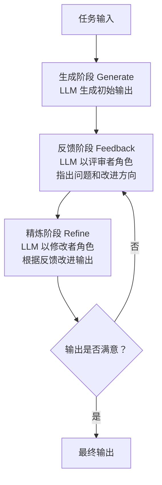
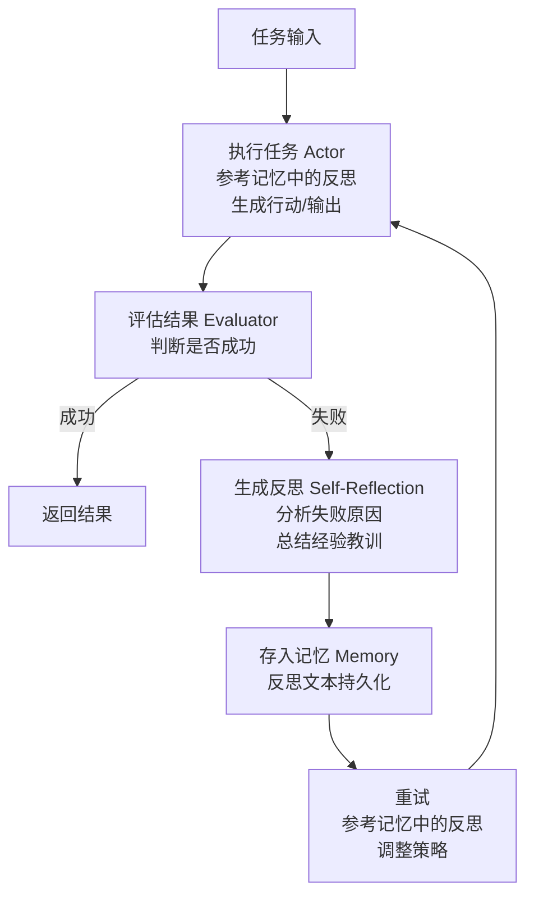
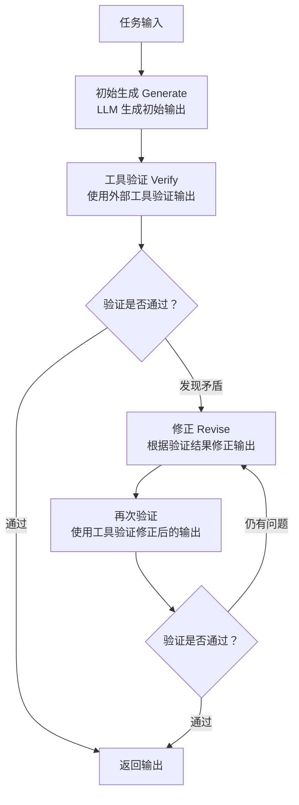
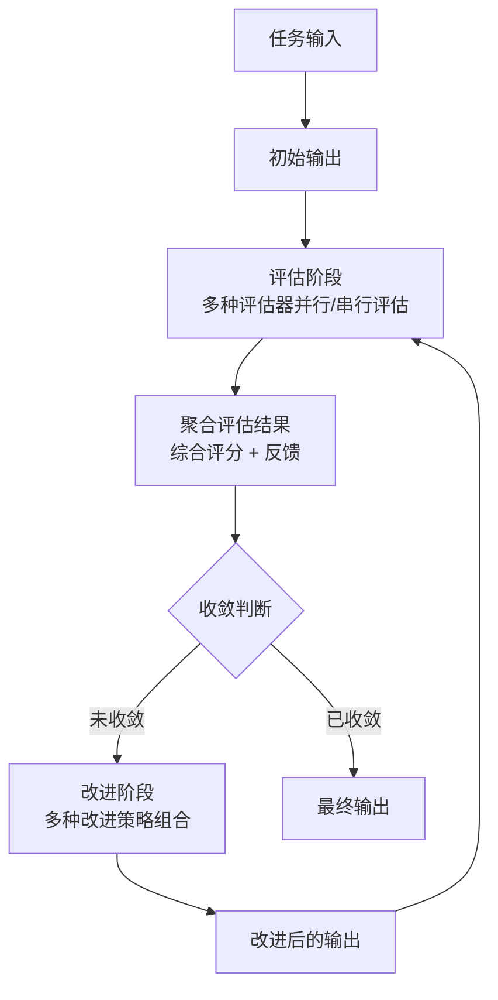

# 九、自我纠错与迭代改进类 Agent 设计模式

自我纠错与迭代改进类设计模式是让大语言模型（LLM）在生成输出后，通过自我审视、外部验证或记忆反思等机制发现不足并持续改进的方法论。这类模式的核心思想是：**一次生成往往不够完美，但通过结构化的反馈-修正循环，模型可以逐步逼近更高质量的输出**。

本章涵盖以下 4 种自我纠错与迭代改进模式：

| 序号 | 模式 | 核心要点 |
|------|------|----------|
| 9.1 | Self-Refine | 生成→反馈→精炼的迭代循环自我改进 |
| 9.2 | Reflexion | 失败后生成自然语言反思，存入记忆指导未来决策 |
| 9.3 | CRITIC | 使用外部工具验证LLM输出并纠正 |
| 9.4 | Iterative Refinement | 通用迭代优化框架，支持多种评估和改进策略组合 |

---

## 9.1 Self-Refine — 自我迭代精炼

### 概念说明

**Self-Refine（自我迭代精炼）**由 Madaan et al. 2023 提出，其核心思想是：**让同一个模型通过"生成→反馈→精炼"的迭代循环自我改进输出，无需外部模型或人工干预**。

在传统的单次生成中，模型直接输出结果，质量完全取决于首次生成的水平。而 Self-Refine 让模型在生成初始输出后，切换到"评审者"角色给出反馈，再切换到"修改者"角色进行精炼，如此循环直到满足质量标准或达到最大迭代次数。

Self-Refine 的关键创新在于：**同一个模型扮演三个不同角色——生成者、评审者和修改者**，通过精心设计的 prompt 切换角色，实现无需额外训练的自我改进。

**类比理解**：就像一位作家写文章——先写初稿（生成），再以读者视角审阅找出问题（反馈），然后修改润色（精炼），反复打磨直到满意。

### 核心流程/原理



**关键步骤**：
1. **生成（Generate）**：模型根据任务要求生成初始输出
2. **反馈（Feedback）**：模型以评审者角色审视输出，指出具体问题和改进建议
3. **精炼（Refine）**：模型根据反馈修改输出，生成改进版本
4. **终止判断**：当反馈为空（无改进空间）或达到最大迭代次数时停止

### 完整 Python 示例代码

#### 环境配置与客户端初始化

```python
"""
Self-Refine 自我迭代精炼
通过"生成→反馈→精炼"的迭代循环自我改进输出
"""

import os
from openai import OpenAI

client = OpenAI(
    api_key=os.environ.get("OPENAI_API_KEY", "your-api-key-here"),
    base_url=os.environ.get("OPENAI_BASE_URL", None),
)
```

#### SelfRefineAgent 类定义

```python
class SelfRefineAgent:
    """Self-Refine 自我迭代精炼Agent"""

    def __init__(self, model: str = "gpt-4o", max_iterations: int = 3):
        self.model = model
        self.max_iterations = max_iterations
        self.history: list[dict] = []

    def _call_llm(self, system_prompt: str, user_message: str,
                  temperature: float = 0.7) -> str:
        response = client.chat.completions.create(
            model=self.model,
            messages=[
                {"role": "system", "content": system_prompt},
                {"role": "user", "content": user_message},
            ],
            temperature=temperature,
        )
        return response.choices[0].message.content.strip()
```

#### 生成方法

```python
    def generate(self, task: str, task_type: str = "general") -> str:
        """生成阶段：根据任务生成初始输出"""
        system_prompts = {
            "writing": "你是一位资深作家，请根据要求撰写文章。输出文章正文即可。",
            "code": "你是一位高级软件工程师，请根据要求编写代码。只输出代码，不要解释。",
            "translation": "你是一位专业翻译，请将文本翻译为目标语言。只输出翻译结果。",
            "general": "你是一位AI助手，请根据要求完成任务。",
        }
        system_prompt = system_prompts.get(task_type, system_prompts["general"])

        result = self._call_llm(system_prompt, task, temperature=0.7)
        self.history.append({"stage": "generate", "content": result})
        return result
```

#### 反馈方法

```python
    def feedback(self, task: str, current_output: str,
                 task_type: str = "general") -> str:
        """反馈阶段：以评审者角色审视输出，指出问题"""
        feedback_prompts = {
            "writing": (
                "你是一位严格的文学编辑。请审阅以下文章，指出以下方面的问题：\n"
                "1. 逻辑连贯性：段落之间是否衔接自然\n"
                "2. 表达清晰度：是否有含糊或歧义的表述\n"
                "3. 内容深度：是否有需要展开或补充的地方\n"
                "4. 语言质量：是否有语法错误或用词不当\n\n"
                "如果没有问题，请回复'无需改进'。否则请列出具体问题和改进建议。"
            ),
            "code": (
                "你是一位代码审查专家。请审查以下代码，检查：\n"
                "1. 正确性：逻辑是否正确，是否有bug\n"
                "2. 效率：是否有性能问题或可优化的地方\n"
                "3. 可读性：命名是否清晰，结构是否合理\n"
                "4. 健壮性：是否有边界条件未处理\n\n"
                "如果没有问题，请回复'无需改进'。否则请列出具体问题和改进建议。"
            ),
            "translation": (
                "你是一位翻译质量审核员。请审查以下翻译，检查：\n"
                "1. 准确性：是否忠实于原文含义\n"
                "2. 流畅性：是否符合目标语言的表达习惯\n"
                "3. 术语一致性：专业术语翻译是否统一\n\n"
                "如果没有问题，请回复'无需改进'。否则请列出具体问题和改进建议。"
            ),
            "general": (
                "你是一位质量审查员。请审查以下输出，检查：\n"
                "1. 完整性：是否完整回答了任务要求\n"
                "2. 准确性：是否存在事实错误\n"
                "3. 清晰性：表达是否清晰易懂\n\n"
                "如果没有问题，请回复'无需改进'。否则请列出具体问题和改进建议。"
            ),
        }
        system_prompt = feedback_prompts.get(task_type, feedback_prompts["general"])

        user_message = f"原始任务：{task}\n\n当前输出：\n{current_output}"
        result = self._call_llm(system_prompt, user_message, temperature=0.3)
        self.history.append({"stage": "feedback", "content": result})
        return result
```

#### 精炼方法

```python
    def refine(self, task: str, current_output: str,
               feedback_text: str, task_type: str = "general") -> str:
        """精炼阶段：根据反馈改进输出"""
        refine_prompts = {
            "writing": "你是一位作家。请根据编辑的反馈意见修改你的文章，输出修改后的完整文章。",
            "code": "你是一位软件工程师。请根据代码审查意见修改代码，输出修改后的完整代码。",
            "translation": "你是一位翻译。请根据审核意见修改翻译，输出修改后的完整翻译。",
            "general": "请根据反馈意见修改你的输出，输出修改后的完整内容。",
        }
        system_prompt = refine_prompts.get(task_type, refine_prompts["general"])

        user_message = (
            f"原始任务：{task}\n\n"
            f"当前输出：\n{current_output}\n\n"
            f"反馈意见：\n{feedback_text}\n\n"
            f"请根据反馈意见修改输出。"
        )
        result = self._call_llm(system_prompt, user_message, temperature=0.5)
        self.history.append({"stage": "refine", "content": result})
        return result
```

#### 主流程方法

```python
    def run(self, task: str, task_type: str = "general") -> dict:
        """
        Self-Refine 主流程：生成 → 反馈 → 精炼（循环）

        参数:
            task: 任务描述
            task_type: 任务类型（writing/code/translation/general）

        返回:
            dict: 包含最终输出、迭代次数和完整历史的字典
        """
        self.history = []

        print(f"{'='*60}")
        print(f"任务: {task[:80]}...")
        print(f"类型: {task_type}")
        print(f"{'='*60}")

        current_output = self.generate(task, task_type)
        print(f"\n[初始生成] {current_output[:100]}...")

        for iteration in range(1, self.max_iterations + 1):
            print(f"\n--- 第 {iteration} 轮迭代 ---")

            feedback_text = self.feedback(task, current_output, task_type)
            print(f"[反馈] {feedback_text[:150]}...")

            if "无需改进" in feedback_text or "没有问题" in feedback_text:
                print(f"✅ 输出已满足要求，迭代终止")
                return {
                    "final_output": current_output,
                    "iterations": iteration,
                    "converged": True,
                    "history": self.history,
                }

            current_output = self.refine(task, current_output, feedback_text, task_type)
            print(f"[精炼] {current_output[:100]}...")

        print(f"\n⚠️ 达到最大迭代次数 {self.max_iterations}，迭代终止")
        return {
            "final_output": current_output,
            "iterations": self.max_iterations,
            "converged": False,
            "history": self.history,
        }
```

#### 主流程与演示

```python
if __name__ == "__main__":
    agent = SelfRefineAgent(model="gpt-4o", max_iterations=3)

    # 示例1: 文章写作精炼
    print("\n" + "=" * 60)
    print("示例1: 文章写作精炼")
    print("=" * 60)

    writing_task = "请写一段200字左右的短文，主题是'人工智能对教育的影响'，要求观点客观、论证有力。"
    result1 = agent.run(writing_task, task_type="writing")
    print(f"\n最终输出:\n{result1['final_output']}")
    print(f"迭代次数: {result1['iterations']}, 是否收敛: {result1['converged']}")

    # 示例2: 代码优化
    print("\n" + "=" * 60)
    print("示例2: 代码优化")
    print("=" * 60)

    code_task = "请用Python实现一个函数，输入一个整数列表，返回其中第二大的数。如果列表少于2个元素则返回None。"
    result2 = agent.run(code_task, task_type="code")
    print(f"\n最终输出:\n{result2['final_output']}")
    print(f"迭代次数: {result2['iterations']}, 是否收敛: {result2['converged']}")

    # 示例3: 翻译改进
    print("\n" + "=" * 60)
    print("示例3: 翻译改进")
    print("=" * 60)

    translation_task = (
        "请将以下英文翻译为中文：\n"
        "'The rapid advancement of artificial intelligence has sparked "
        "both excitement and concern among educators worldwide, as they "
        "grapple with its potential to transform traditional learning paradigms.'"
    )
    result3 = agent.run(translation_task, task_type="translation")
    print(f"\n最终输出:\n{result3['final_output']}")
    print(f"迭代次数: {result3['iterations']}, 是否收敛: {result3['converged']}")
```

**代码要点说明**：
- `generate`、`feedback`、`refine` 三个核心方法分别对应 Self-Refine 的三个阶段
- 每个方法根据 `task_type` 使用不同的 system_prompt，确保评审和修改的视角与任务类型匹配
- 反馈阶段使用较低的 `temperature=0.3`，确保评审意见的客观性和一致性
- 精炼阶段使用中等的 `temperature=0.5`，在遵循反馈的同时保留一定的创造性
- 终止条件：反馈中包含"无需改进"或"没有问题"时提前终止，避免无效迭代

---

## 9.2 Reflexion — 基于自然语言反思的Agent

### 概念说明

**Reflexion（反思）**由 Shinn et al. 2023 提出，其核心思想是：**当 Agent 执行任务失败后，生成自然语言的反思（Reflection），将反思存入记忆，在后续重试时参考历史反思来避免重复犯错**。

与 Self-Refine 的区别在于：Reflexion 的核心不是在同一轮内迭代改进，而是**跨轮次的学习**——每次失败后的反思被持久化存储，成为 Agent 的"经验"，在未来的尝试中指导决策。这种机制类似于人类从错误中学习的过程：我们不会在同一个地方跌倒两次，因为我们会记住失败的原因。

Reflexion 的关键组件：
1. **执行器（Actor）**：根据当前状态和记忆生成行动
2. **评估器（Evaluator）**：判断执行结果是否成功
3. **反思生成器（Self-Reflection）**：在失败时生成自然语言反思
4. **记忆（Memory）**：存储历史反思，供后续决策参考

**类比理解**：就像一个学生做错题后写"错题本"——记录错误原因和正确思路，下次遇到类似题目时先翻阅错题本，避免再犯同样的错误。

### 核心流程/原理



**关键机制**：
1. **反思是自然语言的**：不是数值化的奖励信号，而是可读的文本描述，便于理解和调试
2. **记忆是跨轮次的**：每次尝试的反思都会累积，形成越来越丰富的经验库
3. **反思指导行动**：在新的尝试中，Agent 会检索相关的历史反思，作为决策的额外上下文

### 完整 Python 示例代码

#### 环境配置与数据结构

```python
"""
Reflexion 基于自然语言反思的Agent
失败后生成反思 → 存入记忆 → 重试时参考反思
"""

import os
from dataclasses import dataclass, field
from datetime import datetime
from openai import OpenAI

client = OpenAI(
    api_key=os.environ.get("OPENAI_API_KEY", "your-api-key-here"),
    base_url=os.environ.get("OPENAI_BASE_URL", None),
)


@dataclass
class Reflection:
    """反思记录"""
    task: str
    attempt: int
    action_taken: str
    failure_reason: str
    reflection_text: str
    timestamp: str = field(default_factory=lambda: datetime.now().isoformat())


@dataclass
class AttemptResult:
    """尝试结果"""
    attempt: int
    output: str
    success: bool
    evaluation_feedback: str
    reflection: Reflection | None = None
```

#### ReflexionAgent 类定义

```python
class ReflexionAgent:
    """Reflexion 基于自然语言反思的Agent"""

    def __init__(self, model: str = "gpt-4o", max_attempts: int = 4):
        self.model = model
        self.max_attempts = max_attempts
        self.memory: list[Reflection] = []
        self.attempt_history: list[AttemptResult] = []

    def _call_llm(self, system_prompt: str, user_message: str,
                  temperature: float = 0.7) -> str:
        response = client.chat.completions.create(
            model=self.model,
            messages=[
                {"role": "system", "content": system_prompt},
                {"role": "user", "content": user_message},
            ],
            temperature=temperature,
        )
        return response.choices[0].message.content.strip()
```

#### 执行方法

```python
    def execute(self, task: str) -> str:
        """执行阶段：参考记忆中的反思，生成行动/输出"""
        system_prompt = """你是一位AI编程助手。请根据任务要求编写Python代码来解决问题。
代码应该完整、可运行，并使用print()输出最终答案。
只输出Python代码，不要包含其他解释。"""

        memory_context = self._build_memory_context(task)

        user_message = f"任务：{task}"
        if memory_context:
            user_message += (
                f"\n\n## 历史反思（请参考这些经验避免重复犯错）\n{memory_context}"
            )

        return self._call_llm(system_prompt, user_message, temperature=0.3)
```

#### 评估方法

```python
    def evaluate(self, task: str, output: str) -> dict:
        """评估阶段：判断执行结果是否正确"""
        system_prompt = """你是一位代码评估专家。请评估以下Python代码是否能正确解决给定任务。

评估标准：
1. 代码逻辑是否正确
2. 是否处理了边界情况
3. 输出格式是否符合要求

请以JSON格式返回评估结果：
{
    "success": true/false,
    "feedback": "评估反馈（说明正确或错误的原因）",
    "error_type": "逻辑错误" | "边界遗漏" | "格式错误" | "无错误"
}

只输出JSON，不要包含其他内容。"""

        user_message = f"任务：{task}\n\n代码：\npython\n{output}\n```"
        result = self._call_llm(system_prompt, user_message, temperature=0.0)

        import json
        try:
            if "```" in result:
                result = result.split("```")[1]
                if result.startswith("json"):
                    result = result[4:]
            return json.loads(result.strip())
        except json.JSONDecodeError:
            return {
                "success": False,
                "feedback": result,
                "error_type": "评估解析失败",
            }
```

#### 反思生成方法

```python
    def generate_reflection(self, task: str, action_taken: str,
                            evaluation_feedback: str) -> str:
        """反思生成阶段：分析失败原因，总结经验教训"""
        system_prompt = """你是一位善于反思和总结的AI。当你的尝试失败时，你会深入分析失败原因，
并生成具体的、可操作的反思，帮助你在下次尝试中避免同样的错误。

反思应该包含：
1. 失败的根本原因分析
2. 具体的改进策略
3. 需要注意的陷阱

请直接输出反思内容，不要包含多余的格式。"""

        memory_context = self._build_memory_context(task)

        user_message = (
            f"任务：{task}\n\n"
            f"我之前的尝试：\n{action_taken}\n\n"
            f"评估反馈：{evaluation_feedback}\n"
        )
        if memory_context:
            user_message += f"\n之前的反思经验：\n{memory_context}\n"

        user_message += "\n请分析失败原因并生成反思。"

        return self._call_llm(system_prompt, user_message, temperature=0.5)
```

#### 记忆检索方法

```python
    def _build_memory_context(self, task: str, max_reflections: int = 3) -> str:
        """构建记忆上下文：检索与当前任务相关的历史反思"""
        if not self.memory:
            return ""

        recent_reflections = self.memory[-max_reflections:]

        context_parts = []
        for i, ref in enumerate(recent_reflections, 1):
            context_parts.append(
                f"反思 {i}（第{ref.attempt}次尝试后）：\n"
                f"  失败原因：{ref.failure_reason}\n"
                f"  反思内容：{ref.reflection_text}\n"
            )

        return "\n".join(context_parts)
```

#### 主流程方法

```python
    def run(self, task: str) -> dict:
        """
        Reflexion 主流程：执行 → 评估 → 反思 → 重试

        参数:
            task: 任务描述

        返回:
            dict: 包含最终结果、尝试次数、反思历史和是否成功的字典
        """
        self.attempt_history = []

        print(f"{'='*60}")
        print(f"任务: {task[:80]}...")
        print(f"最大尝试次数: {self.max_attempts}")
        print(f"{'='*60}")

        for attempt in range(1, self.max_attempts + 1):
            print(f"\n{'='*40}")
            print(f"第 {attempt} 次尝试")
            print(f"{'='*40}")

            if self.memory:
                print(f"  [记忆] 已有 {len(self.memory)} 条反思经验")

            output = self.execute(task)
            print(f"  [执行] 输出: {output[:100]}...")

            eval_result = self.evaluate(task, output)
            success = eval_result.get("success", False)
            feedback = eval_result.get("feedback", "")
            print(f"  [评估] {'✅ 成功' if success else '❌ 失败'}: {feedback[:80]}...")

            if success:
                attempt_result = AttemptResult(
                    attempt=attempt,
                    output=output,
                    success=True,
                    evaluation_feedback=feedback,
                )
                self.attempt_history.append(attempt_result)
                print(f"\n🎉 任务完成！共尝试 {attempt} 次")
                return {
                    "final_output": output,
                    "attempts": attempt,
                    "success": True,
                    "reflections": self.memory,
                    "attempt_history": self.attempt_history,
                }

            reflection_text = self.generate_reflection(task, output, feedback)
            print(f"  [反思] {reflection_text[:100]}...")

            reflection = Reflection(
                task=task,
                attempt=attempt,
                action_taken=output,
                failure_reason=feedback,
                reflection_text=reflection_text,
            )
            self.memory.append(reflection)

            attempt_result = AttemptResult(
                attempt=attempt,
                output=output,
                success=False,
                evaluation_feedback=feedback,
                reflection=reflection,
            )
            self.attempt_history.append(attempt_result)

        print(f"\n⚠️ 达到最大尝试次数 {self.max_attempts}，任务未完成")
        last_output = self.attempt_history[-1].output if self.attempt_history else ""
        return {
            "final_output": last_output,
            "attempts": self.max_attempts,
            "success": False,
            "reflections": self.memory,
            "attempt_history": self.attempt_history,
        }
```

#### 主流程与演示

```python
if __name__ == "__main__":
    agent = ReflexionAgent(model="gpt-4o", max_attempts=4)

    # 示例: 编程任务（多次尝试，每次从反思中学习）
    task = (
        "编写一个Python函数，判断一个字符串是否是有效的回文。"
        "要求：只考虑字母和数字字符，忽略大小写。"
        "例如 'A man, a plan, a canal: Panama' 是回文。"
        "请输出函数定义和测试用例。"
    )

    result = agent.run(task)

    print(f"\n{'='*60}")
    print("最终结果")
    print(f"{'='*60}")
    print(f"成功: {'✅' if result['success'] else '❌'}")
    print(f"尝试次数: {result['attempts']}")
    print(f"反思数量: {len(result['reflections'])}")
    print(f"\n最终输出:\n{result['final_output']}")

    if result["reflections"]:
        print(f"\n{'='*60}")
        print("反思历程")
        print(f"{'='*60}")
        for ref in result["reflections"]:
            print(f"\n  第{ref.attempt}次尝试后的反思:")
            print(f"    失败原因: {ref.failure_reason[:80]}...")
            print(f"    反思内容: {ref.reflection_text[:100]}...")
```

**代码要点说明**：
- `memory` 列表持久化存储所有反思记录，跨轮次累积经验
- `execute` 方法在生成行动前会检索相关历史反思，作为额外上下文注入 prompt
- `evaluate` 方法使用 `temperature=0.0` 确保评估结果的一致性
- `generate_reflection` 不仅分析当前失败，还参考之前的反思，避免反思内容重复
- `_build_memory_context` 只检索最近 `max_reflections` 条反思，避免上下文过长

---

## 9.3 CRITIC — 外部工具验证纠错

### 概念说明

**CRITIC（基于外部工具验证纠错）**由 Gou et al. 2023 提出，其核心思想是：**使用外部工具（搜索引擎、代码执行器、知识库等）验证 LLM 的输出，发现矛盾后进行修正，再验证修正结果**。

与 Self-Refine 依赖模型自身反馈不同，CRITIC 引入了**外部真实世界的反馈信号**。模型自身的反馈可能存在"自我确认偏差"——即模型倾向于认为自己的输出是正确的。而外部工具提供了客观的、基于事实的验证，能够有效打破这种偏差。

CRITIC 的典型工具包括：
- **搜索引擎**：验证事实性陈述是否准确
- **代码执行器**：验证代码是否能正确运行
- **知识库/数据库**：验证特定领域知识的准确性
- **API 调用**：验证实时数据的正确性

**类比理解**：就像学生做完题后不自己检查（可能看不出自己的错误），而是用计算器验算（代码执行器）或查阅课本（搜索引擎）来确认答案是否正确。

### 核心流程/原理



**关键步骤**：
1. **初始生成**：LLM 正常生成输出（可能包含事实错误或代码bug）
2. **工具验证**：将输出中的关键声明提交给外部工具验证
3. **矛盾检测**：比较工具返回的结果与 LLM 输出，发现不一致之处
4. **修正输出**：根据验证结果修正 LLM 输出中的错误
5. **再次验证**：对修正后的输出重复验证，直到通过或达到最大迭代次数

### 完整 Python 示例代码

#### 环境配置与客户端初始化

```python
"""
CRITIC 外部工具验证纠错
使用外部工具验证LLM输出并纠正
"""

import os
import re
import io
import sys
import json
from dataclasses import dataclass, field
from typing import Optional
from openai import OpenAI

client = OpenAI(
    api_key=os.environ.get("OPENAI_API_KEY", "your-api-key-here"),
    base_url=os.environ.get("OPENAI_BASE_URL", None),
)


@dataclass
class VerificationResult:
    """验证结果"""
    tool_name: str
    passed: bool
    original_claim: str
    tool_output: str
    contradiction: str
    suggestion: str
```

#### CRITICAgent 类定义

```python
class CRITICAgent:
    """CRITIC 外部工具验证纠错Agent"""

    def __init__(self, model: str = "gpt-4o", max_iterations: int = 3):
        self.model = model
        self.max_iterations = max_iterations
        self.verification_history: list[VerificationResult] = []

    def _call_llm(self, system_prompt: str, user_message: str,
                  temperature: float = 0.7) -> str:
        response = client.chat.completions.create(
            model=self.model,
            messages=[
                {"role": "system", "content": system_prompt},
                {"role": "user", "content": user_message},
            ],
            temperature=temperature,
        )
        return response.choices[0].message.content.strip()
```

#### 生成方法

```python
    def generate(self, task: str, task_type: str = "qa") -> str:
        """初始生成阶段：LLM 生成初始输出"""
        system_prompts = {
            "qa": "你是一位知识渊博的AI助手。请准确回答问题。如果不确定，请说明。",
            "code": "你是一位高级软件工程师。请编写Python代码解决问题。代码放在python```代码块中。",
        }
        system_prompt = system_prompts.get(task_type, system_prompts["qa"])
        return self._call_llm(system_prompt, task, temperature=0.5)
```

#### 工具验证方法

```python
    def verify_with_tool(self, task: str, output: str,
                         task_type: str = "qa") -> list[VerificationResult]:
        """工具验证阶段：使用外部工具验证输出"""
        if task_type == "qa":
            return self._verify_with_search(task, output)
        elif task_type == "code":
            return self._verify_with_executor(task, output)
        return []

    def _verify_with_search(self, task: str, output: str) -> list[VerificationResult]:
        """使用搜索引擎验证事实性输出"""
        system_prompt = """你是一个事实核查助手。请从AI的输出中提取可验证的事实性声明，
然后使用你的知识库来验证这些声明。

对于每个声明，请判断：
1. 该声明是否可验证
2. 如果可验证，该声明是否正确

请以JSON格式返回验证结果：
{
    "claims": [
        {
            "claim": "提取的声明",
            "verifiable": true/false,
            "correct": true/false,
            "evidence": "验证依据",
            "contradiction": "矛盾之处（如果存在）",
            "suggestion": "修正建议（如果需要）"
        }
    ]
}

只输出JSON。"""

        user_message = f"问题：{task}\n\nAI输出：{output}"
        result = self._call_llm(system_prompt, user_message, temperature=0.0)

        try:
            if "```" in result:
                result = result.split("```")[1]
                if result.startswith("json"):
                    result = result[4:]
            data = json.loads(result.strip())
        except json.JSONDecodeError:
            return [VerificationResult(
                tool_name="search",
                passed=True,
                original_claim="解析验证结果失败",
                tool_output=result,
                contradiction="",
                suggestion="",
            )]

        verification_results = []
        for claim in data.get("claims", []):
            vr = VerificationResult(
                tool_name="search",
                passed=claim.get("correct", True),
                original_claim=claim.get("claim", ""),
                tool_output=claim.get("evidence", ""),
                contradiction=claim.get("contradiction", ""),
                suggestion=claim.get("suggestion", ""),
            )
            verification_results.append(vr)
            self.verification_history.append(vr)

        return verification_results

    def _verify_with_executor(self, task: str, output: str) -> list[VerificationResult]:
        """使用代码执行器验证代码输出"""
        code = self._extract_code(output)
        if not code:
            return [VerificationResult(
                tool_name="executor",
                passed=False,
                original_claim="未找到代码块",
                tool_output="",
                contradiction="输出中未包含可执行的代码块",
                suggestion="请确保代码放在```python```代码块中",
            )]

        execution_result = self._execute_code(code)
        passed = not execution_result.startswith("[错误]")

        vr = VerificationResult(
            tool_name="executor",
            passed=passed,
            original_claim=code[:200],
            tool_output=execution_result[:500],
            contradiction="" if passed else execution_result,
            suggestion="" if passed else "请根据执行错误信息修正代码",
        )
        self.verification_history.append(vr)
        return [vr]
```

#### 辅助方法

```python
    @staticmethod
    def _extract_code(output: str) -> str:
        """从LLM输出中提取Python代码"""
        pattern = r"python\s*\n(.*?)```"
    matches = re.findall(pattern, output, re.DOTALL)
    if matches:
        return "\n\n".join(matches)
    pattern = r"```\s*\n(.*?)```"
    matches = re.findall(pattern, output, re.DOTALL)
    if matches:
        return "\n\n".join(matches)
    return ""

@staticmethod
def _execute_code(code: str) -> str:
    """安全执行Python代码并捕获输出"""
    stdout_capture = io.StringIO()
    old_stdout = sys.stdout
    sys.stdout = stdout_capture

    local_vars = {}
    try:
        exec(code, {"__builtins__": __builtins__}, local_vars)
        output = stdout_capture.getvalue()
    except Exception as e:
        output = f"[错误] {type(e).__name__}: {e}"
    finally:
        sys.stdout = old_stdout

    return output if output else "代码执行完毕，无输出"
```
```

#### 修正方法

```python
    def revise(self, task: str, output: str,
               verification_results: list[VerificationResult],
               task_type: str = "qa") -> str:
        """修正阶段：根据验证结果修正输出"""
        failed_verifications = [vr for vr in verification_results if not vr.passed]
        if not failed_verifications:
            return output

        issues_text = ""
        for i, vr in enumerate(failed_verifications, 1):
            issues_text += (
                f"\n问题 {i}:\n"
                f"  原始声明: {vr.original_claim}\n"
                f"  工具验证结果: {vr.tool_output}\n"
                f"  矛盾之处: {vr.contradiction}\n"
                f"  修正建议: {vr.suggestion}\n"
            )

        system_prompt = (
            "你是一位纠错专家。请根据外部工具的验证结果修正输出中的错误。"
            "只输出修正后的内容，不要包含解释说明。"
        )

        user_message = (
            f"原始任务：{task}\n\n"
            f"当前输出：\n{output}\n\n"
            f"外部工具验证发现以下问题：{issues_text}\n"
            f"请修正输出中的错误。"
        )

        return self._call_llm(system_prompt, user_message, temperature=0.3)
```

#### 主流程方法

```python
    def run(self, task: str, task_type: str = "qa") -> dict:
        """
        CRITIC 主流程：生成 → 工具验证 → 修正（循环）

        参数:
            task: 任务描述
            task_type: 任务类型（qa/code）

        返回:
            dict: 包含最终输出、验证历史和迭代次数的字典
        """
        self.verification_history = []

        print(f"{'='*60}")
        print(f"任务: {task[:80]}...")
        print(f"类型: {task_type}")
        print(f"{'='*60}")

        current_output = self.generate(task, task_type)
        print(f"\n[初始生成] {current_output[:150]}...")

        for iteration in range(1, self.max_iterations + 1):
            print(f"\n--- 第 {iteration} 轮验证 ---")

            verification_results = self.verify_with_tool(task, current_output, task_type)

            all_passed = all(vr.passed for vr in verification_results)
            failed_count = sum(1 for vr in verification_results if not vr.passed)

            for vr in verification_results:
                status = "✅ 通过" if vr.passed else "❌ 不通过"
                print(f"  [{vr.tool_name}] {status}: {vr.original_claim[:60]}...")
                if not vr.passed:
                    print(f"    矛盾: {vr.contradiction[:80]}...")

            if all_passed:
                print(f"\n✅ 所有验证通过，迭代终止")
                return {
                    "final_output": current_output,
                    "iterations": iteration,
                    "all_verified": True,
                    "verification_history": self.verification_history,
                }

            print(f"  发现 {failed_count} 个问题，开始修正...")
            current_output = self.revise(task, current_output, verification_results, task_type)
            print(f"  [修正] {current_output[:150]}...")

        print(f"\n⚠️ 达到最大迭代次数 {self.max_iterations}")
        return {
            "final_output": current_output,
            "iterations": self.max_iterations,
            "all_verified": False,
            "verification_history": self.verification_history,
        }
```

#### 主流程与演示

```python
if __name__ == "__main__":
    agent = CRITICAgent(model="gpt-4o", max_iterations=3)

    # 示例1: 事实性问答（用搜索验证）
    print("\n" + "=" * 60)
    print("示例1: 事实性问答（搜索验证）")
    print("=" * 60)

    qa_task = "请简要介绍量子计算的发展历程，包括关键里程碑和重要人物。"
    result1 = agent.run(qa_task, task_type="qa")
    print(f"\n最终输出:\n{result1['final_output']}")
    print(f"迭代次数: {result1['iterations']}, 验证通过: {result1['all_verified']}")

    # 示例2: 代码生成（用执行器验证）
    print("\n" + "=" * 60)
    print("示例2: 代码生成（执行器验证）")
    print("=" * 60)

    code_task = (
        "编写一个Python函数，实现二分查找算法。"
        "函数签名：def binary_search(arr: list, target: int) -> int"
        "如果找到返回索引，否则返回-1。"
        "请包含测试用例。"
    )
    result2 = agent.run(code_task, task_type="code")
    print(f"\n最终输出:\n{result2['final_output']}")
    print(f"迭代次数: {result2['iterations']}, 验证通过: {result2['all_verified']}")
```

**代码要点说明**：
- `verify_with_tool` 根据任务类型选择不同的验证工具：`qa` 用搜索验证，`code` 用执行器验证
- `_verify_with_search` 利用 LLM 自身作为"知识库"模拟搜索验证（生产环境中可替换为真实搜索 API）
- `_verify_with_executor` 使用 `exec()` 实际执行代码，捕获运行时错误作为验证反馈
- `_extract_code` 从 LLM 输出中提取代码块，支持多种 markdown 代码块格式
- `revise` 方法只关注未通过的验证项，避免对已正确内容的无谓修改

---

## 9.4 Iterative Refinement — 通用迭代优化框架

### 概念说明

**Iterative Refinement（通用迭代优化框架）**将自我改进抽象为一个通用的、可扩展的迭代优化框架。与前面三种模式分别聚焦于特定改进机制不同，Iterative Refinement 的核心思想是：**将"评估"和"改进"解耦为可插拔的组件，支持多种评估器和改进器的灵活组合**。

这种设计借鉴了软件工程中的**策略模式（Strategy Pattern）**：
- **评估器（Evaluator）**：负责评估当前输出的质量，返回评分和反馈
- **改进器（Improver）**：负责根据评估反馈改进输出
- **收敛判断器（Convergence Checker）**：判断是否应该停止迭代
- **编排器（Orchestrator）**：协调评估器和改进器的执行流程

通过这种解耦，我们可以轻松组合不同的策略，例如：
- 自评估 + 自我改进（类似 Self-Refine）
- 外部工具验证 + 基于验证修正（类似 CRITIC）
- LLM 评估 + 人工反馈改进
- 多评估器组合 + 多改进器组合

**类比理解**：就像一个可配置的"打磨流水线"——你可以选择不同的"检测仪器"（评估器）和"打磨工具"（改进器），根据产品类型灵活组合，直到产品达到质量标准。

### 核心流程/原理



**关键设计**：
1. **可插拔评估器**：支持自评估、外部工具验证、LLM-as-Judge、人工评分等多种评估方式
2. **可插拔改进器**：支持自我改进、基于工具反馈修正、人工指导改进等多种改进策略
3. **收敛判断**：基于评分变化、最大迭代次数、评分阈值等多种条件判断是否停止
4. **评估结果聚合**：多个评估器的结果可以加权聚合，形成综合评估

### 完整 Python 示例代码

#### 环境配置与抽象接口

```python
"""
Iterative Refinement 通用迭代优化框架
支持可插拔的评估器和改进器的灵活组合
"""

import os
import json
from abc import ABC, abstractmethod
from dataclasses import dataclass, field
from typing import Optional
from openai import OpenAI

client = OpenAI(
    api_key=os.environ.get("OPENAI_API_KEY", "your-api-key-here"),
    base_url=os.environ.get("OPENAI_BASE_URL", None),
)


@dataclass
class EvaluationResult:
    """评估结果"""
    evaluator_name: str
    score: float
    feedback: str
    passed: bool
    details: dict = field(default_factory=dict)


@dataclass
class ImprovementResult:
    """改进结果"""
    improver_name: str
    improved_output: str
    changes_summary: str


class BaseEvaluator(ABC):
    """评估器抽象基类"""

    @abstractmethod
    def evaluate(self, task: str, output: str) -> EvaluationResult:
        pass


class BaseImprover(ABC):
    """改进器抽象基类"""

    @abstractmethod
    def improve(self, task: str, output: str,
                evaluation_results: list[EvaluationResult]) -> str:
        pass
```

#### 具体评估器实现

```python
class SelfEvaluator(BaseEvaluator):
    """自评估器：LLM自我评估输出质量"""

    def __init__(self, model: str = "gpt-4o", criteria: str = ""):
        self.model = model
        self.criteria = criteria or (
            "1. 完整性：是否完整回答了任务\n"
            "2. 准确性：是否存在事实错误\n"
            "3. 清晰性：表达是否清晰\n"
            "4. 专业性：内容是否专业深入"
        )

    def evaluate(self, task: str, output: str) -> EvaluationResult:
        system_prompt = f"""你是一位严格的质量评估员。请评估以下输出质量。

评估标准：
{self.criteria}

请以JSON格式返回：
{{
    "score": 评分(1-10的整数),
    "feedback": "具体反馈和改进建议",
    "passed": true/false（7分及以上为通过）
}}

只输出JSON。"""

        user_message = f"任务：{task}\n\n输出：\n{output}"
        response = client.chat.completions.create(
            model=self.model,
            messages=[
                {"role": "system", "content": system_prompt},
                {"role": "user", "content": user_message},
            ],
            temperature=0.0,
        )
        result_text = response.choices[0].message.content.strip()

        try:
            if "```" in result_text:
                result_text = result_text.split("```")[1]
                if result_text.startswith("json"):
                    result_text = result_text[4:]
            data = json.loads(result_text.strip())
            return EvaluationResult(
                evaluator_name="SelfEvaluator",
                score=float(data.get("score", 5)),
                feedback=data.get("feedback", ""),
                passed=data.get("passed", False),
            )
        except json.JSONDecodeError:
            return EvaluationResult(
                evaluator_name="SelfEvaluator",
                score=5.0,
                feedback=result_text,
                passed=False,
            )
```

``````python
class LLMJudgeEvaluator(BaseEvaluator):
    """LLM裁判评估器：使用不同prompt的LLM作为裁判"""

    def __init__(self, model: str = "gpt-4o", judge_criteria: str = ""):
        self.model = model
        self.judge_criteria = judge_criteria or "准确性、有用性、安全性"

    def evaluate(self, task: str, output: str) -> EvaluationResult:
        system_prompt = f"""你是一位公正的裁判。请从{self.judge_criteria}角度评估以下输出。

请以JSON格式返回：
{{
```json
"score": 评分(1-10的整数),
"feedback": "评估意见",
"passed": true/false（7分及以上为通过）
```
}}

只输出JSON。"""

        user_message = f"任务：{task}\n\n输出：\n{output}"
        response = client.chat.completions.create(
            model=self.model,
            messages=[
                {"role": "system", "content": system_prompt},
                {"role": "user", "content": user_message},
            ],
            temperature=0.0,
        )
        result_text = response.choices[0].message.content.strip()

        try:
            if "```" in result_text:
                result_text = result_text.split("```")[1]
                if result_text.startswith("json"):
                    result_text = result_text[4:]
            data = json.loads(result_text.strip())
            return EvaluationResult(
                evaluator_name="LLMJudgeEvaluator",
                score=float(data.get("score", 5)),
                feedback=data.get("feedback", ""),
                passed=data.get("passed", False),
            )
        except json.JSONDecodeError:
            return EvaluationResult(
                evaluator_name="LLMJudgeEvaluator",
                score=5.0,
                feedback=result_text,
                passed=False,
            )
``````

```python
class HumanFeedbackEvaluator(BaseEvaluator):
    """人工反馈评估器：模拟人工评分（实际使用中对接真实人工反馈）"""

    def __init__(self, simulated_score: float = 0.0,
                 simulated_feedback: str = ""):
        self.simulated_score = simulated_score
        self.simulated_feedback = simulated_feedback

    def evaluate(self, task: str, output: str) -> EvaluationResult:
        if self.simulated_score > 0:
            return EvaluationResult(
                evaluator_name="HumanFeedbackEvaluator",
                score=self.simulated_score,
                feedback=self.simulated_feedback or "人工评分",
                passed=self.simulated_score >= 7.0,
            )

        return EvaluationResult(
            evaluator_name="HumanFeedbackEvaluator",
            score=0.0,
            feedback="等待人工评分（未提供模拟分数）",
            passed=False,
        )
```

#### 具体改进器实现

```python
class SelfImprover(BaseImprover):
    """自我改进器：LLM根据评估反馈自我改进"""

    def __init__(self, model: str = "gpt-4o"):
        self.model = model

    def improve(self, task: str, output: str,
                evaluation_results: list[EvaluationResult]) -> str:
        feedback_text = "\n".join(
            f"- [{er.evaluator_name}] 评分: {er.score}/10, 反馈: {er.feedback}"
            for er in evaluation_results
        )

        system_prompt = "你是一位改进专家。请根据评估反馈改进输出。只输出改进后的完整内容。"
        user_message = (
            f"任务：{task}\n\n"
            f"当前输出：\n{output}\n\n"
            f"评估反馈：\n{feedback_text}\n\n"
            f"请根据反馈改进输出。"
        )

        response = client.chat.completions.create(
            model=self.model,
            messages=[
                {"role": "system", "content": system_prompt},
                {"role": "user", "content": user_message},
            ],
            temperature=0.5,
        )
        return response.choices[0].message.content.strip()


class ToolGuidedImprover(BaseImprover):
    """工具引导改进器：基于外部工具反馈改进（模拟）"""

    def __init__(self, model: str = "gpt-4o", tool_feedback: str = ""):
        self.model = model
        self.tool_feedback = tool_feedback

    def improve(self, task: str, output: str,
                evaluation_results: list[EvaluationResult]) -> str:
        feedback_text = "\n".join(
            f"- [{er.evaluator_name}] {er.feedback}"
            for er in evaluation_results
        )

        tool_context = ""
        if self.tool_feedback:
            tool_context = f"\n外部工具反馈：{self.tool_feedback}\n"

        system_prompt = (
            "你是一位改进专家。请根据评估反馈和外部工具信息改进输出。"
            "只输出改进后的完整内容。"
        )
        user_message = (
            f"任务：{task}\n\n"
            f"当前输出：\n{output}\n\n"
            f"评估反馈：\n{feedback_text}"
            f"{tool_context}\n"
            f"请改进输出。"
        )

        response = client.chat.completions.create(
            model=self.model,
            messages=[
                {"role": "system", "content": system_prompt},
                {"role": "user", "content": user_message},
            ],
            temperature=0.3,
        )
        return response.choices[0].message.content.strip()
```

#### IterativeRefinement 框架类

```python
class IterativeRefinement:
    """通用迭代优化框架"""

    def __init__(
        self,
        evaluators: list[BaseEvaluator],
        improver: BaseImprover,
        max_iterations: int = 5,
        score_threshold: float = 7.0,
        convergence_delta: float = 0.3,
        evaluator_weights: list[float] | None = None,
    ):
        self.evaluators = evaluators
        self.improver = improver
        self.max_iterations = max_iterations
        self.score_threshold = score_threshold
        self.convergence_delta = convergence_delta
        self.evaluator_weights = evaluator_weights or [1.0 / len(evaluators)] * len(evaluators)
        self.history: list[dict] = []

    def _generate_initial(self, task: str) -> str:
        """生成初始输出"""
        response = client.chat.completions.create(
            model="gpt-4o",
            messages=[{"role": "user", "content": task}],
            temperature=0.7,
        )
        return response.choices[0].message.content.strip()

    def _evaluate_all(self, task: str, output: str) -> list[EvaluationResult]:
        """运行所有评估器"""
        results = []
        for evaluator in self.evaluators:
            result = evaluator.evaluate(task, output)
            results.append(result)
        return results

    def _compute_weighted_score(self, results: list[EvaluationResult]) -> float:
        """计算加权综合评分"""
        total = 0.0
        for result, weight in zip(results, self.evaluator_weights):
            total += result.score * weight
        return round(total, 2)

    def _check_convergence(self, current_score: float,
                           previous_score: float | None) -> bool:
        """收敛判断"""
        if current_score >= self.score_threshold:
            return True
        if previous_score is not None:
            if abs(current_score - previous_score) < self.convergence_delta:
                return True
        return False

    def run(self, task: str) -> dict:
        """
        迭代优化主流程

        参数:
            task: 任务描述

        返回:
            dict: 包含最终输出、迭代历史和评分趋势的字典
        """
        self.history = []
        score_trend = []

        print(f"{'='*60}")
        print(f"任务: {task[:80]}...")
        print(f"评估器: {[e.__class__.__name__ for e in self.evaluators]}")
        print(f"改进器: {self.improver.__class__.__name__}")
        print(f"评分阈值: {self.score_threshold}")
        print(f"{'='*60}")

        current_output = self._generate_initial(task)
        print(f"\n[初始生成] {current_output[:100]}...")

        previous_score = None

        for iteration in range(1, self.max_iterations + 1):
            print(f"\n{'='*40}")
            print(f"第 {iteration} 轮迭代")
            print(f"{'='*40}")

            eval_results = self._evaluate_all(task, current_output)
            weighted_score = self._compute_weighted_score(eval_results)
            score_trend.append(weighted_score)

            for er in eval_results:
                status = "✅" if er.passed else "❌"
                print(f"  [{er.evaluator_name}] {status} 评分: {er.score}/10")
                print(f"    反馈: {er.feedback[:80]}...")

            print(f"  加权综合评分: {weighted_score}/10")

            iteration_record = {
                "iteration": iteration,
                "output": current_output,
                "eval_results": [
                    {
                        "evaluator": er.evaluator_name,
                        "score": er.score,
                        "feedback": er.feedback,
                        "passed": er.passed,
                    }
                    for er in eval_results
                ],
                "weighted_score": weighted_score,
            }
            self.history.append(iteration_record)

            if self._check_convergence(weighted_score, previous_score):
                if weighted_score >= self.score_threshold:
                    print(f"\n✅ 评分达到阈值 {self.score_threshold}，迭代终止")
                else:
                    print(f"\n⚠️ 评分变化小于 {self.convergence_delta}，已收敛")
                return {
                    "final_output": current_output,
                    "iterations": iteration,
                    "final_score": weighted_score,
                    "converged": True,
                    "score_trend": score_trend,
                    "history": self.history,
                }

            current_output = self.improver.improve(task, current_output, eval_results)
            print(f"  [改进] {current_output[:100]}...")

            previous_score = weighted_score

        print(f"\n⚠️ 达到最大迭代次数 {self.max_iterations}")
        return {
            "final_output": current_output,
            "iterations": self.max_iterations,
            "final_score": score_trend[-1] if score_trend else 0,
            "converged": False,
            "score_trend": score_trend,
            "history": self.history,
        }
```

#### 主流程与演示

```python
if __name__ == "__main__":
    # 示例: 多策略组合优化（自评估 + LLM裁判 + 人工反馈）
    print("=" * 60)
    print("Iterative Refinement 通用迭代优化框架")
    print("=" * 60)

    evaluators = [
        SelfEvaluator(model="gpt-4o"),
        LLMJudgeEvaluator(model="gpt-4o", judge_criteria="准确性、完整性、可读性"),
        HumanFeedbackEvaluator(simulated_score=6.5, simulated_feedback="内容基本正确但深度不足"),
    ]

    improver = SelfImprover(model="gpt-4o")

    framework = IterativeRefinement(
        evaluators=evaluators,
        improver=improver,
        max_iterations=5,
        score_threshold=7.0,
        convergence_delta=0.3,
        evaluator_weights=[0.4, 0.4, 0.2],
    )

    task = "请写一份关于'大语言模型在医疗领域应用'的技术分析报告，要求涵盖现状、挑战和未来展望。"

    result = framework.run(task)

    print(f"\n{'='*60}")
    print("最终结果")
    print(f"{'='*60}")
    print(f"迭代次数: {result['iterations']}")
    print(f"最终评分: {result['final_score']}/10")
    print(f"是否收敛: {'是' if result['converged'] else '否'}")
    print(f"评分趋势: {result['score_trend']}")
    print(f"\n最终输出:\n{result['final_output']}")

    # 示例2: 工具引导改进
    print("\n" + "=" * 60)
    print("示例2: 工具引导改进模式")
    print("=" * 60)

    evaluators_v2 = [
        SelfEvaluator(model="gpt-4o"),
    ]

    improver_v2 = ToolGuidedImprover(
        model="gpt-4o",
        tool_feedback="搜索结果显示：LLM在医疗影像分析中的准确率已达到专家水平（参考Nature 2023论文）",
    )

    framework_v2 = IterativeRefinement(
        evaluators=evaluators_v2,
        improver=improver_v2,
        max_iterations=3,
        score_threshold=7.5,
    )

    task_v2 = "请分析AI在医疗影像诊断中的应用现状和前景。"
    result_v2 = framework_v2.run(task_v2)

    print(f"\n最终评分: {result_v2['final_score']}/10")
    print(f"评分趋势: {result_v2['score_trend']}")
```

**代码要点说明**：
- `BaseEvaluator` 和 `BaseImprover` 抽象基类定义了评估器和改进器的统一接口，实现策略模式
- 三种评估器可灵活组合：`SelfEvaluator`（自评估）、`LLMJudgeEvaluator`（LLM裁判）、`HumanFeedbackEvaluator`（人工反馈）
- 两种改进器：`SelfImprover`（自我改进）和 `ToolGuidedImprover`（工具引导改进）
- `_compute_weighted_score` 支持多评估器加权聚合，不同评估器可以有不同权重
- `_check_convergence` 提供两种收敛判断：评分达到阈值或评分变化趋缓
- `score_trend` 记录每轮评分变化，便于分析优化过程

---

## 总结对比表

| 模式 | 核心机制 | 反馈来源 | 记忆/状态 | 适用场景 | 计算成本 | 收敛保证 |
|------|---------|---------|----------|---------|---------|---------|
| **Self-Refine** | 生成→反馈→精炼循环 | 模型自身（同一LLM） | 无跨轮记忆 | 文章润色、代码优化、翻译改进 | ★★☆ 中 | 无（依赖模型自我判断） |
| **Reflexion** | 失败→反思→记忆→重试 | 模型自身 + 评估器 | 跨轮反思记忆 | 编程任务、决策问题、游戏策略 | ★★★ 高（多轮重试） | 无（但反思累积提升成功率） |
| **CRITIC** | 生成→工具验证→修正 | 外部工具（搜索/执行器） | 无跨轮记忆 | 事实性问答、代码生成 | ★★☆ 中 | 较强（工具提供客观信号） |
| **Iterative Refinement** | 评估→改进→收敛判断 | 可插拔（多种组合） | 可选 | 通用优化、多策略组合 | ★★☆~★★★ 可配置 | 可配置（阈值/收敛条件） |

### 选型建议

1. **单轮内快速改进**（无需跨轮记忆）：优先使用 **Self-Refine**，简单高效，适合写作润色、翻译改进等场景。
2. **需要从失败中学习**（跨轮次经验积累）：选择 **Reflexion**，反思记忆机制能有效避免重复犯错，适合编程任务、策略游戏等需要多次尝试的场景。
3. **需要客观验证**（模型自身反馈不可靠）：选择 **CRITIC**，外部工具提供客观的验证信号，适合事实性问答、代码生成等可验证场景。
4. **需要灵活组合多种策略**：选择 **Iterative Refinement**，可插拔的评估器和改进器支持任意组合，适合复杂的优化需求。

### 组合使用

在实际应用中，这些模式可以互相组合，例如：
- **Self-Refine + CRITIC**：先用 Self-Refine 进行自我改进，再用 CRITIC 的外部工具做最终验证。
- **Reflexion + CRITIC**：Reflexion 的评估器使用 CRITIC 的外部工具验证，反思基于客观的验证结果而非模型自评。
- **Iterative Refinement + Reflexion**：在 Iterative Refinement 框架中，将 Reflexion 的反思记忆作为改进器的额外上下文。
- **Self-Refine + Iterative Refinement**：用 Self-Refine 作为 Iterative Refinement 的改进器，同时引入多种评估器提供更全面的反馈。

---

> **文档说明**：本文档为「Agent 设计模式」系列之九，聚焦自我纠错与迭代改进类设计模式。每种模式的示例代码均基于 OpenAI 兼容 API，可直接运行（需替换 API Key）。代码旨在演示核心思想，经过简化以突出重点，生产环境中建议根据具体需求调整评估标准、收敛条件和工具集成方式。
