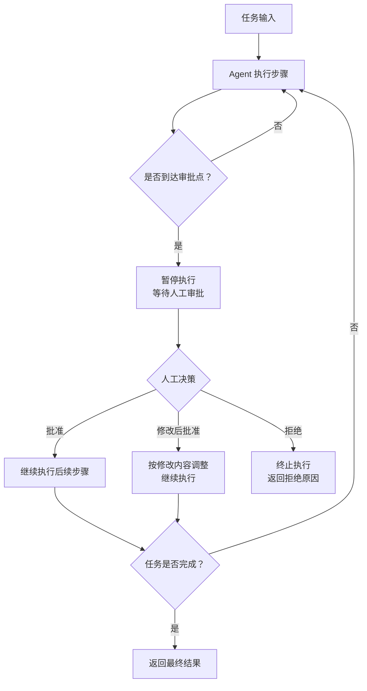
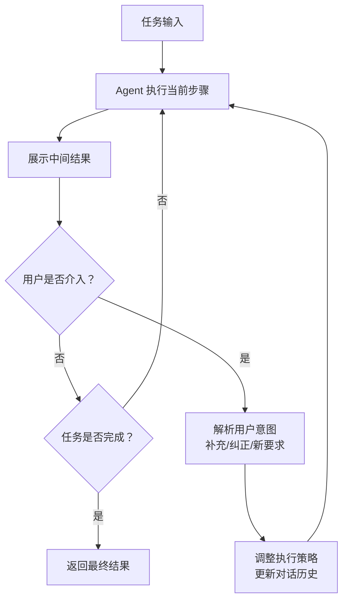
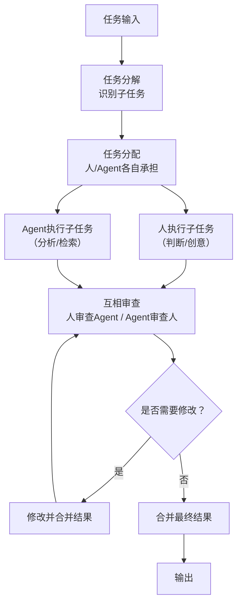
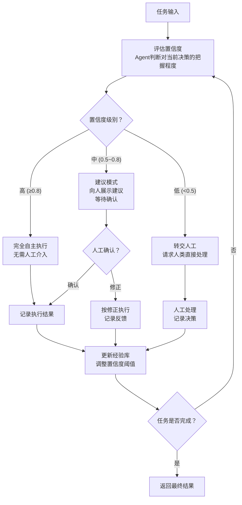

# 十、人机协作类 Agent 设计模式

人机协作类设计模式是让大语言模型（LLM）Agent 与人类用户在任务执行过程中形成有效协作关系的方法论。这类模式的核心思想是：**Agent 不应是完全自主的"黑箱"，而应在适当的时候引入人类的判断、创造力和监督，实现人机优势互补**。

人类擅长直觉判断、创造性思维和伦理决策，而 Agent 擅长快速处理、大规模搜索和不知疲倦的执行。人机协作类模式通过不同的协作机制，让两者在合适的时机、以合适的方式介入，从而在效率和安全之间取得平衡。

本章涵盖以下 4 种人机协作模式：

| 序号 | 模式 | 核心要点 |
|------|------|----------|
| 10.1 | Human-in-the-Loop (HITL) | 在关键决策点暂停等待人工审批，确保高风险操作受控 |
| 10.2 | Interactive Agent | 用户可随时介入调整方向，Agent 实时响应用户意图 |
| 10.3 | Cobots | 人与Agent作为平等搭档协作，各自发挥优势 |
| 10.4 | Supervised Autonomy | 根据置信度动态调整自主级别，渐进扩大自主范围 |

---

## 10.1 Human-in-the-Loop (HITL) — 人在回路

### 概念说明

**Human-in-the-Loop（人在回路，简称 HITL）**是最经典的人机协作模式。它在 Agent 执行流程的关键决策点引入人工审批机制，确保高风险操作必须经过人类确认后才能继续执行。

在完全自主的 Agent 中，所有决策都由模型自行完成，这在低风险场景下效率很高，但在涉及资金操作、数据删除、对外发布等高风险场景中，模型的误判可能造成严重后果。HITL 通过在执行流程中设置"审批关卡"，让 Agent 在到达这些关卡时暂停执行，等待人类审核者批准、修改或拒绝，从而为高风险操作提供安全保障。

HITL 的关键设计要素：
1. **审批规则定义**：明确哪些操作需要人工审批（如金额超过阈值、涉及删除操作等）
2. **执行暂停机制**：Agent 到达审批点时自动暂停，不继续执行后续步骤
3. **人工输入处理**：支持批准、修改后批准、拒绝三种操作，Agent 根据人工决策调整后续行为

**类比理解**：就像银行转账系统——小额转账可以自动完成，但大额转账必须经过经理审批才能执行，审批通过后才真正转账。

### 核心流程/原理



**关键步骤**：
1. **定义审批规则**：在执行前配置哪些操作类型或条件触发人工审批
2. **执行与检测**：Agent 按步骤执行任务，每步检查是否命中审批规则
3. **暂停等待**：命中审批规则时，Agent 暂停执行并将当前状态呈现给人类
4. **人工决策**：人类审核当前操作，选择批准、修改或拒绝
5. **继续或终止**：根据人工决策，Agent 继续执行、调整后执行或终止任务

### 完整 Python 示例代码

#### 环境配置与数据结构

```python
"""
Human-in-the-Loop (HITL) 人在回路
在Agent执行的关键决策点引入人工审批，确保高风险操作得到人类确认
"""

import os
import json
from dataclasses import dataclass, field
from enum import Enum
from typing import Optional
from openai import OpenAI

client = OpenAI(
    api_key=os.environ.get("OPENAI_API_KEY", "your-api-key-here"),
    base_url=os.environ.get("OPENAI_BASE_URL", None),
)


class ApprovalDecision(str, Enum):
    """审批决策枚举"""
    APPROVED = "approved"
    MODIFIED = "modified"
    REJECTED = "rejected"


@dataclass
class ApprovalRule:
    """审批规则"""
    action_type: str
    description: str
    condition: str
    require_approval: bool = True


@dataclass
class ApprovalRequest:
    """审批请求"""
    step_index: int
    action_type: str
    action_description: str
    action_params: dict
    risk_level: str = "medium"


@dataclass
class ApprovalResult:
    """审批结果"""
    decision: ApprovalDecision
    modified_params: Optional[dict] = None
    reason: str = ""
```

#### HITLAgent 类定义

```python
class HITLAgent:
    """Human-in-the-Loop Agent，在关键决策点引入人工审批"""

    def __init__(self, model: str = "gpt-4o", max_steps: int = 10):
        self.model = model
        self.max_steps = max_steps
        self.approval_rules: list[ApprovalRule] = []
        self.execution_log: list[dict] = []
        self.pending_approval: Optional[ApprovalRequest] = None

    def add_approval_rule(self, action_type: str, description: str,
                          condition: str = "always") -> None:
        """添加审批规则"""
        rule = ApprovalRule(
            action_type=action_type,
            description=description,
            condition=condition,
        )
        self.approval_rules.append(rule)

    def _call_llm(self, system_prompt: str, user_message: str,
                  temperature: float = 0.3) -> str:
        response = client.chat.completions.create(
            model=self.model,
            messages=[
                {"role": "system", "content": system_prompt},
                {"role": "user", "content": user_message},
            ],
            temperature=temperature,
        )
        return response.choices[0].message.content.strip()
```

#### 执行计划生成

``````python
    def generate_plan(self, task: str) -> list[dict]:
        """根据任务生成执行计划"""
        rules_text = "\n".join(
            f"- {r.action_type}: {r.description}（条件: {r.condition}）"
            for r in self.approval_rules
        )

        system_prompt = f"""你是一位任务规划专家。请将用户的任务分解为具体的执行步骤。
每个步骤需要指定操作类型和参数。

以下操作类型需要人工审批：
{rules_text}

请以JSON格式返回步骤列表：
[
    {{
        "step": 1,
        "action_type": "操作类型",
        "description": "步骤描述",
        "params": {{"key": "value"}}
    }}
]

只输出JSON，不要其他内容。"""

        response = self._call_llm(system_prompt, task, temperature=0.3)

        try:
            if "```" in response:
                response = response.split("```")[1]
                if response.startswith("json"):
                    response = response[4:]
            steps = json.loads(response.strip())
            return steps if isinstance(steps, list) else []
        except json.JSONDecodeError:
            return [{"step": 1, "action_type": "execute",
                     "description": task, "params": {}}]
``````

#### 审批检查与人工审批

```python
    def needs_approval(self, action_type: str, params: dict) -> bool:
        """检查操作是否需要人工审批"""
        for rule in self.approval_rules:
            if rule.action_type == action_type:
                if rule.condition == "always":
                    return True
                try:
                    return eval(rule.condition, {"params": params})
                except Exception:
                    return True
        return False

    def request_approval(self, request: ApprovalRequest) -> ApprovalResult:
        """请求人工审批（使用input()模拟）"""
        print(f"\n{'='*50}")
        print(f"🔔 审批请求 - 步骤 {request.step_index}")
        print(f"{'='*50}")
        print(f"操作类型: {request.action_type}")
        print(f"操作描述: {request.action_description}")
        print(f"操作参数: {json.dumps(request.action_params, ensure_ascii=False, indent=2)}")
        print(f"风险等级: {request.risk_level}")
        print(f"{'='*50}")

        while True:
            choice = input(
                "请选择操作: [1] 批准  [2] 修改后批准  [3] 拒绝\n> "
            ).strip()

            if choice == "1":
                reason = input("批准原因（可选，直接回车跳过）: ").strip()
                return ApprovalResult(
                    decision=ApprovalDecision.APPROVED,
                    reason=reason or "人工批准",
                )
            elif choice == "2":
                print("当前参数:")
                for k, v in request.action_params.items():
                    print(f"  {k}: {v}")
                modified = dict(request.action_params)
                key = input("要修改的参数名（输入done完成修改）: ").strip()
                while key != "done" and key in modified:
                    new_val = input(f"  新值（当前: {modified[key]}）: ").strip()
                    modified[key] = new_val
                    key = input("继续修改参数名（输入done完成）: ").strip()
                reason = input("修改原因: ").strip()
                return ApprovalResult(
                    decision=ApprovalDecision.MODIFIED,
                    modified_params=modified,
                    reason=reason or "人工修改后批准",
                )
            elif choice == "3":
                reason = input("拒绝原因: ").strip()
                return ApprovalResult(
                    decision=ApprovalDecision.REJECTED,
                    reason=reason or "人工拒绝",
                )
            else:
                print("无效选择，请输入 1/2/3")
```

#### 步骤执行

```python
    def execute_step(self, step: dict, approval_result: Optional[ApprovalResult] = None) -> str:
        """执行单个步骤"""
        if approval_result and approval_result.decision == ApprovalDecision.MODIFIED:
            step["params"] = approval_result.modified_params

        system_prompt = """你是一位任务执行专家。请根据步骤描述和参数执行操作，
返回执行结果的描述。"""

        user_message = (
            f"步骤: {step.get('description', '')}\n"
            f"操作类型: {step.get('action_type', '')}\n"
            f"参数: {json.dumps(step.get('params', {}), ensure_ascii=False)}"
        )

        return self._call_llm(system_prompt, user_message, temperature=0.3)
```

#### 主流程方法

```python
    def run(self, task: str) -> dict:
        """
        HITL 主流程：生成计划 → 逐步执行 → 审批点暂停 → 人工决策 → 继续/终止

        参数:
            task: 任务描述

        返回:
            dict: 包含最终结果、执行日志和审批记录的字典
        """
        self.execution_log = []

        print(f"{'='*60}")
        print(f"任务: {task}")
        print(f"审批规则数: {len(self.approval_rules)}")
        print(f"{'='*60}")

        steps = self.generate_plan(task)
        print(f"\n📋 执行计划（共 {len(steps)} 步）:")
        for s in steps:
            needs = self.needs_approval(s.get("action_type", ""), s.get("params", {}))
            flag = "🔒需审批" if needs else "✅可自动执行"
            print(f"  步骤{s.get('step', '?')}: {s.get('description', '')[:50]} [{flag}]")

        for step in steps:
            step_index = step.get("step", 0)
            action_type = step.get("action_type", "")
            params = step.get("params", {})

            print(f"\n{'='*40}")
            print(f"▶ 执行步骤 {step_index}: {step.get('description', '')[:60]}")
            print(f"{'='*40}")

            if self.needs_approval(action_type, params):
                request = ApprovalRequest(
                    step_index=step_index,
                    action_type=action_type,
                    action_description=step.get("description", ""),
                    action_params=params,
                    risk_level="high",
                )
                approval_result = self.request_approval(request)

                if approval_result.decision == ApprovalDecision.REJECTED:
                    print(f"❌ 步骤 {step_index} 被拒绝: {approval_result.reason}")
                    self.execution_log.append({
                        "step": step_index,
                        "status": "rejected",
                        "reason": approval_result.reason,
                    })
                    return {
                        "final_output": f"任务被拒绝: 步骤{step_index} - {approval_result.reason}",
                        "completed": False,
                        "rejection_reason": approval_result.reason,
                        "execution_log": self.execution_log,
                    }

                decision_text = {
                    ApprovalDecision.APPROVED: "批准",
                    ApprovalDecision.MODIFIED: "修改后批准",
                }[approval_result.decision]
                print(f"✅ 步骤 {step_index} 已{decision_text}: {approval_result.reason}")

                result = self.execute_step(step, approval_result)
            else:
                print("  自动执行中...")
                result = self.execute_step(step)

            print(f"  执行结果: {result[:100]}...")
            self.execution_log.append({
                "step": step_index,
                "status": "completed",
                "result": result,
            })

        print(f"\n{'='*60}")
        print("🎉 任务完成！")
        return {
            "final_output": "所有步骤已执行完成",
            "completed": True,
            "execution_log": self.execution_log,
        }
```

#### 主流程与演示

```python
if __name__ == "__main__":
    # 示例1: 邮件发送Agent（发送前需确认）
    print("\n" + "=" * 60)
    print("示例1: 邮件发送Agent")
    print("=" * 60)

    email_agent = HITLAgent(model="gpt-4o")
    email_agent.add_approval_rule(
        action_type="send_email",
        description="发送邮件",
        condition="always",
    )
    email_agent.add_approval_rule(
        action_type="delete_email",
        description="删除邮件",
        condition="always",
    )

    email_task = (
        "请帮我完成以下邮件任务：\n"
        "1. 起草一封给团队的项目进度更新邮件\n"
        "2. 发送给 team@example.com\n"
        "3. 抄送给 manager@example.com"
    )
    result1 = email_agent.run(email_task)
    print(f"\n任务完成: {'是' if result1['completed'] else '否'}")

    # 示例2: 代码部署Agent（部署前需审批）
    print("\n" + "=" * 60)
    print("示例2: 代码部署Agent")
    print("=" * 60)

    deploy_agent = HITLAgent(model="gpt-4o")
    deploy_agent.add_approval_rule(
        action_type="deploy",
        description="部署代码到生产环境",
        condition="always",
    )
    deploy_agent.add_approval_rule(
        action_type="rollback",
        description="回滚到上一版本",
        condition="always",
    )

    deploy_task = (
        "请帮我完成以下部署任务：\n"
        "1. 检查代码仓库的最新提交\n"
        "2. 运行自动化测试\n"
        "3. 部署到生产环境\n"
        "4. 验证部署结果"
    )
    result2 = deploy_agent.run(deploy_task)
    print(f"\n任务完成: {'是' if result2['completed'] else '否'}")
```

**代码要点说明**：
- `ApprovalRule` 定义审批规则，`condition` 支持 `"always"` 或 Python 表达式（如 `"params.get('amount', 0) > 10000"`），灵活控制何时需要审批
- `needs_approval` 方法根据规则和当前参数动态判断是否需要暂停等待人工
- `request_approval` 使用 `input()` 模拟人工审批交互，支持三种决策：批准、修改后批准、拒绝
- 拒绝决策会立即终止整个任务流程，避免高风险操作在未经许可的情况下执行
- 修改后批准允许人类调整操作参数（如修改邮件收件人、降低部署范围），Agent 按修改后的参数继续执行

---

## 10.2 Interactive Agent — 交互式引导Agent

### 概念说明

**Interactive Agent（交互式引导Agent）**允许用户在 Agent 执行过程中随时介入，提供额外信息、纠正方向或补充约束。与 HITL 在预设审批点暂停不同，Interactive Agent 的介入时机由用户自主决定，Agent 需要实时理解用户的干预意图并调整执行策略。

Interactive Agent 的核心挑战在于：用户的介入是**非结构化的、不可预测的**。Agent 需要能够：
1. **识别用户意图**：判断用户是在补充信息、纠正方向还是提出新要求
2. **调整执行策略**：根据用户意图动态修改后续执行计划
3. **维护对话上下文**：在多轮交互中保持对任务进展和用户偏好的理解

这种模式特别适合探索性任务——用户可能一开始并不清楚自己想要什么，而是在看到 Agent 的中间结果后逐步明确需求。

**类比理解**：就像和一位助手一起做PPT——你不需要提前写好所有指令，而是在助手做了一页后说"这个风格不对，换成简约风"，助手理解你的意图后调整后续所有页面的设计方向。

### 核心流程/原理



**关键机制**：
1. **对话历史管理**：维护完整的对话历史，包括 Agent 的执行记录和用户的介入记录
2. **用户意图解析**：将用户的自然语言介入分类为补充信息、纠正方向或新增约束
3. **策略调整**：根据用户意图重新规划后续执行步骤，而非简单地在原计划上追加

### 完整 Python 示例代码

#### 环境配置与数据结构

```python
"""
Interactive Agent 交互式引导Agent
用户可以在Agent执行过程中随时介入，提供额外信息、纠正方向或补充约束
"""

import os
import json
from dataclasses import dataclass, field
from enum import Enum
from typing import Optional
from openai import OpenAI

client = OpenAI(
    api_key=os.environ.get("OPENAI_API_KEY", "your-api-key-here"),
    base_url=os.environ.get("OPENAI_BASE_URL", None),
)


class UserIntent(str, Enum):
    """用户介入意图枚举"""
    SUPPLEMENT = "supplement"
    CORRECT = "correct"
    NEW_REQUIREMENT = "new_requirement"
    APPROVE = "approve"
    UNRELATED = "unrelated"


@dataclass
class ConversationTurn:
    """对话轮次记录"""
    role: str
    content: str
    intent: Optional[str] = None
    metadata: dict = field(default_factory=dict)
```

#### InteractiveAgent 类定义

```python
class InteractiveAgent:
    """交互式引导Agent，支持用户随时介入调整执行方向"""

    def __init__(self, model: str = "gpt-4o", max_steps: int = 10):
        self.model = model
        self.max_steps = max_steps
        self.conversation_history: list[ConversationTurn] = []
        self.task_context: dict = {}
        self.current_strategy: str = ""

    def _call_llm(self, system_prompt: str, user_message: str,
                  temperature: float = 0.5) -> str:
        response = client.chat.completions.create(
            model=self.model,
            messages=[
                {"role": "system", "content": system_prompt},
                {"role": "user", "content": user_message},
            ],
            temperature=temperature,
        )
        return response.choices[0].message.content.strip()
```

#### 用户意图解析

``````python
    def parse_user_intent(self, user_input: str) -> dict:
        """解析用户介入意图"""
        system_prompt = """你是一位用户意图分析专家。请分析用户在Agent执行过程中的介入意图。

意图类型：
- supplement: 补充信息（用户提供额外上下文或数据）
- correct: 纠正方向（用户指出Agent的方向有误，要求调整）
- new_requirement: 新增要求（用户提出新的约束或需求）
- approve: 认可当前方向（用户对当前进展表示满意）
- unrelated: 无关输入（用户的输入与当前任务无关）

请以JSON格式返回：
{
    "intent": "意图类型",
    "explanation": "意图解释",
    "key_points": ["关键信息1", "关键信息2"]
}

只输出JSON。"""

        context_summary = self._build_context_summary()

        user_message = (
            f"当前任务上下文：\n{context_summary}\n\n"
            f"用户输入：{user_input}"
        )

        response = self._call_llm(system_prompt, user_message, temperature=0.0)

        try:
            if "```" in response:
                response = response.split("```")[1]
                if response.startswith("json"):
                    response = response[4:]
            return json.loads(response.strip())
        except json.JSONDecodeError:
            return {
                "intent": "approve",
                "explanation": "无法解析意图，默认为认可",
                "key_points": [],
            }
``````

#### 策略调整

```python
    def adjust_strategy(self, user_input: str, intent: dict) -> str:
        """根据用户意图调整执行策略"""
        intent_type = intent.get("intent", "approve")
        key_points = intent.get("key_points", [])

        system_prompt = """你是一位策略规划专家。根据用户的介入意图，调整Agent的执行策略。

请输出调整后的执行策略，包括：
1. 对用户意图的理解
2. 需要调整的方面
3. 调整后的执行计划

策略应该简洁明确，便于后续执行。"""

        context_summary = self._build_context_summary()

        user_message = (
            f"当前任务上下文：\n{context_summary}\n\n"
            f"当前策略：{self.current_strategy}\n\n"
            f"用户意图类型：{intent_type}\n"
            f"用户输入：{user_input}\n"
            f"关键信息：{', '.join(key_points)}\n\n"
            f"请输出调整后的执行策略。"
        )

        new_strategy = self._call_llm(system_prompt, user_message, temperature=0.3)
        self.current_strategy = new_strategy
        return new_strategy
```

#### 执行步骤

```python
    def execute_step(self, step_description: str) -> str:
        """根据当前策略执行一个步骤"""
        system_prompt = """你是一位任务执行专家。请根据当前策略和上下文执行指定步骤。
输出执行结果的描述。"""

        context_summary = self._build_context_summary()

        user_message = (
            f"当前策略：\n{self.current_strategy}\n\n"
            f"任务上下文：\n{context_summary}\n\n"
            f"请执行步骤：{step_description}"
        )

        return self._call_llm(system_prompt, user_message, temperature=0.5)
```

#### 辅助方法

```python
    def _build_context_summary(self) -> str:
        """构建对话上下文摘要"""
        if not self.conversation_history:
            return "暂无上下文"

        parts = []
        for turn in self.conversation_history[-6:]:
            role_label = "用户" if turn.role == "user" else "Agent"
            intent_label = f"（{turn.intent}）" if turn.intent else ""
            parts.append(f"{role_label}{intent_label}: {turn.content[:100]}")

        return "\n".join(parts)

    def _generate_next_step(self) -> Optional[str]:
        """根据当前策略生成下一步操作"""
        system_prompt = """根据当前策略，确定下一步应该执行什么操作。
如果任务已经完成，请回复"任务完成"。
否则，请简要描述下一步操作（一句话）。"""

        context_summary = self._build_context_summary()

        user_message = (
            f"当前策略：\n{self.current_strategy}\n\n"
            f"任务上下文：\n{context_summary}"
        )

        response = self._call_llm(system_prompt, user_message, temperature=0.3)

        if "任务完成" in response:
            return None
        return response
```

#### 主流程方法

```python
    def run(self, task: str) -> dict:
        """
        Interactive Agent 主流程：执行 → 展示 → 用户介入 → 意图解析 → 策略调整 → 继续

        参数:
            task: 任务描述

        返回:
            dict: 包含最终结果、对话历史和策略变更记录的字典
        """
        self.conversation_history = []
        self.task_context = {"original_task": task}

        print(f"{'='*60}")
        print(f"任务: {task}")
        print(f"{'='*60}")

        self.current_strategy = f"原始任务: {task}\n策略: 按照用户要求逐步执行"

        self.conversation_history.append(
            ConversationTurn(role="user", content=task, intent="initial_task")
        )

        strategy_changes = []

        for step_num in range(1, self.max_steps + 1):
            next_step = self._generate_next_step()
            if next_step is None:
                print(f"\n🎉 任务完成！")
                break

            print(f"\n{'='*40}")
            print(f"▶ 步骤 {step_num}: {next_step}")
            print(f"{'='*40}")

            result = self.execute_step(next_step)
            print(f"执行结果: {result[:150]}...")

            self.conversation_history.append(
                ConversationTurn(
                    role="agent",
                    content=result,
                    metadata={"step": step_num},
                )
            )

            user_input = input(
                "\n💬 请输入反馈（直接回车继续，输入 'quit' 结束）:\n> "
            ).strip()

            if user_input.lower() == "quit":
                print("用户终止任务。")
                break

            if not user_input:
                continue

            intent = self.parse_user_intent(user_input)
            intent_type = intent.get("intent", "approve")
            print(f"  识别意图: {intent_type} - {intent.get('explanation', '')}")

            self.conversation_history.append(
                ConversationTurn(
                    role="user",
                    content=user_input,
                    intent=intent_type,
                )
            )

            if intent_type != "approve" and intent_type != "unrelated":
                new_strategy = self.adjust_strategy(user_input, intent)
                strategy_changes.append({
                    "step": step_num,
                    "user_input": user_input,
                    "intent": intent_type,
                    "new_strategy": new_strategy[:100],
                })
                print(f"  🔄 策略已调整: {new_strategy[:100]}...")

        return {
            "final_output": self.conversation_history[-1].content if self.conversation_history else "",
            "conversation_turns": len(self.conversation_history),
            "strategy_changes": strategy_changes,
            "conversation_history": [
                {"role": t.role, "content": t.content[:80], "intent": t.intent}
                for t in self.conversation_history
            ],
        }
```

#### 主流程与演示

```python
if __name__ == "__main__":
    # 示例1: 数据分析Agent（用户可中途要求换分析维度）
    print("\n" + "=" * 60)
    print("示例1: 数据分析Agent")
    print("=" * 60)

    data_agent = InteractiveAgent(model="gpt-4o", max_steps=8)

    data_task = (
        "请分析以下销售数据：\n"
        "第一季度: 华北 120万, 华南 95万, 华东 150万\n"
        "第二季度: 华北 130万, 华南 110万, 华东 140万\n"
        "第三季度: 华北 115万, 华南 125万, 华东 160万\n"
        "请先按区域维度分析趋势。"
    )
    result1 = data_agent.run(data_task)
    print(f"\n对话轮次: {result1['conversation_turns']}")
    print(f"策略调整次数: {len(result1['strategy_changes'])}")

    # 示例2: 写作Agent（用户可中途修改风格）
    print("\n" + "=" * 60)
    print("示例2: 写作Agent")
    print("=" * 60)

    writing_agent = InteractiveAgent(model="gpt-4o", max_steps=8)

    writing_task = (
        "请撰写一篇关于'未来城市交通'的文章，\n"
        "先从技术角度分析自动驾驶的发展趋势。"
    )
    result2 = writing_agent.run(writing_task)
    print(f"\n对话轮次: {result2['conversation_turns']}")
    print(f"策略调整次数: {len(result2['strategy_changes'])}")
```

**代码要点说明**：
- `parse_user_intent` 将用户的自然语言介入分类为五种意图，便于 Agent 精准理解用户需求
- `adjust_strategy` 在用户纠正或补充信息后，重新规划执行策略，而非简单追加指令
- `_build_context_summary` 只保留最近 6 轮对话，避免上下文过长导致 LLM 注意力分散
- `_generate_next_step` 动态生成下一步操作，使 Agent 能够根据策略调整灵活改变执行路径
- 用户输入为空时表示认可当前方向继续执行，输入 `quit` 终止任务，输入其他内容触发意图解析和策略调整

---

## 10.3 Cobots — 协作式人机搭档

### 概念说明

**Cobots（协作式人机搭档）**源自协作机器人（Collaborative Robots）的概念，强调人与 Agent 作为平等的搭档协作完成任务，各自发挥自身优势。人类提供判断力、创造力和领域经验，Agent 提供处理速度、信息检索和规模化的执行能力。

与 HITL 的"审批者-执行者"关系不同，Cobots 模式中人与 Agent 是**平等的协作者**。双方都可以主动提出建议、审查对方的工作、补充对方的不足。这种模式特别适合需要深度思考的复杂任务——人类负责核心判断和创意，Agent 负责辅助分析和扩展。

Cobots 的关键机制：
1. **任务分配**：根据任务特性和双方优势，将子任务分配给人或 Agent
2. **角色切换**：在协作过程中灵活切换"主导者"和"辅助者"角色
3. **互相审查**：人审查 Agent 的输出（逻辑、安全），Agent 审查人的输出（风格、遗漏）
4. **迭代改进**：通过多轮协作逐步提升输出质量

**类比理解**：就像一对搭档律师——一位擅长法律条文检索（Agent），一位擅长法庭辩论策略（人），两人分工合作、互相补充，共同准备案件。

### 核心流程/原理



**关键步骤**：
1. **任务分解与分配**：将复杂任务拆分为子任务，根据性质分配给人或 Agent
2. **并行/串行执行**：人和 Agent 各自执行分配到的子任务
3. **互相审查**：人审查 Agent 输出的逻辑正确性和安全性，Agent 审查人输出的风格一致性和信息完整性
4. **合并与迭代**：整合双方的输出，如有分歧则协商修改，迭代直到满意

### 完整 Python 示例代码

#### 环境配置与数据结构

```python
"""
Cobots 协作式人机搭档
人与Agent作为平等的搭档协作完成任务，各自发挥优势
"""

import os
import json
from dataclasses import dataclass, field
from enum import Enum
from typing import Optional
from openai import OpenAI

client = OpenAI(
    api_key=os.environ.get("OPENAI_API_KEY", "your-api-key-here"),
    base_url=os.environ.get("OPENAI_BASE_URL", None),
)


class Role(str, Enum):
    """协作角色枚举"""
    HUMAN = "human"
    AGENT = "agent"


class TaskType(str, Enum):
    """任务类型枚举"""
    CREATIVE = "creative"
    ANALYTICAL = "analytical"
    REVIEW = "review"
    EXECUTION = "execution"


@dataclass
class SubTask:
    """子任务"""
    task_id: str
    description: str
    assigned_to: Role
    task_type: TaskType
    status: str = "pending"
    output: str = ""
    review_comments: list[str] = field(default_factory=list)


@dataclass
class ReviewResult:
    """审查结果"""
    reviewer: Role
    target_task_id: str
    approved: bool
    comments: str
    suggestions: list[str] = field(default_factory=list)
```

#### CobotSession 类定义

```python
class CobotSession:
    """协作式人机搭档会话"""

    def __init__(self, model: str = "gpt-4o", max_rounds: int = 5):
        self.model = model
        self.max_rounds = max_rounds
        self.sub_tasks: list[SubTask] = []
        self.review_history: list[ReviewResult] = []
        self.session_log: list[dict] = []

    def _call_llm(self, system_prompt: str, user_message: str,
                  temperature: float = 0.5) -> str:
        response = client.chat.completions.create(
            model=self.model,
            messages=[
                {"role": "system", "content": system_prompt},
                {"role": "user", "content": user_message},
            ],
            temperature=temperature,
        )
        return response.choices[0].message.content.strip()
```

#### 任务分解与分配

``````python
    def decompose_and_assign(self, task: str) -> list[SubTask]:
        """将任务分解为子任务并分配给人或Agent"""
        system_prompt = """你是一位任务分解专家。请将复杂任务分解为子任务，
并根据以下原则分配给人或Agent：

分配原则：
- 创意性任务（写作核心观点、策略决策）→ 分配给人(human)
- 分析性任务（数据分析、信息检索）→ 分配给Agent(agent)
- 审查性任务（代码审查、质量检查）→ 根据审查对象分配给对方
- 执行性任务（格式化、批量处理）→ 分配给Agent(agent)

请以JSON格式返回子任务列表：
[
    {
        "task_id": "T1",
        "description": "子任务描述",
        "assigned_to": "human" 或 "agent",
        "task_type": "creative/analytical/review/execution"
    }
]

只输出JSON。"""

        response = self._call_llm(system_prompt, task, temperature=0.3)

        try:
            if "```" in response:
                response = response.split("```")[1]
                if response.startswith("json"):
                    response = response[4:]
            tasks_data = json.loads(response.strip())
        except json.JSONDecodeError:
            tasks_data = [
                {"task_id": "T1", "description": task,
                 "assigned_to": "agent", "task_type": "analytical"}
            ]

    self.sub_tasks = []
    for td in tasks_data:
        sub_task = SubTask(
            task_id=td.get("task_id", "T?"),
            description=td.get("description", ""),
            assigned_to=Role(td.get("assigned_to", "agent")),
            task_type=TaskType(td.get("task_type", "execution")),
        )
        self.sub_tasks.append(sub_task)

    return self.sub_tasks
``````

#### Agent 执行子任务

```python
    def agent_execute(self, sub_task: SubTask) -> str:
        """Agent执行子任务"""
        type_prompts = {
            TaskType.ANALYTICAL: "你是一位数据分析专家。请对以下任务进行详细分析。",
            TaskType.EXECUTION: "你是一位执行专家。请高效完成以下任务。",
            TaskType.REVIEW: "你是一位审查专家。请仔细审查以下内容，指出问题和改进建议。",
            TaskType.CREATIVE: "你是一位创意专家。请根据要求进行创作。",
        }
        system_prompt = type_prompts.get(sub_task.task_type, "你是一位AI助手。")

        context = self._build_task_context(sub_task)

        user_message = f"任务：{sub_task.description}\n\n上下文：{context}"

        result = self._call_llm(system_prompt, user_message, temperature=0.5)
        sub_task.output = result
        sub_task.status = "completed"
        return result
```

#### 人工执行子任务

```python
    def human_execute(self, sub_task: SubTask) -> str:
        """人工执行子任务（使用input()模拟）"""
        print(f"\n{'='*50}")
        print(f"👤 人工任务: {sub_task.description}")
        print(f"任务类型: {sub_task.task_type.value}")
        print(f"{'='*50}")

        context = self._build_task_context(sub_task)
        if context:
            print(f"相关上下文:\n{context[:200]}...\n")

        print("请输入你的工作成果（输入完成后按回车）:")
        human_output = input("> ").strip()

        sub_task.output = human_output
        sub_task.status = "completed"
        return human_output
```

#### 互相审查

``````python
    def agent_review_human(self, sub_task: SubTask) -> ReviewResult:
        """Agent审查人的输出"""
        system_prompt = """你是一位审查专家，负责审查人类搭档的工作成果。
请从以下角度审查：
1. 风格一致性：是否与整体风格协调
2. 信息完整性：是否有遗漏的关键信息
3. 逻辑连贯性：论述是否自洽
4. 格式规范：是否符合格式要求

请以JSON格式返回审查结果：
{
    "approved": true/false,
    "comments": "审查意见",
    "suggestions": ["建议1", "建议2"]
}

只输出JSON。"""

        context = self._build_task_context(sub_task)

        user_message = (
            f"任务描述：{sub_task.description}\n\n"
            f"上下文：{context}\n\n"
            f"人类搭档的输出：\n{sub_task.output}"
        )

        response = self._call_llm(system_prompt, user_message, temperature=0.2)

        try:
            if "```" in response:
                response = response.split("```")[1]
                if response.startswith("json"):
                    response = response[4:]
            data = json.loads(response.strip())
        except json.JSONDecodeError:
            data = {"approved": True, "comments": "审查完成", "suggestions": []}

    review = ReviewResult(
        reviewer=Role.AGENT,
        target_task_id=sub_task.task_id,
        approved=data.get("approved", True),
        comments=data.get("comments", ""),
        suggestions=data.get("suggestions", []),
    )
    self.review_history.append(review)
    return review

def human_review_agent(self, sub_task: SubTask) -> ReviewResult:
    """人审查Agent的输出（使用input()模拟）"""
    print(f"\n{'='*50}")
    print(f"🔍 请审查Agent的工作成果")
    print(f"任务: {sub_task.description}")
    print(f"{'='*50}")
    print(f"Agent输出:\n{sub_task.output}")
    print(f"{'='*50}")

    approved = input("是否通过？[y/n]: ").strip().lower() == "y"

    comments = ""
    suggestions = []
    if not approved:
        comments = input("审查意见: ").strip()
        suggestion_input = input("改进建议（多个建议用逗号分隔）: ").strip()
        if suggestion_input:
            suggestions = [s.strip() for s in suggestion_input.split(",")]

    review = ReviewResult(
        reviewer=Role.HUMAN,
        target_task_id=sub_task.task_id,
        approved=approved,
        comments=comments,
        suggestions=suggestions,
    )
    self.review_history.append(review)
    return review
``````

#### 辅助方法

```python
    def _build_task_context(self, current_task: SubTask) -> str:
        """构建任务上下文（已完成子任务的输出）"""
        completed = [
            t for t in self.sub_tasks
            if t.status == "completed" and t.task_id != current_task.task_id
        ]
        if not completed:
            return "暂无相关上下文"

        parts = []
        for t in completed:
            role_label = "👤人" if t.assigned_to == Role.HUMAN else "🤖Agent"
            parts.append(f"[{role_label}] {t.description}: {t.output[:100]}...")
        return "\n".join(parts)

    def _merge_results(self) -> str:
        """合并所有子任务的结果"""
        system_prompt = """你是一位整合专家。请将以下子任务的成果整合为一份连贯的最终输出。
保持逻辑流畅，消除重复内容，确保风格统一。"""

        parts = []
        for t in self.sub_tasks:
            role_label = "人类" if t.assigned_to == Role.HUMAN else "Agent"
            parts.append(f"[{role_label}] {t.description}:\n{t.output}")

        user_message = "\n\n---\n\n".join(parts)

        return self._call_llm(system_prompt, user_message, temperature=0.3)
```

#### 主流程方法

```python
    def run(self, task: str) -> dict:
        """
        Cobots 主流程：分解 → 分配 → 各自执行 → 互相审查 → 合并

        参数:
            task: 任务描述

        返回:
            dict: 包含最终结果、子任务执行情况和审查记录的字典
        """
        self.session_log = []

        print(f"{'='*60}")
        print(f"协作任务: {task}")
        print(f"{'='*60}")

        sub_tasks = self.decompose_and_assign(task)

        print(f"\n📋 任务分配:")
        for st in sub_tasks:
            role_label = "👤人" if st.assigned_to == Role.HUMAN else "🤖Agent"
            print(f"  {st.task_id}: {st.description[:50]} → {role_label}")

        for round_num in range(1, self.max_rounds + 1):
            print(f"\n{'='*40}")
            print(f"协作轮次 {round_num}")
            print(f"{'='*40}")

            pending = [t for t in self.sub_tasks if t.status == "pending"]
            if not pending:
                break

            for sub_task in pending:
                if sub_task.assigned_to == Role.AGENT:
                    print(f"\n🤖 Agent执行: {sub_task.description[:50]}")
                    self.agent_execute(sub_task)
                    print(f"  输出: {sub_task.output[:80]}...")

                    review = self.human_review_agent(sub_task)
                    if not review.approved:
                        print(f"  ❌ 审查未通过: {review.comments[:60]}")
                        sub_task.status = "pending"
                        sub_task.review_comments.append(review.comments)
                        if review.suggestions:
                            sub_task.description += f"\n改进建议: {'; '.join(review.suggestions)}"
                    else:
                        print(f"  ✅ 审查通过")
                else:
                    print(f"\n👤 人工执行: {sub_task.description[:50]}")
                    self.human_execute(sub_task)

                    review = self.agent_review_human(sub_task)
                    if not review.approved:
                        print(f"  ❌ Agent审查未通过: {review.comments[:60]}")
                        sub_task.status = "pending"
                        sub_task.review_comments.append(review.comments)
                        if review.suggestions:
                            print(f"  Agent建议: {'; '.join(review.suggestions)}")
                    else:
                        print(f"  ✅ Agent审查通过")

            self.session_log.append({
                "round": round_num,
                "tasks_status": {t.task_id: t.status for t in self.sub_tasks},
            })

        print(f"\n{'='*60}")
        print("📝 合并最终结果...")
        final_output = self._merge_results()

        print(f"\n{'='*60}")
        print("🎉 协作完成！")
        print(f"协作轮次: {len(self.session_log)}")
        print(f"审查记录: {len(self.review_history)} 条")

        return {
            "final_output": final_output,
            "sub_tasks": [
                {
                    "task_id": t.task_id,
                    "assigned_to": t.assigned_to.value,
                    "status": t.status,
                    "output_preview": t.output[:80],
                }
                for t in self.sub_tasks
            ],
            "review_history": [
                {
                    "reviewer": r.reviewer.value,
                    "target": r.target_task_id,
                    "approved": r.approved,
                    "comments": r.comments[:60],
                }
                for r in self.review_history
            ],
            "session_log": self.session_log,
        }
```

#### 主流程与演示

```python
if __name__ == "__main__":
    # 示例1: 代码审查（人审查逻辑，Agent审查风格和安全）
    print("\n" + "=" * 60)
    print("示例1: 代码审查协作")
    print("=" * 60)

    code_session = CobotSession(model="gpt-4o", max_rounds=3)

    code_task = (
        "协作审查以下Python代码：\n"
        "def process_user_data(users):\n"
        "    results = []\n"
        "    for user in users:\n"
        "        if user['age'] > 18:\n"
        "            results.append(user['name'] + ' - ' + str(user['salary']))\n"
        "    return results\n\n"
        "人负责审查业务逻辑，Agent负责审查代码风格和安全性。"
    )
    result1 = code_session.run(code_task)
    print(f"\n最终输出:\n{result1['final_output'][:200]}...")

    # 示例2: 文档撰写（人写核心观点，Agent润色扩展）
    print("\n" + "=" * 60)
    print("示例2: 文档撰写协作")
    print("=" * 60)

    doc_session = CobotSession(model="gpt-4o", max_rounds=3)

    doc_task = (
        "协作撰写一份'AI产品安全指南'文档：\n"
        "人负责撰写核心安全原则和关键观点，\n"
        "Agent负责补充技术细节、格式化和扩展内容。"
    )
    result2 = doc_session.run(doc_task)
    print(f"\n最终输出:\n{result2['final_output'][:200]}...")
```

**代码要点说明**：
- `decompose_and_assign` 根据任务性质智能分配子任务——创意性任务分配给人，分析/执行性任务分配给 Agent
- `agent_review_human` 和 `human_review_agent` 实现双向审查机制，确保双方输出都经过对方验证
- 审查未通过时，子任务状态重置为 `pending`，改进建议被追加到任务描述中，下一轮重新执行
- `_merge_results` 在所有子任务通过审查后，将人和 Agent 的输出整合为连贯的最终结果
- `max_rounds` 限制最大协作轮次，避免无限循环

---

## 10.4 Supervised Autonomy — 渐进式自主

### 概念说明

**Supervised Autonomy（渐进式自主）**是一种让 Agent 根据置信度动态调整自主级别的协作模式。当 Agent 对自己的决策有高置信度时，自主执行；当置信度较低时，主动请求人类帮助。随着 Agent 通过人类反馈不断积累经验，其自主范围逐步扩大。

这种模式的核心思想是：**不是一刀切地决定 Agent 是自主还是受控，而是让 Agent 学会"知道自己不知道什么"**。在低风险、高置信度的场景下，Agent 完全自主可以最大化效率；在高风险、低置信度的场景下，及时请求人类帮助可以避免严重错误。

Supervised Autonomy 的关键机制：
1. **置信度评估**：Agent 对每个决策评估自己的置信度（0-1）
2. **自主级别管理**：根据置信度选择不同的自主级别（完全自主、建议模式、确认模式、转交人工）
3. **人工升级机制**：低置信度时自动升级到人类介入
4. **经验积累**：人类反馈被记录，用于提升未来类似场景的置信度

**类比理解**：就像培养新员工——刚开始只让他们独立处理简单事务（高置信度），复杂问题必须请示上级（低置信度）；随着经验积累，能独立处理的事情越来越多，请示上级的频率逐渐降低。

### 核心流程/原理



**关键步骤**：
1. **置信度评估**：Agent 分析当前决策的复杂度和自身确定性，输出 0-1 的置信度分数
2. **级别选择**：根据置信度选择自主级别——高置信度自主执行，中置信度需确认，低置信度转人工
3. **执行与反馈**：在对应级别下执行操作，收集人类反馈
4. **经验更新**：将人类反馈记录为经验，提升未来类似场景的置信度

### 完整 Python 示例代码

#### 环境配置与数据结构

```python
"""
Supervised Autonomy 渐进式自主
Agent根据置信度动态调整自主级别，高置信度自主执行，低置信度请求人类帮助
"""

import os
import json
from dataclasses import dataclass, field
from enum import Enum
from typing import Optional
from openai import OpenAI

client = OpenAI(
    api_key=os.environ.get("OPENAI_API_KEY", "your-api-key-here"),
    base_url=os.environ.get("OPENAI_BASE_URL", None),
)


class AutonomyLevel(str, Enum):
    """自主级别枚举"""
    FULL_AUTO = "full_auto"
    SUGGEST = "suggest"
    CONFIRM = "confirm"
    HUMAN = "human"


@dataclass
class ConfidenceAssessment:
    """置信度评估结果"""
    confidence: float
    reasoning: str
    risk_factors: list[str] = field(default_factory=list)
    suggested_level: AutonomyLevel = AutonomyLevel.SUGGEST


@dataclass
class ExperienceRecord:
    """经验记录"""
    scenario: str
    decision: str
    confidence: float
    human_feedback: str
    outcome: str
    learned: str
```

#### SupervisedAutonomyAgent 类定义

```python
class SupervisedAutonomyAgent:
    """渐进式自主Agent，根据置信度动态调整自主级别"""

    def __init__(self, model: str = "gpt-4o", max_steps: int = 10,
                 high_threshold: float = 0.8, low_threshold: float = 0.5):
        self.model = model
        self.max_steps = max_steps
        self.high_threshold = high_threshold
        self.low_threshold = low_threshold
        self.experience_db: list[ExperienceRecord] = []
        self.autonomy_stats: dict[str, int] = {
            "full_auto": 0,
            "suggest": 0,
            "confirm": 0,
            "human": 0,
        }
        self.execution_log: list[dict] = []

    def _call_llm(self, system_prompt: str, user_message: str,
                  temperature: float = 0.5) -> str:
        response = client.chat.completions.create(
            model=self.model,
            messages=[
                {"role": "system", "content": system_prompt},
                {"role": "user", "content": user_message},
            ],
            temperature=temperature,
        )
        return response.choices[0].message.content.strip()
```

#### 置信度评估

``````python
    def assess_confidence(self, task: str, current_step: str) -> ConfidenceAssessment:
        """评估当前决策的置信度"""
        experience_context = self._build_experience_context(task)

        system_prompt = f"""你是一位置信度评估专家。请评估Agent在当前步骤中的决策置信度。

考虑因素：
1. 任务的复杂度和模糊性
2. Agent对该领域知识的掌握程度
3. 潜在风险和影响范围
4. 历史经验中类似场景的表现

{experience_context}

请以JSON格式返回评估结果：
{{
    "confidence": 0.0到1.0之间的数值,
    "reasoning": "置信度评估理由",
    "risk_factors": ["风险因素1", "风险因素2"],
    "suggested_level": "full_auto/suggest/confirm/human"
}}

置信度与自主级别对应关系：
- ≥0.8: full_auto（完全自主执行）
- 0.6~0.8: suggest（提供建议，等待确认）
- 0.4~0.6: confirm（需人工确认后执行）
- <0.4: human（转交人工处理）

只输出JSON。"""

        user_message = f"任务：{task}\n当前步骤：{current_step}"

        response = self._call_llm(system_prompt, user_message, temperature=0.2)

        try:
            if "```" in response:
                response = response.split("```")[1]
                if response.startswith("json"):
                    response = response[4:]
            data = json.loads(response.strip())
            confidence = max(0.0, min(1.0, float(data.get("confidence", 0.5))))
            suggested = data.get("suggested_level", "suggest")
        try:
            suggested_level = AutonomyLevel(suggested)
        except ValueError:
            suggested_level = self._confidence_to_level(confidence)

        return ConfidenceAssessment(
            confidence=confidence,
            reasoning=data.get("reasoning", ""),
            risk_factors=data.get("risk_factors", []),
            suggested_level=suggested_level,
        )
    except (json.JSONDecodeError, ValueError):
        return ConfidenceAssessment(
            confidence=0.5,
            reasoning="评估解析失败，采用中等置信度",
            suggested_level=AutonomyLevel.SUGGEST,
        )

def _confidence_to_level(self, confidence: float) -> AutonomyLevel:
    """根据置信度确定自主级别"""
    if confidence >= self.high_threshold:
        return AutonomyLevel.FULL_AUTO
    elif confidence >= self.low_threshold + 0.1:
        return AutonomyLevel.SUGGEST
    elif confidence >= self.low_threshold:
        return AutonomyLevel.CONFIRM
    else:
        return AutonomyLevel.HUMAN
``````

#### 各级别执行方法

```python
    def execute_full_auto(self, task: str, step: str) -> str:
        """完全自主执行"""
        system_prompt = "你是一位高效的AI助手。请自主完成以下步骤，直接输出结果。"
        user_message = f"任务：{task}\n步骤：{step}"
        return self._call_llm(system_prompt, user_message, temperature=0.5)

    def execute_suggest(self, task: str, step: str) -> str:
        """建议模式：向人展示建议，等待确认"""
        system_prompt = "你是一位AI助手。请为以下步骤提供执行建议。"
        user_message = f"任务：{task}\n步骤：{step}"

        suggestion = self._call_llm(system_prompt, user_message, temperature=0.5)

        print(f"\n{'='*50}")
        print(f"💡 Agent建议:")
        print(f"{'='*50}")
        print(suggestion)
        print(f"{'='*50}")

        user_response = input("是否采纳此建议？[y/n/m(修改)]: ").strip().lower()

        if user_response == "y":
            return suggestion
        elif user_response == "m":
            modification = input("请输入修改内容: ").strip()
            return f"{suggestion}\n\n[人工修改]: {modification}"
        else:
            alternative = input("请输入替代方案: ").strip()
            return alternative

    def execute_confirm(self, task: str, step: str) -> str:
        """确认模式：需人工确认后执行"""
        print(f"\n{'='*50}")
        print(f"⚠️ 此步骤需要人工确认")
        print(f"步骤: {step}")
        print(f"{'='*50}")

        proceed = input("是否允许Agent执行此步骤？[y/n]: ").strip().lower()
        if proceed != "y":
            manual_result = input("请手动输入处理结果: ").strip()
            return manual_result

        system_prompt = "你是一位AI助手。请在人工确认后执行以下步骤。"
        user_message = f"任务：{task}\n步骤：{step}"
        return self._call_llm(system_prompt, user_message, temperature=0.3)

    def execute_human(self, task: str, step: str) -> str:
        """转交人工处理"""
        print(f"\n{'='*50}")
        print(f"🚑 此步骤置信度过低，转交人工处理")
        print(f"任务: {task}")
        print(f"步骤: {step}")
        print(f"{'='*50}")

        human_result = input("请输入处理结果: ").strip()
        return human_result
```

#### 经验记录与检索

```python
    def record_experience(self, scenario: str, decision: str,
                          confidence: float, human_feedback: str,
                          outcome: str) -> None:
        """记录经验"""
        system_prompt = """根据以下信息，总结一条简洁的经验教训（一句话）。"""

        user_message = (
            f"场景：{scenario}\n"
            f"决策：{decision}\n"
            f"置信度：{confidence}\n"
            f"人工反馈：{human_feedback}\n"
            f"结果：{outcome}"
        )

        learned = self._call_llm(system_prompt, user_message, temperature=0.3)

        experience = ExperienceRecord(
            scenario=scenario,
            decision=decision,
            confidence=confidence,
            human_feedback=human_feedback,
            outcome=outcome,
            learned=learned,
        )
        self.experience_db.append(experience)

    def _build_experience_context(self, current_task: str) -> str:
        """构建经验上下文"""
        if not self.experience_db:
            return "暂无历史经验。"

        recent = self.experience_db[-5:]
        parts = []
        for exp in recent:
            parts.append(
                f"- 场景: {exp.scenario[:50]}\n"
                f"  经验: {exp.learned}"
            )
        return "历史经验：\n" + "\n".join(parts)
```

#### 主流程方法

``````python
    def run(self, task: str) -> dict:
        """
        Supervised Autonomy 主流程：评估置信度 → 选择自主级别 → 执行 → 记录经验

        参数:
            task: 任务描述

        返回:
            dict: 包含最终结果、自主级别统计和经验记录的字典
        """
        self.execution_log = []

        print(f"{'='*60}")
        print(f"任务: {task}")
        print(f"置信度阈值: 高≥{self.high_threshold}, 低<{self.low_threshold}")
        print(f"已有经验: {len(self.experience_db)} 条")
        print(f"{'='*60}")

        steps = self._plan_steps(task)

        print(f"\n📋 执行计划（共 {len(steps)} 步）:")
        for i, s in enumerate(steps, 1):
            print(f"  {i}. {s[:60]}")

        for step_num, step in enumerate(steps, 1):
            print(f"\n{'='*40}")
            print(f"▶ 步骤 {step_num}/{len(steps)}: {step[:60]}")
            print(f"{'='*40}")

            assessment = self.assess_confidence(task, step)
            level = assessment.suggested_level

            level_labels = {
                AutonomyLevel.FULL_AUTO: "🟢 完全自主",
                AutonomyLevel.SUGGEST: "🟡 建议模式",
                AutonomyLevel.CONFIRM: "🟠 确认模式",
                AutonomyLevel.HUMAN: "🔴 转交人工",
            }

            print(f"  置信度: {assessment.confidence:.2f}")
            print(f"  自主级别: {level_labels[level]}")
            print(f"  理由: {assessment.reasoning[:80]}")
            if assessment.risk_factors:
                print(f"  风险因素: {', '.join(assessment.risk_factors[:3])}")

            self.autonomy_stats[level.value] += 1

            if level == AutonomyLevel.FULL_AUTO:
                result = self.execute_full_auto(task, step)
                human_feedback = "无需人工介入"
            elif level == AutonomyLevel.SUGGEST:
                result = self.execute_suggest(task, step)
                human_feedback = "人工确认建议"
            elif level == AutonomyLevel.CONFIRM:
                result = self.execute_confirm(task, step)
                human_feedback = "人工确认执行"
            else:
                result = self.execute_human(task, step)
                human_feedback = "人工直接处理"

            print(f"  执行结果: {result[:80]}...")

            self.record_experience(
                scenario=step,
                decision=level.value,
                confidence=assessment.confidence,
                human_feedback=human_feedback,
                outcome=result[:100],
            )

            self.execution_log.append({
                "step": step_num,
                "description": step,
                "confidence": assessment.confidence,
                "autonomy_level": level.value,
                "result_preview": result[:80],
            })

        print(f"\n{'='*60}")
        print("🎉 任务完成！")
        print(f"\n📊 自主级别统计:")
        for level_name, count in self.autonomy_stats.items():
            print(f"  {level_name}: {count} 次")
        print(f"  经验积累: {len(self.experience_db)} 条")

        return {
            "final_output": "任务执行完成",
            "autonomy_stats": self.autonomy_stats,
            "experience_count": len(self.experience_db),
            "execution_log": self.execution_log,
        }

    def _plan_steps(self, task: str) -> list[str]:
        """将任务分解为执行步骤"""
        system_prompt = """请将以下任务分解为3-6个具体的执行步骤。
每步用一句话描述。以JSON数组格式输出，只输出JSON。

示例：["步骤1描述", "步骤2描述", "步骤3描述"]"""

        response = self._call_llm(system_prompt, task, temperature=0.3)

        try:
            if "```" in response:
                response = response.split("```")[1]
                if response.startswith("json"):
                    response = response[4:]
            steps = json.loads(response.strip())
            return steps if isinstance(steps, list) else [task]
        except json.JSONDecodeError:
            return [task]
``````

#### 主流程与演示

```python
if __name__ == "__main__":
    # 示例1: 客服Agent（简单问题自主回答，复杂问题转人工）
    print("\n" + "=" * 60)
    print("示例1: 客服Agent")
    print("=" * 60)

    cs_agent = SupervisedAutonomyAgent(
        model="gpt-4o",
        high_threshold=0.8,
        low_threshold=0.5,
    )

    cs_task = (
        "处理以下客户服务请求：\n"
        "1. 查询订单#12345的物流状态\n"
        "2. 处理客户对商品质量的投诉\n"
        "3. 回答关于退换货政策的问题\n"
        "4. 处理要求赔偿的严重投诉"
    )
    result1 = cs_agent.run(cs_task)
    print(f"\n自主级别统计: {result1['autonomy_stats']}")

    # 示例2: 投资建议Agent（低风险自主，高风险需确认）
    print("\n" + "=" * 60)
    print("示例2: 投资建议Agent")
    print("=" * 60)

    invest_agent = SupervisedAutonomyAgent(
        model="gpt-4o",
        high_threshold=0.85,
        low_threshold=0.55,
    )

    invest_task = (
        "为以下投资场景提供建议：\n"
        "1. 分析当前货币基金收益率趋势\n"
        "2. 评估一只新发行的债券型基金\n"
        "3. 建议一个中等风险的投资组合配置\n"
        "4. 评估一只高波动性科技股的投资价值"
    )
    result2 = invest_agent.run(invest_task)
    print(f"\n自主级别统计: {result2['autonomy_stats']}")
```

**代码要点说明**：
- `assess_confidence` 是核心方法，通过 LLM 评估当前决策的置信度，考虑任务复杂度、风险因素和历史经验
- `_confidence_to_level` 根据置信度阈值将连续的置信度分数映射为离散的自主级别
- 四个执行方法对应四种自主级别：`execute_full_auto`（无人工介入）、`execute_suggest`（展示建议等确认）、`execute_confirm`（需确认才执行）、`execute_human`（完全转交人工）
- `record_experience` 将每次执行的反馈记录为经验，`_build_experience_context` 在后续置信度评估中注入历史经验，实现渐进式学习
- `high_threshold` 和 `low_threshold` 可根据业务场景调整——高风险场景应提高阈值，低风险场景可降低阈值

---

## 总结对比表

| 模式 | 协作关系 | 介入时机 | 介入方式 | 人工角色 | 适用场景 | 人工负担 |
|------|---------|---------|---------|---------|---------|---------|
| **HITL** | 审批者-执行者 | 预设审批点 | 被动等待审批 | 守门人 | 邮件发送、代码部署、资金操作 | ★★☆ 中 |
| **Interactive Agent** | 引导者-跟随者 | 用户自主决定 | 主动介入调整 | 导航员 | 数据分析、内容创作、探索性任务 | ★★☆ 中 |
| **Cobots** | 平等搭档 | 任务分配时 | 双向协作审查 | 合作者 | 代码审查、文档撰写、方案设计 | ★★★ 高 |
| **Supervised Autonomy** | 监督者-被监督者 | 置信度低时 | 自动升级请求 | 监护人 | 客服系统、投资建议、医疗辅助 | ★☆☆ 低~中 |

### 选型建议

1. **高风险操作需要安全保障**：优先使用 **HITL**，在预设审批点强制暂停，确保关键操作不会在未经人类许可的情况下执行。适合邮件发送、代码部署、资金转账等场景。
2. **探索性任务需要灵活调整**：选择 **Interactive Agent**，用户可以在看到中间结果后随时介入调整方向。适合数据分析、内容创作等用户需求可能在过程中变化的场景。
3. **复杂任务需要深度协作**：选择 **Cobots**，人与 Agent 各自发挥优势，互相审查补充。适合代码审查、文档撰写、方案设计等需要人类判断力和 Agent 处理能力结合的场景。
4. **需要平衡效率和安全**：选择 **Supervised Autonomy**，简单场景自主执行提升效率，复杂场景自动请求人类帮助确保安全。适合客服系统、投资建议、医疗辅助等需要根据情况动态调整自主程度的场景。

### 组合使用

在实际应用中，这些模式可以互相组合，例如：
- **HITL + Supervised Autonomy**：在 Supervised Autonomy 的"确认模式"和"转交人工"级别中，引入 HITL 的审批机制，确保升级到人工时的操作也经过审批。
- **Interactive Agent + Cobots**：在 Cobots 协作过程中，允许用户以 Interactive Agent 的方式随时介入调整协作策略，而非严格按预设分工执行。
- **Cobots + Supervised Autonomy**：在 Cobots 的 Agent 角色中引入置信度评估，当 Agent 对自己负责的子任务置信度低时，主动请求人类搭档协助。
- **HITL + Interactive Agent**：在 HITL 的审批点之外，允许用户以 Interactive Agent 的方式提供额外上下文，帮助 Agent 更好地完成需要审批的操作。

---

> **文档说明**：本文档为「Agent 设计模式」系列之十，聚焦人机协作类设计模式。每种模式的示例代码均基于 OpenAI 兼容 API，可直接运行（需替换 API Key）。代码旨在演示核心思想，经过简化以突出重点，生产环境中建议根据具体需求调整审批规则、置信度阈值和协作流程。人工输入部分使用 `input()` 模拟，实际部署时可替换为 Web 界面、消息队列或审批系统等交互方式。
