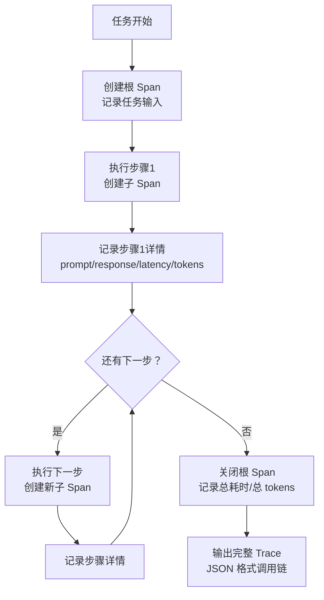
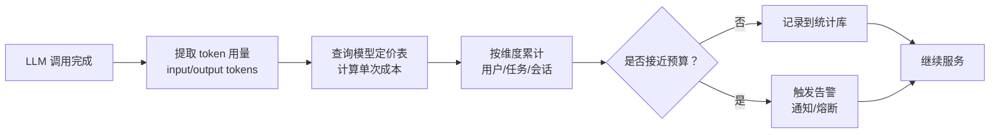
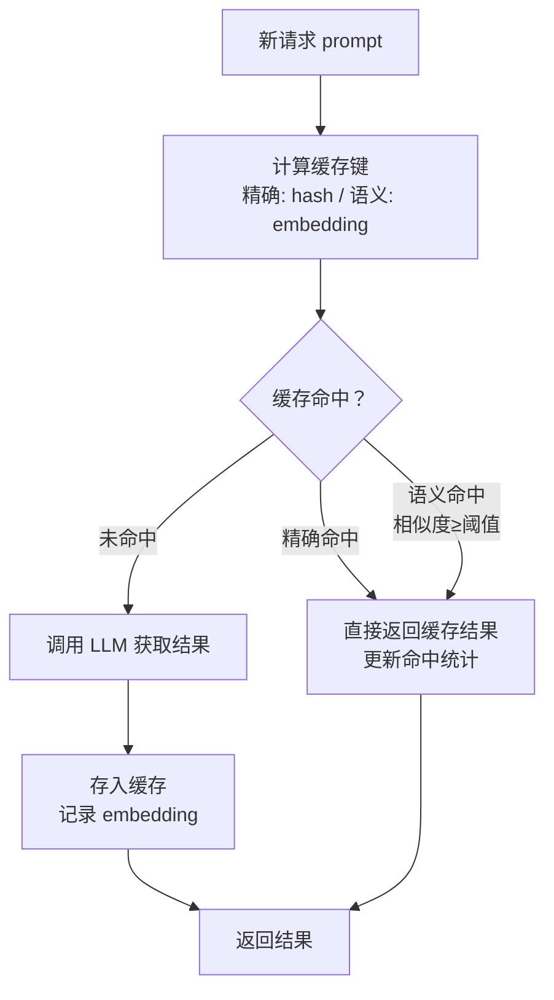
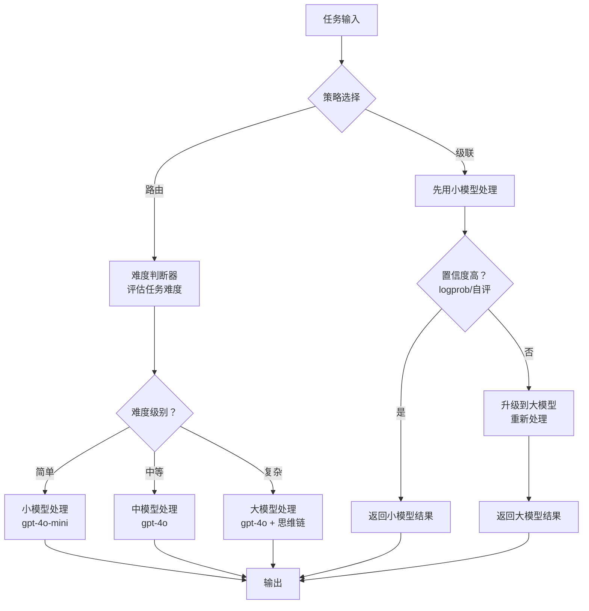
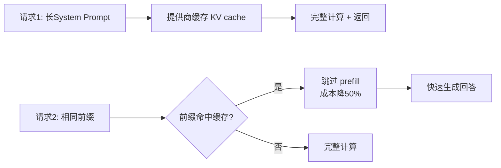
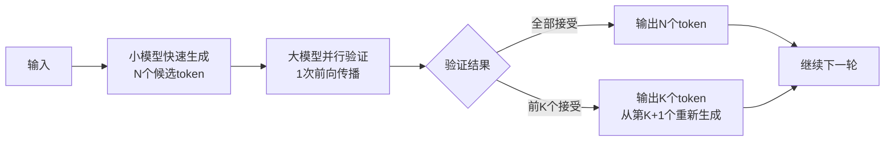
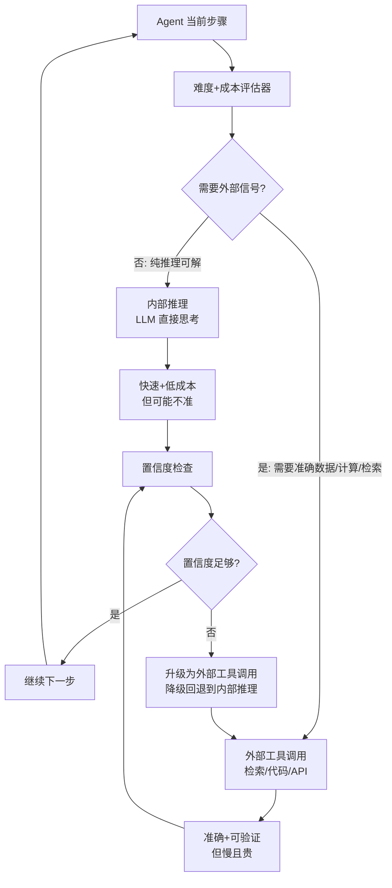

# 十二、可观测性与成本优化类 Agent 设计模式

可观测性与成本优化类设计模式是让 Agent 系统在生产环境中可监控、可追溯、可优化的方法论。这类模式的核心思想是：**Agent 系统不能只追求"能跑起来"，更要做到"看得见、控得住、省得了"**。当 Agent 从原型走向生产，黑箱式的执行方式会带来三个致命问题——出了问题无法排查（不可观测）、成本失控无人知晓（不可控）、重复调用浪费资源（不优化）。

可观测性解决"看不见"的问题。通过链路追踪与日志，开发者可以还原 Agent 执行的每一步——输入是什么、调用了哪个模型、返回了什么、耗时多久、消耗了多少 token。这就像分布式系统中的 OpenTelemetry，让原本黑箱的 Agent 调用链变成可分析的白箱。成本监控解决"控不住"的问题。LLM 调用按 token 计费，一次复杂任务可能涉及数十次调用，如果没有实时监控和预算告警，很容易出现单次任务成本远超预期的情况。缓存与模型路由则解决"省不了"的问题——对相同输入复用结果、对简单任务用小模型，是降低成本最直接有效的两种手段。

本章涵盖以下 6 种可观测性与成本优化模式：

| 序号 | 模式 | 核心要点 |
|------|------|----------|
| 12.1 | Tracing & Logging | 记录每步调用链，让 Agent 黑箱变白箱 |
| 12.2 | Token & Cost Monitoring | 实时监控 token 消耗和费用，防止成本失控 |
| 12.3 | Caching & Memoization | 缓存 LLM 调用结果，精确缓存+语义缓存 |
| 12.4 | Model Routing & Cascading | 按需选择模型，平衡成本和质量 |
| 12.5 | Prompt Caching & Batch API | 提供商侧前缀缓存与批量折扣，原生降本 |
| 12.6 | Speculative Decoding | 小模型草拟+大模型验证，2-3x 推理加速 |

---

## 12.1 Tracing & Logging — 链路追踪与日志

### 概念说明

**Tracing & Logging（链路追踪与日志）** 是指记录 Agent 执行过程中的每一步调用信息——包括输入 prompt、输出 response、调用耗时、token 用量、工具调用等——并将其组织成一条完整的调用链。它的核心目标是"让 Agent 黑箱变白箱"，使开发者能够回溯任何一次执行的完整过程。

在传统的 Web 服务中，一次请求可能经过网关、业务逻辑、数据库等多个环节，分布式追踪系统（如 OpenTelemetry、Jaeger）通过 span 概念将这些环节串联起来，形成调用链。Agent 系统同样如此——一次任务可能涉及多次 LLM 调用、多次工具调用、多次子 Agent 调用，如果没有追踪，开发者只能看到最终的输出，无法定位"是哪一步出了问题"。

链路追踪需要记录的关键信息包括：每步的 prompt（输入）、response（输出）、latency（耗时）、token usage（token 用量）、tool calls（工具调用）、以及父子 span 关系（嵌套调用链）。通过这些信息，开发者可以分析性能瓶颈、定位异常调用、审计执行过程。

**类比理解**：就像快递物流追踪——你不仅能看到包裹最终送达，还能看到它在每个中转站的到达时间、停留时长、经手人，一旦丢件可以精确定位是在哪个环节出的问题。

### 核心流程/原理



**关键点**：
1. **Span 嵌套**：每个调用是一个 span，子调用嵌套在父 span 内，形成树状调用链
2. **上下文管理**：使用 contextmanager 自动管理 span 的开始和结束，避免忘记关闭
3. **关键信息记录**：每个 span 必须记录 prompt、response、latency、token usage 四项核心数据
4. **JSON 输出**：最终 trace 以结构化 JSON 输出，便于后续分析和可视化

### 完整 Python 示例代码

#### 环境配置与客户端初始化

```python
"""
Tracing & Logging 链路追踪与日志
记录 Agent 执行的每一步调用，形成完整可追溯的调用链
"""
import os
import time
import json
import uuid
from contextlib import contextmanager
from dataclasses import dataclass, field
from typing import Optional
from openai import OpenAI

client = OpenAI(
    api_key=os.environ.get("OPENAI_API_KEY", "your-api-key-here"),
    base_url=os.environ.get("OPENAI_BASE_URL", None),
)
```

#### 核心数据结构

```python
@dataclass
class Span:
    """单个调用 span，对应一次 LLM/工具调用"""
    span_id: str = field(default_factory=lambda: uuid.uuid4().hex[:8])
    parent_id: Optional[str] = None
    name: str = ""
    span_type: str = "llm"  # llm / tool / agent / task
    input_data: str = ""
    output_data: str = ""
    start_time: float = 0.0
    end_time: float = 0.0
    token_usage: dict = field(default_factory=lambda: {
        "prompt_tokens": 0,
        "completion_tokens": 0,
        "total_tokens": 0,
    })
    metadata: dict = field(default_factory=dict)
    children: list[str] = field(default_factory=list)

    @property
    def duration(self) -> float:
        """耗时（秒）"""
        return round(self.end_time - self.start_time, 3) if self.end_time else 0.0


@dataclass
class Trace:
    """完整调用链，包含所有 span"""
    trace_id: str = field(default_factory=lambda: uuid.uuid4().hex[:12])
    root_span_id: Optional[str] = None
    spans: dict[str, Span] = field(default_factory=dict)
    start_time: float = field(default_factory=time.time)

    def add_span(self, span: Span) -> None:
        """添加 span 到 trace"""
        self.spans[span.span_id] = span
        if span.parent_id and span.parent_id in self.spans:
            self.spans[span.parent_id].children.append(span.span_id)

    def total_tokens(self) -> int:
        """统计总 token 数"""
        return sum(s.token_usage["total_tokens"] for s in self.spans.values())

    def total_duration(self) -> float:
        """总耗时"""
        return round(time.time() - self.start_time, 3)

    def to_dict(self) -> dict:
        """序列化为字典"""
        return {
            "trace_id": self.trace_id,
            "total_duration": self.total_duration(),
            "total_tokens": self.total_tokens(),
            "span_count": len(self.spans),
            "spans": [
                {
                    "span_id": s.span_id,
                    "parent_id": s.parent_id,
                    "name": s.name,
                    "type": s.span_type,
                    "duration": s.duration,
                    "token_usage": s.token_usage,
                    "input": s.input_data[:200],
                    "output": s.output_data[:200],
                    "children": s.children,
                }
                for s in self.spans.values()
            ],
        }
```

#### AgentTracer 类实现

```python
class AgentTracer:
    """Agent 链路追踪器，支持 span 嵌套和上下文管理"""

    def __init__(self):
        self.trace: Optional[Trace] = None
        self._current_span_id: Optional[str] = None

    def start_trace(self, name: str = "root") -> 'AgentTracer':
        """开始一个新的 trace"""
        self.trace = Trace()
        root_span = Span(
            name=name,
            span_type="task",
            start_time=time.time(),
        )
        self.trace.root_span_id = root_span.span_id
        self.trace.add_span(root_span)
        self._current_span_id = root_span.span_id
        return self

    @contextmanager
    def span(self, name: str, span_type: str = "llm", **metadata):
        """上下文管理器：自动创建和关闭 span"""
        if not self.trace:
            raise RuntimeError("请先调用 start_trace() 开始追踪")

        new_span = Span(
            name=name,
            span_type=span_type,
            parent_id=self._current_span_id,
            start_time=time.time(),
            metadata=metadata,
        )
        self.trace.add_span(new_span)

        # 保存父 span id，进入子 span
        previous_span_id = self._current_span_id
        self._current_span_id = new_span.span_id

        try:
            yield new_span
        finally:
            # 关闭 span，恢复父 span
            new_span.end_time = time.time()
            self._current_span_id = previous_span_id

    def record_llm_call(self, span: Span, model: str, prompt: str,
                        response: str, usage: dict) -> None:
        """记录 LLM 调用详情"""
        span.input_data = prompt
        span.output_data = response
        span.metadata["model"] = model
        span.token_usage = {
            "prompt_tokens": usage.get("prompt_tokens", 0),
            "completion_tokens": usage.get("completion_tokens", 0),
            "total_tokens": usage.get("total_tokens", 0),
        }

    def end_trace(self) -> Trace:
        """结束 trace 并返回完整调用链"""
        if not self.trace:
            raise RuntimeError("没有正在进行的 trace")
        root = self.trace.spans[self.trace.root_span_id]
        root.end_time = time.time()
        self._current_span_id = None
        return self.trace

    def print_trace(self) -> None:
        """打印 trace 摘要"""
        if not self.trace:
            print("无 trace 数据")
            return

        print(f"\n{'='*60}")
        print(f"🔍 Trace ID: {self.trace.trace_id}")
        print(f"⏱️  总耗时: {self.trace.total_duration()}s")
        print(f"🎯 总 tokens: {self.trace.total_tokens()}")
        print(f"📦 span 数: {len(self.trace.spans)}")
        print(f"{'='*60}")

        def print_span(span_id: str, depth: int = 0) -> None:
            span = self.trace.spans[span_id]
            indent = "  " * depth
            prefix = "├─" if depth > 0 else "▶"
            print(f"{indent}{prefix} [{span.span_type}] {span.name}"
                  f" ({span.duration}s, {span.token_usage['total_tokens']} tokens)")
            for child_id in span.children:
                print_span(child_id, depth + 1)

        print_span(self.trace.root_span_id)
```

#### 可追踪的 Agent 示例

```python
class TracedAgent:
    """使用 AgentTracer 追踪执行的 Agent"""

    def __init__(self, model: str = "gpt-4o"):
        self.model = model
        self.tracer = AgentTracer()

    def _call_llm(self, prompt: str, span_name: str = "llm_call") -> str:
        """带追踪的 LLM 调用"""
        with self.tracer.span(span_name, span_type="llm") as span:
            response = client.chat.completions.create(
                model=self.model,
                messages=[{"role": "user", "content": prompt}],
                temperature=0.3,
            )
            content = (response.choices[0].message.content or "").strip()
            usage = {
                "prompt_tokens": response.usage.prompt_tokens,
                "completion_tokens": response.usage.completion_tokens,
                "total_tokens": response.usage.total_tokens,
            }
            self.tracer.record_llm_call(span, self.model, prompt, content, usage)
            return content

    def analyze_task(self, task: str) -> str:
        """分析任务（含子步骤）"""
        self.tracer.start_trace("task_analysis")

        with self.tracer.span("decompose", span_type="agent"):
            plan = self._call_llm(
                f"请将以下任务分解为3个步骤，只输出步骤列表：\n{task}",
                span_name="plan_llm",
            )

        with self.tracer.span("execute", span_type="agent"):
            result = self._call_llm(
                f"根据以下计划执行任务：\n计划：{plan}\n任务：{task}",
                span_name="execute_llm",
            )

        with self.tracer.span("summarize", span_type="agent"):
            summary = self._call_llm(
                f"请用一句话总结以下结果：\n{result}",
                span_name="summary_llm",
            )

        self.tracer.end_trace()
        return summary
```

#### 主流程演示

```python
if __name__ == "__main__":
    agent = TracedAgent(model="gpt-4o")

    task = "分析2025年新能源汽车市场的竞争格局"
    print(f"任务: {task}")
    summary = agent.analyze_task(task)

    print(f"\n总结: {summary}")

    # 打印完整调用链
    agent.tracer.print_trace()

    # 输出 JSON 格式的 trace（可用于后续分析或上传到追踪平台）
    trace_json = json.dumps(
        agent.tracer.trace.to_dict(),
        ensure_ascii=False,
        indent=2,
    )
    print(f"\n📄 Trace JSON:\n{trace_json[:500]}...")
```

**代码要点说明**：
- `Span` 是最小追踪单元，通过 `parent_id` 和 `children` 维护嵌套关系，形成树状调用链
- `span()` 使用 `@contextmanager` 装饰器，自动在进入时创建 span、退出时关闭，开发者无需手动管理
- `record_llm_call` 专门记录 LLM 调用的四项核心数据（prompt、response、model、token usage）
- `print_trace` 递归打印调用链，缩进展示父子关系，便于直观查看执行流程
- `to_dict` 将 trace 序列化为 JSON，可对接 LangSmith、Helicone、OpenTelemetry 等专业平台

---

## 12.2 Token & Cost Monitoring — Token 与成本监控

### 概念说明

**Token & Cost Monitoring（Token 与成本监控）** 是指实时监控 Agent 的 token 消耗和对应费用，按请求/用户/任务/会话等维度累计统计，并在接近预算阈值时触发告警。它的核心目标是"防止成本失控"——LLM 调用按 token 计费，一次复杂任务可能涉及数十次调用，如果没有监控，单次任务成本可能远超预期。

成本监控的关键在于"按维度聚合"。同一个 Agent 服务可能被多个用户使用，每个用户发起多个任务，每个任务包含多次 LLM 调用。如果只看总成本，无法定位是哪个用户、哪个任务消耗了最多资源。因此需要支持按用户、任务、会话等维度分别统计，找出"成本大户"。

预算告警是成本监控的另一个核心功能。开发者为每个用户或任务设置预算上限（如单用户每日 10 美元），当累计成本接近上限时自动告警，达到上限时可选熔断（拒绝后续调用）。这能有效防止因 prompt 设计不当、循环调用、模型选错等导致的成本爆炸。

**类比理解**：就像手机流量监控——你不仅能看到本月总流量，还能看到每个 App 各用了多少，当流量接近套餐上限时会收到提醒，避免超额扣费。

### 核心流程/原理



**关键点**：
1. **多模型定价表**：不同模型单价差异巨大（gpt-5 比 gpt-4.1-nano 贵约 150 倍，claude-opus-4 比 gemini-2.5-flash 贵约 250 倍），需维护多厂商定价表
2. **多维度聚合**：支持按用户、任务、会话等维度分别累计，便于定位成本来源
3. **预算告警**：为每个维度设置预算阈值，接近时告警，达到时可熔断
4. **实时统计**：每次调用后立即更新统计，可随时查询当前消耗

### 完整 Python 示例代码

#### 环境配置与客户端初始化

```python
"""
Token & Cost Monitoring Token 与成本监控
实时监控 Agent 的 token 消耗和费用，支持多维度聚合和预算告警
"""
import os
import json
from dataclasses import dataclass, field
from datetime import datetime
from typing import Optional
from openai import OpenAI

client = OpenAI(
    api_key=os.environ.get("OPENAI_API_KEY", "your-api-key-here"),
    base_url=os.environ.get("OPENAI_BASE_URL", None),
)
```

#### 定价表与数据结构

```python
# 多模型定价表（单位：美元 / 1K tokens）
# 实际价格请参考各厂商官方定价页（截至 2026.06，价格可能调整）
MODEL_PRICING = {
    # === OpenAI 系列（2025-2026） ===
    "gpt-5": {"input": 0.005, "output": 0.015},                # 2025.08 发布，内置推理能力
    "gpt-4.1": {"input": 0.002, "output": 0.008},              # 2025.04 发布，长上下文+指令遵循
    "gpt-4.1-mini": {"input": 0.0004, "output": 0.0016},       # 4.1 的小尺寸版本，性价比高
    "gpt-4.1-nano": {"input": 0.0001, "output": 0.0004},       # 4.1 的 nano 版本，最便宜
    "o3-mini": {"input": 0.0011, "output": 0.0043},            # 2025.01 推理模型，支持 reasoning_effort
    "o4-mini": {"input": 0.0011, "output": 0.0043},            # 2025.04 推理模型，速度更快
    "gpt-4o": {"input": 0.0025, "output": 0.01},               # 2024.05 发布，多模态旗舰
    "gpt-4o-mini": {"input": 0.00015, "output": 0.0006},       # 推荐替代 gpt-3.5-turbo
    # === Anthropic Claude 系列（2025-2026） ===
    "claude-opus-4": {"input": 0.015, "output": 0.075},        # 2025.05 发布，最强推理
    "claude-sonnet-4": {"input": 0.003, "output": 0.015},      # 2025.05 发布，性价比旗舰
    "claude-3.5-sonnet": {"input": 0.003, "output": 0.015},    # 2024.10 发布，仍主流
    "claude-3.5-haiku": {"input": 0.0008, "output": 0.004},    # 轻量快速
    # === Google Gemini 系列（2025-2026） ===
    "gemini-2.5-pro": {"input": 0.00125, "output": 0.005},     # 2025.03 发布，长上下文
    "gemini-2.5-flash": {"input": 0.000075, "output": 0.0003}, # 2025.04 发布，超低成本
    # === DeepSeek 系列（2025） ===
    "deepseek-v3": {"input": 0.00014, "output": 0.00028},      # 2024.12 发布，开源旗舰
    "deepseek-r1": {"input": 0.00055, "output": 0.00219},      # 2025.01 推理模型，开源
    # === 已逐步弃用（保留用于历史成本统计） ===
    "gpt-4-turbo": {"input": 0.01, "output": 0.03},            # 已被 gpt-4.1 替代
    "gpt-3.5-turbo": {"input": 0.0005, "output": 0.0015},      # 已被 gpt-4o-mini/4.1-nano 替代
}


@dataclass
class UsageRecord:
    """单次调用用量记录"""
    timestamp: str = field(default_factory=lambda: datetime.now().isoformat())
    user_id: str = "default"
    task_id: str = "default"
    session_id: str = "default"
    model: str = "gpt-4o"
    input_tokens: int = 0
    output_tokens: int = 0
    cost: float = 0.0


@dataclass
class BudgetConfig:
    """预算配置"""
    user_budgets: dict = field(default_factory=dict)  # user_id -> 每日预算（美元）
    task_budgets: dict = field(default_factory=dict)  # task_id -> 单任务预算
    alert_threshold: float = 0.8  # 达到预算 80% 时告警
```

#### CostMonitor 类实现

```python
class CostMonitor:
    """成本监控器，支持多维度统计和预算告警"""

    def __init__(self, pricing: dict = None, budget_config: BudgetConfig = None):
        self.pricing = pricing or MODEL_PRICING
        self.budget_config = budget_config or BudgetConfig()
        self.records: list[UsageRecord] = []
        # 多维度累计统计
        self.stats_by_user: dict[str, dict] = {}
        self.stats_by_task: dict[str, dict] = {}
        self.stats_by_session: dict[str, dict] = {}
        self.stats_by_model: dict[str, dict] = {}
        self.total_cost: float = 0.0
        self.total_tokens: int = 0
        self.alerts: list[dict] = []

    def calculate_cost(self, model: str, input_tokens: int,
                       output_tokens: int) -> float:
        """根据定价表计算单次调用成本"""
        if model not in self.pricing:
            return 0.0
        price = self.pricing[model]
        cost = (input_tokens * price["input"] + output_tokens * price["output"]) / 1000
        return round(cost, 6)

    def record(self, model: str, input_tokens: int, output_tokens: int,
               user_id: str = "default", task_id: str = "default",
               session_id: str = "default") -> UsageRecord:
        """记录一次调用并更新统计"""
        cost = self.calculate_cost(model, input_tokens, output_tokens)

        record = UsageRecord(
            user_id=user_id,
            task_id=task_id,
            session_id=session_id,
            model=model,
            input_tokens=input_tokens,
            output_tokens=output_tokens,
            cost=cost,
        )
        self.records.append(record)

        # 更新各维度统计
        self._update_stats(self.stats_by_user, user_id, record)
        self._update_stats(self.stats_by_task, task_id, record)
        self._update_stats(self.stats_by_session, session_id, record)
        self._update_stats(self.stats_by_model, model, record)

        self.total_cost += cost
        self.total_tokens += input_tokens + output_tokens

        # 检查预算告警
        self._check_budget(user_id, task_id)

        return record

    def _update_stats(self, stats_dict: dict, key: str, record: UsageRecord) -> None:
        """更新某个维度的统计"""
        if key not in stats_dict:
            stats_dict[key] = {
                "total_cost": 0.0,
                "total_tokens": 0,
                "input_tokens": 0,
                "output_tokens": 0,
                "call_count": 0,
            }
        s = stats_dict[key]
        s["total_cost"] += record.cost
        s["total_tokens"] += record.input_tokens + record.output_tokens
        s["input_tokens"] += record.input_tokens
        s["output_tokens"] += record.output_tokens
        s["call_count"] += 1

    def _check_budget(self, user_id: str, task_id: str) -> None:
        """检查预算是否接近上限"""
        threshold = self.budget_config.alert_threshold

        # 检查用户预算
        user_budget = self.budget_config.user_budgets.get(user_id)
        if user_budget:
            spent = self.stats_by_user.get(user_id, {}).get("total_cost", 0)
            if spent >= user_budget * threshold:
                self.alerts.append({
                    "type": "user_budget",
                    "user_id": user_id,
                    "spent": round(spent, 4),
                    "budget": user_budget,
                    "ratio": round(spent / user_budget, 2),
                })

        # 检查任务预算
        task_budget = self.budget_config.task_budgets.get(task_id)
        if task_budget:
            spent = self.stats_by_task.get(task_id, {}).get("total_cost", 0)
            if spent >= task_budget * threshold:
                self.alerts.append({
                    "type": "task_budget",
                    "task_id": task_id,
                    "spent": round(spent, 4),
                    "budget": task_budget,
                    "ratio": round(spent / task_budget, 2),
                })

    def get_summary(self) -> dict:
        """获取成本汇总"""
        return {
            "total_cost": round(self.total_cost, 4),
            "total_tokens": self.total_tokens,
            "total_calls": len(self.records),
            "cost_per_request": round(self.total_cost / max(1, len(self.records)), 6),
            "by_user": {k: {**v, "total_cost": round(v["total_cost"], 4)}
                        for k, v in self.stats_by_user.items()},
            "by_model": {k: {**v, "total_cost": round(v["total_cost"], 4)}
                         for k, v in self.stats_by_model.items()},
            "alerts": self.alerts,
        }
```

#### 带监控的 Agent 调用

```python
class MonitoredAgent:
    """带成本监控的 Agent"""

    def __init__(self, model: str = "gpt-4o",
                 monitor: CostMonitor = None,
                 user_id: str = "user_001"):
        self.model = model
        self.monitor = monitor or CostMonitor()
        self.user_id = user_id

    def chat(self, prompt: str, task_id: str = "task_001",
             session_id: str = "session_001") -> str:
        """带成本监控的 LLM 调用"""
        response = client.chat.completions.create(
            model=self.model,
            messages=[{"role": "user", "content": prompt}],
            temperature=0.3,
        )
        content = (response.choices[0].message.content or "").strip()

        # 记录用量到监控器
        self.monitor.record(
            model=self.model,
            input_tokens=response.usage.prompt_tokens,
            output_tokens=response.usage.completion_tokens,
            user_id=self.user_id,
            task_id=task_id,
            session_id=session_id,
        )
        return content
```

#### 主流程演示

```python
if __name__ == "__main__":
    # 配置预算：user_001 每日 1 美元，task_001 单任务 0.5 美元
    budget = BudgetConfig(
        user_budgets={"user_001": 1.0},
        task_budgets={"task_001": 0.5},
        alert_threshold=0.8,
    )
    monitor = CostMonitor(budget_config=budget)

    # 模拟多次调用（不同模型、不同用户）
    agent_mini = MonitoredAgent(model="gpt-4o-mini", monitor=monitor,
                                user_id="user_001")
    agent_4o = MonitoredAgent(model="gpt-4o", monitor=monitor,
                              user_id="user_002")

    # 模拟记录（实际使用时由 chat() 自动记录）
    monitor.record("gpt-4o-mini", 500, 200, "user_001", "task_001", "s1")
    monitor.record("gpt-4o-mini", 800, 300, "user_001", "task_001", "s1")
    monitor.record("gpt-4o", 1200, 600, "user_002", "task_002", "s2")
    monitor.record("gpt-4o", 1000, 500, "user_001", "task_003", "s3")

    # 输出成本汇总
    summary = monitor.get_summary()
    print(f"{'='*60}")
    print(f"💰 成本监控汇总")
    print(f"{'='*60}")
    print(f"总成本: ${summary['total_cost']}")
    print(f"总 tokens: {summary['total_tokens']}")
    print(f"总调用数: {summary['total_calls']}")
    print(f"平均单次成本: ${summary['cost_per_request']}")

    print(f"\n📊 按用户统计:")
    for uid, s in summary["by_user"].items():
        print(f"  {uid}: ${s['total_cost']} ({s['call_count']} 次, "
              f"{s['total_tokens']} tokens)")

    print(f"\n📊 按模型统计:")
    for model, s in summary["by_model"].items():
        print(f"  {model}: ${s['total_cost']} ({s['call_count']} 次)")

    if summary["alerts"]:
        print(f"\n⚠️ 预算告警:")
        for alert in summary["alerts"]:
            print(f"  [{alert['type']}] {alert.get('user_id', alert.get('task_id'))}"
                  f" 已用 ${alert['spent']}/${alert['budget']} ({alert['ratio']*100}%)")
```

**代码要点说明**：
- `MODEL_PRICING` 维护多模型定价表，input 和 output 单价分开（output 通常更贵）
- `calculate_cost` 根据模型和 token 数计算单次成本，是所有统计的基础
- `record` 是核心方法，每次调用后传入 token 用量，自动更新用户/任务/会话/模型四个维度的统计
- `_check_budget` 在每次记录后检查用户和任务预算，达到阈值（默认 80%）时生成告警
- `get_summary` 输出完整成本报告，包含总成本、单次成本、各维度明细和告警列表

---

## 12.3 Caching & Memoization — 缓存与记忆化

### 概念说明

**Caching & Memoization（缓存与记忆化）** 是指缓存 LLM 调用的结果，对相同或相似的输入直接返回缓存，避免重复调用。它的核心思想是"用空间换时间+钱"——LLM 调用既慢又贵，如果相同的输入已经调用过，就没必要再花一次钱。

缓存分为两种：**精确缓存**和**语义缓存**。精确缓存基于 prompt 的哈希值（如 MD5/SHA256）作为缓存键，输入完全相同才命中。这种方式实现简单、命中率可预测，但只要 prompt 差一个字就 miss。语义缓存则更智能——将 prompt 转为 embedding 向量，新请求与缓存中的向量计算相似度，超过阈值（如 0.95）就认为语义相同，直接返回缓存结果。语义缓存能命中"措辞不同但意思相同"的请求，命中率更高，但实现复杂、有误判风险。

缓存设计需要考虑几个关键问题：缓存键如何设计（精确用 hash，语义用 embedding）、TTL 多长（避免缓存过期数据）、缓存命中率统计（评估缓存效果）、语义缓存的相似度阈值（太高命中率低，太低误判多）。

**类比理解**：精确缓存就像字典查询——只有完全相同的词才能查到；语义缓存就像问老师——你问"怎么做饭"和"如何烹饪"，老师都会给你类似的答案，因为他理解你的意思。

### 核心流程/原理



**关键点**：
1. **双缓存策略**：先查精确缓存（O(1)），未命中再查语义缓存（O(n) 但可优化）
2. **缓存键设计**：精确缓存用 `hash(model + prompt + temperature)`，语义缓存用 embedding 向量
3. **TTL 管理**：每个缓存项设置过期时间，避免返回过时信息
4. **命中率统计**：记录命中/未命中次数，评估缓存效果并调优阈值

### 完整 Python 示例代码

#### 环境配置与客户端初始化

```python
"""
Caching & Memoization 缓存与记忆化
精确缓存（基于 prompt hash）+ 语义缓存（基于 embedding 相似度）
"""
import os
import json
import time
import hashlib
import numpy as np
from dataclasses import dataclass, field
from typing import Optional
from openai import OpenAI

client = OpenAI(
    api_key=os.environ.get("OPENAI_API_KEY", "your-api-key-here"),
    base_url=os.environ.get("OPENAI_BASE_URL", None),
)
```

#### 缓存数据结构

```python
@dataclass
class CacheEntry:
    """缓存条目"""
    cache_key: str
    prompt: str
    response: str
    model: str
    created_at: float = field(default_factory=time.time)
    ttl: float = 3600.0  # 默认 1 小时过期
    embedding: Optional[list] = None  # 语义缓存用
    hit_count: int = 0

    def is_expired(self) -> bool:
        """是否过期"""
        return time.time() - self.created_at > self.ttl


@dataclass
class CacheStats:
    """缓存统计"""
    total_requests: int = 0
    exact_hits: int = 0
    semantic_hits: int = 0
    misses: int = 0

    @property
    def hit_rate(self) -> float:
        """命中率"""
        if self.total_requests == 0:
            return 0.0
        return round((self.exact_hits + self.semantic_hits) / self.total_requests, 4)

    @property
    def saved_calls(self) -> int:
        """节省的调用次数"""
        return self.exact_hits + self.semantic_hits
```

#### LLMCache 类实现

```python
class LLMCache:
    """LLM 调用缓存，支持精确缓存和语义缓存"""

    def __init__(self, semantic_threshold: float = 0.95,
                 enable_semantic: bool = True,
                 default_ttl: float = 3600.0):
        self.exact_cache: dict[str, CacheEntry] = {}  # 精确缓存
        self.semantic_cache: list[CacheEntry] = []    # 语义缓存（存有 embedding）
        self.semantic_threshold = semantic_threshold
        self.enable_semantic = enable_semantic
        self.default_ttl = default_ttl
        self.stats = CacheStats()

    def _make_exact_key(self, prompt: str, model: str,
                        temperature: float = 0.3) -> str:
        """生成精确缓存键（基于 hash）"""
        key_str = f"{model}|{temperature}|{prompt}"
        return hashlib.sha256(key_str.encode("utf-8")).hexdigest()

    def _get_embedding(self, text: str) -> list:
        """获取文本的 embedding 向量"""
        response = client.embeddings.create(
            model="text-embedding-3-small",
            input=text,
        )
        return response.data[0].embedding

    def _cosine_similarity(self, vec_a: list, vec_b: list) -> float:
        """计算余弦相似度"""
        a = np.array(vec_a)
        b = np.array(vec_b)
        norm = np.linalg.norm(a) * np.linalg.norm(b)
        if norm == 0:
            return 0.0
        return float(np.dot(a, b) / norm)

    def get(self, prompt: str, model: str = "gpt-4o",
            temperature: float = 0.3) -> Optional[str]:
        """查询缓存，返回命中结果或 None"""
        self.stats.total_requests += 1

        # 1. 先查精确缓存
        exact_key = self._make_exact_key(prompt, model, temperature)
        if exact_key in self.exact_cache:
            entry = self.exact_cache[exact_key]
            if not entry.is_expired():
                entry.hit_count += 1
                self.stats.exact_hits += 1
                return entry.response
            else:
                del self.exact_cache[exact_key]

        # 2. 再查语义缓存
        if self.enable_semantic and self.semantic_cache:
            query_embedding = self._get_embedding(prompt)
            best_entry = None
            best_score = 0.0
            for entry in self.semantic_cache:
                if entry.is_expired() or entry.model != model:
                    continue
                score = self._cosine_similarity(query_embedding, entry.embedding)
                if score > best_score:
                    best_score = score
                    best_entry = entry

            if best_entry and best_score >= self.semantic_threshold:
                best_entry.hit_count += 1
                self.stats.semantic_hits += 1
                return best_entry.response

        self.stats.misses += 1
        return None

    def set(self, prompt: str, response: str, model: str = "gpt-4o",
            temperature: float = 0.3, ttl: float = None) -> None:
        """存入缓存"""
        ttl = ttl if ttl is not None else self.default_ttl
        exact_key = self._make_exact_key(prompt, model, temperature)

        entry = CacheEntry(
            cache_key=exact_key,
            prompt=prompt,
            response=response,
            model=model,
            ttl=ttl,
        )

        # 存入精确缓存
        self.exact_cache[exact_key] = entry

        # 如果启用语义缓存，计算 embedding 并存入
        if self.enable_semantic:
            entry.embedding = self._get_embedding(prompt)
            self.semantic_cache.append(entry)

    def get_stats(self) -> dict:
        """获取缓存统计"""
        return {
            "total_requests": self.stats.total_requests,
            "exact_hits": self.stats.exact_hits,
            "semantic_hits": self.stats.semantic_hits,
            "misses": self.stats.misses,
            "hit_rate": self.stats.hit_rate,
            "saved_calls": self.stats.saved_calls,
            "exact_cache_size": len(self.exact_cache),
            "semantic_cache_size": len(self.semantic_cache),
        }

    def clear(self) -> None:
        """清空缓存"""
        self.exact_cache.clear()
        self.semantic_cache.clear()
```

#### 带缓存的 Agent 调用

```python
class CachedAgent:
    """带缓存的 Agent"""

    def __init__(self, model: str = "gpt-4o",
                 cache: LLMCache = None):
        self.model = model
        self.cache = cache or LLMCache()

    def chat(self, prompt: str, temperature: float = 0.3) -> str:
        """带缓存的 LLM 调用"""
        # 先查缓存
        cached = self.cache.get(prompt, self.model, temperature)
        if cached is not None:
            return cached

        # 未命中，调用 LLM
        response = client.chat.completions.create(
            model=self.model,
            messages=[{"role": "user", "content": prompt}],
            temperature=temperature,
        )
        content = (response.choices[0].message.content or "").strip()

        # 存入缓存
        self.cache.set(prompt, content, self.model, temperature)
        return content
```

#### 主流程演示

```python
if __name__ == "__main__":
    agent = CachedAgent(model="gpt-4o",
                        cache=LLMCache(semantic_threshold=0.92))

    # 模拟缓存命中（实际使用时由 chat() 自动处理）
    # 第一次调用：未命中，存入缓存
    agent.cache.set(
        prompt="什么是机器学习？",
        response="机器学习是让计算机从数据中学习规律的技术...",
        model="gpt-4o",
    )
    agent.cache.set(
        prompt="解释一下机器学习的概念",
        response="机器学习是让计算机从数据中学习规律的技术...",
        model="gpt-4o",
    )

    # 模拟查询
    agent.cache.stats.total_requests = 0  # 重置统计
    result1 = agent.cache.get("什么是机器学习？", "gpt-4o")  # 精确命中
    result2 = agent.cache.get("机器学习是什么意思？", "gpt-4o")  # 语义命中
    result3 = agent.cache.get("如何做红烧肉？", "gpt-4o")  # 未命中

    print(f"{'='*60}")
    print(f"📦 缓存测试结果")
    print(f"{'='*60}")
    print(f"查询1（精确命中）: {result1[:40] if result1 else 'None'}...")
    print(f"查询2（语义命中）: {result2[:40] if result2 else 'None'}...")
    print(f"查询3（未命中）: {result3}")

    stats = agent.cache.get_stats()
    print(f"\n📊 缓存统计:")
    print(f"  总请求数: {stats['total_requests']}")
    print(f"  精确命中: {stats['exact_hits']}")
    print(f"  语义命中: {stats['semantic_hits']}")
    print(f"  未命中: {stats['misses']}")
    print(f"  命中率: {stats['hit_rate']*100}%")
    print(f"  节省调用: {stats['saved_calls']} 次")
```

**代码要点说明**：
- `_make_exact_key` 使用 SHA256 对 `model + temperature + prompt` 求哈希，确保相同输入生成相同键
- `get` 采用两级查询：先查精确缓存（O(1) 字典查找），未命中再查语义缓存（遍历计算相似度）
- `_cosine_similarity` 用 numpy 计算余弦相似度，是语义缓存的核心度量
- `semantic_threshold`（默认 0.95）控制语义匹配的严格程度——越高越严格，误判少但命中率低
- `get_stats` 输出命中率、节省调用次数等指标，用于评估缓存效果和调优阈值

> **扩展性说明**：本示例的语义缓存采用线性遍历（O(n)），适合缓存条目较少（< 1000）的场景。生产环境中缓存量大时，应使用向量数据库（如 FAISS、Milvus、Pinecone）或近似最近邻（ANN）索引将查询复杂度降至 O(log n) 或更低，同时支持批量 embedding 查询以进一步降低延迟。

---

## 12.4 Model Routing & Cascading — 模型路由与级联

### 概念说明

**Model Routing & Cascading（模型路由与级联）** 是指根据任务难度动态选择模型——简单任务用小模型（便宜快），复杂任务用大模型（贵但强），从而在成本和质量之间取得平衡。它的核心思想是"按需选择模型，不为过度能力付费"。

这种模式有两种策略：**路由（Routing）** 和 **级联（Cascading）**。路由是"先判断难度再选模型"——用一个轻量级分类器（可以是小模型或规则）评估任务难度，然后路由到对应能力的模型。例如简单问答路由到 gpt-4o-mini，复杂推理路由到 gpt-4o。级联是"先试小模型，不行再升级"——先用小模型尝试，如果输出置信度低（通过 logprob 或自评判断），再用大模型重新处理。级联的好处是不需要预先判断难度，但可能产生两次调用。

两种策略各有优劣：路由适合难度可预先判断的场景（如根据关键词、任务类型），延迟低、成本可控；级联适合难度难以预判的场景（如开放式问答），质量更有保障但成本波动大。实际应用中常组合使用——先路由分流，对中等难度任务再用级联。

**类比理解**：路由就像医院分诊台——护士根据症状轻重把你分到普通门诊或专家门诊；级联就像先看普通医生，治不好再转专家号，确保小病不浪费专家资源，大病也能得到治疗。

### 核心流程/原理



**关键点**：
1. **难度判断器**：路由策略的核心，可用小模型分类或基于规则（关键词、任务类型）
2. **路由表**：难度级别到模型的映射，可配置不同场景使用不同模型组合
3. **置信度评估**：级联策略的核心，判断小模型输出是否可信（logprob 或 LLM 自评）
4. **升级机制**：置信度低于阈值时自动升级到大模型，确保质量底线

### 完整 Python 示例代码

#### 环境配置与客户端初始化

```python
"""
Model Routing & Cascading 模型路由与级联
根据任务难度动态选择模型，或级联调用（先小模型，不行再大模型）
"""
import os
import json
from dataclasses import dataclass, field
from enum import Enum
from typing import Optional
from openai import OpenAI

client = OpenAI(
    api_key=os.environ.get("OPENAI_API_KEY", "your-api-key-here"),
    base_url=os.environ.get("OPENAI_BASE_URL", None),
)
```

#### 数据结构与配置

```python
class Difficulty(str, Enum):
    """任务难度枚举"""
    SIMPLE = "simple"
    MEDIUM = "medium"
    COMPLEX = "complex"


@dataclass
class RouteConfig:
    """路由配置：难度到模型的映射"""
    routes: dict = field(default_factory=lambda: {
        Difficulty.SIMPLE: "gpt-4o-mini",
        Difficulty.MEDIUM: "gpt-4o",
        Difficulty.COMPLEX: "gpt-4o",
    })
    # 复杂任务是否启用思维链
    use_cot_for_complex: bool = True


@dataclass
class RouteResult:
    """路由结果"""
    difficulty: Difficulty
    selected_model: str
    response: str
    confidence: float = 1.0
    escalated: bool = False  # 是否发生过级联升级
    original_model: str = ""  # 升级前的模型（如有）
```

#### ModelRouter 类实现（基于难度判断）

```python
class ModelRouter:
    """模型路由器：先判断难度，再选模型"""

    def __init__(self, config: RouteConfig = None,
                 classifier_model: str = "gpt-4o-mini"):
        self.config = config or RouteConfig()
        self.classifier_model = classifier_model
        self.routing_stats: dict[str, int] = {d.value: 0 for d in Difficulty}

    def classify_difficulty(self, task: str) -> Difficulty:
        """用小模型判断任务难度"""
        system_prompt = """请判断以下任务的难度级别，只返回 simple/medium/complex 之一：

- simple: 简单问答、事实查询、格式转换、翻译短句
- medium: 需要一定推理、多步骤分析、中等长度写作
- complex: 复杂推理、数学证明、长文创作、多约束优化

只输出一个单词，不要其他内容。"""

        response = client.chat.completions.create(
            model=self.classifier_model,
            messages=[
                {"role": "system", "content": system_prompt},
                {"role": "user", "content": task},
            ],
            temperature=0.0,
        )
        result = (response.choices[0].message.content or "").strip().lower()

        try:
            return Difficulty(result)
        except ValueError:
            return Difficulty.MEDIUM  # 默认中等

    def route(self, task: str) -> RouteResult:
        """路由主流程：判断难度 → 选模型 → 执行"""
        difficulty = self.classify_difficulty(task)
        model = self.config.routes.get(difficulty, "gpt-4o")
        self.routing_stats[difficulty.value] += 1

        # 复杂任务启用思维链
        if difficulty == Difficulty.COMPLEX and self.config.use_cot_for_complex:
            prompt = f"请逐步思考后回答以下任务：\n{task}"
        else:
            prompt = task

        response = client.chat.completions.create(
            model=model,
            messages=[{"role": "user", "content": prompt}],
            temperature=0.3,
        )
        content = (response.choices[0].message.content or "").strip()

        return RouteResult(
            difficulty=difficulty,
            selected_model=model,
            response=content,
        )

    def get_stats(self) -> dict:
        """获取路由统计"""
        total = sum(self.routing_stats.values())
        return {
            "total_routed": total,
            "by_difficulty": self.routing_stats,
            "distribution": {
                k: round(v / max(1, total), 4)
                for k, v in self.routing_stats.items()
            },
        }
```

#### ModelCascader 类实现（基于置信度升级）

```python
class ModelCascader:
    """模型级联器：先用小模型，置信度低则升级到大模型"""

    def __init__(self, small_model: str = "gpt-4o-mini",
                 large_model: str = "gpt-4o",
                 confidence_threshold: float = 0.7):
        self.small_model = small_model
        self.large_model = large_model
        self.confidence_threshold = confidence_threshold
        self.cascade_stats: dict = {
            "small_only": 0,      # 小模型就搞定
            "escalated": 0,       # 升级到大模型
            "total_calls": 0,
        }

    def _call_with_confidence(self, model: str, task: str) -> tuple:
        """调用模型并评估置信度（通过 LLM 自评）"""
        response = client.chat.completions.create(
            model=model,
            messages=[{"role": "user", "content": task}],
            temperature=0.3,
        )
        content = (response.choices[0].message.content or "").strip()

        # 用同一模型自评置信度
        eval_prompt = (
            f"任务：{task}\n\n"
            f"回答：{content}\n\n"
            f"请评估上述回答的正确性和完整性，返回 0.0 到 1.0 的置信度分数。"
            f"只输出数字，不要其他内容。"
        )
        eval_response = client.chat.completions.create(
            model=model,
            messages=[{"role": "user", "content": eval_prompt}],
            temperature=0.0,
        )
        try:
            confidence = float((eval_response.choices[0].message.content or "").strip())
            confidence = max(0.0, min(1.0, confidence))
        except ValueError:
            confidence = 0.5

        return content, confidence

    def cascade(self, task: str) -> RouteResult:
        """级联主流程：先小模型 → 评估置信度 → 不够则升级"""
        self.cascade_stats["total_calls"] += 1

        # 第一步：用小模型尝试
        small_response, confidence = self._call_with_confidence(
            self.small_model, task
        )

        if confidence >= self.confidence_threshold:
            # 置信度足够，直接返回小模型结果
            self.cascade_stats["small_only"] += 1
            return RouteResult(
                difficulty=Difficulty.SIMPLE,
                selected_model=self.small_model,
                response=small_response,
                confidence=confidence,
                escalated=False,
            )

        # 第二步：置信度不足，升级到大模型
        self.cascade_stats["escalated"] += 1
        large_response, large_confidence = self._call_with_confidence(
            self.large_model, task
        )

        return RouteResult(
            difficulty=Difficulty.COMPLEX,
            selected_model=self.large_model,
            response=large_response,
            confidence=large_confidence,
            escalated=True,
            original_model=self.small_model,
        )

    def get_stats(self) -> dict:
        """获取级联统计"""
        total = self.cascade_stats["total_calls"]
        return {
            "total_calls": total,
            "small_only": self.cascade_stats["small_only"],
            "escalated": self.cascade_stats["escalated"],
            "escalation_rate": round(
                self.cascade_stats["escalated"] / max(1, total), 4
            ),
        }
```

#### 主流程演示

```python
if __name__ == "__main__":
    # 示例1: 模型路由（基于难度判断）
    print(f"{'='*60}")
    print(f"🔀 示例1: 模型路由")
    print(f"{'='*60}")

    router = ModelRouter()

    tasks = [
        "中国的首都是哪里？",  # simple → gpt-4o-mini
        "分析2025年全球通胀的原因和影响",  # medium → gpt-4o
        "证明：对于任意正整数 n，n^3 - n 能被 6 整除",  # complex → gpt-4o + CoT
    ]

    for task in tasks:
        result = router.route(task)
        print(f"\n任务: {task[:40]}")
        print(f"  难度: {result.difficulty.value}")
        print(f"  模型: {result.selected_model}")
        print(f"  回答: {result.response[:60]}...")

    print(f"\n📊 路由统计: {router.get_stats()}")

    # 示例2: 模型级联（基于置信度升级）
    print(f"\n{'='*60}")
    print(f"🔗 示例2: 模型级联")
    print(f"{'='*60}")

    cascader = ModelCascader(
        small_model="gpt-4o-mini",
        large_model="gpt-4o",
        confidence_threshold=0.7,
    )

    cascade_tasks = [
        "1+1等于几？",  # 小模型高置信度，无需升级
        "解释量子纠缠现象及其在通信中的应用",  # 小模型可能置信度低，升级
    ]

    for task in cascade_tasks:
        result = cascader.cascade(task)
        print(f"\n任务: {task[:40]}")
        print(f"  最终模型: {result.selected_model}")
        print(f"  置信度: {result.confidence}")
        print(f"  是否升级: {result.escalated}")
        if result.escalated:
            print(f"  原模型: {result.original_model}")
        print(f"  回答: {result.response[:60]}...")

    print(f"\n📊 级联统计: {cascader.get_stats()}")
```

**代码要点说明**：
- `ModelRouter.classify_difficulty` 用小模型（gpt-4o-mini）做难度分类，成本极低，是路由策略的"分诊台"
- `RouteConfig.routes` 维护难度到模型的映射表，可灵活配置不同场景的模型组合
- `ModelCascader._call_with_confidence` 调用模型后用同一模型自评置信度，作为是否升级的依据
- `cascade` 是级联核心：先用小模型，置信度低于阈值（默认 0.7）则升级到大模型，确保质量底线
- `escalated` 字段标记是否发生升级，便于统计升级率和评估级联效果——升级率越低，说明小模型能力越强

---

## 12.5 Prompt Caching & Batch API — 提示缓存与批量API

### 概念说明

**Prompt Caching（提示缓存）** 与 **Batch API（批量API）** 是模型提供商侧提供的两种原生成本优化能力，无需在应用层额外实现缓存或调度逻辑，直接通过 API 即可享受折扣。

**Prompt Caching（提示缓存）** 的核心思想是：在模型提供商侧缓存长 system prompt 的 KV cache（键值缓存），后续请求如果命中相同前缀，则跳过 prefill（预填充）阶段，直接复用已计算的 KV cache 进行解码生成。Anthropic Claude 于 2024 年 8 月率先推出该能力，OpenAI 于 2024 年 10 月跟进。2025 年 Google Gemini、DeepSeek 等也已支持 Prompt Caching。

需要特别区分 Prompt Caching 与本章 12.3 节 Caching 的本质差异：
- **12.3 Caching 是"响应缓存"**：缓存的是 LLM 的完整回答，命中后直接返回旧结果，不调用模型。适合"相同输入期望相同输出"的场景。
- **Prompt Caching 是"前缀缓存"**：缓存的是 prompt 的 KV cache（中间计算状态），命中后仍需调用模型生成新回答，但跳过了 prefill 阶段。适合"前缀相同但后缀不同"的场景（如固定 system prompt + 变化的问题）。

成本优势方面，缓存命中部分的 token 价格大幅降低：OpenAI 对缓存命中的 prompt token 给予 50% 折扣，Anthropic 对缓存读取仅按 10% 价格计费（写入缓存按 125% 价格）。典型适用场景包括：长 system prompt（RAG 上下文、few-shot 示例、工具定义）、多轮对话中前缀复用、长文档分析等。

两家提供商的用法不同：
- **OpenAI**：自动缓存，前缀 ≥ 1024 tokens 时自动命中，无需额外参数，通过 `response.usage.prompt_tokens_details.cached_tokens` 字段查看命中量。
- **Anthropic**：需显式标记 `cache_control: {"type": "ephemeral"}`，可对消息列表中的特定内容块打标记。

**Batch API（批量API）** 适用于非实时场景。OpenAI Batch API 对所有批量请求提供 50% 折扣，任务在 24 小时内异步返回结果。使用流程是：将多个请求按 JSONL 格式组装 → 上传文件 → 创建批量任务 → 轮询状态 → 下载结果。适合离线评估、批量数据标注、大规模文档处理等对延迟不敏感的场景。

**类比理解**：Prompt Caching 就像餐厅的"预制菜"——常见的备料（长 system prompt）提前准备好放在后厨，点单时直接用，省去重新备料的时间；Batch API 就像"团购订单"——不急着要的订单凑成一批一起下，享受团购价但需要等统一发货。

### 核心流程/原理



**关键点**：
1. **前缀匹配**：缓存按前缀匹配，system prompt 必须完全相同才能命中，前缀中任何字符变化都会失效
2. **自动 vs 显式**：OpenAI 自动缓存（前缀 ≥ 1024 tokens），Anthropic 需显式标记 `cache_control`
3. **KV cache 复用**：命中时跳过 prefill 阶段（最耗时的部分），降低延迟和成本
4. **Batch 异步**：Batch API 用 50% 折扣换取 24 小时内的异步处理，适合非实时任务

### 完整 Python 示例代码

#### 环境配置与客户端初始化

```python
"""
Prompt Caching & Batch API 提示缓存与批量API
演示 OpenAI 自动 Prompt Caching（前缀缓存）和 Batch API（批量折扣）
"""
import os
import json
import time
from openai import OpenAI

client = OpenAI(
    api_key=os.environ.get("OPENAI_API_KEY", "your-api-key-here"),
    base_url=os.environ.get("OPENAI_BASE_URL", None),
)
```

#### 长 System Prompt（用于触发缓存）

```python
# 长 system prompt：包含大量规则和 few-shot 示例，确保超过 1024 tokens
# OpenAI 对前缀 >= 1024 tokens 的请求自动启用 Prompt Caching
LONG_SYSTEM_PROMPT = """你是一个专业的中文写作与问答助手，请严格遵循以下规则：

## 基本规则
1. 回答必须使用规范的简体中文
2. 语言简洁明了，避免冗余和重复
3. 对专业术语首次出现时给出英文原文
4. 回答长度根据问题复杂度自适应调整
5. 不确定的内容要明确标注"不确定"

## 回答格式
- 列表项使用 "1. 2. 3." 编号
- 代码块使用 ```语言名 标记
- 重要结论使用 **加粗** 强调

## few-shot 示例

### 示例1
用户：什么是机器学习？
助手：**机器学习**（Machine Learning）是人工智能的一个分支，指让计算机从数据中自动学习规律并做出预测或决策的技术。其核心包括：
1. **监督学习**：使用标注数据训练
2. **无监督学习**：从无标注数据中发现模式
3. **强化学习**：通过试错和奖励机制学习

### 示例2
用户：解释什么是梯度下降
助手：**梯度下降**（Gradient Descent）是一种优化算法，用于寻找函数的最小值。其原理是：
1. 计算当前参数下损失函数的梯度
2. 沿梯度反方向更新参数
3. 重复直到收敛
公式为：θ = θ - η·∇J(θ)，其中 η 为学习率。

### 示例3
用户：什么是过拟合？
助手：**过拟合**（Overfitting）指模型在训练数据上表现很好，但在测试数据上表现差的现象。常见解决方法：
1. 增加训练数据
2. 使用正则化（L1/L2）
3. 采用 Dropout
4. 提前停止训练

### 示例4
用户：什么是神经网络？
助手：**神经网络**（Neural Network）是一种模仿生物神经系统的计算模型，由神经元分层连接组成。典型结构包括：
1. **输入层**：接收原始特征
2. **隐藏层**：进行非线性变换
3. **输出层**：产生最终预测
每个神经元对输入加权求和后通过激活函数输出。

### 示例5
用户：什么是 Transformer？
助手：**Transformer** 是一种基于自注意力机制的深度学习架构，由 Google 在 2017 年提出。其核心组件：
1. **多头注意力**：并行捕获不同子空间的关系
2. **位置编码**：注入序列顺序信息
3. **前馈网络**：对每个位置做非线性变换
4. **残差连接 + LayerNorm**：稳定训练
Transformer 是 GPT、BERT 等大模型的基础架构。

## 注意事项
- 对事实性问题，确保信息准确
- 对主观性问题，提供多角度分析
- 涉及代码时，确保可运行
- 回答末尾可附"希望对你有帮助"等礼貌用语
"""


def build_long_system_prompt() -> str:
    """返回长 system prompt（>1024 tokens，用于触发自动缓存）"""
    return LONG_SYSTEM_PROMPT
```

#### PromptCacheDemo 类实现

```python
class PromptCacheDemo:
    """演示 OpenAI Prompt Caching 和 Batch API"""

    def __init__(self, model: str = "gpt-4o-mini"):
        self.model = model

    def _get_cached_tokens(self, response) -> int:
        """从 response.usage 中提取缓存命中的 prompt token 数

        OpenAI 在 usage.prompt_tokens_details.cached_tokens 中返回
        命中缓存的 token 数量；未命中时该字段为 0 或不存在。
        """
        try:
            return response.usage.prompt_tokens_details.cached_tokens or 0
        except AttributeError:
            return 0

    def call_with_system(self, system_prompt: str, user_query: str,
                         label: str = "") -> dict:
        """带长 system prompt 的调用，返回用量和耗时"""
        start = time.time()
        response = client.chat.completions.create(
            model=self.model,
            messages=[
                {"role": "system", "content": system_prompt},
                {"role": "user", "content": user_query},
            ],
            temperature=0.3,
        )
        elapsed = round(time.time() - start, 3)
        content = (response.choices[0].message.content or "").strip()
        cached = self._get_cached_tokens(response)

        return {
            "label": label,
            "response": content,
            "elapsed": elapsed,
            "prompt_tokens": response.usage.prompt_tokens,
            "completion_tokens": response.usage.completion_tokens,
            "total_tokens": response.usage.total_tokens,
            "cached_tokens": cached,
            "cache_hit": cached > 0,
        }

    def demo_prompt_caching(self, system_prompt: str,
                            user_query: str) -> None:
        """演示 Prompt Caching：连续两次相同前缀调用，第二次应命中缓存"""
        print(f"{'='*60}")
        print(f"💾 Prompt Caching 演示")
        print(f"{'='*60}")

        # 第一次调用：填充缓存（无命中，完整 prefill）
        r1 = self.call_with_system(
            system_prompt, user_query, label="第一次（填充缓存）"
        )
        # 第二次调用：相同前缀，应命中缓存，跳过 prefill
        r2 = self.call_with_system(
            system_prompt, user_query, label="第二次（命中缓存）"
        )

        for r in [r1, r2]:
            hit_flag = "✅ 命中" if r["cache_hit"] else "❌ 未命中"
            print(f"\n[{r['label']}]")
            print(f"  耗时: {r['elapsed']}s")
            print(f"  prompt_tokens: {r['prompt_tokens']}")
            print(f"  cached_tokens: {r['cached_tokens']} {hit_flag}")
            print(f"  total_tokens: {r['total_tokens']}")

        # 对比耗时与成本
        if r2["elapsed"] > 0:
            speedup = round(r1["elapsed"] / r2["elapsed"], 2)
            print(f"\n⚡ 加速比: {speedup}x（第一次/第二次）")
        if r2["cached_tokens"] > 0:
            # gpt-4o-mini input 价格 0.00015/1K，缓存命中 50% 折扣
            saved = round(r2["cached_tokens"] * 0.00015 / 1000 * 0.5, 6)
            print(f"💰 第二次缓存命中 {r2['cached_tokens']} tokens，"
                  f"约省 ${saved}（50% 折扣）")
```

#### Batch API 批量处理实现

```python
    def demo_batch_api(self, tasks: list[dict]) -> str:
        """演示 Batch API：提交 JSONL 批量任务并查询状态

        Batch API 享受 50% 折扣，24 小时内异步返回结果。
        流程：组装 JSONL → 上传文件 → 创建批量任务 → 轮询状态 → 下载结果
        """
        print(f"\n{'='*60}")
        print(f"📦 Batch API 演示（50% 折扣，24h 内返回）")
        print(f"{'='*60}")

        # 1. 构造 JSONL 内容（每行一个请求，遵循 Batch API 格式）
        jsonl_lines = []
        for i, task in enumerate(tasks):
            line = {
                "custom_id": f"task-{i:03d}",
                "method": "post",
                "url": "/v1/chat/completions",
                "body": {
                    "model": self.model,
                    "messages": [
                        {"role": "system",
                         "content": task.get("system", "你是助手")},
                        {"role": "user", "content": task["prompt"]},
                    ],
                    "temperature": 0.3,
                },
            }
            jsonl_lines.append(json.dumps(line, ensure_ascii=False))

        jsonl_content = "\n".join(jsonl_lines)
        print(f"✅ 已组装 {len(tasks)} 个请求为 JSONL")

        # 2. 上传 JSONL 文件到 OpenAI
        upload = client.files.create(
            file=("batch_input.jsonl", jsonl_content.encode("utf-8"),
                  "application/jsonl"),
            purpose="batch",
        )
        print(f"✅ 文件上传成功: {upload.id}")

        # 3. 创建批量任务（50% 折扣，24h 内完成）
        batch = client.batches.create(
            input_file_id=upload.id,
            endpoint="/v1/chat/completions",
            completion_window="24h",
            metadata={"description": "prompt-caching-batch-demo"},
        )
        print(f"✅ 批量任务已创建: {batch.id}")
        print(f"   状态: {batch.status}")

        # 4. 查询任务状态（实际使用时轮询直到 completed）
        batch_status = client.batches.retrieve(batch.id)
        print(f"   当前状态: {batch_status.status}")
        if batch_status.request_counts:
            rc = batch_status.request_counts
            print(f"   请求统计: 总 {rc.total}, 完成 {rc.completed}, 失败 {rc.failed}")

        print(f"\n💡 任务将在 24 小时内完成，所有请求享受 50% 折扣")
        print(f"   完成后用 client.batches.retrieve('{batch.id}') 查询")
        print(f"   用 client.files.content(output_file_id) 下载结果")
        return batch.id
```

#### 主流程演示

```python
if __name__ == "__main__":
    demo = PromptCacheDemo(model="gpt-4o-mini")

    # 构造长 system prompt（>1024 tokens 才能触发 OpenAI 自动缓存）
    long_system = build_long_system_prompt()

    # 演示1: Prompt Caching（连续两次相同前缀调用）
    demo.demo_prompt_caching(
        system_prompt=long_system,
        user_query="请用一句话介绍什么是深度学习",
    )

    # 演示2: Batch API（批量提交，50% 折扣）
    batch_tasks = [
        {"prompt": "什么是深度学习？", "system": "你是技术科普助手"},
        {"prompt": "解释 Transformer 架构的核心思想", "system": "你是技术科普助手"},
        {"prompt": "RAG 检索增强生成的原理是什么？", "system": "你是技术科普助手"},
    ]
    demo.demo_batch_api(batch_tasks)
```

**代码要点说明**：

| 方法/字段 | 所属阶段 | 作用说明 |
|----------|---------|---------|
| `_get_cached_tokens` | 缓存检测 | 从 `response.usage.prompt_tokens_details.cached_tokens` 提取命中缓存的 token 数，>0 表示命中 |
| `call_with_system` | 单次调用 | 发起带长 system prompt 的调用，返回耗时、token 用量和缓存命中情况 |
| `demo_prompt_caching` | 缓存演示 | 连续两次相同前缀调用，对比第二次的 `cached_tokens` 和耗时，验证缓存命中 |
| `demo_batch_api` | 批量处理 | 组装 JSONL → 上传文件 → `client.batches.create` 创建任务 → `client.batches.retrieve` 查询状态 |
| `prompt_tokens_details.cached_tokens` | 用量字段 | OpenAI 返回的缓存命中 token 数，是判断 Prompt Caching 是否生效的关键指标 |
| `completion_window="24h"` | Batch 参数 | 声明任务在 24 小时内完成，换取 50% 折扣 |

---

## 12.6 Speculative Decoding — "草稿快进"

> **原理**：用小模型（draft model）快速生成候选 token 序列，再用大模型（target model）并行验证。验证通过的多 token 一次性接受，不通过的从错误处重新生成。由于大模型验证 N 个 token 只需 1 次前向传播（而逐个生成需 N 次），实现 2-3 倍推理加速且不损失质量。2024-2025 年成为 vLLM、TensorRT-LLM 等推理引擎的核心能力，对 Agent 多轮调用场景的成本优化意义重大。

| 属性 | 内容 |
|------|------|
| **核心思想** | 小模型草拟 + 大模型验证，以并行验证替代串行生成 |
| **加速比** | 2-3x（取决于小模型与大模型的接受率） |
| **质量** | 与大模型单独生成完全一致（数学上等价） |
| **适用场景** | 自托管模型推理、Agent 多轮调用、高并发场景 |
| **局限性** | 需要 GPU 自托管；小模型选择影响接受率；对短输出加速有限 |

### 核心流程



### 代码示例：概念演示

```python
"""
Speculative Decoding 概念演示

注意：真实实现需要直接操作模型 logits 和 KV cache，
这里用 OpenAI API 模拟概念流程。
生产环境请使用 vLLM / TensorRT-LLM 等推理引擎的内置实现。
"""

from openai import OpenAI
import os

client = OpenAI(
    base_url=os.environ.get("OPENAI_BASE_URL"),
    api_key=os.environ.get("OPENAI_API_KEY"),
)

class SpeculativeDecodingDemo:
    """Speculative Decoding 概念演示
    
    用小模型（gpt-4o-mini）草拟，大模型（gpt-4o）验证。
    实际加速需要自托管模型 + KV cache 共享。
    """
    
    def __init__(self, draft_model: str = "gpt-4o-mini", 
                 target_model: str = "gpt-4o",
                 num_draft_tokens: int = 5):
        self.draft_model = draft_model
        self.target_model = target_model
        self.num_draft_tokens = num_draft_tokens
    
    def generate(self, messages: list[dict], max_tokens: int = 200) -> str:
        """模拟 speculative decoding 生成流程"""
        result = ""
        rounds = 0
        
        while len(result) < max_tokens and rounds < 20:
            rounds += 1
            
            # Step 1: 小模型快速生成候选 token
            draft_messages = messages + [
                {"role": "assistant", "content": result}
            ]
            draft_response = client.chat.completions.create(
                model=self.draft_model,
                messages=draft_messages,
                max_tokens=self.num_draft_tokens,
                temperature=0.7
            )
            draft_text = draft_response.choices[0].message.content or ""
            
            if not draft_text:
                break
            
            # Step 2: 大模型验证（实际中是并行验证，这里简化为生成对比）
            verify_messages = messages + [
                {"role": "assistant", "content": result + draft_text}
            ]
            verify_response = client.chat.completions.create(
                model=self.target_model,
                messages=verify_messages,
                max_tokens=1,  # 只看大模型下一个 token
                temperature=0.0
            )
            
            # Step 3: 简化版验证——检查大模型是否"同意"草稿方向
            # 实际实现：逐 token 比较 logits，接受匹配的前缀
            accepted = self._accept_draft(result, draft_text, messages)
            
            if accepted:
                result += draft_text
                print(f"  [Round {rounds}] 接受 {len(draft_text)} chars")
            else:
                # 拒绝草稿，用大模型生成一个 token
                fallback_response = client.chat.completions.create(
                    model=self.target_model,
                    messages=messages + [{"role": "assistant", "content": result}],
                    max_tokens=3,
                    temperature=0.7
                )
                fallback = fallback_response.choices[0].message.content or ""
                result += fallback
                print(f"  [Round {rounds}] 拒绝草稿，大模型生成 {len(fallback)} chars")
        
        return result
    
    def _accept_draft(self, current: str, draft: str, messages: list) -> bool:
        """简化版接受判断（实际用 logit 比较）"""
        # 实际实现：比较 draft model 和 target model 的 logits
        # 如果 target model 的 argmax 与 draft model 一致，则接受
        # 这里简化为随机接受（演示流程）
        import random
        return random.random() > 0.3  # 70% 接受率


# 使用示例
if __name__ == "__main__":
    sd = SpeculativeDecodingDemo(
        draft_model="gpt-4o-mini",   # 小模型：快速草拟
        target_model="gpt-4o",        # 大模型：验证质量
        num_draft_tokens=5            # 每轮草拟5个token
    )
    
    result = sd.generate(
        messages=[{"role": "user", "content": "解释什么是 Transformer 架构"}],
        max_tokens=200
    )
    print(result)
```

### 代码要点说明

| 要点 | 说明 |
|------|------|
| **草拟-验证** | 小模型生成 N 个候选 token，大模型 1 次前向传播验证全部 |
| **接受率** | 小模型与大模型越接近，接受率越高，加速比越大 |
| **质量等价** | 数学上证明与大模型单独生成分布完全一致 |
| **API 限制** | OpenAI API 不支持 speculative decoding；需自托管模型 |
| **推理引擎** | vLLM、TensorRT-LLM、TGI 等已内置支持 |

### 在 Agent 场景中的应用

| 场景 | 效果 |
|------|------|
| **多轮对话** | 每轮 LLM 调用加速 2-3x，Agent 整体响应时间大幅降低 |
| **工具调用** | Function Calling 的参数生成同样可加速 |
| **批量处理** | Batch 场景下吞吐量提升 2-3x |
| **成本优化** | 自托管场景下，相同 GPU 处理更多请求，单位成本下降 |

### 与其他成本优化模式的关系

| 模式 | 优化维度 | 互补性 |
|------|---------|--------|
| **Prompt Caching** | 减少输入 token 计费 | 与 Speculative Decoding 正交，可叠加 |
| **Batch API** | 异步批量折扣 | 与 Speculative Decoding 正交 |
| **Model Routing** | 按难度选模型 | 路由到的小模型可同时作为 draft model |
| **Caching** | 缓存结果免调用 | 完全不同的优化维度 |

### 参考资源

- [Speculative Decoding 原始论文](https://arxiv.org/abs/2211.17192) — Leviathan et al., 2023
- [vLLM Speculative Decoding](https://docs.vllm.ai/en/latest/features/spec_decode.html) — vLLM 文档
- [TensorRT-LLM Speculative Decoding](https://nvidia.github.io/TensorRT-LLM/speculative-decoding.html) — NVIDIA 文档

---

## 12.7 Reflexive Agent（反射型代理）— "反射弧"

### 概念说明

**Reflexive Agent（反射型代理）** 是一种实时成本-延迟优化模式——Agent 在每一步动态决定"这一步该用**内部推理**（纯 LLM 思考，不调工具，便宜但可能不准）还是**外部工具调用**（调检索/代码执行/API，准但慢且贵）"，按当前任务难度、延迟预算和成本预算做权衡。它是 Model Routing（12.4，在**模型**间路由）的近邻但目标不同——12.4 在不同模型间路由，Reflexive Agent 在**行动模式**（思考 vs. 调工具）间路由。

这一模式在 2026 年随 Agent 长任务化而流行——当一个 Agent 跑几十轮时，每轮都无脑调工具会导致成本和延迟爆炸；Reflexive Agent 让简单步骤"心算"（内部推理），只有真正需要外部信号时才"动手"（调工具），从而把成本和延迟压下来。

**与现有成本优化模式的区别**：
- **vs Model Routing & Cascading（12.4）**：12.4 在"小模型 vs. 大模型"间路由（同一种行动方式，换模型），Reflexive Agent 在"内部推理 vs. 外部工具"间路由（同一模型，换行动方式）。二者正交可叠加。
- **vs Caching（12.3）**：Caching 是"相同输入直接返回缓存"，Reflexive Agent 是"判断这步要不要调工具"，前者是结果复用，后者是行动选择。
- **vs Speculative Decoding（12.6）**：Speculative Decoding 是"小模型草拟+大模型验证"加速推理引擎，Reflexive Agent 是"agent 层面选择是否调工具"，一个在引擎层，一个在编排层。

**类比理解**：像人决定"这题心算还是用计算器"——简单的 12+34 直接心算（内部推理），复杂的 √2.3 才掏计算器（调工具）。无脑每题都用计算器是浪费，无脑每题都心算会出错，Reflexive Agent 就是那个"该心算心算、该用计算器用计算器"的判断机制。

### 核心流程/原理



**关键机制说明**：

1. **难度评估**：每步先评估"这步需要外部信号吗"——涉及事实查询、精确计算、实时数据时需要调工具；纯逻辑推理、格式转换、风格润色时内部推理即可。
2. **行动模式路由**：简单步骤走内部推理（单次 LLM 调用，便宜快），复杂步骤走外部工具（检索/代码/API，准但贵）。
3. **置信度检查**：内部推理后评估置信度，置信度低则自动升级为外部工具调用，保证准确率。
4. **预算感知**：在延迟/成本预算耗尽前优先用内部推理，预算紧张时才强制走外部工具。

### 完整 Python 示例代码

#### 环境配置与客户端初始化

```python
"""
Reflexive Agent 反射型代理
在"内部推理"和"外部工具调用"间实时选择，优化延迟和成本
"""
import os
import json
from openai import OpenAI

client = OpenAI(
    api_key=os.environ.get("OPENAI_API_KEY", "your-api-key-here"),
    base_url=os.environ.get("OPENAI_BASE_URL", None),
)
```

#### 核心类/函数实现

```python
class ReflexiveAgent:
    """反射型代理：每步决定用内部推理还是外部工具"""

    def __init__(self, model="gpt-4o-mini", cost_budget=0.5, latency_budget_s=10.0):
        self.model = model
        self.cost_budget = cost_budget        # 成本预算（美元）
        self.latency_budget = latency_budget_s  # 延迟预算（秒）
        self.total_cost = 0.0
        self.total_latency = 0.0
        self.stats = {"internal": 0, "external": 0}

    def _needs_external(self, step):
        """评估这一步是否需要外部工具（用 LLM 做轻量判断）"""
        prompt = f"""判断以下 Agent 步骤是否需要调用外部工具（检索/代码执行/API）。
需要外部工具的情况：涉及事实查询、精确计算、实时数据、数据库操作。
不需要的情况：纯逻辑推理、格式转换、风格润色、已知信息综合。

步骤：{step}

只返回 JSON：{{"needs_external": true/false, "reason": "理由", "confidence": 0.0-1.0}}"""
        resp = client.chat.completions.create(
            model=self.model,
            messages=[{"role": "user", "content": prompt}],
            temperature=0.0,
        )
        raw = (resp.choices[0].message.content or "").strip()
        import re
        match = re.search(r"\{.*\}", raw, re.DOTALL)
        if match:
            try:
                return json.loads(match.group())
            except json.JSONDecodeError:
                pass
        return {"needs_external": False, "reason": "解析失败默认内部推理",
                "confidence": 0.3}

    def _internal_reason(self, step, context=""):
        """内部推理：纯 LLM 思考，不调工具"""
        prompt = f"基于上下文推理这一步：\n上下文：{context}\n步骤：{step}\n给出推理结果。"
        resp = client.chat.completions.create(
            model=self.model,
            messages=[{"role": "user", "content": prompt}],
            temperature=0.3,
        )
        return (resp.choices[0].message.content or "").strip()

    def _external_tool(self, step):
        """外部工具调用（这里用更强的模型模拟检索/计算结果）"""
        prompt = f"调用外部工具完成这一步（检索/计算/API）：{step}\n给出准确结果。"
        resp = client.chat.completions.create(
            model="gpt-4o",  # 更强模型模拟"调工具得到准确结果"
            messages=[{"role": "user", "content": prompt}],
            temperature=0.0,
        )
        return (resp.choices[0].message.content or "").strip()

    def _confidence_check(self, result, step):
        """评估内部推理结果的置信度"""
        prompt = f"评估以下推理结果对步骤「{step}」的置信度（0-1）：\n结果：{result}\n只返回数字。"
        resp = client.chat.completions.create(
            model=self.model,
            messages=[{"role": "user", "content": prompt}],
            temperature=0.0,
        )
        try:
            return float((resp.choices[0].message.content or "0.5").strip())
        except ValueError:
            return 0.5

    def step(self, step_desc, context=""):
        """执行一步：判断 → 内部推理/外部工具 → 置信度检查 → 升级"""
        import time
        t0 = time.time()

        # 步骤1：评估是否需要外部工具
        assessment = self._needs_external(step_desc)
        needs_external = assessment.get("needs_external", False)

        # 步骤2：按判断执行
        if not needs_external:
            result = self._internal_reason(step_desc, context)
            self.stats["internal"] += 1
            # 步骤3：置信度检查
            conf = self._confidence_check(result, step_desc)
            if conf < 0.6:  # 置信度低，升级为外部工具
                print(f"  ⚠️ 置信度 {conf:.2f} 偏低，升级为外部工具")
                result = self._external_tool(step_desc)
                self.stats["external"] += 1
                self.stats["internal"] -= 1
            else:
                print(f"  ✅ 内部推理完成（置信度 {conf:.2f}）")
        else:
            result = self._external_tool(step_desc)
            self.stats["external"] += 1
            print(f"  🔧 外部工具完成")

        self.total_latency += time.time() - t0
        return result
```

#### 主流程演示

```python
if __name__ == "__main__":
    agent = ReflexiveAgent(model="gpt-4o-mini", cost_budget=0.5, latency_budget_s=30.0)

    steps = [
        "把用户的回复总结成一句话",                    # 纯推理，不需要外部工具
        "查询 2026 年 6 月上海的实时天气",              # 需要外部检索/API
        "计算 (123.45 * 67.89) + (987.65 / 3.21) 的精确值",  # 需要精确计算
        "把上面的计算结果转成中文大写",                 # 纯推理，不需要外部工具
    ]

    for i, s in enumerate(steps, 1):
        print(f"\n=== 步骤 {i}: {s} ===")
        result = agent.step(s)
        print(f"  结果: {result[:80]}...")

    print(f"\n=== 统计 ===")
    print(f"内部推理: {agent.stats['internal']} 步")
    print(f"外部工具: {agent.stats['external']} 步")
    print(f"总延迟: {agent.total_latency:.2f}s")
    print(f"若全程外部工具，延迟约: {agent.stats['internal'] * 2.0 + agent.stats['external'] * 2.0:.2f}s（模拟）")
```

**代码要点说明**：

- `ReflexiveAgent._needs_external` 是决策核心——用轻量 LLM 判断这一步是否需要外部信号，避免无脑调工具
- `ReflexiveAgent._internal_reason` 走内部推理（单次便宜模型调用），`_external_tool` 走外部工具（更强模型/检索/代码）
- `ReflexiveAgent._confidence_check` 评估内部推理结果的置信度，置信度低自动升级为外部工具，兼顾成本与准确率
- `ReflexiveAgent.step` 是完整循环：评估 → 执行 → 置信度检查 → 必要时升级
- 与 Model Routing 的关键区别：12.4 在"模型"间路由（换模型不换方式），Reflexive Agent 在"行动模式"间路由（换方式不换模型），二者正交可叠加

| 属性 | 说明 |
|------|------|
| **门派** | 性能门（可观测性与成本优化） |
| **内力等级** | ⭐⭐⭐⭐ |
| **招式特点** | 难度评估+行动模式路由+置信度检查+预算感知+自动升级 |
| **适用场景** | 多步骤长任务 Agent、对延迟和成本敏感的实时场景、简单与复杂步骤混合的任务流 |
| **致命弱点** | 难度评估本身有成本和延迟；评估错误会导致该调工具没调（出错）或不该调却调了（浪费）；置信度阈值难调 |
| **代表实现** | Anthropic Reflexive Agent 概念（2026）、Cursor Background Agent 的步骤级路由、LangGraph 条件边（部分实现） |

**与其他模式的关系**：
- **vs Model Routing & Cascading（12.4）**：12.4 在模型间路由（换模型），Reflexive Agent 在行动模式间路由（换方式），二者正交——可先用 Reflexive Agent 决定是否调工具，再用 Model Routing 决定调哪个模型。
- **vs Caching（12.3）**：Caching 是"相同输入直接返回缓存"，Reflexive Agent 是"判断这步要不要调工具"，前者是结果复用，后者是行动选择，可叠加。
- **vs TAOR Loop（8.1 演进）**：TAOR 是"每轮反思"，Reflexive Agent 是"每步选行动模式"，前者管推理质量，后者管成本延迟。

---

## 总结对比表

| 模式 | 核心目标 | 实现层次 | 性能影响 | 部署复杂度 | 适用场景 | 节省效果 |
|------|---------|---------|---------|-----------|---------|---------|
| **Tracing & Logging** | 可观测性 | 调用层 | 轻微开销 | 低 | 调试、监控、审计 | 不省钱，省排查时间 |
| **Token & Cost Monitoring** | 成本可见 | 调用层 | 几乎无 | 低 | 成本控制、预算告警 | 防止超支 |
| **Caching & Memoization** | 降本提速 | 调用层 | 正向（加速） | 中 | 重复查询多的场景 | ★★★ 高（命中率越高越省） |
| **Model Routing & Cascading** | 降本保质 | 编排层 | 轻微开销 | 中 | 难度差异大的任务混合 | ★★☆ 中 |
| **Prompt Caching & Batch API** | 降本提速 | 提供商侧 | 正向（加速） | 低 | 长system prompt、非实时批处理 | ★★★ 高（前缀缓存命中免费/折扣） |
| **Speculative Decoding** | 提速降本 | 推理引擎层 | 正向（2-3x加速） | 高 | 自部署模型、对延迟敏感的推理场景 | ★★☆ 中（省时间，间接省成本） |
| **Reflexive Agent** | 降本提速 | 编排层（行动模式路由） | 正向（简单步骤省调用） | 中 | 多步骤长任务、简单与复杂步骤混合、对延迟成本敏感 | ★★☆ 中（按需调工具减少昂贵调用） |

### 选型建议

1. **需要排查问题或审计执行过程**：优先使用 **Tracing & Logging**，记录每一步调用的输入、输出、耗时和 token 用量，让 Agent 黑箱变白箱。适合所有生产环境的 Agent 系统，是其他可观测性手段的基础。
2. **需要控制成本、防止超支**：选择 **Token & Cost Monitoring**，按用户/任务/会话维度统计成本，设置预算阈值告警。适合多用户共享 Agent 服务、或单任务成本可能较高的场景。
3. **重复查询多、追求降本提速**：选择 **Caching & Memoization**，精确缓存命中相同输入，语义缓存命中相似输入。适合客服 FAQ、文档问答、重复性高的批处理场景。
4. **任务难度差异大、需平衡成本和质量**：选择 **Model Routing & Cascading**，简单任务用小模型省钱，复杂任务用大模型保质。适合任务类型混合、对成本敏感又不能牺牲质量的场景。
5. **长 system prompt 或非实时批处理**：选择 **Prompt Caching & Batch API**，Prompt Caching 让长前缀的重复请求以折扣价计费（Anthropic/OpenAI/Google 均已支持），Batch API 让非实时任务以 50% 折扣异步处理。适合 Agent 有固定 system prompt、或允许 24 小时内返回结果的批处理场景。
6. **自部署模型、对推理延迟敏感**：选择 **Speculative Decoding**，用小模型草拟+大模型验证，在保持输出质量的同时实现 2-3x 加速。适合自部署开源模型（Llama/Qwen/DeepSeek）且对首 token 延迟和吞吐量有高要求的场景。注意：此模式仅适用于自部署场景，API 调用模式下由提供商在底层实现。
7. **多步骤任务、需按需选择行动模式**：选择 **Reflexive Agent**，每步评估"该内部推理还是调外部工具"，简单步骤心算、复杂步骤调工具，置信度低自动升级。适合多步骤长任务 Agent、简单与复杂步骤混合的任务流、对延迟和成本敏感的实时场景。它与 Model Routing 正交——可先用 Reflexive Agent 决定是否调工具，再用 Model Routing 决定调哪个模型。

### 组合使用

在实际应用中，这些模式可以互相组合，形成完整的可观测性与成本优化体系：
- **Tracing + Cost Monitoring**：在 trace 的每个 span 中记录 token 用量和成本，实现"按调用链查看成本"，精确定位是哪一步消耗了最多资源。
- **Caching + Model Routing**：先路由到合适模型，再对该模型的调用结果做缓存。不同模型的缓存分开存储，避免小模型和大模型的结果混淆。
- **Tracing + Model Cascading**：在 trace 中标记哪些调用发生了级联升级，分析升级率和升级原因，优化置信度阈值。
- **Prompt Caching + Tracing**：在 trace 中标记哪些请求命中了 Prompt Caching，分析缓存命中率和节省的成本，优化 system prompt 结构以提高命中率。
- **Speculative Decoding + Model Routing**：对自部署的小模型启用 Speculative Decoding 加速，再通过 Router 在小模型和大模型间路由，实现"小模型加速+大模型兜底"的双重优化。
- **Reflexive Agent + Model Routing**：先用 Reflexive Agent 决定这步"内部推理还是调工具"，若调工具再用 Model Routing 决定"调哪个模型"，实现"行动模式 + 模型"双重路由优化。
- **全套组合**：Tracing 记录全过程 → Cost Monitoring 统计成本 → Reflexive Agent 按需选行动模式 → Caching 减少重复调用 → Model Routing 按需选模型 → Prompt Caching 降低长前缀成本 → Speculative Decoding 加速自部署推理，形成"可观测 + 可控 + 可省 + 可加速"的完整生产级 Agent 运维体系。

---

> **文档说明**：本文档为「Agent 设计模式」系列之十二，聚焦可观测性与成本优化类设计模式。每种模式的示例代码均基于 OpenAI 兼容 API，可直接运行（需替换 API Key）。代码旨在演示核心思想，经过简化以突出重点，生产环境中建议结合 OpenTelemetry、LangSmith、Helicone 等专业可观测性工具使用。
