# Agent 设计模式 — 场景适配指南

> 本指南将 93 种 Agent 设计模式映射到真实业务场景，帮助你快速找到"我的场景该用哪些模式"的答案。

## 📑 目录

- [一、快速选型决策树](#一快速选型决策树)
- [二、场景-模式适配矩阵](#二场景-模式适配矩阵)
- [三、典型应用场景详解](#三典型应用场景详解)
- [四、真实约束维度](#四真实约束维度)
  - [延迟/准确率/成本/合规/集成 五大约束分级表](#41-延迟要求)
  - [约束驱动的选型流程图](#约束驱动的选型流程)
- [五、行业深度方案](#五行业深度方案)
  - [🛒 电商/零售](行业方案_电商零售.md) — 售后退款/导购推荐/评价分析
  - [🏦 金融](行业方案_金融.md) — 信贷审批/智能投顾/反欺诈
  - [💼 SaaS/企业服务](行业方案_SaaS企业服务.md) — 工单分派/数据分析/代码审查
  - [🏥 医疗健康](行业方案_医疗健康.md) — 辅助诊断/文献综述/慢病随访
  - [🎓 教育](行业方案_教育.md) — 个性化辅导/自动批改/教学内容生成
  - [⚖️ 法律](行业方案_法律.md) — 合同审查/案例检索/法律咨询
  - [🏭 制造](行业方案_制造.md) — 预测性维护/质量控制/供应链优化
- [六、经典组合配方](#六经典组合配方)
- [七、选型避坑指南](#七选型避坑指南)

---

## 一、快速选型决策树

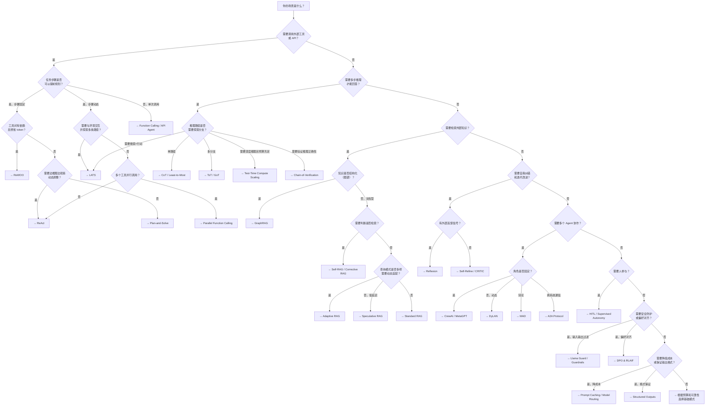

---

## 二、场景-模式适配矩阵

下表按 **场景大类** 列出推荐模式。⭐ = 强烈推荐，✓ = 推荐，○ = 可选增强。

### 对话与交互类

| 模式 | 智能客服 | 长对话助手 | 角色扮演 | 通用问答 |
|------|:---:|:---:|:---:|:---:|
| ReAct | ⭐ | ○ | | ⭐ |
| Function Calling | ⭐ | ○ | | ✓ |
| Structured Outputs | ✓ | | | ⭐ |
| MemGPT | ○ | ⭐ | ⭐ | ✓ |
| Letta | ○ | ⭐ | ✓ | ✓ |
| Generative Agents | | ✓ | ⭐ | |
| Episodic Memory | ○ | ✓ | ✓ | |
| RAG-based Memory | ✓ | ✓ | | ⭐ |
| Guardrails | ⭐ | ○ | | ✓ |
| Llama Guard | ⭐ | ○ | | ✓ |
| HITL | ✓ | | | ○ |
| Routing / MoE | ⭐ | | | ✓ |

### 推理与决策类

| 模式 | 数学推理 | 逻辑推理 | 复杂决策 | 创意生成 |
|------|:---:|:---:|:---:|:---:|
| CoT | ⭐ | ⭐ | ✓ | |
| ToT | ✓ | ⭐ | ⭐ | ✓ |
| GoT | ○ | ✓ | ⭐ | ✓ |
| Self-Consistency | ⭐ | ✓ | ○ | |
| PoT (程序化思维) | ⭐ | | | |
| Step-Back | ✓ | ✓ | ○ | |
| Least-to-Most | ✓ | ⭐ | ✓ | |
| Analog Prompting | ✓ | ✓ | ○ | ⭐ |
| LATS | ✓ | ✓ | ⭐ | |
| Self-Discover | ✓ | ⭐ | ✓ | |
| Test-Time Compute Scaling | ⭐ | ⭐ | ⭐ | |
| Chain-of-Verification | ⭐ | ⭐ | ✓ | |
| Self-Refine | ○ | ○ | ✓ | ⭐ |

### 信息检索与知识类

| 模式 | 文档问答 | 知识图谱问答 | 实时信息检索 | 多跳推理 |
|------|:---:|:---:|:---:|:---:|
| Standard RAG | ⭐ | | ✓ | |
| Self-RAG | ✓ | | ✓ | ✓ |
| Corrective RAG | ✓ | | ⭐ | ✓ |
| GraphRAG | | ⭐ | | ✓ |
| HyDE | ✓ | | | ⭐ |
| Self-Ask | ○ | | | ⭐ |
| FLARE | ✓ | | ⭐ | ✓ |
| Active RAG | ✓ | | ⭐ | ○ |
| Speculative RAG | ⭐ | | ✓ | ○ |
| Adaptive RAG | ✓ | | ⭐ | ✓ |

### 执行与自动化类

| 模式 | 代码生成 | Web 自动化 | 任务编排 | 工具链调用 |
|------|:---:|:---:|:---:|:---:|
| ReAct | ⭐ | ⭐ | ✓ | ✓ |
| Code Interpreter | ⭐ | | ✓ | |
| Computer Use/GUI | | ⭐ | | |
| ReWOO | ○ | ✓ | ⭐ | ⭐ |
| Plan-and-Solve | ✓ | ○ | ⭐ | ✓ |
| LLM+P | | | ⭐ | |
| ADaPT | | | ⭐ | ✓ |
| Parallel Function Calling | | ✓ | ✓ | ⭐ |

### 协作与编排类

| 模式 | 软件开发 | 辩论共识 | 任务分发 | 对话式开发 |
|------|:---:|:---:|:---:|:---:|
| AutoGen | ⭐ | ✓ | ✓ | |
| MetaGPT | ⭐ | | ✓ | |
| CrewAI | ✓ | | ⭐ | |
| MoA | | ⭐ | | |
| MAD | | ⭐ | | |
| DyLAN | | ✓ | ✓ | |
| Swarm | | | ⭐ | |
| ChatDev | | | | ⭐ |
| A2A Protocol | | | ⭐ | |
| Orchestrator-Workers（非模式体系，来自Anthropic博客） | | | ⭐ | |

### 生产与运维类

| 模式 | 质量评估 | 成本控制 | 安全防护 | 上线部署 |
|------|:---:|:---:|:---:|:---:|
| LLM-as-a-Judge | ⭐ | | | ✓ |
| Trajectory Evaluation | ⭐ | | | ✓ |
| Adversarial Testing | ✓ | | ⭐ | ✓ |
| Tracing & Logging | | | | ⭐ |
| Cost Monitoring | | ⭐ | | ⭐ |
| Caching | | ⭐ | | ✓ |
| Prompt Caching & Batch API | | ⭐ | | ✓ |
| Model Routing | | ⭐ | | ✓ |
| Constitutional AI | | | ⭐ | ✓ |
| DPO & RLAIF | | | ⭐ | ✓ |
| Llama Guard | | | ⭐ | ✓ |
| Red Teaming | | | ⭐ | ✓ |
| Supervised Autonomy | | | ✓ | ⭐ |

---

## 三、典型应用场景详解

### 场景 1：智能客服系统

📖 **故事开场**：

> 2024年双11，某电商平台退款咨询量暴涨10倍。客服团队80人三班倒还是处理不过来，用户等了40分钟才接通，怒气冲冲地给了差评。老板拍桌子："上AI！"——但裸LLM当客服？看看会怎样。

💥 **翻车现场**（裸LLM当客服）：

```
用户：我要退款，订单号 DD202411110001
Agent：好的，我帮您处理退款。请问退款原因是什么？
用户：商品质量问题，衣服破了个洞
Agent：非常抱歉！我马上给您全额退款200元到原支付账户。
用户：好的
Agent：退款已发起，预计3-5个工作日到账。
（实际：该商品是特价清仓款，不支持7天无理由退货。Agent不知道退款政策，直接退了200元。老板看了账单想哭。）
```

✨ **救场现场**（Router + Function Calling + Corrective RAG + Guardrails + HITL）：

```
用户：我要退款，订单号 DD202411110001
Agent：[Router识别：退款类工单 → 退款Agent]
       [Function Calling：查询订单DD202411110001 → 特价清仓款，¥200]
       [Corrective RAG：检索退款政策 → "特价清仓款不支持7天无理由，质量问题需提供照片"]
Agent：我查到您的订单是特价清仓款。根据退款政策，此类商品不支持无理由退货，
       但如果是质量问题可以办理。请问您能提供商品破损的照片吗？
用户：可以 [发照片]
Agent：[Guardrails检查：照片已收到，未超权承诺]
       [HITL：¥200退款需主管确认 → 推送审核]
       照片已收到，我已提交退款申请给主管审核，预计10分钟内给您结果。
（结果：合规退款，老板安心，用户满意）
```

**场景描述**：7×24 小时自动应答用户咨询，处理退款、物流、技术支持等，必要时转人工。

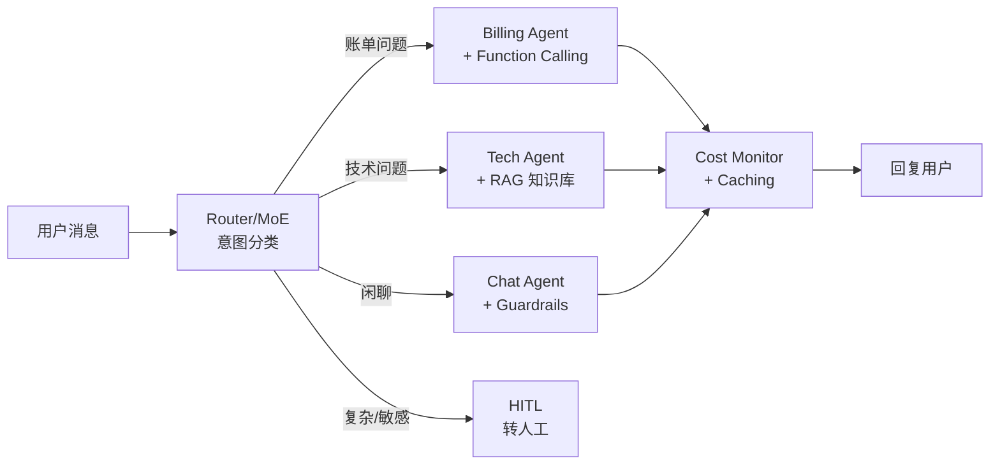

| 层次 | 推荐模式 | 作用 |
|------|---------|------|
| **入口路由** | 6.4 Router/MoE | 按意图分发到专门 Agent |
| **工具调用** | 8.2 Function Calling | 查询订单、发起退款等 |
| **知识检索** | 3.3 Corrective RAG | 检索 FAQ 和产品文档，检索结果经校验后使用，避免幻觉编造政策 |
| **安全防护** | 7.2 Guardrails | 过滤不当内容、限制话题范围 |
| **人工接管** | 10.1 HITL | 敏感操作需人工确认 |
| **成本优化** | 12.3 Caching | 高频问题缓存命中 |
| **监控** | 12.1 Tracing | 记录每通对话链路 |

**典型组合配方**：Router + Function Calling + RAG + Guardrails + Caching

---

### 场景 2：代码开发助手

📖 **故事开场**：

> 程序员小王接到需求："写一个Excel数据清洗脚本"。他让GPT直接生成代码，跑了一下——报错。改了再跑——又报错。来回折腾2小时，小王怀疑人生。问题不在GPT，在于没有"先计划、再执行、后验证"的流程。

💥 **翻车现场**（裸LLM直接写代码）：

```
用户：写一个Python脚本，清洗Excel数据，去重、填空值、标准化日期格式
Agent：好的，这是代码：
       import pandas as pd
       df = pd.read_excel("data.xlsx")
       df = df.drop_duplicates()
       df = df.fillna(0)
       df['date'] = pd.to_datetime(df['date'])
       df.to_excel("cleaned.xlsx")
用户：[运行] 报错了：KeyError: 'date'
Agent：抱歉，可能列名不对，改成 df['日期'] 试试？
用户：[运行] 又报错：ValueError: 日期格式不统一，有"2024-01-01"也有"2024/1/1"
Agent：抱歉，那加个 format 参数...
（来回5轮，小王崩溃）
```

✨ **救场现场**（Plan-and-Solve + Code Interpreter + CRITIC + Self-Refine）：

```
用户：写一个Python脚本，清洗Excel数据，去重、填空值、标准化日期格式
Agent：[Plan-and-Solve：先制定计划]
       计划：
       1. 先读取Excel，检查列名和数据类型
       2. 去重
       3. 分析空值分布，选择合适的填充策略
       4. 检测日期列的所有格式，统一转换
       5. 输出清洗报告
       
       [Code Interpreter：执行步骤1]
       列名：['id', '名称', '日期', '金额']
       日期列有3种格式：'2024-01-01', '2024/1/1', '01-01-2024'
       
       [CRITIC：验证] 日期格式确实不统一，需要format='mixed'
       
       [Code Interpreter：执行完整清洗脚本]
       [Self-Refine：检查输出] 清洗完成，去重23行，填充空值15个，日期已统一
       
       代码和清洗报告已生成。日期列用了 format='mixed' 处理多种格式。
（一次成功，小王感动哭了）
```

**场景描述**：辅助开发者编写、调试、重构代码，能执行代码并验证结果。

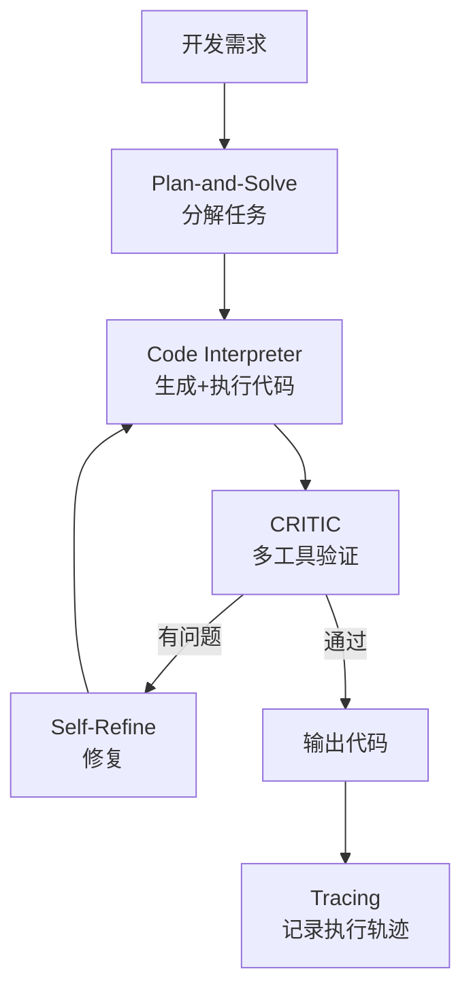

| 层次 | 推荐模式 | 作用 |
|------|---------|------|
| **任务分解** | 2.6 Plan-and-Solve | 把"实现一个功能"拆为多个子任务 |
| **代码执行** | 8.4 Code Interpreter | 生成代码并运行验证 |
| **质量验证** | 9.3 CRITIC | 用测试、lint 等工具验证代码 |
| **迭代修复** | 9.1 Self-Refine | 根据测试反馈自动修复 |
| **复杂调试** | 1.13 LATS | 多路径探索调试方案 |
| **反思学习** | 9.2 Reflexion | 记录调试经验，避免重复犯错 |
| **可观测** | 12.1 Tracing | 记录代码生成-执行-修复全链路 |

**典型组合配方**：Plan-and-Solve + Code Interpreter + CRITIC + Self-Refine

---

### 场景 3：知识库问答

📖 **故事开场**：

> 某公司花50万建了企业知识库，用了Standard RAG。员工问"年假怎么折算"，Agent从2019年的旧制度里找到了答案——但2024年政策早改了。员工按旧制度请了假，HR差点气晕。问题出在：检索到了，但没验证时效性和准确性。

💥 **翻车现场**（Standard RAG，不验证）：

```
用户：年假怎么折算？
Agent：[Standard RAG：检索到2019年制度]
       根据公司制度，年假按入职年限折算，不满一年按月折算，
       离职时未休年假按日工资300%补偿。
用户：好的，那我离职时能拿不少钱
（实际：2024年新制度改为200%，员工按300%预期，离职时大吵一架）
```

✨ **救场现场**（HyDE + Corrective RAG + Self-Ask + LLM-as-a-Judge）：

```
用户：年假怎么折算？
Agent：[HyDE：生成假设答案 → "年假折算按入职年限..."]
       [Corrective RAG：检索到2个文档 - 2019版和2024版]
       [Corrective RAG：评估相关性 → 2024版更相关，2019版已废止]
       [Self-Ask：拆分子问题 → "最新年假制度是什么？" + "折算规则是什么？"]
       
       根据2024年最新《年假管理制度》（2024年3月更新）：
       - 按入职年限折算，不满一年按月折算
       - 离职时未休年假按日工资200%补偿
       
       [LLM-as-a-Judge：评估答案质量 → 引用了最新文档，通过]
       
       ⚠️ 注意：此政策于2024年3月更新，旧版（2019年）已废止。
（员工拿到了正确答案，HR松了口气）
```

**场景描述**：基于企业内部文档（PDF、Wiki、Confluence）回答员工问题，要求答案准确、可溯源。

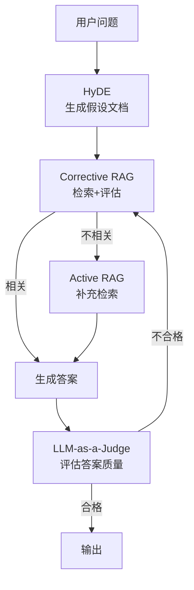

| 层次 | 推荐模式 | 作用 |
|------|---------|------|
| **查询优化** | 3.7 HyDE | 生成假设文档提升检索召回 |
| **检索增强** | 3.3 Corrective RAG | 检索后评估相关性，纠正低质量结果 |
| **主动检索** | 3.5 Active RAG | 检索不足时主动追加检索 |
| **多跳推理** | 3.8 Self-Ask | 分解复杂问题为子问题逐个检索 |
| **知识图谱** | 3.6 GraphRAG | 实体关系密集型知识用图谱 |
| **答案评估** | 11.1 LLM-as-a-Judge | 自动评估答案质量 |
| **缓存** | 12.3 Caching | 高频问题缓存 |

**典型组合配方**：HyDE + Corrective RAG + Self-Ask + LLM-as-a-Judge

---

### 场景 4：数据分析 Agent

📖 **故事开场**：

> 运营总监问："上个月华东区哪个品类下滑最严重？"数据分析师小李打开SQL，写了半天，跑出来一个数字。总监又问："那环比呢？同比呢？"小李又写了半天。如果Agent能自己分解问题、写SQL、画图、写分析——小李就能去喝咖啡了。

💥 **翻车现场**（裸LLM直接写SQL）：

```
用户：上个月华东区哪个品类下滑最严重？
Agent：SELECT category, SUM(amount) FROM sales 
       WHERE region='华东' AND month='2024-10' 
       GROUP BY category ORDER BY amount ASC LIMIT 1
用户：这个只看了10月，我要环比
Agent：好的，加上9月数据对比...
       （又写了一大段SQL，但忘了考虑退货订单，数字不对）
用户：数字对不上啊？报表显示华东10月销售500万，你查出来480万
Agent：可能需要加个条件... WHERE status='已完成' AND is_return=0
（来回调试3轮，总监等得不耐烦走了）
```

✨ **救场现场**（Least-to-Most + Code Interpreter + CRITIC + Prompt Chaining）：

```
用户：上个月华东区哪个品类下滑最严重？
Agent：[Least-to-Most：分解步骤]
       1. 查询华东区9-10月各品类销售额（排除退货）
       2. 计算环比变化
       3. 找出下滑最大的品类
       4. 生成可视化图表
       5. 撰写分析洞察
       
       [Code Interpreter：执行SQL → 获取数据]
       [CRITIC：验证 → 确认已排除退货订单，数字与报表一致]
       [Prompt Chaining Gate 1：数据准确？✅通过]
       
       [Code Interpreter：计算环比 → 生成图表]
       [Prompt Chaining Gate 2：图表合理？✅通过]
       
       分析结果：
       📉 家电品类环比下滑23%（9月¥120万 → 10月¥92万），下滑最严重
       📊 [图表：各品类环比变化柱状图]
       
       可能原因：10月无大促活动，家电为耐用品受促销影响大
       建议：11月可针对性推出家电以旧换新活动
（总监满意，小李去喝咖啡了）
```

**场景描述**：接收自然语言数据分析需求，自动查询数据库、生成图表、撰写分析报告。

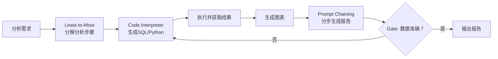

| 层次 | 推荐模式 | 作用 |
|------|---------|------|
| **任务分解** | 1.7 Least-to-Most | 把分析需求拆为查询→统计→可视化→报告 |
| **代码执行** | 8.4 Code Interpreter | 生成并执行 SQL/Python |
| **流程编排** | 6.8 Prompt Chaining | 查询→分析→可视化→报告，每步带门控 |
| **自我验证** | 9.3 CRITIC | 验证数据准确性 |
| **结构化输出** | 6.5 Structured Output | 确保输出格式规范 |
| **成本控制** | 12.4 Model Routing | 简单查询用小模型，复杂分析用大模型 |

**典型组合配方**：Least-to-Most + Code Interpreter + Prompt Chaining + Model Routing

---

### 场景 5：自动化任务执行

📖 **故事开场**：

> 创业公司老板给AutoGPT一个目标："帮我调研竞品并写一份分析报告"。Agent开始自主工作——搜索、整理、分析、写报告。但跑到一半卡住了：某个网页打不开，Agent不知道怎么办，原地转圈3小时烧了$50 API费。自主执行很酷，但不会"随机应变"就是烧钱机器。

💥 **翻车现场**（纯AutoGPT，不会应变）：

```
[目标：调研竞品A公司，写分析报告]
Agent：[步骤1] 搜索"A公司 产品介绍" → 获取3篇结果 ✅
       [步骤2] 访问A公司官网 → 403 Forbidden ❌
       [步骤3] 重试访问A公司官网 → 403 Forbidden ❌
       [步骤4] 再次重试访问A公司官网 → 403 Forbidden ❌
       [步骤5] 再次重试... 
       （循环20次，烧了$50，报告一个字没写）
```

✨ **救场现场**（AutoGPT + ReAct + ADaPT + Reflexion + Supervised Autonomy）：

```
[目标：调研竞品A公司，写分析报告]
Agent：[步骤1] 搜索"A公司 产品介绍" → 获取3篇结果 ✅
       [步骤2] 访问A公司官网 → 403 Forbidden ❌
       [ReAct：观察→思考] 官网被反爬了，换个策略
       [ADaPT：动态调整计划] 改为：搜索第三方报道+行业报告+用户评价
       [步骤3] 搜索"A公司 融资 行业报告" → 获取5篇 ✅
       [步骤4] 搜索"A公司 用户评价 优缺点" → 获取8篇 ✅
       [Reflexion：记录经验] "官网被反爬时，改用第三方信息源"
       [步骤5] 整理信息，撰写报告 ✅
       
       [Supervised Autonomy：报告涉及竞品定价策略，置信度85%]
       ⚠️ 以下内容需您确认后输出：竞品定价分析部分
（报告完成，花费$2.3，老板满意）
```

**场景描述**：给定一个高层目标，Agent 自主分解任务、调用工具、完成目标（如 AutoGPT 式）。

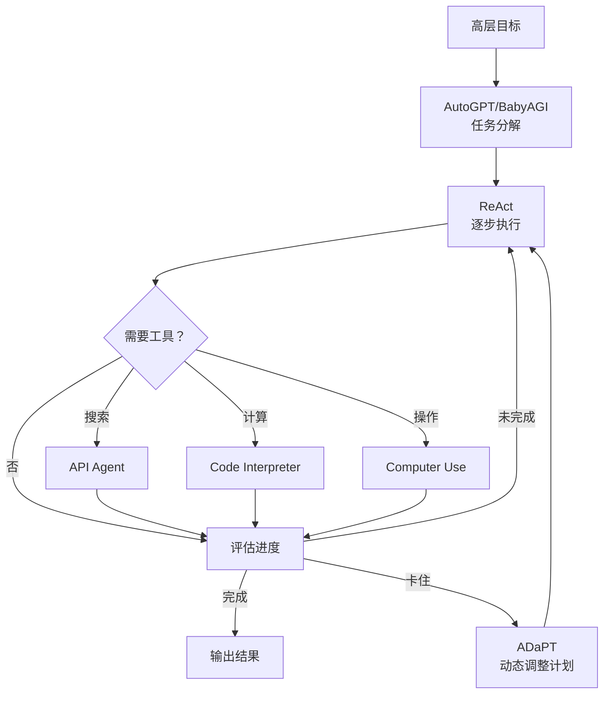

| 层次 | 推荐模式 | 作用 |
|------|---------|------|
| **目标分解** | 2.1 AutoGPT/BabyAGI | 把高层目标拆为可执行任务 |
| **执行循环** | 8.1 ReAct | 推理-行动-观察循环 |
| **动态调整** | 2.5 ADaPT | 遇到困难时重新规划 |
| **GUI 操作** | 8.6 Computer Use | 需要操作软件界面时 |
| **高效工具链** | 2.8 ReWOO | 工具调用多时大幅省 token |
| **反思改进** | 9.2 Reflexion | 失败后总结经验再试 |
| **人机协作** | 10.4 Supervised Autonomy | 高风险操作需人工确认 |

**典型组合配方**：AutoGPT + ReAct + ADaPT + Reflexion + Supervised Autonomy

---

### 场景 6：多 Agent 协作开发

📖 **故事开场**：

> 一个人写全栈太累。如果PM、架构师、前端、后端、测试都是AI Agent，能不能像真正的团队一样协作开发？MetaGPT说能。但当"架构师Agent"和"开发Agent"对技术方案有分歧时，谁来拍板？——需要"辩论"机制。

💥 **翻车现场**（多Agent无协调）：

```
PM Agent：需求是"做一个待办事项App"
架构师 Agent：建议用 React + Node.js + PostgreSQL
开发 Agent A：好的，我用 React 写前端
开发 Agent B：我觉得 Vue 更好，我用 Vue 写
开发 Agent C：后端我用 Python Flask
（三个开发各自为政，技术栈不统一，接口对不上，代码合不到一起）
测试 Agent：我测试哪个版本？？？
```

✨ **救场现场**（CrewAI + MAD + CRITIC）：

```
PM Agent：需求是"做一个待办事项App"
[CrewAI：分配角色]
  - 架构师：负责技术选型和接口定义
  - 前端开发：负责UI实现
  - 后端开发：负责API实现  
  - 测试：负责质量验证

架构师 Agent：技术选型 React + Node.js + PostgreSQL，接口定义如下...
前端开发：收到，按接口文档开发
后端开发：收到，按接口文档开发

[前端和后端对某个接口设计有分歧]
[MAD：辩论机制启动]
  正方（前端）：接口应该返回完整对象，前端渲染方便
  反方（后端）：应该分页返回，性能更好
  裁判 Agent：综合双方意见，首页返回完整对象，列表分页返回
  → 双方接受，继续开发

测试 Agent：[CRITIC：多工具验证] 
  单元测试 ✅ | 接口测试 ✅ | UI测试 ✅
  发现1个bug → 推回开发修复
开发修复 → 测试通过 → 交付
（团队协作顺畅，代码能跑）
```

**场景描述**：模拟软件团队，多个 Agent 扮演不同角色（PM、架构师、开发、测试）协作完成软件开发。

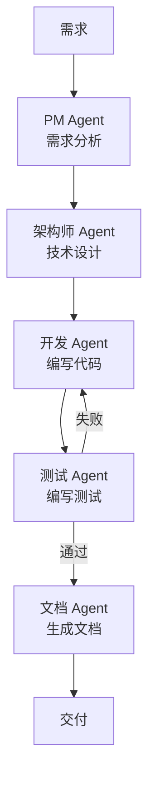

| 层次 | 推荐模式 | 作用 |
|------|---------|------|
| **框架选择** | 4.3 CrewAI / 4.2 MetaGPT | 角色定义+任务分发+流程编排 |
| **对话式开发** | 4.8 ChatDev | 角色间对话驱动开发流程 |
| **代码执行** | 8.4 Code Interpreter | 开发 Agent 执行代码 |
| **质量验证** | 9.3 CRITIC | 测试 Agent 多工具验证 |
| **辩论优化** | 4.5 MAD | 设计方案有分歧时辩论择优 |
| **记忆共享** | 5.4 RAG-based Memory | 共享项目上下文和决策记录 |
| **评估** | 11.3 Trajectory Evaluation | 评估协作流程效率 |

**典型组合配方**：CrewAI + Code Interpreter + CRITIC + MAD（设计阶段）

---

### 场景 7：长对话伴侣 / 角色扮演

📖 **故事开场**：

> 用户和AI伴侣聊了一个月，什么都聊——工作烦恼、生活琐事、童年回忆。但第二天AI突然"失忆"了，把用户当陌生人。用户心凉了："原来你什么都不记得。"——长对话的核心不是能聊，而是能记住。

💥 **翻车现场**（无记忆管理，上下文窗口满了就忘）：

```
[第1天]
用户：我叫小明，在互联网公司上班
Agent：你好小明！互联网公司工作一定很忙吧

[第30天]
用户：今天加班到10点，好累
Agent：加班确实辛苦。请问您是做什么工作的呢？
用户：？？？我不是告诉过你我在互联网公司上班吗
Agent：抱歉，我不记得了。请问您叫什么名字？
用户：......（心凉了，卸载App）
```

✨ **救场现场**（MemGPT + Generative Agents + Reflection-based Memory）：

```
[第1天]
用户：我叫小明，在互联网公司上班
Agent：你好小明！互联网公司工作一定很忙吧
[MemGPT：将"小明、互联网公司"存入核心记忆]

[第15天]
用户：最近项目上线，天天加班
Agent：[Generative Agents：检索记忆 → 小明在互联网公司]
       你们互联网公司确实项目上线时特别忙。上次你说项目在冲刺阶段，
       这次上线顺利吗？
[Reflection-based Memory：定期反思 → "小明最近工作压力大，关心他的工作生活平衡"]

[第30天]
用户：今天加班到10点，好累
Agent：[检索记忆 → 小明、互联网公司、最近项目上线、工作压力大]
       小明，这个月你一直在加班，辛苦了。项目上线后有没有稍微轻松一点？
       别忘了照顾好自己的身体，上次你说想周末去爬山放松，去了吗？
用户：你还记得我想去爬山的事！😭 太感动了
（用户留存率大幅提升）
```

**场景描述**：具有持久记忆和人格特征的 AI 伴侣，能记住历史对话、发展关系、保持角色一致性。

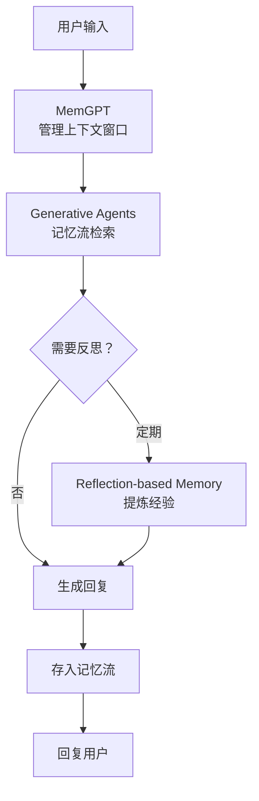

| 层次 | 推荐模式 | 作用 |
|------|---------|------|
| **上下文管理** | 5.1 MemGPT | 突破上下文窗口限制 |
| **记忆系统** | 5.2 Generative Agents | 记忆流+三维检索+定期反思 |
| **经验提炼** | 5.3 Reflection-based Memory | 定期总结对话经验 |
| **经历记录** | 5.5 Episodic Memory | 记录具体对话经历 |
| **情感增强** | 1.12 Emotion Prompting | 增强情感理解能力 |
| **安全防护** | 7.2 Guardrails | 防止不当内容 |

**典型组合配方**：MemGPT + Generative Agents + Reflection-based Memory + Emotion Prompting

---

### 场景 8：研究助手 / 深度调研

📖 **故事开场**：

> 研究生要写文献综述，主题是"大模型在医疗影像中的应用"。她打开PubMed，搜到2000篇论文，崩溃了。逐篇读完要3个月，导师说下周要交。——如果Agent能自动检索、筛选、提取、综述呢？

💥 **翻车现场**（Standard RAG，简单检索）：

```
用户：帮我综述"大模型在医疗影像中的应用"
Agent：[Standard RAG：检索到5篇论文]
       根据检索到的论文，大模型在医疗影像中的应用包括：
       1. 肺部CT诊断（论文A）
       2. 眼底图像分析（论文B）
       ...
       （只检索了5篇，遗漏了195篇重要文献；没有提取具体数据；
        没有分析趋势；综述像流水账，导师看了直摇头）
```

✨ **救场现场**（Self-Ask + FLARE + GraphRAG + Map-Reduce + Self-Refine）：

```
用户：帮我综述"大模型在医疗影像中的应用"
Agent：[Self-Ask：分解子问题]
       → "哪些大模型用于医疗影像？" 
       → "在哪些影像模态中应用？"（CT/MRI/X光/病理）
       → "性能如何？与传统方法对比？"
       → "主要挑战和未来方向？"
       
       [FLARE：前瞻式检索]
       检索PubMed → 获取500篇 → 筛选相关200篇
       写综述时发现"病理影像"领域文献不够 → 主动追加检索
       
       [GraphRAG：构建知识图谱]
       模型-模态-数据集-性能 关系图谱
       发现"ViT在病理切片上表现突出"这一跨论文趋势
       
       [Map-Reduce：并行分析]
       200篇论文分20组并行分析 → 提取关键数据 → 汇总
       
       [Self-Refine：多轮优化]
       初稿 → 检查逻辑连贯性 → 补充对比表格 → 优化引用格式
       
       综述完成（8000字，引用87篇，含3个对比表格和1个趋势图）
       导师评价：比大部分研究生的综述都好。
```

**场景描述**：给定研究主题，Agent 自主检索文献、整理信息、发现关联、生成综述报告。

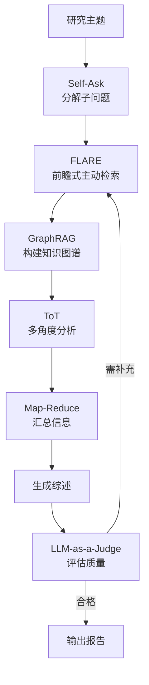

| 层次 | 推荐模式 | 作用 |
|------|---------|------|
| **问题分解** | 3.8 Self-Ask | 把研究主题分解为子问题 |
| **主动检索** | 3.9 FLARE | 生成中检测信息缺口主动检索 |
| **知识关联** | 3.6 GraphRAG | 构建实体关系图谱 |
| **多角度分析** | 1.2 ToT | 从多个角度探索分析 |
| **并行汇总** | 6.3 Map-Reduce | 并行处理多个子主题后汇总 |
| **质量评估** | 11.1 LLM-as-a-Judge | 评估综述质量 |
| **迭代改进** | 9.1 Self-Refine | 根据评估反馈改进报告 |

**典型组合配方**：Self-Ask + FLARE + GraphRAG + ToT + Map-Reduce + Self-Refine

---

### 场景 9：内容创作与写作

📖 **故事开场**：

> 市场部要写一篇产品软文。文案小张让GPT直接写，出来的东西像说明书，干巴巴的。改了5版还是不满意。问题不是GPT不会写，是没有"先大纲→再正文→后润色"的流程，也没有"自我审视"的环节。

💥 **翻车现场**（裸LLM一次性生成）：

```
用户：写一篇智能手表的营销软文，主打健康监测功能
Agent：[一次性生成]
       智能手表是一款革命性的产品。它具有心率监测、血氧检测、
       睡眠追踪等功能。购买智能手表，享受健康生活。
       欢迎选购我们的产品。
用户：太干巴了，像产品说明书
Agent：好的，我加点感情...
       智能手表，您贴心的健康伙伴。它不仅能监测心率，还能...
       （改了5版，还是像AI写的，没有"人味"）
```

✨ **救场现场**（Prompt Chaining + Self-Refine + Emotion Prompting + Pairwise Comparison）：

```
用户：写一篇智能手表的营销软文，主打健康监测功能
Agent：[Prompt Chaining Step 1：生成大纲]
       大纲：
       1. 开头：一个加班猝死的新闻引入（情感钩子）
       2. 痛点：年轻人亚健康问题
       3. 解决方案：智能手表健康监测
       4. 使用场景：心率异常预警的真实故事
       5. 结尾：健康是最重要的投资
       [Gate：大纲有情感钩子？✅通过]
       
       [Prompt Chaining Step 2：扩展正文]
       [Emotion Prompting：加入情感prompt → "想象读者是你关心的人"]
       [Gate：正文有故事感？✅通过]
       
       [Prompt Chaining Step 3：润色]
       [Self-Refine：自我审视 → "第二段太像广告，改成故事叙述"]
       [Gate：不像AI写的？✅通过]
       
       [Pairwise Comparison：生成2个版本，择优输出]
       
       最终输出：
       "凌晨2点，小李的心脏突然狂跳。他摸出手机想叫救护车，
       但手指已经不听使唤。幸运的是，手腕上的智能手表检测到
       心率异常，自动拨打了120..."
       （市场部总监：这才有"人味"！）
```

**场景描述**：辅助撰写文章、营销文案、技术文档等，需要多轮打磨优化。

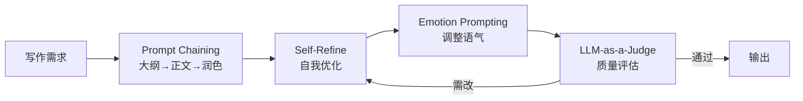

| 层次 | 推荐模式 | 作用 |
|------|---------|------|
| **流程编排** | 6.8 Prompt Chaining | 大纲→正文→润色，每步带门控 |
| **推理增强** | 1.6 Step-Back | 写作前先理解核心主题 |
| **自我优化** | 9.1 Self-Refine | 多轮自我批判和改进 |
| **情感调整** | 1.12 Emotion Prompting | 调整文案情感色彩 |
| **质量评估** | 11.2 Pairwise Comparison | A/B 比较多个版本择优 |
| **风格一致** | 5.4 RAG-based Memory | 检索历史作品保持风格 |

**典型组合配方**：Prompt Chaining + Self-Refine + Emotion Prompting + Pairwise Comparison

---

### 场景 10：决策支持系统

📖 **故事开场**：

> CEO要决定"是否进入东南亚市场"。问了三个顾问，三个不同答案。问了AI，AI给了模棱两可的建议"各有利弊"。CEO需要的是：多方案对比、风险评估、辩论择优——而不是"各有利弊"的废话。

💥 **翻车现场**（裸LLM直接回答）：

```
用户：我们应该进入东南亚市场吗？
Agent：进入东南亚市场各有利弊。
       优势：市场增长快、人口年轻化
       劣势：竞争激烈、文化差异大
       建议：可以根据实际情况综合考虑。
       （CEO：废话！我要的是决策建议，不是"各有利弊"）
```

✨ **救场现场**（Step-Back + ToT + MAD + Self-Consistency + HITL + Red Teaming）：

```
用户：我们应该进入东南亚市场吗？
Agent：[Step-Back：退一步看本质]
       核心问题不是"要不要进入"，而是"以什么方式进入风险最小收益最大"
       
       [ToT：生成3条战略路径]
       路径A：全资自营进入（高控制高风险）
       路径B：合资合作进入（中控制中风险）  
       路径C：收购当地企业（快速但整合难）
       
       [MAD：正反方辩论]
       正方：路径B最优，合资可借力本地伙伴降低文化风险
       反方：路径B决策慢，可能错失窗口期，路径C更快
       裁判：综合评估，路径B为首选，C为备选
       
       [Self-Consistency：多次分析一致性验证]
       3次独立分析均推荐路径B → 一致性高
       
       [Red Teaming：压力测试]
       "如果合资伙伴突然撤资怎么办？" → 建议合同设退出条款
       "如果当地政策突变怎么办？" → 建议分阶段投入降低风险
       
       [HITL：提交CEO最终决策]
       
       建议：以路径B（合资合作）进入东南亚市场
       - 首选合作伙伴：XXX（本地市占率第3）
       - 风险缓释：分阶段投入，合同设退出条款
       - 预期ROI：18个月回本
       - 备选方案：若3个月内未达成合资，转路径C
       
       CEO：这个建议我可以用。
```

**场景描述**：辅助管理者进行复杂决策，需要多方案对比、风险评估、权衡分析。

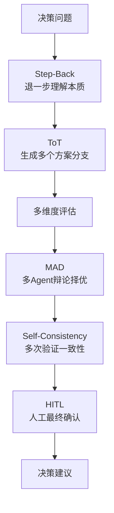

| 层次 | 推荐模式 | 作用 |
|------|---------|------|
| **问题理解** | 1.6 Step-Back | 退一步看问题本质 |
| **方案生成** | 1.2 ToT | 生成多个决策分支 |
| **方案对比** | 1.3 GoT | 方案间交叉融合 |
| **辩论择优** | 4.5 MAD | 多 Agent 辩论选出最优方案 |
| **一致性验证** | 1.4 Self-Consistency | 多次采样验证决策稳定性 |
| **人工确认** | 10.1 HITL | 关键决策需人工拍板 |
| **风险检测** | 7.6 Red Teaming | 压力测试决策方案 |

**典型组合配方**：Step-Back + ToT + MAD + Self-Consistency + HITL + Red Teaming

---

## 四、真实约束维度

真实业务场景中，模式选型不是"哪个好"而是"哪个能在约束下跑通"。以下 5 个维度是生产环境的核心约束：

### 4.1 延迟要求

| 级别 | 要求 | 可用模式 | 不可用模式 |
|------|------|---------|-----------|
| **实时** | < 500ms | Model Routing（小模型）、Caching、规则引擎 | LATS、ToT、多轮 ReAct、Map-Reduce |
| **准实时** | < 3s | ReAct（单轮）、Function Calling、Router/MoE、Standard RAG | LATS、GoT、多 Agent 协作、Self-Consistency（>3次） |
| **交互式** | < 10s | Self-Consistency、Corrective RAG、Self-Refine（1-2轮） | LATS（>5轮）、MAD（多轮辩论） |
| **异步** | < 5 分钟 | LATS、ToT、Map-Reduce、MAD、多 Agent 协作、Prompt Chaining | 无限制 |

### 4.2 准确率门槛

| 级别 | 要求 | 必须搭配的模式 | 典型场景 |
|------|------|--------------|---------|
| **容错** | > 85% | 基础 RAG + CoT | 内容创作、推荐、闲聊 |
| **标准** | > 92% | Corrective RAG + Self-Refine | 客服、工单分派、数据分析 |
| **高精** | > 95% | Self-Consistency + CRITIC + HITL | 信贷审批、辅助诊断、合同审查 |
| **极精** | > 99% | Self-Consistency（>5次）+ HITL + Tracing + 审计 | 反欺诈、用药指导、支付决策 |

### 4.3 成本预算

| 级别 | 单次成本 | 必须搭配 | 可选优化 |
|------|---------|---------|---------|
| **极低成本** | < ¥0.01 | Caching + Model Routing（小模型为主） | ReWOO（减少 LLM 调用） |
| **低成本** | < ¥0.1 | Caching + Model Routing | Prompt Chaining（小模型串联） |
| **中成本** | < ¥0.5 | Cost Monitor | 按需 Caching |
| **高成本可接受** | < ¥5 | 无强制 | 无限制 |

### 4.4 合规与安全

| 合规要求 | 必须搭配的模式 | 说明 |
|---------|--------------|------|
| **审计追溯** | Tracing + Structured Output | 每步决策可回溯，输出可审计 |
| **人工复核** | HITL + Supervised Autonomy | 关键决策必须人工确认 |
| **内容安全** | Guardrails + Constitutional AI | 输入输出过滤，价值观对齐 |
| **对抗防护** | Red Teaming + Prompt Injection Defense | 上线前红队测试，运行时注入防御 |
| **数据隐私** | Caching（脱敏后缓存）+ Tracing（脱敏日志） | PII 脱敏，数据不落明文 |
| **可解释性** | Step-Back + Structured Output + CoT | 决策过程透明可解释 |

### 4.5 系统集成

| 集成需求 | 推荐模式 | 说明 |
|---------|---------|------|
| **调用外部 API** | Function Calling / API Agent | 结构化调用，参数校验 |
| **查询数据库** | Code Interpreter（SQL）+ Guardrails | SQL 注入防护，权限检查 |
| **检索知识库** | RAG 系列（按场景选择变体） | 文档型用 Standard/Corrective，关系型用 GraphRAG |
| **操作 GUI 软件** | Computer Use / GUI Agent | 桌面自动化，RPA 替代 |
| **批量工具调用** | ReWOO / Parallel Function Calling | 省 token / 并行加速 |
| **消息队列异步** | Map-Reduce + Prompt Chaining | 异步并行处理流水线 |

### 约束驱动的选型流程

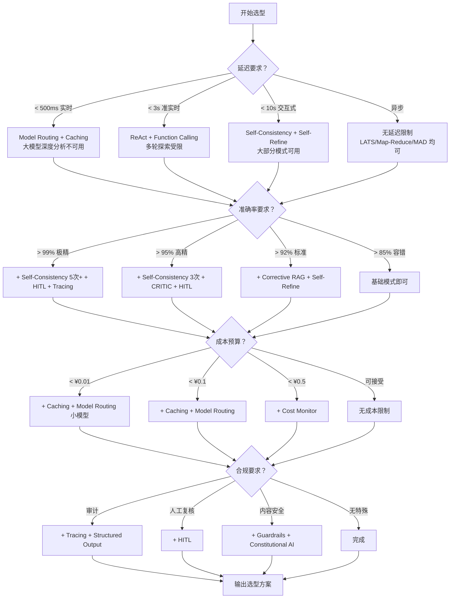

---

## 五、行业深度方案

以下 7 个行业方案已拆分为独立文档，每个包含 3 个具体业务子场景的深度方案（含真实约束表、系统架构图、模式选型映射、失败模式应对、快速启动配方）：

| 行业 | 文档 | 子场景数 | 核心特点 |
|------|------|:---:|---------|
| 🛒 电商/零售 | [行业方案_电商零售.md](行业方案_电商零售.md) | 3 | 高并发成本敏感、转化率导向、退款合规 |
| 🏦 金融 | [行业方案_金融.md](行业方案_金融.md) | 3 | 合规优先、可解释性、极低延迟反欺诈 |
| 💼 SaaS/企业服务 | [行业方案_SaaS企业服务.md](行业方案_SaaS企业服务.md) | 3 | 效率优先、深度集成、安全兜底 |
| 🏥 医疗健康 | [行业方案_医疗健康.md](行业方案_医疗健康.md) | 3 | 生命攸关、医生兜底、合规至上 |
| 🎓 教育 | [行业方案_教育.md](行业方案_教育.md) | 3 | 个性化学习、教师主导、公平可释 |
| ⚖️ 法律 | [行业方案_法律.md](行业方案_法律.md) | 3 | 合规底线、不替代律师、数据保密 |
| 🏭 制造 | [行业方案_制造.md](行业方案_制造.md) | 3 | 安全优先、可追溯性、数据深度融合 |

### 各行业子场景速览

**电商/零售**（[详情](行业方案_电商零售.md)）：
- 售后退款客服 → Router + Function Calling + Corrective RAG + Guardrails + HITL
- 商品导购推荐 → ReAct + HyDE + Episodic Memory + Model Routing
- 评价分析洞察 → Map-Reduce + Structured Output + Self-Consistency + Prompt Chaining

**金融**（[详情](行业方案_金融.md)）：
- 信贷审批辅助 → Step-Back + ToT + GraphRAG + Self-Consistency + HITL
- 智能投顾 → Router + ReAct + Corrective RAG + Guardrails + Constitutional AI
- 反欺诈实时检测 → Model Routing + Episodic Memory + ReWOO + Self-Consistency

**SaaS/企业服务**（[详情](行业方案_SaaS企业服务.md)）：
- 工单智能分派 → Router + Corrective RAG + Function Calling + HITL
- 数据分析助手 → Least-to-Most + Code Interpreter + CRITIC + Prompt Chaining
- 代码审查助手 → Map-Reduce + CRITIC + LLM-as-a-Judge + Pairwise Comparison

**医疗健康**（[详情](行业方案_医疗健康.md)）：
- 辅助诊断 → Step-Back + Corrective RAG + Self-Consistency + Self-Ask + HITL
- 医学文献综述 → Self-Ask + FLARE + GraphRAG + Map-Reduce + CRITIC
- 慢病随访 → MemGPT + Generative Agents + Episodic Memory + Emotion Prompting + HITL

**教育**（[详情](行业方案_教育.md)）：
- 个性化学习辅导 → ReAct + Least-to-Most + Episodic Memory + Self-Consistency + HITL
- 自动批改与反馈 → Map-Reduce + LLM-as-a-Judge + Self-Refine + Structured Output + Guardrails
- 教学内容生成 → Prompt Chaining + HyDE + Analog Prompting + CRITIC + Model Routing

**法律**（[详情](行业方案_法律.md)）：
- 合同审查与风险识别 → Corrective RAG + ReAct + Reflexion + Structured Output + HITL
- 案例检索与法律分析 → HyDE + GraphRAG + ReAct + Self-Consistency + Caching
- 法律咨询问答 → Router/MoE + Standard RAG + Guardrails + HITL + Model Routing

**制造**（[详情](行业方案_制造.md)）：
- 设备预测性维护 → ReWOO + Standard RAG + Function Calling + Reflexion + HITL
- 质量控制与缺陷检测 → Map-Reduce + Computer Use + Self-Consistency + Trajectory Evaluation + Model Routing
- 供应链优化 → AutoGPT/BabyAGI + GraphRAG + AutoGen + Self-Refine + Tracing

---

## 六、经典组合配方

以下是经过实践验证的经典模式组合，可直接套用：

### 配方 1：RAG 增强问答（最常用）

```
HyDE（查询优化）→ Corrective RAG（检索+纠错）→ Self-Consistency（多次验证）→ Caching（缓存）
```
- **适用**：企业知识库问答、文档问答、FAQ Bot
- **特点**：准确率高、可溯源、成本可控
- **复杂度**：⭐⭐ 中等

### 配方 2：自主任务执行（AutoGPT 式）

```
AutoGPT（目标分解）→ ReAct（执行循环）→ ADaPT（动态调整）→ Reflexion（反思学习）→ Supervised Autonomy（人工兜底）
```
- **适用**：自动化数据处理、批量任务执行
- **特点**：高度自主、能从失败中学习
- **复杂度**：⭐⭐⭐⭐ 高

### 配方 3：高质量代码生成

```
Plan-and-Solve（任务分解）→ Code Interpreter（执行验证）→ CRITIC（多工具检查）→ Self-Refine（迭代修复）
```
- **适用**：代码助手、自动化编程、Bug 修复
- **特点**：生成代码可执行、自动验证、迭代改进
- **复杂度**：⭐⭐⭐ 中高

### 配方 4：多 Agent 协作开发

```
CrewAI（角色编排）→ Code Interpreter（代码执行）→ MAD（设计辩论）→ CRITIC（质量验证）→ Trajectory Evaluation（流程评估）
```
- **适用**：复杂软件项目、需要多角色协作的任务
- **特点**：角色分工明确、辩论择优、全流程可追溯
- **复杂度**：⭐⭐⭐⭐⭐ 很高

### 配方 5：长记忆对话伴侣

```
MemGPT（上下文管理）→ Generative Agents（记忆流）→ Reflection-based Memory（经验提炼）→ Emotion Prompting（情感增强）
```
- **适用**：AI 伴侣、虚拟角色、长期私人助手
- **特点**：记忆持久、人格一致、情感丰富
- **复杂度**：⭐⭐⭐ 中高

### 配方 6：生产级安全防护

```
Constitutional AI（价值观对齐）→ Guardrails（输入输出过滤）→ Red Teaming（对抗测试）→ Prompt Injection Defense（注入防御）→ Tracing（全链路审计）
```
- **适用**：面向公众的 Agent 系统、敏感行业应用
- **特点**：多层防护、可审计、经过对抗测试
- **复杂度**：⭐⭐⭐⭐ 高

### 配方 7：成本优化方案

```
Model Routing（按难度选模型）→ Caching（缓存高频请求）→ ReWOO（减少 LLM 调用）→ Cost Monitor（实时监控）→ Prompt Chaining（小模型串联）
```
- **适用**：高并发场景、成本敏感型应用
- **特点**：可降低 50-80% API 成本
- **复杂度**：⭐⭐⭐ 中高

### 配方 8：复杂推理决策

```
Step-Back（理解本质）→ ToT/GoT（多路径探索）→ Self-Consistency（一致性验证）→ LATS（树搜索+环境反馈）→ HITL（人工确认）
```
- **适用**：战略决策、复杂问题求解、科研推理
- **特点**：探索充分、验证严格、有人工兜底
- **复杂度**：⭐⭐⭐⭐⭐ 很高

---

## 七、选型避坑指南

### ❌ 常见误区

| 误区 | 正确做法 |
|------|---------|
| 所有场景都上 ReAct | 简单任务用 CoT 或直接调用即可，ReAct 适合需要工具反馈的动态任务 |
| 追求最复杂的模式 | Anthropic 建议：能用简单 prompt 解决就不要加 Agent 复杂度 |
| 忽略成本监控 | 上线前必须接入 Cost Monitor + Caching，否则账单可能失控 |
| 多 Agent 一定比单 Agent 好 | 单个大模型 + 好的 prompt 往往优于多个小 Agent 的复杂编排 |
| RAG 就是向量检索 | 复杂知识关系用 GraphRAG，多跳推理用 Self-Ask，别只会 Standard RAG |
| Self-Refine 一定能提升质量 | 没有明确评估标准时，Self-Refine 可能越改越差（左右脑互搏） |
| 记忆越多越好 | 记忆过多会导致检索噪音增大，需要定期反思+遗忘机制 |

### ✅ 最佳实践

1. **从简单开始**：先用 CoT + RAG 解决 80% 的问题，再针对剩余 20% 引入复杂模式
2. **评估先行**：上线前用 LLM-as-a-Judge + Trajectory Evaluation 建立基线
3. **成本意识**：Model Routing + Caching 是生产环境的标配，不是可选项
4. **安全兜底**：面向用户的系统必须有 Guardrails + HITL，不能完全自主
5. **可观测性**：Tracing 不是可选项，没有 Tracing 的 Agent 系统无法调试
6. **渐进式自主**：从 Supervised Autonomy 开始，逐步提升自主级别，而非一步到 Full Auto
7. **组合而非堆砌**：选 3-5 个模式深度组合，优于选 10 个模式浅层堆砌

### 📊 复杂度 vs 收益矩阵

| 模式 | 实现复杂度 | 质量提升 | 成本影响 | 推荐优先级 |
|------|:---:|:---:|:---:|:---:|
| CoT | ⭐ | ⭐⭐⭐ | 低 | 🥇 首选 |
| Standard RAG | ⭐⭐ | ⭐⭐⭐ | 中 | 🥇 首选 |
| Function Calling | ⭐⭐ | ⭐⭐⭐ | 低 | 🥇 首选 |
| Self-Refine | ⭐⭐ | ⭐⭐ | 中 | 🥈 推荐 |
| Caching | ⭐⭐ | — | **省钱** | 🥈 推荐 |
| Model Routing | ⭐⭐⭐ | ⭐ | **省钱** | 🥈 推荐 |
| Tracing | ⭐⭐ | — | 微增 | 🥈 推荐 |
| Corrective RAG | ⭐⭐⭐ | ⭐⭐ | 中高 | 🥉 按需 |
| ReWOO | ⭐⭐⭐ | ⭐⭐ | **省钱** | 🥉 按需 |
| ToT / GoT | ⭐⭐⭐ | ⭐⭐⭐ | 高 | 🥉 按需 |
| LATS | ⭐⭐⭐⭐⭐ | ⭐⭐⭐⭐ | 极高 | 🔶 特定场景 |
| 多 Agent 协作 | ⭐⭐⭐⭐⭐ | ⭐⭐⭐ | 极高 | 🔶 特定场景 |

---

> **使用建议**：本指南旨在帮助你快速定位适合的模式，而非替代深入理解。选定候选模式后，建议阅读对应文档的完整示例代码，理解其核心机制后再决定是否采用。模式之间并非互斥，实际项目中通常是 3-5 个模式的有机组合。
