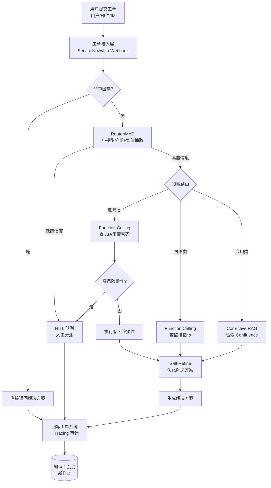
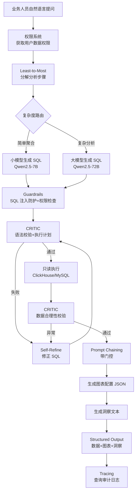
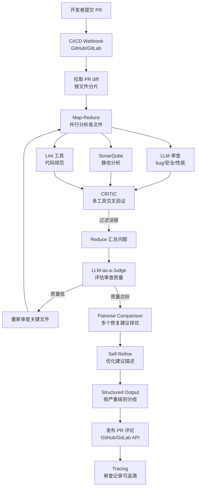

# SaaS/企业服务行业 — Agent 设计模式场景方案

> 企业服务（B2B SaaS、IT 服务管理、内部效能工具）对 Agent 的核心诉求是：**效率优先、安全兜底、深度集成**。企业工单量大、决策链长、权限与合规要求严苛，Agent 必须在毫秒级响应中完成分类、检索、执行与升级，同时保证每一次操作可追溯、可回滚、可审计。本文针对 SaaS/企业服务行业挑选 3 个高价值业务子场景，给出从约束分析到模式选型、从架构图到快速启动配方的完整方案。

---

## 📖 行业故事：凌晨3点的工单雪崩

> 某SaaS公司凌晨3点系统告警，用户工单像雪片一样飞来："系统打不开了""数据同步失败""页面白屏"。值班运维一个人盯50个工单，手动分类、分派、回复，忙到早上6点才处理完。老板问："能不能AI自动处理？"
>
> 第一版AI工单系统上线后，把所有"页面白屏"工单都分给了前端组——但有一个其实是数据库挂了导致的白屏。前端组排查了2小时才发现不是自己的锅。问题出在：只做了表面分类，没有"根因分析"。

**翻车对话**：
```
工单：用户反馈页面白屏，错误码500
Agent：[Router：关键词"页面白屏" → 分派前端组]
前端组：[排查2小时] 前端代码没问题啊...
       [联系后端] 你们接口是不是挂了？
后端组：哦，数据库主从切换导致连接超时，已经修了。
（前端白白排查2小时，用户等了3小时）
```

**救场对话**：
```
工单：用户反馈页面白屏，错误码500
Agent：[Router：关键词"页面白屏" → 候选前端/后端]
       [Function Calling：查询监控系统 → 发现数据库连接超时告警]
       [Corrective RAG：检索知识库 → "500错误码+数据库告警 = 后端问题"]

       分派结果：后端组（优先级P0）
       原因：监控系统显示数据库连接超时，错误码500为服务端错误
       建议：检查数据库主从状态

       [同时自动回复用户] 检测到系统异常，技术团队正在紧急修复，
       预计15分钟恢复，给您带来不便敬请谅解。
后端组：[收到工单+原因分析] 5分钟定位问题，10分钟修复。
（用户15分钟后恢复，前端没被打扰）
```

---

## 4.3.1 工单智能分派与处理

**业务描述**：企业 IT 服务台收到用户工单（如"邮箱登录不了""VPN 连接失败"），Agent 自动分析工单内容，分类并分派给合适的处理团队，常见问题直接给出解决方案，复杂问题升级人工。

**用户旅程**：
1. 用户通过企业门户/邮件/IM 提交工单，描述问题现象
2. Agent 接收工单后进行意图分类与实体抽取（用户、设备、应用）
3. Router 将工单路由到对应领域（网络/账号/应用/硬件）
4. 命中高频问题缓存则直接返回解决方案；否则触发 Corrective RAG 检索知识库
5. Agent 通过 Function Calling 查询用户状态（AD 域、监控指标），必要时执行低风险操作（如重置密码、清缓存）
6. 高风险操作（账号禁用、权限回收）进入 HITL 队列等待人工确认
7. 工单关闭后写入 Tracing 系统，沉淀为新的知识库样本

**真实约束**：

| 约束维度 | 具体要求 | 对模式选型的影响 |
|---------|---------|----------------|
| 延迟 | 分派 < 2s，自动解决方案 < 10s | 路由层必须用小模型 + 缓存；RAG 检索需预计算 embedding |
| 准确率 | 分派准确率 > 92%，自动解决安全性 > 99% | Router 需置信度门控，低置信度直接转人工；自动操作必须经 HITL 二次确认 |
| 成本 | < ¥0.03/工单 | 高频工单必须命中 Caching；Model Routing 把分类任务下放到小模型 |
| 安全 | 涉及 AD 域控、账号操作，需审计与最小权限 | Function Calling 仅暴露白名单工具；所有写操作走 HITL + 审计日志 |
| 集成 | Jira/ServiceNow、AD 域控、Confluence、监控系统 | 需统一工具适配层，支持 OAuth/SSO 与工单系统双向同步 |

**系统架构**：



**模式选型映射**：

| 架构层 | 基础设施组件 | 推荐模式 | 选型理由 |
|--------|------------|---------|---------|
| 入口分类 | 小模型（Qwen2.5-7B）+ 缓存（Redis） | Router/MoE | 工单分类是典型多分类任务，小模型 + 路由满足 2s 延迟与低成本 |
| 知识检索 | Confluence + 向量库（Milvus） | Corrective RAG | 知识库存在过期/噪声文档，需检索后评估相关性并自我纠错 |
| 工具调用 | AD 域控 API、监控 API、工单 API | Function Calling | 查用户状态、重置密码等结构化操作必须走函数调用 |
| 方案优化 | LLM（Qwen2.5-72B） | Self-Refine | 初版方案可能表述不清或步骤缺失，需迭代优化 |
| 高风险操作 | 审批工作流（钉钉/飞书） | HITL | 账号禁用、权限回收等操作不可逆，必须人工确认 |
| 成本控制 | Redis 语义缓存 | Caching | "邮箱登录不了"等高频问题占比 60%+，缓存命中显著降本 |
| 可观测 | OpenTelemetry + ELK | Tracing | 每个工单的完整处理链路需可追溯，满足合规审计 |

**失败模式与应对**：

| 失败场景 | 业务影响 | 应对方案 |
|---------|---------|---------|
| Router 误分类（如把网络问题分到账号组） | 工单流转成本增加，SLA 违约 | 置信度 < 0.85 直接转人工分派；每周用误分派样本微调 Router |
| RAG 检索到过期文档（如旧版 VPN 配置） | 给出错误解决方案，用户反复提交工单 | Corrective RAG 评估文档时效性；知识库标注失效时间戳 |
| Function Calling 误执行高风险操作 | 账号被误禁用，影响业务 | 写操作强制 HITL；操作前 dry-run 校验影响范围 |
| 缓存污染（错误方案被缓存） | 高频工单批量返回错误方案 | 缓存写入前经 CRITIC 校验；设置 TTL + 人工抽检机制 |
| 知识库未覆盖新问题类型 | Agent 无法解决，工单堆积 | 监控"未解决率"指标，触发知识库补充流程 |

**快速启动配方**：

```python
# 工单智能分派与处理 — 核心模式组合伪代码
def handle_ticket(ticket):
    # 1. Caching：高频工单语义缓存命中
    if cached := semantic_cache.lookup(ticket.content, threshold=0.92):
        return cached.solution

    # 2. Router/MoE：小模型分类 + 实体抽取
    route = router_model.classify(ticket.content)  # {domain, confidence, entities}
    if route.confidence < 0.85:                    # 低置信度转人工
        return escalate_to_human(ticket, reason="低置信度分派")

    # 3. Corrective RAG：检索知识库并自我纠错
    docs = vector_db.search(ticket.content, filter={"domain": route.domain})
    verified_docs = rag_critic.evaluate(docs, ticket.content)  # 过滤不相关/过期文档

    # 4. Function Calling：查询用户状态（只读优先）
    user_state = call_tools([
        "ad.get_user_status(route.entities.user)",
        "monitor.get_metrics(route.entities.device)"
    ])

    # 5. Self-Refine：生成并优化解决方案
    solution = self_refine.generate(ticket, verified_docs, user_state, max_iter=2)

    # 6. HITL：高风险操作需人工确认
    if solution.requires_high_risk_action:
        approval = hitl_queue.request_approval(solution.action, timeout="2h")
        if not approval.approved:
            return escalate_to_human(ticket, reason="人工拒绝高风险操作")

    # 7. Tracing：写入审计链路 + 沉淀缓存
    tracing.log(ticket.id, route, verified_docs, solution)
    semantic_cache.set(ticket.content, solution, ttl="7d")
    return solution
```

---

## 4.3.2 自然语言数据分析助手

**业务描述**：业务人员用自然语言提问（如"上个月华东区销售额环比增长多少"），Agent 自动生成 SQL 查询、执行、生成图表、撰写分析洞察。

**用户旅程**：
1. 业务人员在 BI 门户输入自然语言问题
2. Agent 用 Least-to-Most 分解问题（时间范围 → 维度 → 指标 → 对比逻辑）
3. 结合元数据字典与权限系统，确定可查询的表与字段
4. Code Interpreter 生成 SQL，CRITIC 校验语法与权限
5. 执行只读 SQL，CRITIC 二次校验数据合理性（异常值、行数）
6. Prompt Chaining 串联：查询结果 → 图表配置 → 洞察文本，带门控
7. 返回结构化结果（数据表 + 图表 JSON + 洞察摘要）

**真实约束**：

| 约束维度 | 具体要求 | 对模式选型的影响 |
|---------|---------|----------------|
| 延迟 | 简单查询 < 5s，复杂分析 < 20s | Model Routing：简单聚合用小模型，复杂分析用大模型 |
| 准确率 | SQL 生成正确率 > 90% | CRITIC 必须做语法校验 + 执行计划校验 + 数据合理性校验三重验证 |
| 成本 | < ¥0.1/次查询 | 元数据字典预加载；Schema 精简后送入 LLM 减少 token |
| 安全 | 只能查询有权限的数据，SQL 注入防护，只读权限 | Guardrails 在生成前后双校验；DB 账号强制只读 + 行级权限 |
| 集成 | MySQL/ClickHouse、BI 工具、权限系统、元数据字典 | 需统一数据源适配层，支持多方言 SQL 与权限透传 |

**系统架构**：



**模式选型映射**：

| 架构层 | 基础设施组件 | 推荐模式 | 选型理由 |
|--------|------------|---------|---------|
| 任务分解 | LLM + 元数据字典 | Least-to-Most | "环比增长"类问题需拆解为时间范围、维度、指标、对比四步 |
| SQL 生成执行 | Code Interpreter 沙箱 | Code Interpreter | SQL 生成+执行+结果校验需闭环，沙箱保证安全隔离 |
| 正确性验证 | SQL Parser + 数据校验器 | CRITIC | 多工具交叉验证：语法解析器 + EXPLAIN + 数据分布检查 |
| 流程编排 | 工作流引擎 | Prompt Chaining | 查询→可视化→洞察三步串联，每步带门控决定是否继续 |
| 结果格式化 | JSON Schema 校验 | Structured Output | 图表配置需严格 JSON 格式供前端 ECharts 渲染 |
| 成本控制 | 模型路由网关 | Model Routing | 简单 count/sum 用小模型，复杂多表 join 用大模型 |
| 安全防护 | SQL 防火墙 + 权限引擎 | Guardrails | 生成前后双校验 SQL 注入、危险操作、越权访问 |

**失败模式与应对**：

| 失败场景 | 业务影响 | 应对方案 |
|---------|---------|---------|
| SQL 语法错误（方言不兼容） | 查询失败，业务人员等待 | CRITIC 用对应方言 Parser 校验；失败自动 Self-Refine 重试 |
| 越权查询（如查其他区域数据） | 数据泄露，合规风险 | Guardrails 校验字段级权限；DB 账号行级过滤兜底 |
| SQL 注入（用户输入含恶意片段） | 数据库被篡改或拖库 | 参数化查询 + 关键字黑名单；DB 账号强制只读 |
| 数据异常未识别（如脏数据导致负数销售额） | 错误洞察误导决策 | CRITIC 数据合理性校验：值域、分布、行数阈值检查 |
| 大表全表扫描导致超时 | 查询超时，影响 DB 性能 | EXPLAIN 校验扫描行数；强制 LIMIT + 时间范围约束 |
| 洞察文本与数据不符（幻觉） | 业务人员基于错误洞察决策 | Prompt Chaining 门控：洞察必须引用具体数据点 |

**快速启动配方**：

```python
# 自然语言数据分析助手 — 核心模式组合伪代码
def analyze(question, user):
    # 1. 权限系统：获取用户可访问的表与字段
    perms = auth_system.get_permissions(user)  # {"tables": [...], "row_filter": "region='华东'"}

    # 2. Least-to-Most：分解分析步骤
    steps = ltm_decompose(question, meta_dict)  # [时间范围, 维度, 指标, 对比逻辑]

    # 3. Model Routing：按复杂度选择模型
    model = "qwen-7b" if is_simple_aggregation(steps) else "qwen-72b"

    # 4. Code Interpreter：生成 SQL
    sql = code_interpreter.generate_sql(question, steps, perms, model=model)

    # 5. Guardrails：SQL 注入防护 + 权限检查（生成后校验）
    guardrails.validate(sql, perms)  # 校验注入、危险操作、越权字段

    # 6. CRITIC：语法校验 + 执行计划校验（三重验证）
    critic.verify_syntax(sql, dialect="clickhouse")
    critic.verify_plan(sql, max_scan_rows=1_000_000)  # 限制扫描行数
    if not critic.passed:
        sql = self_refine(sql, critic.feedback)       # 自动修正后重校
        guardrails.validate(sql, perms)

    # 7. 只读执行 + 数据合理性校验
    rows = db.execute_readonly(sql)
    critic.verify_data(rows, expected_range=meta_dict.range)  # 值域/分布检查

    # 8. Prompt Chaining：查询结果 → 图表 → 洞察（带门控）
    chart_config = chain_step(rows, prompt="生成 ECharts JSON", output_schema=CHART_SCHEMA)
    if not gate_check(chart_config, rows):  # 门控：图表必须与数据一致
        chart_config = self_refine(chart_config)
    insight = chain_step(rows, chart_config, prompt="生成洞察，必须引用具体数据点")

    # 9. Structured Output + Tracing
    tracing.log(user, question, sql, rows, insight)
    return {"data": rows, "chart": chart_config, "insight": insight}
```

---

## 4.3.3 代码审查与 PR 助手

**业务描述**：开发者提交 PR 后，Agent 自动审查代码变更，检查 bug、安全漏洞、代码规范、性能问题，在 PR 上留下评论和建议。

**用户旅程**：
1. 开发者提交 PR，触发 CI/CD Webhook
2. Agent 拉取 PR diff，按文件类型与变更大小分片
3. Map-Reduce 并行分析各文件：LLM 审查 + SonarQube 静态分析
4. CRITIC 交叉验证两路结果，过滤误报
5. LLM-as-a-Judge 评估审查质量，Pairwise Comparison 择优修复建议
6. Self-Refine 优化建议描述，使其可操作
7. Structured Output 格式化 PR 评论，按严重级别分组
8. 评论发布到 GitHub/GitLab，Tracing 记录审查链路

**真实约束**：

| 约束维度 | 具体要求 | 对模式选型的影响 |
|---------|---------|----------------|
| 延迟 | 异步处理，单 PR < 3 分钟 | Map-Reduce 并行分析是必须；大文件分片处理 |
| 准确率 | 误报率 < 15%，关键 bug 检出率 > 85% | CRITIC 多工具交叉验证过滤误报；LLM-as-a-Judge 评估质量 |
| 成本 | < ¥0.5/PR | Map-Reduce 按文件分片控制 token；小文件用小模型 |
| 安全 | 不泄露源码到外部 API，审查结果可追溯 | 优先用私有部署 LLM；Tracing 记录每条建议的依据 |
| 集成 | GitHub/GitLab API、CI/CD、SonarQube | 需统一 Git 平台适配层；静态分析结果作为 CRITIC 输入 |

**系统架构**：



**模式选型映射**：

| 架构层 | 基础设施组件 | 推荐模式 | 选型理由 |
|--------|------------|---------|---------|
| 并行分析 | 任务队列（Celery）+ LLM 集群 | Map-Reduce | PR 含多文件，并行分析降低延迟；Reduce 汇总去重 |
| 交叉验证 | SonarQube + LLM + Lint | CRITIC | 单一工具误报率高，多工具交叉验证过滤假阳性 |
| 质量评估 | LLM 评审模型 | LLM-as-a-Judge | 评估审查结果是否完整、是否漏报关键问题 |
| 建议择优 | LLM 生成多候选 | Pairwise Comparison | 同一问题可能有多个修复建议，择优选取最可操作的 |
| 建议优化 | LLM 迭代 | Self-Refine | 初版建议可能表述模糊，需优化为可直接执行的步骤 |
| 评论格式化 | JSON Schema | Structured Output | PR 评论需按严重级别分组，便于开发者优先处理 |
| 可观测 | 审计日志系统 | Tracing | 每条建议需可追溯到分析依据，支持事后复盘 |

**失败模式与应对**：

| 失败场景 | 业务影响 | 应对方案 |
|---------|---------|---------|
| LLM 误报过多（如把合理代码标记为 bug） | 开发者忽略所有评论，工具失效 | CRITIC 交叉验证：仅 LLM 标记但 SonarQube 未标记的降级为"建议" |
| 关键 bug 漏报（如 SQL 注入未检出） | 漏洞进入生产环境 | LLM-as-a-Judge 复查高风险文件；安全规则库强制覆盖检查 |
| 大 PR 超时（如 100+ 文件） | 审查延迟，阻塞合并 | Map-Reduce 分片 + 优先级队列；超阈值仅审查高风险文件 |
| 建议不可操作（如"这里有问题"无具体方案） | 开发者无法修复，体验差 | Self-Refine 强制要求建议包含代码示例；Pairwise 择优 |
| 源码泄露到外部 API | 知识产权风险，合规违规 | 优先私有部署 LLM；外部调用前脱敏处理 |
| 重复评论已知问题 | 评论噪音，开发者反感 | Tracing 记录历史；与项目 .gitignore 规则联动过滤 |

**快速启动配方**：

```python
# 代码审查与 PR 助手 — 核心模式组合伪代码
def review_pr(pr):
    # 1. Map-Reduce：按文件并行分析
    file_chunks = split_diff(pr.diff, max_tokens=4000)  # 大文件分片
    findings = parallel_map(file_chunks, lambda chunk: {
        "llm": llm_review(chunk, prompt=REVIEW_PROMPT),       # LLM 审查
        "sonar": sonarqube_scan(chunk),                       # 静态分析
        "lint": lint_check(chunk),                            # 代码规范
    })

    # 2. CRITIC：多工具交叉验证，过滤误报
    verified = []
    for f in findings:
        # 仅 LLM 标记但工具未标记的降级为"建议"，多工具一致标记的为"问题"
        severity = critic.cross_validate(f.llm, f.sonar, f.lint)
        if severity != "false_positive":
            verified.append({**f, "severity": severity})

    # 3. LLM-as-a-Judge：评估审查质量（是否漏报关键问题）
    quality = judge.evaluate(verified, pr.diff, criteria=["完整性", "准确性"])
    if quality.score < 0.7:                       # 质量不达标，重查高风险文件
        high_risk = filter_high_risk_files(pr.diff)
        verified += re_review(high_risk)

    # 4. Pairwise Comparison：多个修复建议择优
    for issue in verified:
        candidates = [llm_fix(issue, strategy=s) for s in ["最小改动", "最佳实践", "性能优先"]]
        issue.fix = pairwise_best(candidates, criterion="可操作性")

    # 5. Self-Refine：优化建议描述（必须含代码示例）
    for issue in verified:
        issue.fix = self_refine(issue.fix, constraint="包含可直接应用的代码片段")

    # 6. Structured Output：按严重级别分组格式化
    comment = format_pr_comment(verified, group_by="severity")  # critical/warning/suggestion

    # 7. 发布评论 + Tracing
    git_api.post_comment(pr.id, comment)
    tracing.log(pr.id, findings, verified, comment, quality)
    return comment
```

---

## 总结：SaaS 行业模式选型核心原则

SaaS/企业服务行业的 Agent 设计，核心围绕三大原则展开：

1. **效率优先**：企业工单量大、查询频次高，必须通过 **Model Routing**（小模型兜底分类）、**Caching**（高频问题缓存）、**Map-Reduce**（并行分析）将单次成本压到分厘级别，同时满足秒级延迟要求。效率不是"锦上添花"，而是"能否上线"的硬门槛。

2. **安全兜底**：企业场景涉及账号、数据、代码等高价值资产，**HITL**（高风险操作人工确认）、**Guardrails**（SQL 注入防护/权限校验）、**CRITIC**（多工具交叉验证过滤误报）构成三道安全防线。原则是：可逆操作可自动化，不可逆操作必须人工确认，所有操作必须可追溯。

3. **深度集成**：企业 Agent 不是孤岛，必须与现有系统（Jira/ServiceNow、AD 域控、Confluence、Git 平台、BI 工具、权限系统）深度集成。**Function Calling**（结构化工具调用）、**Tracing**（全链路审计）、**Structured Output**（与下游系统对接的标准化输出）是集成的三大支柱。模式选型时必须优先考虑与现有基础设施的兼容性，而非追求最新最复杂的模式。

> **一句话选型心法**：先用 Router/Caching/Model Routing 把成本和延迟压下来，再用 CRITIC/HITL/Guardrails 把安全兜底做扎实，最后用 Function Calling/Tracing/Structured Output 把集成做深——三者缺一不可。
