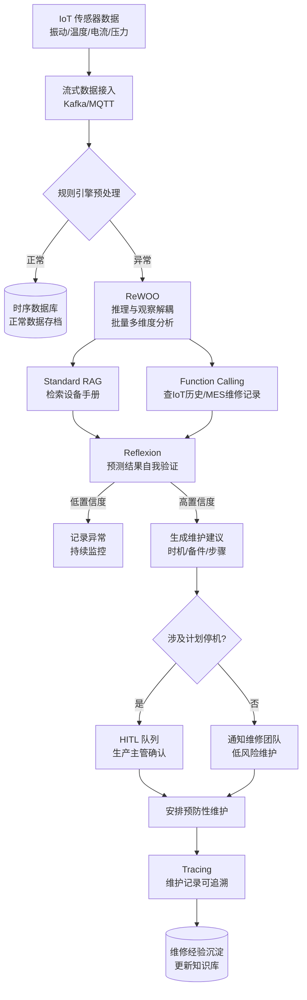
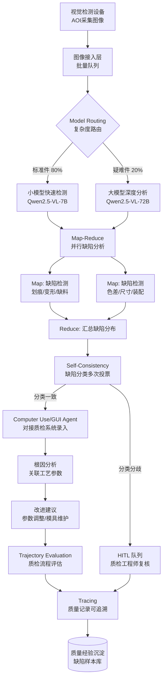
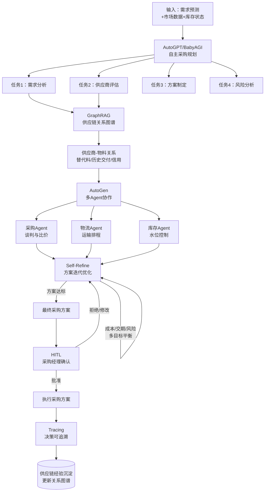

# 制造行业 — Agent 设计模式场景方案

> 制造业是国民经济的根基，也是 AI Agent 落地最具挑战的实体场景之一。一台关键设备故障可能导致整条产线停摆、单日损失百万；一批不良品流入市场可能引发召回事件、品牌信誉受损；一次供应链断裂可能让订单延期、客户流失。制造业对 Agent 的核心诉求是：**可靠性优先、安全兜底、数据深度整合**。工厂环境涉及海量 IoT 传感器、复杂的设备手册、严格的质量标准与多方协作的供应链，Agent 必须在工业级可靠性要求下完成预测、检测、优化与决策辅助，同时保证每一次建议可追溯、可解释、可人工复核。本文针对制造行业挑选 3 个高价值业务子场景，给出从约束分析到模式选型、从架构图到快速启动配方的完整方案。

制造行业的 Agent 设计有三条不可妥协的底线：

1. **安全优先**：设备操作、产线调整、采购决策等任何涉及物理世界或重大资金的行动，AI 建议必须经人工确认后执行，Agent 永远是"辅助决策"而非"自主执行"。
2. **可追溯性**：质量判定、故障预测、采购决策必须可追溯到数据来源、推理过程与依据条文，满足工业审计与法规要求。
3. **数据深度融合**：制造 Agent 不是孤岛，必须与 IoT 平台、MES/ERP/SCM 系统、设备手册知识库、质检系统深度集成，结构化数据与非结构化知识并重。

在此之上，制造场景的约束呈现明显分化：设备预测性维护要求高频传感器数据分析与低延迟告警，质量检测要求大批量图像并行处理与高准确率分类，供应链优化要求多源数据整合与多方协作。这种分化决定了制造 Agent 必须通过 **Model Routing** 在不同复杂度任务间动态切换，通过 **Map-Reduce** 应对批量数据处理，通过 **HITL** 把控重大决策风险。

---

## 📖 行业故事：凌晨2点的产线停摆

> 某汽车零部件工厂凌晨2点，关键数控机床突然主轴抱死，整条产线停摆。值班工程师赶到现场，翻设备手册、查历史维修记录、联系厂家技术支持，折腾了4个小时才定位是轴承润滑系统失效导致。这4小时停产损失80万，加上延期交付的违约金，总共损失超百万。厂长拍桌子："上次3个月前就有异响，为什么没提前发现？"
>
> 第一版AI预测维护系统上线后，把所有"振动异常"都报为"即将故障"——结果一周内误报37次，维修团队疲于奔命，最后直接忽略了所有告警。真正故障来的时候，反而没人理。问题出在：只做了阈值告警，没有"多维度关联分析"和"误报自我纠错"。

**翻车对话**：
```
传感器：主轴振动值 8.2mm/s（阈值 8.0mm/s）
Agent：[阈值告警] ⚠️ 检测到振动超标，预计24小时内故障，建议立即停机检查！
维修工：上周你也说振动超标让我停机，结果拆开啥问题没有。
Agent：[2小时后] ⚠️ 振动仍超标，建议立即停机！
维修工：[忽略告警] 又是误报，不管了。
（3天后主轴抱死，停产4小时，损失80万）
```

**救场对话**：
```
传感器：主轴振动值 8.2mm/s，温度 72℃，电流波动 +15%
Agent：[ReWOO：批量分析振动/温度/电流三维度数据]
       [Standard RAG：检索设备手册 → 主轴轴承润滑系统故障特征匹配]
       [Function Calling：调用IoT平台 → 获取该设备近90天历史趋势]
       [Reflexion：自我验证 → 三维度同时异常 + 3个月前异响记录 → 高置信度]

       ⚠️ 预测性维护预警（高置信度 0.91）：
       1. 振动 8.2mm/s + 温度 72℃ + 电流波动 +15% 三维度同步异常
       2. 设备手册匹配：轴承润滑系统失效早期特征（置信度 0.88）
       3. 历史趋势：近30天振动值缓慢上升，符合磨损退化曲线
       4. 建议：72小时内安排预防性维护，更换主轴轴承

       [HITL：涉及计划停机，需生产主管确认维护窗口]
生产主管：[查看分析依据] 数据很充分，安排明晚夜班维护。
维修工：[按建议更换轴承] 果然润滑系统已经快失效了，再拖一周就抱死。
（避免了一次非计划停机，挽回潜在损失80万+）
```

---

## 4.7.1 设备预测性维护

**业务描述**：工厂关键设备（数控机床、注塑机、压缩机等）部署大量传感器（振动、温度、电流、压力），Agent 实时采集传感器数据，结合设备手册与历史维修记录，预测设备健康状态与剩余使用寿命，在故障发生前给出维护建议，避免非计划停机。

**用户旅程**：
1. IoT 平台实时采集设备传感器数据，按固定频率推送到 Agent
2. Agent 用 ReWOO 批量分析多维度传感器数据，推理与观察解耦降低延迟
3. 异常检测触发后，Standard RAG 检索设备手册，匹配故障特征
4. Function Calling 调用 IoT 平台历史数据 API 与 MES 维修记录 API
5. Reflexion 对预测结果自我验证：多维度交叉确认 + 历史趋势一致性检查
6. 生成维护建议（维护时机、备件清单、操作步骤），附置信度与推理依据
7. 重大停机决策进入 HITL 队列，等待生产主管确认维护窗口

**真实约束**：

| 约束维度 | 具体要求 | 对模式选型的影响 |
|---------|---------|----------------|
| 延迟 | 异常告警 < 5s，维护建议 < 30s | ReWOO 推理与观察解耦，批量分析避免串行调用；RAG 检索需预计算 embedding |
| 准确率 | 漏报率 < 5%，误报率 < 15% | Reflexion 自我验证过滤误报；多维度交叉确认提升置信度 |
| 成本 | < ¥0.5/设备/天 | 高频数据用规则引擎预处理，仅异常数据进入 LLM 分析 |
| 安全 | 涉及设备操作与计划停机，需人工确认 | 重大停机决策强制 HITL；Agent 仅给建议，不直接控制设备 |
| 集成 | IoT 平台、MES、设备手册知识库、SCADA | Function Calling 统一适配多源数据 API；设备手册需结构化入库 |

**系统架构**：



**模式选型映射**：

| 架构层 | 基础设施组件 | 推荐模式 | 选型理由 |
|--------|------------|---------|---------|
| 多维数据分析 | LLM + 时序数据库 | 2.8 ReWOO | 推理与观察解耦，批量分析振动/温度/电流等多维度数据，避免串行调用降低延迟 |
| 知识检索 | 设备手册 + 向量库 | 3.1 Standard RAG | 设备手册为相对稳定的结构化文档，标准 RAG 即可满足故障特征匹配需求 |
| 数据调用 | IoT 平台 API、MES API | 8.2 Function Calling | 查询历史趋势、维修记录等结构化数据必须走函数调用，保证数据实时性 |
| 预测验证 | LLM 反思机制 | 9.2 Reflexion | 初版预测可能误报，需基于多维度交叉验证与历史一致性进行自我纠错 |
| 重大决策 | 审批工作流 | 10.1 HITL | 计划停机影响产能，必须经生产主管确认维护窗口后执行 |
| 可观测 | OpenTelemetry + ELK | 12.1 Tracing | 每次预测与维护建议需可追溯，满足工业审计与事后复盘要求 |

**失败模式与应对**：

| 失败场景 | 业务影响 | 应对方案 |
|---------|---------|---------|
| 误报频发（如工况变化被误判为故障） | 维修团队告警疲劳，忽略真实告警 | Reflexion 多维度交叉验证，单维度异常降级为"持续监控"；误报样本回流微调 |
| 漏报关键故障（如罕见故障模式未覆盖） | 非计划停机，损失百万 | 设备手册全量入库；置信度门控 + 规则引擎兜底；漏报案例强制复盘入库 |
| RAG 检索到错误机型手册 | 维护建议不可执行，甚至造成二次损坏 | Standard RAG 检索时强制带设备型号过滤；维护建议附手册章节引用供复核 |
| IoT 数据缺失或异常（如传感器故障） | 基于错误数据做出错误预测 | Function Calling 校验数据完整性；数据异常时降级为"数据异常告警"而非故障预测 |
| HITL 审批超时（如夜班无主管） | 错过最佳维护窗口，故障恶化 | HITL 设置超时升级机制；超时后自动通知值班厂长；高置信度预警可降级为紧急维护 |

**快速启动配方**：

```python
# 设备预测性维护 — 核心模式组合伪代码
def predict_maintenance(device_id, sensor_stream):
    # 1. 规则引擎预处理：高频数据先用规则过滤，降低 LLM 调用成本
    anomalies = rule_engine.preprocess(sensor_stream)  # 阈值/趋势/统计异常
    if not anomalies:
        return {"status": "normal", "device_id": device_id}

    # 2. ReWOO：推理与观察解耦，批量分析多维度传感器数据
    analysis_plan = rewoo.plan(anomalies)  # 生成分析计划（不依赖观察结果）
    observations = rewoo.batch_execute(analysis_plan, [
        "vibration_spectrum_analysis(anomalies.vibration)",
        "temperature_trend_analysis(anomalies.temperature)",
        "current_waveform_analysis(anomalies.current)",
    ])

    # 3. Standard RAG：检索设备手册，匹配故障特征
    device_manual = rag.search(
        query=f"{device_id} 故障特征 {observations.summary}",
        filter={"device_model": get_model(device_id)}  # 强制机型过滤
    )

    # 4. Function Calling：调用 IoT 历史数据与 MES 维修记录
    history = call_tools([
        f"iot.get_history(device_id, days=90)",       # 近90天趋势
        f"mes.get_repair_records(device_id)",          # 历史维修记录
    ])

    # 5. Reflexion：预测结果自我验证（多维度交叉 + 历史一致性）
    prediction = llm_predict(observations, device_manual, history)
    verified = reflexion.verify(prediction, criteria=[
        "multi_dimension_consistency",  # 多维度异常是否一致
        "historical_trend_match",        # 是否符合退化曲线
        "manual_feature_match",          # 是否匹配手册故障特征
    ])
    if verified.confidence < 0.7:                  # 低置信度降级为持续监控
        return {"status": "monitor", "device_id": device_id, "reason": "置信度不足，持续监控"}

    # 6. 生成维护建议
    suggestion = generate_maintenance_suggestion(verified, device_manual)

    # 7. HITL：涉及计划停机的重大决策需人工确认
    if suggestion.requires_shutdown:
        approval = hitl_queue.request_approval(
            suggestion, approver="production_manager", timeout="4h"
        )
        if not approval.approved:
            return {"status": "pending", "reason": "等待主管确认维护窗口"}

    # 8. Tracing：记录预测链路与维护建议
    tracing.log(device_id, anomalies, observations, device_manual,
                history, prediction, verified, suggestion)
    return {"status": "alert", "suggestion": suggestion, "confidence": verified.confidence}
```

---

## 4.7.2 质量控制与缺陷检测

**业务描述**：产线产品经过视觉检测设备（AOI/机器视觉）采集图像，Agent 辅助分析缺陷图像，自动分类缺陷类型（划痕、变形、缺料、色差等），分析根因（模具磨损、参数偏移、来料异常），并给出改进建议。对于简单检测任务用小模型快速处理，复杂分析用大模型深度推理。

**用户旅程**：
1. 视觉检测设备采集产品图像，推送至 Agent 质检平台
2. Model Routing 按图像复杂度路由：标准件用小模型快速检测，复杂缺陷用大模型分析
3. Map-Reduce 批量并行分析缺陷图像：各工位并行检测 → 汇总缺陷分布
4. Computer Use/GUI Agent 对接现有质检系统，自动录入检测结果
5. Self-Consistency 对缺陷分类进行多次独立投票，消除单次判断偏差
6. 根因分析：关联缺陷类型与工艺参数，定位问题工序
7. Trajectory Evaluation 评估质检流程质量，发现漏检/误检模式

**真实约束**：

| 约束维度 | 具体要求 | 对模式选型的影响 |
|---------|---------|----------------|
| 延迟 | 单件检测 < 2s，批量分析 < 30s | Model Routing 简单件用小模型；Map-Reduce 并行处理批量图像 |
| 准确率 | 缺陷检出率 > 95%，误判率 < 5% | Self-Consistency 多次投票消除偏差；Trajectory Evaluation 持续优化 |
| 成本 | < ¥0.05/件 | 80% 标准件用小模型处理，仅 20% 疑难件进入大模型分析 |
| 安全 | 质量判定影响交付与客户关系，需可解释 | 缺陷分类必须附置信度与特征依据；关键质量判定可追溯 |
| 集成 | AOI 设备、MES 质检模块、SPC 系统 | Computer Use/GUI Agent 对接传统质检系统；结果回写 MES |

**系统架构**：



**模式选型映射**：

| 架构层 | 基础设施组件 | 推荐模式 | 选型理由 |
|--------|------------|---------|---------|
| 批量分析 | 任务队列 + LLM 集群 | 6.3 Map-Reduce | 产线批量图像需并行分析，Map 阶段各工位独立检测，Reduce 汇总缺陷分布 |
| 系统对接 | 质检系统 GUI | 8.6 Computer Use/GUI Agent | 传统质检系统缺乏 API，需 GUI Agent 模拟操作自动录入检测结果 |
| 缺陷分类 | LLM 多次推理 | 1.4 Self-Consistency | 缺陷分类存在边界模糊（如轻微划痕 vs 色差），多次独立投票消除单次偏差 |
| 流程评估 | LLM 评审 + 历史数据 | 11.3 Trajectory Evaluation | 评估质检全流程（检测→分类→根因）的准确性与一致性，发现漏检/误检模式 |
| 成本控制 | 模型路由网关 | 12.4 Model Routing | 80% 标准件用小模型快速检测，20% 疑难件用大模型深度分析，显著降本 |
| 可观测 | 审计日志系统 | 12.1 Tracing | 每件产品的质量判定需可追溯，支持客户投诉时回查检测链路 |

**失败模式与应对**：

| 失败场景 | 业务影响 | 应对方案 |
|---------|---------|---------|
| 小模型漏检复杂缺陷（如微小裂纹） | 不良品流入客户，引发投诉或召回 | Model Routing 设置置信度门控，低置信度自动升级大模型复检；抽检机制兜底 |
| Self-Consistency 投票分歧严重 | 缺陷分类延迟，影响产线节拍 | 分歧超过阈值自动转 HITL；分歧样本入库作为微调数据 |
| GUI Agent 操作质检系统失败 | 检测结果未录入，数据断档 | 操作失败降级为人工录入；GUI 元素变更时自动检测并告警 |
| 根因分析错误（如误判为来料问题） | 错误调整工艺参数，引入新问题 | 根因分析附置信度与数据依据；参数调整建议需 HITL 确认后执行 |
| 大批量图像导致队列堆积 | 检测延迟，产线节拍被打乱 | Map-Reduce 动态扩缩容；超阈值时优先处理高风险批次 |

**快速启动配方**：

```python
# 质量控制与缺陷检测 — 核心模式组合伪代码
def inspect_quality(batch_images, product_info):
    # 1. Model Routing：按图像复杂度路由到不同模型
    results = []
    for img in batch_images:
        complexity = assess_complexity(img)  # 光照/纹理/缺陷可见度
        model = "qwen-vl-7b" if complexity < 0.6 else "qwen-vl-72b"
        results.append({"image": img, "model": model})

    # 2. Map-Reduce：批量并行缺陷分析
    def map_detect(item):
        defects = llm_detect(item["image"], item["model"], product_info)
        return {"image": item["image"], "defects": defects}

    mapped = parallel_map(results, map_detect)
    defect_distribution = reduce_summarize(mapped)  # 汇总缺陷类型与分布

    # 3. Self-Consistency：缺陷分类多次投票（消除单次偏差）
    for item in mapped:
        if item["defects"]:  # 有缺陷的件需投票确认分类
            votes = [llm_classify(item["image"], item["defects"]) for _ in range(3)]
            item["classification"] = majority_vote(votes)
            if vote_consensus(votes) < 0.7:  # 分歧严重转人工
                hitl_queue.request_review(item, reason="缺陷分类分歧")
                continue

    # 4. Computer Use/GUI Agent：对接质检系统自动录入
    for item in mapped:
        if item.get("classification"):
            gui_agent.operate(
                target="quality_system",
                actions=[
                    "open_inspection_form",
                    "fill_product_id(product_info.id)",
                    "fill_defect_type(item.classification.type)",
                    "fill_severity(item.classification.severity)",
                    "attach_image(item.image)",
                    "submit_form()",
                ]
            )

    # 5. 根因分析：关联缺陷类型与工艺参数
    root_cause = analyze_root_cause(
        defect_distribution,
        process_params=mes.get_process_params(product_info.batch_id),
    )

    # 6. 生成改进建议
    suggestion = generate_improvement(root_cause)  # 参数调整/模具维护/来料检验

    # 7. Trajectory Evaluation：评估质检流程质量
    quality_eval = trajectory_eval.evaluate(
        trajectory=mapped + [root_cause, suggestion],
        criteria=["检出率", "分类一致性", "根因合理性", "建议可操作性"],
    )
    if quality_eval.score < 0.75:  # 质检流程质量不达标
        log_issue(quality_eval.issues)  # 记录问题供后续优化

    # 8. Tracing：记录质量判定全链路
    tracing.log(product_info.batch_id, mapped, defect_distribution,
                root_cause, suggestion, quality_eval)
    return {"defects": defect_distribution, "root_cause": root_cause,
            "suggestion": suggestion, "quality": quality_eval.score}
```

---

## 4.7.3 供应链优化

**业务描述**：面对原材料价格波动、需求不确定、供应商交付风险等多重挑战，Agent 辅助采购决策团队进行供应链优化。Agent 自主规划采购策略，整合供应链关系图谱，协调采购/物流/库存多 Agent 协作，迭代优化方案，并保证决策可追溯。

**用户旅程**：
1. 需求预测模块输入：历史订单、市场趋势、季节性因素
2. AutoGPT/BabyAGI 自主规划采购任务：分解为需求分析、供应商评估、方案制定、风险分析
3. GraphRAG 查询供应链关系图谱：供应商-物料-客户关联、替代料关系、历史交付表现
4. AutoGen 多 Agent 协作：采购 Agent 谈判、物流 Agent 排程、库存 Agent 控制水位
5. Self-Refine 迭代优化采购方案：成本、交期、风险多目标平衡
6. Tracing 记录决策全链路：数据来源、推理过程、方案演变可追溯
7. 最终方案经采购经理 HITL 确认后执行

**真实约束**：

| 约束维度 | 具体要求 | 对模式选型的影响 |
|---------|---------|----------------|
| 延迟 | 方案生成 < 5 分钟（非实时，但需及时） | 多 Agent 协作可并行；Self-Refine 迭代次数限制在 3 轮内 |
| 准确率 | 需求预测准确率 > 80%，方案可行性 > 90% | GraphRAG 提供完整供应链关系；Self-Refine 多目标优化 |
| 成本 | < ¥5/方案 | 复杂任务才启动多 Agent；简单采购用规则引擎处理 |
| 安全 | 涉及多方数据共享与商业机密 | 供应商数据脱敏处理；采购方案经 HITL 确认后执行 |
| 集成 | ERP/SCM、供应商门户、物流系统、市场数据源 | GraphRAG 整合多源关系数据；AutoGen 多 Agent 对接各系统 |

**系统架构**：



**模式选型映射**：

| 架构层 | 基础设施组件 | 推荐模式 | 选型理由 |
|--------|------------|---------|---------|
| 自主规划 | LLM + 任务队列 | 2.1 AutoGPT/BabyAGI | 供应链优化是多步骤目标驱动任务，需自主分解为需求分析、供应商评估等子任务循环执行 |
| 关系检索 | 知识图谱 + 图数据库 | 3.6 GraphRAG | 供应链是典型关系网络（供应商-物料-替代料-客户），GraphRAG 可查询多跳关系与传统 RAG 无法覆盖的关联 |
| 多 Agent 协作 | AutoGen 框架 | 4.1 AutoGen | 采购/物流/库存需多角色协作，AutoGen 支持多 Agent 对话与角色分工，各自专业领域独立推理 |
| 方案优化 | LLM 迭代 | 9.1 Self-Refine | 初版方案可能在成本/交期/风险间失衡，需多目标迭代优化至帕累托最优 |
| 可追溯 | OpenTelemetry + 审计日志 | 12.1 Tracing | 采购决策涉及大额资金与多方数据，全链路可追溯满足审计与合规要求 |

**失败模式与应对**：

| 失败场景 | 业务影响 | 应对方案 |
|---------|---------|---------|
| 需求预测偏差大（如突发事件未纳入） | 采购过量或断料，库存成本/停产风险 | GraphRAG 纳入市场事件节点；预测附置信区间；HITL 复核异常预测 |
| GraphRAG 关系图谱过期（如供应商已倒闭） | 推荐无效供应商，采购失败 | 关系图谱定期更新；供应商状态变更触发图谱刷新；方案执行前校验供应商有效性 |
| 多 Agent 协作冲突（如采购与库存目标矛盾） | 方案无法收敛，延迟决策 | AutoGen 引入协调 Agent 仲裁；Self-Refine 多目标权重可配置 |
| Self-Refine 过度优化（如过度压价牺牲质量） | 供应商关系恶化，质量风险 | 优化目标含质量约束；方案需 HITL 确认；设置成本下限防止过度压价 |
| 数据共享合规风险（如泄露供应商报价） | 商业机密泄露，法律纠纷 | 供应商数据脱敏；多 Agent 间仅共享必要信息；Tracing 记录数据访问链路 |

**快速启动配方**：

```python
# 供应链优化 — 核心模式组合伪代码
def optimize_supply_chain(demand_forecast, market_data, inventory_state):
    # 1. AutoGPT/BabyAGI：自主规划采购任务
    plan = autogpt.plan(
        objective="制定最优采购方案，平衡成本、交期、风险",
        context={"demand": demand_forecast, "market": market_data, "inventory": inventory_state},
    )
    # plan = [需求分析, 供应商评估, 方案制定, 风险分析]

    # 2. GraphRAG：查询供应链关系图谱
    supply_graph = graphrag.query(
        entities=["suppliers", "materials", "alternatives"],
        relations=["supplies", "substitutes_for", "delivered_to", "competes_with"],
        conditions={"material": demand_forecast.materials, "region": "all"},
    )
    # 获取：供应商-物料关系、替代料、历史交付表现、信用评级

    # 3. AutoGen：多 Agent 协作（采购/物流/库存）
    procurement_agent = AutoGenAgent(role="采购", goal="最低采购成本")
    logistics_agent = AutoGenAgent(role="物流", goal="最短交期")
    inventory_agent = AutoGenAgent(role="库存", goal="最优库存水位")

    collaboration = autogen.collaborate(
        agents=[procurement_agent, logistics_agent, inventory_agent],
        context={"demand": demand_forecast, "graph": supply_graph, "inventory": inventory_state},
        rounds=3,  # 协作轮次
    )

    # 4. Self-Refine：方案迭代优化（成本/交期/风险多目标平衡）
    draft_plan = collaboration.output
    refined_plan = self_refine(
        draft_plan,
        objectives=[
            {"name": "成本", "weight": 0.4, "constraint": "不低于市场底价"},
            {"name": "交期", "weight": 0.3, "constraint": "满足生产计划"},
            {"name": "风险", "weight": 0.3, "constraint": "供应商分散度 > 0.6"},
        ],
        max_iter=3,  # 最多迭代3轮
    )

    # 5. 风险分析
    risk_analysis = analyze_risk(refined_plan, supply_graph)
    if risk_analysis.level == "high":
        refined_plan = self_refine(refined_plan, focus="risk_reduction")

    # 6. HITL：采购经理确认
    approval = hitl_queue.request_approval(
        refined_plan, approver="procurement_manager", timeout="24h",
        context={"risk": risk_analysis, "alternatives": collaboration.alternatives},
    )
    if not approval.approved:
        if approval.feedback:
            return self_refine(refined_plan, feedback=approval.feedback)  # 按反馈修改
        return {"status": "rejected", "reason": "采购经理拒绝"}

    # 7. Tracing：决策全链路可追溯
    tracing.log(
        demand_forecast, market_data, plan, supply_graph,
        collaboration, refined_plan, risk_analysis, approval,
    )
    return {"plan": refined_plan, "risk": risk_analysis, "trace_id": tracing.last_id}
```

---

## 总结：制造行业模式选型核心原则

制造行业的 Agent 设计，核心围绕三大原则展开：

1. **可靠性优先**：制造业容错率低，一次误判可能导致停产或召回。**9.2 Reflexion**（预测结果自我验证）、**1.4 Self-Consistency**（缺陷分类多次投票）、**9.1 Self-Refine**（方案迭代优化）构成可靠性三重保障。原则是：高价值决策必须多维度交叉验证，低置信度降级处理，绝不"强行输出"。

2. **安全兜底**：制造场景涉及设备操作、产线调整、大额采购等高风险行动，**10.1 HITL**（重大决策人工确认）是不可妥协的底线。Agent 永远是"辅助决策"而非"自主执行"——预测性维护的停机时机需生产主管确认，质量判定的改进措施需质检工程师复核，采购方案需采购经理批准。所有操作必须可追溯（**12.1 Tracing**）。

3. **数据深度融合**：制造 Agent 必须打通 IoT 传感器、设备手册、MES/ERP/SCM、质检系统、供应链图谱等多源数据。**8.2 Function Calling**（结构化工具调用）、**3.1 Standard RAG**（设备手册检索）、**3.6 GraphRAG**（供应链关系图谱）、**8.6 Computer Use/GUI Agent**（对接传统质检系统）是数据融合的四大支柱。模式选型时必须优先考虑与现有工业基础设施的兼容性。

### 模式选型速查

| 子场景 | 核心模式组合 | 关键约束驱动 |
|--------|------------|------------|
| 设备预测性维护 | 2.8 ReWOO + 3.1 Standard RAG + 8.2 Function Calling + 9.2 Reflexion + 10.1 HITL + 12.1 Tracing | 漏报率 < 5% + 设备操作安全 |
| 质量控制与缺陷检测 | 6.3 Map-Reduce + 8.6 Computer Use/GUI Agent + 1.4 Self-Consistency + 11.3 Trajectory Evaluation + 12.4 Model Routing + 12.1 Tracing | 检出率 > 95% + 成本 < ¥0.05/件 |
| 供应链优化 | 2.1 AutoGPT/BabyAGI + 3.6 GraphRAG + 4.1 AutoGen + 9.1 Self-Refine + 12.1 Tracing + 10.1 HITL | 多目标平衡 + 决策可追溯 |

> **一句话选型心法**：先用 2.8 ReWOO / 6.3 Map-Reduce / 12.4 Model Routing 把数据处理效率和成本压下来，再用 9.2 Reflexion / 1.4 Self-Consistency / 9.1 Self-Refine 把可靠性做扎实，最后用 10.1 HITL / 12.1 Tracing 把安全兜底与可追溯做深——三者缺一不可。

---

## 合规与风险提示

制造行业涉及工业安全、商业机密、多方协作与法规遵守，Agent 部署需重点关注以下合规要点：

### 1. 工业数据安全与保密（商业秘密保护）

- **数据脱敏与隔离**：设备参数、工艺配方、产能数据等属于企业核心商业秘密，Agent 处理时需按数据分级脱敏，跨系统传输需加密。
- **访问权限控制**：IoT 数据、维修记录、质检结果需按角色分级访问，Function Calling 仅暴露白名单 API，禁止越权查询。
- **外部 LLM 调用风险**：涉及核心工艺的数据禁止直接发送至外部 LLM API，优先使用私有部署模型；确需外部调用时必须脱敏处理。

### 2. 设备操作安全：AI 建议必须经人工确认后执行

- **HITL 强制兜底**：涉及设备停机、参数调整、维护操作等物理世界行动，Agent 仅提供建议，**10.1 HITL** 人工确认后才能执行，禁止 Agent 直接控制设备。
- **操作影响范围评估**：维护建议执行前需 dry-run 评估影响范围（影响哪些产线、订单、交付），避免局部维护引发全局停产。
- **安全联锁机制**：Agent 建议与设备安全联锁系统（SIS）解耦，安全联锁始终由工业控制系统独立保障，Agent 不得绕过。

### 3. 供应链数据合规（涉及多方数据共享）

- **多方数据共享协议**：供应链优化涉及供应商、物流商、客户多方数据，需在数据共享协议框架下使用，禁止超范围使用。
- **供应商商业机密保护**：供应商报价、产能、信用等信息属于商业机密，**4.1 AutoGen** 多 Agent 协作时仅共享必要信息，**12.1 Tracing** 记录数据访问链路。
- **反垄断与公平竞争**：采购方案不得基于敏感信息（如竞争对手定价）进行不当竞争，Agent 决策逻辑需符合反垄断法规。

### 4. 算法可解释性要求（质量判定需可追溯）

- **质量判定可追溯**：**1.4 Self-Consistency** 缺陷分类必须附置信度与特征依据，**12.1 Tracing** 记录从图像到判定的完整链路，支持客户投诉时回查。
- **预测依据可解释**：**9.2 Reflexion** 预测结果必须输出人类可读的推理依据（多维度异常特征 + 手册匹配 + 历史趋势），拒绝"黑盒置信度"。
- **模型变更管理**：质检模型/预测模型的版本变更需经过验证与审批，保留旧版本以支持事后追溯。

### 5. 生产安全法规遵守

- **安全生产法合规**：Agent 不得建议违反《安全生产法》及相关行业安全规程的操作，**7.x 安全与对齐类**模式（如 Guardrails）需内嵌安全规则校验。
- **特种设备监管**：涉及特种设备的维护建议需符合《特种设备安全法》，维护人员需持证操作，Agent 建议中需提示资质要求。
- **环境保护合规**：工艺参数调整建议需符合环保排放标准，不得建议可能导致超标排放的操作。

> **合规底线**：制造行业 Agent 的设计哲学是 **"AI 辅助决策，人工执行操作；数据深度整合，机密严格保护；建议必须可追溯，执行必须经确认"**。任何模式组合都必须在这条底线之上运行。
