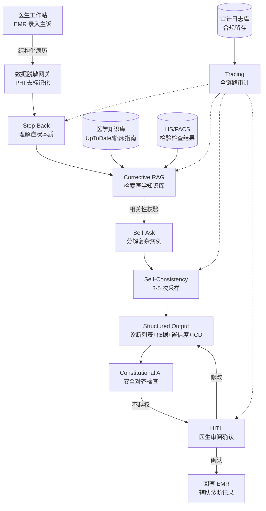
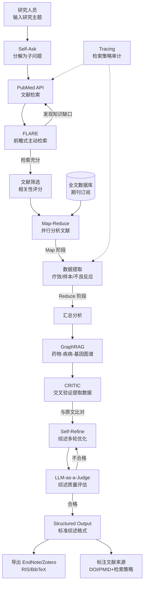
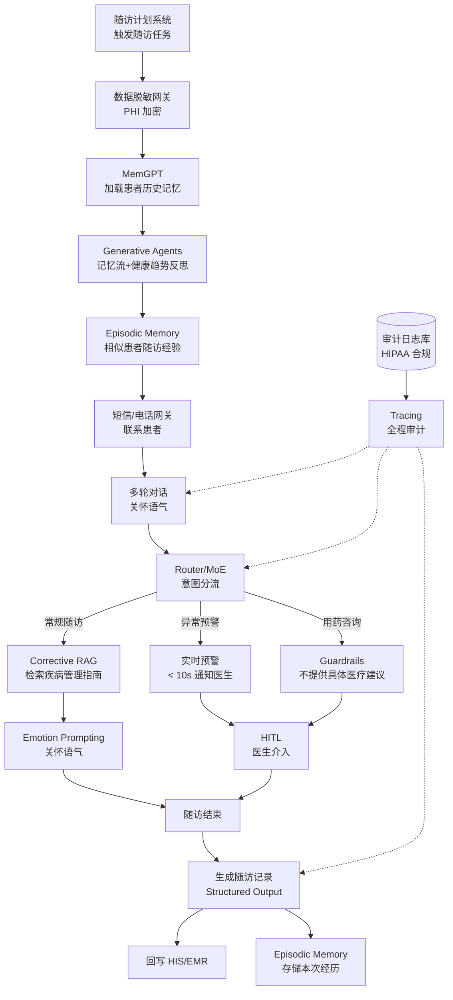

# 医疗健康行业 — Agent 设计模式场景方案

> 医疗健康行业是 Agent 落地中"容错率最低"的领域：一次错误诊断可能延误治疗、一次数据泄露可能违反法规、一次越权建议可能危及生命。本方案围绕"生命攸关"这一核心命题，将 93 种 Agent 设计模式映射到 3 个真实医疗业务子场景，强调 **安全第一、医生兜底、合规至上、可追溯** 四大原则。
>
> 与其他行业相比，医疗 Agent 的模式选型有三个根本差异：
> 1. **HITL 不是可选项而是必选项** —— Agent 永远是"辅助"角色，最终决策权归医生；
> 2. **Constitutional AI 与 Guardrails 是底线** —— 必须从架构层禁止越权诊断、禁止编造引用、禁止泄露隐私；
> 3. **Tracing 是合规要求** —— 辅助诊断记录、随访记录需依法留存，受医疗器械软件监管。

---

## 📖 行业故事：一个差点被漏诊的罕见病

> 某三甲医院试点AI辅助诊断系统。一位患者主诉"反复发热、关节疼痛、皮疹"，AI给出的Top-1诊断是"风湿性关节炎"——常见病，看起来合理。但医生多问了一句"有没有去过疫区"，患者说去过非洲——实际是"疟疾"。
>
> AI漏诊了，因为它只考虑了常见病，没有"多角度探索"和"主动追问关键信息"。医疗场景中，漏诊比误诊更危险。

**翻车对话**：
```
医生输入：患者反复发热、关节疼痛、皮疹，2周
Agent：[Standard RAG：检索常见病]
       诊断建议：
       1. 风湿性关节炎（置信度85%）
       2. 系统性红斑狼疮（置信度70%）
       3. 感染性关节炎（置信度60%）
（漏诊了疟疾——因为没有追问旅行史，只检索了常见病）
```

**救场对话**：
```
医生输入：患者反复发热、关节疼痛、皮疹，2周
Agent：[Step-Back：退一步 → 发热+皮疹+关节痛的鉴别诊断范围很广]
       [Self-Ask：分解子问题 →
         "感染性疾病有哪些可能？"
         "自身免疫性疾病有哪些可能？"
         "需要追问什么关键信息？"]
       [Corrective RAG：检索感染病知识库 → 疟疾、登革热等]

       诊断建议（Top-5）：
       1. 风湿性关节炎（85%）
       2. 系统性红斑狼疮（70%）
       3. 疟疾（65%）⚠️ 需追问旅行史
       4. 登革热（60%）⚠️ 需追问旅行史
       5. 感染性关节炎（55%）

       💡 建议追问：近期旅行史（特别是热带地区）、蚊虫叮咬史

医生：[追问患者] 去过非洲吗？
患者：上个月从非洲出差回来
医生：[查血涂片] 确诊疟疾。
（AI的追问建议帮助医生避免了漏诊）
```

---

### 4.4.1 辅助诊断与鉴别诊断

**业务描述**：医生在诊室接诊时输入患者主诉、病史、检验检查结果，Agent 基于医学知识库给出可能的鉴别诊断列表，每个诊断附带临床依据和置信度，辅助医生决策。Agent 不做最终诊断，仅提供参考意见并留存辅助诊断记录。

**用户旅程**：
1. 医生在 EMR 中录入患者主诉（如"发热伴咳嗽 3 天"）并勾选已完成的检验检查项目
2. 系统自动从 EMR/LIS/PACS 拉取结构化病历数据与检验检查结果
3. Agent 调用 Step-Back 理解症状本质，再通过 Corrective RAG 检索医学知识库
4. Agent 用 Self-Consistency 多次采样生成诊断候选，Self-Ask 分解复杂病例
5. Agent 输出结构化鉴别诊断列表（Top-3 诊断 + 依据 + 置信度 + ICD 编码）
6. 医生审阅列表，结合临床经验确认最终诊断，系统留存辅助诊断审计记录

**真实约束**：

| 约束维度 | 具体要求 | 对模式选型的影响 |
|---------|---------|----------------|
| 延迟 | 鉴别诊断生成 < 10s（医生在诊室等待） | 不能用 ToT/LATS 等多分支搜索（耗时过长）；Self-Consistency 采样次数需限制在 3-5 次；优先 Corrective RAG 而非全库检索 |
| 准确率 | Top-3 诊断包含正确诊断 > 90%（漏诊风险极高） | 必须用 Self-Consistency 验证一致性；Corrective RAG 校验检索相关性；Self-Ask 分解复杂病例避免遗漏关键鉴别点 |
| 成本 | < ¥0.5/次（单次诊疗费用高，成本敏感度低） | 可用较强模型（如 GPT-4 级），但仍需 Caching 缓存常见症状组合；Self-Consistency 采样次数受成本约束 |
| 合规 | 必须标注"仅供参考，最终诊断由医生决定"；需留存辅助诊断记录；受医疗器械软件监管 | 强制 HITL 医生确认；Constitutional AI 对齐"不越权诊断"；Tracing 全链路审计；Structured Output 必含免责声明字段 |
| 集成 | EMR、LIS/PACS、医学知识库、ICD 编码系统 | 需 Function Calling 封装多系统 API；Structured Output 输出 ICD 编码便于 EMR 回写 |

**系统架构**：



**模式选型映射**：

| 架构层 | 基础设施组件 | 推荐模式 | 选型理由 |
|--------|------------|---------|---------|
| 症状理解 | 医学 NLP 服务 | Step-Back | 先抽象症状本质（如"发热+咳嗽"→呼吸道感染范畴），避免直接套用狭窄诊断 |
| 知识检索 | 医学知识库（UpToDate/临床指南） | Corrective RAG | 检索后校验文献相关性，剔除过时指南，确保依据权威 |
| 复杂病例分解 | 推理引擎 | Self-Ask | 将"发热待查"等复杂主诉分解为感染源？非感染？肿瘤？等子问题逐一推理 |
| 诊断一致性验证 | 多次采样器 | Self-Consistency | 3-5 次采样取多数，过滤偶发错误诊断，提升 Top-3 召回率 |
| 输出规范 | ICD 编码系统 | Structured Output | 强制输出诊断名+ICD-10 编码+依据+置信度+免责声明，便于 EMR 回写 |
| 医生确认 | 医生工作站 | HITL | 医生最终确认诊断，Agent 永不自动落诊断 |
| 安全对齐 | 合规引擎 | Constitutional AI | 禁止输出"确诊"类表述，强制标注"仅供参考" |
| 审计追溯 | 审计日志库 | Tracing | 记录检索文献、推理过程、医生修改轨迹，满足医疗器械监管 |

**失败模式与应对**：

| 失败场景 | 业务影响 | 应对方案 |
|---------|---------|---------|
| 知识库检索返回过时指南（如已撤回的抗生素方案） | 误导医生开具错误处方 | Corrective RAG 校验文献时效性；知识库定期同步最新指南版本 |
| Self-Consistency 多次采样结果严重分歧 | 置信度低，医生难以参考 | 输出分歧提示，建议医生结合查体；分歧 > 阈值时强制 HITL 人工复核 |
| Agent 输出"确诊"类越权表述 | 合规违规，法律责任 | Constitutional AI 后置过滤；Guardrails 拦截"确诊/排除"等关键词 |
| 检验检查结果缺失（LIS 接口异常） | 鉴别诊断依据不足 | 降级为仅基于主诉的初步建议，明确标注"数据不全，建议补充检查" |
| 罕见病漏诊（训练数据不足） | 延误治疗，严重后果 | Top-3 之外补充"罕见但需警惕"提示列表；Self-Ask 主动追问鉴别要点 |
| 延迟超过 10s | 医生等待，影响门诊效率 | Caching 缓存常见症状组合；Model Routing 简单病例用小模型加速 |

**快速启动配方**：

```python
# 辅助诊断 Agent 核心模式组合伪代码
def assist_diagnosis(chief_complaint, lab_results, emr_context):
    # 1. Step-Back：先抽象症状本质，避免过早收敛
    symptom_essence = step_back(chief_complaint)  # "发热+咳嗽" → "急性呼吸道感染范畴"
    # 2. Corrective RAG：检索医学知识库并校验相关性
    evidence = corrective_rag(symptom_essence, sources=["UpToDate", "临床指南"])
    # 3. Self-Ask：分解复杂病例为子问题（感染源？非感染？并发症？）
    sub_questions = self_ask(symptom_essence, lab_results)
    # 4. Self-Consistency：3 次采样取一致诊断，提升 Top-3 召回
    diagnoses = [generate_diagnosis(evidence, sub_questions) for _ in range(3)]
    top3 = aggregate_consistent(diagnoses)  # 多数投票聚合
    # 5. Structured Output：强制输出诊断+ICD+依据+置信度+免责声明
    result = structured_output(top3, schema=DIAGNOSIS_SCHEMA)  # 含 ICD-10 编码
    # 6. Constitutional AI：安全对齐，禁止越权表述
    result = constitutional_check(result)  # 拦截"确诊"，强制加"仅供参考"
    # 7. HITL：医生审阅确认（Agent 永不自动落诊断）
    final = await doctor_confirm(result)  # 阻塞等待医生决策
    # 8. Tracing：全链路审计留存，满足医疗器械监管
    tracing.log(chief_complaint, evidence, top3, final, doctor_id)
    return final
```

---

### 4.4.2 医学文献综述生成

**业务描述**：医学研究人员输入研究主题（如"PD-1 抑制剂联合化疗在非小细胞肺癌中的疗效"），Agent 自动检索 PubMed 等文献库，筛选相关文献，提取关键数据（疗效指标、样本量、不良反应），生成结构化综述并标注文献来源，全程不得编造引用。

**用户旅程**：
1. 研究人员在 Web 界面输入研究主题与检索范围（年份、期刊级别、语言）
2. Agent 用 Self-Ask 将主题分解为子问题（疗效？安全性？亚组分析？生物标志物？）
3. Agent 通过 PubMed API 检索文献，FLARE 在生成中发现知识缺口并主动补检
4. Map-Reduce 并行分析数百篇文献，GraphRAG 构建药物-疾病-基因关系图谱
5. CRITIC 交叉验证提取数据（与原文比对），Self-Refine 多轮优化综述
6. LLM-as-a-Judge 评估综述质量（完整性、准确性、逻辑性）
7. 输出结构化综述（含文献来源、检索策略、数据提取表），导出至 EndNote/Zotero

**真实约束**：

| 约束维度 | 具体要求 | 对模式选型的影响 |
|---------|---------|----------------|
| 延迟 | 异步处理，单主题 < 30 分钟（检索+分析数百篇文献） | 必须用 Map-Reduce 并行分析；不能用同步 ReAct 循环；FLARE 主动检索次数需限流 |
| 准确率 | 文献筛选相关性 > 88%，数据提取准确率 > 95%（错误数据影响科研结论） | CRITIC 交叉验证提取数据与原文；Self-Refine 多轮优化；LLM-as-a-Judge 质量门控 |
| 成本 | < ¥5/主题（可接受较高成本） | 可用大模型+长上下文；Map-Reduce 分片降低单次 token；Caching 缓存常见主题检索结果 |
| 合规 | 需标注文献来源和检索策略；不得编造引用 | Structured Output 强制含 DOI/PMID；CRITIC 验证每条引用真实存在；Guardrails 拦截无来源断言 |
| 集成 | PubMed API、EndNote/Zotero、全文数据库 | Function Calling 封装文献库 API；Structured Output 输出 RIS/BibTeX 格式便于导出 |

**系统架构**：



**模式选型映射**：

| 架构层 | 基础设施组件 | 推荐模式 | 选型理由 |
|--------|------------|---------|---------|
| 主题分解 | 推理引擎 | Self-Ask | 将复杂研究主题拆为疗效、安全性、亚组等子问题，避免遗漏维度 |
| 主动检索 | PubMed API | FLARE | 生成综述中发现知识缺口（如缺某亚组数据）时主动补检 |
| 关系图谱 | 图数据库 | GraphRAG | 构建药物-疾病-基因-靶点关系，支持多跳推理（如 PD-1→NSCLC→化疗协同） |
| 并行分析 | 分布式计算 | Map-Reduce | 数百篇文献并行提取数据，Reduce 阶段汇总，30 分钟内完成 |
| 数据验证 | 原文比对服务 | CRITIC | 提取数据与原文交叉验证，确保 > 95% 准确率，杜绝编造 |
| 综述优化 | 迭代引擎 | Self-Refine | 多轮优化综述结构、逻辑、表述，每轮基于 CRITIC 反馈 |
| 质量评估 | 评估模型 | LLM-as-a-Judge | 自动评估综述完整性、准确性、逻辑性，不合格触发重写 |
| 输出规范 | 文献管理软件 | Structured Output | 输出标准综述格式+RIS/BibTeX，强制含 DOI/PMID 便于溯源 |

**失败模式与应对**：

| 失败场景 | 业务影响 | 应对方案 |
|---------|---------|---------|
| Agent 编造不存在的文献引用 | 学术不端，综述失效 | CRITIC 验证每条引用 DOI 真实可访问；Guardrails 拦截无 PMID 的断言 |
| 数据提取错误（如把"有效率 60%"提取为"80%"） | 科研结论错误 | CRITIC 与原文逐字段比对；Self-Refine 多轮校验；LLM-as-a-Judge 抽查 |
| 检索遗漏关键文献（PubMed 检索式不佳） | 综述不完整，结论偏倚 | FLARE 主动补检；Self-Ask 分解子问题扩大检索面；保留检索策略供人工复核 |
| 全文获取受限（付费墙） | 数据提取不全 | 降级为基于摘要提取，明确标注"全文未获取"；建议研究人员手动补充 |
| GraphRAG 关系抽取错误（如误判药物-疾病关系） | 综述推理链条断裂 | CRITIC 验证关系三元组；图谱置信度低于阈值时人工标注 |
| 30 分钟超时（文献量过大） | 任务失败 | Map-Reduce 动态分片；超时分批返回已完成部分；Model Routing 简单文献用小模型 |

**快速启动配方**：

```python
# 医学文献综述 Agent 核心模式组合伪代码
def generate_review(topic, scope):
    # 1. Self-Ask：分解研究主题为子问题
    sub_questions = self_ask(topic)  # 疗效？安全性？亚组？生物标志物？
    # 2. FLARE：前瞻式主动检索，发现缺口时补检
    papers = []
    for sq in sub_questions:
        papers += flare_retrieve(sq, source="pubmed_api")  # 边检索边发现缺口
    # 3. Map-Reduce：并行分析数百篇文献
    extracted = map_reduce(
        papers,
        map_fn=extract_key_data,    # 提取疗效/样本量/不良反应
        reduce_fn=merge_findings     # 汇总分析
    )
    # 4. GraphRAG：构建药物-疾病-基因关系图谱
    graph = graphrag_build(extracted)  # 支持多跳推理
    # 5. CRITIC：交叉验证提取数据与原文，杜绝编造
    validated = critic_verify(extracted, source_papers=papers)  # 逐条比对 DOI
    # 6. Self-Refine：多轮优化综述
    review = self_refine(validated, graph, rounds=3)
    # 7. LLM-as-a-Judge：质量门控，不合格重写
    for _ in range(max_rounds):
        if judge_quality(review) >= THRESHOLD:
            break
        review = self_refine(review, graph)
    # 8. Structured Output：标准格式+文献来源+检索策略
    return structured_output(review, schema=REVIEW_SCHEMA)  # 含 DOI/PMID+RIS 导出
```

---

### 4.4.3 慢病患者智能随访

**业务描述**：系统按随访计划自动通过短信/电话联系慢病患者（如糖尿病、高血压），Agent 以关怀语气询问用药情况和症状，根据回答评估健康状况，异常时实时预警医生介入，并生成随访记录回写电子病历。

**用户旅程**：
1. 随访计划系统按计划触发随访任务（如糖尿病术后 30 天随访）
2. Agent 通过短信/电话网关联系患者，以关怀语气开始对话
3. Agent 用 MemGPT 管理多轮对话上下文，结合患者历史记忆个性化提问
4. Router/MoE 根据患者回答路由到常规随访/异常预警/用药咨询分支
5. 异常回答（如"血糖连续 3 天 > 15"）触发 HITL 医生预警，< 10s 通知
6. Corrective RAG 检索疾病管理指南，Agent 给出通用建议（不提供具体医疗建议）
7. 随访结束生成结构化记录，回写 HIS/EMR，Episodic Memory 存储本次随访经历

**真实约束**：

| 约束维度 | 具体要求 | 对模式选型的影响 |
|---------|---------|----------------|
| 延迟 | 对话响应 < 3s（模拟自然对话），预警通知 < 10s | 不能用复杂多步推理；Router/MoE 快速分流；预警通道独立异步，不阻塞对话 |
| 准确率 | 异常识别准确率 > 93%（漏报延误治疗） | Router/MoE 精准分类；Corrective RAG 校验指南；HITL 兜底异常 case |
| 成本 | < ¥0.1/次随访 | 必须用 Model Routing，常规随访用小模型；Caching 缓存常见问答；MemGPT 压缩上下文 |
| 合规 | 患者数据隐私保护（HIPAA/个人信息保护法）；随访记录需入电子病历 | 数据脱敏存储；Guardrails 不提供具体医疗建议；Tracing 全程审计；Structured Output 便于 EMR 回写 |
| 集成 | HIS、随访计划系统、医生工作站、短信/电话网关 | Function Calling 封装多通道网关；Router/MoE 区分通道优先级；HITL 对接医生工作站推送 |

**系统架构**：



**模式选型映射**：

| 架构层 | 基础设施组件 | 推荐模式 | 选型理由 |
|--------|------------|---------|---------|
| 对话上下文 | 对话状态服务 | MemGPT | 管理多轮对话上下文+患者历史记忆，避免重复询问已知情史 |
| 健康趋势 | 记忆流存储 | Generative Agents | 记忆流+定期反思患者健康趋势（如"近 3 月血糖波动下降"） |
| 经验复用 | 情景记忆库 | Episodic Memory | 记录每次随访经历，相似患者经验参考（如同类不良反应处理） |
| 意图分流 | 路由引擎 | Router/MoE | 区分常规随访/异常预警/用药咨询，快速路由降低延迟 |
| 指南检索 | 疾病管理指南库 | Corrective RAG | 检索糖尿病/高血压管理指南并校验相关性，确保建议权威 |
| 情感关怀 | 对话生成 | Emotion Prompting | 关怀语气提升患者依从性，避免冰冷问答 |
| 安全边界 | 合规引擎 | Guardrails | 不提供具体医疗建议（如调药剂量），异常一律转医生 |
| 医生介入 | 医生工作站 | HITL | 异常预警医生介入，Agent 不自主处理异常 |
| 审计追溯 | 审计日志库 | Tracing | 全程审计对话、路由、预警、记录，满足 HIPAA/个保法 |

**失败模式与应对**：

| 失败场景 | 业务影响 | 应对方案 |
|---------|---------|---------|
| Agent 自主给出调药建议（如"加量一片"） | 越权医疗，合规违规 | Guardrails 拦截剂量类建议；Constitutional AI 后置过滤；异常一律转 HITL |
| 异常识别漏报（如"胸闷"未识别为心梗前兆） | 延误治疗，危及生命 | Router/MoE 异常关键词词典扩充；Episodic Memory 参考历史不良事件；置信度边界 case 强制 HITL |
| 对话延迟 > 3s | 患者体验差，挂断率高 | Model Routing 常规随访用小模型；MemGPT 压缩上下文；Caching 缓存常见问答 |
| 患者口音/方言识别错误 | 误判病情 | ASR 后处理+Corrective RAG 校验；低置信度时复述确认；HITL 人工复核 |
| 随访记录未回写 EMR | 病历不完整，医生不知情 | Structured Output 强制格式；回写失败重试+人工告警；Tracing 监控回写状态 |
| 患者拒接/无人接听 | 随访缺失，异常未发现 | 多通道重试（短信→电话→家属）；3 次未联系标记为"失访"通知医生 |
| 预警通知延迟 > 10s | 医生介入不及时 | 预警通道独立异步推送（不阻塞对话）；多通道冗余（工作站+短信+App） |

**快速启动配方**：

```python
# 慢病随访 Agent 核心模式组合伪代码
def chronic_followup(patient_id, plan):
    # 1. MemGPT：加载患者历史记忆，避免重复询问
    memory = memgpt_load(patient_id)  # 用药史/既往随访/过敏史
    # 2. Generative Agents：反思患者健康趋势
    trends = generative_reflect(memory)  # "近 3 月血糖波动下降"
    # 3. Episodic Memory：参考相似患者随访经验
    similar = episodic_recall(patient_id)  # 同类不良反应处理经验
    # 4. 多轮对话（关怀语气 + Emotion Prompting）
    for turn in dialog_loop(patient_id):
        # 5. Router/MoE：意图分流，快速路由
        intent = router_classify(turn.response)
        if intent == "abnormal":
            # 异常预警：< 10s 通知医生，HITL 介入
            alert_doctor(patient_id, turn.response, channel="async")
            continue  # 不阻塞对话
        elif intent == "medication_consult":
            # Guardrails：不提供具体医疗建议，转医生
            reply = guardrails_safe_reply(turn.response)  # 拒绝调药建议
        else:
            # 常规随访：Corrective RAG 检索疾病管理指南
            guide = corrective_rag(turn.response, source="疾病管理指南")
            reply = emotion_prompt(guide, tone="caring")  # 关怀语气
        send_reply(patient_id, reply)
    # 6. 生成随访记录，Structured Output 回写 EMR
    record = structured_output(dialog_history, schema=FOLLOWUP_SCHEMA)
    his_writeback(record)  # 回写 HIS/EMR
    # 7. Episodic Memory：存储本次随访经历供未来参考
    episodic_save(patient_id, record)
    # 8. Tracing：全程审计，满足 HIPAA/个保法
    tracing.log(patient_id, plan, dialog_history, record)
```

---

## 总结：医疗行业模式选型核心原则

医疗健康行业的 Agent 设计模式选型，必须围绕以下四大核心原则展开，任何偏离都可能导致严重后果：

### 1. 安全第一（Safety First）
- **Constitutional AI 与 Guardrails 是底线**：从架构层禁止越权诊断、禁止编造引用、禁止泄露隐私、禁止自主调药。
- **失败模式预判**：每个子场景都必须穷举失败模式并设计应对方案，尤其是漏诊、漏报、编造引用等高风险场景。
- **降级策略**：当数据不全、置信度低、延迟超时时，必须降级为"明确标注局限+转人工"，而非强行输出。

### 2. 医生兜底（Doctor in the Loop）
- **HITL 不是可选项而是必选项**：辅助诊断、异常预警、用药咨询等所有涉及医疗决策的环节，最终决策权归医生。
- **Agent 永远是"辅助"角色**：输出必须标注"仅供参考，最终由医生决定"，禁止使用"确诊/排除/建议加量"等越权表述。
- **异常强制转人工**：慢病随访中异常识别、辅助诊断中分歧严重、文献综述中质量不达标，均强制 HITL 介入。

### 3. 合规至上（Compliance Above All）
- **数据隐私保护**：HIPAA、个人信息保护法要求 PHI 脱敏存储、传输加密、访问审计，数据脱敏网关是必备组件。
- **医疗器械软件监管**：辅助诊断 Agent 在多数司法辖区受医疗器械软件监管，需留存辅助诊断记录、可追溯、可审计。
- **文献合规**：医学文献综述不得编造引用，每条引用需 DOI/PMID 可溯源，检索策略需留存供复核。

### 4. 可追溯（Full Traceability）
- **Tracing 全链路审计**：从输入到输出的每一步（检索文献、推理过程、医生修改、预警通知）均需留存审计日志。
- **Structured Output 便于回写**：诊断列表含 ICD 编码、随访记录含结构化字段、综述含 DOI，便于回写 EMR/HIS 与后续追溯。
- **Episodic Memory 经验沉淀**：随访经历、诊断案例需沉淀为情景记忆，供相似患者/病例参考，持续提升系统质量。

> **一句话总结**：医疗 Agent 的设计哲学是 **"宁可保守，不可冒进；宁可转人工，不可越权；宁可慢一步，不可错一生"**。模式选型的核心不是追求"更智能"，而是追求"更安全、更可控、更可追溯"。
