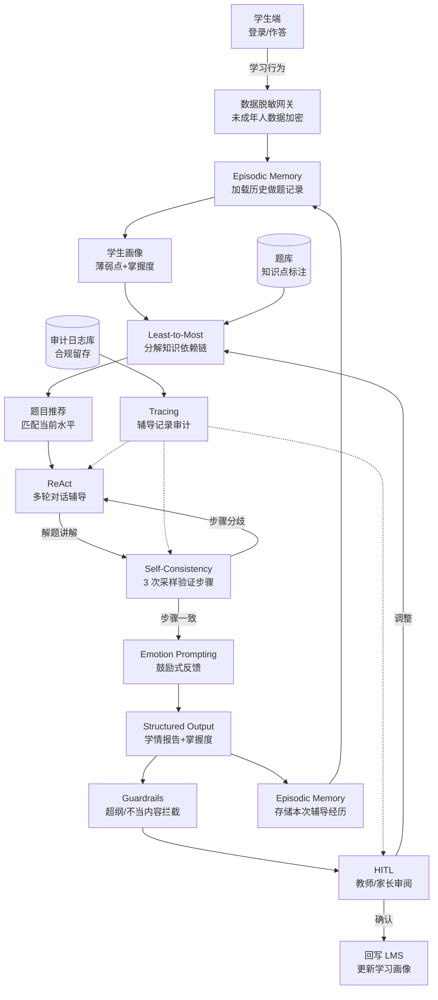
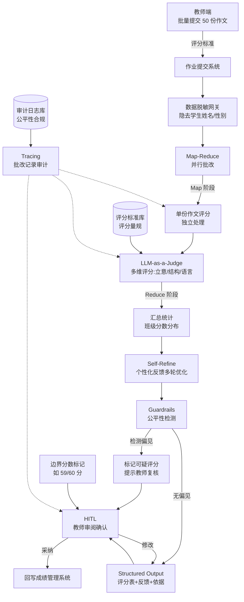
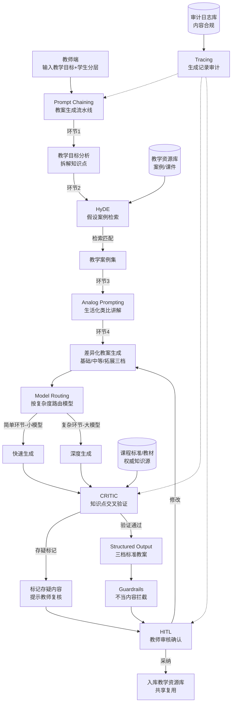

# 教育行业 — Agent 设计模式场景方案

> 教育行业是 Agent 落地中"育人属性最强"的领域：一次错误的知识点讲解可能误导学生认知、一次不公平的评分可能打击学习信心、一次越权的自主决策可能替代教师本应承担的育人职责。本方案围绕"因材施教"这一核心命题，将 93 种 Agent 设计模式映射到 3 个真实教育业务子场景，强调 **学生为本、教师主导、公平可释、合规护苗** 四大原则。
>
> 与其他行业相比，教育 Agent 的模式选型有三个根本差异：
> 1. **HITL 不是可选项而是必选项** —— Agent 永远是"辅助"角色，学习路径、最终评分、教学内容均需教师/家长把关，AI 不可替代教师；
> 2. **公平性与可解释性是底线** —— 批改评分必须避免算法偏见导致的教育差距，学习诊断必须可解释以便教师与家长理解；
> 3. **未成年人数据保护是红线** —— 涉及未成年学生数据时，《个人信息保护法》要求更严格的知情同意、最小必要与脱敏存储。

---

## 📖 行业故事：一个被题海淹没的初中生

> 某中学试点 AI 个性化辅导系统。初二学生小林数学连续两次不及格，家长焦虑之下给系统设定"每天刷 50 道题"。AI 给出的方案是——按章节顺序推送大量中等难度题，看起来很"努力"。
>
> 一个月后，小林做了 1500 道题，成绩不升反降。老师复盘才发现：小林的真正问题不是"练得少"，而是初一时"一元一次方程移项"这个基础概念就没搞懂，后续的二元一次方程组、分式方程全部建立在错误认知上。题海战术只是在错误的地基上反复盖楼，越盖越塌。
>
> AI 辅导失败了，因为它只看到了"做题数量"这个表面指标，没有"诊断根因"和"记住学生历史薄弱点"。教育场景中，误判学情比不辅导更危险——它让学生在错误方向上空耗时间与信心。

**翻车对话**：
```
家长输入：孩子数学不及格，请安排辅导计划
Agent：[Standard RAG：检索热门练习题]
       辅导计划：
       1. 第一章 二元一次方程组（20 题）
       2. 第二章 实数运算（20 题）
       3. 第三章 一次函数（20 题）
       ...
       每日 50 题，坚持一个月即可提升。
（误判学情——没有诊断基础概念缺口，盲目堆题量）
```

**救场对话**：
```
家长输入：孩子数学不及格，请安排辅导计划
Agent：[Episodic Memory：调取小林历史学习记录]
       [Least-to-Most：从易到难分解知识依赖]
         "小林在'移项变号'类题目的错误率达 78%"
         "根因：初一'一元一次方程移项'概念未掌握"
         "影响：后续方程组、分式方程均受波及"

       个性化辅导路径（从基础补起）：
       1. 【补基础】一元一次方程移项原理（5 道概念题 + 讲解）
       2. 【过渡】移项在二元方程组中的应用（8 道题）
       3. 【巩固】分式方程中的移项陷阱（10 道题）
       4. 【挑战】一次函数综合应用（按掌握度逐步解锁）

       ⚠️ 建议教师/家长确认：是否从初一基础补起？
       💡 已将诊断报告同步至教师端，供课堂重点关注。

教师：[审阅诊断] 确实是移项没搞懂，从基础补起。
（AI 的根因诊断 + 历史记忆帮助避免了无效题海）
```

---

### 4.5.1 个性化学习辅导

**故事开场**：初二学生小林数学连续不及格，家长按"题海战术"每天刷 50 题，一个月后成绩不升反降。传统辅导只看"做题量"不看"错在哪"，AI Agent 需要根据学生历史薄弱点定制从基础到进阶的学习路径，让每一道题都练在刀刃上。

**业务描述**：学生在辅导系统中完成练习或主动提问，Agent 基于学生历史学习记录诊断薄弱知识点，用从易到难的方式分解学习路径，推荐匹配难度的题目并多轮对话辅导解题。Agent 不替代教师教学，仅提供个性化练习与讲解建议，并将学情诊断同步给教师/家长监督。

**用户旅程**：
1. 学生登录系统，Agent 通过 Episodic Memory 加载该学生历史做题记录与薄弱点画像
2. Agent 用 Least-to-Most 将当前知识模块分解为从基础到进阶的子目标
3. Agent 推荐匹配学生水平的题目，学生作答后 ReAct 多轮对话辅导错题
4. Agent 用 Self-Consistency 验证解题步骤一致性，避免讲解出错
5. Agent 输出结构化学情报告（薄弱点 + 掌握度 + 推荐路径），同步教师/家长
6. 教师/家长通过 HITL 审阅学习路径，确认或调整后系统继续执行

**真实约束**：

| 约束维度 | 具体要求 | 对模式选型的影响 |
|---------|---------|----------------|
| 延迟 | 对话辅导响应 < 3s（学生注意力短），学习路径生成 < 10s | 不能用 ToT/LATS 等多分支搜索；ReAct 单轮推理需限制步数；Episodic Memory 检索需建索引加速 |
| 准确率 | 薄弱点诊断准确率 > 85%，解题讲解无知识性错误 | Self-Consistency 验证解题步骤；Least-to-Most 确保知识依赖不断层；Episodic Memory 提供历史依据 |
| 成本 | < ¥0.2/次辅导（教育场景成本敏感，面向 C 端家庭） | Model Routing 简单题目用小模型；Caching 缓存常见错题讲解；Self-Consistency 采样次数限 3 次 |
| 合规 | 未成年人数据特殊保护（个保法）；家长知情同意；不得替代教师 | 强制 HITL 教师/家长监督；数据脱敏存储；Guardrails 不输出超纲/不当内容；Tracing 留存辅导记录 |
| 集成 | 题库、学习管理系统(LMS)、学生画像、家长端 App | Function Calling 封装题库 API；Structured Output 输出学情报告便于 LMS 回写 |

**系统架构**：



**模式选型映射**：

| 架构层 | 基础设施组件 | 推荐模式 | 选型理由 |
|--------|------------|---------|---------|
| 历史学情 | 学生画像/做题记录库 | 5.5 Episodic Memory | 记住学生历史薄弱点与错题，避免重复推荐已掌握内容，实现真正的"因材施教" |
| 知识分解 | 知识图谱/课程标准 | 1.7 Least-to-Most | 将复杂知识模块从易到难分解，先补基础再进阶，避免知识断层（如先补移项再讲方程组） |
| 对话辅导 | 对话引擎 | 8.1 ReAct | Thought→Action→Observation 多轮辅导，边讲解边出题边观察学生反应，动态调整 |
| 步骤验证 | 推理引擎 | 1.4 Self-Consistency | 3 次采样验证解题步骤一致性，防止讲解出现知识性错误误导学生 |
| 输出规范 | 学情报告/LMS | 6.5 Structured Output | 强制输出薄弱点+掌握度+推荐路径的结构化报告，便于 LMS 回写与教师阅读 |
| 监督把关 | 教师/家长端 | 10.1 HITL | 学习路径与诊断报告需教师/家长确认，AI 不自主决定学生学什么 |
| 内容安全 | 合规引擎 | 7.2 Guardrails | 拦截超纲内容、不当表述，保护未成年人 |
| 审计追溯 | 审计日志库 | 12.1 Tracing | 留存辅导对话、诊断过程、家长确认轨迹，满足未成年人数据保护合规 |

**失败模式与应对**：

| 失败场景 | 业务影响 | 应对方案 |
|---------|---------|---------|
| 薄弱点误诊（把"计算粗心"误判为"概念不懂"） | 学习路径跑偏，浪费时间补错内容 | Episodic Memory 提供历史错题佐证；Self-Consistency 多次诊断取一致结论；置信度低时强制 HITL 教师复核 |
| 解题讲解出现知识性错误 | 误导学生认知，比不辅导更糟 | Self-Consistency 验证步骤一致性；Guardrails 拦截可疑表述；教师端抽查辅导记录 |
| 题目难度不匹配（太难打击信心/太简单无进步） | 学生失去兴趣或原地踏步 | Least-to-Most 按掌握度逐步解锁；Episodic Memory 记录历史通过率动态调档 |
| 学生依赖 AI 直接给答案 | 养成惰性，丧失独立思考 | ReAct 辅导只给提示不给答案；Guardrails 拦截"直接输出答案"请求；引导式提问 |
| 历史记录缺失（新用户无 Episodic Memory） | 无法个性化，退化为通用推荐 | 降级为入学诊断测试，先采集基础学情再生成路径；明确标注"数据不足，建议先完成诊断" |
| 辅导内容超纲（给初二学生讲高中内容） | 增加学生负担，违背课程标准 | Guardrails 按年级限制知识范围；课程标准知识图谱校验；超纲内容强制拦截 |

**快速启动配方**：

```python
# 个性化学习辅导 Agent 核心模式组合伪代码
def personalized_tutoring(student_id, current_module):
    # 1. Episodic Memory：加载学生历史学习记录，诊断薄弱点
    history = episodic_memory_load(student_id)  # 历史错题/掌握度/薄弱知识点
    weak_points = diagnose_weakness(history)    # "移项变号错误率78%"
    # 2. Least-to-Most：从易到难分解知识依赖链（先补基础再进阶）
    learning_path = least_to_most(current_module, weak_points)
    # learning_path = ["一元一次方程移项", "二元方程组应用", "分式方程", ...]
    # 3. 题目推荐：匹配学生当前水平
    exercises = recommend_exercises(learning_path[0], level=profile_level(student_id))
    # 4. ReAct 多轮对话辅导（边讲解边出题边观察）
    for exercise in exercises:
        student_answer = student_attempt(exercise)
        if not is_correct(student_answer, exercise):
            # 5. Self-Consistency：3 次采样验证解题步骤，避免讲解出错
            explanations = [generate_explanation(exercise, student_answer) for _ in range(3)]
            verified = aggregate_consistent(explanations)  # 多数投票取一致讲解
            # ReAct 循环：讲解 → 提示 → 观察学生反应 → 再讲解
            reply = react_tutor(exercise, verified, tone="encouraging")
            send_reply(student_id, reply)
    # 6. Structured Output：生成学情报告（薄弱点+掌握度+推荐路径）
    report = structured_output(history, learning_path, schema=LEARNING_REPORT_SCHEMA)
    # 7. Guardrails：拦截超纲/不当内容
    report = guardrails_check(report, grade=student_grade(student_id))
    # 8. HITL：教师/家长审阅确认（AI 不自主决定学生学什么）
    final = await teacher_parent_confirm(report)  # 阻塞等待确认
    # 9. Episodic Memory：存储本次辅导经历，供未来参考
    episodic_memory_save(student_id, report)
    # 10. Tracing：留存辅导记录，满足未成年人数据保护合规
    tracing.log(student_id, weak_points, learning_path, report, confirmed_by=final.reviewer)
    return final
```

---

### 4.5.2 自动批改与反馈

**故事开场**：语文老师王老师每周要批改 50 份作文，每份精读 + 写评语至少 8 分钟，一个晚上就耗在批改上。更难的是反馈要因人而异——有的学生需要改结构，有的需要练语言，统一评语毫无意义。AI Agent 需要批量并行批改、给出可解释的评分，并为每个学生生成个性化改进建议，但最终评分权仍在教师手中。

**业务描述**：教师批量提交学生作业（如作文、简答题），Agent 并行批改每份作业，用 LLM 评审员按评分标准打分，多轮优化个性化反馈，输出结构化评分报告。Agent 评分仅作参考，教师可一键采纳或修改，重点关注 Agent 标记的"边界分数"作业。全程需公平性防护，避免因学生姓名、性别、字迹等非内容因素产生评分偏差。

**用户旅程**：
1. 教师在作业系统批量提交 50 份作文，设定评分标准与满分值
2. Agent 用 Map-Reduce 并行批改：Map 阶段每份作文独立评分，Reduce 阶段汇总统计
3. 每份作文由 LLM-as-a-Judge 按评分维度（立意/结构/语言/书写）打分
4. Agent 用 Self-Refine 多轮优化个性化反馈，针对每个学生的薄弱维度给改进建议
5. Guardrails 公平性防护：检测评分是否受非内容因素（姓名/性别）影响
6. Structured Output 输出评分表 + 个性化反馈，教师审阅后一键采纳或修改
7. 系统标记"边界分数"（如 59/60 分）作业，提示教师重点复核

**真实约束**：

| 约束维度 | 具体要求 | 对模式选型的影响 |
|---------|---------|----------------|
| 延迟 | 50 份作文批改 < 5 分钟（教师当晚等待结果） | 必须用 Map-Reduce 并行批改；不能用串行循环；Self-Refine 轮数限 2 轮 |
| 准确率 | 评分与教师一致性 > 85%，反馈针对性 > 90% | LLM-as-a-Judge 按多维评分标准打分；Self-Refine 优化反馈；边界分数强制教师复核 |
| 成本 | < ¥0.5/份（教育场景预算有限） | Model Routing 简单作业用小模型；Map-Reduce 分片降低单次 token；Caching 缓存评分标准 |
| 合规 | 公平性（避免偏见）；不得替代教师最终评分；评分可解释 | Guardrails 公平性防护；HITL 教师确认；Structured Output 含评分依据；Tracing 留存批改记录 |
| 集成 | 作业提交系统、成绩管理系统、教师工作站 | Function Calling 封装作业系统 API；Structured Output 输出成绩表便于回写 |

**系统架构**：



**模式选型映射**：

| 架构层 | 基础设施组件 | 推荐模式 | 选型理由 |
|--------|------------|---------|---------|
| 批量批改 | 分布式计算 | 6.3 Map-Reduce | 50 份作文并行批改，Map 独立评分、Reduce 汇总统计，5 分钟内完成 |
| 自动评分 | 评审模型 | 11.1 LLM-as-a-Judge | 按立意/结构/语言/书写多维评分标准打分，输出可解释的评分依据 |
| 反馈优化 | 迭代引擎 | 9.1 Self-Refine | 多轮优化个性化反馈，针对每个学生薄弱维度给针对性改进建议 |
| 评分规范 | 成绩管理系统 | 6.5 Structured Output | 强制输出评分表+维度得分+反馈+依据，便于成绩系统回写与教师审阅 |
| 公平防护 | 合规引擎 | 7.2 Guardrails | 检测评分是否受姓名/性别/字迹等非内容因素影响，标记可疑评分 |
| 教师确认 | 教师工作站 | 10.1 HITL | 教师审阅评分，边界分数与可疑评分强制复核，AI 不替代教师最终评分 |
| 审计追溯 | 审计日志库 | 12.1 Tracing | 留存批改过程、评分依据、教师修改轨迹，满足公平性合规审查 |

**失败模式与应对**：

| 失败场景 | 业务影响 | 应对方案 |
|---------|---------|---------|
| 评分受学生姓名/性别影响（公平性偏差） | 教育不公，引发家长投诉 | 数据脱敏网关隐去姓名性别；Guardrails 公平性检测；可疑评分强制教师复核 |
| 评分与教师标准不一致（偏严或偏松） | 成绩失真，学生不服 | LLM-as-a-Judge 严格按评分量规打分；教师抽检校准；Caching 缓存标定样本 |
| 反馈千篇一律（每份评语雷同） | 学生得不到针对性指导 | Self-Refine 针对每份作文薄弱维度优化；LLM-as-a-Judge 评估反馈针对性 |
| 边界分数误判（59 分给成 60 分） | 影响学生等第与升学 | 边界分数（±2 分）强制 HITL 教师复核；Structured Output 标记边界 case |
| 批改超时（作文量过大） | 教师当晚拿不到结果 | Map-Reduce 动态分片；Model Routing 简单作文用小模型加速；超时返回已完成部分 |
| 评分依据不可解释（只给分不给理由） | 教师无法复核，学生不服 | Structured Output 强制含评分依据；LLM-as-a-Judge 输出每维度扣分理由 |

**快速启动配方**：

```python
# 自动批改与反馈 Agent 核心模式组合伪代码
def auto_grading(essays, rubric, teacher_id):
    # 1. 数据脱敏：隐去学生姓名/性别，防止评分偏见
    anonymized = [anonymize(e) for e in essays]  # 学生A → 学号001
    # 2. Map-Reduce：并行批改 50 份作文
    graded = map_reduce(
        anonymized,
        map_fn=lambda e: judge_single(e, rubric),   # Map: 单份独立评分
        reduce_fn=merge_class_stats                   # Reduce: 汇总班级分布
    )
    # 3. LLM-as-a-Judge：按多维评分标准打分（立意/结构/语言/书写）
    for essay in graded:
        essay.scores = llm_as_judge(essay, rubric)  # 每维度得分+扣分依据
    # 4. Self-Refine：多轮优化个性化反馈
    for essay in graded:
        essay.feedback = self_refine(
            essay, weak_dims=essay.scores.lowest_dims(), rounds=2
        )  # 针对薄弱维度给改进建议
    # 5. Guardrails：公平性检测，标记可疑评分
    suspicious = guardrails_fairness_check(graded)  # 检测非内容因素影响
    # 6. Structured Output：评分表+反馈+依据
    report = structured_output(graded, schema=GRADING_SCHEMA)
    # 7. 边界分数标记（如 59/60 分）提示教师重点复核
    border_cases = [e for e in graded if abs(e.total - pass_line) <= 2]
    # 8. HITL：教师审阅确认（AI 评分仅作参考，最终权归教师）
    for case in border_cases + suspicious:
        case.needs_review = True  # 强制教师复核
    final = await teacher_confirm(report, border_cases, suspicious)
    # 9. 回写成绩管理系统
    grade_system_writeback(final)
    # 10. Tracing：留存批改记录，满足公平性合规审查
    tracing.log(teacher_id, rubric, graded, suspicious, final)
    return final
```

---

### 4.5.3 教学内容生成

**故事开场**：数学李老师要为"勾股定理"一节课准备教案，但班上学生水平参差——前 10 名能直接做综合题，后 10 名连直角三角形都画不标准。一份教案根本无法兼顾。李老师需要为三个层次的学生分别准备差异化教案，还要配上生活化的类比案例让抽象定理好懂。AI Agent 需要按教学目标自动生成差异化教案，但所有内容必须经教师审核，确保知识点准确无误。

**业务描述**：教师输入教学目标（如"勾股定理"）与学生分层信息，Agent 通过教案生成流水线自动产出基础/中等/拓展三档差异化教案。Agent 用 HyDE 检索教学案例，Analog Prompting 生成生活化类比讲解，CRITIC 审核知识点准确性，Model Routing 按任务复杂度路由模型以控制成本。所有教案经教师 HITL 审核后方可使用，AI 不自主决定教学内容。

**用户旅程**：
1. 教师输入教学目标（如"勾股定理"）与班级学生分层（基础/中等/拓展）
2. Agent 用 Prompt Chaining 串联教案生成流水线：目标分析 → 案例检索 → 讲解生成 → 审核优化
3. HyDE 生成假设性教学案例文档，检索教学资源库匹配真实案例
4. Analog Prompting 为抽象概念生成生活化类比（如"勾股定理"→"梯子靠墙"）
5. Model Routing 按任务复杂度路由：案例检索用小模型，讲解生成用大模型
6. CRITIC 交叉验证教案知识点与教材/课程标准，标记存疑内容
7. 输出三档差异化教案，教师 HITL 审核确认后入库共享

**真实约束**：

| 约束维度 | 具体要求 | 对模式选型的影响 |
|---------|---------|----------------|
| 延迟 | 三档教案生成 < 2 分钟（教师备课等待） | Prompt Chaining 各环节并行化；Model Routing 简单环节用小模型；HyDE 检索限 Top-5 |
| 准确率 | 知识点准确性 > 95%（错误知识误导师生），适配度 > 85% | CRITIC 交叉验证教材；Analog Prompting 类比需科学正确；HITL 教师终审 |
| 成本 | < ¥1/份教案（教育预算有限） | Model Routing 按复杂度路由模型；Caching 缓存常见教学案例；Prompt Chaining 复用中间产物 |
| 合规 | 内容审核（无错误知识/不当内容）；教师审核必选；符合课程标准 | CRITIC 校验课程标准；Guardrails 拦截不当内容；HITL 教师终审；Tracing 留存生成记录 |
| 集成 | 教学资源库、课程标准、教材库、教师备课系统 | Function Calling 封装资源库 API；Structured Output 输出标准教案格式 |

**系统架构**：



**模式选型映射**：

| 架构层 | 基础设施组件 | 推荐模式 | 选型理由 |
|--------|------------|---------|---------|
| 生成流水线 | 教案生成引擎 | 6.8 Prompt Chaining | 串联目标分析→案例检索→讲解生成→审核优化，各环节可独立优化与复用 |
| 案例检索 | 教学资源库 | 3.7 HyDE | 生成假设性教学案例文档再检索，弥补教学案例表述多样导致的检索召回不足 |
| 类比讲解 | 讲解生成 | 1.8 Analog Prompting | 为抽象概念自生成生活化类比（如勾股定理→梯子靠墙），让抽象知识好懂 |
| 内容审核 | 课程标准/教材 | 9.3 CRITIC | 交叉验证教案知识点与教材/课程标准，标记存疑内容，杜绝知识性错误 |
| 成本优化 | 模型路由 | 12.4 Model Routing | 按任务复杂度路由：案例检索用小模型，讲解生成用大模型，平衡质量与成本 |
| 输出规范 | 教师备课系统 | 6.5 Structured Output | 输出标准教案格式（目标/重难点/过程/作业），便于入库共享与教师编辑 |
| 教师终审 | 教师工作站 | 10.1 HITL | 教师审核教案，存疑内容强制复核，AI 不自主决定教学内容 |
| 审计追溯 | 审计日志库 | 12.1 Tracing | 留存生成过程、审核记录、教师修改，满足内容合规审查 |

**失败模式与应对**：

| 失败场景 | 业务影响 | 应对方案 |
|---------|---------|---------|
| 教案出现知识性错误（如公式写错） | 误导师生，教学事故 | CRITIC 交叉验证教材；Guardrails 拦截可疑公式；HITL 教师终审 |
| 类比讲解不科学（如用错误类比误导概念） | 学生形成错误认知 | Analog Prompting 类比需经 CRITIC 验证科学性；教师审核类比合理性 |
| 差异化教案难度断层（基础档太难/拓展档太简单） | 分层教学失效 | 按学生分层画像严格匹配难度；教师审核难度梯度；Episodic Memory 参考历史反馈 |
| 检索案例过时或不相关 | 教案质量差，教师不信任 | HyDE 检索后 CRITIC 校验案例相关性；教学资源库定期更新；Top-5 限流 |
| 生成成本超预算（三档教案 token 过大） | 教育预算超支 | Model Routing 简单环节用小模型；Caching 缓存常见案例；Prompt Chaining 复用中间产物 |
| 教案脱离课程标准（超纲或漏知识点） | 不符合教学要求 | CRITIC 校验课程标准覆盖度；Structured Output 标注对应课标条目；教师审核 |

**快速启动配方**：

```python
# 教学内容生成 Agent 核心模式组合伪代码
def generate_lesson_plan(topic, student_tiers, teacher_id):
    # topic="勾股定理", student_tiers=["基础","中等","拓展"]
    # 1. Prompt Chaining：教案生成流水线（各环节串联）
    # 环节 1：教学目标分析，拆解知识点
    objectives = chain_step_1(topic)  # "理解勾股定理→证明→应用"
    # 2. HyDE：生成假设性教学案例文档，检索真实案例
    hypo_doc = hyde_generate(topic)  # 假设"梯子靠墙求高度"的案例描述
    cases = hyde_retrieve(hypo_doc, source="教学资源库")  # 检索匹配真实案例
    # 3. Model Routing：按复杂度路由模型（检索用小模型，讲解用大模型）
    cases = model_route(cases, simple_task=True)   # 小模型快速处理
    # 4. Analog Prompting：为抽象概念生成生活化类比讲解
    analogies = analog_prompting(topic)  # "勾股定理"→"梯子靠墙/电视尺寸"
    # 5. 差异化教案生成（基础/中等/拓展三档）
    plans = model_route(
        [generate_tier_plan(objectives, cases, analogies, tier) for tier in student_tiers],
        complex_task=True  # 大模型深度生成
    )
    # 6. CRITIC：交叉验证知识点与教材/课程标准
    for plan in plans:
        issues = critic_verify(plan, sources=["教材", "课程标准"])
        plan.flagged = issues  # 标记存疑内容
    # 7. Structured Output：标准教案格式（目标/重难点/过程/作业）
    plans = [structured_output(p, schema=LESSON_PLAN_SCHEMA) for p in plans]
    # 8. Guardrails：拦截不当内容
    plans = [guardrails_check(p) for p in plans]
    # 9. HITL：教师审核确认（存疑内容强制复核，AI 不自主决定教学内容）
    for plan in plans:
        if plan.flagged:
            plan.needs_review = True
    final = await teacher_confirm(plans, teacher_id)
    # 10. 入库共享 + Tracing 留存生成记录
    for plan in final:
        if plan.approved:
            resource_library_save(plan)  # 入库供其他教师复用
    tracing.log(teacher_id, topic, cases, analogies, plans, final)
    return final
```

---

## 总结：教育行业模式选型核心原则

教育行业的 Agent 设计模式选型，必须围绕以下四大核心原则展开，任何偏离都可能损害学生利益或违背教育规律：

### 1. 学生为本（Student First）
- **因材施教是核心目标**：5.5 Episodic Memory 记住学生历史薄弱点，1.7 Least-to-Most 从易到难分解知识依赖，让每一份练习都练在刀刃上，而非盲目题海。
- **保护学习信心**：题目难度需匹配学生水平，Analog Prompting 用生活化类比降低理解门槛，Emotion Prompting 用鼓励式反馈保护学习兴趣。
- **防止依赖**：ReAct 辅导只给提示不给答案，Guardrails 拦截"直接输出答案"请求，培养学生独立思考能力。

### 2. 教师主导（Teacher in the Loop）
- **HITL 不是可选项而是必选项**：学习路径、最终评分、教学内容均需教师/家长确认，AI 永远是"辅助"角色，不可替代教师。
- **AI 辅助而非替代**：自动批改的评分仅作参考，最终评分权归教师；教学内容生成需教师终审，AI 不自主决定教什么。
- **边界 case 强制转人工**：批改中的边界分数、辅导中的低置信度诊断、教案中的存疑内容，均强制 HITL 介入。

### 3. 公平可释（Fairness & Explainability）
- **公平性防护是底线**：7.2 Guardrails 检测评分是否受姓名/性别/字迹等非内容因素影响，避免算法偏见导致的教育差距。
- **评分可解释**：11.1 LLM-as-a-Judge 按多维评分标准打分并输出扣分依据，6.5 Structured Output 强制含评分理由，教师可复核、学生可服气。
- **诊断可解释**：学情诊断需输出薄弱点依据（如"移项类题目错误率 78%"），便于教师与家长理解并配合。

### 4. 合规护苗（Compliance & Protection）
- **未成年人数据特殊保护**：《个人信息保护法》要求知情同意、最小必要、脱敏存储，数据脱敏网关是必备组件，Tracing 全程审计。
- **内容安全红线**：9.3 CRITIC 校验知识点准确性，Guardrails 拦截超纲/不当内容，杜绝知识性错误与不良信息侵害未成年人。
- **教育公平**：算法不得因学生背景产生差异化对待，评分标准需统一透明，避免技术加剧教育差距。

> **一句话总结**：教育 Agent 的设计哲学是 **"宁可保守，不可冒进；宁可转教师，不可越权；宁可慢一步，不可错一生"**。模式选型的核心不是追求"更智能"，而是追求"更因材施教、更公平可释、更守护成长"。

---

## 行业通用模式组合建议

基于三个子场景的实践，教育行业 Agent 推荐以下通用模式组合配方：

| 组合配方 | 适用场景 | 核心模式 | 组合逻辑 |
|---------|---------|---------|---------|
| **个性化辅导四件套** | 学习辅导、智能答疑 | 5.5 Episodic Memory + 1.7 Least-to-Most + 8.1 ReAct + 1.4 Self-Consistency | 记忆历史→分解路径→对话辅导→验证步骤，形成"诊断-教学-验证"闭环 |
| **批量批改流水线** | 作业批改、考试阅卷 | 6.3 Map-Reduce + 11.1 LLM-as-a-Judge + 9.1 Self-Refine + 7.2 Guardrails | 并行批改→多维评分→优化反馈→公平防护，兼顾效率与公平 |
| **内容生成流水线** | 教案生成、课件制作 | 6.8 Prompt Chaining + 3.7 HyDE + 1.8 Analog Prompting + 9.3 CRITIC | 串联流水线→检索案例→类比讲解→审核校验，确保内容准确好懂 |
| **成本优化通用件** | 所有教育 C 端场景 | 12.4 Model Routing + 12.3 Caching + 12.1 Tracing | 按复杂度路由模型→缓存常见内容→审计追溯，教育预算有限下的必备组合 |
| **合规护苗通用件** | 所有涉及未成年人的场景 | 7.2 Guardrails + 10.1 HITL + 6.5 Structured Output + 12.1 Tracing | 内容拦截→人工把关→结构化输出→审计留存，满足未成年人保护合规 |

---

## 合规与风险提示

教育行业 Agent 落地需特别关注以下合规要点与风险：

### 1. 《个人信息保护法》对未成年人学生数据的特殊保护
- **知情同意**：处理不满 14 周岁未成年人学生数据，需取得父母或其他监护人的同意；Agent 系统需内置监护人授权流程。
- **最小必要**：仅收集与教育目的直接相关的数据（如做题记录），不得过度采集人脸、位置等敏感信息。
- **脱敏存储**：学生姓名、学号等身份信息需脱敏/加密存储，数据脱敏网关是批改、辅导场景的必备组件。
- **可删除权**：家长有权要求删除学生历史数据，Episodic Memory 等记忆组件需支持按学生 ID 清除。

### 2. 教育部《生成式人工智能服务管理暂行办法》对教育 AI 的要求
- **内容安全**：生成式 AI 提供的教育内容需符合社会主义核心价值观，不得含有错误知识、不良信息，CRITIC 与 Guardrails 是必备审核组件。
- **标识义务**：AI 生成的教案、反馈等内容需向用户标识"由 AI 生成"，教师审核后方可正式使用。
- **训练数据合规**：用于训练/检索的教学资源需有合法来源，HyDE 检索的资源库需确保版权合规。
- **不得替代教师**：AI 仅作辅助工具，不得替代教师承担教育教学的核心职责，HITL 是硬性要求。

### 3. 教育公平性：避免算法偏见导致的教育差距
- **评分公平**：自动批改需消除姓名、性别、字迹等非内容因素影响，Guardrails 公平性检测是必备环节。
- **资源均衡**：个性化推荐不得因学生背景（城乡、经济）差异化降级内容质量，所有学生应享有同等质量的教学资源。
- **可解释性**：学习诊断、评分结果需可解释，避免"黑箱"决策影响学生发展，Structured Output 强制含依据。
- **定期审计**：Tracing 全程审计辅导、批改、生成记录，定期进行公平性与偏见审查。

### 4. 教师不可替代：AI 辅助而非替代教师
- **角色边界**：AI 是教师的"助教"而非"替身"，学习路径决策、最终评分、教学内容审定等核心教育决策权归教师。
- **HITL 全覆盖**：三个子场景均强制 HITL——辅导需家长/教师确认路径、批改需教师确认评分、生成需教师审核内容。
- **教师赋能**：AI 应减轻教师重复性工作（如批改），让教师将精力投入育人核心环节（如情感关怀、价值观引导）。
- **责任归属**：AI 辅助产生的教学事故（如错误知识、不公评分），最终责任由教师与学校承担，因此 HITL 既是合规要求也是责任分担机制。
