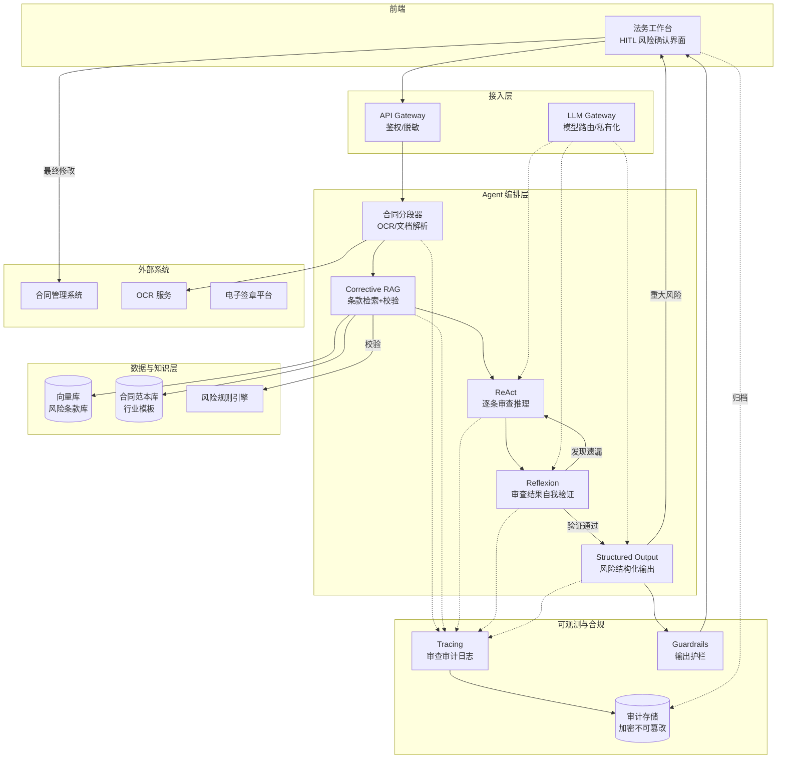
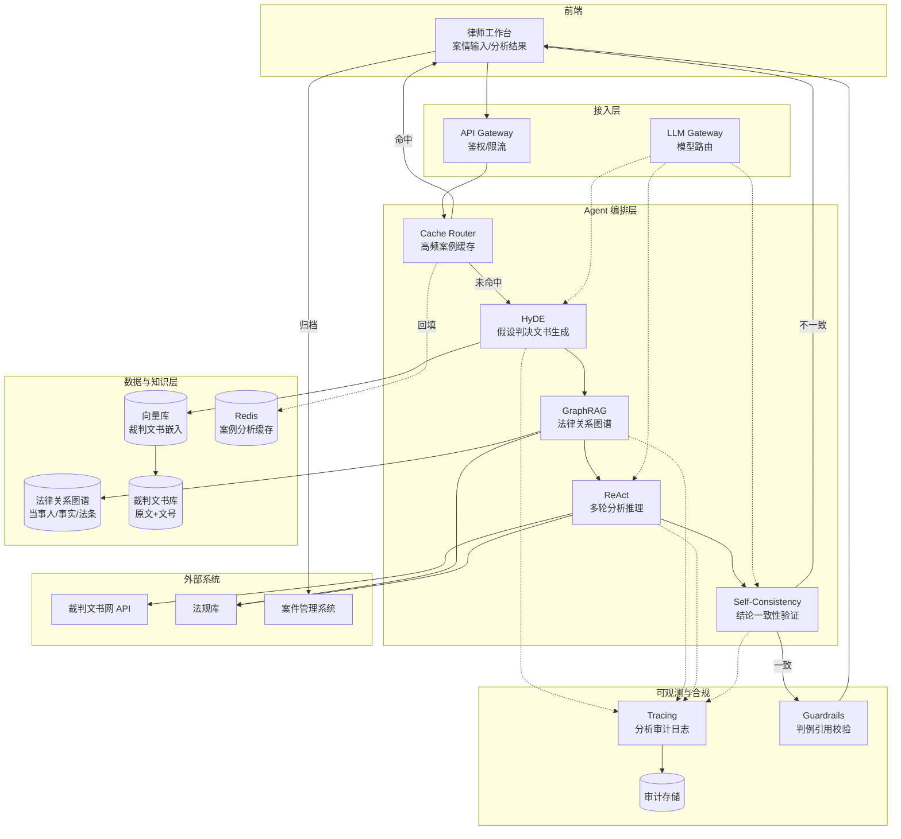
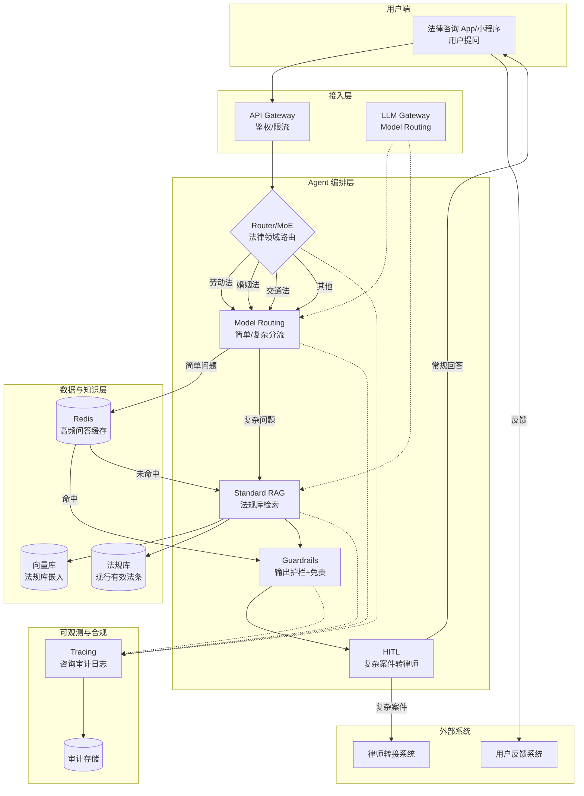

# 法律行业 — Agent 设计模式场景方案

> 法律行业是 AI Agent 落地要求"严谨性"与"合规性"并重的领域。一份漏检的合同条款可能导致企业百万级损失，一次错误的案例检索可能让律师在法庭上措手不及，一条越界的法律建议可能触碰《律师法》红线。本方案聚焦法律业务对 **准确性、可溯源、合规边界** 的极高要求，给出 3 个典型子场景的 Agent 设计模式深度映射。

法律行业的 Agent 设计有三条不可妥协的底线：

1. **合规边界**：AI 不得替代律师执业，不得出具正式法律意见书，所有输出必须明确"AI 辅助，不构成法律意见"的免责声明。任何模式组合都必须内嵌 Guardrails（输出护栏）与合规对齐，确保不越《律师法》红线。
2. **可溯源性**：法律工作讲究"证据链"与"依据引用"，合同审查必须标注条款出处，案例检索必须引用判例文号，法规建议必须引用具体法条。因此 Corrective RAG（可溯源检索）、GraphRAG（关系图谱）等能产出可引用证据的模式是核心。
3. **人工兜底**：重大合同风险、复杂诉讼策略、敏感法律咨询必须经 HITL（Human-in-the-Loop）由执业律师确认，Agent 永远是"辅助"而非"替代"，责任归属必须清晰。

在此之上，法律场景对准确率、保密性、公正性的约束呈现极端分化：合同审查要求 0 漏检隐蔽条款，案例检索要求召回相似判例而非关键词匹配，法律咨询要求避免算法偏见导致的不公正建议。这种分化决定了法律 Agent 不能用"一套模式打天下"，而必须通过 **Router/MoE** 在不同业务类型间动态切换模式组合，并通过 **Reflexion** 自我验证审查结论的完整性。

---

## 📖 行业故事：一份漏检的自动续约条款

> 某科技公司法务部收到一份 50 页的采购合同，法务专员小王加班审查到凌晨 3 点，眼睛酸涩，匆匆扫过第 38 页的一条"自动续约"条款——"本合同到期前 60 日内，若双方均未书面提出终止，则自动续期 3 年，续约价格以上一年度采购量为基准上浮 8%"。小王没注意到这条，签字归档。两年后公司想更换供应商，才发现合同已自动续约，违约金高达 200 万。
>
> 法务总监痛心疾首："一份合同审 50 页，人眼疲劳漏检是必然的！AI 审查不是让你替代法务，而是让你帮法务把每一条都过一遍！"

**翻车对话**：
```
法务专员：这份50页采购合同，帮我看看有没有问题。
Agent：[扫描全文] 合同主体清晰，付款条款正常，违约责任对等，建议签署。
法务专员：好的，没问题就签了。
（实际：第38页隐蔽自动续约条款被漏检，2年后公司损失200万违约金）
```

**救场对话**：
```
法务专员：这份50页采购合同，帮我看看有没有问题。
Agent：[Corrective RAG：分段检索合同条款库 → 第38页命中"自动续约"风险模式]
       [ReAct：逐条推理 → "到期前60日未书面终止则自动续期3年"属于高风险条款]
       [Reflexion：自我验证 → 重新审查续约价格上浮8%是否合理，确认风险]
       [Structured Output：结构化输出风险清单]

       ⚠️ 风险预警（共3项）：
       1. 【高风险】第38页：自动续约条款（续期3年，价格上浮8%）
          - 风险点：未主动终止即续约，可能被动锁定供应商
          - 建议：增加"续约需双方书面确认"条款
       2. 【中风险】第12页：知识产权归属模糊
       3. 【低风险】第45页：争议解决地约定在对方所在地

       [HITL：自动续约属重大风险，请法务专员人工确认修改方案]
法务专员：第38页这条确实要改，AI比人眼靠谱。
```

---

## 4.6.1 合同审查与风险识别

**业务描述**：企业法务在收到合同文本后，将合同提交给 Agent，Agent 对合同进行分段解析、逐条审查，识别风险条款（如自动续约、单方解除权、违约金过高、知识产权归属模糊等），输出结构化风险清单（含条款位置、风险等级、修改建议），法务基于 Agent 输出做最终修改决策并归档。

**用户旅程**：
1. 法务上传合同文档（PDF/Word/扫描件），Agent 通过 OCR/文档解析将合同分段（按条款编号或语义切分）。
2. Agent 用 Corrective RAG 检索合同条款库（历史风险条款库 + 行业合同范本），对每段条款进行风险模式匹配，检索结果经校验后采纳。
3. Agent 用 ReAct 逐条推理：识别条款类型（付款/违约/续约/知识产权等）→ 评估风险等级 → 生成修改建议，每步附带推理依据。
4. Agent 用 Reflexion 自我验证审查结论：重新审视已识别风险是否遗漏，已输出建议是否合理，发现遗漏则补充。
5. Agent 用 Structured Output 生成结构化风险清单（条款编号、位置、风险类型、风险等级、修改建议、依据引用）。
6. 重大风险（高违约金、自动续约、单方解除权等）触发 HITL，法务专员人工确认修改方案。
7. 全链路审查依据（分段结果、检索命中、推理过程、风险判定）写入 Tracing 审计存储，供事后追溯与质量复盘。

**真实约束**：

| 约束维度 | 具体要求 | 对模式选型的影响 |
|---------|---------|----------------|
| 准确率 | 风险条款漏检率 < 1%（漏检一条可能导致百万级损失） | 必须用 Corrective RAG 检索条款库 + Reflexion 自我验证，单一审查路径不可接受；高风险条款强制 Reflexion 二次确认 |
| 延迟 | 50 页合同审查 < 60s（法务在等待结果） | 合同分段后可并行审查各段，ReAct 逐条推理需控制 max_steps；简单条款用小模型快速过滤，复杂条款用大模型深度分析 |
| 保密性 | 合同含商业机密，不得泄露给第三方模型服务 | 优先使用私有化部署模型；如用云端模型需脱敏处理（替换公司名/金额/核心商业条款）；Tracing 日志加密存储 |
| 合规 | 审查建议必须引用具体法规或行业惯例，不得出具"法律意见" | Structured Output 强制附带"依据引用"字段；Guardrails 过滤"本合同违法"等越界表述，改为"存在风险，建议咨询律师" |
| 集成 | 合同管理系统、条款库、OCR 服务、电子签章平台 | ReAct 多轮推理中动态调用条款库检索；Corrective RAG 检索后校验条款是否仍在生效法规范围内 |

**系统架构**：



**模式选型映射**：

| 架构层 | 基础设施组件 | 推荐模式 | 选型理由 |
|--------|------------|---------|---------|
| 条款检索 | 向量库 + 合同范本库 | 3.3 Corrective RAG | 检索风险条款库后必须校验：①检索到的风险模式是否适用于当前合同类型 ②引用的法规是否仍生效；不匹配结果丢弃重检索，避免误报 |
| 逐条审查 | LLM Gateway | 8.1 ReAct | 合同审查需"识别条款类型→评估风险→生成建议"多步推理，ReAct 的 Thought-Action-Observation 循环天然适配逐条审查；每步可调用条款库/法规库验证 |
| 结论验证 | LLM Gateway | 9.2 Reflexion | 审查完成后自我反思"是否遗漏隐蔽条款""建议是否合理"，发现遗漏则补充审查；这是将漏检率压到 1% 以下的关键，人眼疲劳漏检靠 AI 自我验证补位 |
| 风险输出 | Structured Output 解析器 | 6.5 Structured Output | 风险清单必须结构化（条款编号/位置/风险等级/修改建议/依据引用），便于法务快速定位与合同管理系统对接；非结构化文本无法支撑后续流程 |
| 人工兜底 | HITL 工作台 | 10.1 HITL（Human-in-the-Loop） | 重大风险（自动续约/高违约金/单方解除权）强制法务专员确认修改方案；Agent 仅提供建议，不替代法务决策，责任归属清晰 |
| 审计合规 | Tracing + 加密存储 | 12.1 Tracing | 全链路审查日志（分段结果/检索命中/推理过程/风险判定/人工修改）加密存储，满足事后追溯与质量复盘；合同涉密，日志必须加密 |
| 输出护栏 | Guardrails 规则引擎 | 7.2 Guardrails | 输出层过滤越界表述（"本合同违法""建议不签署"等），改为"存在风险，建议咨询律师"；强制附加"AI 辅助，不构成法律意见"免责声明 |

**失败模式与应对**：

| 失败场景 | 业务影响 | 应对方案 |
|---------|---------|---------|
| OCR 识别错误（扫描件模糊） | 条款文本错误，风险识别失真 | OCR 置信度低于阈值时标记"需人工核对原文"；关键条款（违约/续约/解除权）强制人工复核原文，不依赖 OCR 结果 |
| Corrective RAG 检索召回低 | 漏检已知风险模式，隐蔽条款未识别 | 双路召回：风险条款库 + 合同范本库交叉验证；检索结果为空时降级为 ReAct 纯推理审查，并标记"未匹配历史模式"提示 |
| Reflexion 自我验证仍遗漏 | 漏检风险，法务依赖 AI 输出导致损失 | Reflexion 仅作为补充，不替代法务最终确认；高风险合同（金额 > 100万）强制 HITL 全文复核；定期用 Red Teaming 对抗测试审查覆盖度 |
| 大模型幻觉生成不存在的法规引用 | 法务引用错误法规，决策失误 | Structured Output 强制"依据引用"字段经法规库校验，引用不存在的法条时标记"引用待核实"；Guardrails 拦截无依据的结论 |
| 合同涉密信息泄露给云端模型 | 商业机密泄露，法律责任 | 优先私有化部署模型；云端调用前脱敏（替换公司名/金额/核心条款）；Tracing 日志加密存储，访问需审计 |
| 法务盲目采纳 Agent 建议未核实 | 责任归属不清，漏检风险转嫁 AI | HITL 界面强制法务填写"审查确认"，与 Agent 建议不一致时需说明；Tracing 记录人机决策差异 |

**快速启动配方**：

```python
# 合同审查与风险识别 - 核心模式组合伪代码
def contract_review(contract_doc):
    # 1. 合同分段：OCR + 文档解析，按条款编号或语义切分
    segments = contract_parser.segment(contract_doc)  # 返回 [(clause_id, text, page), ...]

    # 2. Corrective RAG：检索风险条款库 + 校验适用性
    risks = []
    for seg in segments:
        candidates = vector_db.search(seg.text, top_k=5)  # 风险条款库召回
        validated = corrective_rag.validate(
            candidates, contract_type=contract_doc.type,
            validator=risk_rule_engine  # 校验风险模式是否适用
        )

        # 3. ReAct：逐条审查推理（识别类型→评估风险→生成建议）
        analysis = react_loop(
            seg, tools=[clause_library, regulation_db],
            max_steps=4
        )
        if analysis.has_risk:
            risks.append(analysis)

    # 4. Reflexion：自我验证审查结论完整性
    reflection = reflexion_review(
        segments, risks,
        prompt="是否遗漏隐蔽条款？已识别风险是否合理？"
    )
    if reflection.has_omission:
        risks.extend(reflection.omitted_risks)  # 补充遗漏风险

    # 5. Structured Output：结构化风险清单
    risk_report = structured_output(
        risks, schema=RISK_SCHEMA  # 条款编号/位置/风险等级/修改建议/依据引用
    )

    # 6. Guardrails：输出护栏 + 免责声明
    risk_report = guardrails.filter(
        risk_report, block=["illegal_judgment", "no_sign_advice"]
    )
    risk_report.disclaimer = "本报告为 AI 辅助审查，不构成法律意见，请咨询执业律师"

    # 7. HITL：重大风险法务确认（Agent 仅建议，不决策）
    if any(r.level == "high" for r in risks):
        trace.log(contract_doc, segments, risks, risk_report)  # Tracing 审计链
        return {"report": risk_report, "await": "legal_officer_confirm"}

    trace.log(contract_doc, segments, risks, risk_report)
    return risk_report
```

---

## 4.6.2 案例检索与法律分析

**业务描述**：律师在准备诉讼或提供法律意见时，将案情摘要提交给 Agent，Agent 通过语义检索（而非关键词匹配）召回相似判例，构建案件法律关系图谱，多轮分析推理后给出法律分析与诉讼策略建议，律师基于 Agent 分析做最终决策。

**用户旅程**：
1. 律师输入案情摘要（当事人/事实/诉求/争议焦点），Agent 解析案情要素。
2. Agent 用 HyDE 基于案情生成"假设判决文书"作为检索查询，语义匹配相似判例（解决关键词检索召回率低的问题）。
3. Agent 用 GraphRAG 构建案件法律关系图谱（当事人关系/法律事实/争议焦点/适用法条），并关联相似判例的关系结构。
4. Agent 用 ReAct 多轮分析推理：比对案情与判例相似点 → 识别争议焦点 → 推理适用法条 → 评估胜诉概率，每步附带推理依据。
5. Agent 用 Self-Consistency 多次采样验证法律结论一致性，不一致时降级为"需律师复核"。
6. 高频案例（常见劳动纠纷/合同纠纷）命中 Caching 缓存，直接返回历史分析结果，避免重复推理。
7. Agent 输出法律分析报告（相似判例清单/法律关系图谱/争议焦点/适用法条/策略建议），律师做最终决策。

**真实约束**：

| 约束维度 | 具体要求 | 对模式选型的影响 |
|---------|---------|----------------|
| 准确率 | 相似判例召回率 > 90%（漏掉关键判例可能导致诉讼策略失误） | 必须用 HyDE 语义检索替代关键词检索；GraphRAG 构建法律关系图谱识别深层相似性；Self-Consistency 验证结论一致性 |
| 延迟 | 案例检索 < 10s，完整分析 < 30s（律师在准备阶段等待） | HyDE 生成假设文书 + 向量检索可并行；ReAct 多轮推理控制 max_steps；高频案例用 Caching 直接返回 |
| 成本 | < ¥1/次（律师单次检索价值高，成本敏感度低，但需可控） | 允许使用大模型 + 多次采样，但高频案例用 Caching 缓存分析结果；Self-Consistency 仅对复杂案件启用 |
| 合规 | 案例引用必须标注判例文号与裁判要旨，不得编造判例 | Structured Output 强制"判例文号"字段经裁判文书网校验；Guardrails 拦截无文号的判例引用 |
| 集成 | 裁判文书库、法规库、法律关系图谱、案件管理系统 | ReAct 多轮推理中动态调用裁判文书库与法规库；GraphRAG 构建图谱需关联多源数据 |

**系统架构**：



**模式选型映射**：

| 架构层 | 基础设施组件 | 推荐模式 | 选型理由 |
|--------|------------|---------|---------|
| 语义检索 | 向量库 + 裁判文书库 | 3.7 HyDE（假设文档嵌入） | 律师输入案情摘要与判决文书表述差异大，关键词检索召回率低；HyDE 先生成"假设判决文书"作为查询，语义匹配相似判例，解决表述差异导致的召回率问题 |
| 关系分析 | 法律关系图谱 + 法规库 | 3.6 GraphRAG | 法律案件含复杂当事人关系与事实链条，图谱能识别深层法律关系相似性（如"劳动关系 vs 劳务关系"的认定差异）；关联法条构建适用法律图谱 |
| 多轮分析 | LLM Gateway + 裁判文书网 API | 8.1 ReAct | 案例分析需"比对案情→识别争议焦点→推理适用法条→评估胜诉概率"多步推理，ReAct 循环中可动态调用裁判文书网验证判例、法规库查询法条 |
| 结论验证 | LLM Gateway | 1.4 Self-Consistency | 法律结论（如"胜诉概率 70%"）需多次采样验证一致性，不一致时降级人工复核；避免单次推理偏差导致诉讼策略失误 |
| 成本优化 | Redis 缓存 | 12.3 Caching | 高频案例类型（常见劳动纠纷/民间借贷/交通事故）分析结果缓存，命中即返回，避免重复大模型推理；同类案件律师常反复检索 |
| 审计合规 | Tracing + 审计存储 | 12.1 Tracing | 全链路分析日志（检索查询/召回判例/推理过程/最终结论）写入审计存储，满足律师工作底稿要求与事后质量复盘 |

**失败模式与应对**：

| 失败场景 | 业务影响 | 应对方案 |
|---------|---------|---------|
| HyDE 生成的假设文书偏离案情 | 检索召回不相关判例，分析方向错误 | HyDE 生成后由律师确认假设文书合理性；检索结果 top_k 扩大到 20，再由 ReAct 筛选相关判例；偏离过大时回退为关键词检索 |
| GraphRAG 法律关系识别错误 | 关系图谱失真，相似性比对失误 | 关键关系（如"劳动关系认定"）由 ReAct 二次验证；图谱构建置信度低时标记"需律师核实关系" |
| Self-Consistency 多次结论不一致 | 无法给出确定性结论，律师困惑 | 不一致时降级为"需律师复核"，输出多次分析的差异点供律师判断；触发告警通知团队复盘模型 |
| 大模型幻觉编造不存在的判例文号 | 律师引用虚假判例，法庭上出丑 | 判例文号强制经裁判文书网 API 校验，不存在的文号标记"判例待核实"；Guardrails 拦截无文号的判例引用 |
| Caching 缓存过期案例（法律已修订） | 引用已失效判例，分析结论错误 | 缓存设置 TTL（如 30 天）；法规修订时主动失效相关缓存；缓存命中时附加"请核实判例是否仍有效"提示 |
| 裁判文书网 API 不可用 | 无法校验判例真实性 | 降级使用本地裁判文书库（可能非最新）+ 标记"判例未实时校验"提示；关键判例强制律师人工核实文号 |

**快速启动配方**：

```python
# 案例检索与法律分析 - 核心模式组合伪代码
def case_analysis(case_brief):
    # 0. Caching：高频案例缓存命中直接返回
    cache_key = hash(case_brief.type, case_brief.key_facts)
    if cache.has(cache_key):
        cached = cache.get(cache_key)
        cached.notice = "缓存结果，请核实判例是否仍有效"
        return cached

    # 1. HyDE：基于案情生成假设判决文书，用于语义检索
    hypothetical_judgment = hyde_generate(
        case_brief, prompt="生成一份可能的本案判决文书"
    )

    # 2. 检索相似判例（语义匹配，非关键词）
    similar_cases = vector_db.search(hypothetical_judgment, top_k=20)
    similar_cases = [c for c in similar_cases if verify_citation(c.case_id)]  # 校验文号

    # 3. GraphRAG：构建案件法律关系图谱
    case_graph = graphrag.build(
        entities=case_brief.parties + case_brief.facts,
        relations_db=legal_relation_graph,
        regulations=regulation_db
    )

    # 4. ReAct：多轮分析推理
    analysis = react_loop(
        case_brief, case_graph, similar_cases,
        tools=[wenshu_api, regulation_db],
        max_steps=6
    )
    # analysis 含：争议焦点/适用法条/胜诉概率/策略建议

    # 5. Self-Consistency：多次采样验证结论一致性
    verdicts = [run_analysis(case_brief, similar_cases, seed=i) for i in range(3)]
    if not is_consistent(verdicts, threshold=0.8):
        return {
            "analysis": analysis, "divergence": verdicts,
            "await": "lawyer_review", "reason": "结论不一致，转律师复核"
        }

    # 6. 输出法律分析报告 + 免责声明
    report = build_report(analysis, similar_cases, case_graph)
    report.disclaimer = "本分析为 AI 辅助，不构成法律意见，请律师做最终判断"
    cache.set(cache_key, report, ttl=2592000)  # 缓存30天

    trace.log(case_brief, hypothetical_judgment, similar_cases, analysis, verdicts)
    return report
```

---

## 4.6.3 法律咨询问答

**业务描述**：市民在遇到法律问题（如劳动纠纷、婚姻家庭、交通事故、消费维权）时，通过 AI 法律助手进行咨询，Agent 识别问题所属法律领域，检索相关法规，提供初步法律建议与维权指引，并明确告知"AI 辅助，不构成法律意见"，复杂案件引导用户咨询执业律师。

**用户旅程**：
1. 用户输入法律咨询问题（如"公司拖欠工资 3 个月，我该怎么办"），Router/MoE 识别问题所属法律领域（劳动法/婚姻法/交通法等）。
2. 简单问题（如"劳动仲裁时效多久"）用 Model Routing 路由到小模型 + 缓存快速回答。
3. 复杂问题用 Standard RAG 检索法规库，召回相关法条与维权流程。
4. Agent 生成回答（含法规依据/维权步骤/所需材料），Guardrails 过滤越界表述（不提供具体法律意见、不承诺结果）。
5. 复杂案件（如涉及诉讼策略）触发 HITL，引导用户转接执业律师，AI 不替代律师执业。
6. 回答强制附加"AI 辅助，不构成法律意见"免责声明，并提供律师咨询渠道。

**真实约束**：

| 约束维度 | 具体要求 | 对模式选型的影响 |
|---------|---------|----------------|
| 延迟 | 简单问答 < 3s，复杂咨询 < 8s（用户在咨询场景等待） | Model Routing 区分简单/复杂问题：简单走小模型+缓存（< 3s），复杂走大模型+RAG（< 8s）；Router/MoE 按法律领域分流 |
| 准确率 | 法规引用准确率 100%（错误法条误导用户维权） | Standard RAG 检索法规库必须校验法条现行有效；Guardrails 拦截无依据的法规引用；关键法条强制人工校验 |
| 成本 | < ¥0.1/次（面向公众服务，量大，成本敏感） | Model Routing 把简单问题挡在小模型层；高频问题用 Caching 缓存；复杂问题才进入大模型 + RAG 链路 |
| 合规 | 不得出具正式法律意见书，不得替代律师执业，必须免责声明 | Guardrails 输出层硬过滤"本意见""建议起诉"等越界表述；强制附加免责声明；复杂案件转律师（HITL） |
| 公正性 | 避免算法偏见导致不公正建议（如对特定群体歧视） | Router/MoE 路由不依赖用户身份特征；Guardrails 校验输出中立性；定期用 Red Teaming 测试偏见 |

**系统架构**：



**模式选型映射**：

| 架构层 | 基础设施组件 | 推荐模式 | 选型理由 |
|--------|------------|---------|---------|
| 领域路由 | LLM Gateway + 领域分类器 | 6.4 Router / MoE | 法律问题跨多个领域（劳动/婚姻/交通/消费），Router/MoE 按领域分流到对应子 Agent，每个子 Agent 检索对应法规库；避免通用模型跨领域混淆 |
| 模型分流 | LLM Gateway + 小模型/大模型 | 12.4 Model Routing | 简单问题（"劳动仲裁时效多久"）用小模型+缓存（< 3s, 成本趋近 0），复杂问题（"公司拖欠工资如何维权"）用大模型+RAG（< 8s）；满足延迟与成本双约束 |
| 法规检索 | 向量库 + 法规库 | 3.1 Standard RAG | 法律咨询需引用具体法条，Standard RAG 检索现行有效法规库，召回相关法条与维权流程；法规库需定期更新确保法条现行有效 |
| 输出护栏 | Guardrails 规则引擎 | 7.2 Guardrails | 输出层硬过滤越界表述（"本意见""建议起诉""保证胜诉"等）；强制附加"AI 辅助，不构成法律意见"免责声明；校验法规引用准确性 |
| 人工兜底 | HITL 工作台 + 律师转接 | 10.1 HITL（Human-in-the-Loop） | 复杂案件（涉及诉讼策略/重大权益）转接执业律师，AI 不替代律师执业；满足《律师法》对法律咨询服务的限制 |
| 审计合规 | Tracing + 审计存储 | 12.1 Tracing | 全链路咨询日志（问题/路由结果/检索法条/回答/是否转律师）写入审计存储，满足监管检查与偏见监测 |

**失败模式与应对**：

| 失败场景 | 业务影响 | 应对方案 |
|---------|---------|---------|
| Router/MoE 领域分类错误 | 检索错误领域法规，回答误导用户 | 分类置信度低时回退为通用检索；用户可手动选择法律领域；分类错误时用户反馈回流优化路由模型 |
| Standard RAG 检索到已废止法规 | 引用失效法条，用户维权失败 | 法规库标注生效状态，检索结果过滤已废止法条；关键法条附加"请核实法规现行有效"提示；法规库定期同步更新 |
| 大模型幻觉编造法规条款 | 用户引用错误法条维权，造成损失 | Guardrails 校验回答中引用的法条是否存在于法规库；无依据的法规引用直接拦截重生成 |
| 算法偏见导致不公正建议 | 对特定群体（性别/地域/职业）歧视性建议 | Router/MoE 路由不依赖用户身份特征；Guardrails 校验输出中立性；定期用 Red Teaming 测试偏见；用户反馈机制监测不公正建议 |
| 用户过度依赖 AI 未咨询律师 | 复杂案件自行处理导致败诉 | 复杂案件强制 HITL 转律师；回答中明确"本建议不构成法律意见，复杂情况请咨询律师"；提供律师咨询渠道入口 |
| Model Routing 误判问题复杂度 | 复杂问题用小模型回答，质量不足 | 小模型回答置信度低时自动升级为大模型+RAG；用户可主动要求"详细回答"触发大模型链路 |

**快速启动配方**：

```python
# 法律咨询问答 - 核心模式组合伪代码
def legal_consultation(user_question, user_context):
    # 1. Router/MoE：识别法律领域，路由到对应子 Agent
    domain = router_classify(user_question)  # labor / family / traffic / consumer / other
    if domain == "unknown":
        domain = "general"  # 低置信度回退通用

    # 2. Model Routing：简单/复杂问题分流，控制成本与延迟
    complexity = classify_complexity(user_question)
    if complexity == "simple":
        # 简单问题走小模型 + 缓存
        cache_key = hash(domain, user_question)
        if cache.has(cache_key):
            answer = cache.get(cache_key)
            return attach_disclaimer(answer)

        answer = small_model.answer(user_question, domain=domain)
        if answer.confidence < 0.7:
            complexity = "complex"  # 置信度低升级为大模型

    if complexity == "complex":
        # 3. Standard RAG：检索法规库，召回相关法条
        regulations = standard_rag.retrieve(
            user_question, domain=domain,
            vector_db=law_vector_db,  # 法规库嵌入
            filter={"status": "effective"}  # 仅检索现行有效法规
        )

        # 4. 大模型生成回答（含法规依据/维权步骤/所需材料）
        answer = llm.generate(
            consult_prompt(user_question, regulations, domain)
        )

    # 5. Guardrails：输出护栏 + 免责声明
    answer = guardrails.filter(
        answer,
        block=["legal_opinion", "guarantee_win", "sue_advice"],  # 拦截越界表述
        replace={"本意见": "本建议", "建议起诉": "可考虑咨询律师是否起诉"}
    )
    answer = attach_disclaimer(answer)  # "AI辅助，不构成法律意见"

    # 6. HITL：复杂案件转律师（AI 不替代律师执业）
    if is_complex_case(user_question, domain) or needs_lawyer(answer):
        trace.log(user_question, domain, regulations, answer, "transfer_to_lawyer")
        return {
            "answer": answer,
            "transfer": True,
            "lawyer_channel": get_lawyer_channel(domain),
            "notice": "您的情况较复杂，建议咨询执业律师获取专业法律意见"
        }

    if complexity == "simple":
        cache.set(cache_key, answer, ttl=86400)  # 简单问答缓存24小时

    trace.log(user_question, domain, regulations, answer, "answered")
    return answer
```

---

## 总结：法律行业 Agent 模式选型核心原则

法律行业的 Agent 设计不是"模式越多越好"，而是"在合规边界之内，用最严谨的模式组合满足最严的准确率要求"。回顾上述 3 个子场景，可提炼出四条核心原则：

### 原则一：合规边界，模式组合必须内嵌护栏与免责

任何法律 Agent 都必须包含 **Guardrails（输出护栏）+ 免责声明** 这对"底座模式"。Guardrails 保证输出不越《律师法》红线（不出具法律意见书、不替代律师执业、不承诺结果），免责声明明确"AI 辅助，不构成法律意见"。这不是可选项，而是法律场景的"准入门票"。三个子场景无一例外都采用了这对组合，且复杂案件强制 HITL 转接执业律师。

### 原则二：可溯源性优先于纯推理

法律工作讲究"证据链"与"依据引用"。合同审查必须标注条款出处与风险依据，案例检索必须引用判例文号，法律咨询必须引用具体法条。因此 **Corrective RAG（可溯源检索）、GraphRAG（关系图谱）、Standard RAG（法规检索）** 等能产出可引用证据的模式，比纯大模型推理更重要。大模型幻觉编造法规/判例是法律 Agent 的致命风险，必须靠检索 + 校验兜底。

### 原则三：自我验证是降低漏检率的关键

法律场景对漏检零容忍——一份漏检的合同条款可能导致百万损失。因此 **Reflexion（自我验证）、Self-Consistency（一致性验证）** 是核心模式。合同审查用 Reflexion 自我反思"是否遗漏隐蔽条款"，案例检索用 Self-Consistency 多次采样验证法律结论一致性。人眼疲劳漏检靠 AI 自我验证补位，这是 AI 辅助法律工作的核心价值。

### 原则四：Model Routing 是法律 Agent 的成本与公正生命线

法律咨询面向公众服务，量大且成本敏感；同时不同法律问题复杂度差异极大。**Router/MoE（领域路由）+ Model Routing（模型分流）** 是核心调度模式——简单问题用小模型+缓存快速回答，复杂问题用大模型+RAG 深度分析，复杂案件转律师。没有 Model Routing，任何面向公众的法律 Agent 都无法同时满足延迟、成本、准确率三重约束。同时 Router/MoE 路由不依赖用户身份特征，是避免算法偏见的重要机制。

### 模式选型速查

| 子场景 | 核心模式组合 | 关键约束驱动 |
|--------|------------|------------|
| 合同审查与风险识别 | 3.3 Corrective RAG + 8.1 ReAct + 9.2 Reflexion + 6.5 Structured Output + 10.1 HITL + 7.2 Guardrails | 漏检率 < 1% + 可溯源 + 合规免责 |
| 案例检索与法律分析 | 3.7 HyDE + 3.6 GraphRAG + 8.1 ReAct + 1.4 Self-Consistency + 12.3 Caching + 7.2 Guardrails | 召回率 > 90% + 判例可溯源 + 结论一致 |
| 法律咨询问答 | 6.4 Router/MoE + 12.4 Model Routing + 3.1 Standard RAG + 7.2 Guardrails + 10.1 HITL + 12.1 Tracing | 延迟分级 + 成本 < ¥0.1 + 合规边界 + 反偏见 |

> 一句话总结：**法律 Agent = 合规底座（Guardrails + 免责声明 + HITL 转律师）+ 可溯源检索（Corrective RAG / GraphRAG / Standard RAG）+ 自我验证（Reflexion / Self-Consistency）+ 成本调度（Router/MoE + Model Routing + Caching）**。四者缺一不可。

---

## 合规与风险提示

法律行业 Agent 的落地必须严格遵循以下合规要点，任何模式组合都不能突破这些红线：

### 一、《律师法》对法律咨询服务的限制

- **AI 不得替代律师执业**：根据《中华人民共和国律师法》第十三条，没有取得律师执业证书的人员不得以律师名义从事法律服务。AI Agent 不得以"律师"身份提供服务，不得出具正式法律意见书，不得代理诉讼。
- **复杂案件强制转律师**：涉及诉讼策略、重大权益、复杂事实认定的案件，必须通过 HITL 转接执业律师，AI 仅提供初步指引。
- **输出表述合规**：Guardrails 必须过滤"本意见""建议起诉""保证胜诉"等越界表述，改为"本建议""可考虑咨询律师""不承诺结果"。

### 二、不得出具正式法律意见书

- **免责声明强制附加**：所有输出必须附加"本内容为 AI 辅助，不构成法律意见，请咨询执业律师获取专业建议"的免责声明。
- **不替代专业判断**：合同审查风险清单、案例检索分析报告、法律咨询回答均标注"AI 辅助"标识，法务/律师/用户需做最终判断。

### 三、客户数据保密义务

- **私有化部署优先**：合同文本、案件材料等涉密数据优先使用私有化部署模型处理，避免泄露给第三方模型服务。
- **云端调用脱敏**：如必须使用云端模型，需对合同公司名、金额、核心商业条款、当事人信息进行脱敏处理。
- **审计日志加密**：Tracing 审计日志加密存储，访问需审计；合同审查与案例检索日志涉及商业机密与当事人隐私，保密级别最高。
- **数据留存合规**：用户咨询数据留存需符合《个人信息保护法》，明确告知用户数据用途与留存期限，提供删除机制。

### 四、算法偏见可能导致的不公正建议

- **路由中立性**：Router/MoE 领域路由不依赖用户身份特征（性别/地域/职业/收入），避免歧视性分流。
- **输出中立性校验**：Guardrails 校验输出是否含歧视性表述，定期用 Red Teaming 对抗测试偏见。
- **反馈监测机制**：建立用户反馈机制，监测并纠正不公正建议；偏见事件触发模型复盘与修正。
- **法条引用中立**：Standard RAG 检索法规库时不得因用户身份选择性引用法条，确保法律面前人人平等。

### 五、必须明确"AI辅助，不构成法律意见"的免责声明

- **全场景强制附加**：合同审查报告、案例检索分析、法律咨询回答均强制附加免责声明，不得遗漏。
- **显著展示**：免责声明需在输出显著位置展示，不得隐藏在末尾或小字中。
- **律师渠道提供**：免责声明同时提供律师咨询渠道入口，引导用户在需要时获取专业法律服务。
- **责任归属清晰**：Tracing 审计链记录人机决策差异，AI 仅辅助不决策，最终责任由法务/律师/用户承担。

> ⚠️ **合规底线**：法律 Agent 的价值是"把法律工作的效率与覆盖面提升 10 倍"（50 页合同逐条审查、海量判例语义检索、7×24 小时法律咨询），而非"取代律师"。任何突破《律师法》红线、出具正式法律意见、替代律师执业的设计都是不可接受的。合规是法律 Agent 的生命线。
