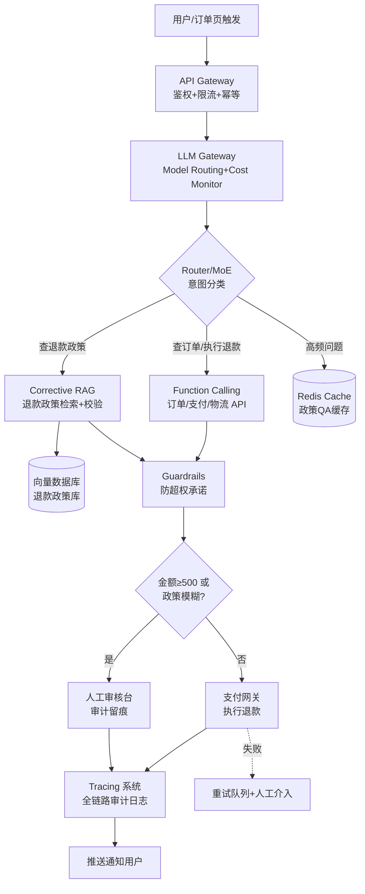
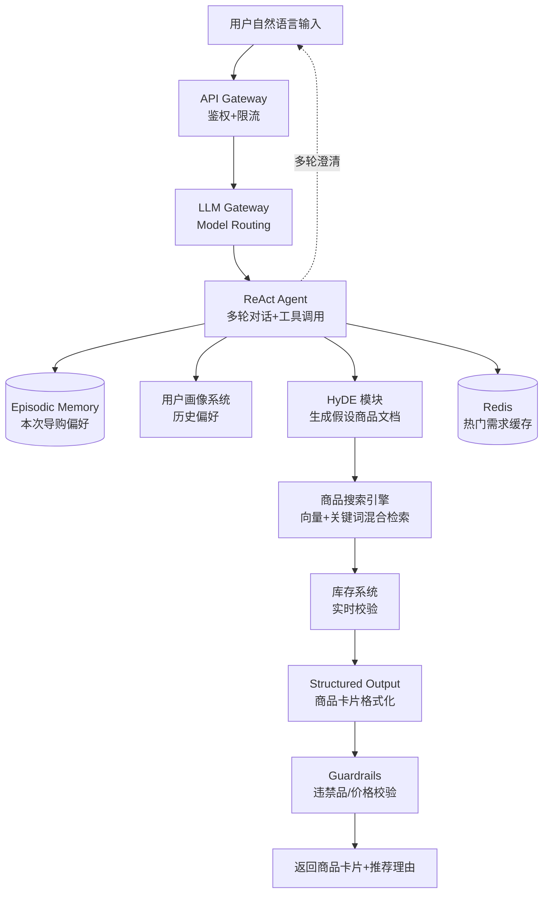
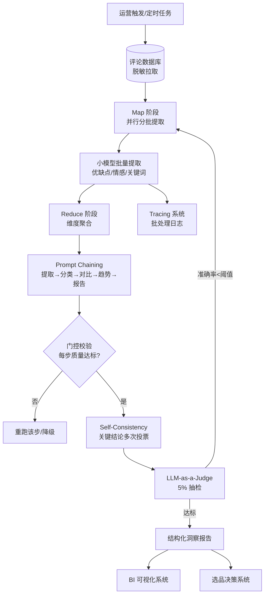

# 电商/零售行业 — Agent 设计模式场景方案

> 本方案针对电商/零售行业的高频业务场景，将 100 种 Agent 设计模式映射到 3 个真实电商零售业务子场景，深挖每个子场景的 Agent 设计模式落地路径。每个子场景均给出真实业务约束、系统架构、模式选型映射与失败应对，目标是让架构师能直接对照选型，而非停留在"用 RAG + Function Calling"的泛泛之谈。

电商行业的 Agent 落地核心矛盾在于：**高并发下成本敏感（日均十万级调用）、退款/促销等敏感操作合规要求高、推荐与导购的转化率直接挂钩 GMV**。因此模式选型必须同时兼顾延迟、准确率、成本与可审计性四条红线。

---

## 📖 行业故事：双11退款风暴

> 2024年双11，某电商平台GMV突破50亿。但狂欢背后，退款咨询量暴涨10倍——80人客服团队三班倒还是处理不过来，用户平均等待40分钟。老板拍板："上AI客服！"但裸LLM当客服第一天就翻了车：Agent不知道"特价清仓款不支持7天无理由"，给用户全额退了200万。老板看着账单，连夜叫停。
>
> 问题不在AI，在于没有"先查政策、再执行退款"的流程。这正是设计模式要解决的。

**翻车对话**：
```
用户：这件衣服破了，我要退款
Agent：好的！已为您全额退款¥299。
用户：这么爽快？
Agent：当然，客户满意是我们的追求！
（后台：该商品是秒杀款，规则写明"质量问题仅换不退"。老板损失¥299）
```

**救场对话**：
```
用户：这件衣服破了，我要退款
Agent：[Corrective RAG 检索退款政策 → 秒杀款仅换不退]
       抱歉听到衣服破损。您购买的是秒杀款，根据政策支持换货但不支持退款。
       我可以为您安排免费换货，预计3天到货。您看可以吗？
用户：好吧，换货也行
（合规处理，老板安心）
```

---

### 4.1.1 售后退款客服

**业务描述**：用户在电商平台发起退款申请，Agent 需要查询订单详情、判断退款政策（7天无理由/质量问题/特殊商品不可退）、与用户沟通确认、执行退款或转人工。该场景日均咨询量大、单笔错退成本高、且涉及资金流转必须留痕审计。

**用户旅程**：
1. 用户在订单详情页点击"申请退款"，填写退款原因（质量问题/不喜欢/尺寸不合等）并上传凭证图片
2. Agent 接收退款请求，调用订单系统 API 拉取订单详情（商品类目、金额、下单时间、物流状态）
3. Agent 检索退款政策知识库，结合订单信息判断该商品是否可退、退款比例、是否需人工审核
4. Agent 与用户多轮沟通，确认退款金额、退款方式（原路返回/退余额）、补充凭证
5. 若金额 < ¥500 且政策明确可退，Agent 直接调用支付网关执行退款；若金额 ≥ ¥500 或政策模糊，转人工审核台
6. 退款执行成功后，Agent 推送通知给用户，并将全链路日志写入审计系统
7. 若执行失败（支付 API 故障等），进入重试队列并通知人工介入

**真实约束**：

| 约束维度 | 具体要求 | 对模式选型的影响 |
|---------|---------|----------------|
| 延迟 | 首响应 < 3s，完整处理 < 30s | 不能用多轮 LATS/ToT（太慢）；首响应用 Caching 命中高频问题，复杂判断走异步 |
| 准确率 | 退款政策判断 > 98%（错退漏退都有成本） | 需要 Corrective RAG 检索+相关性校验，关键结论用 Self-Consistency 多次验证 |
| 成本 | < ¥0.08/次（日均10万次咨询） | 必须 Caching 高频问题 + Model Routing 简单问题用小模型 + Cost Monitor 兜底 |
| 合规 | 每笔退款需留审计日志，敏感操作需人工确认 | 需要 Tracing 全链路审计 + HITL 大额/模糊场景人工确认 + Guardrails 防超权承诺 |
| 集成 | 订单系统 API、支付网关 API、物流系统 API、退款政策知识库 | 需要 Function Calling 统一适配，外部 API 故障需降级策略 |

**系统架构**：



**模式选型映射**：

| 架构层 | 基础设施组件 | 推荐模式 | 选型理由 |
|--------|------------|---------|---------|
| 入口路由 | API Gateway + LLM Gateway | 6.4 Router/MoE | 按意图（查政策/查订单/执行退款/转人工）分发到专门子 Agent，避免单 Agent 上下文爆炸 |
| 工具调用 | 订单/支付/物流 API 适配器 | 8.2 Function Calling | 结构化调用外部系统，参数校验+幂等控制，比纯文本指令可靠 |
| 知识检索 | 向量数据库 + 政策库 | 3.3 Corrective RAG | 退款政策更新频繁且易检索偏，需检索后做相关性校验+重检索，避免幻觉编造政策 |
| 安全防护 | Guardrails 中间件 | 7.2 Guardrails | 限制 Agent 不得承诺"全额退款/补偿优惠券"等超权行为，输出前过滤 |
| 人工兜底 | 审核工作台 | 10.1 HITL | 大额（≥¥500）、特殊商品（生鲜/定制）、政策模糊场景必须人工确认 |
| 成本优化 | Redis + LLM Gateway | 12.3 Caching + 12.4 Model Routing | 高频政策QA缓存命中（命中率约40%）；简单意图路由到小模型，复杂判断才用大模型 |
| 可观测 | Tracing 系统 | 12.1 Tracing + 12.2 Cost Monitor | 每笔退款全链路日志（满足合规审计）+ 实时成本监控防超预算 |
| 质量保障 | 离线评估 | 11.1 LLM-as-a-Judge | 离线抽检退款判断质量，发现政策误判 case 反哺知识库 |

**失败模式与应对**：

| 失败场景 | 业务影响 | 应对方案 |
|---------|---------|---------|
| LLM 超时（>5s） | 用户等待体验差，可能二次进线 | 降级到规则引擎+模板回复（基于订单类目直接匹配政策），异步通知处理结果 |
| 检索无结果/低相关 | 退款政策判断不准，错退漏退 | 回退到人工客服，记录 case 补充知识库；Corrective RAG 的重检索兜底 |
| 幻觉（编造退款政策） | 错误退款，资金损失 | Guardrails 限制输出范围 + HITL 大额确认 + CRITIC 交叉验证政策来源 |
| 支付 API 故障 | 退款执行失败，用户投诉 | 重试队列（指数退避，最多3次）+ 人工介入 + 用户通知"退款处理中" |
| 高并发击穿缓存 | 成本飙升，LLM 网关过载 | Caching 热点预加载 + 限流降级 + Model Routing 强制切小模型 |
| 凭证图片识别错误 | 误判质量问题 | OCR + 视觉模型双路校验，置信度低转人工 |

**快速启动配方**：

```python
# 售后退款 Agent 核心模式组合伪代码
from agent_patterns import Router, FunctionCalling, CorrectiveRAG, Guardrails, HITL, Cache, ModelRouter

# 1. 入口：Router 按意图分发（小模型分类，省成本）
router = Router(model="qwen-plus",  # Model Routing：分类用小模型
                intents=["query_policy", "query_order", "execute_refund", "transfer_human"])

# 2. 退款政策检索：Corrective RAG（检索+相关性校验+必要时重检索）
policy_rag = CorrectiveRAG(
    vectordb="refund_policy_vdb",
    relevance_threshold=0.75,  # 低于阈值触发重检索
    fallback=HITL(human_queue="policy_expert"))  # 检索失败回退人工

# 3. 工具调用：订单/支付/物流 API（参数幂等校验）
tools = FunctionCalling(
    apis=[order_api.get, payment_api.refund, logistics_api.status],
    idempotency_key="refund_{order_id}")  # 防重复退款

# 4. 安全防护：Guardrails 限制超权承诺
guard = Guardrails(
    forbidden_promises=["全额退款", "额外补偿", "优惠券"],  # 防超权
    require_citation=True)  # 政策结论必须引用知识库来源

# 5. 人工兜底：大额/模糊场景
hitl = HITL(threshold_amount=500, ambiguous_policy=True)

# 6. 成本优化：高频政策QA缓存
cache = Cache(redis="refund_cache", ttl=3600, hit_rate_target=0.4)

# 主流程编排
async def handle_refund(user_msg, order_id):
    if cache.hit(user_msg):  # 命中缓存直接返回，省 LLM 调用
        return cache.get(user_msg)
    intent = await router.classify(user_msg)
    if intent == "query_policy":
        policy = await policy_rag.retrieve(order_id, user_msg)
        guard.check(policy)  # 输出前过 Guardrails
        cache.set(user_msg, policy)
        return policy
    if intent == "execute_refund":
        if hitl.need_review(order_id):  # 大额/模糊转人工
            return await hitl.transfer(order_id, reason="金额超阈值")
        result = await tools.call("payment_api.refund", order_id=order_id)
        tracing.log(order_id, result)  # 全链路审计
        return result
```

---

### 4.1.2 商品导购推荐

**业务描述**：用户用自然语言描述需求（如"送女朋友生日礼物，预算500"），Agent 通过多轮对话理解需求，检索商品库，推荐合适商品并解释推荐理由。该场景直接挂钩转化率，推荐相关性每提升 1% 可带来可观 GMV 增量。

**用户旅程**：
1. 用户在导购入口输入自然语言需求："送女朋友生日礼物，预算500，她喜欢文艺风"
2. Agent 解析需求，识别关键维度（收礼人=女友、场景=生日、预算=500、风格=文艺）
3. Agent 调用用户画像系统，补充该用户历史偏好（如曾购买过香水/饰品）
4. Agent 用 HyDE 生成假设商品描述文档，提升商品搜索引擎的召回相关性
5. Agent 检索商品库 + 库存系统校验，召回 Top 10 候选商品
6. Agent 多轮对话澄清需求（如"更偏好实用型还是纪念型？"），Episodic Memory 记住本次导购偏好
7. Agent 输出结构化商品卡片（图片+价格+推荐理由+购买链接），并解释推荐逻辑
8. 用户点击商品卡片跳转商详页，转化数据回流用于推荐效果优化

**真实约束**：

| 约束维度 | 具体要求 | 对模式选型的影响 |
|---------|---------|----------------|
| 延迟 | 首响应 < 2s（用户耐心有限） | 不能用 ToT/LATS 探索；首响应用 Caching 命中热门需求，检索走异步流式 |
| 准确率 | 推荐相关性 > 85%（否则影响转化率） | 需要 HyDE 提升检索召回 + Episodic Memory 记住偏好 + 多轮澄清 |
| 成本 | < ¥0.05/次（导购对话通常3-5轮） | 需要 Model Routing 简单澄清用小模型 + Caching 热门需求 + 推荐结果缓存 |
| 合规 | 不得推荐违禁品/虚假宣传，价格需实时 | 需要 Guardrails 过滤违禁品类 + Function Calling 实时查价 |
| 集成 | 商品搜索引擎 API、用户画像系统、库存系统 | 需要 Function Calling 统一调用，库存/价格需实时校验 |

**系统架构**：



**模式选型映射**：

| 架构层 | 基础设施组件 | 推荐模式 | 选型理由 |
|--------|------------|---------|---------|
| 对话编排 | Agent 主循环 | 8.1 ReAct | 多轮对话需边推理边观察用户反馈，动态调整检索策略与澄清问题 |
| 检索增强 | 商品搜索引擎 | 3.7 HyDE | 用户自然语言与商品标题语义差距大，用假设文档（"文艺风生日礼物500元"）提升召回 |
| 记忆管理 | 会话级存储 | 5.5 Episodic Memory | 记住本次导购用户已表达的偏好（预算/风格/收礼人），避免重复询问 |
| 成本优化 | LLM Gateway | 12.4 Model Routing | 简单澄清（是/否）用小模型，复杂推荐理由生成用大模型 |
| 输出规范 | 响应格式化 | 6.5 Structured Output | 商品卡片需严格 JSON 结构（图片/价格/链接/理由），前端直接渲染 |
| 安全防护 | Guardrails 中间件 | 7.2 Guardrails | 过滤违禁品推荐、虚假价格承诺，价格必须实时查询不得缓存 |
| 工具调用 | 搜索/画像/库存 API | 8.2 Function Calling | 并行调用商品搜索+用户画像+库存校验，降低延迟 |
| 缓存 | Redis | 12.3 Caching | 热门需求（如"送女友生日礼物")缓存推荐结果，TTL 短（价格变动快） |

**失败模式与应对**：

| 失败场景 | 业务影响 | 应对方案 |
|---------|---------|---------|
| 商品检索召回为 0 | 无法推荐，用户流失 | HyDE 降级到关键词检索；扩大预算/品类范围重检索；推荐相似热门商品兜底 |
| 库存系统延迟 | 推荐了缺货商品，体验差 | 异步校验库存，先返回卡片后标注"库存确认中"；缺货则触发重检索 |
| 用户需求模糊 | 多轮澄清仍无法收敛 | Episodic Memory 累积偏好 + 主动给出 2-3 个方向选项让用户选，避免开放式追问 |
| 推荐相关性低 | 转化率下降 | 离线用 LLM-as-a-Judge 评估推荐质量；A/B 测试 HyDE vs 关键词检索效果 |
| 价格变动未同步 | 显示价与实付价不符，投诉 | 价格不缓存，实时 Function Calling 查询；Guardrails 禁止承诺"最低价" |
| 多轮对话超预算 | 单次导购成本超 ¥0.05 | Model Routing 强制切小模型 + 限制最大轮次（5轮）+ 超限转人工导购 |

**快速启动配方**：

```python
# 商品导购 Agent 核心模式组合伪代码
from agent_patterns import ReAct, HyDE, EpisodicMemory, ModelRouter, StructuredOutput, Guardrails

# 1. ReAct 主循环：多轮对话+工具调用
agent = ReAct(
    model_router=ModelRouter(
        simple_model="qwen-plus",   # 澄清问题用小模型
        complex_model="qwen-max"),    # 推荐理由生成用大模型
    max_turns=5)  # 限制轮次控成本

# 2. HyDE：生成假设商品文档提升检索
hyde = HyDE(
    prompt="根据用户需求生成一段理想商品描述：{user_need}",
    use_for_retrieval=True)

# 3. Episodic Memory：记住本次导购偏好
memory = EpisodicMemory(scope="session",  # 会话级，导购结束即清
                        fields=["recipient", "occasion", "budget", "style"])

# 4. 结构化输出：商品卡片
card_schema = StructuredOutput(schema={
    "products": [{
        "name": str, "price": float, "image_url": str,
        "reason": str,  # 推荐理由
        "buy_url": str}],
    "clarify_question": str  # 可选的下一轮澄清问题
})

# 5. 工具：商品搜索+画像+库存（并行调用降延迟）
tools = [search_api, profile_api, stock_api]

# 主流程
async def guide(user_msg, session_id):
    memory.load(session_id)  # 加载本次导购历史偏好
    need = agent.parse(user_msg, memory)  # 解析+补充偏好
    memory.update(need)  # 记住新偏好

    # HyDE 生成假设文档，提升商品检索召回
    hypo_doc = await hyde.generate(need)
    candidates = await search_api.retrieve(hypo_doc, top_k=10)

    # 并行校验库存+画像匹配
    in_stock = await stock_api.check([p.id for p in candidates])
    candidates = [p for p in candidates if p.id in in_stock]

    # Model Routing：推荐理由用大模型生成
    cards = await agent.generate_reasons(candidates, need, model="qwen-max")

    # 结构化输出 + Guardrails 校验
    result = card_schema.format(cards)
    Guardrails.check(result, forbid=["违禁品", "虚假价格"])
    return result
```

---

### 4.1.3 评价分析洞察

**业务描述**：批量分析某商品的所有评论（可能上万条），提取优缺点、情感趋势、竞品对比，生成可指导选品和运营的洞察报告。该场景为异步批处理，不直接面向 C 端用户，但报告质量直接影响选品决策与运营策略。

**用户旅程**：
1. 运营人员在 BI 后台选择目标商品（或类目），触发评价分析任务
2. 系统从评论数据库拉取该商品全部评论（含评分、标签、时间戳），单商品可达上万条
3. Map 阶段：并行分批（每批 50 条）调用 LLM 提取每条评论的优缺点、情感、关键词
4. Reduce 阶段：汇总所有批次的提取结果，按维度聚合（质量/价格/物流/服务）
5. Prompt Chaining：提取→分类→竞品对比→趋势分析→报告生成，每步带门控校验
6. Self-Consistency：对关键结论（如"主要差评原因"）多次采样投票，降低随机性
7. LLM-as-a-Judge：抽检 5% 评论的提取结果，评估准确率，低于阈值则重跑
8. 生成结构化洞察报告，推送到 BI 可视化系统 + 选品决策系统

**真实约束**：

| 约束维度 | 具体要求 | 对模式选型的影响 |
|---------|---------|----------------|
| 延迟 | 异步批处理，单商品 < 5 分钟 | 必须 Map-Reduce 并行处理；单批评论数需调优（50条/批平衡延迟与成本） |
| 成本 | < ¥0.3/条评论（上万条评论成本可控） | Map 阶段用小模型提取，Reduce/报告用大模型；Caching 复用同类目模板 |
| 准确率 | 情感分类 > 90%，关键词提取 > 85% | 需要 Self-Consistency 关键结论多次验证 + LLM-as-a-Judge 抽检 |
| 合规 | 评论数据脱敏（用户ID/手机号），报告不泄露个人隐私 | 需要 Guardrails 输入侧脱敏 + 输出侧隐私过滤 |
| 集成 | 评论数据库、BI 可视化系统、选品决策系统 | 需要 Function Calling 拉取评论 + Structured Output 对接 BI |

**系统架构**：



**模式选型映射**：

| 架构层 | 基础设施组件 | 推荐模式 | 选型理由 |
|--------|------------|---------|---------|
| 批处理编排 | 任务调度器 | 6.3 Map-Reduce | 上万条评论需并行分批处理再汇总，串行处理延迟与成本都不可接受 |
| 输出规范 | 响应格式化 | 6.5 Structured Output | 每条评论提取结果需严格 JSON（优点/缺点/情感/关键词），便于 Reduce 聚合 |
| 质量抽检 | 离线评估 | 11.1 LLM-as-a-Judge | 抽检 5% 评论的提取准确率，低于阈值（90%）触发重跑，闭环质量保障 |
| 结论验证 | 采样投票 | 1.4 Self-Consistency | 关键结论（主要差评原因/竞品优劣势）多次采样投票，降低 LLM 随机性 |
| 流程编排 | 链式管道 | 6.8 Prompt Chaining | 提取→分类→竞品对比→趋势→报告，每步带门控，前一步不达标不进入下一步 |
| 成本优化 | LLM Gateway | 12.4 Model Routing | Map 提取用小模型（量大），Reduce/报告生成用大模型（量小质高） |
| 可观测 | Tracing 系统 | 12.1 Tracing | 批处理任务全链路日志，便于定位哪一批/哪一步失败 |
| 安全防护 | Guardrails | 7.2 Guardrails | 输入侧评论脱敏（手机号/地址），输出侧报告过滤个人隐私信息 |

**失败模式与应对**：

| 失败场景 | 业务影响 | 应对方案 |
|---------|---------|---------|
| Map 阶段某批 LLM 调用失败 | 该批评论未分析，报告不全 | 单批失败重试 3 次，仍失败则标记跳过 + 降级用规则提取；Reduce 时标注覆盖率 |
| 情感分类准确率 < 90% | 报告结论不可靠 | LLM-as-a-Judge 抽检触发重跑；Self-Consistency 对边界 case 多次投票 |
| 评论含噪声（刷单/水军） | 洞察失真，误导选品 | Map 阶段加异常评论过滤（重复内容/极端评分）；Reduce 阶段做异常值剔除 |
| 关键词提取漂移 | 不同批次关键词不一致 | Structured Output 限定关键词词表 + Reduce 阶段做关键词归一化（同义词合并） |
| 报告生成幻觉 | 编造不存在的评论结论 | Prompt Chaining 门控：报告每个结论必须可追溯到 Reduce 聚合数据，Guardrails 校验引用 |
| 批处理超时（>5分钟） | 运营拿不到报告 | 动态调整批大小（50→100条/批）+ 增加并行度；超时则返回部分结果+标注未完成 |
| 成本超预算（>¥0.3/条） | 月度成本失控 | Cost Monitor 实时监控；Map 强制用小模型；同类目报告模板 Caching 复用 |

**快速启动配方**：

```python
# 评价分析洞察 Agent 核心模式组合伪代码
from agent_patterns import MapReduce, StructuredOutput, LLMAsJudge, SelfConsistency, PromptChaining

# 1. Map-Reduce：并行分批提取 + 汇总
pipeline = MapReduce(
    batch_size=50,  # 每批50条，平衡延迟与成本
    map_model="qwen-plus",   # Map 用小模型（量大）
    reduce_model="qwen-max",  # Reduce 用大模型（质高）
    parallel_workers=20)      # 20路并行，单商品<5分钟

# 2. Structured Output：每条评论提取结构
extract_schema = StructuredOutput(schema={
    "pros": [str], "cons": [str],
    "sentiment": "positive|negative|neutral",
    "keywords": [str], "score": int})

# 3. Prompt Chaining：提取→分类→对比→趋势→报告（带门控）
chain = PromptChaining(steps=[
    ("extract", extract_schema),
    ("classify", "按质量/价格/物流/服务分类"),
    ("compare", "与竞品评论对比优劣势"),
    ("trend", "时间维度情感趋势分析"),
    ("report", "生成结构化洞察报告")],
    gate=lambda step_result: quality_check(step_result) > 0.85)  # 门控：不达标不进入下一步

# 4. Self-Consistency：关键结论多次投票
sc = SelfConsistency(samples=5, voting="majority",
                     target_steps=["classify", "compare"])  # 仅关键步骤用，控成本

# 5. LLM-as-a-Judge：抽检5%
judge = LLMAsJudge(sample_rate=0.05,
                   accuracy_threshold=0.90,  # 低于90%触发重跑
                   retry_on_fail=True)

# 主流程
async def analyze_reviews(product_id):
    reviews = await review_db.fetch(product_id, desensitize=True)  # 脱敏拉取
    # Map 阶段：并行提取每批评论
    mapped = await pipeline.map(reviews, extract_schema)
    # Reduce 阶段：聚合
    reduced = await pipeline.reduce(mapped)
    # Prompt Chaining：带门控的多步分析
    analysis = await chain.run(reduced, self_consistency=sc)
    # LLM-as-a-Judge 抽检
    if not await judge.evaluate(mapped, analysis):
        return await pipeline.map(reviews, extract_schema)  # 准确率不达标重跑
    # 结构化报告输出到 BI + 选品系统
    report = StructuredOutput(schema=REPORT_SCHEMA).format(analysis)
    await bi_system.push(report)
    await decision_system.push(report)
    return report
```

---

## 总结：电商/零售行业 Agent 模式选型核心原则

1. **成本是第一约束**：电商场景日均调用量大（十万级），单次成本必须压到分钱级。**Caching + Model Routing 是标配**，高频问题缓存命中率应达 30-40%，简单意图强制路由到小模型，只有复杂判断才用大模型。

2. **敏感操作必须 HITL + Tracing**：退款、促销、价格承诺等涉及资金与合规的操作，**Guardrails 防超权 + HITL 大额确认 + Tracing 全链路审计**三件套缺一不可。宁可多转人工，不可错退一笔。

3. **检索质量决定推荐转化**：导购场景的推荐相关性直接挂钩 GMV，**HyDE 提升召回 + Episodic Memory 记住偏好 + 多轮澄清收敛需求**比单纯堆 RAG 更有效。检索为 0 时必须有兜底策略（关键词降级/相似热门商品）。

4. **批处理用 Map-Reduce + 门控链**：评价分析等异步场景，**Map 用小模型 + Reduce 用大模型 + Prompt Chaining 带门控 + Self-Consistency 验证关键结论 + LLM-as-a-Judge 抽检**，形成质量闭环，避免幻觉报告误导选品决策。

5. **失败应对优先降级而非重试**：电商高并发场景下，LLM 超时/API 故障时，**优先降级到规则引擎/模板回复/人工兜底**，而非无限重试拖垮系统。重试队列仅用于幂等性可保证的操作（如退款执行）。
