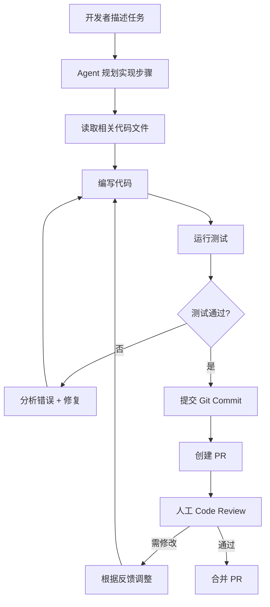
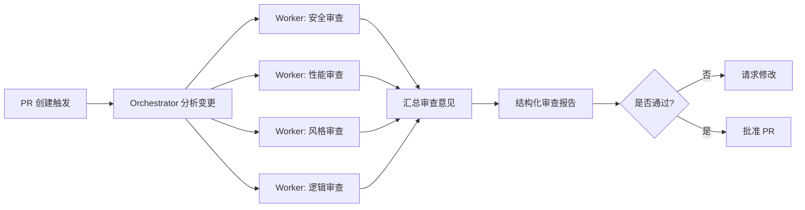
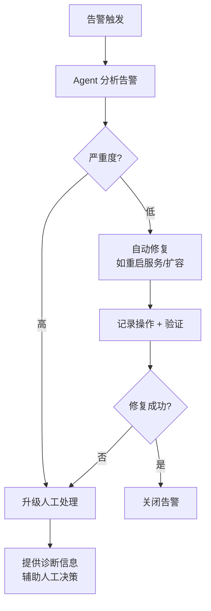

# 行业方案：软件研发

> 本文档展示 AI Agent 设计模式在软件研发领域的应用方案。涵盖自主编程、代码审查、测试生成、DevOps 自动化等场景。

## 行业概览

软件研发是 2024-2025 年 AI Agent 落地最成功的领域。从 GitHub Copilot 的代码补全，到 Cursor 的实时协作，再到 Devin 的全自主编程，Agent 正在重新定义软件开发流程。

**核心 Agent 能力**：
- 代码生成与修改（文件读写、多文件编辑）
- 代码执行与测试（终端命令、测试框架）
- 代码理解与搜索（AST 解析、语义搜索）
- 版本控制（Git 操作、PR 管理）

## 场景一：自主编程 Agent

**业务痛点**：重复性编码工作耗时、简单 Bug 修复占用高级工程师时间

**模式组合**：2.9 Agentic Coding + 8.1 ReAct + 9.2 Reflexion + 10.1 HITL

**方案架构**：



**关键设计**：
- **沙箱执行**：代码在 Docker 容器中执行，防止破坏宿主环境
- **增量提交**：每步变更 Git commit，支持回滚
- **人工审核**：PR 合并前必须人工审核，Agent 不得直接推送生产分支
- **上下文管理**：使用代码语义搜索（如 Aider 的 repo map）而非全量加载代码库

**模型选择**：
| 角色 | 推荐模型 | 理由 |
|------|---------|------|
| 代码生成 | GPT-5 / Claude 4 Sonnet | 编码能力强，支持长上下文 |
| 测试生成 | GPT-4o-mini / Qwen3 | 性价比高，测试代码相对简单 |
| Code Review | Claude 4 Opus | 推理能力强，适合发现潜在问题 |

## 场景二：自动化代码审查

**业务痛点**：PR 审查积压、审查质量不一致、难以发现跨文件影响

**模式组合**：7.3 LLM-as-a-Judge + 6.9 Orchestrator-Workers + 8.8 Structured Outputs

**方案架构**：



**关键设计**：
- **多维度并行审查**：安全、性能、风格、逻辑四个 Worker 并行
- **结构化输出**：审查结果用 JSON Schema 约束，便于 CI/CD 集成
- **差异化审查**：只审查 PR diff，不审查全文件
- **严重度分级**：Critical / Warning / Suggestion 三级

## 场景三：智能测试生成

**业务痛点**：测试覆盖率不足、测试编写枯燥、边缘用例遗漏

**模式组合**：1.1 CoT + 9.1 Self-Refine + 11.4 Adversarial Testing

**方案架构**：

```
1. 分析源代码 → 提取函数签名和逻辑分支
2. CoT 推理 → 生成测试用例（正常/边界/异常）
3. 运行测试 → 检查覆盖率和通过率
4. Self-Refine → 补充遗漏的测试路径
5. Adversarial Testing → 生成对抗输入（空值、超长、特殊字符）
6. 输出测试文件 + 覆盖率报告
```

**关键设计**：
- **覆盖率驱动**：以行/分支覆盖率为反馈信号，迭代补充测试
- **对抗测试**：主动生成异常输入，测试鲁棒性
- **测试质量**：生成的测试需人工确认断言正确性

## 场景四：DevOps 自动化

**业务痛点**：部署流程复杂、故障响应慢、日志分析耗时

**模式组合**：2.1 AutoGPT/BabyAGI + 8.5 API Agent + 12.1 Tracing + 10.4 Supervised Autonomy

**方案架构**：



**关键设计**：
- **分级授权**：低风险操作（重启、扩容）自主执行；高风险操作（数据库变更、回滚）需人工确认
- **操作审计**：所有 Agent 操作记录到 Tracing 系统，支持事后追溯
- **安全边界**：Agent 只能操作预定义的 API 白名单

## 选型建议

| 场景 | 推荐模式组合 | 模型选择 | 人工介入点 |
|------|------------|---------|-----------|
| 自主编程 | Agentic Coding + ReAct + Reflexion + HITL | GPT-5 / Claude 4 | PR 审核 |
| 代码审查 | LLM-as-a-Judge + Orchestrator-Workers | Claude 4 Opus | Critical 项确认 |
| 测试生成 | CoT + Self-Refine + Adversarial Testing | GPT-4o-mini | 断言正确性 |
| DevOps | AutoGPT + API Agent + Supervised Autonomy | GPT-4o | 高风险操作 |

## 生产环境注意事项

> ⚠️ 软件研发 Agent 的生产部署需特别注意：
> - **代码安全**：Agent 生成的代码必须经过人工 Review，不得自动合并到主分支
> - **沙箱隔离**：代码执行在 Docker 容器中，限制网络和文件系统访问
> - **成本控制**：长程编程任务可能消耗大量 token，设置预算上限和轮次限制
> - **版本控制**：每步变更 Git commit，支持回滚到任意状态
> - **权限最小化**：Agent 的 API Token 权限最小化，只授予必要的仓库和 CI/CD 权限

## 参考资源

- [SWE-bench](https://www.swebench.com/) — 软件工程 Agent 评测基准
- [SWE-bench Verified](https://openai.com/index/introducing-swe-bench-verified/) — 人工验证子集
- [OpenHands](https://github.com/All-Hands-AI/OpenHands) — 开源 Agent 平台
- [Aider](https://aider.chat/) — 开源 CLI 编程助手
- [Cursor](https://cursor.sh/) — AI 优先的代码编辑器
- [Claude Code](https://docs.anthropic.com/en/docs/claude-code) — Anthropic CLI Agent
