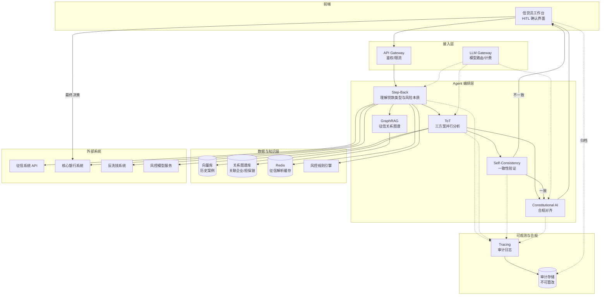
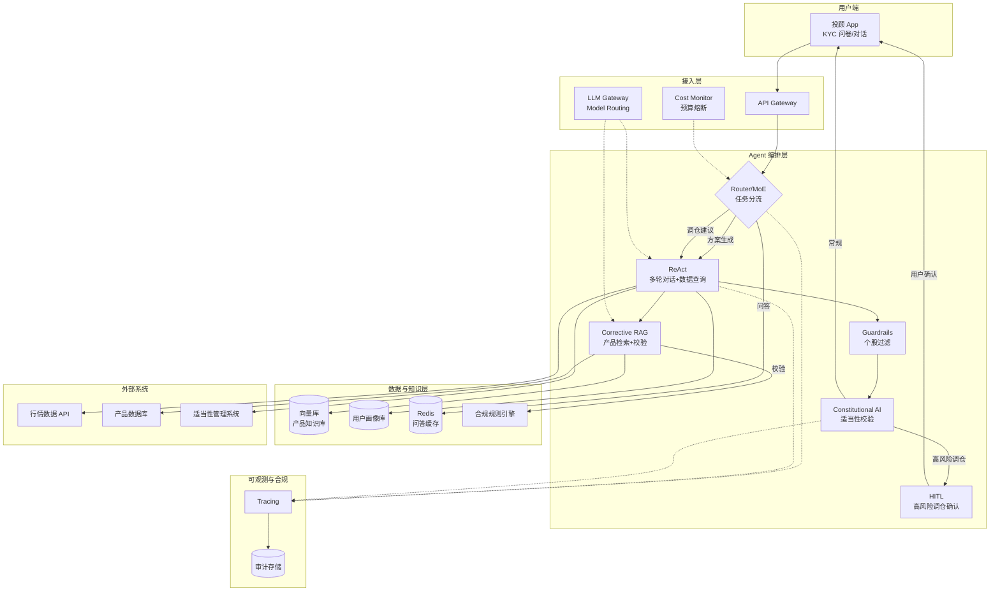

# 金融行业 — Agent 设计模式场景方案

> 金融行业是 AI Agent 落地要求最严苛的领域之一。一笔错误决策可能造成百万级损失，一次合规违规可能触发千万级罚单，一条不可解释的拒绝可能引发客户投诉甚至诉讼。本方案聚焦金融业务对 **准确性、合规性、可解释性** 的极高要求，给出 3 个典型子场景的 Agent 设计模式深度映射。

金融行业的 Agent 设计有三条不可妥协的底线：

1. **合规优先**：任何模式组合都必须内嵌审计链（Tracing）与合规对齐（Constitutional AI），决策依据可回溯至监管条文。
2. **可解释性**：拒绝"黑盒置信度"，所有输出必须附带人类可读的推理链与数据证据，满足国家金融监督管理总局/证监会/支付清算协会的披露要求。
3. **人工兜底**：高风险、高金额、低置信度的决策必须经 HITL（Human-in-the-Loop）确认，Agent 永远是"辅助"而非"替代"。

在此之上，金融场景对延迟、成本、准确率的约束呈现极端分化：反欺诈要求 500ms 内完成千万级日交易量检测，信贷审批要求 95%+ 违约预测准确率，智能投顾要求 8s 内生成合规配置方案。这种分化决定了金融 Agent 不能用"一套模式打天下"，而必须通过 **Model Routing / Router-MoE** 在不同复杂度任务间动态切换模式组合。

---

## 📖 行业故事：一笔30万的错批贷款

> 某城商行上线了AI辅助信贷审批系统。第一天，Agent审批了一笔30万信用贷款——申请人月薪8000，负债率已超50%，按行内规则应该拒。但Agent看到"有房产"就直接批了，没注意到房产已抵押。30万放出去了，3个月后借款人违约。
>
> 银行风控总监震怒："AI审批不是让你当橡皮图章！"问题出在：Agent只看了表面信息，没有"多维度交叉验证"和"人工复核"。

**翻车对话**：
```
信贷员：申请人月薪8000，负债率52%，有房产，批不批？
Agent：有房产，资产充足，建议批准，额度30万。
信贷员：好的，批了。
（实际：房产已二次抵押，净值为负。3个月后违约，银行损失30万）
```

**救场对话**：
```
信贷员：申请人月薪8000，负债率52%，有房产，批不批？
Agent：[GraphRAG：查询房产关系 → 该房产已二次抵押，净值为负]
       [Self-Consistency：3次独立分析 → 2次建议拒绝，1次建议有条件批准]
       [HITL：负债率超50%+房产已抵押，需信贷经理人工确认]

       ⚠️ 风险预警：
       1. 负债率52%超过行内红线（50%）
       2. 房产已二次抵押，无追加担保价值
       3. 建议：拒绝 或 要求增加担保人

       请信贷经理做最终决策。
信贷员：拒绝。AI比我想得周到。
```

---

## 4.2.1 信贷审批辅助

**业务描述**：银行信贷员在受理贷款申请后，将申请人信息（征信报告、收入证明、负债情况、贷款用途）提交给 Agent，Agent 综合分析后给出审批建议（通过 / 拒绝 / 需补充材料）和风险评级，信贷员基于 Agent 建议做最终决策并签字归档。

**用户旅程**：
1. 信贷员在核心银行系统录入贷款申请，上传征信报告 PDF、收入证明、负债明细等材料。
2. Agent 通过 OCR/结构化解析抽取申请人关键字段（收入、负债、逾期记录、查询次数、关联企业）。
3. Agent 调用征信系统 API 拉取最新征信数据，调用反洗钱系统核验申请人及关联方。
4. Agent 用 GraphRAG 构建申请人关系图谱（关联企业、共同借款人、担保链），识别隐性负债与关联风险。
5. Agent 用 ToT 并行展开三种审批方案（通过 / 有条件通过 / 拒绝），各自评估风险评级与理由。
6. Agent 用 Self-Consistency 多次采样验证结论一致性，不一致时降级为"需人工复核"。
7. Agent 生成结构化审批建议书（含风险评级、建议额度、利率建议、拒绝理由、合规依据条文）。
8. 信贷员审阅建议书，在 HITL 界面确认/修改/驳回，最终决策写入核心银行系统并归档审计链。

**真实约束**：

| 约束维度 | 具体要求 | 对模式选型的影响 |
|---------|---------|----------------|
| 延迟 | 完整分析 < 15s（信贷员在客户面前等待） | 不能用纯大模型多轮 ToT，需 Model Routing 把征信解析、规则匹配交给小模型/规则引擎，仅高风险判断用大模型 |
| 准确率 | 违约预测准确率 > 95%（错批一笔贷款损失可达本金 30%+） | 必须用 Self-Consistency 多次采样 + GraphRAG 关联风险识别，单一推理路径不可接受 |
| 成本 | < ¥0.5/次（单笔贷款金额大，成本敏感度低，但仍需可控） | 允许使用大模型 + 多次采样，但需 Caching 缓存征信报告解析结果，避免重复调用 |
| 合规 | 每笔审批需留完整审计链，决策必须可解释，受国家金融监督管理总局监管，需引用具体规章条文 | 强制 Tracing 全链路日志 + Constitutional AI 合规对齐 + 输出必须含"决策依据+条文引用" |
| 集成 | 征信系统 API、核心银行系统、反洗钱系统、风控模型 | 需 ReWOO 批量并行调用多个外部系统，避免串行等待；外部系统不可用时需降级策略 |

**系统架构**：



**模式选型映射**：

| 架构层 | 基础设施组件 | 推荐模式 | 选型理由 |
|--------|------------|---------|---------|
| 任务理解 | LLM Gateway | Step-Back | 先抽象出"这是消费贷/经营贷/抵押贷"及风险本质，避免直接套用错误审批规则；不同贷款类型合规要求差异大 |
| 多方案分析 | LLM Gateway | ToT（Tree of Thoughts） | 并行展开"通过/有条件通过/拒绝"三条推理路径，各自评估风险与额度，避免单路径过早收敛导致错批 |
| 关联风险识别 | 关系图谱库 + 向量库 | GraphRAG | 征信报告含大量关联实体（关联企业、共同借款人、担保链），图谱能识别隐性负债与组团欺诈，向量库召回相似历史案例 |
| 结论验证 | LLM Gateway | Self-Consistency | 多次采样同一分析，若结论不一致则降级人工复核，确保 95%+ 准确率底线 |
| 合规对齐 | Constitutional AI 规则库 | Constitutional AI | 内嵌国家金融监督管理总局《个人贷款管理暂行办法》《商业银行授信工作尽职指引》等条文，输出前自动校验是否违规 |
| 人工兜底 | HITL 工作台 | HITL（Human-in-the-Loop） | 信贷员最终签字，Agent 仅提供建议；高风险/低置信度案件强制人工复核 |
| 审计合规 | Tracing + 审计存储 | Tracing | 全链路日志（输入材料、中间推理、外部调用、最终决策）写入不可篡改存储，满足监管检查与事后追责 |
| 成本控制 | Redis 缓存 | Caching | 同一申请人短期内多次申请，缓存征信解析与图谱构建结果，避免重复 LLM 调用 |

**失败模式与应对**：

| 失败场景 | 业务影响 | 应对方案 |
|---------|---------|---------|
| 征信系统 API 超时/不可用 | 无法获取最新征信，可能错批已逾期客户 | 降级使用信贷员上传的征信 PDF（可能非最新）+ 标记"征信数据非实时"提示，强制 HITL 复核；超时 > 5s 直接走人工通道 |
| GraphRAG 关联实体识别漏召 | 漏判担保链风险，组团欺诈得逞 | 双路召回：图谱 + 向量库交叉验证；关键案件（额度 > 100万）强制人工核查关联企业 |
| Self-Consistency 多次结论不一致 | 准确率不达标，可能错批 | 自动降级为"需人工复核"，不输出自动结论；触发告警通知风控团队复盘模型 |
| Constitutional AI 误判合规 | 合规风险，可能被监管处罚 | 合规校验失败时阻断输出，强制转人工合规岗；定期用 Red Teaming 对抗测试合规规则覆盖度 |
| 信贷员盲目采纳 Agent 建议 | 责任归属不清，监管追责时无法解释 | HITL 界面强制信贷员填写"决策理由"，与 Agent 建议不一致时需说明；Tracing 记录人机决策差异 |
| 申请人材料造假（伪造收入证明） | 错批导致坏账 | Agent 交叉验证：收入证明金额 vs 银行流水 vs 行业均值，异常偏离触发反欺诈规则引擎拦截 |

**快速启动配方**：

```python
# 信贷审批辅助 - 核心模式组合伪代码
def credit_approval(application):
    # 1. Step-Back：先理解贷款类型与风险本质
    loan_context = step_back_llm(application, prompt="抽象贷款类型/金额/期限/风险本质")

    # 2. GraphRAG：构建申请人关系图谱，识别关联风险
    credit_report = call_credit_bureau_api(application.id)  # 征信系统 API
    relations = graphrag.query(credit_report.entities)      # 关联企业/担保链
    similar_cases = vector_db.search(loan_context, top_k=5) # 历史相似案例

    # 3. ToT：并行展开三方案分析
    plans = tot_expand(
        context=loan_context + relations + similar_cases,
        branches=["approve", "conditional_approve", "reject"]
    )

    # 4. Self-Consistency：多次采样验证一致性
    verdicts = [run_analysis(plans, seed=i) for i in range(3)]
    if not is_consistent(verdicts):
        return {"decision": "manual_review", "reason": "结论不一致，转人工复核"}

    # 5. Constitutional AI：合规对齐校验
    proposal = build_proposal(verdicts[0])
    if not constitutional_check(proposal, rules=CBC_RULES):  # 国家金融监督管理总局规则
        return {"decision": "manual_review", "reason": "合规校验未通过"}

    # 6. HITL：信贷员最终确认（Agent 仅建议，不决策）
    trace.log(application, plans, verdicts, proposal)       # Tracing 审计链
    return {"proposal": proposal, "await": "credit_officer_confirm"}
```

---

## 4.2.2 智能投顾

**业务描述**：用户在 App 端填写风险偏好问卷（KYC）后，Agent 根据用户画像（年龄、收入、风险承受度、投资期限）和实时市场行情，推荐资产配置方案（仅资产类别，不含具体个股），解释推荐理由并给出风险提示，并在持仓期间持续监控市场异动，给出调仓建议。

**用户旅程**：
1. 用户首次使用时在 App 完成 KYC 风险偏好问卷，系统评定风险等级（C1-C5）。
2. 用户发起咨询（如"帮我配置 10 万元"或"现在适合加仓债券吗"），Router/MoE 识别任务类型。
3. Agent 通过 ReAct 多轮对话动态查询实时行情、用户持仓、用户画像。
4. Agent 用 Corrective RAG 检索产品库，并经合规规则引擎校验产品风险等级与用户适当性匹配。
5. Agent 生成资产配置方案（仅资产类别比例），Guardrails 过滤个股/承诺收益等违规表述。
6. Constitutional AI 校验方案合规性（适当性、风险提示完整性），不通过则重新生成。
7. Agent 输出方案 + 推荐理由 + 风险提示；高频问答直接命中缓存返回。
8. 持仓期间 Agent 监控市场异动，触发调仓建议时高风险调整经 HITL（用户确认）后执行。

**真实约束**：

| 约束维度 | 具体要求 | 对模式选型的影响 |
|---------|---------|----------------|
| 延迟 | 方案生成 < 8s，实时问答 < 3s | 用 Router/MoE 区分任务类型：简单问答走小模型+缓存，方案生成走大模型，调仓建议走中模型；不同 SLA 用不同模式链 |
| 准确率 | 配置建议合理性 > 90%（需通过合规审查） | Corrective RAG 检索产品库后必须校验是否符合投资者适当性；Constitutional AI 校验是否违反"不得推荐具体个股" |
| 成本 | < ¥0.3/次 | 高频问答用 Caching 缓存；方案生成用 Model Routing 选性价比模型；Cost Monitor 实时熔断超预算会话 |
| 合规 | 不得推荐具体个股（仅资产类别），需风险提示，需投资者适当性管理（KYC/产品风险等级匹配） | Guardrails 输出层硬过滤个股代码/名称；Constitutional AI 内嵌《证券期货投资者适当性管理办法》；每次输出强制附风险提示 |
| 集成 | 行情数据 API、用户画像系统、产品数据库、合规规则引擎 | ReAct 多轮对话中动态调用行情 API；Corrective RAG 检索产品库后用合规引擎二次校验 |

**系统架构**：



**模式选型映射**：

| 架构层 | 基础设施组件 | 推荐模式 | 选型理由 |
|--------|------------|---------|---------|
| 任务分流 | LLM Gateway + Cost Monitor | Router / MoE | 区分"实时问答/方案生成/调仓建议"三类任务，问答走小模型+缓存（< 3s），方案生成走大模型（< 8s），调仓走中模型；避免所有请求都走重链路导致成本与延迟超标 |
| 多轮对话 | 行情 API + 用户画像 | ReAct | 用户提问"现在适合加仓债券吗"需边推理边查实时行情+用户持仓，ReAct 的 Thought-Action-Observation 循环天然适配 |
| 产品检索 | 向量库 + 产品数据库 | Corrective RAG | 检索产品库后必须校验：①产品风险等级 ≤ 用户风险等级（适当性）②产品是否在售 ③是否触及单产品集中度限制；不合规结果直接丢弃重检索 |
| 输出过滤 | Guardrails 规则引擎 | Guardrails | 输出层硬过滤：禁止出现个股代码/名称、禁止承诺收益、禁止"稳赚不赔"等违规表述；违规即拦截重生成 |
| 合规对齐 | Constitutional AI + 合规规则引擎 | Constitutional AI | 内嵌《证券期货投资者适当性管理办法》《公募证券投资基金销售管理办法》，每次输出前校验适当性匹配与风险提示完整性 |
| 人工兜底 | HITL 工作台 | HITL | 高风险调仓（如大幅降低权益比例、跨风险等级调整）必须经用户二次确认；大额调仓需投顾人员复核 |
| 成本控制 | Cost Monitor + Redis | Cost Monitor + Caching | 单用户会话预算熔断（如单日 > ¥5 停止大模型调用转小模型）；高频问答（"什么是债券基金"）缓存命中 |

**失败模式与应对**：

| 失败场景 | 业务影响 | 应对方案 |
|---------|---------|---------|
| 行情数据 API 延迟或中断 | 方案基于过期行情，配置建议失真 | 行情数据带时间戳，超过 30s 视为过期，Agent 输出前校验并提示"行情数据可能延迟"；中断时降级为"基于最近收盘价"并明确标注 |
| Guardrails 误过滤合法表述 | 正常配置建议被拦截，用户体验差 | 维护白名单（允许"权益类资产""债券类资产"等类别词）；过滤规则定期用合规案例回归测试 |
| Corrective RAG 检索召回低 | 推荐了不匹配用户风险等级的产品，违反适当性 | 检索后强制经合规规则引擎二次校验，不匹配则丢弃并扩大检索；连续 3 次无结果则转人工投顾 |
| 用户风险偏好问卷填写不真实 | 推荐方案与实际承受能力错配 | Agent 结合用户历史交易行为（实际持仓波动承受度）交叉验证问卷结果，偏离过大时提示重新评估 KYC |
| 大模型幻觉推荐了具体个股 | 严重合规违规，可能被证监处罚 | Guardrails 输出层硬过滤 + Constitutional AI 输入层约束；双重保险，任一拦截即阻断 |
| Cost Monitor 熔断导致会话中断 | 用户中途失去服务 | 优雅降级：大模型 → 中模型 → 小模型 + 缓存，而非直接中断；提示用户"复杂问题稍后再试" |

**快速启动配方**：

```python
# 智能投顾 - 核心模式组合伪代码
def robo_advisor(user_msg, session):
    # 1. Router/MoE：按任务类型分流，控制成本与延迟
    task_type = router_classify(user_msg)  # qa / plan / rebalance
    if cost_monitor.is_over_budget(session.user_id):
        task_type = "qa"  # 预算超限降级为小模型问答

    if task_type == "qa" and cache.has(user_msg):
        return cache.get(user_msg)  # Caching 命中，<3s

    # 2. ReAct：多轮对话中动态查询行情与用户画像
    profile = profile_db.get(session.user_id)  # KYC 风险等级
    observations = react_loop(
        user_msg, tools=[quote_api, portfolio_api],
        max_steps=4
    )

    # 3. Corrective RAG：检索产品库 + 合规校验
    products = corrective_rag.retrieve_and_validate(
        query=observations, user_risk_level=profile.risk_level,
        validator=compliance_engine  # 适当性校验
    )

    # 4. 生成方案 → Guardrails 过滤 → Constitutional AI 对齐
    proposal = llm.generate(plan_prompt(profile, observations, products))
    proposal = guardrails.filter(proposal, block=["stock_code", "guaranteed_return"])
    if not constitutional_check(proposal, rules=CSRC_RULES):  # 证监会规则
        proposal = regenerate_with_constraints(proposal)

    # 5. 高风险调仓走 HITL，常规直接返回
    if task_type == "rebalance" and is_high_risk(proposal):
        return {"proposal": proposal, "await": "user_confirm"}
    trace.log(session, task_type, proposal)
    return proposal
```

---

## 4.2.3 反欺诈实时检测

**业务描述**：用户每一笔交易实时经过 Agent 分析，Agent 结合用户历史行为模式、设备指纹、交易环境（IP/地理位置/时段），判断是否为欺诈交易，对高风险交易实时拦截并触发二次验证（短信/人脸），对正常交易无感放行。

**用户旅程**：
1. 用户发起交易（支付/转账/消费），交易请求实时进入反欺诈检测通道。
2. 第一层规则引擎 + 小模型在 < 50ms 内评估，命中高频模式缓存则直接放行（覆盖 99% 正常交易）。
3. 规则引擎判可疑的 1% 交易进入第二层：Episodic Memory 调取用户近 30 天行为基线。
4. Agent 用 ReWOO 批量并行查询设备指纹、地理位置服务、欺诈案例库等多源数据。
5. 大模型综合交易特征、行为基线、多源证据给出风险评分。
6. 高风险交易（评分 > 0.7）触发 Self-Consistency 三次采样验证，三次一致才拦截。
7. 拦截交易触发二次验证（短信验证码/人脸识别），用户验证通过则放行，否则终止。
8. 全链路决策依据（命中规则、基线偏离、模型评分）写入 Tracing 审计存储，供申诉举证与监管检查。

**真实约束**：

| 约束维度 | 具体要求 | 对模式选型的影响 |
|---------|---------|----------------|
| 延迟 | < 500ms（不能影响支付体验，否则用户放弃交易） | 99% 交易用规则引擎+小模型在 < 50ms 内过滤，仅 1% 可疑交易用大模型深度分析（仍需 < 500ms）；Model Routing 是核心 |
| 准确率 | 误报率 < 1%（否则影响正常用户支付体验，引发投诉），漏报率 < 0.1%（否则欺诈损失大） | Self-Consistency 仅对高风险交易启用（避免延迟）；Episodic Memory 提供用户基线行为，提升判别精度 |
| 成本 | < ¥0.01/次（交易量大，日均千万级，成本敏感度极高） | Model Routing 把 99% 流量挡在规则引擎层（成本趋近 0）；Caching 缓存高频交易模式；大模型仅处理 1% 可疑交易 |
| 合规 | 需留存检测决策依据（拦截原因、特征命中规则），受支付清算协会监管 | Tracing 全链路审计；拦截决策必须可解释（命中哪条规则、偏离基线多少）；用户申诉时可调取决策依据 |
| 集成 | 交易流水系统、风控规则引擎、设备指纹系统、用户行为画像 | ReWOO 批量并行查询多个风控数据源（设备指纹/地理位置/历史交易），避免串行累加延迟 |

**系统架构**：

```mermaid
flowchart TD
    subgraph 交易链路
        TXN[交易请求<br/>千万级/日]
    end
    subgraph 接入层
        GW[API Gateway<br/>超低延迟通道]
        LLMG[LLM Gateway<br/>Model Routing]
    end
    subgraph 第一层：规则引擎快速过滤 99% 流量
        RULE[风控规则引擎<br/>规则+小模型]
        CACHE[(高频模式缓存)]
        DECISION1{决策}
    end
    subgraph 第二层：大模型深度分析 1% 可疑交易
        EP[Episodic Memory<br/>用户历史行为基线]
        REWOO[ReWOO<br/>批量并行查询多源]
        SC[Self-Consistency<br/>多次验证]
        DECISION2{决策}
    end
    subgraph 数据与知识层
        PROFILE[(用户行为画像)]
        DEVICE[设备指纹库]
        GEO[地理位置服务]
        CASE[(欺诈案例库)]
    end
    subgraph 处置与合规
        BLOCK[拦截+二次验证<br/>短信/人脸]
        PASS[无感放行]
        TRACE[Tracing<br/>全链路审计]
        AUDIT[(审计存储)]
    end

    TXN --> GW
    GW --> RULE
    RULE --> CACHE
    RULE --> DECISION1
    DECISION1 -->|正常| PASS
    DECISION1 -->|可疑| EP
    EP --> PROFILE
    EP --> REWOO
    REWOO --> DEVICE
    REWOO --> GEO
    REWOO --> CASE
    REWOO --> SC
    SC --> DECISION2
    DECISION2 -->|高风险| BLOCK
    DECISION2 -->|低风险| PASS
    DECISION2 -->|不确定| BLOCK
    LLMG -.-> REWOO
    LLMG -.-> SC
    RULE -.-> TRACE
    REWOO -.-> TRACE
    SC -.-> TRACE
    DECISION1 -.-> TRACE
    DECISION2 -.-> TRACE
    TRACE --> AUDIT
```

**模式选型映射**：

| 架构层 | 基础设施组件 | 推荐模式 | 选型理由 |
|--------|------------|---------|---------|
| 流量分流 | LLM Gateway + 规则引擎 | Model Routing | 99% 交易用规则引擎+小模型在 < 50ms 过滤（成本趋近 0），仅 1% 可疑交易进入大模型链路；这是满足 500ms 延迟与 ¥0.01 成本双约束的唯一可行方案 |
| 行为基线 | 用户行为画像 + 内存存储 | Episodic Memory | 记录用户近 30 天交易模式（时段/金额/商户/地理位置），实时交易与基线对比，偏离度作为关键特征；无基线新用户走更严格规则 |
| 多源查询 | 设备指纹/地理位置/案例库 | ReWOO | 一次推理内批量并行查询多个风控数据源，避免 ReAct 串行多轮调用累加延迟；先规划查询清单再统一执行，省 token 且省时间 |
| 高风险验证 | LLM Gateway | Self-Consistency | 仅对"规则引擎判可疑 + 大模型判高风险"的双可疑交易启用多次采样，3 次结论一致才拦截，降低误报；普通可疑交易不启用以控延迟 |
| 审计合规 | Tracing + 审计存储 | Tracing | 全链路日志（交易特征、命中规则、基线偏离、模型置信度、最终决策），满足支付清算协会监管与用户申诉举证 |
| 成本优化 | Redis 缓存 | Caching | 缓存高频交易模式（如"该用户每天 8 点在固定便利店买早餐"），命中即放行，无需进入任何模型链路 |

**失败模式与应对**：

| 失败场景 | 业务影响 | 应对方案 |
|---------|---------|---------|
| 规则引擎漏判新型欺诈 | 漏报率上升，欺诈损失扩大 | 欺诈案例库 T+1 更新规则；新型欺诈模式经人工标注后回流规则引擎；大模型层作为兜底捕获规则未覆盖的异常模式 |
| Episodic Memory 基线缺失（新用户） | 无行为基线，误判率高 | 新用户（< 30 天）走更严格规则集 + 降低拦截阈值；引导新用户首笔交易走强验证（短信）建立信任 |
| 大模型深度分析超 500ms | 影响支付体验，用户放弃交易 | 设置硬超时 450ms，超时则按规则引擎结论决策（宁可误报不漏报）；大模型调用异步化，先拦截后复核，复核通过则解冻 |
| Self-Consistency 三次结论不一致 | 无法决策，交易挂起 | 不一致时按"高风险优先"原则拦截 + 触发二次验证，由用户验证后放行；事后人工复盘不一致案例优化模型 |
| 设备指纹系统误判（用户换手机） | 正常用户被拦截，投诉 | 设备指纹仅作为辅助特征，不单独决策；与地理位置/行为基线综合判断；拦截后提供人脸验证快速解冻通道 |
| 缓存脏数据导致误放行 | 已知欺诈模式被缓存后绕过检测 | 缓存设置短 TTL（如 5 分钟）；欺诈案例库更新时主动失效相关缓存；定期抽样审计缓存放行交易 |

**快速启动配方**：

```python
# 反欺诈实时检测 - 核心模式组合伪代码
def fraud_detect(txn):
    # 1. Model Routing：99% 流量走规则引擎快速过滤
    cache_key = hash(txn.user_id, txn.merchant, txn.hour)
    if cache.has(cache_key):           # Caching 高频模式命中
        return "pass"

    rule_verdict = rule_engine.evaluate(txn)  # 规则+小模型 < 50ms
    if rule_verdict == "normal":
        cache.set(cache_key, "pass", ttl=300)
        return "pass"                  # 99% 交易在此结束

    # 2. 1% 可疑交易进入大模型深度分析
    baseline = episodic_memory.get(txn.user_id)  # 用户历史行为基线
    # ReWOO：批量并行查询多源，省 token 省 latency
    evidence = rewoo_plan_and_execute(
        queries=[device_fingerprint(txn), geo_service(txn),
                 case_library.search(txn.pattern)]
    )

    risk_score = llm.analyze(txn, baseline, evidence)

    # 3. Self-Consistency：仅对高风险交易多次验证，降低误报
    if risk_score > 0.7:
        verdicts = [llm.analyze(txn, baseline, evidence, seed=i) for i in range(3)]
        if not all(v > 0.7 for v in verdicts):
            return "manual_verify"     # 不一致 → 二次验证而非直接拦截
        trace.log(txn, rule_verdict, evidence, verdicts, "block")
        return "block"                 # 三次一致 → 拦截

    trace.log(txn, rule_verdict, evidence, risk_score, "pass")
    return "pass"
```

---

## 总结：金融行业 Agent 模式选型核心原则

金融行业的 Agent 设计不是"模式越多越好"，而是"在合规底线之上，用最少的模式组合满足最严的约束"。回顾上述 3 个子场景，可提炼出四条核心原则：

### 原则一：合规优先，模式组合必须内嵌审计与对齐

任何金融 Agent 都必须包含 **Tracing（全链路审计）+ Constitutional AI（合规对齐）** 这对"底座模式"。Tracing 保证决策可回溯至监管检查与事后追责，Constitutional AI 保证输出不违反具体监管条文（国家金融监督管理总局/证监会/支付清算协会）。这不是可选项，而是金融场景的"准入门票"。三个子场景无一例外都采用了这对组合。

### 原则二：可解释性优先于纯准确率

金融场景拒绝"黑盒置信度"。信贷审批必须给出拒绝理由与条文引用，智能投顾必须解释配置逻辑与风险提示，反欺诈拦截必须命中具体规则与基线偏离度。因此 **GraphRAG（关联证据）、Corrective RAG（可溯源检索）、Self-Consistency（一致性证据）** 等能产出可解释证据的模式，比单纯提升准确率的模式更重要。

### 原则三：人工兜底是责任归属的必要机制

金融决策涉及真金白银与法律责任，Agent 永远是"辅助"而非"替代"。**HITL（Human-in-the-Loop）** 在三个场景中分别表现为：信贷员最终签字、用户确认高风险调仓、二次验证解冻拦截交易。Agent 的价值是"把人工决策的效率与质量提升 10 倍"，而非"取代人工"。低置信度、高风险、大金额的案件必须强制人工介入。

### 原则四：Model Routing 是金融 Agent 的成本与延迟生命线

金融场景的约束呈现极端分化：反欺诈要 500ms + ¥0.01，信贷审批要 15s + ¥0.5，智能投顾要 8s + ¥0.3。这种分化决定了 **Model Routing / Router-MoE** 是金融 Agent 的核心调度模式——99% 的反欺诈交易用规则引擎挡掉，简单投顾问答用小模型+缓存，只有真正需要大模型推理的复杂案件才进入重链路。没有 Model Routing，任何金融 Agent 都无法同时满足延迟、成本、准确率三重约束。

### 模式选型速查

| 子场景 | 核心模式组合 | 关键约束驱动 |
|--------|------------|------------|
| 信贷审批辅助 | Step-Back + ToT + GraphRAG + Self-Consistency + Constitutional AI + HITL + Tracing | 准确率 > 95% + 合规可解释 |
| 智能投顾 | Router/MoE + ReAct + Corrective RAG + Guardrails + Constitutional AI + HITL + Cost Monitor | 延迟分级 + 合规（禁个股）+ 成本 |
| 反欺诈实时检测 | Model Routing + Episodic Memory + ReWOO + Self-Consistency + Tracing + Caching | 延迟 < 500ms + 成本 < ¥0.01 |

> 一句话总结：**金融 Agent = 合规底座（Tracing + Constitutional AI）+ 可解释推理（GraphRAG/Corrective RAG + Self-Consistency）+ 人工兜底（HITL）+ 成本延迟调度（Model Routing + Caching）**。四者缺一不可。
