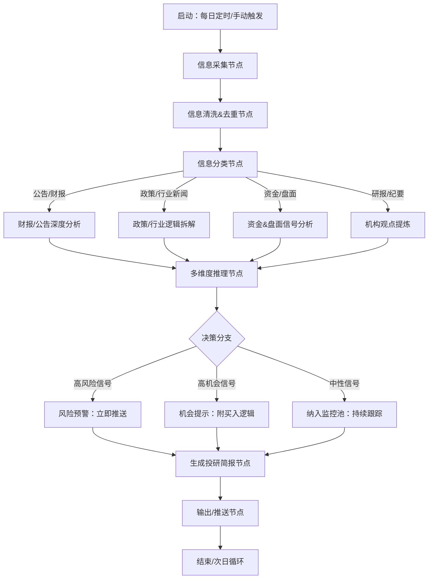

针对你「A股主板科技企业二级市场投资」的核心诉求（解决信息过载、踩雷、错过机会、分析慢），我为你设计一套 **可落地、机构级、贴合A股规则** 的 LangGraph 投研 Agent，全程围绕「A股科技股投研逻辑」定制，你可以直接落地开发，也能明确外包/自研的核心方向。

# 一、Agent 核心定位
**A股科技企业智能投研助理**
- 核心目标：24h 盯盘/盯信息 → 快速筛选有效信号 → 深度分析 → 风险预警 → 机会提示
- 适配场景：主板科技股（半导体、信创、人工智能、算力、消费电子等），贴合A股政策导向、财报规则、资金逻辑
- 核心价值：把你从“海量信息筛选”解放到“核心决策”，解决「看不过来、分析慢、踩雷、错过机会」四大痛点

# 二、Agent 整体架构（LangGraph 核心工作流）
LangGraph 的核心是「多节点+决策分支+循环执行」，我按 A 股投研逻辑拆分为 8 个核心节点，附决策分支（比如“高风险信号直接触发预警”）：



## 每个节点的核心功能（贴合 A 股科技股）
### 1. 信息采集节点（解决“看不过来”）
**采集范围（精准聚焦 A 股科技股）**：
- 官方渠道：上交所/深交所公告（业绩、减持、并购、定增、监管问询）、证监会政策、工信部/科技部产业政策
- 市场信息：同花顺/东方财富资金流向（主力/北向/游资）、龙虎榜、涨停/跌停原因、行业板块异动
- 投研信息：券商科技行业研报、电话会议纪要、产业调研纪要
- 产业信息：供应链数据（如半导体出货量、算力招标）、科技企业产品发布会、专利公告

**采集方式**：
- 免费：公开 API（如东方财富公开接口）、网页爬取（合规范围内）
- 付费（推荐）：Wind/同花顺iFinD/Choice 数据接口（机构级数据，准确率100%）

### 2. 信息清洗&去重节点
- 过滤无效信息（如重复公告、无关新闻）
- 标准化格式（如把财报表格转为结构化数据、把研报长文提取核心观点）
- 关联标的（自动把信息和你关注的科技股池绑定）

### 3. 信息分类节点
按 A 股投研逻辑分类，方便后续针对性分析：
| 分类         | 分析重点                                  |
|--------------|-------------------------------------------|
| 财报/公告    | 营收/利润增速、研发投入、应收账款、商誉、减持比例 |
| 政策/行业新闻 | 政策力度、受益产业链环节、是否有落地细则        |
| 资金/盘面    | 资金净流入规模、涨停封单、北向资金买卖方向      |
| 研报/纪要    | 机构目标价调整、核心逻辑（如算力需求超预期）    |

### 4. 深度分析节点（解决“分析太慢”）
针对不同分类的信息，做 A 股科技股专属分析：
#### （1）财报/公告深度分析
- 核心指标拆解：营收/利润（同比/环比）、研发费用率、毛利率（科技股核心）、现金流（避免踩雷）
- 异常指标预警：商誉占比过高、应收账款激增、存货积压（科技股常见雷点）
- 对比分析：和同行业公司对比、和业绩预告对比、和机构预期对比

#### （2）政策/行业逻辑拆解
- 政策受益度打分：直接受益（如算力招标中标企业）> 间接受益（如产业链配套）
- 持续性判断：短期政策（如补贴）vs 长期政策（如产业规划）
- 关联标的筛选：按业务匹配度筛选你关注池中的科技股

#### （3）资金&盘面信号分析
- 异动原因：是政策驱动、业绩驱动还是游资炒作
- 资金性质：北向资金（长期）vs 游资（短期）vs 机构（中线）
- 趋势判断：是否突破关键价位、成交量是否有效放大

#### （4）机构观点提炼
- 核心结论：看多/看空/中性，目标价上调/下调幅度
- 核心逻辑：机构看好的核心点（如技术突破、订单超预期）
- 一致性判断：多家机构是否达成共识

### 5. 多维度推理节点（解决“踩雷、错过机会”）
核心是结合 A 股科技股的投资逻辑，输出「机会/风险评分」（0-10分）：
#### 机会评分维度（科技股重点）：
- 政策契合度（如是否符合“数字经济”“自主可控”）
- 业绩增速（营收/利润是否超预期）
- 资金认可度（北向/机构是否加仓）
- 产业逻辑（如算力需求是否持续、半导体国产替代进度）
#### 风险评分维度（科技股重点）：
- 财务风险（商誉、现金流、应收账款）
- 监管风险（问询函、减持、违规披露）
- 行业风险（如技术路线迭代、行业产能过剩）
- 估值风险（PE/PB 是否远超行业均值）

### 6. 决策分支节点（核心：区分优先级）
- 高风险（评分≥8）：立即推送（短信/企业微信），附“风险点+建议操作（减仓/清仓）”
- 高机会（评分≥8）：推送机会提示，附“核心逻辑+目标价+止损位”
- 中性信号：纳入监控池，持续跟踪后续变化（如政策落地进度、资金持续流入情况）

### 7. 生成投研简报节点
输出**机构级极简简报**（不用看长篇大论），格式示例：
```
【A股科技股投研简报-2026.03.16】
1. 高机会标的：XX科技（60XXXX）
   - 核心逻辑：算力服务器订单超预期，Q1营收预增50%
   - 资金信号：北向资金近3日加仓2亿
   - 操作建议：逢低布局，目标价18元，止损价12元
2. 高风险标的：XX半导体（00XXXX）
   - 风险点：年报商誉减值3亿，现金流为负
   - 操作建议：立即减仓，避免踩雷
3. 中性信号：信创行业政策落地，持续跟踪XX软件（60XXXX）
```

### 8. 输出/推送节点
- 推送渠道：企业微信/钉钉（优先）、短信（紧急）、邮件（完整简报）
- 输出格式：文字（紧急）、PDF（完整日报）、Excel（关注池评分表）

# 三、关键落地细节（贴合 A 股&LangGraph 特性）
## 1. LLM 选型（性价比最高）
- 核心分析：Claude 3 Sonnet（性价比高，长文本分析强，适合财报/研报解读）
- 极速响应：Claude 3 Haiku（用于实时盘面/资金信号分析）
- 本地化（可选）：如果涉及敏感数据，用智谱清言/通义千问（国内大模型，合规）

## 2. 工具调用（LangGraph 核心能力）
Agent 需要调用的工具，直接对接 A 股数据：
| 工具类型         | 推荐工具                  | 作用                          |
|------------------|---------------------------|-------------------------------|
| 数据查询         | Wind/iFinD API            | 精准获取财报/资金/政策数据    |
| 行情查询         | 东方财富公开 API          | 实时股价/成交量/板块异动      |
| 文本分析         | LLM（Claude/智谱）        | 研报/纪要/公告解读            |
| 风险评分         | 自定义函数                | 按科技股风险指标打分          |
| 推送             | 企业微信/钉钉 API         | 实时推送预警/机会             |

## 3. 关注池管理（核心：聚焦你的标的）
- 手动维护：你关注的 A 股主板科技股池（如 50 只核心标的）
- 自动更新：根据行业政策/资金流向，自动新增潜在标的（如算力板块新标的）

## 4. 避坑点（A 股专属）
- 合规性：爬取数据仅限公开信息，避免使用非合规数据源
- 时效性：A 股交易时间（9:30-11:30/13:00-15:00）需实时采集，非交易时间采集公告/政策
- 本土化：LLM 需适配 A 股术语（如“北向资金”“龙虎榜”“定增”），提示词中明确说明

<!-- # 四、落地步骤（从易到难，快速见效）
### 第一步（1-2 周）：最小可用版本（解决“看不过来”）
- 只做：信息采集 + 简单分类 + 简报生成
- 数据源：先用免费公开 API（东方财富），聚焦你最关注的 10 只科技股
- 输出：每日极简简报（仅核心信息）

### 第二步（2-4 周）：核心功能版本（解决“分析慢、错过机会”）
- 新增：深度分析节点 + 机会/风险评分 + 推送功能
- 数据源：接入 Wind/iFinD（付费，精准数据）
- 输出：机会/风险提示 + 操作建议

### 第三步（1-2 月）：完整版本（解决“踩雷”）
- 新增：循环监控（持续跟踪标的） + 财务风险预警 + 机构观点整合
- 优化：LLM 推理逻辑（更贴合 A 股科技股投资逻辑） -->

# 四、核心价值总结
1. 效率提升：每天节省 2-4 小时信息筛选/分析时间，聚焦核心决策
2. 风险规避：提前预警财务雷、监管雷，避免踩坑
3. 机会捕捉：快速抓住政策/业绩/资金驱动的机会，不缺席主线
4. 体系化：把你的投资逻辑固化为 Agent 工作流，避免情绪化决策

### 关键点回顾
1. 核心架构：信息采集→分类分析→多维度推理→决策分支→简报推送，贴合 A 股科技股投研逻辑；
2. 核心痛点解决：信息过载（精准采集）、分析慢（LLM 自动化）、踩雷（风险评分）、错过机会（实时预警）；
3. 落地节奏：先做最小可用版本（1-2 周见效），再逐步完善核心功能。
